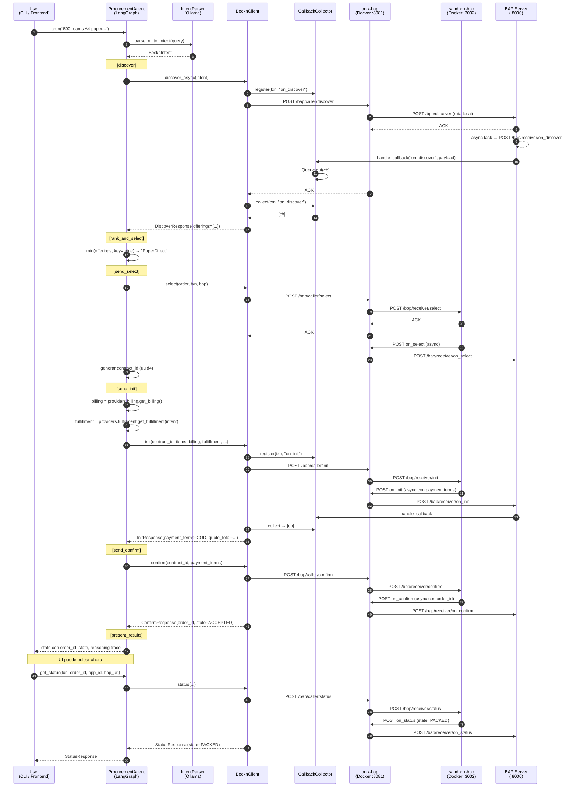
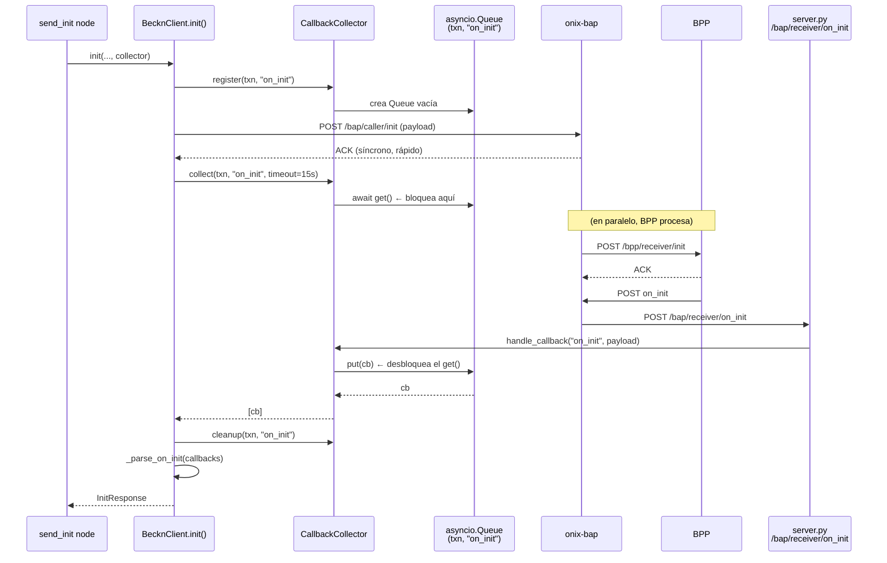
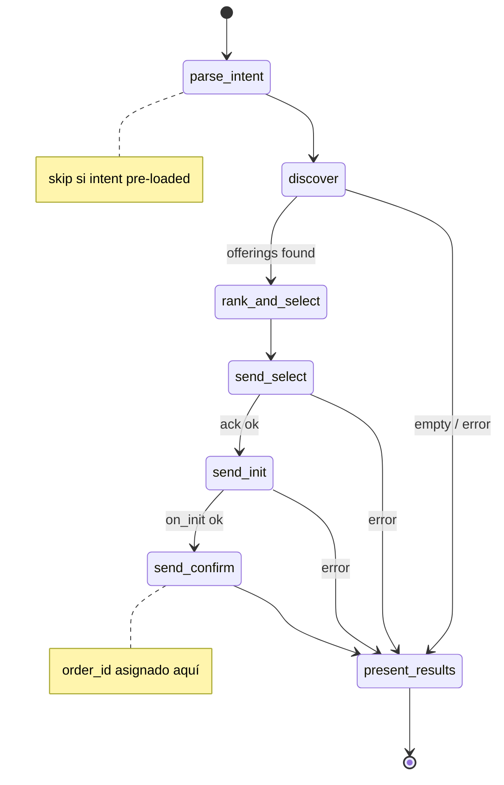

# Arquitectura — BAP-1 Procurement Agent (Fase 2)

> Estado del sistema al cierre del milestone **Full Transaction Flow**.
> Documenta **lo implementado**, no el diseño teórico (ese está en `KnowledgeBase/project_scaffold/milestones/`).

---

## 1. Arquitectura de componentes

```
┌─────────────────────────────────────────────────────────────────┐
│                    Frontend (Next.js :3000)                      │
│  login/ · dashboard/ · request/new/                              │
│  api/procurement/parse · api/procurement/discover                │
└──────────────────────┬──────────────────────────────────────────┘
                       │ HTTP
                       ▼
┌─────────────────────────────────────────────────────────────────┐
│                 BAP Server (aiohttp :8000)                       │
│                  Bap-1/src/server.py                             │
│                                                                  │
│   POST /parse            → IntentParser (Ollama qwen3:1.7b)      │
│   POST /discover         → ProcurementAgent.arun_with_intent()   │
│   POST /bap/receiver/*   → CallbackCollector (on_*)              │
│   POST /bpp/discover     → _LOCAL_CATALOG (shortcut dev)         │
└──────┬──────────────────────────────────┬──────────────────────┘
       │                                  │
       ▼                                  ▼
┌──────────────────┐            ┌────────────────────────────────┐
│ ProcurementAgent │            │        CallbackCollector       │
│   (LangGraph)    │            │  dict[(txn_id, action) → Queue]│
│                  │◄───────────┤  register → put → collect      │
│  parse_intent    │            └────────────────────────────────┘
│  discover                                     ▲
│  rank_and_select                              │
│  send_select                                  │
│  send_init       │                            │
│  send_confirm    │                            │
│  present_results │                            │ on_* callbacks
│                  │                            │
│  get_status ←─── standalone, no grafo         │
└────────┬─────────┘                            │
         │ HTTP :8081                           │
         ▼                                      │
┌─────────────────────────────────────────────────────────────────┐
│            beckn-onix adapter (Go, Docker :8081)                 │
│  ED25519 signing · Schema validation · Registry lookup (DeDi)    │
└──────────────────────────┬──────────────────────────────────────┘
                           │
                           ▼
        ┌────────────────────────────────────────┐
        │  sandbox-bpp (Docker :3002)            │
        │  o BPPs reales en red Beckn (ONDC)     │
        └────────────────────────────────────────┘
```

---

## 2. Inventario archivo por archivo

### Beckn protocol layer — `Bap-1/src/beckn/`

| Archivo | Clases / funciones clave | Responsabilidad |
|---|---|---|
| `models.py` | `BecknContext`, `BecknIntent`, `BudgetConstraints`, `DiscoverOffering`, `DiscoverResponse`, `SelectOrder`, `SelectedItem`, `SelectProvider`, `Address`, `BillingInfo`, `FulfillmentInfo`, `PaymentTerms`, `OrderState` (enum), `InitResponse`, `ConfirmResponse`, `StatusResponse`, `CallbackPayload`, `AckResponse` | **Pydantic v2 models** del protocolo. Wire format camelCase + Python snake_case. `BecknIntent` viene de `shared/models.py` |
| `adapter.py` | `BecknProtocolAdapter` con `build_*_wire_payload()` para discover/select/init/confirm/status + helpers internos `_billing_dict`, `_fulfillment_dict`, `_payment_dict`, `_build_commitments`, `_wire_context` | **Construye payloads Beckn v2** (camelCase) + URL builders (`discover_url`, `select_url`, `caller_action_url(action)`) |
| `client.py` | `BecknClient` con `discover_async()`, `discover()`, `select()`, `init()`, `confirm()`, `status()` + parsers internos `_parse_on_init/confirm/status`, `_parse_on_discover` | **Cliente HTTP async** (aiohttp). Orquesta: register queue → POST → collect callback → parse |
| `callbacks.py` | `CallbackCollector.register()`, `handle_callback()`, `collect()`, `cleanup()` | **Correla** callbacks async del ONIX a la llamada Python que los espera, por `(txn_id, action)` |

### Providers (swap mock ↔ real) — `Bap-1/src/beckn/providers/`

| Archivo | Protocol / Class | Para qué |
|---|---|---|
| `billing.py` | `BillingProvider` (Protocol), `ConfigBillingProvider` | Entrega `BillingInfo` para `/init`. Swap futuro: `DatabaseBillingProvider` |
| `fulfillment.py` | `FulfillmentProvider` (Protocol), `ConfigFulfillmentProvider` | Entrega `FulfillmentInfo` (dirección de delivery + coords) para `/init` |
| `payment.py` | `PaymentProvider` (Protocol), `CODPaymentProvider`, `build_cod_provider()` | Propone `PaymentTerms` para `/confirm` (hoy COD; mañana UPI/Razorpay) |
| `__init__.py` | `ProviderBundle` (dataclass), `build_providers(config)` | **Único punto de swap** — cambias 1 línea aquí y todo el grafo usa la fuente nueva |

### Agent layer — `Bap-1/src/agent/`

| Archivo | Clases / funciones | Responsabilidad |
|---|---|---|
| `state.py` | `ProcurementState` (TypedDict) — 16 campos: request, intent, offerings, selected, select_ack, contract_id, billing, fulfillment, init_response, payment_terms, confirm_response, order_id, order_state, status_response, messages, error, user_id | **Memoria compartida** del ReAct loop. `messages` tiene reducer append-only |
| `nodes.py` | `make_nodes(client, collector, providers, timeouts)` factory → 8 async functions: `parse_intent`, `discover`, `rank_and_select`, `send_select`, `send_init`, `send_confirm`, `send_status`, `present_results` | **Lógica de cada paso** del grafo ReAct. Cada nodo: lee state → llama client/provider → retorna partial state dict |
| `graph.py` | `build_graph()` + `ProcurementAgent` con `arun()`, `arun_with_intent()`, `get_status()` | **LangGraph StateGraph** + API pública de alto nivel |
| `__init__.py` | Re-exports `ProcurementAgent`, `ProcurementState` | Public API del paquete |

### NLP — `Bap-1/src/nlp/`

| Archivo | Responsabilidad |
|---|---|
| `intent_parser_facade.py` | Facade `parse_nl_to_intent(query) → BecknIntent \| None` — aísla al Bap-1 de los internals de `IntentParser/` |

### Infrastructure — `Bap-1/src/`

| Archivo | Responsabilidad |
|---|---|
| `config.py` | `BecknConfig` (pydantic-settings) — lee `.env`, expone defaults. Incluye buyer_*, delivery_*, default_payment_* |
| `server.py` | aiohttp server puerto 8000. Rutas: `/parse`, `/discover`, `/bap/receiver/{action}`, `/bpp/discover` (local catalog). Singleton `collector` compartido |

### Mocks / test — `Bap-1/`

| Archivo | Qué mockea |
|---|---|
| `mock_onix.py` | Simula el onix-bap (Go) en Python puro. Implementa todos los endpoints `/bap/caller/*` con callbacks asíncronos. Usado por **tests unitarios** |
| `mock_bpp.py` | Legacy v1 — no se usa en Fase 2 |
| `run.py` | Entry point end-to-end contra el stack real. Crea `ProcurementAgent` con `ProviderBundle`, invoca `arun(query)`, muestra trace |
| `tests/test_*.py` | 93 tests unitarios: agent (21), callbacks (10), discover (17), init (8), confirm (7), status (11), select (9), intent_parser (10) |

### Shared — `Procurement-Agent/shared/`

| Archivo | Responsabilidad |
|---|---|
| `models.py` | `BecknIntent` + `BudgetConstraints` — **ACL** (Anti-Corruption Layer). Única fuente de verdad compartida entre Bap-1 y IntentParser |

---

## 3. Secuencia end-to-end — NL query hasta orden confirmada



---

## 4. Detalle de correlación de callbacks (cualquier acción async)



**La idea central**: el `CallbackCollector` convierte el modelo asíncrono de Beckn (callbacks HTTP separados) en una llamada `async/await` lineal en Python. Cada `(txn_id, action)` tiene su propia Queue — eso evita cross-talk entre transacciones concurrentes.

---

## 5. Estados del grafo LangGraph



`send_status` **no está en el grafo principal** — se invoca por separado vía `ProcurementAgent.get_status()` para polling desde la UI.

---

## 6. Punto de swap mock → real

Toda la migración de fuentes (billing, fulfillment, payment) vive en **un solo archivo**:

**`Bap-1/src/beckn/providers/__init__.py`** → `build_providers(config)`:

```python
return ProviderBundle(
    billing=ConfigBillingProvider(config),         # ← swap aquí
    fulfillment=ConfigFulfillmentProvider(config), # ← swap aquí
    payment=build_cod_provider(config),            # ← swap aquí
)
```

### Ejemplos de swap futuro

| Escenario | Cambio |
|---|---|
| Billing desde tabla `user_profiles` | `ConfigBillingProvider(config)` → `DatabaseBillingProvider(db_pool)` |
| Payment con UPI / Razorpay | `build_cod_provider(config)` → `UPIPaymentProvider(gateway)` |
| Fulfillment con geocoding real | `ConfigFulfillmentProvider(config)` → `GeocodedFulfillmentProvider(maps_client, config)` |

**Garantía**: adapter, client, nodes, graph y tests **no se tocan**. La firma de los Protocols (`BillingProvider`, `FulfillmentProvider`, `PaymentProvider`) es lo único que debe respetarse.

---

## Referencia cruzada

- Diseño original (16 semanas): `KnowledgeBase/project_scaffold/milestones/phase2_core_intelligence_transaction_flow.md`
- Setup + uso: `Bap-1/README.md`, `Bap-1/CLAUDE.md`
- Schema DB (no cableado aún): `database/sql/` (18 migraciones)
- Frontend: `frontend/src/` (Next.js App Router)
