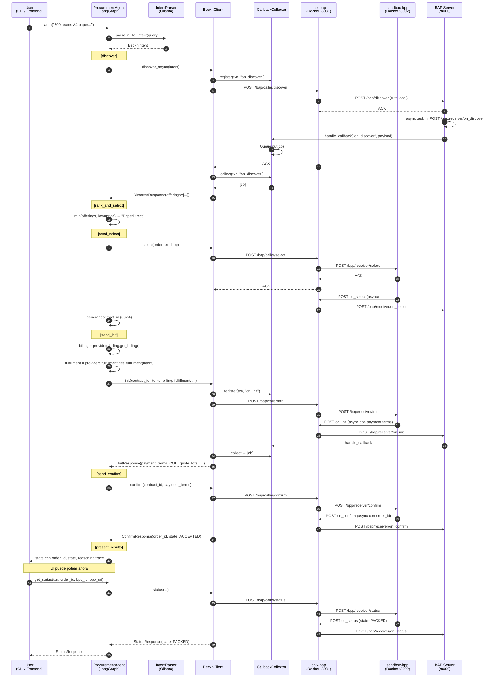
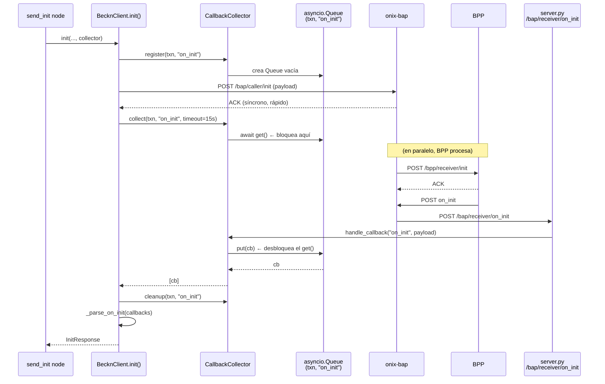
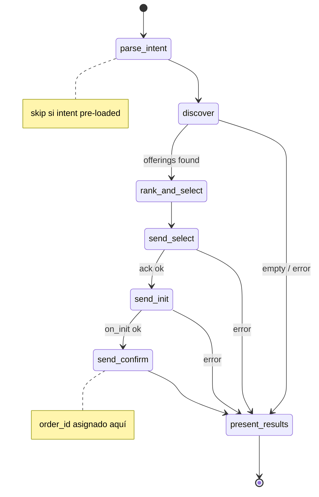

# Arquitectura — BAP-1 Procurement Agent (Fase 2)

> Estado del sistema al cierre de los milestones **Full Transaction Flow** y **Comparison UI**.
> Documenta **lo implementado**, no el diseño teórico (ese está en `KnowledgeBase/project_scaffold/milestones/`).

---

## 1. Arquitectura de componentes

```
┌─────────────────────────────────────────────────────────────────────┐
│                      Frontend (Next.js :3000)                        │
│  /login · /dashboard · /request/new                                  │
│  /request/[txn_id]/compare · /request/[txn_id]/order                 │
│  /api/procurement/{parse, compare, commit, status}                   │
└──────────────────────────┬──────────────────────────────────────────┘
                           │ HTTP
                           ▼
┌─────────────────────────────────────────────────────────────────────┐
│                    BAP Server (aiohttp :8000)                        │
│                     Bap-1/src/server.py                              │
│                                                                      │
│   POST /parse                   → IntentParser (Ollama qwen3:1.7b)   │
│   POST /compare                 → arun_compare → session_store       │
│   POST /commit                  → session_store → arun_commit        │
│   GET  /status/{txn}/{order}    → agent.get_status                   │
│   POST /bap/receiver/*          → CallbackCollector (on_*)           │
│   POST /bpp/discover            → _LOCAL_CATALOG (6 offerings)       │
└──────┬────────────────────────────────┬────────────────────────────┘
       │                                │
       ▼                                ▼
┌──────────────────────────┐    ┌──────────────────────────────────┐
│     ProcurementAgent     │    │   TransactionSessionStore        │
│        (LangGraph)       │    │   InMemoryBackend · TTL 1800s    │
│                          │◄───┤   swap point: StateBackend       │
│  arun / arun_with_intent │    │   Protocol (TODO: Postgres)      │
│  arun_compare            │    └──────────────────────────────────┘
│  arun_commit                                  ▲
│  get_status                                   │
│                                               │ on_* callbacks
│  Nodes: parse_intent · discover ·             │
│         rank_and_select · send_select ·       │
│         send_init · send_confirm ·            │
│         send_status · present_results         │
└────────┬─────────────────────────────────────┘
         │ HTTP :8081
         ▼
┌─────────────────────────────────────────────────────────────────────┐
│              beckn-onix adapter (Go, Docker :8081)                   │
│    ED25519 signing · Schema validation · Registry lookup (DeDi)      │
└──────────────────────────┬──────────────────────────────────────────┘
                           │
                           ▼
        ┌────────────────────────────────────────┐
        │  sandbox-bpp (Docker :3002)            │
        │  o BPPs reales en red Beckn (ONDC)     │
        └────────────────────────────────────────┘
```

---

## 1b. Flujo de la Comparison UI (dos pasos)

El endpoint `/discover` original auto-commiteaba el pedido. Para habilitar la
vista comparativa, el flujo se divide en dos pasos con estado intermedio en
`TransactionSessionStore`:

```
Frontend                  BAP :8000                    ONIX / BPP
─────────                 ──────────                   ──────────
POST /parse ─────────────► Ollama → BecknIntent
POST /compare ────────────► arun_compare():
                             parse_intent → discover → rank_and_select
                             → store state by txn_id
                           ◄── offerings + scoring + reasoning_steps
(user reviews, picks)
POST /commit ─────────────► load state[txn_id]
{chosen_item_id}             override selected
                             arun_commit():
                               send_select → send_init → send_confirm ───► ONIX → BPP
                             update state[txn_id]
                           ◄── order_id + order_state + payment_terms
GET /status/{txn}/{order} ─► (recovers bpp from session)
(poll every 30 s)            agent.get_status() ──────────────────────► ONIX → BPP
                           ◄── {state, observed_at}
```

Frontend session blob (`procurement:session:<txn_id>` in `sessionStorage`)
mirrors the backend session: `{intent, comparison, chosenItemId, commit}`.
It's how `/request/[txn_id]/order` recovers the user's selection after
navigation.

---

## 2. Inventario archivo por archivo

### Beckn protocol layer — `Bap-1/src/beckn/`

| Archivo | Clases / funciones clave | Responsabilidad |
|---|---|---|
| `models.py` | `BecknContext`, `BecknIntent`, `BudgetConstraints`, `DiscoverOffering`, `DiscoverResponse`, `SelectOrder`, `SelectedItem`, `SelectProvider`, `Address`, `BillingInfo`, `FulfillmentInfo`, `PaymentTerms`, `OrderState` (enum), `InitResponse`, `ConfirmResponse`, `StatusResponse`, `CallbackPayload`, `AckResponse` | **Pydantic v2 models** del protocolo. Wire format camelCase + Python snake_case. `BecknIntent` viene de `shared/models.py` |
| `adapter.py` | `BecknProtocolAdapter` con `build_*_wire_payload()` para discover/select/init/confirm/status + helpers internos `_billing_dict`, `_fulfillment_dict`, `_payment_dict`, `_build_commitments`, `_wire_context` | **Construye payloads Beckn v2** (camelCase) + URL builders (`discover_url`, `select_url`, `caller_action_url(action)`) |
| `client.py` | `BecknClient` con `discover_async()`, `discover()`, `select()`, `init()`, `confirm()`, `status()` + parsers internos `_parse_on_init/confirm/status`, `_parse_on_discover` | **Cliente HTTP async** (aiohttp). Orquesta: register queue → POST → collect callback → parse |
| `callbacks.py` | `CallbackCollector.register()`, `handle_callback()`, `collect()`, `cleanup()` | **Correla** callbacks async del ONIX a la llamada Python que los espera, por `(txn_id, action)` |

### Providers (swap mock ↔ real) — `Bap-1/src/beckn/providers/`

| Archivo | Protocol / Class | Para qué |
|---|---|---|
| `billing.py` | `BillingProvider` (Protocol), `ConfigBillingProvider` | Entrega `BillingInfo` para `/init`. Swap futuro: `DatabaseBillingProvider` |
| `fulfillment.py` | `FulfillmentProvider` (Protocol), `ConfigFulfillmentProvider` | Entrega `FulfillmentInfo` (dirección de delivery + coords) para `/init` |
| `payment.py` | `PaymentProvider` (Protocol), `CODPaymentProvider`, `build_cod_provider()` | Propone `PaymentTerms` para `/confirm` (hoy COD; mañana UPI/Razorpay) |
| `__init__.py` | `ProviderBundle` (dataclass), `build_providers(config)` | **Único punto de swap** — cambias 1 línea aquí y todo el grafo usa la fuente nueva |

### Agent layer — `Bap-1/src/agent/`

| Archivo | Clases / funciones | Responsabilidad |
|---|---|---|
| `state.py` | `ProcurementState` (TypedDict) + `ReasoningStep` — 17 campos incluyendo `reasoning_steps` (lista estructurada paralela a `messages`, ambos con reducer append-only) | **Memoria compartida** del ReAct loop |
| `nodes.py` | `make_nodes(...)` factory → 8 async functions. Cada nodo emite ahora `messages` (strings) y `reasoning_steps` (objetos tipados) — el UI consume los steps estructurados | **Lógica de cada paso** del grafo ReAct |
| `graph.py` | `build_graph()` (full), `build_compare_graph()` (parse+discover+rank), `build_commit_graph()` (select+init+confirm). `ProcurementAgent` expone `arun`, `arun_with_intent`, `arun_compare`, `arun_commit`, `get_status` | **LangGraph** — tres grafos compartiendo los mismos nodos |
| `session.py` | `TransactionSessionStore` + `StateBackend` Protocol + `InMemoryBackend` (TTL 1800s + sweeper). TODO: `PostgresBackend` | **Estado entre `/compare` y `/commit`** — único punto de swap a DB |
| `__init__.py` | Re-exports `ProcurementAgent`, `ProcurementState`, `ReasoningStep`, `TransactionSessionStore`, `StateBackend`, `InMemoryBackend` | Public API del paquete |

### NLP — `Bap-1/src/nlp/`

| Archivo | Responsabilidad |
|---|---|
| `intent_parser_facade.py` | Facade `parse_nl_to_intent(query) → BecknIntent \| None` — aísla al Bap-1 de los internals de `IntentParser/` |

### Infrastructure — `Bap-1/src/`

| Archivo | Responsabilidad |
|---|---|
| `config.py` | `BecknConfig` (pydantic-settings) — lee `.env`, expone defaults. Incluye buyer_*, delivery_*, default_payment_* |
| `server.py` | aiohttp server puerto 8000. Rutas frontend: `/parse`, `/compare`, `/commit`, `/status/{txn}/{order}`. Callbacks: `/bap/receiver/{action}`, `/bpp/discover` (local catalog de 6 ofertas). Singletons `collector` + `session_store` compartidos. Helper `_build_scoring(offerings, recommended)` produce el shape multi-criterio (hoy solo `price`) — TODO: reemplazar por `ScoringStrategy` inyectado |

### Mocks / test — `Bap-1/`

| Archivo | Qué mockea |
|---|---|
| `mock_onix.py` | Simula el onix-bap (Go) en Python puro. Implementa todos los endpoints `/bap/caller/*` con callbacks asíncronos. Usado por **tests unitarios** |
| `mock_bpp.py` | Legacy v1 — no se usa en Fase 2 |
| `run.py` | Entry point end-to-end contra el stack real. Crea `ProcurementAgent` con `ProviderBundle`, invoca `arun(query)`, muestra trace |
| `tests/test_*.py` | 128 tests unitarios: agent (21), callbacks (10), discover (17), init (8), confirm (7), status (11), select (9), intent_parser (10), session_store (10), compare_commit (11), scoring_builder (7), server_endpoints (10) |

### Shared — `Procurement-Agent/shared/`

| Archivo | Responsabilidad |
|---|---|
| `models.py` | `BecknIntent` + `BudgetConstraints` — **ACL** (Anti-Corruption Layer). Única fuente de verdad compartida entre Bap-1 y IntentParser |

---

## 3. Secuencia end-to-end — NL query hasta orden confirmada



---

## 4. Detalle de correlación de callbacks (cualquier acción async)



**La idea central**: el `CallbackCollector` convierte el modelo asíncrono de Beckn (callbacks HTTP separados) en una llamada `async/await` lineal en Python. Cada `(txn_id, action)` tiene su propia Queue — eso evita cross-talk entre transacciones concurrentes.

---

## 5. Estados del grafo LangGraph



`send_status` **no está en el grafo principal** — se invoca por separado vía `ProcurementAgent.get_status()` para polling desde la UI.

---

## 6. Punto de swap mock → real

Toda la migración de fuentes (billing, fulfillment, payment) vive en **un solo archivo**:

**`Bap-1/src/beckn/providers/__init__.py`** → `build_providers(config)`:

```python
return ProviderBundle(
    billing=ConfigBillingProvider(config),         # ← swap aquí
    fulfillment=ConfigFulfillmentProvider(config), # ← swap aquí
    payment=build_cod_provider(config),            # ← swap aquí
)
```

### Ejemplos de swap futuro

| Escenario | Cambio |
|---|---|
| Billing desde tabla `user_profiles` | `ConfigBillingProvider(config)` → `DatabaseBillingProvider(db_pool)` |
| Payment con UPI / Razorpay | `build_cod_provider(config)` → `UPIPaymentProvider(gateway)` |
| Fulfillment con geocoding real | `ConfigFulfillmentProvider(config)` → `GeocodedFulfillmentProvider(maps_client, config)` |

**Garantía**: adapter, client, nodes, graph y tests **no se tocan**. La firma de los Protocols (`BillingProvider`, `FulfillmentProvider`, `PaymentProvider`) es lo único que debe respetarse.

---

## 7. Known production blockers

Lo que actualmente está **stubbed, hardcoded, o deshabilitado** y tiene que cerrarse antes de que el sistema pueda interoperar con un BPP real en la red Beckn. No es una lista de deseos — son elementos donde el código deliberadamente toma atajos que funcionan contra `sandbox-bpp` pero fallarían (o generarían comportamiento incorrecto) contra un seller real.

### 7.1 Protocolo & red

| # | Bloqueante | Estado hoy | TODO marker | Fase esperada |
|---|---|---|---|---|
| 1 | **Detalles de delivery omitidos en `/init`** — dirección, GPS, contacto, timeline no viajan en el wire. El BPP no sabe dónde entregar. | `_performance_dict` devuelve `{id, status, commitmentIds}` sin `performanceAttributes` para evitar validación JSON-LD extendida que requiere un `@context` URI resolvible que Beckn v2.1 aún no publica. | `TODO(beckn-v2.1-context)` en `Bap-1/src/beckn/adapter.py::_performance_dict` | 3–4 |
| 2 | **DeDi registry: subscriber no registrado** | ONIX hace lookup de `bap.example.com` contra `https://fabric.nfh.global/registry/dedi/lookup/...` y falla silenciosamente. En sandbox esto no bloquea porque las firmas no se verifican contra el registry; en red real sí. | Sin marker — config `.env` + onboarding al registry DeDi de beckn.one | 4 |
| 3 | **Claves ED25519 de desarrollo** | El `simplekeymanager` del ONIX carga claves estáticas. Para producción: KMS/Vault, rotación, audit trail. | Sin marker — responsabilidad del equipo plataforma | 4 |
| 4 | **Discovery Service local (shortcut de dev)** | `/bpp/discover` en `server.py` actúa como catalog service local. En producción, `BAPCaller.yaml` rutea a una Discovery Service real (external ONIX registry). | Sin marker — cambio en `starter-kit/.../generic-routing-BAPCaller.yaml` | 3 |

### 7.2 Datos & lógica de negocio

| # | Bloqueante | Estado hoy | TODO marker | Fase esperada | Owner |
|---|---|---|---|---|---|
| 5 | **Catálogo hardcoded** — toda query devuelve las mismas 6 ofertas de papel A4 | `_LOCAL_CATALOG` en `server.py`. Cuando la query dice "laptops" o "oxígeno médico", igual sale papel. | Implícito — reemplazar por Catalog Normalizer | 2 (otro compañero) | Otro |
| 6 | **DB persistence: sesiones en memoria** | `TransactionSessionStore(InMemoryBackend)`. Se pierden al reiniciar el BAP. TTL 30min. | `TODO(persistence)` en `Bap-1/src/agent/session.py` | 2 (otro compañero) | Otro |
| 7 | **Ranking heurístico "cheapest wins"** | `rank_and_select` node usa `min(price)`. Schema del `/compare` response ya soporta multi-criterio, la UI pinta lo que llegue. | `TODO(comparison-engine)` en `Bap-1/src/agent/nodes.py::rank_and_select` y `Bap-1/src/server.py::_build_scoring` | 2 (otro compañero) | Otro |
| 8 | **Payment: solo COD hardcoded** | `CODPaymentProvider` devuelve `ON_FULFILLMENT / BPP`. Sin UPI, Razorpay, invoice/NET-30. | Sin marker explícito — swap en `Bap-1/src/beckn/providers/__init__.py` | 3 | Otro / Eduardo |

### 7.3 Seguridad & acceso

| # | Bloqueante | Estado hoy | TODO marker | Fase esperada |
|---|---|---|---|---|
| 9 | **Auth con stub users** | 3 usuarios hardcoded en `frontend/src/lib/auth.ts` (requester/approver/admin) con passwords en claro. NextAuth con CredentialsProvider. | Sin marker — swap a Keycloak OIDC | 4 |
| 10 | **Approval Workflow ausente** | `/commit` ejecuta sin check de threshold ni RBAC. Un "requester" puede aprobar su propia orden de ₹1.52 crore sin intermedio. | `TODO(approval-workflow)` en `Bap-1/src/server.py::commit` y `frontend/.../ConfirmCommitDialog.tsx` (prop `requiresApproval` preparada) | 2 (otro compañero) |

### 7.4 Observabilidad & ops

| # | Bloqueante | Estado hoy | TODO marker | Fase esperada |
|---|---|---|---|---|
| 11 | **Real-time tracking: polling HTTP 30s** | `StatusPoller.tsx` usa `setInterval`. La KnowledgeBase requiere WebSocket push con SLA <30s. | `TODO(realtime-ws)` en `Bap-1/src/server.py::status` y `frontend/.../StatusPoller.tsx` (interfaz `onUpdate(StatusSnapshot)` preparada para swap local) | 2 (otro compañero) |
| 12 | **Sin audit trail estructurado** | Solo `logger.info/debug` en stdout. KnowledgeBase pide Kafka → Splunk con eventos de cada acción para compliance (SOX, RTI, GDPR). | Sin marker — componente nuevo | 3 |
| 13 | **Sin CI/CD** | Los 129 tests se corren manual. No hay GitHub Actions que ejecute pytest + build + deploy. | Sin marker | 4 |
| 14 | **LLM local (Ollama)** | `IntentParser/core.py` apunta a `localhost:11434`. Para producción: LLM managed service (Bedrock, OpenAI API, Claude API) con rate limits, logging, guardrails. | Sin marker — swap en `IntentParser/core.py::_client` | 3–4 |

### Cómo leer esta tabla

- **"TODO marker"** — grep literal en el código para encontrar el punto exacto de swap.
- **"Otro compañero"** — milestones de Phase 2 asignados fuera del scope de Eduardo. Su código se enchufa en los markers listados.
- **Fase esperada** — alineada con `KnowledgeBase/project_scaffold/milestones/phase{2,3,4}_*.md`.

### Qué **sí** está production-ready hoy

Por contraste, estos componentes del código de Eduardo ya son robustos para prod (solo les falta que los blockers anteriores se cierren alrededor):

- Beckn v2.1 wire shape: `/discover`, `/select`, `/init`, `/confirm`, `/status` pasan validación contra el validador Go real.
- `CallbackCollector`: correlación async de `on_*` por `(txn_id, action)`. Seguro concurrente.
- Split `/compare` + `/commit` + `/status`: contrato limpio, multi-criterio-ready, session-persisted.
- UI de comparación: responsive, accesible (aria-sort, aria-selected, keyboard nav), dark-mode-aware.
- Test suite: 129 pruebas, cobre adapter, client, nodes, graph parciales, session store, scoring, endpoints HTTP.

---

## Referencia cruzada

- Diseño original (16 semanas): `KnowledgeBase/project_scaffold/milestones/phase2_core_intelligence_transaction_flow.md`
- Setup + uso: `Bap-1/README.md`, `Bap-1/CLAUDE.md`
- Schema DB (no cableado aún): `database/sql/` (18 migraciones)
- Frontend: `frontend/src/` (Next.js App Router)
