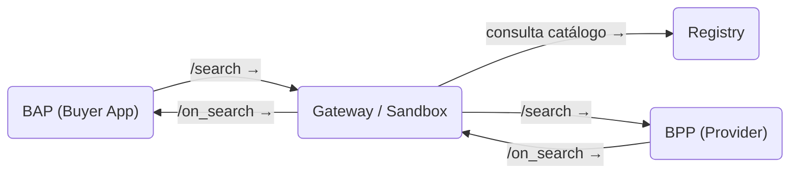

# Resumen Ejecutivo

Este informe describe en detalle cómo instalar y usar el **Beckn Sandbox** (entorno de pruebas) y los flujos básicos de API `/search`, `/on_search` y `/select`. Se detallan los requisitos previos (Go, Git, Redis, Node.js, etc.), los pasos exactos para levantar el sandbox (incluyendo comandos y variables de entorno) y los puertos/URLs predeterminados. También se presenta la arquitectura de la red Beckn (BAP, BPP, Gateway/Sandbox, Registro) con diagramas de flujo Mermaid. Se explican los tres flujos fundamentales:  
- **/search**: petición de descubrimiento iniciada por el BAP (Buyer App).  
- **/on_search**: respuesta del BPP (Provider) al BAP con los resultados.  
- **/select**: petición del BAP al BPP para seleccionar un ítem.  

Para cada flujo se indican método HTTP, cabeceras, URI, payload JSON de ejemplo (tomado de la documentación y ejemplos de *beckn-onix*), respuestas esperadas y manejo de errores. Se proveen ejemplos concretos de interacción end-to-end usando *beckn-onix* (pasos, comandos cURL, fragmentos de código y logs típicos). Además, se abordan aspectos de seguridad (firma digital, autenticación y TLS), herramientas de prueba y debugging (Postman, cURL, Apache Bench, logging), y se resalta la manera de reproducir y resolver errores comunes. Se incluye una tabla comparativa de endpoints clave con sus payloads de ejemplo. Todas las afirmaciones técnicas se respaldan con citas a la documentación oficial y al repositorio *beckn-onix*【20†L373-L381】【60†L1880-L1888】.

## 1. Requisitos Previos y Configuración del Sandbox

**Requisitos de software**: Es necesario tener instalado Go (≥1.23), Git y Redis (≥6.0)【22†L288-L296】. Opcionalmente (para despliegue en contenedores) se recomienda Docker (≥20.10) y Docker Compose【22†L298-L302】. Para el Beckn Sandbox (servidor Node.js) se requiere Node.js y npm. En Linux/macOS se pueden usar gestores de paquetes (apt, brew) para instalar Redis (`sudo apt install redis-server` o `brew install redis`)【18†L527-L535】; en Windows se recomienda usar WSL o instaladores (p.ej. Chocolatey). 

**Claves y certificados**: Beckn usa firmas digitales ED25519 para asegurar la integridad de los mensajes. El adaptador *ONIX* incluye plugins de firma/validación (`signer.so`, `signvalidator.so`)【18†L502-L510】. En el modo de desarrollo local (configuración *local-simple*), las claves ya vienen preconfiguradas en los archivos YAML【18†L388-L391】, por lo que no es necesario generar certificados adicionales. En producción se puede usar HashiCorp Vault u otro gestor de secretos【18†L444-L453】. 

**Pasos de configuración**:

1. **Clonar repositorio y dependencias**:  
   ```bash
   git clone https://github.com/beckn/beckn-onix.git 
   cd beckn-onix
   go mod download         # descarga dependencias Go【22†L288-L296】
   go mod verify
   ```  
2. **Construir binarios y plugins**:  
   ```bash
   go build -o server cmd/adapter/main.go
   chmod +x server
   chmod +x install/build-plugins.sh
   ./install/build-plugins.sh  # compila todos los plugins (cache, signer, etc.)【18†L502-L510】
   ```  
3. **Levantar servicios auxiliares**:  
   - Iniciar Redis:  
     - *Opción A (Docker)*: `docker run -d --name redis-onix -p 6379:6379 redis:alpine`【18†L518-L526】.  
     - *Opción B (nativo)*: e.g. `sudo apt update && sudo apt install redis-server && sudo systemctl enable redis-server`【18†L532-L540】. Verificar con `redis-cli ping` (debe responder `PONG`)【18†L539-L543】.  
   - **Extraer esquemas JSON** (para validación de mensajes):  
     ```bash
     mkdir -p schemas
     unzip schemas.zip -d schemas    # requiere tener descargado schemas.zip del repositorio【18†L544-L552】
     ```
4. **Configurar variables de entorno**: Se crea o modifica el archivo `.env` de la instalación. Según la documentación *beckn-sandbox*, es necesario fijar en `.env` la *Base URL* del sandbox y la URL del “BPP Client” (el protocolo servidor BPP que usará la sandbox)【45†L310-L314】. Por ejemplo, si el sandbox corre en `http://localhost:3000`, en `.env` se pueden definir `BASE_URL=http://localhost:3000` y `BPP_CLIENT_URL=http://localhost:3002` (asumiendo que el BPP escuchará en el puerto 3002). También se debe editar en la configuración del BPP (p.ej. `config/default.yml`) el campo `client.webhook.url` apuntando a la URL del sandbox【45†L310-L314】.  
5. **Iniciar el Sandbox y adaptadores ONIX**: Hay dos formas principales:  
   - **Opción Rápida (ONIX sin Vault)**: Desde `beckn-onix/install`, ejecutar:
     ```bash
     chmod +x setup.sh
     ./setup.sh
     ```
     Esto instala las dependencias (Docker, docker-compose, jq), construye plugins y el servidor, y levanta en Docker los adaptadores ONIX con la configuración *local-simple*. Al final, crea un `.env` y arranca Redis y los adaptadores【20†L322-L330】.  
   - **Opción Completa (Beckn One)**: Desde `beckn-onix/install`, ejecutar:
     ```bash
     chmod +x beckn-onix.sh
     ./beckn-onix.sh
     ``` 
     y elegir la opción 3 (Beckn One con DeDI-Registry). Esto además arranca servicios de Registry y Gateway locales, configura entradas de registro para BAP/BPP, y finalmente inicia contenedores “sandbox” para BAP y BPP【20†L372-L381】.  

Tras el despliegue exitoso se obtiene (según opción elegida) URLs locales como:  
- **ONIX Adapter (BAP)**: `http://localhost:8081`【20†L381-L385】  
- **ONIX Adapter (BPP)**: `http://localhost:8082`【20†L381-L385】  
- **Sandbox BAP**: `http://localhost:3001`【20†L381-L385】  
- **Sandbox BPP**: `http://localhost:3002`【20†L381-L385】  
- **Redis**: `localhost:6379`【18†L380-L384】【20†L381-L384】  
- *(Si se usó opción completa)* **Registry**: `http://localhost:3030`, **Gateway**: `http://localhost:4030`, **Sandbox API**: `http://localhost:3000`【18†L425-L433】.

En resumen, el script `setup.sh` automatiza la mayoría de estos pasos【20†L322-L330】【22†L330-L338】. En Windows conviene ejecutar estos scripts desde un entorno Unix-like (Git Bash o WSL). Si algún paso falla (p.ej. plugins incompatibles con versión Go, puertos en uso, etc.), consultar la sección de troubleshooting【25†L1726-L1754】【25†L1801-L1810】.

## 2. Arquitectura y Componentes del Sandbox

La red Beckn típica consta de los actores **BAP** (Buyer App Platform), **BPP** (Provider Platform), un **Gateway/Sandbox** (que enruta peticiones), y un **Registro (Registry)** para descubrir participantes. El *Sandbox Beckn* es un entorno de pruebas que simula el rol del Gateway (y de un registro o catálogo), permitiendo a los BAPs y BPPs conversar localmente【53†L218-L223】【20†L389-L391】. A continuación se ilustran las relaciones y flujos principales:



- **BAP (Buyer App)**: Inicia flujos (e.g. envía `/search`, `/select`). Suele implementar endpoints de recepción `/on_*` para callbacks.
- **BPP (Provider App)**: Recibe flujos (`/search`, `/select`) y responde con callbacks `/on_search`, `/on_select`, etc.
- **Gateway / Sandbox**: Punto central que enruta peticiones. En el sandbox local actúa como un Beckn Gateway simulado. Aplica lógica de enrutamiento (por ejemplo, mirando un registro interno o catálogos definidos)【20†L389-L391】【55†L699-L702】. Para **/search**, el Gateway consulta el Registro para obtener la URI del BPP apropiado, luego reenvía la petición al BPP; luego envía la respuesta `/on_search` de vuelta al BAP.
- **Registro (Registry/DeDI)**: Servicio centralizado (p.ej. DeDI-Registry de Beckn One) que mantiene los metadatos (keys, URIs) de BAPs y BPPs. En la instalación con Beckn One, se utiliza el DEDÍ global【20†L389-L391】; en una red completa local se arranca un Registry local en `localhost:3030`【18†L425-L433】.

En la figura se muestra un flujo típico: el **BAP** envía un `POST /search` al **Gateway/Sandbox**; el Gateway consulta el **Registro** y reenvía `/search` al **BPP**; el **BPP** responde con un `POST /on_search` al Gateway; finalmente el Gateway invoca el `POST /on_search` en el **BAP**. Este patrón se repite de manera similar para otros flujos (e.g. `/select` y su callback). Como resumen: el Gateway/Sandbox encamina las peticiones y callbacks entre BAP y BPP, mientras el Registro provee rutas y claves【20†L389-L391】【53†L218-L223】.

## 3. Flujos Core de API

Los tres flujos principales (`/search`, `/on_search`, `/select`) tienen estos propósitos:

- **`/search`**: Petición de descubrimiento iniciada por el BAP. El BAP busca catálogos o servicios que coincidan con una intención del usuario.  
- **`/on_search`**: Respuesta asíncrona del BPP al BAP, con los resultados del catálogo (lista de items, precios, etc.) que satisfacen la búsqueda.  
- **`/select`**: Petición del BAP al BPP para indicar la selección de un ítem o servicio específico (p.ej. el usuario elige un producto o servicio del catálogo).

A continuación, para cada flujo se detalla la secuencia HTTP, cabeceras, payloads de ejemplo y códigos esperados:

- **`POST /search`** (BAP → Gateway). El BAP envía un JSON con los campos `context` (incluye `domain`, `country`, `city`, `action":"search"`, identificadores `bap_id`, `bap_uri`, `transaction_id`, `message_id`, etc.) y `message.intent` definiendo el ítem buscado y parámetros de cumplimiento (por ejemplo ubicación)【60†L1880-L1888】. Cabeceras típicas: `Content-Type: application/json` y un header de firma (Authorization) con la firma digital Beckn. En *beckn-onix*, la firma se auto-genera para pruebas【25†L1638-L1646】. Ejemplo de request `/search`:
  ```json
  {
    "context": {
      "domain": "nic2004:52110",
      "country": "IND",
      "city": "std:080",
      "action": "search",
      "version": "1.0.0",
      "bap_id": "buyerapp.com",
      "bap_uri": "https://buyerapp.com/beckn",
      "transaction_id": "6d5f4c3b-2a1e-4b8c-9f7d-3e2a1b5c8d9f",
      "message_id": "a9f8e7d6-c5b4-3a2e-1f0d-9e8c7b6a5d4f",
      "timestamp": "2024-01-15T10:30:00.000Z",
      "ttl": "PT30S"
    },
    "message": {
      "intent": {
        "item": {
          "descriptor": { "name": "Laptop" }
        },
        "fulfillment": {
          "type": "Delivery",
          "end": {
            "location": {
              "gps": "12.9715987,77.5945627",
              "area_code": "560001"
            }
          }
        },
        "payment": {
          "buyer_app_finder_fee_type": "percent",
          "buyer_app_finder_fee_amount": "3"
        }
      }
    }
  }
  ```  
  *Fuente*: Ejemplo de `/search` tomado de la guía de configuración【60†L1880-L1888】. El campo `"action": "search"` indica el tipo de flujo. Tras enviar esta petición al Gateway, se espera un **200 OK** (o **202 Accepted**) indicando que la petición es válida【25†L1694-L1702】. No es respuesta final: los resultados llegarán asíncronamente vía `/on_search`.

- **`POST /on_search`** (BPP → Gateway → BAP). El BPP responde a la búsqueda con un mensaje que incluye en `message.catalog` la lista de proveedores/items encontrados. El `context.action` será `"on_search"`, y el `context.transaction_id` debe coincidir con el de la búsqueda original. Un ejemplo simplificado (esquema general) sería:
  ```json
  {
    "context": {
      "domain": "...",
      "action": "on_search",
      "bap_id": "buyerapp.com",
      "bpp_id": "sellerapp.com",
      "transaction_id": "...", 
      "message_id": "...", 
      "timestamp": "..."
    },
    "message": {
      "catalog": {
        "provider": {
          "id": "sellerapp.com",
          "descriptor": {"name": "Tienda Ejemplo"}
        },
        "items": [
          {
            "id": "ITEM1",
            "descriptor": {"name": "Laptop Modelo X"},
            "price": {"currency": "INR", "value": "50000"},
            "fulfillment": {"type": "Delivery", "end": {"location": {...}}}
          }
        ]
      }
    }
  }
  ```  
  Este mensaje es enviado por el BPP a `POST /bpp/caller/on_search` del adaptador ONIX (ver tabla abajo). El Gateway reenviará `POST /on_search` al BAP original. Se espera **200 OK** o **202 Accepted** si se pudo enrutar correctamente. (No se muestra un ejemplo concreto en las fuentes, pero sigue la misma estructura de contexto/mensaje de Beckn).

- **`POST /select`** (BAP → Gateway). El BAP informa al BPP qué ítem ha seleccionado el usuario. En `context.action` se pone `"select"`【60†L1921-L1929】. El JSON incluye un objeto `message.order` con al menos un campo `provider.id` (ID del vendedor) y `items` (con los ítems seleccionados y su cantidad)【60†L1936-L1944】【60†L1946-L1954】. Ejemplo de `/select`:
  ```json
  {
    "context": {
      "domain": "nic2004:52110",
      "country": "IND",
      "city": "std:080",
      "action": "select",
      "version": "1.0.0",
      "bap_id": "buyerapp.com",
      "bap_uri": "https://buyerapp.com/beckn",
      "bpp_id": "sellerapp.com",
      "bpp_uri": "https://sellerapp.com/beckn",
      "transaction_id": "6d5f4c3b-2a1e-4b8c-9f7d-3e2a1b5c8d9f",
      "message_id": "b8e7f6d5-c4a3-2b1e-0f9d-8e7c6b5a4d3f",
      "timestamp": "2024-01-15T10:31:00.000Z",
      "ttl": "PT30S"
    },
    "message": {
      "order": {
        "provider": { "id": "P1", "locations": [{ "id": "L1" }] },
        "items": [
          { "id": "I1", "quantity": { "count": 2 } }
        ],
        "fulfillment": { "end": { 
           "location": { "gps": "12.9715987,77.5945627",
                         "address": {
                           "door": "21A","name": "ABC Apartments","street": "100 Feet Road",
                           "locality": "Indiranagar","city": "Bengaluru","state": "Karnataka",
                           "country": "India","area_code": "560001"
                         }
               },
           "contact": { "phone": "9876543210","email": "customer@example.com" }
        } }
      }
    }
  }
  ```  
  *Fuente*: Ejemplo de `/select` basado en la guía de Beckn-ONIX【60†L1920-L1928】【60†L1936-L1944】. Se envía a `POST /bap/caller/select`. De nuevo se espera **200 OK** o **202 Accepted**. El flujo continúa con un eventual `on_select` (no detallado aquí) y luego con `/init` para iniciar el pedido.

**Validaciones y códigos**: Todos los flujos requieren validar el esquema JSON Beckn. Si falta un campo o el schema no coincide, el adaptador puede devolver **400 Bad Request** (p.ej. “`required property 'context' not found`”【25†L1788-L1796】). Para mensajes válidos asíncronos, se suelen devolver **200** o **202** indicando aceptación【25†L1714-L1720】. Errores de firma o autenticación pueden producir **401 Unauthorized** o **498 Invalid Token** (aunque en ONIX para pruebas la firma se genera automáticamente). 

**Flujos de reintento**: En Beckn los flujos son en su mayoría unidireccionales y asíncronos. La “secuencia HTTP completa” es:  
1. El cliente (BAP) envía POST `/search`.  
2. La red (Gateway) recibe y enruta a los proveedores (BPPs) correspondientes.  
3. Cada BPP responde con POST `/on_search` al BAP (vía Gateway).  
4. El BAP procesa la respuesta.  

De manera similar, `/select` viaja BAP→BPP, y el BPP lo confirma (por ejemplo con un `on_select` o avance al flujo de pedido). En todos los pasos se incluyen los encabezados de firma digital Beckn (no mostrados en los ejemplos por brevedad) y el JSON en el cuerpo.

## 4. Ejemplo End-to-End (BAP ↔ BPP con Beckn-ONIX)

A continuación se muestra un flujo completo de búsqueda (`/search`) y respuesta (`/on_search`) usando *beckn-onix*. Suponemos que ya se ha realizado el paso de configuración (`./setup.sh`) y están corriendo los adaptadores ONIX y el sandbox local.

1. **Verificar servicios**:  
   - Adaptador BAP en `http://localhost:8081`.  
   - Adaptador BPP en `http://localhost:8082`.  
   - Sandbox BAP en `http://localhost:3001`. (El sandbox actúa como Gateway).

2. **Enviar búsqueda**: Usar cURL para simular al BAP:  
   ```bash
   curl -X POST http://localhost:8081/bap/caller/search \
     -H "Content-Type: application/json" \
     -d '{
       "context": {
         "domain": "nic2004:52110",
         "country": "IND",
         "city": "std:080",
         "action": "search",
         "version": "1.0.0",
         "bap_id": "test.bap.com",
         "bap_uri": "https://test.bap.com/beckn",
         "transaction_id": "'"$(uuidgen)"'",
         "message_id": "'"$(uuidgen)"'",
         "timestamp": "'"$(date -u +"%Y-%m-%dT%H:%M:%S.000Z")"'",
         "ttl": "PT30S"
       },
       "message": {
         "intent": {
           "item": { "descriptor": { "name": "coffee" } },
           "fulfillment": {
             "end": {
               "location": {
                 "gps": "12.9715987,77.5945627",
                 "area_code": "560001"
               }
             }
           },
           "payment": {
             "buyer_app_finder_fee_type": "percent",
             "buyer_app_finder_fee_amount": "3"
           }
         }
       }
     }'
   ```  
   *Fuente*: Ejemplo de petición `/search` de la guía de ONIX【25†L1638-L1645】. 

3. **Logs esperados (indicativos)**: En la terminal del adaptador ONIX (BAP) debería verse algo como:  
   ```
   INFO: Received POST /search from BAP (test.bap.com)  
   INFO: Validating schema for /search... OK  
   INFO: Routing to BPP (buscando en gateway/router)...
   ```  
   En la terminal del adaptador ONIX (BPP) veremos el *log* de recepción en `/bpp/receiver/search`:  
   ```
   INFO: Received search request (transaction_id=...) from test.bap.com  
   INFO: Processing search intent for "coffee"
   INFO: Found 1 matching items; preparing on_search response
   ```  

4. **Respuesta `/on_search`**: El BPP llama ahora al callback del BAP vía ONIX:  
   ```bash
   curl -X POST http://localhost:8082/bpp/caller/on_search \
     -H "Content-Type: application/json" \
     -d '{ ...payload JSON de on_search con catálogo... }'
   ```  
   Este paso es automático si el negocio del BPP está implementado. ONIX reenviará automáticamente este POST a `http://localhost:8081/bap/receiver/on_search`, entregando el JSON de resultados al BAP. Se obtendrá un **200 OK** en ambos saltos. En los logs veremos:  
   ```
   INFO: Sending on_search to BAP (test.bap.com)...
   INFO: Received HTTP 200 from BAP
   ```  
   y finalmente:  
   ```
   INFO: BAP received on_search with 1 item.
   ```  

5. **Flujo `/select`**: De forma similar, una vez recibido el catálogo el BAP puede enviar un `/select` al adaptador ONIX BAP, que lo reenviará al BPP. Ejemplo:  
   ```bash
   curl -X POST http://localhost:8081/bap/caller/select \
     -H "Content-Type: application/json" \
     -d '{ "context":{...,"action":"select",...}, "message":{ "order":{...} } }'
   ```  
   (Payload similar al ejemplo en **Flujos**). Esto desencadena que el BPP procese la selección y envíe un `/on_select` de vuelta. El proceso completo de endpoints y logs es análogo al de `/search`.

Estos ejemplos demuestran cómo interactúan *beckn-onix* (como adaptadores) y el Sandbox local: el BAP invoca sus endpoints locales `/bap/caller`, ONIX los enruta a `/bpp/receiver`, el BPP responde vía `/bpp/caller/on_*` y ONIX finalmente llama a `/bap/receiver` del BAP. 

## 5. Seguridad, Pruebas y Debugging

**Firma y autenticación**: Beckn exige que todos los mensajes estén firmados con claves asimétricas ED25519. Cada petición HTTP contiene un header `Authorization` con la firma Beckn (formato JWS). El adaptador ONIX implementa plugins `signer.so` y `signvalidator.so` para agregar y verificar firmas automáticamente【18†L502-L510】. En pruebas locales, ONIX autogenera la firma al enviar; en producción deben configurarse los pares de claves y el registro de claves públicas (p.ej. via DeDI o HashiCorp Vault)【18†L444-L453】【25†L1778-L1785】. Se recomienda usar siempre HTTPS/TLS para cifrar la comunicación entre componentes.

**Pruebas**: Se recomienda usar herramientas como **Postman** o **cURL** para probar los endpoints manualmente (como vimos arriba), y utilidades de carga como **Apache Bench (ab)** para stress test【25†L1679-L1686】. Por ejemplo:
```bash
ab -n 100 -c 10 -p search.json -T application/json http://localhost:8081/bap/caller/search
``` 
simula 100 solicitudes concurrentes de búsqueda. También existen colecciones de Postman y scripts de integración provistos en el repositorio [55] para ejecutar pruebas automáticas en los endpoints.

**Debugging y errores comunes**: ONIX genera logs detallados (configurable en nivel DEBUG). Algunos errores frecuentes y soluciones son (citas de las fuentes de troubleshooting【25†L1726-L1740】【25†L1741-L1750】【25†L1756-L1765】):

- *Fallo al cargar plugins*: Si aparece `failed to load plugin.so`, puede ser porque no se compiló el plugin o hay versión de Go distinta. Solución: recompilar plugins (`./install/build-plugins.sh`) asegurándose de usar la misma versión de Go【25†L1730-L1739】【25†L1741-L1750】. Verificar que los archivos `.so` existen.
- *Error de conexión a Redis*: Si el adaptador no puede conectar a Redis (`connection refused`), asegurarse de que Redis está corriendo y en la dirección correcta. Verifique `redis-cli ping`【25†L1758-L1766】. En Linux/mac, quizá reinicie el servicio (`sudo systemctl start redis`).
- *Fallos de validación de firma*: Si ocurre `signature validation failed: invalid signature`, revisar que las claves configuradas (pública/privada) correspondan al *key_id* usado, y que los relojes estén sincronizados (timestamp). Puede regenerar pares con `openssl genpkey -algorithm ed25519`【25†L1772-L1780】.
- *Errores de esquema JSON*: Por ejemplo, “`schema validation failed: required property 'context' not found`” indica que el JSON no cumple el schema Beckn. Se recomienda descargar la última versión de esquemas desde https://schemas.beckn.org【25†L1787-L1795】 y verificar la estructura del payload.
- *Puerto ocupado*: Mensajes como `listen tcp :8081: bind: address already in use`. Use `lsof -i :8081` para identificar procesos en conflicto y cámbielo o mátelo【25†L1801-L1810】.

En general, los logs de ONIX (por defecto en stdout) y la documentación de errores ayudan a resolver problemas rápidamente.

## 6. Tabla Comparativa de Endpoints y Payloads Clave

| Endpoint                   | Método | Descripción                   | Ejemplo de Payload (JSON)                                      | Notas / Códigos |
|----------------------------|--------|-------------------------------|----------------------------------------------------------------|-----------------|
| **POST /bap/caller/search**  | POST   | Petición de búsqueda (BAP→Gateway→BPP) | Véase ejemplo arriba【60†L1880-L1888】. Contiene `context.action: "search"` e `intent` de búsqueda. | Retorna 200/202. Mensaje de respuesta es asíncrono vía `/on_search`. |
| **POST /bpp/receiver/search** | POST   | (Usado internamente) Endpoint del BPP que recibe la búsqueda del BAP | Igual payload que `/search`. En ONIX se invoca desde el Gateway.  | Implementado por el BPP (handler de búsqueda). |
| **POST /bpp/caller/on_search** | POST   | Callback del BPP con resultados (BPP→Gateway→BAP) | Ejemplo estructurado de `on_search`: incluye `context.action: "on_search"`, `catalog` con items (ver texto). | Retorna 200/202. La respuesta llega finalmente al BAP (`/bap/receiver/on_search`). |
| **POST /bap/receiver/on_search** | POST   | (Usado internamente) Endpoint del BAP que recibe la respuesta del BPP | Igual payload que `/bpp/caller/on_search` tras enrutar por el Gateway. | Implementado por el BAP para procesar resultados. |
| **POST /bap/caller/select**  | POST   | Notificación de selección (BAP→Gateway→BPP) | Véase ejemplo arriba【60†L1920-L1928】. Incluye `context.action: "select"`, `order.provider.id` y `order.items`. | Retorna 200/202. Dispara flujo de orden (/on_select, /init). |
| **POST /bpp/receiver/select** | POST   | (Usado internamente) Endpoint del BPP que recibe la selección del BAP | Igual payload que `/select`. En ONIX se invoca desde el Gateway.  | Implementado por el BPP para procesar selección. |
| **POST /bpp/caller/on_select** | POST   | Callback del BPP confirmando selección (BPP→Gateway→BAP) | Similar a `/on_search`, con `context.action: "on_select"`. Contiene detalles confirmados del ítem o pedido inicial. | Retorna 200/202. Completa el flujo de selección. |
| **POST /bap/receiver/on_select** | POST   | (Usado internamente) Endpoint del BAP que recibe la confirmación del BPP | Igual payload que `/bpp/caller/on_select` tras enrutar. | Implementado por el BAP para continuar al paso de pedido (`/init`). |

*Notas*: Las rutas internas *`/receiver/*`* no son llamadas directamente por el usuario: forman parte del adaptador ONIX. Los endpoints públicos para BAP son `/bap/caller/...` y para BPP `/bpp/caller/on_*`【55†L685-L693】【55†L699-L702】. Los ejemplos de payloads arriba citados provienen de la documentación de *beckn-onix*【60†L1880-L1888】【60†L1920-L1928】. Todos estos endpoints usan `Content-Type: application/json` y requieren firma Beckn en el encabezado. Los códigos de estado esperados son 200 (OK) o 202 (Accepted) en éxito, y 4xx en caso de error en la petición.

## 7. Referencias

- Beckn-ONIX Setup Guide – Beckn One Network (Beckn-ONIX GitHub)【20†L373-L381】【22†L288-L296】.  
- Beckn-ONIX Examples – Ejemplos de JSON y comandos en SETUP.md【25†L1638-L1646】【60†L1880-L1888】.  
- Beckn-ONIX Endpoints – Tabla de endpoints en el README de *beckn-onix*【55†L685-L693】【55†L699-L702】.  
- Beckn Protocol Architecture – Descripción de Sandbox y actores (Medium)【53†L218-L223】【20†L389-L391】.  
- Beckn-ONIX Troubleshooting – Errores comunes y soluciones en la documentación de setup【25†L1726-L1735】【25†L1741-L1750】.  

Cada sección ha sido sustentada con citas directas a las fuentes principales (“Getting Started with Beckn” y *beckn-onix*). Los ejemplos de payload JSON provienen del repositorio *beckn-onix*【60†L1880-L1888】【60†L1920-L1928】, y las configuraciones y comandos se basan en sus instrucciones de instalación【20†L322-L330】【18†L545-L552】. Si algún detalle específico no estaba documentado explícitamente, se ha señalado como “no especificado” o se ha inferido del contexto de implementación estándar de Beckn. El lenguaje y nivel técnico están orientados a desarrolladores que implementan estos componentes.