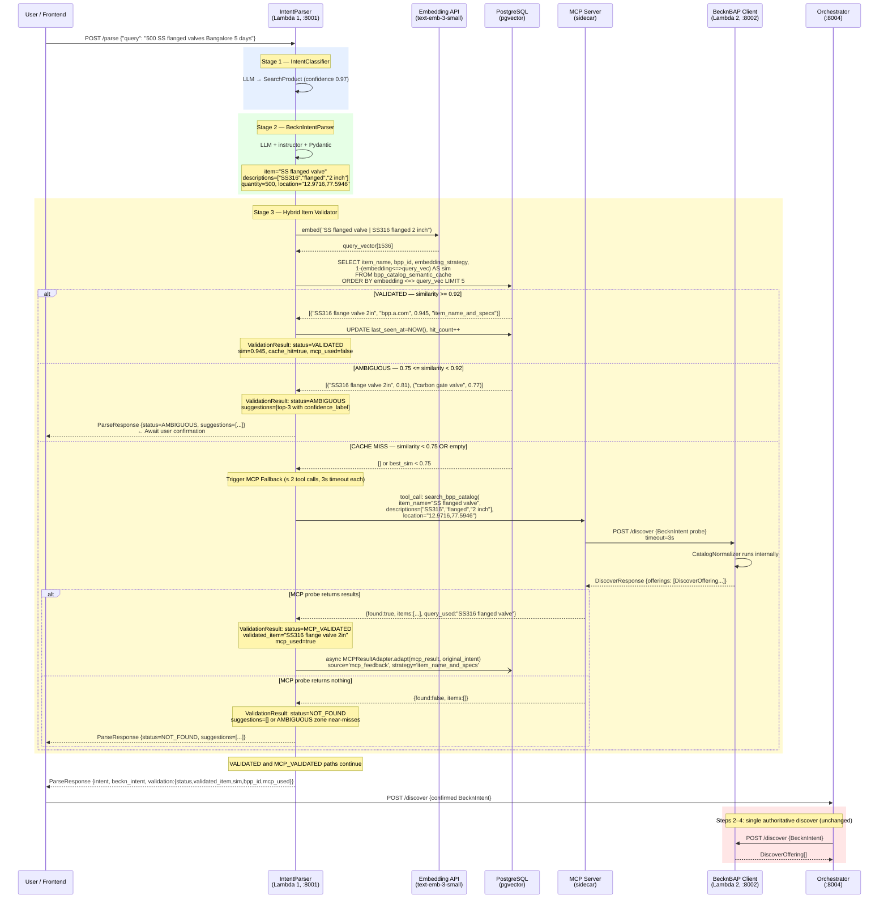

# Full System Validation Flow

## Complete Sequence Diagram

## Participants

- **User / Frontend** — Initiates the parse request; receives ParseResponse including suggestions on AMBIGUOUS
- **IntentParser** (Lambda 1, :8001) — Runs Stages 1, 2, 3; orchestrates the validation flow
- **Embedding API** (text-emb-3-small) — Produces the 1536-dim query vector for cosine search
- **PostgreSQL** (pgvector) — Hosts `bpp_catalog_semantic_cache`; returns top-5 cosine similarity candidates
- **MCP Server** (sidecar) — Exposes `search_bpp_catalog` tool; routes to BAP Client on cache miss
- **BecknBAP Client** (Lambda 2, :8002) — Target of MCP probe; `CatalogNormalizer` runs internally
- **Orchestrator** (:8004) — Routes on `validation.status`; calls Lambda 2 for authoritative discover only on VALIDATED/MCP_VALIDATED

---

## Related Notes

- [[07_Hybrid_Architecture_Overview]] — Stage 3 pipeline overview
- [[15_Three_Zone_Decision_Space]] — VALIDATED / AMBIGUOUS / CACHE MISS zone specifications
- [[18_MCP_Fallback_Tool_Overview]] — MCP sidecar design and constraints
- [[26_MCPResultAdapter]] — Async cache write after MCP_VALIDATED
