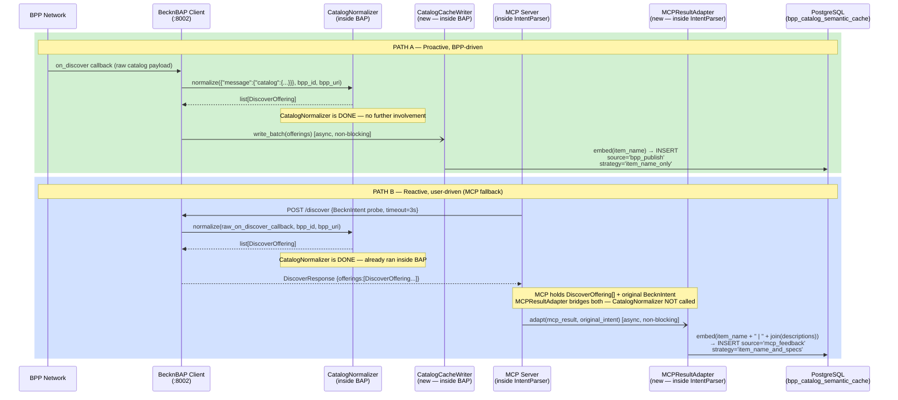

# Feedback Loop — Corrected Sequence Diagram

## Complete Mermaid Sequence Diagram

## Participants

- **BPP Network** — Source of raw `on_discover` callback payloads (Path A) and target of MCP probe discover calls (Path B)
- **BecknBAP Client** (:8002) — Hosts `CatalogNormalizer` and `CatalogCacheWriter`; processes all BPP callbacks internally
- **CatalogNormalizer** (inside BAP) — Runs exactly once per BPP payload; outputs `DiscoverOffering[]`
- **CatalogCacheWriter** (new — inside BAP) — Path A writer; async, non-blocking PostgreSQL INSERT
- **MCP Server** (inside IntentParser) — Issues bounded discover probes; holds probe results
- **MCPResultAdapter** (new — inside IntentParser) — Path B writer; bridges `DiscoverOffering[]` + `BecknIntent`; async, non-blocking
- **PostgreSQL** (bpp_catalog_semantic_cache) — Single unified store for both paths

## Key Invariant

**`CatalogNormalizer` is called exactly once per BPP payload — inside the BAP Client. It is never called from Lambda 1, never called on `DiscoverOffering` objects, and never called from `MCPResultAdapter`.**

---

## Related Notes

- [[25_CatalogCacheWriter]] — Path A writer detail
- [[26_MCPResultAdapter]] — Path B writer detail
- [[23_CatalogNormalizer_SRP_Boundary]] — Why CatalogNormalizer's boundary is inviolable
