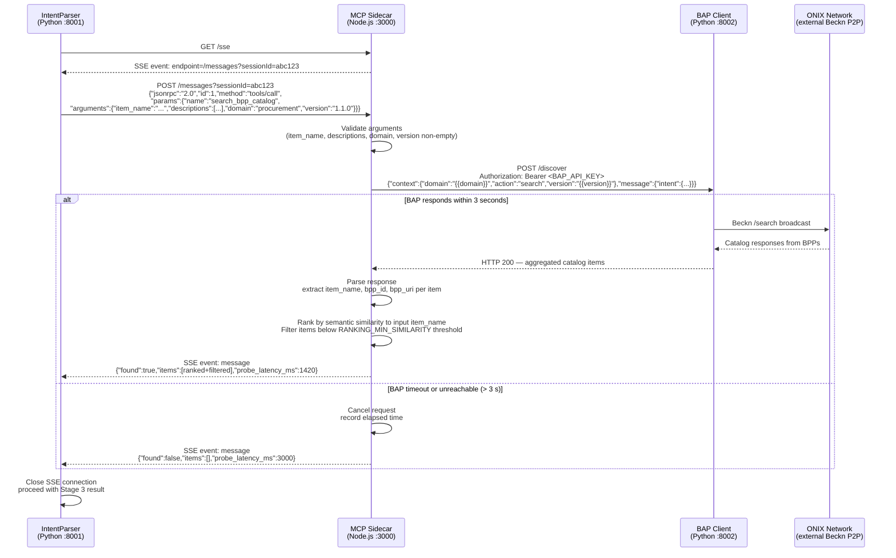

# BAP Client and ONIX Integration

This note describes how the MCP Sidecar internally invokes the BAP Client (`beckn-bap-client`, port 8002) and how that call propagates through the ONIX Beckn network. For the full design index see [[00_MCP_Sidecar_Design_MOC]].

## Internal Execution Flow

When the sidecar receives a `tools/call` JSON-RPC request for `search_bpp_catalog`, it executes the following steps in sequence:

1. **Validate input arguments against the schema.** Check that `item_name` is a non-empty string, `descriptions` is an array, `domain` is a non-empty string, and `version` is a non-empty semver-like string. If `location` is present, verify it matches the `<float>,<float>` pattern. Any validation failure short-circuits here: return `{"found": false, "items": [], "probe_latency_ms": 0}` immediately. Do not call the BAP Client.

2. **Construct the POST /discover payload.** Map the validated arguments into the Beckn `context + message.intent` envelope. Use the `domain` and `version` arguments directly — do not hardcode either field. The `item.descriptor.name` is set to `item_name`. The `item.descriptor.tags` array is populated from `descriptions`. If `location` is present and valid, populate `fulfillment.end.location.gps`; otherwise omit the `fulfillment` block. See the payload shape below.

   ```json
   {
     "context": {
       "domain": "{{domain}}",
       "action": "search",
       "version": "{{version}}"
     },
     "message": {
       "intent": {
         "item": {
           "descriptor": {
             "name": "{{item_name}}",
             "tags": ["{{descriptions[0]}}", "{{descriptions[1]}}"]
           }
         },
         "fulfillment": {
           "end": {
             "location": {
               "gps": "{{location}}"
             }
           }
         }
       }
     }
   }
   ```

3. **POST to `http://beckn-bap-client:8002/discover` with the `Authorization: Bearer <BAP_API_KEY>` header and a 3-second timeout.** The `BAP_API_KEY` value is read from the sidecar's environment at startup (injected by a Secrets Manager) and included on every outbound request. Record the wall-clock start time before the request is dispatched. The timeout is enforced by the sidecar — if the BAP Client does not respond within 3 seconds, the sidecar cancels the request and proceeds to step 5 with `found: false`. The timeout design is detailed in [[04_Timeouts_and_Failure_Handling]].

4. **Parse the ONIX response.** The BAP Client returns an aggregated response from the ONIX network — a list of catalog items from one or more BPPs that matched the search intent. For each catalog item, extract:
   - `item_name` from `catalog.items[].descriptor.name`
   - `bpp_id` from the BPP context block
   - `bpp_uri` from the BPP's registered endpoint

   If the response body is empty, malformed JSON, or contains zero items, set `found: false`.

4a. **Rank and filter results by semantic similarity to `item_name`.** Before assembling the `items[]` array, compute a lightweight semantic similarity score between the input `item_name` and each extracted `item_name` from the ONIX response (e.g., using normalised token overlap, or a fast embedding comparison if a model is available in the sidecar process). Sort the results descending by similarity score. Filter out any items whose similarity falls below the `RANKING_MIN_SIMILARITY` environment variable threshold (default: `0.3`). This ensures the returned `items[]` list contains only relevant matches — semantically noisy BPP results are discarded before they can pollute the IntentParser's Path B cache write. Business-logic ranking (price, delivery SLA, BPP rating) is explicitly out of scope for the sidecar; that responsibility belongs to the downstream Comparison Engine.

5. **Return the structured `{found, items, probe_latency_ms}` object** as the MCP tool result. Compute `probe_latency_ms` as the elapsed wall-clock time since step 3. `found` is `true` if and only if `items[]` is non-empty after ranking and filtering. The result is emitted as a `message` event on the SSE stream back to the IntentParser.

## POST /discover Payload

The following is the full request body and headers the sidecar sends to the BAP Client. Template placeholders in `{{double braces}}` are replaced by the sidecar at runtime with values from the validated tool arguments.

**Request headers:**

```
POST http://beckn-bap-client:8002/discover
Content-Type: application/json
Authorization: Bearer {{BAP_API_KEY}}
```

**Request body:**

```json
{
  "context": {
    "domain": "{{domain}}",
    "action": "search",
    "version": "{{version}}"
  },
  "message": {
    "intent": {
      "item": {
        "descriptor": {
          "name": "{{item_name}}",
          "tags": ["{{descriptions[0]}}", "{{descriptions[1]}}"]
        }
      },
      "fulfillment": {
        "end": {
          "location": {
            "gps": "{{location}}"
          }
        }
      }
    }
  }
}
```

**Notes on payload construction:**

- `domain` and `version` are sourced from the tool call arguments — they are never hardcoded in the sidecar. Default values (`"procurement"` and `"1.1.0"`) are set in the IntentParser's `config.py` and passed through the tool call. See the resolved multi-domain decision in [[00_MCP_Sidecar_Design_MOC]].
- The `tags` array is derived from `descriptions`. If `descriptions` is empty (`[]`), the `tags` array should be omitted or set to `[]` — an empty tags array is preferable to sending an array of `undefined` values.
- If `location` is absent from the tool arguments, the entire `fulfillment` block must be omitted from the payload. Sending `"gps": null` or `"gps": ""` may cause the BAP Client or ONIX gateway to reject the request.
- `BAP_API_KEY` is read from the sidecar's environment at startup. The sidecar must never log the token value. If `BAP_API_KEY` is missing from the environment, the sidecar must refuse to start (fail-fast at boot, not at request time).
- The BAP Client is responsible for populating the Beckn `context` fields that the sidecar cannot know at design time: `transaction_id`, `message_id`, `timestamp`, `bap_id`, `bap_uri`. The sidecar's payload is a minimal intent description, not a full Beckn context object.

## Sequence Diagram



## Response Mapping

The following table maps fields from the BAP Client / ONIX response to the `search_bpp_catalog` MCP tool result fields.

| BAP / ONIX Response Field | Source Path | MCP Result Field | Notes |
|---|---|---|---|
| Item descriptor name | `catalog.items[i].descriptor.name` | `items[i].item_name` | The BPP's canonical item name; may differ from the buyer's `item_name` input |
| BPP unique identifier | `context.bpp_id` (per-BPP response block) | `items[i].bpp_id` | Stable identifier used by the BAP to route subsequent Beckn actions to this BPP |
| BPP endpoint URI | `context.bpp_uri` (per-BPP response block) | `items[i].bpp_uri` | Base URI of the BPP's Beckn API; used for direct routing after discovery |
| Number of catalog items | `catalog.items.length > 0` | `found` (boolean) | `true` if at least one item is present and parseable; `false` otherwise |
| Wall-clock elapsed time | Computed by sidecar (start to response) | `probe_latency_ms` | Measured in milliseconds; on timeout this equals approximately 3000 |

## Related Notes

- [[02_search_bpp_catalog_Tool_Schema]] — the tool input schema and response contract that governs the data flowing through this integration.
- [[04_Timeouts_and_Failure_Handling]] — detailed design of the 3-second probe TTL and all failure scenarios that can occur during the BAP Client call.
