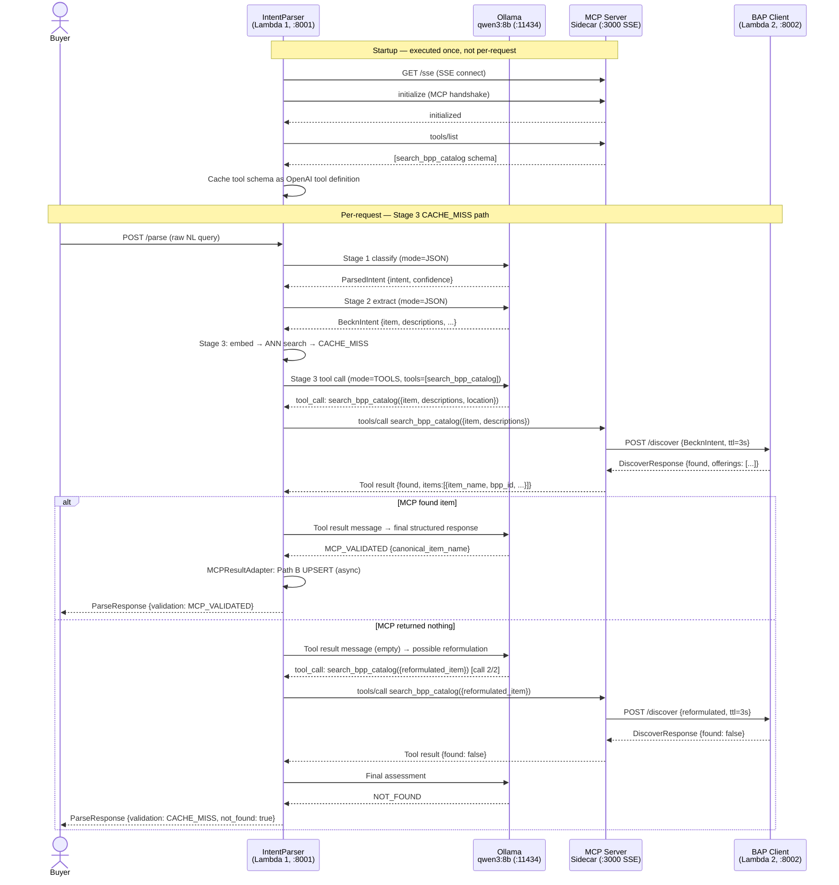

# Real MCP Server Integration

> [!abstract] Transition Summary
> **Remove:** `mock_mcp_search_bpp_catalog()` — an in-process Python dict lookup that simulates the BPP network.
> **Replace with:** A real **Model Context Protocol (MCP) server** running as an HTTP sidecar, connected to the BAP Client and the live ONIX network, with qwen3 using genuine OpenAI-compatible tool-calling to invoke it.

---

## 1. What the Mock Does (PoC)

In the PoC, `mock_mcp_search_bpp_catalog(item_name)` is a Python function inside the notebook that:
1. Looks up `item_name.lower()` against a hardcoded `_MCP_MOCK_RESPONSES` dict
2. Returns a hardcoded `{found: True, item_name, bpp_id, ...}` dict or `{found: False}`
3. Never makes a network call
4. Executes in < 1ms

This is structurally correct — the LLM reasoning loop described in [[../BPP_Item_Validation/20_MCP_LLM_Reasoning_Loop]] works the same way in production. What changes is **everything below** the function boundary.

---

## 2. MCP Transport Selection

The Model Context Protocol supports two transport mechanisms. Choosing the wrong one for a microservices deployment has significant operational consequences.

### 2a. `stdio` Transport

| Property | Detail |
|---|---|
| Mechanism | Client spawns MCP server as a **subprocess**; communication via `stdin`/`stdout` pipes |
| Latency | Negligible (IPC, in-memory) |
| Deployment | Client and server must run in the **same OS process group** |
| Lifecycle | Server is started and stopped with the client |
| Suitable for | Desktop tools, local AI assistants, single-process CLI scripts |

**Why `stdio` is NOT suitable for Lambda 1 (IntentParser):**
Lambda 1 is a containerized `aiohttp` HTTP service. Its entrypoint is a long-running async web server — not a script that spawns child processes. Managing subprocess lifecycles inside an async event loop adds complexity (signal handling, zombie processes, restart logic) that conflicts with the service's operational model. When Lambda 1 scales to multiple replicas, each replica would spawn its own subprocess, creating N independent MCP server instances with no shared state.

### 2b. SSE Transport (Server-Sent Events over HTTP)

| Property | Detail |
|---|---|
| Mechanism | MCP server exposes a standard HTTP endpoint; client connects via **SSE** (GET) for the server→client stream and **HTTP POST** for client→server messages |
| Latency | Low (~1–5ms for loopback/same-Pod HTTP) |
| Deployment | MCP server runs as an **independent container** in the same Kubernetes Pod or Docker Compose service group as Lambda 1 |
| Lifecycle | Independent — can be restarted, scaled, or replaced without touching Lambda 1 |
| Suitable for | **All microservice deployments** — this is the recommended transport for server environments |

**Why SSE is the correct choice:**
Lambda 1 is already structured around `aiohttp`. An SSE-based MCP server is just another HTTP endpoint — Lambda 1's async client makes a standard HTTP connection. The MCP server can be deployed as a sidecar container (same Pod, loopback networking), keeping inter-service latency below 5ms. Independent lifecycle management allows the MCP server to be updated (new tools, changed timeouts) without a Lambda 1 redeploy.

---

## 3. Sidecar Deployment Architecture

```
┌──────────────────────────── Kubernetes Pod / Docker Compose ──────────────────────────┐
│                                                                                        │
│  ┌─────────────────────────────────┐      ┌──────────────────────────────────────┐   │
│  │   Lambda 1 — IntentParser       │      │   MCP Server Sidecar                 │   │
│  │   aiohttp, port :8001           │      │   Python MCP SDK (SSE transport)     │   │
│  │                                 │      │   port :3000                         │   │
│  │  ┌───────────────────────────┐  │      │                                      │   │
│  │  │  Stage 3 Cache Miss       │  │─────▶│  GET  /sse     (SSE stream)          │   │
│  │  │  → MCP Client (SSE)       │  │◀─────│  POST /message (tool invocations)   │   │
│  │  │  → tools/list (startup)   │  │      │                                      │   │
│  │  │  → tools/call (per miss)  │  │      │  Tool: search_bpp_catalog            │   │
│  │  └───────────────────────────┘  │      │  → POST http://bap-client:8002       │   │
│  └─────────────────────────────────┘      └──────────────────────────────────────┘   │
│                                                                                        │
└────────────────────────────────────────────────────────────────────────────────────────┘
              │                                          │
              ▼                                          ▼
    Ollama (:11434)                          BAP Client Lambda 2 (:8002)
    qwen3:8b / qwen3:1.7b                    → ONIX Gateway
                                             → BPPs (via on_discover callback)
```

The MCP server is a thin adapter: it exposes the `search_bpp_catalog` tool schema over MCP protocol and, when the tool is called, issues a real HTTP request to the BAP Client. It holds no state and can be restarted at any time.

---

## 4. The `instructor` Mode Switch for Stage 3

In the PoC, Lambda 1 uses `instructor.from_openai(ollama_client, mode=instructor.Mode.JSON)` for all LLM calls. `Mode.JSON` enforces structured output via Pydantic schema injection into the system prompt. It does **not** generate `tool_calls` in the OpenAI format.

The Stage 3 MCP reasoning loop requires the LLM to issue tool calls that the MCP client can intercept and route. This requires `Mode.TOOLS`.

### The Solution: Two Instructor Clients

Do not change the existing Stage 1 and Stage 2 client (`mode=JSON`). Add a **second, purpose-specific client** for Stage 3 MCP reasoning:

| Client | Mode | Stage | Purpose |
|---|---|---|---|
| `_llm_client` | `instructor.Mode.JSON` | Stage 1 & 2 | `ParsedIntent` + `BecknIntent` structured extraction. Unchanged. |
| `_mcp_reasoning_client` | `instructor.Mode.TOOLS` | Stage 3 only | Tool-calling loop for `search_bpp_catalog`. New in production. |

Both clients share the same underlying Ollama raw client (`OpenAI(base_url=OLLAMA_BASE_URL)`). Only the instructor wrapper mode differs. Ollama supports OpenAI-compatible tool-calling for `qwen3` models.

**Important:** `Mode.TOOLS` generates `tool_calls` in OpenAI format. The tool definitions are passed at call time, not injected into the system prompt. The LLM's tool call arguments are extracted by the MCP client and forwarded to the MCP server's `tools/call` endpoint.

---

## 5. MCP Client Lifecycle in Lambda 1

### 5a. Startup: Connection and Tool Schema Caching

When Lambda 1 starts, it initializes the MCP client connection and fetches the tool schema **once** (not per request). The schema is cached in memory for the lifetime of the Lambda 1 instance.

```
Lambda 1 startup sequence:
  1. mcp_client.connect(url="http://localhost:3000/sse")
  2. mcp_client.initialize()         ← MCP handshake
  3. tools = mcp_client.list_tools() ← fetch [search_bpp_catalog schema]
  4. openai_tool_defs = convert_mcp_to_openai_tools(tools)
  5. Cache openai_tool_defs in module scope for Stage 3 use
```

### 5b. Per-Request: Stage 3 Cache Miss → Tool Call

When a Stage 3 CACHE_MISS occurs (per [[../BPP_Item_Validation/07_Hybrid_Architecture_Overview]]):

```
Per-request Stage 3 tool-calling sequence:
  1. Issue tool-enabled LLM call:
        _mcp_reasoning_client.chat.completions.create(
            model=COMPLEX_MODEL,
            messages=[system_prompt, user_intent_message],
            tools=openai_tool_defs,     ← cached at startup
            max_retries=1,
        )
  2. LLM returns tool_call: search_bpp_catalog(item_name, descriptions, location)
  3. Extract tool call arguments
  4. Forward to MCP server:
        result = await mcp_client.call_tool("search_bpp_catalog", arguments={...})
  5. Append tool result to messages, re-invoke LLM for final response
  6. LLM returns structured NOT_FOUND / MCP_VALIDATED assessment
```

This is the 4-step loop described in [[../BPP_Item_Validation/20_MCP_LLM_Reasoning_Loop]], now executing over a real network boundary.

---

## 6. Full Sequence Diagram



---

## 7. Key Invariants Preserved

- The [[../BPP_Item_Validation/21_MCP_Bounding_Constraints]] bounding constraints (max 2 tool calls, 3s timeout) are **enforced at the MCP server level**, not by the LLM. The MCP server rejects a third tool invocation and enforces the per-call timeout.
- Stage 1 and Stage 2 LLM behavior is **completely unchanged** — `Mode.JSON` is not touched.
- The `search_bpp_catalog` tool schema in the MCP server must exactly match [[../BPP_Item_Validation/19_search_bpp_catalog_Tool_Spec]]. Any divergence will cause instructor validation failures.

---

## Related Notes

- [[02_Connecting_MCP_to_ONIX_BPP]] — What the MCP server does when `search_bpp_catalog` is invoked
- [[../BPP_Item_Validation/18_MCP_Fallback_Tool_Overview]] — MCP sidecar design rationale
- [[../BPP_Item_Validation/19_search_bpp_catalog_Tool_Spec]] — Tool schema that must be replicated in the real server
- [[../BPP_Item_Validation/20_MCP_LLM_Reasoning_Loop]] — The reasoning loop this infrastructure enables
- [[../BPP_Item_Validation/21_MCP_Bounding_Constraints]] — Constraints enforced by the MCP server
- [[nl_intent_parser]] — Lambda 1 service where the MCP client lives
