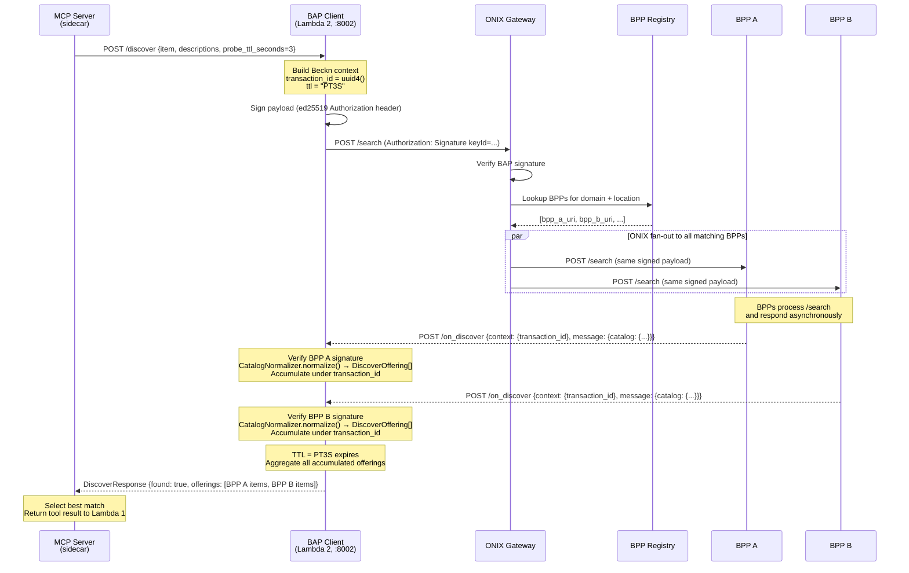

# Connecting the MCP Server to ONIX and the BPP Network

> [!abstract] Transition Summary
> **PoC:** The MCP server mock returns a hardcoded Python dict. No HTTP call is made.
> **Production:** When `search_bpp_catalog` is invoked, the real MCP server issues a signed `POST /discover` request to the BAP Client, which routes it to the **ONIX Gateway**, waits up to 3 seconds for BPP callbacks, and returns aggregated `DiscoverOffering[]` data. This note documents every network hop in that chain.

---

## 1. The MCP Server's Execution Responsibility

The MCP sidecar (described in [[01_Real_MCP_Server_Integration]]) is a thin adapter. When it receives a `tools/call search_bpp_catalog(item_name, descriptions, location)` message from Lambda 1, its sole responsibility is:

1. Build a `BecknIntentPayload` from the tool arguments
2. Issue `POST http://beckn-bap-client:8002/discover` with a **reduced timeout** (3s, per [[../BPP_Item_Validation/21_MCP_Bounding_Constraints]])
3. Await the BAP Client's aggregated response
4. Return the normalized `DiscoverOffering[]` as the tool result

The MCP server does **not** perform Beckn signing, ONIX routing, or catalog normalization. All of that lives inside the BAP Client (`beckn-bap-client`, Lambda 2). The MCP server is a protocol bridge, not a business logic layer.

---

## 2. The `POST /discover` Contract

The BAP Client exposes an internal `/discover` endpoint specifically for this use case. The request body is a `BecknIntentPayload`:

```
POST http://beckn-bap-client:8002/discover
Content-Type: application/json

{
  "item":                 "Stainless Steel Flanged Ball Valve",
  "descriptions":         ["PN16", "2 inch", "SS316", "flanged"],
  "location_coordinates": "12.9716,77.5946",
  "delivery_timeline":    120,
  "budget_constraints":   {"min": 0, "max": 5000},
  "probe_ttl_seconds":    3
}
```

The `probe_ttl_seconds: 3` field signals to the BAP Client that this is an existence probe, not a full authoritative search. It overrides the default `CALLBACK_TIMEOUT` (10s) used by the Lambda 2 buyer-facing search flow.

---

## 3. Beckn Request Signing

The BAP Client cannot relay an unsigned request to the ONIX Gateway. All Beckn network calls must carry a cryptographic `Authorization` header proving the sender's identity as a registered BAP.

### 3a. Authorization Header Format

```
Authorization: Signature
  keyId="<subscriber_id>|<unique_key_id>|ed25519",
  algorithm="ed25519",
  created="<unix_timestamp>",
  expires="<unix_timestamp + ttl>",
  headers="(created) (expires) digest",
  signature="<base64_encoded_ed25519_signature>"
```

| Field | Production Value |
|---|---|
| `subscriber_id` | BAP's registered ID in the ONIX subscriber registry |
| `unique_key_id` | Key pair version identifier (supports key rotation without subscriber re-registration) |
| `algorithm` | Always `ed25519` for Beckn v2.x |
| `digest` | `BLAKE-512` hash of the request body, Base64-encoded |
| `signature` | Ed25519 signature over the canonical signing string: `(created)`, `(expires)`, `digest` |

### 3b. Key Management

The BAP's **ed25519 private key** is a production secret. It must:
- Be stored in a secrets manager (AWS Secrets Manager / HashiCorp Vault), never in code or config files
- Be loaded into the BAP Client at pod startup via environment injection
- Support **zero-downtime key rotation**: the `unique_key_id` field allows the BAP to present a new key to the ONIX registry without changing its `subscriber_id`

The corresponding **public key** is registered in the ONIX subscriber registry. BPPs verify BAP request signatures against this registry entry.

---

## 4. ONIX Gateway Routing

The ONIX Gateway acts as the Beckn network orchestrator. When it receives the signed `/search` request from the BAP Client:

1. **Signature verification**: validates the BAP's `Authorization` header against the public key in the subscriber registry
2. **BPP lookup**: queries the BPP registry for providers that match the `context.domain` and `context.location` in the request
3. **Fan-out**: forwards the `/search` request to each matching BPP simultaneously (not sequentially)
4. **Callback brokering**: BPPs are instructed to send `/on_discover` responses to the BAP's registered callback URL

The BAP Client's callback URL is registered at BAP onboarding time. For the MCP probe path, the callback URL is the same as the buyer-facing search flow. The BAP Client disambiguates probe callbacks from authoritative-search callbacks using the `transaction_id` in the `context` object.

---

## 5. The Async Callback Window

The Beckn protocol is **fundamentally asynchronous**. The BAP does not receive BPP responses as a synchronous HTTP response to its `/search` request. Instead:

```
BAP sends:    POST /search  →  ONIX  →  BPPs
BAP receives: POST /on_discover (from each BPP, asynchronously, within TTL)
```

### 5a. The TTL Window

The `context.ttl` field in the `/search` payload specifies how long the BAP will wait for callbacks. The BAP Client manages two separate TTL windows:

| Context | TTL | Purpose |
|---|---|---|
| MCP existence probe (this note) | `PT3S` (3 seconds) | Confirm item exists in at least one BPP |
| Buyer-facing authoritative search | `PT10S` (10 seconds) | Retrieve all available offerings for comparison |

The 3-second TTL means BPPs that respond after 3 seconds are **silently missed** by the MCP probe. This is accepted per [[../BPP_Item_Validation/21_MCP_Bounding_Constraints]] — the probe only needs to confirm existence, and Lambda 2's subsequent authoritative search (with the full 10s TTL) will retrieve all offerings.

### 5b. BAP Client Aggregation

The BAP Client uses an in-memory accumulator keyed by `transaction_id`. Within the TTL window:

```
For each incoming POST /on_discover:
  1. Verify BPP signature (Authorization header)
  2. Extract raw catalog payload from {"message": {"catalog": {...}}}
  3. CatalogNormalizer.normalize(payload, bpp_id, bpp_uri) → DiscoverOffering[]
  4. Append to accumulator[transaction_id]

On TTL expiry:
  5. Close accumulator
  6. Return DiscoverResponse {transaction_id, offerings: [all accumulated DiscoverOffering[]]}
```

The BAP Client then returns this `DiscoverResponse` as the HTTP response to the MCP server's `POST /discover` request (from step 2 of [[#1. The MCP Server's Execution Responsibility]]).

---

## 6. Full Network Sequence Diagram



---

## 7. What the MCP Server Returns to Lambda 1

After receiving the `DiscoverResponse`, the MCP server:

1. Checks if `offerings` is non-empty (`found: true`)
2. Selects up to 3 best-matching offerings (by `item_name` lexical similarity to the query)
3. Maps `DiscoverOffering` fields to the tool result schema defined in [[../BPP_Item_Validation/19_search_bpp_catalog_Tool_Spec]]:
   - `offering.item_name` → `items[].item_name`
   - `offering.provider_id` → `items[].provider_id`
   - `bpp_id` (from `context`) → `items[].bpp_id`
   - `bpp_uri` (from `context`) → `items[].bpp_uri`
4. Includes `probe_latency_ms` (wall-clock time of the `POST /discover` call)

If `offerings` is empty (no BPP responded within the TTL, or all responded with empty catalogs), the tool result is `{found: false, items: [], probe_latency_ms: N}`.

---

## 8. Disambiguation: Probe vs. Authoritative Search

A critical invariant: **the MCP probe is not a replacement for the Lambda 2 authoritative discover call.**

| Dimension | MCP Probe (this note) | Lambda 2 Authoritative Search |
|---|---|---|
| Purpose | Confirm item existence | Retrieve full offering list for comparison |
| TTL | 3 seconds | 10 seconds |
| Triggered by | Stage 3 CACHE_MISS in Lambda 1 | `VALIDATED` or `MCP_VALIDATED` status in Orchestrator |
| Result | `{found: bool, items: [top 3]}` | Full `DiscoverOffering[]` for Comparison Engine |
| BPP coverage | Subset (fast-responding BPPs only) | Full network coverage |
| Side effect | Path B cache write (via MCPResultAdapter) | No cache write |

Both calls flow through the same BAP Client endpoint with different TTL values. The authoritative Lambda 2 call always follows a positive validation outcome and must never be replaced or skipped.

---

## Related Notes

- [[01_Real_MCP_Server_Integration]] — The MCP server sidecar that issues the `POST /discover`
- [[03_Real_CatalogNormalizer_Integration]] — How `CatalogNormalizer` processes the `on_discover` callbacks
- [[../BPP_Item_Validation/18_MCP_Fallback_Tool_Overview]] — MCP sidecar design intent
- [[../BPP_Item_Validation/21_MCP_Bounding_Constraints]] — 3s timeout and max-2-call constraints
- [[../BPP_Item_Validation/23_CatalogNormalizer_SRP_Boundary]] — Why normalization lives inside the BAP Client
- [[beckn_bap_client]] — Lambda 2 / BAP Client service implementation
