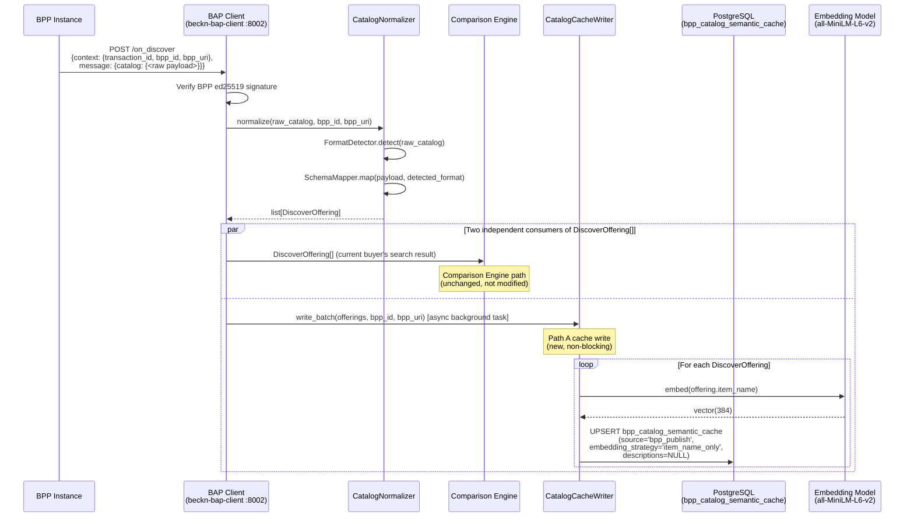

# Real CatalogNormalizer Integration

> [!abstract] Transition Summary
> **Remove:** `mock_catalog_normalizer_path_a()` — an in-notebook function returning a hardcoded list of 3 BPP items.
> **Replace with:** The production event flow where real BPPs fire `POST /on_discover` callbacks to the BAP Client. The existing `CatalogNormalizer` (already implemented in `beckn-bap-client`) processes each callback, and `CatalogCacheWriter` runs as a post-normalization async side effect to populate the semantic cache via **Path A**.

---

## 1. What the Mock Does (PoC)

In the PoC, `mock_catalog_normalizer_path_a()` returns a hardcoded Python list of 3 `dict` objects representing BPP catalog items:

```
[
  {"item_name": "Stainless Steel Flanged Ball Valve 2 inch", "bpp_id": "bpp_industrial_001", ...},
  {"item_name": "Industrial HDPE Pipe 6 inch", ...},
  {"item_name": "Safety Helmet Class E Hard Hat", ...},
]
```

This list is used to seed `bpp_catalog_semantic_cache` with Path A rows before any query is processed. In production, this seed is replaced by a **continuous event-driven flow** triggered every time a BPP registers on the ONIX network or responds to any buyer's `on_discover` request.

---

## 2. Production Path A Trigger: The `on_discover` Event

The Path A cache write is triggered by two distinct production events:

| Event | Trigger Source | Frequency | Notes |
|---|---|---|---|
| **BPP Catalog Registration** | BPP proactively registers its full catalog with ONIX at startup or on update | Low (once per BPP, or on catalog change) | Provides the broadest initial cache coverage |
| **`on_discover` Callback** | Any buyer's `POST /search` to ONIX causes BPPs to respond via `/on_discover` | High (every search query) | Organic cache warming — the cache grows as the network is used |

Both events produce the same artifact: a raw BPP catalog payload arriving at the BAP Client's `POST /on_discover` handler. The integration path is identical for both.

> [!important] Separation of Concerns
> The `on_discover` callback serves **two independent purposes** simultaneously:
> 1. It returns catalog data for the **current buyer's discover response** (Comparison Engine path)
> 2. It seeds the semantic cache for **future validation queries** (CatalogCacheWriter path)
>
> These two paths are **completely decoupled**. The Comparison Engine does not write to the cache; the CatalogCacheWriter does not affect the buyer's current response.

---

## 3. The CatalogNormalizer Already Exists

A key insight from [[../BPP_Item_Validation/23_CatalogNormalizer_SRP_Boundary]]: `CatalogNormalizer` is **already implemented and tested** inside `beckn-bap-client`. It is not new infrastructure for the production transition. The production transition only adds the `CatalogCacheWriter.write_batch()` call as a new **post-normalization side effect**.

```
services/beckn-bap-client/src/
├── normalizer/
│   ├── catalog_normalizer.py      ← EXISTING — do not modify
│   ├── format_detector.py         ← EXISTING — do not modify
│   └── schema_mapper.py           ← EXISTING — do not modify
└── cache/
    └── catalog_cache_writer.py    ← NEW — added for production transition
```

The SRP boundary established in [[../BPP_Item_Validation/23_CatalogNormalizer_SRP_Boundary]] must be preserved: `CatalogNormalizer`'s source code is not changed. The `CatalogCacheWriter` is a new, separate class.

---

## 4. FormatDetector — The Four Wire Formats

The `FormatDetector` inside `CatalogNormalizer` handles the heterogeneous reality of the ONIX BPP ecosystem. BPPs may use any of four catalog envelope formats:

| Variant | Root Key | Detection Predicate | Example BPP Type |
|---|---|---|---|
| `BECKN_V2_FLAT_RESOURCES` | `resources[]` | `isinstance(catalog.get("resources"), list) and len > 0` | Modern ONDC-compliant BPPs |
| `LEGACY_PROVIDERS_ITEMS` | `providers[].items[]` | `isinstance(catalog.get("providers"), list)` | Older Beckn v1.x BPPs |
| `BPP_CATALOG_V1` | `items[]` + string `provider` | `isinstance(items[0].get("provider"), str)` | Early-adopter BPPs |
| `ONDC_CATALOG` | `fulfillments[]` + `tags[]` | `"fulfillments" in catalog and "tags" in catalog` | ONDC-specific format |

For `UNKNOWN` format (none of the above), an `LLMFallbackNormalizer` attempts to interpret the payload using an LLM. This is not relevant to the `CatalogCacheWriter` integration — the `CatalogCacheWriter` receives the **output** of `CatalogNormalizer` (normalized `DiscoverOffering[]`), not the raw payload, regardless of which format was detected.

---

## 5. The `DiscoverOffering` Output Contract

`CatalogNormalizer.normalize()` always produces a `list[DiscoverOffering]`, regardless of which input format was detected. `CatalogCacheWriter` consumes this list.

| `DiscoverOffering` Field | `CatalogCacheWriter` Usage |
|---|---|
| `item_name` | → `bpp_catalog_semantic_cache.item_name` |
| `provider_id` | → `bpp_catalog_semantic_cache.provider_id` |
| `item_id` | Not written to cache (no corresponding column) |
| `price_value` | Not written to cache |
| `fulfillment_hours` | Not written to cache |

`CatalogCacheWriter` also requires `bpp_id` and `bpp_uri`, which are **not** part of `DiscoverOffering`. These come from the `context` object of the incoming `on_discover` callback, available in the `on_discover` handler scope — they are passed directly to `CatalogCacheWriter.write_batch()` alongside the offerings list.

**Why `descriptions = NULL` for Path A rows:**
`DiscoverOffering` does not carry atomic spec tokens — this is the domain of `BecknIntent.descriptions`. The CatalogNormalizer cannot reverse-engineer spec tokens from a normalized item name without speculative LLM inference. Path A rows are written with `descriptions = NULL` and `embedding_strategy = 'item_name_only'`. This is intentional and documented in [[../BPP_Item_Validation/25_CatalogCacheWriter]].

---

## 6. Path A Integration Sequence



The `write_batch()` call is issued as an **async background task** (see [[04_Async_Event_Driven_Cache_Writes]]) and does not block the `on_discover` handler's HTTP response. The Comparison Engine receives its `DiscoverOffering[]` synchronously; the cache write happens in the background.

---

## 7. Startup Seeding (Cold Start)

The [[../BPP_Item_Validation/33_Cold_Start_Strategy]] defines four seeding options for initial cache population. In production, the highest-priority option is **replaying historical `on_discover` callback logs**:

1. The BAP Client retains a time-windowed log of all `on_discover` payloads received
2. At deployment, `CatalogCacheWriter` replays N days of historical callbacks through the Path A write flow
3. This provides an initial warm cache without requiring a fresh network scan

The mock's hardcoded 3-item list is conceptually equivalent to a cold-start seed — but in production, the seed is derived from real historical BPP data rather than a developer-authored fixture.

---

## 8. Validation: Path A Write Correctness

After the production integration, validate Path A writes against the following criteria:

| Check | Method | Expected |
|---|---|---|
| All 4 format variants produce valid cache rows | Feed one synthetic payload per format variant | `source='bpp_publish'`, `descriptions=NULL`, `embedding_strategy='item_name_only'` |
| UNKNOWN format does not crash the cache writer | Feed a malformed payload | `CatalogCacheWriter` receives empty `DiscoverOffering[]`, writes zero rows |
| UPSERT deduplication | Feed the same `(item_name, bpp_id)` twice | Row count unchanged; `last_seen_at` updated |
| Embedding dimension | Inspect `item_embedding` column | All rows have `vector(384)` |
| Background task does not block response | Measure `/on_discover` handler p95 latency before/after | Latency unchanged (< 5ms increase) |

---

## Related Notes

- [[02_Connecting_MCP_to_ONIX_BPP]] — How BPP callbacks arrive at the BAP Client
- [[04_Async_Event_Driven_Cache_Writes]] — Making the `write_batch()` call non-blocking
- [[../BPP_Item_Validation/23_CatalogNormalizer_SRP_Boundary]] — Why `CatalogNormalizer` is not modified
- [[../BPP_Item_Validation/25_CatalogCacheWriter]] — Path A writer component specification
- [[../BPP_Item_Validation/22_Feedback_Loop_Overview]] — The full two-writer feedback loop architecture
- [[../BPP_Item_Validation/33_Cold_Start_Strategy]] — Startup seeding options
- [[beckn_bap_client]] — Lambda 2 service hosting both `CatalogNormalizer` and `CatalogCacheWriter`
