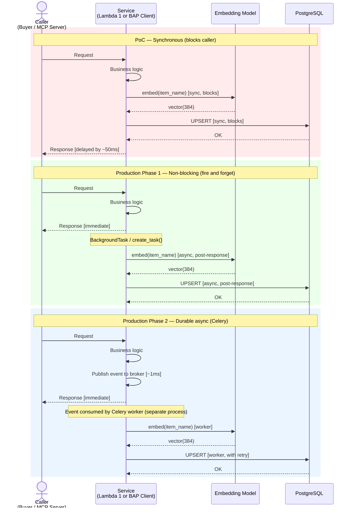

# Async Event-Driven Cache Writes

> [!abstract] Transition Summary
> **PoC:** `write_path_a_cache_row()` and `write_path_b_cache_row()` are synchronous `psycopg2` calls executed inline in the request handler. They block the HTTP response until the database write completes.
> **Production:** Both cache writes must be **non-blocking**. The HTTP response is returned to the caller immediately; the UPSERT to `bpp_catalog_semantic_cache` happens in a background task after the response is sent. This note architects both phases of the async transition.

---

## 1. The Problem: Synchronous Writes Block the Critical Path

In the PoC, every cache write follows this synchronous pattern:

```
POST /parse → Stage 1 → Stage 2 → Stage 3 → [UPSERT to PostgreSQL] → HTTP 200 Response
```

The UPSERT includes:
1. Open a `psycopg2` connection (TCP handshake + auth: ~5–15ms)
2. Compute embedding via `all-MiniLM-L6-v2` (~20–50ms on CPU)
3. Execute the INSERT/UPDATE (~2–5ms on local PostgreSQL)
4. Commit and close connection (~1–2ms)

**Total write overhead on the critical path: ~30–70ms** — added to every CACHE_MISS (Path B) or every `on_discover` callback (Path A). For a `/parse` target latency of <200ms, a 70ms synchronous DB write on the cache miss path is unacceptable.

**The semantic cache is a write-through performance optimization — not the primary response artifact.** The buyer cares about the `ParseResponse.validation` status. Whether the row was successfully written to the cache is irrelevant to their current request. The write should never gate the response.

---

## 2. Solution Overview: Non-Blocking Background Writes

The target architecture decouples the cache write from the HTTP response:

```
POST /parse → Stage 1 → Stage 2 → Stage 3 → HTTP 200 Response
                                           ↘
                                           Background Task: UPSERT to PostgreSQL
                                           (runs after response is sent)
```

This pattern has two implementation tiers, selected based on scale and reliability requirements.

---

## 3. Phase 1 — FastAPI `BackgroundTasks` / `asyncio.create_task()`

### 3a. For Path A writes (in `beckn-bap-client` — FastAPI service)

FastAPI provides a built-in `BackgroundTasks` mechanism that runs a callable after the response has been sent to the client. This requires zero additional infrastructure.

**Integration point:** The `on_discover` handler in the BAP Client registers the `CatalogCacheWriter.write_batch()` call as a background task:

```
Route handler:
  on_discover(request: Request, background_tasks: BackgroundTasks):
    offerings = CatalogNormalizer.normalize(payload, bpp_id, bpp_uri)
    background_tasks.add_task(
        CatalogCacheWriter.write_batch,
        offerings=offerings,
        bpp_id=bpp_id,
        bpp_uri=bpp_uri,
    )
    return DiscoverResponse(offerings=offerings)  ← response sent immediately
    # write_batch() executes after this return
```

**Guarantee:** The HTTP 200 is returned to the caller (whether that is a buyer client or the MCP server) before `write_batch()` begins executing. The write is best-effort within the same OS process.

**Limitation:** If the `beckn-bap-client` process crashes after sending the response but before the background task completes, the write is lost. For Phase 1 (low BPP catalog churn), this is acceptable — the cache warms again on the next `on_discover` event.

### 3b. For Path B writes (in `nl-intent-parser` — `aiohttp` service)

Lambda 1 (`IntentParser`) is not a FastAPI service — it uses `aiohttp`. FastAPI's `BackgroundTasks` is not available. The equivalent pattern is `asyncio.create_task()`:

**Integration point:** `MCPResultAdapter.write_path_b_row()` is wrapped in a fire-and-forget coroutine:

```
In run_stage3_hybrid_validation() after MCP confirms item found:
  asyncio.create_task(
      MCPResultAdapter.write_path_b_row(
          item_name    = mcp_result.item_name,
          descriptions = original_beckn_intent.descriptions,
          bpp_id       = mcp_result.bpp_id,
          bpp_uri      = mcp_result.bpp_uri,
      )
  )
  return ValidationResult(zone=CACHE_MISS, mcp_validated=True, ...)
  # write_path_b_row() runs as a concurrent asyncio task
```

`asyncio.create_task()` schedules the coroutine on the running event loop without blocking the caller. The `ParseResponse` is returned before the DB write completes.

**Requirement:** `MCPResultAdapter.write_path_b_row()` must be an `async def` function that uses `asyncpg` (see [[05_Database_Connection_Pooling]]) — not `psycopg2`, which is synchronous and would block the event loop.

---

## 4. Phase 2 — Celery + Message Broker (High Scale)

Phase 1's `BackgroundTasks` / `asyncio.create_task()` runs write tasks in the **same process** as the web server. At higher request volumes, this creates two problems:
1. Failed writes are silently dropped (no retry, no dead-letter)
2. CPU-bound embedding computation (even at 20ms) contends with the event loop

Phase 2 introduces a dedicated write worker via **Celery**:

### 4a. Architecture

```
┌──────────────────────┐     Publish event     ┌────────────────────┐
│  BAP Client          │─────────────────────▶ │  RabbitMQ / Redis  │
│  (on_discover)       │                        │  (message broker)  │
└──────────────────────┘                        └────────────────────┘
                                                         │
                                                         │ Consume
                                                         ▼
                                                ┌────────────────────┐
                                                │  Celery Worker     │
                                                │  cache_write_tasks │
                                                │                    │
                                                │  ┌──────────────┐  │
                                                │  │ path_a_write │  │
                                                │  │ path_b_write │  │
                                                │  └──────────────┘  │
                                                │         │          │
                                                │         ▼          │
                                                │     asyncpg pool   │
                                                │         │          │
                                                └─────────┼──────────┘
                                                          ▼
                                                    PostgreSQL
                                                bpp_catalog_semantic_cache
```

| Component | Role |
|---|---|
| BAP Client / IntentParser | Publishes a lightweight event message (item_name, descriptions, bpp_id, bpp_uri) — **no embedding computation** |
| Message broker (RabbitMQ or Redis) | Persists the event across process restarts; survives broker failures with `durable=True` queues |
| Celery worker | Consumes events, computes embeddings, executes DB UPSERTs with retry logic |

### 4b. Retry and Dead-Letter Pattern

Celery tasks that fail (DB connection timeout, `asyncpg` error, embedding model unavailable) are retried with exponential back-off:

| Attempt | Delay | Max Attempts |
|---|---|---|
| 1 | immediate | — |
| 2 | 5s | — |
| 3 | 30s | — |
| 4 | — | → Dead-letter queue |

Events that exhaust all retries are routed to a dead-letter queue (`cache_write.dlq`). An alert fires on DLQ growth. Operations can replay DLQ messages after the underlying failure is resolved.

---

## 5. Comparison: Phase 1 vs. Phase 2

| Dimension | Phase 1: BackgroundTasks / create_task | Phase 2: Celery + Broker |
|---|---|---|
| Infrastructure added | None | RabbitMQ/Redis + Celery workers |
| Write durability | Best-effort (lost on process crash) | Durable (broker persists until acknowledged) |
| Retry on failure | No | Yes (configurable back-off) |
| Dead-letter on exhaustion | No | Yes |
| Observability | Process logs only | Celery Flower dashboard, broker metrics |
| Deployment complexity | Low | Medium |
| Suitable for | PoC → Phase 1 production (low BPP churn) | Phase 2 (>100 BPPs, >1000 req/min) |

**Recommendation:** Deploy Phase 1 first. Promote to Phase 2 when `not_found_rate` or `mcp_fallback_rate` metrics (from [[../BPP_Item_Validation/36_Drift_Detection_Rules]]) indicate high write volume or when DLQ-equivalent log analysis shows frequent task drops.

---

## 6. Failure Modes and Mitigations

| Failure | Phase 1 Behaviour | Phase 2 Behaviour |
|---|---|---|
| PostgreSQL unavailable during write | Exception logged; cache row not written; next `on_discover` event will retry | Task queued in broker; retried on recovery |
| Embedding model unavailable | Exception logged; row not written | Task retried; alert on sustained failure |
| Process crash mid-write | Write lost silently | Broker re-delivers unacknowledged task |
| Duplicate `on_discover` for same `(item_name, bpp_id)` | UPSERT is idempotent (ON CONFLICT DO UPDATE `last_seen_at`) — harmless | Same — idempotent by schema design |

The UPSERT idempotency guarantee from the `CONSTRAINT uq_bpp_catalog_item_per_bpp UNIQUE (item_name, bpp_id)` schema (from [[../BPP_Item_Validation/09_bpp_catalog_semantic_cache_Schema]]) means retried writes are always safe.

---

## 7. Sync vs. Async Write Comparison Diagram



---

## Related Notes

- [[05_Database_Connection_Pooling]] — The `asyncpg` pool that Phase 1 background tasks write through
- [[03_Real_CatalogNormalizer_Integration]] — Path A write trigger (CatalogNormalizer → CatalogCacheWriter)
- [[../BPP_Item_Validation/25_CatalogCacheWriter]] — Path A writer component
- [[../BPP_Item_Validation/26_MCPResultAdapter]] — Path B writer component (must be `async def` for Phase 1)
- [[../BPP_Item_Validation/28_Feedback_Loop_Sequence_Diagram]] — Full feedback loop sequence
- [[../BPP_Item_Validation/09_bpp_catalog_semantic_cache_Schema]] — UPSERT idempotency guarantee
- [[nl_intent_parser]] — Lambda 1 (hosts Path B MCPResultAdapter)
- [[beckn_bap_client]] — Lambda 2 (hosts Path A CatalogCacheWriter)
