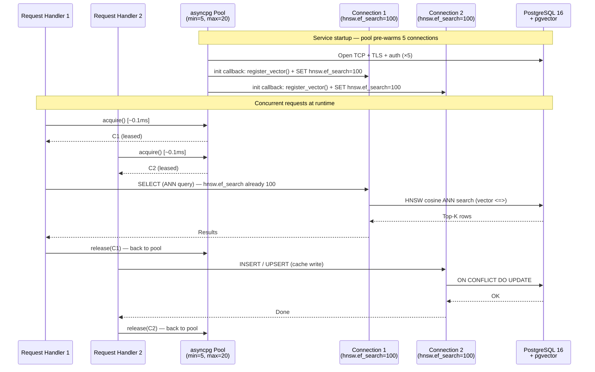

# Database Connection Pooling

> [!abstract] Transition Summary
> **PoC:** `psycopg2.connect(**DB_CONFIG)` — a new synchronous TCP connection is opened per database operation. No pool, no async, no secret management. Suitable only for a single-user notebook.
> **Production:** An `asyncpg` connection pool, initialized once at service startup, shared across all concurrent request handlers. Credentials loaded from a secrets manager at startup. `pgvector` codec and `hnsw.ef_search` initialized per-connection via the pool's `init` callback.

---

## 1. The Problem: Per-Query `psycopg2.connect()`

The PoC's DB access pattern:

```
def get_db_connection():
    conn = psycopg2.connect(**DB_CONFIG)   ← new TCP connection every call
    register_vector(conn)
    return conn

with get_db_connection() as conn:          ← called by every cache read/write
    with conn.cursor() as cur:
        cur.execute(...)
```

This has three critical production deficiencies:

| Deficiency | Impact |
|---|---|
| **New TCP connection per call** | Each `psycopg2.connect()` takes 5–15ms (TCP handshake + TLS + PostgreSQL auth). At 100 req/s, this wastes 500–1500ms/s of wall-clock time in connection establishment alone. |
| **Synchronous driver** | `psycopg2` is a synchronous C extension. Blocking calls inside an `aiohttp` (async) event loop stall the entire loop, preventing other requests from being served. |
| **Credentials in code** | `DB_CONFIG = {"dbname": "procurement_agent", "user": "carbaje"}` is peer-auth only — no password needed on localhost. Production uses SSL + password/IAM auth; hardcoded credentials in source code are a security violation. |

---

## 2. The Solution: `asyncpg` Connection Pool

`asyncpg` is a pure-Python async PostgreSQL driver (no C extension). It is:
- **Event loop native**: all operations are coroutines, compatible with `asyncio` and `aiohttp`
- **High-performance**: up to 3× faster than `psycopg2` in benchmarks due to binary protocol and zero-copy I/O
- **Pool-native**: `asyncpg.create_pool()` returns a pool object that manages a fixed set of persistent connections

### 2a. Pool Initialization (Service Startup)

The pool is created **once** at service startup — not per-request, not per-handler.

```
Service startup sequence:
  1. Load secrets from secrets manager (DB_HOST, DB_USER, DB_PASSWORD, DB_NAME, DB_PORT)
  2. asyncpg.create_pool(
         host=DB_HOST, port=DB_PORT,
         database=DB_NAME, user=DB_USER, password=DB_PASSWORD,
         ssl="require",
         min_size=5, max_size=20,
         max_inactive_connection_lifetime=300,
         init=_on_connection_init,       ← per-connection setup callback
     )
  3. Store pool as a module-level singleton: _db_pool
```

### 2b. Per-Connection `init` Callback

The `init` callback is executed **once per connection** when it is first created (not per-query). It is used to:
1. Register the `pgvector` codec (equivalent to `register_vector(conn)` in the PoC)
2. Set `hnsw.ef_search = 100` for the session (see [[#4. The `hnsw.ef_search` Per-Session Issue]])

```
async def _on_connection_init(conn: asyncpg.Connection) -> None:
    await register_vector(conn)                    ← pgvector asyncpg codec
    await conn.execute("SET hnsw.ef_search = 100")  ← HNSW query parameter
```

This replaces the PoC's two-call pattern:
```
# PoC (per-query, in every function that queries the cache):
cur.execute("SET hnsw.ef_search = %s;", (HNSW_EF_SEARCH,))
cur.execute(ann_sql, {...})
```

With a one-time-per-connection setup that is guaranteed to be active for every query that uses that connection.

### 2c. Per-Request Usage

Each request handler acquires a connection from the pool for the duration of its DB operations, then releases it back:

```
async with _db_pool.acquire() as conn:
    rows = await conn.fetch(ann_sql, query_vector, top_k)
```

`acquire()` does not open a new TCP connection — it leases one of the pre-established connections in the pool. The typical acquire latency is < 0.1ms.

---

## 3. Pool Configuration Parameters

| Parameter | Production Value | Rationale |
|---|---|---|
| `min_size` | 5 | Warm pool on startup — first requests do not incur connection establishment cost |
| `max_size` | 20 | Upper bound matching PostgreSQL `max_connections / service_count`. Prevents exhausting PG connection slots across multiple Lambda 1 replicas. |
| `max_inactive_connection_lifetime` | 300s | Release connections idle for > 5 minutes. Balances resource efficiency with reconnect cost. |
| `max_cached_statement_lifetime` | 600s | Invalidate server-side prepared statement cache after 10 minutes. Prevents stale plans after schema changes. |
| `ssl` | `"require"` | All production DB connections must use TLS. Client certificate validation should be added when the database accepts mTLS. |
| `command_timeout` | 5s | Any single DB statement that exceeds 5 seconds is killed. Prevents runaway HNSW queries from holding connections indefinitely. |

### Pool Sizing Formula

```
max_pool_size_per_replica = floor(max_pg_connections / (service_replicas × services_count))

Example:
  PostgreSQL max_connections = 100
  Lambda 1 replicas = 3, Lambda 2 replicas = 3
  Other services = 2 (connections = 10 total)
  Available for each Lambda = (100 - 10) / 6 = 15

  ⇒ max_size = 15 per Lambda 1 replica
```

Using `PgBouncer` (connection pooler in front of PostgreSQL) decouples pool sizing from `max_connections` and is recommended at production scale.

---

## 4. The `hnsw.ef_search` Per-Session Issue

This is a production-specific concern that does not arise in the PoC because the PoC opens a fresh connection per query.

**Background:** `SET hnsw.ef_search = 100` is a **session-level GUC (Grand Unified Configuration)**. It applies to the current database session (connection) and persists until the session ends or the setting is changed. In the PoC, every call opens a new connection, executes `SET hnsw.ef_search`, runs the query, and closes the connection — the setting is always correct.

**Problem in a connection pool:** Connections are reused across multiple requests. If connection `conn_7` is used first for an UPSERT (which does not call `SET hnsw.ef_search`), then reused for an ANN query, the `hnsw.ef_search` may have reverted to the PostgreSQL default (40) rather than the production value (100). ANN recall quality degrades silently.

**Solution:** The `init` callback (section [[#2b. Per-Connection init Callback]]) sets `hnsw.ef_search = 100` **once when the connection is created**. Since this setting persists for the lifetime of the session, every subsequent ANN query on that connection uses `ef_search = 100`. No per-query `SET` statement is needed.

> [!warning] pgvector GUC Persistence
> If `asyncpg` ever creates a new physical connection (due to pool growth or connection failure recovery), the `init` callback is automatically invoked for the new connection. The `ef_search` setting is guaranteed to be correct for all pool members.

---

## 5. Secrets Management

### 5a. What Must Be Externalized

| Credential | PoC Value | Production Source |
|---|---|---|
| `DB_HOST` | `localhost` | Secrets manager |
| `DB_PORT` | `5432` (default) | Secrets manager |
| `DB_NAME` | `procurement_agent` | Secrets manager |
| `DB_USER` | `carbaje` (peer auth) | Secrets manager |
| `DB_PASSWORD` | None (peer auth) | Secrets manager |
| `DB_SSL_CERT` | None | Secrets manager (client cert for mTLS) |
| `ANTHROPIC_API_KEY` | `""` / env var | Secrets manager |

### 5b. Secrets Delivery Options

| Option | Mechanism | Suitable For |
|---|---|---|
| **Environment variables** from `.env` | `os.environ.get(...)` at startup | Development, single-server staging |
| **AWS Secrets Manager** | `boto3.client('secretsmanager').get_secret_value()` at startup; rotate without redeploy using secret rotation hooks | AWS ECS / EKS production |
| **HashiCorp Vault** | `hvac` client; dynamic secrets (short-lived credentials issued per deployment); supports secret leasing and automatic renewal | Multi-cloud / on-premise production |
| **Kubernetes Secrets** | Mounted as environment variables or files in the Pod spec; avoid direct `kubectl` access in application code | Kubernetes production |

**The cardinal rule:** Secrets never appear in:
- Source code
- `Dockerfile` or `docker-compose.yml` `ENV` directives
- Git history
- Application logs

### 5c. Credential Rotation Without Restart

Production databases rotate credentials periodically (security policy or compliance). The `asyncpg` pool handles this gracefully if:
1. The pool's `max_inactive_connection_lifetime` causes idle connections to be periodically closed and recreated
2. New connections use the updated credentials fetched at creation time

For zero-downtime rotation with Vault dynamic secrets, the `init` callback fetches credentials from Vault at connection creation time, ensuring newly created connections always use the current valid credential.

---

## 6. `pgvector` Compatibility with `asyncpg`

The PoC uses `pgvector.psycopg2.register_vector(conn)`. The production transition requires `pgvector.asyncpg` instead.

```
Driver      │ Registration Function           │ Import
────────────┼─────────────────────────────────┼────────────────────────
psycopg2    │ register_vector(conn)           │ from pgvector.psycopg2 import register_vector
asyncpg     │ await register_vector(conn)     │ from pgvector.asyncpg import register_vector
```

The `asyncpg` variant is a coroutine — it must be awaited. The pool's `init` callback is the correct place for this, since it runs once per physical connection:

```
async def _on_connection_init(conn: asyncpg.Connection) -> None:
    from pgvector.asyncpg import register_vector
    await register_vector(conn)
    await conn.execute("SET hnsw.ef_search = 100")
```

After this, `asyncpg` automatically serializes `numpy.ndarray` and `list[float]` values as PostgreSQL `vector` types in all queries and results.

---

## 7. Architecture Diagram



---

## Related Notes

- [[04_Async_Event_Driven_Cache_Writes]] — The async background tasks that write through this pool
- [[../BPP_Item_Validation/09_bpp_catalog_semantic_cache_Schema]] — The table being read/written
- [[../BPP_Item_Validation/10_HNSW_Index_Strategy]] — Why `ef_search=100` must be set per-session
- [[databases_postgresql_redis]] — PostgreSQL 16 infrastructure configuration and `max_connections`
- [[nl_intent_parser]] — Lambda 1 (primary pool consumer: ANN queries + Path B writes)
- [[beckn_bap_client]] — Lambda 2 (secondary pool consumer: Path A writes)
