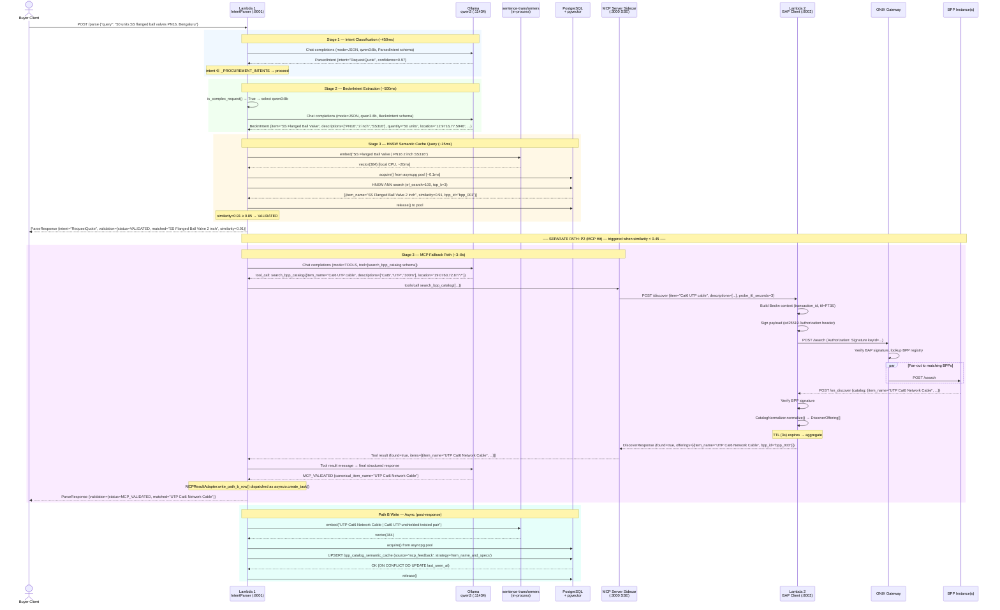
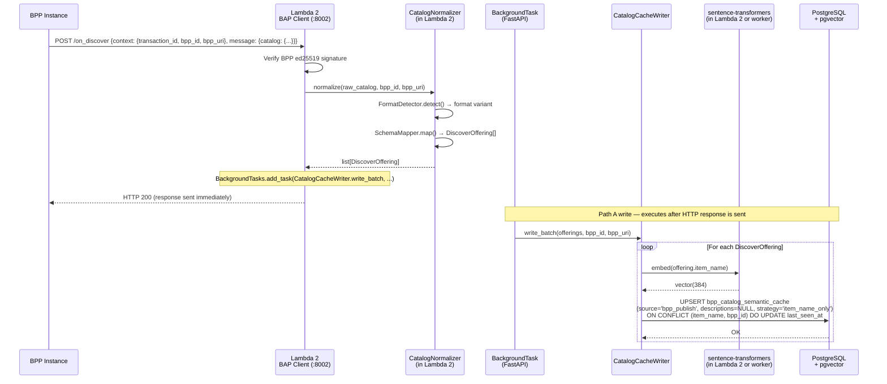

# End-to-End Production Data Flow

> [!abstract] Capstone Note
> This note provides the authoritative **full-system sequence diagram** for the production architecture after all five transition notes have been implemented. It supersedes the PoC notebook's execution flow. Every component here is real infrastructure — no mocks remain.

---

## 1. Component Inventory

| Component | Technology | Network Location | Role |
|---|---|---|---|
| **Buyer Client** | Frontend / API caller | External | Issues raw NL procurement queries |
| **Lambda 1 — IntentParser** | Python `aiohttp`, port :8001 | Internal | Stage 1 + Stage 2 + Stage 3 orchestration |
| **Ollama** | Ollama server, port :11434 | Internal (same pod or adjacent) | `qwen3:8b` / `qwen3:1.7b` inference |
| **sentence-transformers** | CPU-bound library | In-process in Lambda 1 | `all-MiniLM-L6-v2` 384d embeddings |
| **PostgreSQL 16 + pgvector** | Managed PostgreSQL | Internal | `bpp_catalog_semantic_cache` storage + HNSW ANN search |
| **asyncpg Pool** | In-process pool | Lambda 1 + Lambda 2 | Persistent async connection pool |
| **MCP Server Sidecar** | Python MCP SDK (SSE :3000) | Same pod as Lambda 1 | `search_bpp_catalog` tool adapter |
| **Lambda 2 — BAP Client** | Python FastAPI, port :8002 | Internal | Beckn signing, ONIX routing, `on_discover` aggregation |
| **ONIX Gateway** | Beckn network registry | External (Beckn network) | BPP registry lookup + `/search` fan-out |
| **BPP Instances (N)** | Various | External (Beckn network) | Respond to `/search` via `on_discover` callbacks |
| **CatalogNormalizer** | Library inside Lambda 2 | In-process Lambda 2 | `on_discover` raw payload → `DiscoverOffering[]` |
| **CatalogCacheWriter** | Library inside Lambda 2 | In-process Lambda 2 | Path A: UPSERT after normalization (async) |
| **MCPResultAdapter** | Library inside Lambda 1 | In-process Lambda 1 | Path B: UPSERT after MCP confirmation (async) |
| **Anthropic Claude** | `claude-sonnet-4-6` API | External (cloud) | Query Broadening + Senior Auditor (last resort) |

---

## 2. Path Taxonomy

All requests follow one of four paths through the production system:

| Path | Trigger | Latency | Outcome |
|---|---|---|---|
| **P0 — Gate** | Stage 1 intent ∉ `_PROCUREMENT_INTENTS` | ~450ms (one LLM call) | `ParseResponse {validation: null}` |
| **P1 — Cache Hit** | Stage 3 ANN similarity ≥ 0.85 | ~500ms (Stage 1 + 2 + ANN) | `ParseResponse {validation: VALIDATED}` |
| **P2 — MCP Hit** | Stage 3 CACHE_MISS + MCP probe finds item | ~8s max (Stage 1+2 + ANN + MCP probe) | `ParseResponse {validation: MCP_VALIDATED}` + Path B write |
| **P3 — Recovery** | Stage 3 CACHE_MISS + MCP returns nothing | ~10s+ | `ParseResponse {validation: CACHE_MISS, not_found: true}` + recovery actions |

---

## 3. Full Production Sequence — P1 (Cache Hit) and P2 (MCP Hit)

---

## 4. Path A — Continuous Cache Seeding (Independent of Query Handling)

Path A runs independently of any buyer query. It is triggered whenever a BPP responds to any `on_discover` request — including the MCP probe above, but also any buyer-facing discover call.

---

## 5. Production Latency Budget

| Stage / Operation | Typical | Worst Case | Notes |
|---|---|---|---|
| Stage 1 (qwen3:8b, mode=JSON) | 400ms | 800ms | Network I/O to Ollama |
| Stage 2 (qwen3:8b, mode=JSON) | 500ms | 1200ms | Scales with query complexity |
| Embedding (all-MiniLM-L6-v2) | 20ms | 80ms | Local CPU, no network |
| Pool acquire | 0.1ms | 2ms | From pre-warmed pool |
| HNSW ANN query (ef_search=100) | 5ms | 20ms | PostgreSQL + pgvector |
| **P1 total (cache hit)** | **~925ms** | **~2100ms** | Stages 1+2+embed+ANN |
| MCP probe (tool call + ONIX round-trip) | 2–3s | 8s | Network-bound: BPP response time |
| **P2 total (MCP hit)** | **~3.5–4s** | **~10s** | Stages 1+2+embed+ANN+MCP |
| Path B write (async, post-response) | 30ms | 100ms | Does NOT add to response latency |
| **P3 total (recovery)** | **~5–12s** | **>15s** | Includes broadening + Claude (if key set) |

---

## 6. Component Responsibility Matrix

| Component | Reads cache | Writes cache | Issues Beckn calls | Holds LLM clients | Hosts embedding |
|---|---|---|---|---|---|
| Lambda 1 IntentParser | ✅ (ANN query) | ✅ Path B (async) | ❌ | ✅ (qwen3 + Claude) | ✅ |
| MCP Server Sidecar | ❌ | ❌ | ❌ | ❌ | ❌ |
| Lambda 2 BAP Client | ❌ | ✅ Path A (async) | ✅ | ❌ | ✅ (for Path A embeds) |
| ONIX Gateway | ❌ | ❌ | ✅ (fan-out) | ❌ | ❌ |
| BPP Instances | ❌ | ❌ | ✅ (on_discover) | ❌ | ❌ |

---

## 7. Operational Invariants

These invariants must hold in the production system. Violations indicate a configuration or deployment error.

1. **The asyncpg pool is initialized before the first request is served.** Lambda 1 must not accept requests until the pool reports healthy.
2. **`hnsw.ef_search = 100` is active on all pool connections.** Verified via the pool `init` callback. Never rely on the PostgreSQL default (40).
3. **Stage 1 and Stage 2 use `instructor.Mode.JSON`.** Stage 3 MCP reasoning uses `instructor.Mode.TOOLS`. Mixing modes across stages causes schema validation failures.
4. **Path B writes are async (`asyncio.create_task()`).** Synchronous Path B writes inside an aiohttp handler block the event loop and degrade all concurrent requests.
5. **The MCP probe uses `probe_ttl_seconds=3`.** The Lambda 2 authoritative search (triggered downstream by the Orchestrator on VALIDATED/MCP_VALIDATED status) uses the full 10s TTL. These are different requests; never conflate their TTL values.
6. **`CatalogNormalizer` source code is not modified.** The Path A write is a post-normalization side effect registered in the `on_discover` handler, not inside `CatalogNormalizer`.
7. **Credentials never appear in source code, Docker images, or logs.** All secrets loaded from secrets manager at startup.

---

## Related Notes

- [[01_Real_MCP_Server_Integration]] — MCP sidecar + instructor mode=TOOLS
- [[02_Connecting_MCP_to_ONIX_BPP]] — Beckn signing, ONIX routing, async callback window
- [[03_Real_CatalogNormalizer_Integration]] — Path A: on_discover → CatalogNormalizer → CatalogCacheWriter
- [[04_Async_Event_Driven_Cache_Writes]] — BackgroundTask + asyncio.create_task() patterns
- [[05_Database_Connection_Pooling]] — asyncpg pool, ef_search init, secrets management
- [[../BPP_Item_Validation/07_Hybrid_Architecture_Overview]] — The approved hybrid architecture this flow implements
- [[../BPP_Item_Validation/12_Full_System_Validation_Flow]] — Original PoC-level sequence diagram (superseded for production by this note)
- [[microservices_architecture]] — Full Step Functions state machine context
