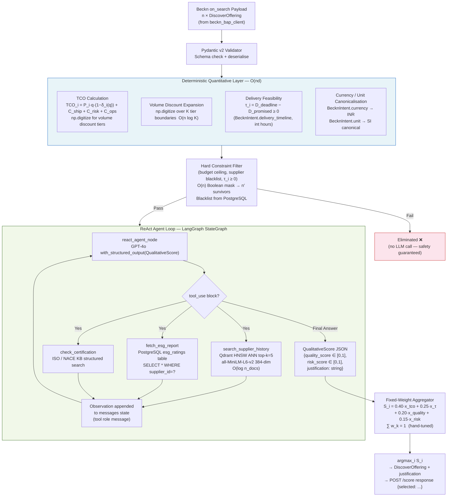

# Phase 1: The Hybrid ReAct Pipeline (Current State)

> **Position in roadmap:** See [[_comparison_engine_index]] for the full three-phase evolution.
> **Live service:** [[comparison_scoring_engine]] — `services/comparative-scoring`, `POST /score`, port `:8003`.
> **Next phase:** [[phase2_learning_to_rank]] — Learning to Rank with Implicit Feedback.

---

## Overview

Phase 1 is a **deterministic-quantitative core** wrapped in a **qualitative [[llm_providers|LLM]] reasoning loop**. The Python layer handles everything with a closed-form, auditable formula — Total Cost of Ownership, volume discounts, delivery feasibility, currency canonicalisation. A [[llm_providers|GPT-4o]]-backed [[agent_react_framework|ReAct]] agent, implemented in [[agent_framework_langchain_langgraph|LangGraph]], handles everything that requires reading certifications, parsing supplier track records, or weighing soft factors that resist tabular encoding.

This phase corresponds to the live [[comparison_scoring_engine]] microservice exposed at `POST /score`.

---

## 1.1 Deterministic Quantitative Layer

The quantitative layer is a vectorised Python pipeline (NumPy/Pandas) that maps raw `DiscoverOffering` records — delivered by the [[beckn_bap_client]] after receiving `on_search` callbacks — into a normalised feature matrix $\mathbf{X} \in \mathbb{R}^{n \times d}$. No ML inference occurs at this stage.

### 1.1.1 Total Cost of Ownership (TCO)

The primary economic signal is the per-offering TCO normalised to procurement quantity $q$ (drawn from `BecknIntent.quantity` parsed by [[nl_intent_parser]]):

$$\text{TCO}_i \;=\; \underbrace{P_i \cdot q \cdot \bigl(1 - \delta_i(q)\bigr)}_{\text{net purchase cost}} \;+\; \underbrace{C_{\text{ship},i}(q,\, r)}_{\text{logistics}} \;+\; \underbrace{C_{\text{risk},i}(\sigma_i,\, \tau_i)}_{\text{risk premium}} \;+\; \underbrace{C_{\text{ops},i}}_{\text{transaction overhead}}$$

where:

- $P_i$ is the unit price quoted by supplier $i$, canonicalised to INR via `BecknIntent.currency`.
- $\delta_i(q)$ is the **volume discount function** — a piecewise-constant step function over the catalog's discount tiers:

$$\delta_i(q) \;=\; \sum_{k=1}^{K_i} d_{i,k} \cdot \mathbf{1}\!\left[q \in [q_{i,k},\, q_{i,k+1})\right], \qquad d_{i,k} \in [0,1)$$

Implemented as a vectorised `numpy.digitize` over tier boundaries followed by a gather from the discount array — $O(n \log K)$ total where $K = \max_i K_i$ is the maximum tier count across all suppliers.

- $C_{\text{ship},i}(q, r)$ is the logistics cost as a function of quantity and delivery region $r$ (`BecknIntent.location_coordinates`, stored as `"lat,lon"` decimal per the `shared/models.BecknIntent` anti-corruption contract). Approximated by a zone-rate lookup table.

- $C_{\text{risk},i}(\sigma_i, \tau_i)$ is the **risk premium**: a function of supplier on-time delivery standard deviation $\sigma_i$ (retrieved from [[databases_postgresql_redis|PostgreSQL]] supplier-history table) and delivery slack $\tau_i$:

$$C_{\text{risk},i} \;=\; \alpha \cdot \sigma_i \cdot \max(0,\; -\tau_i) \;+\; \beta \cdot \sigma_i^2$$

where $\alpha, \beta > 0$ are domain constants. The first term penalises already-infeasible delivery promises; the second penalises intrinsically unreliable suppliers even when the deadline is nominally met.

- $C_{\text{ops},i}$ is a flat per-transaction overhead modelled as a category-level constant (onboarding, compliance documentation).

### 1.1.2 Hard Constraint Filtering

Before any scoring, offerings failing hard constraints are eliminated as a Boolean mask:

$$\mathcal{S}_{\text{feasible}} \;=\; \bigl\{\, i \;\big|\; \tau_i \geq 0 \;\land\; \text{TCO}_i \leq B \;\land\; \text{blacklist}(i) = \text{false} \,\bigr\}$$

where $\tau_i = D_{\text{deadline}} - D_{\text{promised},i}$ is the **delivery slack** in integer hours (matching `BecknIntent.delivery_timeline` convention) and $B$ is the budget ceiling from `BecknIntent.budget_constraints.max`. Applied via `pandas.DataFrame.query`, $O(n)$ cost. Only $|\mathcal{S}_{\text{feasible}}|$ offerings pass to the [[llm_providers|LLM]] layer — a critical safety property: hard constraints are enforced *before* the LLM ever sees the candidate set, eliminating any risk of hallucinated constraint violations.

The supplier blacklist is maintained in [[databases_postgresql_redis|PostgreSQL]] and hydrated at service startup.

### 1.1.3 Feature Vector Construction

Each feasible offering is encoded as $\mathbf{x}_i \in [0,1]^d$ via session-level min-max normalisation:

$$x_{i,k} \;=\; \frac{v_{i,k} - \min_{j \in \mathcal{S}_{\text{feasible}}} v_{j,k}}{\max_j v_{j,k} - \min_j v_{j,k} + \epsilon}, \qquad \epsilon = 10^{-8}$$

Features include: normalised TCO, normalised delivery slack $\tau_i / T_{\max}$, volume discount rate $\delta_i(q)$, logistics cost share $C_{\text{ship},i}/\text{TCO}_i$, plus qualitative sub-scores from the LLM layer (§1.2).

### 1.1.4 Fixed-Weight Aggregation

The final score is a **hand-tuned convex combination** codified by category leads:

$$S_i \;=\; w_{\text{price}} \cdot x_{i,\text{tco}} \;+\; w_{\text{del}} \cdot x_{i,\tau} \;+\; w_{\text{qual}} \cdot x_{i,\text{quality}} \;+\; w_{\text{risk}} \cdot x_{i,\text{risk}}$$

with $\sum_k w_k = 1$ and current defaults $\mathbf{w} = [0.40,\, 0.25,\, 0.20,\, 0.15]$. The qualitative sub-scores $x_{i,\text{quality}}$ and $x_{i,\text{risk}}$ are produced by the [[agent_react_framework|ReAct]] loop (§1.2).

> **The fundamental flaw of Phase 1:** $\mathbf{w}$ is a prior, not a posterior. It cannot reflect that for a Mumbai cable order under a tight deadline, delivery should dominate price, or that for a 12-month MRO contract, supplier-history weight should rise. See [[phase2_learning_to_rank]] for the fix.

---

## 1.2 LLM ReAct Loop (LangGraph)

Qualitative factors — ISO/IEC certifications, ESG ratings, supplier litigation history, and free-text warranty terms — resist tabular encoding. They are evaluated by a **[[llm_providers|GPT-4o]]-backed [[agent_react_framework|ReAct]] (Reason + Act) agent** implemented as a [[agent_framework_langchain_langgraph|LangGraph]] `StateGraph`.

### 1.2.1 ReAct Pattern

The [[agent_react_framework|ReAct]] pattern (Yao et al., ICLR 2023) interleaves **Thought** (internal chain-of-thought), **Action** (tool invocation), and **Observation** (tool result) in a structured loop until the agent produces a **Final Answer**:

```
System: You are a procurement intelligence agent. Assess qualitative
        risk and quality for each supplier offering on a 0.0–1.0 scale.
        You MUST invoke at least one retrieval tool before issuing a score.
        Output ONLY the structured JSON schema QualitativeScore.

Turn 1  Thought:   Need to verify ISO 27001 status for Supplier A.
        Action:    search_supplier_history(query="ISO 27001 Supplier A", top_k=5)
        Observation: ["Supplier A certified ISO 27001:2022, renewed 2025-01",
                      "Audit passed with zero non-conformances, 2024-09", ...]

Turn 2  Thought:   ISO confirmed. Fetch ESG profile.
        Action:    fetch_esg_report(supplier_id="SUP-A-001")
        Observation: {"esg_score": 72, "tier": "B", "incidents": 0}

Turn k  Final Answer: {"quality_score": 0.87, "risk_score": 0.12,
                       "justification": "ISO 27001:2022 certified; B-tier ESG;
                        zero incidents; 98.3% on-time over 24 months."}
```

### 1.2.2 Prompt Engineering Patterns

Three structural techniques are used in the system prompt:

1. **Role anchoring**: establishes procurement domain framing before any supplier content is presented.
2. **Output schema injection**: the `QualitativeScore` Pydantic v2 JSON schema is included in the system prompt; [[llm_providers|GPT-4o]] function calling is configured with `with_structured_output(QualitativeScore)`, making downstream parsing deterministic and eliminating hallucination of non-numeric scores.
3. **Evidence-first mandate**: `"You MUST invoke at least one retrieval tool before issuing a score"` prevents hallucination of certification claims — critical given [[security_compliance]] exposure of incorrect ISO assertions in procurement audit trails.

### 1.2.3 Tool-Calling Mechanics (LangGraph StateGraph)

The [[agent_react_framework|ReAct]] agent is a [[agent_framework_langchain_langgraph|LangGraph]] `StateGraph` with the following topology:

```
StateGraph (TypedDict state: messages, session_context)
  Nodes:
    react_agent_node          — LLM call (GPT-4o) + tool_choice dispatch
    search_supplier_history   — Qdrant HNSW ANN retrieval (§1.2.4)
    fetch_esg_report          — PostgreSQL audit table lookup
    check_certification       — Structured KB search (NACE/ISO codes)
  Edges:
    react_agent_node → tool_router → {tool_nodes | END}
    {tool_nodes} → react_agent_node  (append observation, loop back)
```

[[llm_providers|GPT-4o]] returns a `tool_use` content block specifying the function name and JSON arguments; [[agent_framework_langchain_langgraph|LangGraph]] routes to the corresponding tool node, appends the result to the `messages` state as a `tool` role message, and loops back to `react_agent_node`. The loop terminates when [[llm_providers|GPT-4o]] returns a `text` block matching the `QualitativeScore` schema.

### 1.2.4 Supplier History Retrieval (Qdrant ANN)

`search_supplier_history` encodes the natural-language query with `sentence-transformers/all-MiniLM-L6-v2` (via [[embedding_models]], $d = 384$) and issues an **Approximate Nearest Neighbour (ANN)** query against the [[vector_db_qdrant_pinecone|Qdrant]] collection `supplier_history_embeddings` using cosine similarity:

$$\text{sim}(\mathbf{q}, \mathbf{p}_j) \;=\; \frac{\mathbf{q}^\top \mathbf{p}_j}{\|\mathbf{q}\|\,\|\mathbf{p}_j\|}$$

The [[vector_db_qdrant_pinecone|Qdrant]] HNSW index ($M = 16$, $\text{ef\_construction} = 100$) returns the top-$k$ ($k = 5$ default) most similar historical documents — performance reports, audit findings, dispute records — as context chunks appended to the agent's message history. ANN query complexity: $O(\log n_{\text{docs}})$.

The historical document corpus is ingested from [[databases_postgresql_redis|PostgreSQL]] (`supplier_performance_logs` table) via an offline embedding pipeline that runs nightly, writing 384-dim vectors to the [[vector_db_qdrant_pinecone|Qdrant]] collection.

`fetch_esg_report` issues a direct SQL query to the `esg_ratings` table in [[databases_postgresql_redis|PostgreSQL]] using the `supplier_id` foreign key.

---

## 1.3 Latency Analysis

| Component | Mechanism | Typical Latency | Asymptotic Cost |
|---|---|---|---|
| Quantitative layer | Vectorised NumPy in-process | 2–8 ms | $O(nd)$ |
| Hard constraint filter | Pandas Boolean mask | < 1 ms | $O(n)$ |
| [[vector_db_qdrant_pinecone\|Qdrant]] ANN retrieval (per call) | HNSW cosine search | 10–40 ms | $O(\log n_{\text{docs}})$ |
| Sentence-transformer encode | MiniLM-L6-v2 CPU inference | 5–20 ms | $O(T_{\text{tokens}})$ |
| [[llm_providers\|GPT-4o]] API call (per ReAct turn) | Remote LLM inference | 1,500–3,500 ms | $O(T_{\text{ctx}} \cdot H)$ |
| [[agent_framework_langchain_langgraph\|LangGraph]] ReAct loop ($k$ turns) | $k \times$ (LLM + tools) | $\sim k \times 2{,}000$ ms | $O(k)$ |
| Weighted aggregation | Dot product $\mathbf{w}^\top \mathbf{x}_i$ | < 0.1 ms | $O(n \cdot d)$ |
| **Total end-to-end ($k = 3$)** | — | **7–12 s** | **[[llm_providers\|LLM]]-bound** |

The [[llm_providers|LLM]] step entirely dominates latency and cost. Synchronous blocking invocation of [[llm_providers|GPT-4o]] on every scoring request prevents concurrent request handling without per-request thread pinning, and introduces tail latencies exceeding 15 s during API congestion. Phase 1 is viable only as an offline or semi-interactive flow.

---

## 1.4 Architecture Diagram



---

## 1.5 Identified Limitations

| Limitation | Impact | Addressed in |
|---|---|---|
| **Static weight vector** — $\mathbf{w}$ is a prior, not a posterior; category-agnostic | Systematic mis-ranking when category priorities differ from defaults | [[phase2_learning_to_rank]] |
| **Zero learning** — buyer overrides logged but never consumed | Engine repeats identical errors indefinitely | [[phase2_learning_to_rank]], [[agent_memory_learning]] |
| **[[llm_providers\|GPT-4o]] cost and latency** — 7–12 s / ≈\$0.01–0.05 per loop | Structural ceiling on request throughput and operational cost | [[phase2_learning_to_rank]] (LLM step becomes optional enrichment) |
| **Serial tool execution** — [[agent_framework_langchain_langgraph\|LangGraph]] tools execute sequentially | ~40% latency saving left on the table (ESG + cert fetch are independent) | Can be parallelised via `asyncio.gather` in the graph topology |
| **Selection bias** — LLM only sees offerings that passed hard constraints | Model is blind to the preference space it cannot observe | [[phase3_optnet_e2e]] (solver-embedded constraints remove this gap) |

---

## Exit Criteria → [[phase2_learning_to_rank]]

Transition is triggered by **any one** of:

- Override rate exceeds **25%** sustained over a 90-day rolling window (tracked in [[audit_trail_system]]).
- Manual weight retuning requested for the **third time** in a calendar year.
- Accumulated override events in [[databases_postgresql_redis|PostgreSQL]] reach **5,000** labelled records.
- [[llm_providers|GPT-4o]] API cost exceeds **₹50,000/month** (monitor via [[business_impact_metrics]]).

---

*← [[_comparison_engine_index]] | Next: [[phase2_learning_to_rank]] →*
