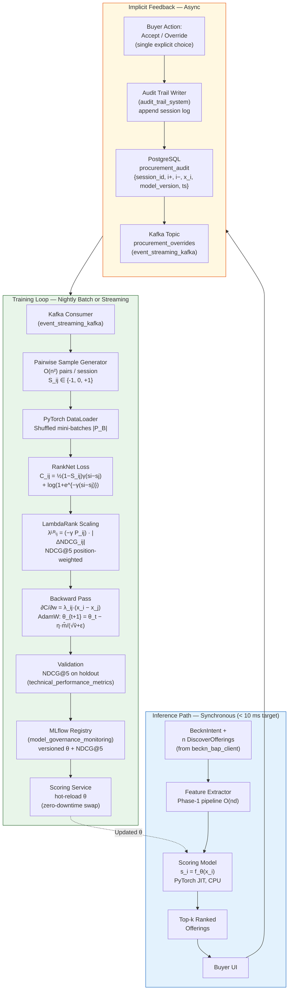

# Phase 2: Learning to Rank (LTR) with Implicit Feedback

> **Position in roadmap:** See [[_comparison_engine_index]] for the full three-phase evolution.
> **Previous phase:** [[phase1_hybrid_react]] — The Hybrid ReAct Pipeline.
> **Next phase:** [[phase3_optnet_e2e]] — End-to-End Differentiable Optimization.

---

## Overview

Phase 2 replaces the hand-coded weight aggregator from [[phase1_hybrid_react]] with a **learnable scoring function** $f_\theta: \mathbb{R}^d \to \mathbb{R}$ whose parameters $\theta$ are updated from buyer override events via Stochastic Gradient Descent. The core idea is to treat every user override — "I chose Supplier B, not Supplier A" — as an implicit pairwise preference label, and use it to shift $\theta$ in the direction that the buyer's revealed behaviour demands.

This is the **[[agent_memory_learning|implicit feedback learning loop]]** applied directly to the engine's decision weights. It does not require explicit ratings or labelled datasets — the [[audit_trail_system]] provides the signal automatically.

The Phase-1 quantitative pipeline (TCO, discounts, delivery feasibility) remains intact as the feature extractor. The [[llm_providers|GPT-4o]] ReAct step is preserved as an optional qualitative enrichment layer, but it is no longer entangled with the scoring function's parameters.

---

## 2.1 From Static Weights to a Parameterised Scoring Function

### Architecture Variants

**Linear model** (recommended for initial deployment — interpretable):

$$s_i \;=\; f_\theta(\mathbf{x}_i) \;=\; \mathbf{w}^\top \mathbf{x}_i + b, \qquad \theta \equiv (\mathbf{w} \in \mathbb{R}^d,\; b \in \mathbb{R})$$

The weight vector $\mathbf{w}$ is directly readable by procurement analysts: if $w_{\text{esg}} > w_{\text{price}}$ after training, the model has empirically discovered that the buyer population weights ESG above price for this category.

**Shallow MLP** (for capturing non-linear preference interactions):

$$s_i \;=\; f_\theta(\mathbf{x}_i) \;=\; \mathbf{u}^\top\, \sigma\!\bigl(W_2\, \sigma(W_1 \mathbf{x}_i + \mathbf{b}_1) + \mathbf{b}_2\bigr)$$

where $\sigma(\cdot) = \max(0, \cdot)$ (ReLU), $W_1 \in \mathbb{R}^{H \times d}$, $W_2 \in \mathbb{R}^{H \times H}$, $\mathbf{u} \in \mathbb{R}^H$. The linear model is the recommended first deployment: its parameter count ($d + 1$) is small enough to converge with $10^3$–$10^4$ training pairs, and $\mathbf{w}$ is interpretable without attribution methods.

The recommendation remains $\arg\max_i s_i$ subject to the same hard constraints from [[phase1_hybrid_react]]. **Multi-supplier split orders and combinatorial constraints remain out of scope** — that is addressed in [[phase3_optnet_e2e]].

---

## 2.2 Augmented Feature Vector

The full feature vector $\mathbf{x}_i \in \mathbb{R}^d$ augments the [[phase1_hybrid_react]] set with behavioural signals from the [[audit_trail_system]]:

| $k$ | Feature | Source |
|---|---|---|
| 1 | Normalised TCO | Deterministic formula (Phase 1 §1.1.1) |
| 2 | Normalised delivery slack $\tau_i / T_{\max}$ | `BecknIntent.delivery_timeline` |
| 3 | Volume discount rate $\delta_i(q)$ | Catalog tiers |
| 4 | Logistics cost share $C_{\text{ship},i} / \text{TCO}_i$ | Deterministic |
| 5 | LLM quality sub-score (optional) | [[llm_providers\|GPT-4o]] ReAct enrichment |
| 6 | ESG tier (ordinal encoded) | [[databases_postgresql_redis\|PostgreSQL]] `esg_ratings` |
| 7 | ISO certification bitmask (normalised) | KB structured search |
| 8 | Supplier 12-month on-time delivery rate | [[databases_postgresql_redis\|PostgreSQL]] `supplier_performance_logs` |
| 9 | Supplier historical override rate against engine | [[audit_trail_system]] (**new in Phase 2**) |
| 10–$d$ | Category embedding (PCA of one-hot) | Optional MLP variant |

All features are standardised to $\mu = 0$, $\sigma = 1$ using **Welford's online algorithm** to maintain running statistics across sessions without batch normalisation artifacts. This also means new suppliers with no history default to $\mu = 0$ — a sensible neutral prior.

---

## 2.3 RankNet: Pairwise Cross-Entropy Loss

### 2.3.1 Pair Formation from Override Events

A buyer **override event** — the user selecting offering $j$ after the engine recommended offering $i$ — yields a strict pairwise label:

- $S_{ij} = +1$: offering $i$ preferred over $j$ (buyer accepted the engine's choice).
- $S_{ij} = -1$: offering $j$ preferred over $i$ (**override**: user rejected $i$ in favour of $j$).
- $S_{ij} = 0$: indeterminate (user did not engage with either).

For a session with $n$ offerings, the full Cartesian product yields $\binom{n}{2} \in O(n^2)$ ordered pairs. With $n \leq 20$ (typical for a Beckn catalog response), at most 190 pairs are generated per session — computationally negligible.

Override events are written atomically by the [[audit_trail_system]] to [[databases_postgresql_redis|PostgreSQL]] and streamed to the [[event_streaming_kafka|Kafka]] topic `procurement_overrides` for downstream consumption by the training pipeline.

### 2.3.2 Predicted Pairwise Probability

Given scores $s_i, s_j$ produced by $f_\theta$, the **predicted probability that $i$ should be ranked above $j$** follows the Bradley-Terry model via the sigmoid:

$$P_{ij} \;=\; \frac{1}{1 + e^{-\gamma(s_i - s_j)}}, \qquad \gamma > 0 \;\text{(default: 1)}$$

The **target probability** derived from the pairwise label is:

$$\bar{P}_{ij} \;=\; \frac{1 + S_{ij}}{2} \;\in\; \{0,\; 0.5,\; 1\}$$

### 2.3.3 Full RankNet Cross-Entropy Loss

The binary cross-entropy loss over a single pair $(i,j)$:

$$\mathcal{C}_{ij} \;=\; -\bar{P}_{ij} \log P_{ij} \;-\; (1 - \bar{P}_{ij}) \log(1 - P_{ij})$$

Substituting $P_{ij}$ and simplifying yields the **closed-form RankNet loss** (Burges et al., 2005):

$$\boxed{\mathcal{C}_{ij} \;=\; \frac{1}{2}(1 - S_{ij})\,\gamma(s_i - s_j) \;+\; \log\!\left(1 + e^{-\gamma(s_i - s_j)}\right)}$$

For a strict override ($S_{ij} = -1$, buyer chose $j$ over engine's recommendation $i$), this simplifies to:

$$\mathcal{C}_{ij}\big|_{S_{ij}=-1} \;=\; \log\!\left(1 + e^{\,\gamma(s_i - s_j)}\right)$$

This is large when $s_i > s_j$ (engine over-estimated $i$) and approaches zero when $s_j \gg s_i$. The **aggregate training loss** over labelled pair set $\mathcal{P}$ for a batch:

$$\mathcal{L}_{\text{RankNet}}(\theta) \;=\; \sum_{(i,j) \in \mathcal{P}} \mathcal{C}_{ij}(\theta)$$

### 2.3.4 Gradient Derivation

Differentiating $\mathcal{C}_{ij}$ with respect to the score $s_i$:

$$\frac{\partial \mathcal{C}_{ij}}{\partial s_i} \;=\; \gamma\!\left(\frac{1 - S_{ij}}{2} - \frac{1}{1 + e^{-\gamma(s_i - s_j)}}\right) \;\equiv\; \lambda_{ij}$$

$$\frac{\partial \mathcal{C}_{ij}}{\partial s_j} \;=\; -\lambda_{ij} \qquad \text{(antisymmetric — only one pair direction need be stored)}$$

For the linear model $s_i = \mathbf{w}^\top \mathbf{x}_i + b$:

$$\frac{\partial \mathcal{C}_{ij}}{\partial \mathbf{w}} \;=\; \lambda_{ij}\,(\mathbf{x}_i - \mathbf{x}_j)$$

The **mini-batch SGD update** over batch $\mathcal{P}_B \subseteq \mathcal{P}$:

$$\mathbf{w}_{t+1} \;=\; \mathbf{w}_t \;-\; \eta \sum_{(i,j) \in \mathcal{P}_B} \lambda_{ij}\,(\mathbf{x}_i - \mathbf{x}_j)$$

For the MLP, the same $\lambda_{ij}$ values drive standard PyTorch autograd backpropagation through the network graph. In practice, the AdamW optimiser is used:

$$\mathbf{m}_{t+1} = \beta_1 \mathbf{m}_t + (1-\beta_1)\nabla_\theta \mathcal{L}, \quad \mathbf{v}_{t+1} = \beta_2 \mathbf{v}_t + (1-\beta_2)(\nabla_\theta \mathcal{L})^2$$

$$\theta_{t+1} = \theta_t - \eta \cdot \frac{\hat{\mathbf{m}}_{t+1}}{\sqrt{\hat{\mathbf{v}}_{t+1}} + \varepsilon} - \eta \lambda_{\text{wd}} \theta_t$$

where $\hat{\mathbf{m}}, \hat{\mathbf{v}}$ are bias-corrected moments and $\lambda_{\text{wd}}$ is the weight decay coefficient.

---

## 2.4 LambdaRank: NDCG-Weighted Lambda Gradients

RankNet weights all pairs equally regardless of their positional impact on the final ranking. **LambdaRank** (Burges, NIPS 2006) scales each $\lambda_{ij}$ by the absolute change in Normalised Discounted Cumulative Gain (NDCG) that would result from swapping positions $i$ and $j$ in the ranked list:

$$\lambda_{ij}^{\text{LR}} \;=\; \underbrace{\frac{-\gamma}{1 + e^{\,\gamma(s_i - s_j)}}}_{\partial \mathcal{C}_{ij}/\partial s_i \text{ at } S_{ij}=1} \;\cdot\; \left|\Delta\text{NDCG}_{ij}\right|$$

where

$$\left|\Delta\text{NDCG}_{ij}\right| \;=\; \frac{\left|2^{l_j} - 2^{l_i}\right|}{\text{IDCG}} \cdot \left|\frac{1}{\log_2(1 + \text{pos}(i))} - \frac{1}{\log_2(1 + \text{pos}(j))}\right|$$

with $l_i \in \{0, 0.5, 1\}$ the relevance label of the offering at position $i$, and the standard NDCG metrics:

$$\text{DCG}@T \;=\; \sum_{k=1}^{T} \frac{2^{l_k} - 1}{\log_2(1 + k)}, \qquad \text{NDCG}@T \;=\; \frac{\text{DCG}@T}{\text{IDCG}@T}$$

The **per-offering accumulated lambda** used to drive the SGD step:

$$\lambda_i \;=\; \sum_{j:\,(i,j) \in \mathcal{P}} \lambda_{ij}^{\text{LR}} \;-\; \sum_{j:\,(j,i) \in \mathcal{P}} \lambda_{ji}^{\text{LR}}$$

> **Key theoretical property**: there is no explicit loss function $\mathcal{L}$ for which $\partial \mathcal{L}/\partial s_i = \lambda_i$. The lambda values are defined *directly as the gradient signal* without deriving from a closed-form objective. This is theoretically unusual but empirically robust: LambdaMART (LambdaRank + gradient-boosted trees) consistently leads public LTR benchmarks including MSLR-WEB30K. The LambdaLoss framework (Wang et al., 2018) later provided a theoretical grounding via expected utility formulation over permutations.

For the procurement domain, relevance labels are assigned from the [[audit_trail_system]]: $l_i = 1$ (buyer's explicit selection), $l_i = 0.5$ (accepted without override), $l_i = 0$ (rejected / overridden). **NDCG@5** is the natural evaluation metric tracked in [[technical_performance_metrics]]: buyers rarely inspect more than five offerings per session, and mis-ranking the top-2 pair carries exponentially higher DCG impact than mis-ranking positions 4–5.

---

## 2.5 Listwise Extension: ListNet and ListMLE

For sessions where **dense relevance labels** are available (e.g., post-procurement satisfaction ratings across all candidate offerings), listwise methods provide a tighter coupling to the global ranking objective.

**ListNet** (Cao et al., ICML 2007) minimises the KL divergence between the model's score-induced top-1 probability distribution and the label-induced distribution:

$$\mathcal{L}_{\text{ListNet}} \;=\; -\sum_{i=1}^{n} \frac{e^{y_i}}{\sum_j e^{y_j}} \cdot \log \frac{e^{s_i}}{\sum_j e^{s_j}} \;=\; D_{\text{KL}}(P_y \| P_\theta) + H(P_y)$$

**ListMLE** (Xia et al., ICML 2008) maximises the Plackett-Luce likelihood of the ground-truth permutation $\pi^*$:

$$\mathcal{L}_{\text{ListMLE}} \;=\; -\sum_{k=1}^{n} \log \frac{e^{s_{\pi^*(k)}}}{\displaystyle\sum_{j=k}^{n} e^{s_{\pi^*(j)}}}$$

Both are $O(n \log n)$ to evaluate (sort-dominated). In the procurement override domain, pairwise methods (RankNet/LambdaRank) are preferred because the override signal is inherently pairwise — a buyer selects one offering over another — and dense relevance labels require deliberate data collection rather than passive observation.

---

## 2.6 System Architecture: From Override Event to Weight Update

```
INFERENCE PATH (synchronous, target < 10 ms):
───────────────────────────────────────────────────────────────
  BecknIntent + DiscoverOfferings
      │
      ▼
  Feature Extractor (Phase-1 deterministic pipeline)    O(nd)
      │  x_i ∈ ℝ^d
      ▼
  Scoring Service: s_i = f_θ(x_i)    [PyTorch JIT-compiled, CPU]
      │  ranked offering list
      ▼
  Buyer UI — top-k recommendations displayed

FEEDBACK PATH (async, non-blocking):
───────────────────────────────────────────────────────────────
  Buyer accept / override action
      │
      ▼
  Audit Trail Writer (audit_trail_system)
      │  {session_id, offering_id_chosen, offering_ids_rejected[],
      │   feature_vectors_x_i, model_version, timestamp_ms}
      ▼
  PostgreSQL (procurement_audit table)
      │
      ▼  (async consumer)
  Kafka Topic: procurement_overrides   (event_streaming_kafka)

TRAINING PATH (nightly batch or streaming):
───────────────────────────────────────────────────────────────
  Kafka Consumer / Audit Log Reader
      │
      ▼
  Pairwise Sample Generator    O(n²) pairs per session
      │  {x_i+, x_i-, S_ij = +1/-1} for each override event
      ▼
  PyTorch DataLoader — shuffled mini-batches |P_B|
      │
      ▼
  RankNet / LambdaRank Loss + AdamW Backward
      │  θ_{t+1} = θ_t - η·m̂_t / (√v̂_t + ε) - η·λ_wd·θ_t
      ▼
  Validation: NDCG@5 on holdout session log   (technical_performance_metrics)
      │
      ▼
  MLflow Model Registry (model_governance_monitoring)
      │  versioned θ, NDCG@5 metric, training corpus hash
      ▼
  Scoring Service — zero-downtime hot-reload of θ
```

---

## 2.7 Architecture Diagram



---

## 2.8 Computational Complexity

| Operation | Big-O | Practical scale ($n$=20, $d$=10, $N$=10k sessions) |
|---|---|---|
| Pair generation per session | $O(n^2)$ | ≤ 190 pairs |
| Gradient step, linear model | $O(\|\mathcal{P}_B\| \cdot d)$ | trivial |
| Gradient step, MLP (depth $L$, width $H$) | $O(\|\mathcal{P}_B\| \cdot H \cdot L \cdot d)$ | < 1 ms on CPU |
| LambdaRank NDCG computation | $O(n \log n)$ | < 0.1 ms |
| Full nightly training epoch | $O(N \cdot n^2 \cdot d)$ | $\sim 2 \times 10^7$ FLOPs — seconds on CPU |
| Inference, linear model | $O(d)$ | $\ll 1$ ms |

With $N = 10{,}000$ daily sessions: nightly retraining processes $\sim 2 \times 10^6$ pairs in $O(10^7)$ FLOPs — completable in under one minute on a single CPU core. The [[model_governance_monitoring]] registry tracks training duration as a health metric.

---

## 2.9 Limitations of Phase 2

| Limitation | Root Cause | Addressed in |
|---|---|---|
| **Predict-then-optimise gap** | Ranking loss treats ₹500 and ₹50,00,000 mis-ranks equally | [[phase3_optnet_e2e]] — financial regret loss |
| **Selection bias** | Training set contains only offerings the engine surfaced | [[phase3_optnet_e2e]] — constraints embedded in solver, not filter |
| **Single argmax** | $\arg\max_i s_i$ cannot model multi-supplier split orders | [[phase3_optnet_e2e]] — MILP solver handles combinatorial allocations |
| **Stationarity assumption** | RankNet assumes i.i.d. preference labels; macro shocks cause step-changes | Temporal weighting $w_t \propto e^{-\mu(T_{\text{now}}-t)}$; exponential decay of old pairs |
| **Cold-start fragility** | New categories with little override data default to population-mean $\mathbf{w}$ | Category-conditioned model $s_i = f_\theta(\mathbf{x}_i, c)$ where $c$ is a category embedding |

---

## Exit Criteria → [[phase3_optnet_e2e]]

Transition is triggered by **any one** of:

- NDCG@5 plateaus (< 0.5% improvement over three consecutive monthly retraining cycles) while **realised financial regret** on holdout remains above Phase-1 baseline. Tracked via [[technical_performance_metrics]].
- Category management requests multi-supplier split orders — structurally incompatible with a single argmax.
- Closed procurement records with ground-truth cost vectors in [[databases_postgresql_redis|PostgreSQL]] reaches **50,000**.
- Decision-quality gap exceeds **15%** relative regret vs. oracle on holdout. Tracked via [[business_impact_metrics]].

---

*← [[phase1_hybrid_react]] | [[_comparison_engine_index]] | Next: [[phase3_optnet_e2e]] →*
