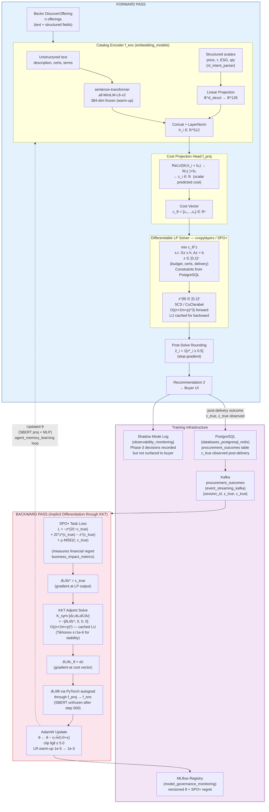

# Phase 3: End-to-End Differentiable Optimization (OptNet)

> **Position in roadmap:** See [[_comparison_engine_index]] for the full three-phase evolution.
> **Previous phase:** [[phase2_learning_to_rank]] — Learning to Rank via SGD.
> **Status:** Research track → shadow mode → A/B rollout. See §3.7.5 for gating.

---

## Overview

Phase 3 resolves the **fundamental flaw in [[phase2_learning_to_rank]]**: the predict-then-optimise gap. Even after Phase 2 learns a perfect ranking model, it is trained to minimise statistical proxy loss (RankNet cross-entropy, NDCG), not the actual business objective — financial regret on procurement decisions.

Phase 3 eliminates this gap by **embedding the operations-research (OR) solver directly inside the neural network** and training the entire stack end-to-end against realised financial regret. Gradients flow from the procurement outcome — the actual cost difference between what the engine recommended and what a perfect oracle would have recommended — back through the mathematical solver's KKT conditions into the [[embedding_models|sentence-transformer]] encoder's latent representations.

This is the *decision-focused learning* paradigm formalised in the OptNet line of research (Amos & Kolter, ICML 2017; Agrawal et al., NeurIPS 2019) and the SPO+ framework (Elmachtoub & Grigas, Management Science 2022).

> **The magic**: when the [[agent_memory_learning|learning signal]] flows back through the KKT adjoint into the token embeddings, the subword representation of "ISO 27001" shifts in the latent space toward directions that causally predict lower procurement cost in InfoSec categories — not merely correlated quality. The model does not learn *what the buyer prefers in the abstract* — it learns *what makes the optimiser pick the right answer*.

---

## 3.1 Procurement as a Mixed-Integer Linear Program (MILP)

The procurement decision is fundamentally a **combinatorial allocation problem**. Given $n$ feasible offerings and a binary selection vector $\mathbf{z} \in \{0,1\}^n$, the oracle decision under true costs $\mathbf{c}^{\text{true}}$ is:

$$\mathbf{z}^{\text{true}} \;=\; \underset{\mathbf{z} \in \mathcal{F}}{\arg\min} \;\; {\mathbf{c}^{\text{true}}}^\top \mathbf{z}$$

where the **feasible set** $\mathcal{F}$ encodes all hard business constraints:

$$\mathcal{F} \;=\; \left\{ \mathbf{z} \in \{0,1\}^n \;\;\Bigg|\;\; \begin{aligned} &\mathbf{p}^\top \mathbf{z} \leq B && \text{(budget ceiling)} \\ &\textstyle\sum_i z_i \geq 1 && \text{(at least one supplier)} \\ &\textstyle\sum_i z_i \leq k_{\max} && \text{(split-order cap)} \\ &D_i \cdot z_i \leq D_{\text{deadline}} \;\;\forall i && \text{(delivery feasibility)} \\ &G_{\text{cert}}\,\mathbf{z} \geq \mathbf{r}_{\text{cert}} && \text{(certification coverage)} \end{aligned} \right\}$$

Prices $\mathbf{p}$ and deadline $D_{\text{deadline}}$ are derived from `BecknIntent.budget_constraints` and `BecknIntent.delivery_timeline` (in integer hours) as parsed by [[nl_intent_parser]]. Certification requirements $G_{\text{cert}}, \mathbf{r}_{\text{cert}}$ are drawn from the procurement category configuration in [[databases_postgresql_redis|PostgreSQL]].

At recommendation time, $\mathbf{c}^{\text{true}}$ is **unknown** (it is only observed post-delivery). Instead, a neural encoder $f_\theta$ **predicts the cost vector from catalog features**:

$$\mathbf{c}_\theta \;=\; f_\theta(\mathbf{X}) \;\in\; \mathbb{R}^n$$

The engine solves $\mathbf{z}^*(\theta) = \arg\min_{\mathbf{z} \in \mathcal{F}} \mathbf{c}_\theta^\top \mathbf{z}$ and presents $\mathbf{z}^*(\theta)$ as the recommendation. Training adjusts $\theta$ to minimise the financial regret of acting on $\mathbf{z}^*(\theta)$ rather than the oracle $\mathbf{z}^{\text{true}}$.

---

## 3.2 Differentiable LP Relaxation via cvxpylayers

MILP differentiation is infeasible for gradient-based training: the argmin of an integer program is **piecewise constant** in $\mathbf{c}$, yielding a zero (or undefined) gradient almost everywhere. We apply the **LP relaxation** $\mathbf{z} \in [0,1]^n$ — the convex hull relaxation — transforming the MILP into a standard LP expressible as a QP with $Q = 0$:

$$\underset{\mathbf{z}}{\text{minimise}} \;\; \mathbf{c}_\theta^\top \mathbf{z} \qquad \text{subject to} \quad G\mathbf{z} \leq \mathbf{h}, \;\; A\mathbf{z} = \mathbf{b}, \;\; \mathbf{0} \leq \mathbf{z} \leq \mathbf{1}$$

This is implemented as a **cvxpylayers** `CvxpyLayer` (Agrawal et al., NeurIPS 2019). The library:

1. Canonicalises the CVXPY program to SCS cone standard form: $\min_\mathbf{x} \mathbf{c}^\top \mathbf{x}$ s.t. $A\mathbf{x} + \mathbf{s} = \mathbf{b}$, $\mathbf{s} \in \mathcal{K}$ (nonnegative orthant for LP).
2. Solves via the **SCS** or **CuClarabel** solver (ADMM-based, $O(\text{nnz}(A) \cdot k_{\text{iter}})$ per forward pass).
3. Computes gradients by differentiating the **homogeneous self-dual embedding (HSD)** residual map $\mathcal{R}(\mathbf{w}^*;\, \theta) = \mathbf{0}$ via an adjoint solve — without constructing the full Jacobian.

The **DPP (Disciplined Parameterized Programming)** requirement mandates that problem parameters appear affinely. The procurement LP satisfies this: $\mathbf{c}_\theta$ appears linearly in the objective; constraint matrices $G$, $A$ are constants or separately parameterised tensors.

```python
import cvxpy as cp
from cvxpylayers.torch import CvxpyLayer
import torch

n, n_cert = 20, 4                       # offerings, certification types

z       = cp.Variable(n, nonneg=True)
c_theta = cp.Parameter(n)               # neural predicted cost vector
p_vec   = cp.Parameter(n)               # quoted unit prices (INR)
G_cert  = cp.Parameter((n_cert, n))     # certification coverage matrix
r_cert  = cp.Parameter(n_cert)          # minimum required coverage per cert type
B_param = cp.Parameter(nonneg=True)     # budget cap

constraints = [
    z <= 1,                             # LP relaxation upper bound
    cp.sum(z) >= 1,                     # at least one supplier
    cp.sum(z) <= k_max,                 # split-order cap
    p_vec @ z <= B_param,               # budget constraint
    G_cert @ z >= r_cert,              # certification coverage requirements
]
prob  = cp.Problem(cp.Minimize(c_theta @ z), constraints)
assert prob.is_dpp()                    # must satisfy Disciplined Parameterized Programming

layer = CvxpyLayer(
    prob,
    parameters=[c_theta, p_vec, G_cert, r_cert, B_param],
    variables=[z],
)

# Forward pass: all inputs are differentiable PyTorch tensors
c_t        = f_theta(X_batch)           # neural encoder output, shape (batch, n)
z_star, = layer(c_t, p_t, G_t, r_t, B_t)

# Backward pass is fully automatic via PyTorch autograd through KKT adjoint
loss = spo_plus_loss(c_t, c_true, z_star, z_true, layer)
loss.backward()                         # gradients flow through solver → encoder
```

---

## 3.3 Forward Pass: KKT Conditions at the Optimum

The LP/QP solver returns the primal optimum $\mathbf{z}^*$ and dual variables $(\boldsymbol{\lambda}^*, \boldsymbol{\nu}^*)$ for inequality and equality constraints respectively. These satisfy the **Karush-Kuhn-Tucker (KKT) conditions**:

**Stationarity** (for LP, $Q = 0$):

$$\mathbf{c}_\theta \;+\; A^\top \boldsymbol{\nu}^* \;+\; G^\top \boldsymbol{\lambda}^* \;=\; \mathbf{0}$$

**Primal equality feasibility:**

$$A\mathbf{z}^* \;=\; \mathbf{b}$$

**Primal inequality feasibility:**

$$G\mathbf{z}^* \;\leq\; \mathbf{h}$$

**Dual feasibility:**

$$\boldsymbol{\lambda}^* \;\geq\; \mathbf{0}$$

**Complementary slackness:**

$$D(\boldsymbol{\lambda}^*)\,(G\mathbf{z}^* - \mathbf{h}) \;=\; \mathbf{0}$$

where $D(\boldsymbol{\lambda}^*) = \mathrm{diag}(\lambda^*_1, \ldots, \lambda^*_m)$. The slack vector $\mathbf{s} = \mathbf{h} - G\mathbf{z}^* \geq \mathbf{0}$ captures the distance from each active inequality boundary — active constraints ($s_j = 0$) generate non-zero dual variables ($\lambda^*_j > 0$) and are precisely the constraints that constrain the solver's optimum.

These $n + m + p$ conditions jointly characterise the unique optimum (under strong duality, guaranteed for the LP relaxation via Slater's condition).

---

## 3.4 Backward Pass: Implicit Differentiation Through the KKT System

The backward pass computes $\partial \mathcal{L}/\partial \mathbf{c}_\theta$ — and thence $\partial \mathcal{L}/\partial \theta$ — without differentiating through the solver's interior-point iterations. Instead, it applies the **implicit function theorem** to the KKT system.

Introducing the constraint slack $\mathbf{s} = \mathbf{h} - G\mathbf{z}^* \geq \mathbf{0}$ and rescaled duals $\tilde{\boldsymbol{\lambda}} = D(\mathbf{s})^{-1}\boldsymbol{\lambda}^*$, differentiating the KKT conditions with respect to problem parameters yields the **symmetrised KKT Jacobian system** (Amos & Kolter, ICML 2017):

$$\underbrace{\begin{bmatrix} Q & 0 & G^\top & A^\top \\ 0 & D(\boldsymbol{\lambda}^*/\mathbf{s}) & I & 0 \\ G & I & 0 & 0 \\ A & 0 & 0 & 0 \end{bmatrix}}_{K_{\text{sym}} \;\in\; \mathbb{R}^{(n+2m+p)\times(n+2m+p)}} \begin{bmatrix} d\mathbf{z} \\ d\mathbf{s} \\ d\tilde{\boldsymbol{\lambda}} \\ d\boldsymbol{\nu} \end{bmatrix} \;=\; -\begin{bmatrix} \partial\ell/\partial\mathbf{z}^* \\ \mathbf{0} \\ \mathbf{0} \\ \mathbf{0} \end{bmatrix}$$

For a given upstream loss gradient $\partial\ell/\partial\mathbf{z}^*$, solving this system via **LU factorisation of $K_{\text{sym}}$** (cached from the forward pass at $O((n+2m+p)^3)$ cost) yields the adjoint variable $d\mathbf{z}$ at only $O((n+2m+p)^2)$ additional cost via back-substitution. The gradient with respect to the cost vector is then:

$$\frac{\partial \ell}{\partial \mathbf{c}_\theta} \;=\; d\mathbf{z}$$

The **complete gradient chain** back to the neural encoder parameters $\theta$:

$$\frac{\partial \mathcal{L}_{\text{regret}}}{\partial \theta} \;=\; \underbrace{\frac{\partial \mathcal{L}_{\text{regret}}}{\partial \mathbf{z}^*}}_{\mathbf{c}^{\text{true}}} \;\cdot\; \underbrace{\frac{\partial \mathbf{z}^*}{\partial \mathbf{c}_\theta}}_{K_{\text{sym}}^{-1} \cdot (\partial \mathcal{R}/\partial \mathbf{c}_\theta)} \;\cdot\; \underbrace{\frac{\partial \mathbf{c}_\theta}{\partial \theta}}_{\text{PyTorch autograd}}$$

This is the **key computational insight**: $\partial \mathbf{z}^*/\partial \mathbf{c}_\theta$ is obtained by *one back-substitution* using the cached LU factorisation — $O((n+2m+p)^2)$ — rather than $O((n+2m+p)^3)$ for a fresh factorisation. For $n = 50$, $m = 30$, $p = 5$: the backward pass costs only ~0.5 ms per sample even though the forward KKT solve costs ~5 ms.

---

## 3.5 Decision-Aware Learning: Financial Regret as Training Signal

### 3.5.1 SPO Loss (Task Loss — Non-Convex, Non-Differentiable)

The **SPO (Smart Predict, then Optimize) loss** (Elmachtoub & Grigas, Management Science 2022) directly measures financial regret, connecting to [[business_impact_metrics]]:

$$\ell_{\text{SPO}}(\hat{\mathbf{c}},\, \mathbf{c}^{\text{true}}) \;=\; {\mathbf{c}^{\text{true}}}^\top \mathbf{z}^*(\hat{\mathbf{c}}) \;-\; z^*(\mathbf{c}^{\text{true}})$$

where $\hat{\mathbf{c}} = \mathbf{c}_\theta$ is the neural prediction and $z^*(\mathbf{c}) = \mathbf{c}^\top \mathbf{z}^*(\mathbf{c})$ is the optimal objective value. This equals **zero if and only if** $\mathbf{z}^*(\hat{\mathbf{c}}) = \mathbf{z}^*(\mathbf{c}^{\text{true}})$ — the model's predicted costs yield the same optimal decision as the true costs. The SPO loss is non-convex and discontinuous in $\hat{\mathbf{c}}$ (the argmin of an LP is piecewise constant); direct gradient computation is infeasible.

### 3.5.2 SPO+ Convex Surrogate

The **SPO+ loss** provides a tight convex upper bound derived via LP duality:

$$\boxed{\ell_{\text{SPO+}}(\hat{\mathbf{c}},\, \mathbf{c}^{\text{true}}) \;=\; -z^*(2\hat{\mathbf{c}} - \mathbf{c}^{\text{true}}) \;+\; 2\hat{\mathbf{c}}^\top \mathbf{z}^*(\mathbf{c}^{\text{true}}) \;-\; z^*(\mathbf{c}^{\text{true}})}$$

where $z^*(2\hat{\mathbf{c}} - \mathbf{c}^{\text{true}}) = \min_{\mathbf{z} \in \mathcal{F}} (2\hat{\mathbf{c}} - \mathbf{c}^{\text{true}})^\top \mathbf{z}$ is solved via a standard LP/MILP oracle. SPO+ satisfies:

1. $\ell_{\text{SPO}} \leq \ell_{\text{SPO+}}$ — tight convex upper bound (proven via LP duality).
2. $\ell_{\text{SPO+}} = 0 \iff \mathbf{z}^*(\hat{\mathbf{c}}) = \mathbf{z}^*(\mathbf{c}^{\text{true}})$ (consistent with the task objective).
3. **Subgradient requires only two oracle calls** — critical for MILP settings:

$$\partial_{\hat{\mathbf{c}}}\,\ell_{\text{SPO+}} \;=\; 2\!\left[\mathbf{z}^*(\mathbf{c}^{\text{true}}) \;-\; \mathbf{z}^*(2\hat{\mathbf{c}} - \mathbf{c}^{\text{true}})\right]$$

Both $\mathbf{z}^*(\mathbf{c}^{\text{true}})$ (the ground-truth optimal decision, stored in [[audit_trail_system]]) and $\mathbf{z}^*(2\hat{\mathbf{c}} - \mathbf{c}^{\text{true}})$ (the adversarial perturbation) are solved by standard LP/MILP oracle calls. No white-box access to solver internals is required — the oracle can be HiGHS (via `scipy.optimize.milp`) or Gurobi.

### 3.5.3 Combined Training Objective

$$\min_\theta \;\; \mathbb{E}_{(\mathbf{X},\,\mathbf{c}^{\text{true}},\,\mathbf{z}^{\text{true}})} \Bigl[\, \underbrace{\ell_{\text{SPO+}}\!\bigl(f_\theta(\mathbf{X}),\; \mathbf{c}^{\text{true}}\bigr)}_{\text{task loss (decision-aware)}} \;+\; \mu \underbrace{\bigl\|f_\theta(\mathbf{X}) - \mathbf{c}^{\text{true}}\bigr\|_2^2}_{\text{MSE auxiliary (stability)}} \,\Bigr]$$

The auxiliary MSE term ($\mu \in [0.01, 0.1]$) provides a dense gradient signal during early training before the SPO+ subgradients carry sufficient information. Decay schedule: $\mu_t = \mu_0 \cdot e^{-\rho t}$ zeroing out $\mu$ after $\sim 2{,}000$ steps, shifting training fully onto the task objective.

### 3.5.4 Strategic Choice: cvxpylayers vs. SPO+

| Criterion | cvxpylayers (white-box) | SPO+ (black-box oracle) |
|---|---|---|
| **Constraint type** | LP / QP / SOCP / SDP (convex, DPP) | Any polyhedral $\mathcal{F}$, including MILP |
| **Gradient type** | Smooth (full Jacobian via KKT adjoint) | Subgradient (non-smooth) |
| **Solver access** | Must expose KKT structure via SCS/Clarabel | Black-box; HiGHS/Gurobi compatible |
| **Oracle calls / training step** | 1 (forward + backward in one pass) | 2 (one for $\hat{\mathbf{c}}$, one for $\mathbf{c}^{\text{true}}$) |
| **Integrality** | LP relaxation + rounding only | Native; oracle handles integers |
| **When to use** | LP, QP, SOCP with totally unimodular $G$ | MILP, bundle allocation, cardinality constraints |

**Recommendation**: use cvxpylayers for single-supplier selection (totally unimodular $G$ — flow network); use SPO+ with HiGHS for hard multi-item bundle allocation.

---

## 3.6 Full Neural Architecture

The Phase-3 stack comprises four learnable components:

```
COMPONENT 1 — Catalog Encoder  f_enc
────────────────────────────────────────────────────────────────
  Input: Raw Beckn DiscoverOffering for each offering i
    • Unstructured text:  description, fulfillment_terms, certifications
    • Structured scalars: price, delivery_timeline, quantity, esg_tier

  Architecture:
    Unstructured text → sentence-transformer (all-MiniLM-L6-v2, embedding_models)
                        384-dim, frozen during warm-up phase
    Structured scalars → Linear projection ℝ^d_struct → ℝ^128
    Fuse via Concat + LayerNorm → h_i ∈ ℝ^512

  Parameters: 22M (SBERT, frozen early) + 200K (projection heads)
  SBERT unfrozen after 500 warm-up steps so SPO+ gradients update embeddings.

COMPONENT 2 — Cost Projection Head  f_proj
────────────────────────────────────────────────────────────────
  Architecture: 2-layer MLP
    h_i → ReLU(W₁h_i + b₁) → W₂(·) + b₂ → c_i ∈ ℝ (scalar cost)
    W₁ ∈ ℝ^{256×512},  W₂ ∈ ℝ^{1×256}

  Stacked over n offerings: c_θ = [c₁,...,cₙ] ∈ ℝⁿ

COMPONENT 3 — Differentiable LP Solver Layer
────────────────────────────────────────────────────────────────
  Forward:  z*(θ) = argmin c_θᵀz  s.t. Gz ≤ h, Az = b, z ∈ [0,1]ⁿ
  Backward: ∂z*/∂c_θ via KKT adjoint system K_sym  (cvxpylayers)
            OR  SPO+ subgradient 2(z*(c_true) − z*(2ĉ−c_true))
  Solver:   SCS v3 (ADMM, warm-startable) or CuClarabel (GPU)
  Cost:     O((n+2m+p)^3) forward LU, O((n+2m+p)^2) backward

COMPONENT 4 — Post-Solve Rounding Head
────────────────────────────────────────────────────────────────
  Maps continuous z*(θ) ∈ [0,1]ⁿ → ẑ ∈ {0,1}ⁿ  (stop-gradient applied)
    Option A: ẑᵢ = 1[z*ᵢ ≥ 0.5]         (threshold, O(n), fast)
    Option B: Greedy feasibility repair    (O(n²), constraint-safe)
    Option C: Randomised rounding          (ẑᵢ ~ Bernoulli(z*ᵢ), ensembles)

  → Final recommendation ẑ surfaced to Buyer UI
```

---

## 3.7 Computational Complexity and Engineering Realities

### 3.7.1 KKT Matrix Scaling

For the procurement LP with $n$ variables, $m$ inequality constraints, $p$ equality constraints, $K_{\text{sym}} \in \mathbb{R}^{(n+2m+p)\times(n+2m+p)}$:

| Scenario | $n$ | $m$ | $p$ | $K_{\text{sym}}$ size | Forward LU | Backward |
|---|---|---|---|---|---|---|
| Small category (cables) | 15 | 20 | 3 | $58 \times 58$ | < 1 ms | < 0.1 ms |
| Mid-size RFQ | 50 | 30 | 5 | $135 \times 135$ | ~5 ms | ~0.5 ms |
| Fleet procurement | 200 | 60 | 10 | $470 \times 470$ | ~150 ms | ~10 ms |
| Large catalogue | 500 | 100 | 20 | $1{,}120 \times 1{,}120$ | ~2 s | ~100 ms |

The $O((n+2m+p)^3)$ forward cost is not a practical bottleneck for typical procurement sessions ($n \leq 50$). Fleet-level searches require GPU-accelerated CuClarabel. Monitor solver latency via [[observability_monitoring]].

### 3.7.2 Memory Requirements

Storing the full KKT factorisation for a training batch of size $B$:

$$\text{Memory} \;\approx\; B \times (n + 2m + p)^2 \times 8\;\text{ bytes (float64)}$$

For $B = 32$, $n = 50$: $32 \times 135^2 \times 8 \approx 4.7$ MB — negligible. For $B = 32$, $n = 500$: $32 \times 1{,}120^2 \times 8 \approx 319$ MB — manageable on a 24 GB GPU.

### 3.7.3 Gradient Conditioning

The Jacobian $\partial\mathbf{z}^*/\partial\mathbf{c}_\theta$ is ill-conditioned near **degenerate LP vertices** (number of active constraints equals $n$, making the solution hyper-sensitive to cost perturbations). Mitigations:

1. **Tikhonov regularisation**: add $\epsilon I$ ($\epsilon = 10^{-6}$) to $K_{\text{sym}}$ diagonal before LU factorisation.
2. **Gradient clipping** in the PyTorch training loop: `torch.nn.utils.clip_grad_norm_(theta, max_norm=5.0)`.
3. **Linear LR warm-up**: ramp $\eta$ from $10^{-5}$ to $10^{-3}$ over the first 500 steps to avoid large initial steps through ill-conditioned KKT systems.
4. **Condition number monitoring**: log $\kappa(K_{\text{sym}})$ to [[observability_monitoring]]; alert if $> 10^6$.

### 3.7.4 Integrality Gap

When the LP relaxation is not tight — i.e., $\mathbf{z}^* \in (0,1)^n$ has fractional components — the model optimises for decisions in $\mathcal{F}_{\text{LP}} \supset \mathcal{F}_{\text{MILP}}$. The model may converge to recommending fractional allocations that survive rounding but are suboptimal compared to the exact MILP solution.

**Resolution**: use SPO+ with a MILP oracle (HiGHS via `scipy.optimize.milp`, or Gurobi under Infosys licence) for categories where hard integrality is non-negotiable (e.g., indivisible capital equipment, software licences).

### 3.7.5 Shadow Mode and Production Gating

Phase 3 must operate in **shadow mode** — validated by the [[observability_monitoring]] stack — for a minimum of one fiscal quarter before any buyer-facing rollout:

| Gate | Requirement | Tracked via |
|---|---|---|
| Shadow-mode evaluation | Phase-3 decisions logged alongside Phase-1/2 for one full fiscal quarter | [[observability_monitoring]] |
| Regret gate | Phase-3 shadow regret statistically significantly lower than Phase-2 baseline | [[business_impact_metrics]] |
| Interpretability gate | Counterfactual explanation module (dual-variable inspection + LIME/SHAP over $f_\theta$) passes review | [[security_compliance]] |
| Fallback gate | Phase-1 fallback path operational and auto-triggered on solver divergence or SLA breach | [[comparison_scoring_engine]] |
| Model governance | All model versions in [[model_governance_monitoring\|MLflow]] with SPO+ regret metric, training corpus hash, and eval date | [[model_governance_monitoring]] |

The ground-truth cost vectors $\mathbf{c}^{\text{true}}$ and final buyer decisions $\mathbf{z}^{\text{true}}$ are sourced from [[databases_postgresql_redis|PostgreSQL]] (`procurement_outcomes` table) and streamed via [[event_streaming_kafka|Kafka]] topic `procurement_outcomes` to the training pipeline.

---

## 3.8 Architecture Diagram



---

## 3.9 Theoretical Foundations

| Framework | Core Contribution | Role in Phase 3 |
|---|---|---|
| OptNet (Amos & Kolter, ICML 2017) | QP layer with KKT backward; $K_{\text{sym}}$ derivation | Foundation for differentiable LP/QP solver layer |
| cvxpylayers (Agrawal et al., NeurIPS 2019) | Cone program differentiation via HSD adjoint | Production implementation of the LP solver layer |
| SPO+ (Elmachtoub & Grigas, Mgmt. Sci. 2022) | Convex upper bound on task loss; 2-oracle subgradient | Training objective for MILP settings |
| Perturbed Optimizers (Berthet et al., NeurIPS 2020) | Smooth surrogate via Gumbel/Normal perturbation | Alternative when oracle is truly black-box |
| Theseus (Pineda et al., NeurIPS 2022) | Differentiable nonlinear NLS (Gauss-Newton/LM) | Future extension to nonconvex procurement objectives |
| LambdaLoss (Wang et al., CIKM 2018) | Theoretical grounding for Phase 2's LambdaRank | Bridge between [[phase2_learning_to_rank]] and Phase 3 |

---

*← [[phase2_learning_to_rank]] | [[_comparison_engine_index]]*
