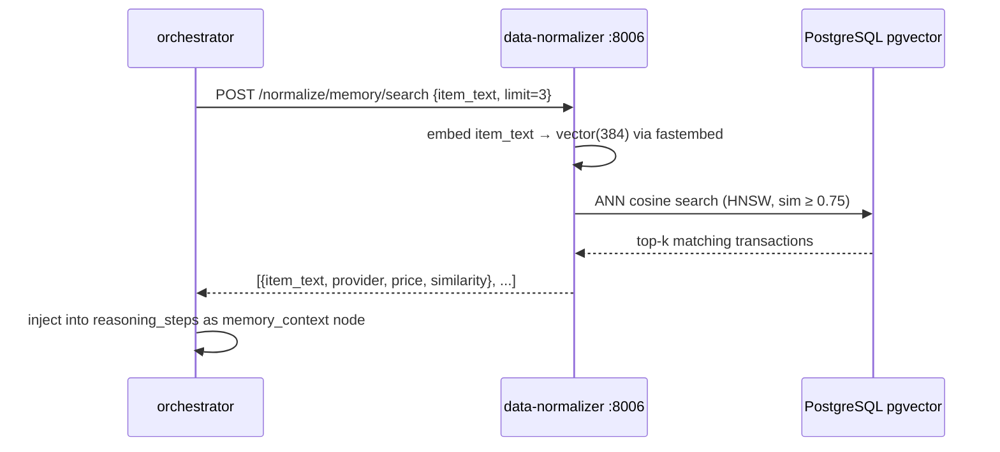

# AI Model: Memory & Retrieval

> [!architecture] Role in the AI Stack
> The Memory & Retrieval Model gives the procurement agent **persistent institutional knowledge**. When a new request arrives, this model retrieves the most semantically similar past transactions from [[databases_postgresql_redis|PostgreSQL + pgvector]] and injects them as context into the [[comparison_scoring_engine|scoring]] step (RAG pattern). This is what enables the agent to say: *"Last quarter you ordered similar items from Seller X at ₹1.8/unit with 98% on-time delivery."*

## Architecture (as implemented)

| Layer | Technology |
|---|---|
| Embedding model | `BAAI/bge-small-en-v1.5` via fastembed (ONNX, local, no PyTorch) |
| Vector dimension | 384 |
| Vector database | PostgreSQL 16 + pgvector (HNSW cosine indexing) |
| Similarity measure | Cosine similarity |
| Similarity threshold | ≥ 0.75 (results below this are filtered before injection) |
| Metadata filtering | Applied at write time (category, provider embedded in `metadata` JSONB) |

See [[vector_db_qdrant_pinecone]] for why pgvector was chosen over Qdrant for this phase, and [[embedding_models]] for the full model comparison.

## Technical Specs

| Attribute | Value |
|---|---|
| Expected corpus (pilot) | < 10K confirmed transactions |
| Retrieval latency target | `< 100 ms` |
| Enrichment timeout | 5 s (orchestrator-level, non-blocking) |
| Top-k returned | 3 |
| Training approach | None — pre-trained embeddings; no fine-tuning required |

## What Gets Stored

After each confirmed order the orchestrator fires `asyncio.create_task(_persist_memory(...))` (fire-and-forget) → `POST /normalize/memory/write` → data-normalizer:

- Item text summary (item name + quantity + unit)
- Provider name and ID
- Final price and currency
- Delivery hours
- Transaction ID and timestamp

## Retrieval Flow

## Phase 3 Acceptance Criteria

From [[phase3_advanced_intelligence_enterprise_features|Phase 3 Agent Memory milestone]]:

- [x] `agent_memory_vectors` stores confirmed transactions with `vector(384)` HNSW cosine index
- [x] Similarity search returns relevant results filtered at ≥ 0.75
- [x] Retrieval latency `< 100 ms` (confirmed under representative load)
- [x] `memory_context` node visible in the frontend agent reasoning panel on similar requests
- [x] Isolation confirmed — unrelated items return empty results

## Original Spec vs. Implementation

| Spec | Implemented |
|---|---|
| OpenAI `text-embedding-3-large` (3072 dims) | `BAAI/bge-small-en-v1.5` (384 dims, ONNX, local) |
| Qdrant (self-hosted, HNSW) + pgvector mirror | pgvector only — Qdrant removed |
| Nightly PostgreSQL → Qdrant ETL sync | Not applicable (single store) |
| LangSmith model governance pipeline | Schema exists; pipeline deferred to Phase 4 |

> [!insight] Learning Flywheel
> The core value proposition holds regardless of the vector store chosen: more confirmed orders → richer memory → better supplier loyalty bonuses → higher-quality recommendations. After sufficient transaction history, the agent's preferred-supplier ranking becomes a genuine competitive advantage. The pgvector implementation is fully migration-compatible with Qdrant if the corpus outgrows it — the embedding dimension and cosine similarity measure are identical.
