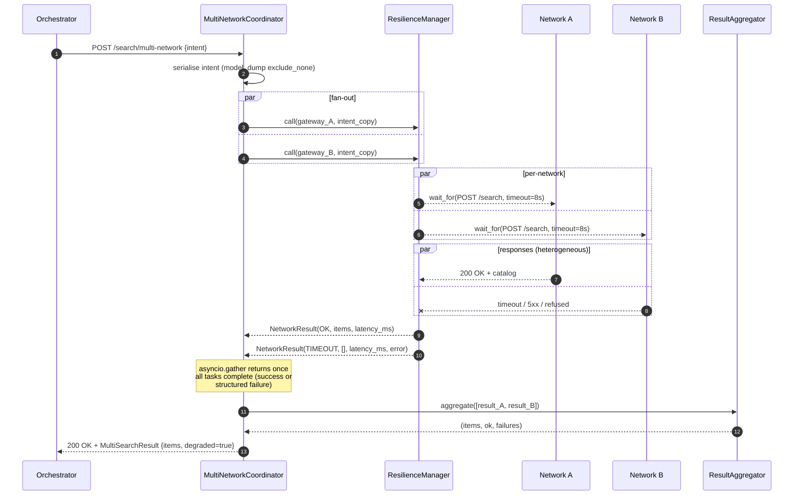

# 01 — Multi-Network Fan-Out (Coordinator)

> [!architecture] Context
> This note describes the **coordinator** that fans a single `BecknIntent` out to every configured Beckn network in parallel and synthesises the per-network results into one [[03_catalog_deduplication|aggregated catalog]]. It is one of three siblings under [[_discovery_engine_index]]; the [[02_graceful_degradation|resilience layer]] owns failure translation and the [[03_catalog_deduplication|aggregator]] owns merge semantics. The coordinator's only responsibility is **bounded, structured concurrency** — fan out, await, fan in.

## Architectural posture

The coordinator is a thin orchestration shell. It enforces three architectural properties:

1. **Bounded concurrency.** Each configured network is dispatched as exactly *one* `asyncio.Task` per request. No backpressure beyond the bounded `aiohttp.TCPConnector(limit=64)` connection pool — fan-out width is `len(gateways)`, which is small (typically 2–5) for the foreseeable future.
2. **Bounded wall-clock.** The fan-out's total elapsed time is `max(gateway.timeout_s for gateway in gateways)` plus small scheduling overhead. The slowest network does not dictate the cluster's tail latency, because [[02_graceful_degradation|`asyncio.wait_for`]] inside the resilience layer self-terminates the slowest task.
3. **No shared mutable state.** Each task receives an independent copy of the intent payload (`intent.model_dump(exclude_none=True)`); each task writes only to its own `NetworkResult`; the [[03_catalog_deduplication|aggregator]] is a pure function. Race conditions cannot exist by construction.

## Concurrency model

## Code anatomy

The coordinator is implemented in `services/discovery_engine/src/coordinator.py` as `class MultiNetworkCoordinator`. Three structural choices warrant explanation:

### Choice 1 — `asyncio.gather` over `asyncio.as_completed`

`asyncio.gather(*coros, return_exceptions=True)` is preferred over `asyncio.as_completed(coros)` for this workload because:

- **Bounded fan-in.** We *want* to wait for every network (or its timeout) before responding — the aggregator can only run after all data is in. `as_completed` would let us start aggregating early, but the aggregator's merge logic is `O(n²)` worst-case (geographic clustering within a name bucket), so early-streaming gains little. The `max(timeouts)` bound is the natural ceiling.
- **Per-network timeout is already inside `wait_for`.** Each task self-terminates at its own deadline; we don't need an iterator-level deadline.
- **Simpler error path.** With `return_exceptions=True`, every entry in the result list is *either* a `NetworkResult` (success or structured failure) *or* a `BaseException` (only if the resilience layer leaks). The coordinator's `_coerce_to_network_results` handles both cases uniformly.

### Choice 2 — Defensive `return_exceptions=True`

The [[02_graceful_degradation|resilience layer]] contractually never raises — every code path returns a `NetworkResult`. So in steady state, `gather()` would never see an exception. But:

- A future bug in resilience could leak `BaseException`.
- `asyncio.CancelledError` is intentionally re-raised by the resilience layer (we must honour cancellation), and a cancelled coordinator task should not crash sibling tasks.

`return_exceptions=True` makes the fan-out *crash-resistant*. The `_coerce_to_network_results` helper converts any leaked exception into a `NetworkResult(status=UNKNOWN_ERROR)` with the exception's string representation, so the [[03_catalog_deduplication|aggregator]] always sees a homogeneous input list.

### Choice 3 — Stable result ordering

`asyncio.gather` preserves the input order of coroutines in the result list. The coordinator zips this back with `self._gateways` to reconstruct `(gateway, result)` pairs deterministically — important for the per-network latency map in the response.

## Wall-clock proof

Suppose two networks are configured: `network_a (timeout=8s)`, `network_b (timeout=8s)`. Worst-case scenarios:

| Scenario | `network_a` latency | `network_b` latency | Total wall-clock |
|---|---|---|---|
| Both fast | 200 ms | 250 ms | ~250 ms |
| One slow | 200 ms | 7.9 s | ~7.9 s |
| Both timeout | 8 s | 8 s | ~8 s |
| One refused | < 1 ms | 200 ms | ~200 ms |

The total is **always `max(observed)`, bounded above by `max(timeout_s)`**. Adding networks does not extend wall-clock — only widens the parallel fan-out. Linearisation is *only* possible by the aggregator step, which runs in `O(items)` after the fan-out completes.

## Thread-safety review

The system is single-threaded (`asyncio`), so "thread-safety" reduces to *task-safety* — atomicity across cooperative concurrency points. Audit:

- **No shared mutable state in the coordinator.** Each task receives a fresh dict (`intent.model_dump`); each task's output goes to a distinct slot in `gather`'s result list.
- **The `aiohttp.ClientSession` is shared across tasks.** This is *the* standard pattern and explicitly designed for concurrent use — the underlying connector pool is async-safe.
- **Breakers are shared.** Two tasks racing on the *same* network are impossible by construction (one task per gateway per request), but two requests overlapping in time can both hit the same breaker. That race is serialised by [[02_graceful_degradation|`CircuitBreaker._lock`]].

## Exception-handling review

Exception flow from inside-out:

1. **`network_caller` (HTTP layer)** — raises `aiohttp.ClientError` family, `asyncio.TimeoutError` (from `wait_for`), or generic `Exception`.
2. **Resilience layer** — catches everything specific, classifies into `NetworkStatus`. Re-raises only `asyncio.CancelledError`.
3. **`asyncio.gather(return_exceptions=True)`** — captures any leaked `BaseException` (only `CancelledError` should ever escape resilience). If a non-cancellation exception leaks, `_coerce_to_network_results` converts it to `UNKNOWN_ERROR`.
4. **`CancelledError` propagation** — when the coordinator's enclosing task is cancelled (e.g. orchestrator timeout), gather raises `CancelledError`. We do **not** catch it inside `search()` — the cancellation bubbles up to the FastAPI handler, which returns the appropriate response.

> [!warning] The single failure mode that can crash `/search/multi-network`
> The only uncaught path is the `RuntimeError("no aiohttp session")` raised when the coordinator is constructed without a session and used outside an `async with` block. This is a programmer error, not a runtime condition, and surfaces immediately on the first request after a misconfiguration — exactly when you want a loud failure.

## Tradeoffs

- **gather vs. as_completed:** chose gather for simplicity. If the aggregator ever becomes a bottleneck for fast-network items, we can switch to as_completed + an in-flight aggregator without changing the public API.
- **One task per gateway:** linear scaling, but for very large gateway sets (10+) we may want a `Semaphore`-bounded variant to avoid overwhelming the local connection pool. Not currently needed.
- **No retries inside the engine:** retry policy belongs to the orchestrator (it knows the user's freshness budget), not to the discovery layer. Failed networks return immediately so the orchestrator can decide whether to issue a follow-up request after a backoff window.

## References

- [Python docs — `asyncio.gather`](https://docs.python.org/3/library/asyncio-task.html#asyncio.gather)
- [Python docs — `asyncio.wait_for`](https://docs.python.org/3/library/asyncio-task.html#asyncio.wait_for)
- [aiohttp — `ClientSession` shared-across-tasks pattern](https://docs.aiohttp.org/en/stable/client_quickstart.html)
- Code: `services/discovery_engine/src/coordinator.py`
- Test coverage: `tests/test_multi_search.py::test_scenario_b_does_not_block_on_slowest_network` (concurrency proof — wall-clock < 2 s with one network sleeping 60 s)
- Sibling design: [[01_langgraph_state_machine]] uses the inverse pattern (single-thread state machine with `interrupt()` to pause) — different problem (long-running deal), different shape
