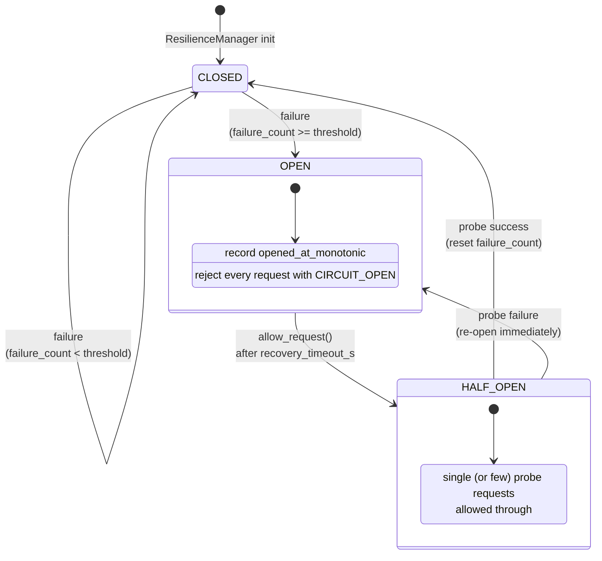

# 02 — Graceful Degradation (Resilience + Circuit Breaker)

> [!architecture] Context
> This note defines the **failure model** for multi-network discovery. The [[01_multi_network_fan_out|coordinator]] guarantees concurrent dispatch; this layer guarantees that *any* error from *any* network is captured, classified, and converted into a structured `NetworkResult` rather than propagated as an exception. The single architectural invariant: **`ResilienceManager.call()` never raises** (except for `CancelledError`, which is honoured). The downstream [[03_catalog_deduplication|aggregator]] therefore always sees a homogeneous list — no special-case code paths.

## The fail-open posture

The engine inherits the asymmetry documented in [[04_resilience_and_mlops]] §6 — Kafka audit fails open, Postgres fails closed, Redis is dual-pathed. Discovery extends this:

| Dependency | Failure stance | Reason |
|---|---|---|
| Individual Beckn network | **Fail open** (record + continue) | Multi-network is the redundancy — one network's outage is the *raison d'être* of the engine |
| All Beckn networks | **Fail open** (empty `items`, `degraded=true`) | Returning 5xx to the orchestrator would obscure the structured failure list; HTTP 200 + body is more debuggable |
| Aggregator | **Fail closed** | Pure function; cannot fail without a code bug — let the exception propagate so a P1 alert fires |
| aiohttp connection pool | **Fail closed** (`RuntimeError`) | Configuration error → loud failure → fast detection |

## Failure taxonomy — `NetworkStatus`

Every per-network outcome lands on one of these enum values. The mapping from raw exception to enum is **exhaustive** — see the exception-handling table below.

| `NetworkStatus` | Meaning | Triggering condition |
|---|---|---|
| `OK` | Catalog returned, items present (possibly zero) | HTTP 200 + parseable Beckn body |
| `TIMEOUT` | `wait_for` deadline elapsed | `asyncio.TimeoutError` from `wait_for(coro, timeout=gateway.timeout_s)` |
| `UPSTREAM_5XX` | Server-side failure on the gateway | `aiohttp.ClientResponseError` with `status >= 500` |
| `UPSTREAM_4XX` | Client-side error (malformed request, auth fail) | `aiohttp.ClientResponseError` with `400 ≤ status < 500` |
| `CONNECTION_REFUSED` | TCP / DNS / drop | `aiohttp.ClientConnectionError`, `ConnectionError`, `OSError` |
| `INVALID_RESPONSE` | Reached the server but body is unparseable | `aiohttp.ContentTypeError`, `ClientPayloadError`, `ValueError` |
| `CIRCUIT_OPEN` | Pre-flight breaker rejection | Breaker state == OPEN at request time |
| `UNKNOWN_ERROR` | Catch-all, indicates a bug | Any other `aiohttp.ClientError` or `Exception` |

The enum is *closed* — adding a new status requires a code change *and* a test, surfacing schema drift as a build break rather than a silent integration regression.

## Circuit breaker state machine



Configuration knobs (`DiscoveryConfig`):

- `circuit_failure_threshold` — default `3`. Number of consecutive failures in CLOSED before opening.
- `circuit_recovery_timeout_s` — default `30.0`. Wall-clock to wait in OPEN before allowing a HALF_OPEN probe.

> [!insight] Why a re-trip from HALF_OPEN is *immediate*
> A single probe failure during HALF_OPEN re-opens the breaker with the timer reset — no failure-count incrementing, no threshold check. The probe **is** the test; if it fails, the network is still broken and there is no point letting other requests through to confirm what we just observed. This avoids the [thundering herd](https://en.wikipedia.org/wiki/Thundering_herd_problem) on a freshly-recovering upstream.

## Timeout policy

Three timeout layers, each independent:

| Layer | Knob | Default | Purpose |
|---|---|---|---|
| **Per-network** | `gateway.timeout_s` | 8.0 s | Bounds an individual `/search` round-trip. Enforced by `asyncio.wait_for` inside `ResilienceManager.call()`. |
| **Outer HTTP** | `http_outer_timeout_s` | 60.0 s | Belt-and-braces ceiling on the `aiohttp.ClientSession`. Should never trigger if per-network timeout is correct. |
| **Orchestrator** | (caller-side) | n/a | Orchestrator-level deadline; cancels the discovery task if it exceeds the user's freshness budget. Propagated via `asyncio.CancelledError`. |

## Exception → `NetworkStatus` translation table

This is the heart of the resilience layer. The order matters — more specific exceptions are caught first.

| Exception class (catch order) | Maps to `NetworkStatus` | Records to breaker | Re-raised |
|---|---|---|---|
| `asyncio.TimeoutError` | `TIMEOUT` | failure | no |
| `aiohttp.ClientResponseError` (status ≥ 500) | `UPSTREAM_5XX` | failure | no |
| `aiohttp.ClientResponseError` (status < 500) | `UPSTREAM_4XX` | failure | no |
| `aiohttp.ClientConnectionError`, `ConnectionError`, `OSError` | `CONNECTION_REFUSED` | failure | no |
| `aiohttp.ContentTypeError`, `aiohttp.ClientPayloadError`, `ValueError` | `INVALID_RESPONSE` | failure | no |
| `aiohttp.ClientError` (catch-all for the family) | `UNKNOWN_ERROR` | failure | no |
| **`asyncio.CancelledError`** | n/a | failure | **YES** |
| `Exception` (final catch-all) | `UNKNOWN_ERROR` | failure | no |

The `CancelledError` re-raise is non-negotiable per [PEP 3156](https://peps.python.org/pep-3156/) — swallowing cancellation breaks task-cancellation semantics for everything upstream and is a [common asyncio antipattern](https://docs.python.org/3/library/asyncio-task.html#task-cancellation). We *do* record it as a breaker failure first (the network's slowness contributed to the cancellation), but the exception itself bubbles up to `asyncio.gather`, which then cancels the sibling tasks and re-raises to the coordinator's caller.

## Thread-safety review

`CircuitBreaker` is the only stateful object on the hot path. State mutations are protected by `asyncio.Lock`:

- `allow_request()` — locks the entire state-read + (potential) `OPEN → HALF_OPEN` transition. Two concurrent tasks racing on the same breaker cannot both observe `OPEN` and both transition — only one wins the lock and flips the state.
- `record_success()` and `record_failure()` — lock the increment + threshold check. Without the lock, two concurrent failures could both observe `failure_count == threshold - 1` and both write `failure_count = threshold`, missing the trip.

The lock cost is one fast atomic per breaker per call — negligible compared to the network round-trip. No lock contention is expected because there's at most one breaker per network per replica, and one task per breaker per request.

## Audit emission

Every non-`OK` outcome logs a structured warning via the Python `logging` module. The format is consumable by [[observability_stack|Loki / structured-log shippers]] without modification:

```
WARNING src.resilience: Network %s timed out after %.2fs (latency_ms=%.1f)
WARNING src.resilience: Network %s HTTP %d (%s)
WARNING src.resilience: Network %s connection refused/dropped: %s
WARNING src.resilience: Network %s returned invalid response: %s
WARNING src.resilience: Circuit tripped to OPEN after %d consecutive failures
```

The Phase-4 [[04_resilience_and_mlops|Kafka audit pipeline]] will mirror these events to the `procurement.discovery.v1` topic with the same envelope shape used by the negotiation engine (`schema_version`, `event_type`, `correlation_id`, `occurred_at`, `idempotency_key`, `trace_context`, `payload`). The current logger path satisfies the Phase-3 acceptance gate; Kafka wiring is a drop-in upgrade.

## Resilience matrix

| Failure | Detection | Mitigation | Effect on `MultiSearchResult` |
|---|---|---|---|
| One network 5xx | `aiohttp.ClientResponseError` with status ≥ 500 | breaker increments; structured failure recorded | `degraded=true`, sibling items present |
| One network timeout | `wait_for` raises `TimeoutError` | wall-clock bounded by `gateway.timeout_s`; sibling tasks unaffected | `degraded=true`, sibling items present |
| One network refused | `ClientConnectionError` / `OSError` | recorded; breaker advances toward OPEN | `degraded=true`, sibling items present |
| **All networks fail** | `len(failures) == len(gateways)` | empty `items`, HTTP 200 with full failure list | `degraded=true`, `items=[]` |
| Breaker OPEN on cold call | `allow_request() == False` | request fast-fails without HTTP round-trip | `status=CIRCUIT_OPEN` in failure entry |
| aiohttp pool exhaustion | `ConnectorError` from pool | translated to `CONNECTION_REFUSED` (pool limit reached for that host) | normal failure path |
| Orchestrator timeout | `CancelledError` propagates | breaker failure recorded; exception re-raised; sibling tasks cancelled | n/a — request returns from FastAPI handler |
| Coordinator built without session | `RuntimeError` | immediate, loud failure | n/a — startup misconfig |

## Tradeoffs

- **No exponential backoff inside the engine.** The breaker provides crude "OPEN → HALF_OPEN" recovery; for finer-grained backoff per request, the orchestrator should retry with its own jitter. Adding backoff here would compound with orchestrator-level retries.
- **No per-network token bucket.** A network that responds quickly to low-volume traffic but `429 Too Many Requests` at high volume isn't well-served by a CB tuned for hard failures. Phase-4: `aiolimiter` per-network.
- **Failure count resets on success.** A network with a 30 %-failure baseline never trips because failures don't accumulate. This is correct for our SLO target (we tolerate intermittent flakes), but means very flaky networks won't be blacklisted. Add a *sliding-window* failure rate detector if this becomes an issue.

## References

- [Martin Fowler — Circuit Breaker pattern](https://martinfowler.com/bliki/CircuitBreaker.html)
- [Netflix Hystrix retrospective](https://github.com/Netflix/Hystrix/wiki) — the canonical implementation; informed the three-state design
- [purgatory](https://github.com/mardiros/purgatory) and [aiocircuitbreaker](https://pypi.org/project/aiocircuitbreaker/) — alternate Python implementations; we chose to inline our own to avoid a dependency for ~150 lines
- [PEP 3156 — Asynchronous IO support and task cancellation](https://peps.python.org/pep-3156/)
- Code: `services/discovery_engine/src/resilience.py`
- Test coverage: `test_circuit_breaker_trips_after_consecutive_failures`, `test_circuit_breaker_success_clears_failure_count`, `test_circuit_breaker_half_open_probe_failure_reopens`, `test_scenario_c_mixed_failure_types`
- Related cluster: [[04_resilience_and_mlops]] for the broader negotiation-engine resilience philosophy that this layer inherits
