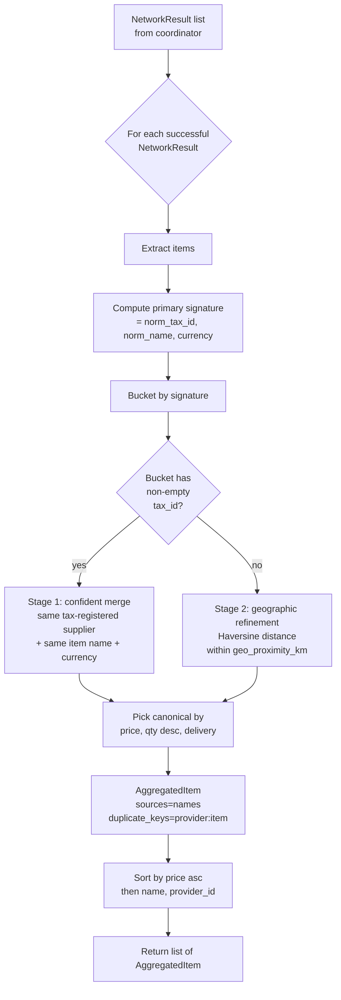

# 03 — Catalog Aggregator & Deduplication

> [!architecture] Context
> This note describes the **fan-in synthesis** stage of multi-network discovery. The [[01_multi_network_fan_out|coordinator]] hands the aggregator a list of `NetworkResult` objects (each already classified by [[02_graceful_degradation|the resilience layer]]); the aggregator returns a single canonical, deduplicated catalog. The aggregator is a **pure function** — no I/O, no shared state, no awaits — so it is trivially testable and safely concurrent. Downstream, the [[comparison_scoring_engine]] ranks the aggregated items, and the orchestrator feeds the ranked list into the [[_negotiation_engine_index|Negotiation Engine]].

## The dedup problem

A buyer's intent (`"Cat6 cable, 300 m, Mumbai"`) typically returns catalogs from multiple Beckn networks. The same physical supplier may appear on more than one network — same store, same SKU, same price — because:

* Networks federate registries (a BPP can register on Network A *and* Network B).
* Catalog normalisation between networks is imperfect (one might emit `Cat-6 Cable`, the other `cat6 cable`).
* Geographic coordinates can drift by a few metres between registrations.
* Tax-id reporting is inconsistent — some networks redact it, some normalise differently.

Without dedup, the [[comparison_scoring_engine]] would see "two suppliers", inflate the apparent market, and possibly recommend a counter-offer against a supplier that has *already* responded on a different network. Dedup is a *correctness* property, not a UX nicety.

## Two-stage match strategy



### Stage 1 — Primary signature

The primary key for matching is the triple:

```
signature = (normalize_tax_id(item.tax_id), normalize_text(item.name), item.currency.upper())
```

Where:

- `normalize_tax_id` uppercases and strips whitespace + hyphens. `" gst-123 "` ≡ `"GST123"`. Survives common GST/PAN/EIN formatting drift.
- `normalize_text` lowercases, strips diacritics (Unicode NFKD + ASCII fold), removes punctuation, and collapses whitespace. `"Cat-6  Cable"` ≡ `"cat 6 cable"`. Catches typo-level drift between catalogs.
- `currency` is upper-cased verbatim — same supplier listing the same item in INR vs. USD must remain distinct items.

Items sharing a signature merge into one bucket. The presence of a non-empty `tax_id` makes this a **confident match** — same tax-registered supplier offering the same named item is, by definition, the same offering.

### Stage 2 — Geographic refinement

When `tax_id` is empty (one network redacted it, or the supplier is unregistered), the primary signature collapses to `(name, currency)` — too weak to merge by alone. Two coffee shops named "Brew" in different cities should *not* merge.

The aggregator falls back to Haversine great-circle distance:

$$
d_{km} = 2R \cdot \arcsin\left(\sqrt{\sin^2\left(\frac{\Delta\phi}{2}\right) + \cos(\phi_1)\cos(\phi_2)\sin^2\left(\frac{\Delta\lambda}{2}\right)}\right)
$$

where $R = 6371$ km (mean Earth radius) and $\phi, \lambda$ are latitude/longitude in radians. Items within `geo_proximity_km` (default 0.5 km — covers GPS jitter and small-store relocations) merge; items farther apart stay distinct.

Items with **missing** GPS in this bucket form singleton clusters — we cannot prove identity without coordinates, so the conservative choice is to preserve them as distinct. False positives (over-merging) are more harmful than false negatives (failing to merge) because the downstream [[comparison_scoring_engine]] handles duplicate alternatives gracefully but cannot recover from a wrongly-merged offer.

## Merge resolution

When a cluster contains 2+ items, one becomes the *canonical* `AggregatedItem`. The tie-break order is `(price, -quantity_available, delivery_hours)`, evaluated as the `_merge_score` tuple:

| Tie-break field | Ordering | Rationale |
|---|---|---|
| `price` | ascending | Buyer wins. The cheapest of two identical listings is what the buyer would have chosen anyway. |
| `quantity_available` | descending (negated for min) | The richer record is preferred — more capacity available is more useful for the negotiation. |
| `delivery_hours` | ascending | Faster delivery wins when price and quantity are tied. |

All merged entries' `(provider_id, item_id)` keys are written to `AggregatedItem.duplicate_keys` — preserving the full audit trail so an operator can replay the merge or surface "available on N other networks" in the UI.

`sources` lists every network the item was observed on (sorted alphabetically for deterministic JSON output).

## Output ordering

The final `list[AggregatedItem]` is sorted by `(price, name, provider_id)` ascending — three tie-breakers ensure deterministic ordering for snapshot tests and stable diffs in audit replay. The [[comparison_scoring_engine]] re-sorts by its own multi-criteria score, so this ordering is only a *display* default.

## Thread-safety review

The aggregator has no asyncio primitives at all — it's a synchronous pure function. Audit:

- No `await` (intentional — the aggregator must complete in microseconds and never block the event loop).
- No `asyncio.Lock` (no shared state to protect).
- No `threading` (pure functions are trivially thread-safe).
- All inputs are `Pydantic v2` immutable model instances; mutation is impossible.

A future optimisation could shard the aggregation across CPU cores via `asyncio.to_thread` if catalogs ever hit ~10⁵ items, but the current implementation handles the expected ≤ 1000 items per fan-out in single-digit milliseconds.

## Exception-handling review

The aggregator catches nothing — it has nothing to catch. Defensive choices:

- `_parse_gps` returns `Optional[tuple[float, float]]` rather than raising on bad input, treating "no parseable GPS" the same as "no GPS provided".
- `_haversine_km` clamps the inner term with `min(1.0, sqrt(h))` to avoid `math.asin` domain errors from floating-point overshoot on very close points.
- Empty input lists produce empty output lists — no special-casing.

If a Pydantic `CatalogItem` ever fails to construct upstream in [[02_graceful_degradation|`_parse_beckn_catalog`]], that item is logged at DEBUG and dropped — the aggregator never sees a malformed object.

## Tradeoffs

- **No semantic similarity.** Current dedup is structural (string normalisation + GPS). Two catalog entries with completely different worded names but representing the same SKU (e.g., `"Cat-6 UTP Network Cable 300m"` vs. `"CAT6 UTP Cable, 300 metres roll"`) won't merge. Phase-4: embed both names with [[embedding_models|`all-MiniLM-L6-v2`]], cluster by cosine similarity > 0.92, store the embeddings in [[vector_db_qdrant_pinecone|Qdrant]] for cross-request reuse.
- **No supplier-graph reconciliation.** Two BPPs that are the *same legal entity* but file different tax-IDs on different networks won't merge. Requires a trust-graph maintained out-of-band by [[catalog_normalizer]].
- **Lowest-price canonical.** Always picking the cheapest item maximises the buyer's apparent options but obscures other dimensions (warranty quality, supplier rating). The downstream [[comparison_scoring_engine]] re-ranks anyway, so this is mostly cosmetic — but we could expose a `merge_strategy` knob for special cases.
- **No deduplication across requests.** Each fan-out re-computes the dedup from scratch. For typical request volumes this is fine; a hot-cache of recent aggregations is a Phase-4 optimisation if `/search/multi-network` ever hits four-digit RPS.

## Worked example

Suppose two networks return the following items for `"cat6 cable"`:

| Network | provider_id | tax_id | name | price | gps |
|---|---|---|---|---|---|
| network_a | bpp_acme_A | `GST-X` | `Cat6 Cable` | 100.0 | `12.9716,77.5946` |
| network_a | bpp_brick | `GST-Y` | `Cat6 Cable` | 110.0 | `12.9800,77.6000` |
| network_b | bpp_acme_B | `gst-x ` | `cat6 cable` | 95.0  | `12.9716,77.5946` |
| network_b | bpp_other | (none) | `Cat6 Cable` | 105.0 | `12.9716,77.5946` |
| network_b | bpp_far | (none) | `Cat6 Cable` | 90.0  | `19.0760,72.8777` |

Aggregator output:

| AggregatedItem | Sources | Reason |
|---|---|---|
| `bpp_acme_B`, price 95.0, `GST-X` | `[network_a, network_b]` | Stage 1: `(GST-X, "cat6 cable", INR)` matches; canonical = lower-price network_b entry |
| `bpp_brick`, price 110.0, `GST-Y` | `[network_a]` | Different tax_id → distinct cluster |
| `bpp_other`, price 105.0, no tax_id | `[network_b]` | Stage 2: no tax_id; GPS exactly matches network_a's `bpp_acme_A`, but `bpp_acme_A` already moved to the Stage-1 confident cluster; remaining bucket has only this entry |
| `bpp_far`, price 90.0, no tax_id | `[network_b]` | Stage 2: GPS in Mumbai, far from any other → distinct |

Returned (sorted by price asc): `[bpp_far (90), bpp_acme_B (95), bpp_other (105), bpp_brick (110)]`.

## References

- [Haversine formula — Wikipedia](https://en.wikipedia.org/wiki/Haversine_formula)
- [Unicode NFKD normalisation — Python docs](https://docs.python.org/3/library/unicodedata.html#unicodedata.normalize)
- [Pydantic v2 — `ConfigDict(extra='allow')`](https://docs.pydantic.dev/latest/api/config/) — used to preserve unknown Beckn fields on `CatalogItem.raw_payload`
- Code: `services/discovery_engine/src/aggregator.py`
- Test coverage: `test_scenario_a_aggregation_deduplicates_same_supplier`, `test_dedup_by_tax_id_survives_whitespace_and_case`, `test_dedup_by_geographic_proximity_when_tax_id_missing`, `test_no_dedup_when_locations_far_apart`, `test_different_currencies_never_dedup`, `test_haversine_within_500m`, `test_haversine_far_apart`
- Downstream consumer: [[comparison_scoring_engine]] — ranks the aggregated list by multi-criteria score (price, delivery, supplier history)
- Future enhancement target: [[embedding_models]] + [[vector_db_qdrant_pinecone]] for semantic dedup beyond string normalisation
