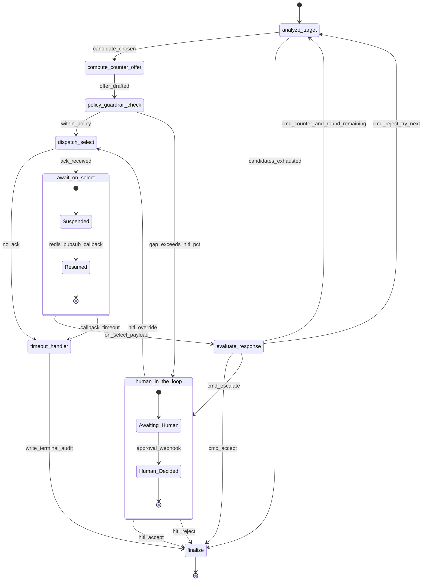

# 01 — LangGraph State Machine

> [!architecture] Context
> This note details the topology and runtime semantics of the [[negotiation_engine]] state machine. It is one of four siblings under [[_negotiation_engine_index]]; for the *decision policy* invoked from `compute_counter_offer`, see [[02_decision_intelligence_rl]]; for the *hard policy floor* enforced at `policy_guardrail_check`, see [[03_hard_guardrails_policy]]; for operational survivability (checkpoint storage, Kafka audit emission, Redis Streams replay), see [[04_resilience_and_mlops]]. All framework primitives below — `StateGraph`, `interrupt()`, `Command`, `AsyncPostgresSaver`, `recursion_limit` — refer to [[agent_framework_langchain_langgraph|LangGraph 1.x]] semantics as documented in the May 2026 release line.

## State schema (`NegotiationState`)

The state is a `TypedDict` with **explicit reducers** on every field. The convention is deliberate: LangGraph's default "last-write-wins" is too implicit for an audit-grade workflow, so every accumulator uses `operator.add` and every scalar pointer uses a custom `last_value` reducer that asserts type compatibility before overwrite.

```python
# DESIGN SCHEMA — not runtime code. See `[[04_resilience_and_mlops]]`
# for the actual module layout.
from typing import TypedDict, Annotated, Literal, Optional
from operator import add
from langgraph.graph.message import add_messages

def last_value(_: object, new: object) -> object:
    """Scalar reducer: explicit overwrite, self-documenting in checkpoint diffs."""
    return new

class NegotiationState(TypedDict):
    # --- identity ---
    transaction_id:           Annotated[str,                last_value]
    category:                 Annotated[str,                last_value]
    policy:                   Annotated[dict,               last_value]

    # --- round control ---
    negotiation_round:        Annotated[int,                last_value]
    max_rounds:               Annotated[int,                last_value]

    # --- candidates & active pointers ---
    ranked_candidates:        Annotated[list[dict],         last_value]
    current_target:           Annotated[Optional[dict],     last_value]
    current_strategy:         Annotated[Optional[dict],     last_value]
    current_counter_offer:    Annotated[Optional[dict],     last_value]

    # --- async machine interrupt bookkeeping ---
    awaiting_on_select:       Annotated[bool,               last_value]
    on_select_correlation_id: Annotated[Optional[str],      last_value]
    redis_channel:            Annotated[Optional[str],      last_value]
    last_on_select_payload:   Annotated[Optional[dict],     last_value]

    # --- HITL ---
    escalation_reason:        Annotated[Optional[str],      last_value]
    hitl_decision:            Annotated[Optional[dict],     last_value]

    # --- accumulators (operator.add) ---
    round_history:            Annotated[list[dict],         add]
    audit_events:             Annotated[list[dict],         add]
    messages:                 Annotated[list,               add_messages]

    # --- terminal ---
    final_outcome:            Annotated[Optional[Literal["accept","abandon","timeout","human_override"]], last_value]
    final_contract_draft:     Annotated[Optional[dict],     last_value]
```

**Reducer rationale**

- `operator.add` on `round_history`, `audit_events`: each round is *append-only*. Two concurrent node executions in a fan-out would never produce conflicting writes; semantics are commutative.
- `add_messages` on `messages`: standard [[agent_framework_langchain_langgraph|LangGraph]] reducer that deduplicates by message ID, preserving LLM trace replay.
- `last_value` everywhere else: scalar pointer fields where overwrite is the *intended* semantics; making it explicit (rather than relying on the framework default) means a future reviewer reading a checkpoint diff sees the reducer name in the schema and is never surprised.
- `transaction_id` participates as a state field *and* as the LangGraph `thread_id` — see "Memory & checkpointing" below.

## Node catalogue

| Node | Purpose | Reads (state slice) | Writes (state slice) | Linked sibling |
|---|---|---|---|---|
| `analyze_target` | Pop top-ranked candidate; select strategy archetype from category + buyer policy | `ranked_candidates`, `category`, `policy`, `round_history` | `current_target`, `current_strategy`, `audit_events+=[...]` | [[02_decision_intelligence_rl]] |
| `compute_counter_offer` | Delegate to strategy module — rule-based (Phase 1) or Contextual Bandit (Phase 2) | `current_target`, `current_strategy`, `round_history`, `last_on_select_payload` | `current_counter_offer` | [[02_decision_intelligence_rl]] |
| `policy_guardrail_check` | **HARD clamp**: enforce 20% discount cap and any per-category rule; clamp offer or short-circuit to HITL | `current_counter_offer`, `current_target`, `policy` | `current_counter_offer` (clamped), `escalation_reason?` | [[03_hard_guardrails_policy]] |
| `dispatch_select` | POST `/select` via [[beckn_bap_client]]; SUBSCRIBE to `beckn_results:{transaction_id}` | `current_target`, `current_counter_offer`, `transaction_id` | `awaiting_on_select=True`, `on_select_correlation_id`, `redis_channel`, `audit_events+=[...]` | [[04_resilience_and_mlops]] |
| `await_on_select` | **Machine interrupt** — `interrupt()` until Redis Pub/Sub delivers the `/on_select` payload (dual-written to Streams for replay durability) | `awaiting_on_select`, `redis_channel`, `on_select_correlation_id` | `last_on_select_payload`, `awaiting_on_select=False` | [[04_resilience_and_mlops]] |
| `evaluate_response` | Classify response → accept / counter / escalate / abandon; emit `Command(goto=..., update={...})` atomically | `last_on_select_payload`, `current_target`, `round_history`, `negotiation_round`, `max_rounds` | `negotiation_round+=1`, `round_history+=[...]`, conditional routing | [[02_decision_intelligence_rl]] |
| `human_in_the_loop` | **Human interrupt** — `interrupt()` until [[approval_workflow]] delivers a `HitlDecision` via `Command(resume=...)` | `escalation_reason`, `current_target`, `current_counter_offer` | `hitl_decision` | [[approval_workflow]] |
| `timeout_handler` | Deadletter path: per-round or total timeout breached; emit terminal audit event | (all) | `final_outcome="timeout"`, `audit_events+=[...]` | [[04_resilience_and_mlops]] |
| `finalize` | Persist terminal outcome → [[event_streaming_kafka\|Kafka]] audit topic + [[vector_db_qdrant_pinecone\|Qdrant]] `NegotiationMemory` write | (all) | `final_outcome`, `final_contract_draft`, `audit_events+=[...]` | [[04_resilience_and_mlops]], [[agent_memory_learning]] |

## Edge table

All 18 transitions, in dispatch order:

| # | from_node | to_node | condition |
|---|---|---|---|
| 1 | `START` | `analyze_target` | unconditional entry |
| 2 | `analyze_target` | `compute_counter_offer` | `current_target is not None` |
| 3 | `analyze_target` | `finalize` | `ranked_candidates exhausted` (no more fallbacks) |
| 4 | `compute_counter_offer` | `policy_guardrail_check` | unconditional |
| 5 | `policy_guardrail_check` | `dispatch_select` | offer within policy (post-clamp) |
| 6 | `policy_guardrail_check` | `human_in_the_loop` | clamp would breach `hitl_gap_pct` or hit hard cap |
| 7 | `dispatch_select` | `await_on_select` | `/select` POST returned ACK |
| 8 | `dispatch_select` | `timeout_handler` | BAP client error / no ACK in `per_round_timeout_s` |
| 9 | `await_on_select` | `evaluate_response` | `/on_select` payload received |
| 10 | `await_on_select` | `timeout_handler` | no callback within `per_round_timeout_s` |
| 11 | `evaluate_response` | `finalize` | `Command(goto="finalize")` — supplier accepted |
| 12 | `evaluate_response` | `analyze_target` | `Command(goto="analyze_target")` — counter received, `round+1 < max_rounds` |
| 13 | `evaluate_response` | `human_in_the_loop` | `Command(goto="human_in_the_loop")` — gap > `hitl_gap_pct` or `round+1 >= max_rounds` |
| 14 | `evaluate_response` | `analyze_target` | `Command(goto="analyze_target")` — supplier rejected, try next candidate |
| 15 | `human_in_the_loop` | `dispatch_select` | `hitl_decision.action == "override"` (proceed with human-set offer) |
| 16 | `human_in_the_loop` | `finalize` | `hitl_decision.action == "accept"` (accept current standing offer) |
| 17 | `human_in_the_loop` | `finalize` | `hitl_decision.action == "reject"` (abandon) |
| 18 | `timeout_handler` | `finalize` | unconditional — write terminal audit then END |
| — | `finalize` | `END` | terminal |

## Async interrupt mechanics

The engine has **two structurally distinct interrupt sites**, intentionally not unified:

**Machine interrupt — `await_on_select`.** Beckn `/on_select` is asynchronous (ADR-0001). After `dispatch_select` returns the ACK, the engine *cannot* progress until the BPP's catalog/quote arrives on `beckn_results:{transaction_id}`. The node calls `interrupt()` which raises `GraphInterrupt`; the executor catches it, serialises the full state snapshot to the checkpointer, and the coroutine returns. A separate listener coroutine on the same pod (or any pod in the deployment, since state is in Postgres) consumes the Pub/Sub message, then resumes the graph with `await graph.ainvoke(Command(resume=on_select_payload), config={"configurable": {"thread_id": transaction_id}})`. The resume value becomes the return value of `interrupt()` inside `await_on_select`, which then writes `last_on_select_payload` and falls through. Per ADR-0001 and [[04_resilience_and_mlops]], the Pub/Sub message is **dual-written to a Redis Stream** so that if the engine pod was evicted between checkpoint write and the next listener tick, a replay from the stream's last-acked offset restores the payload — Pub/Sub itself has fire-and-forget semantics and is not sufficient for durability.

**Human interrupt — `human_in_the_loop`.** When the policy guardrail clamp would push the offer beyond `hitl_gap_pct`, or when `round+1 >= max_rounds` with no acceptance, the graph escalates via [[approval_workflow]]. The same `interrupt()` primitive is used but the resume payload is a structured `HitlDecision {action: "accept"|"reject"|"override", reasoning, override_offer?}` delivered via the approval webhook. Resume shape is identical (`Command(resume=hitl_decision)`), but timeouts diverge by **three orders of magnitude** — machine interrupts time out in 180s; human interrupts may take 24h+. Unifying these into a single "blocked" state would either (a) inflate machine-side SLOs to human-side ceilings, masking BPP unresponsiveness, or (b) collapse human-side patience to machine-side ceilings, abandoning valid escalations. Keeping them separate also lets the deadletter routing differ: machine timeouts go to `timeout_handler`; human timeouts (when a ceiling is eventually imposed — see open question 4 in [[_negotiation_engine_index]]) are a distinct terminal class.

## Cyclical reasoning & bounded loops

The strategic cycle is `evaluate_response → analyze_target → compute_counter_offer → policy_guardrail_check → dispatch_select → await_on_select → evaluate_response`. This is the **bounded reasoning loop** that makes multi-round negotiation possible. Without a bound, an adversarial or buggy BPP could keep the engine spinning indefinitely.

The engine bounds the loop **twice**:

1. **Semantic bound (preferred).** Inside `evaluate_response`, before issuing `Command(goto="analyze_target")`, the node checks `negotiation_round + 1 >= max_rounds`; if true, it routes to `human_in_the_loop` instead. This is the *intended* terminator — every loop exit through this branch is logged with structured reasoning and contributes to the [[business_impact_metrics|escalation-rate KPI]].
2. **Defensive bound (safety net).** The LangGraph runtime is invoked with `config={"recursion_limit": max_rounds * 6, ...}`. The factor 6 corresponds to the number of nodes traversed per round (`analyze_target` → `compute_counter_offer` → `policy_guardrail_check` → `dispatch_select` → `await_on_select` → `evaluate_response`). If the semantic bound ever fails to fire — a regression in `evaluate_response`, a malformed state checkpoint, etc. — LangGraph raises `GraphRecursionError` rather than burning compute forever. This is treated as a **safety ceiling**, not a normal control flow; emission of `GraphRecursionError` triggers a P1 alert in the [[observability_stack]].

The default LangGraph recursion limit is 25; explicitly setting it to `max_rounds * 6` (= 18 at `max_rounds=3`) is both tighter than the default *and* self-documenting: anyone reading the config sees the relationship between business semantics (rounds) and graph mechanics (steps).

## Memory & checkpointing

The recommended checkpointer is **`AsyncPostgresSaver`** from `langgraph.checkpoint.postgres.aio`.

**Why Postgres over Redis-backed checkpointers.** The Redis option (`AsyncRedisSaver` from the `langgraph-redis` package) offers sub-millisecond latency and is appropriate for ephemeral chatbots; for this engine, the priorities are different. (a) Redis is already saturated as the transport layer for Beckn callbacks per ADR-0001; co-locating durable state on the same datastore creates a single point of failure. (b) Postgres allows FK-style audit relationships between the `negotiation_checkpoints` table and existing `procurement.*` schema, letting analysts join checkpoint history to PO records without ETL. (c) Postgres's MVCC + WAL gives stronger durability guarantees for state that must survive cluster-wide Redis evictions. (d) Sqlite-based savers are single-writer and disqualified for any horizontal-scale deployment.

**`thread_id == transaction_id`.** LangGraph's `thread_id` is the checkpoint partition key. Binding it to the Beckn `transaction_id` eliminates an entire class of correlation bugs (Beckn channel name, Redis Pub/Sub subscription, Postgres checkpoint key all share one identifier). It also **transitively forbids checkpoint collisions** via the existing `CLAUDE.md` prohibition on transaction_id reuse: any duplicate `thread_id` would imply a duplicate `transaction_id`, which is already a P0 invariant violation upstream.

**Schema migration.** Per the `database/sql/` numbered-migration convention (see `CLAUDE.md`), the checkpoint tables ship as the next free prefix — `19_langgraph_checkpoints.sql`. The migration is idempotent (`CREATE TABLE IF NOT EXISTS`), respects FK dependency order, and does not renumber any existing file. Tables created: `checkpoints`, `checkpoint_writes`, `checkpoint_blobs` (per `AsyncPostgresSaver.setup()` contract).

## Timeout policy

| Parameter | Value | Where enforced | Rationale |
|---|---|---|---|
| `per_round_timeout_s` | `180` | `await_on_select` interrupt + `dispatch_select` BAP client call | Empirical p99 of `/on_select` round-trip across observed BPPs; doubled gives safety margin without inflating SLO |
| `total_timeout_s` | `900` | Wall-clock check at every node entry | 3 rounds × 180s + overhead; if exceeded → `timeout_handler` |
| `max_rounds` | `3` | Semantic bound in `evaluate_response` | Past 3 rounds, marginal gain drops below escalation cost (see [[business_impact_metrics]]) |
| `hitl_gap_pct` | `0.15` | `evaluate_response` and `policy_guardrail_check` | If supplier counter and our target differ by >15%, human judgement adds more value than another machine round |
| `max_discount_pct` | `0.20` | `policy_guardrail_check` (HARD) | Per [[03_hard_guardrails_policy]]; the floor that survives any [[llm_providers\|LLM]] hallucination |
| `recursion_limit` | `max_rounds * 6 = 18` | LangGraph runtime config | Defensive ceiling — see "Cyclical reasoning" |

## State diagram



> [!guardrail] Hard policy enforcement
> The 20% maximum-discount cap is enforced **inside the `policy_guardrail_check` node** (see [[03_hard_guardrails_policy]]) — it is not a decorator, not a prompt instruction, and not a downstream filter. The clamp is a deterministic Python computation over the candidate price; it survives any [[llm_providers|LLM]] hallucination in `compute_counter_offer`, and an audit replay walking the checkpoint graph can prove the cap was applied on every single round. Any redesign that moves this enforcement into LLM-mediated logic is a violation of the design contract.

> [!insight] Supervisor pattern via `Command(goto=...)`
> The `evaluate_response` node returns `Command(goto=..., update={...})` rather than relying on a downstream conditional edge. The choice is deliberate: the routing decision depends on *newly-computed state* (whether the parsed `/on_select` is an accept, counter, or reject), and `Command` lets the node atomically update state *and* select the next node in a single executor cycle. A conditional edge that reads the same state after-the-fact would require a no-op intermediate node and double the checkpoint volume. This is the "supervisor pattern" idiom recommended in current [[agent_framework_langchain_langgraph|LangGraph 1.x]] documentation for state-dependent routing.

## Key design decisions

- **Guardrail as node, not decorator** — for audit replay visibility; every clamp event appears as a state mutation in the checkpoint history, not as a hidden side effect of a wrapping function.
- **Two distinct interrupt semantics** — machine and human are not unified, because timeouts diverge by three orders of magnitude and recovery actions differ.
- **`AsyncPostgresSaver` over Redis-backed checkpointer** — full async stack; horizontal scaling; Postgres FK relationships into procurement schema; avoids co-locating durable state and transport on the same Redis.
- **Bounded loops enforced twice** — semantic (`round + 1 >= max_rounds`) and defensive (`recursion_limit = max_rounds * 6`); the second is a safety ceiling, not normal control flow.
- **`thread_id == transaction_id`** — eliminates correlation bugs across Beckn / Redis / Postgres; transitively inherits the `CLAUDE.md` no-reuse invariant.
- **`Command(goto=...)` from `evaluate_response`** — atomic state-and-routing update preferred over post-hoc conditional edges; halves checkpoint volume.

## References

- [Interrupts — Docs by LangChain](https://docs.langchain.com/oss/python/langgraph/interrupts) — canonical reference for `interrupt()` semantics and `Command(resume=...)` shape.
- [Persistence — Docs by LangChain (JS, mirrors Python)](https://docs.langchain.com/oss/javascript/langgraph/persistence) — checkpoint primitives, `thread_id` contract, `AsyncPostgresSaver` setup.
- [GRAPH_RECURSION_LIMIT — Docs by LangChain](https://docs.langchain.com/oss/python/langgraph/errors/GRAPH_RECURSION_LIMIT) — defensive bound semantics; `remaining_steps` counter idiom.
- [LangGraph & Redis: Build smarter AI agents with memory & persistence](https://redis.io/blog/langgraph-redis-build-smarter-ai-agents-with-memory-persistence/) — counterpoint reference on `AsyncRedisSaver`; useful to understand exactly what we are *not* choosing and why.
- [How to Implement Human-in-the-Loop in LangGraph Using the interrupt() Pattern (BSWEN, Apr 2026)](https://docs.bswen.com/blog/2026-04-16-langgraph-human-in-the-loop/) — current month idioms for approval-style HITL.
- [Human-in-the-Loop with LangGraph: Mastering Interrupts and Commands](https://medium.com/the-advanced-school-of-ai/human-in-the-loop-with-langgraph-mastering-interrupts-and-commands-9e1cf2183ae3) — decision-type taxonomy (approve / edit / reject / respond) underpinning the `HitlDecision` shape used in this design.
- ADR-0001 — `docs/architecture/decisions/0001-use-redis-pubsub-for-async-beckn-responses.md` (async callback rationale, dual-write durability story).
- `CLAUDE.md` — repository conventions cited throughout: async-first, no-direct-BPP, no `time.sleep`, `transaction_id` uniqueness, numbered SQL migrations.
