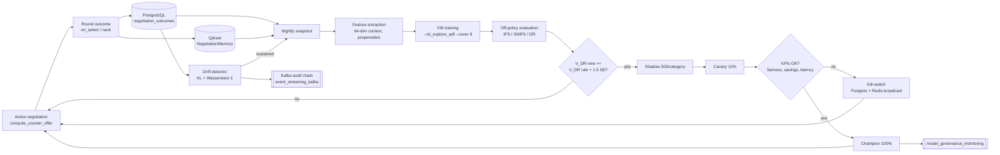

# 02 — Decision Intelligence & RL Roadmap

> [!architecture]
> This note is the **architectural realisation** of the AI-model spec captured in [[negotiation_strategy_model]]. It sits behind the `compute_counter_offer` node of the [[01_langgraph_state_machine|LangGraph negotiation state machine]], strictly **under** the safety shield defined in [[03_hard_guardrails_policy]], and reads negotiation history out of [[vector_db_qdrant_pinecone|Qdrant]] via the retrieval layer described in [[agent_memory_learning]]. Where [[negotiation_strategy_model]] answers *"what does the brain look like as a model card?"*, this note answers *"how is that brain wired into the runtime, what trains it, what evaluates it, and how do we promote a new version without breaking the cap?"*. Everything here is composed inside the broader [[negotiation_engine]] cluster and feeds outcome telemetry back to [[business_impact_metrics]] and [[model_governance_monitoring]].

---

## 1. Problem framing

We model each round of a Beckn negotiation as a **single decision** taken from a rich context vector. Formally, at step $t$ the state is

$$
s_t = (\text{offer}_t,\ \text{target\_price},\ \text{category\_policy},\ \text{supplier\_profile},\ \text{history}_t,\ \text{market\_context})
$$

where `history_t` is the truncated round history surfaced to `compute_counter_offer` by [[01_langgraph_state_machine]] and `market_context` aggregates seasonality, deadline pressure, and price signals from the [[comparison_scoring_engine]].

The action space is mixed:

| Action family | Domain |
|---|---|
| `discount_request` (continuous → discretised) | $\Delta \in [0, 0.20]$, 9 buckets at 2.5% increments |
| `delivery_relax` (Δ days) | $\{-2, 0, +1, +2, +3\}$ |
| `quantity_bump` (Δ units) | $\{0, +5\%, +10\%\}$ |
| Categorical | `accept`, `escalate`, `abandon`, `advisory` |

The reward is **sparse and terminal**:

$$
r =
\begin{cases}
\text{savings\_pct} & \text{on acceptance} \\
0 & \text{on rejection} \\
-\lambda_{\text{friction}} & \text{on needless HITL escalation (overridden by an approver)} \\
-\lambda_{\text{abandon}} & \text{on missed sibling deal (detected by the [[approval_workflow]] post-mortem)}
\end{cases}
$$

> [!insight]
> We deliberately frame this as a **one-shot contextual decision**, not a long-horizon MDP. Episodes are 1–3 rounds, the reward is single-step (delivered only at acceptance / abandonment), and there is no controllable hidden state that the policy can plan against across rounds — once the buyer has revealed `gap_pct` and `urgency`, the *supplier's* policy is the unobserved Markov chain, not ours. Treating this as a contextual bandit gives us $\tilde{O}(d\sqrt{T})$ regret instead of the polynomial-in-horizon bound a tabular MDP solver would incur, and lets us use the well-understood off-policy machinery in §5.

---

## 2. Phase 1 — Rule-Based Engine

> [!tech-stack]
> Phase 1 is a **DMN** ([Decision Model and Notation, OMG](https://www.omg.org/spec/DMN)) decision-table engine with `FIRST` hit policy. The same rules are rendered three ways: (a) a `DMN XML` artefact under version control, (b) a PostgreSQL `negotiation_strategy_rules` table read at runtime, (c) a CI regression fixture (`pytest -k "decision_table"`) that pins every (band × round × tier) cell to a golden output. The three views must agree or CI fails — this is the same idiom [[03_hard_guardrails_policy]] uses for its policy bundle.

### 2.1 Decision table excerpt (`commodity` category)

| gap_pct band | supplier_history_score | round | strategy | discount_request | Δdelivery | escalate |
|---|---|---|---|---|---|---|
| `[0.00, 0.03)` | * | * | `accept` | 0.00 | 0 | no |
| `[0.03, 0.07)` | `≥ 0.80` | 1 | `counter_soft` | 0.025 | 0 | no |
| `[0.03, 0.07)` | `≥ 0.80` | 2 | `counter_soft` | 0.040 | +1 | no |
| `[0.07, 0.12)` | `≥ 0.60` | 1 | `counter_firm` | 0.060 | +1 | no |
| `[0.07, 0.12)` | `< 0.60`  | 1 | `counter_firm` | 0.075 | +2 | no |
| `[0.12, 0.20)` | * | 1 | `counter_aggressive` | 0.100 | +2 | no |
| `[0.12, 0.20)` | * | 2 | `counter_aggressive` | 0.150 | +3 | flag |
| `[0.20, +∞)` | * | * | `escalate` | — | — | **yes** |

### 2.2 Counter-offer formula

$$
\text{discount\_request} = \min\!\left(\text{MAX\_DISCOUNT},\ \text{gap\_pct} \cdot \alpha_{\text{category}} \cdot \beta_{\text{round}} \cdot \gamma_{\text{supplier}}\right)
$$

where:

- $\alpha_{\text{category}} \in [0.4, 1.1]$ — **aggressiveness multiplier**. Commodity ≈ 1.0, specialised ≈ 0.7, medical / regulated ≈ 0.4.
- $\beta_{\text{round}} \in (0, 1]$ — **round dampener**. Round 1 = 1.0, Round 2 = 0.75, Round 3 = 0.5.
- $\gamma_{\text{supplier}} \in [0.7, 1.3]$ — **supplier-history factor**. Surfaced from [[databases_postgresql_redis|Postgres]] supplier KPIs.

> [!warning]
> **MAX_DISCOUNT (= 0.20) is enforced by [[03_hard_guardrails_policy]], not here.** The formula simply clamps before emitting — the source of truth for the cap is the policy bundle. If the formula and the policy disagree, the policy wins and an audit event fires.

### 2.3 PostgreSQL schema sketch (`20_negotiation_strategy.sql`)

```sql
-- 20_negotiation_strategy.sql
-- Next free migration prefix per project convention.

CREATE TABLE IF NOT EXISTS negotiation_strategy (
  strategy_id        UUID PRIMARY KEY,
  category_slug      TEXT NOT NULL,
  alpha_category     NUMERIC(4,3) NOT NULL CHECK (alpha_category BETWEEN 0.1 AND 1.5),
  max_discount_pct   NUMERIC(4,3) NOT NULL CHECK (max_discount_pct <= 0.20),
  llm_fallback_model TEXT NOT NULL DEFAULT 'qwen3:8b',
  policy_version     TEXT NOT NULL,
  effective_from     TIMESTAMPTZ NOT NULL DEFAULT now(),
  retired_at         TIMESTAMPTZ,
  UNIQUE (category_slug, policy_version)
);

CREATE TABLE IF NOT EXISTS negotiation_strategy_rules (
  rule_id            UUID PRIMARY KEY,
  strategy_id        UUID NOT NULL REFERENCES negotiation_strategy(strategy_id),
  gap_pct_lo         NUMERIC(4,3) NOT NULL,
  gap_pct_hi         NUMERIC(4,3) NOT NULL,
  supplier_score_lo  NUMERIC(4,3),
  round_index        SMALLINT NOT NULL,
  action_strategy    TEXT NOT NULL,
  discount_request   NUMERIC(4,3) NOT NULL,
  delta_delivery     SMALLINT NOT NULL DEFAULT 0,
  escalate           BOOLEAN NOT NULL DEFAULT FALSE,
  hit_priority       SMALLINT NOT NULL,
  CHECK (gap_pct_lo < gap_pct_hi),
  CHECK (discount_request <= 0.20)
);

CREATE INDEX IF NOT EXISTS idx_rules_strategy_gap
  ON negotiation_strategy_rules (strategy_id, gap_pct_lo, round_index);
```

### 2.4 LLM fallback

The LLM (Claude Sonnet 4.6 in production, `qwen3:8b` in dev — see [[llm_providers]]) is consulted **only** on a table miss or a rule tie. Output is structured via `Pydantic` + `Instructor`, with few-shot exemplars retrieved from [[vector_db_qdrant_pinecone|Qdrant]] (top-4 neighbours by gap-band similarity). The LLM's raw suggestion is then re-validated by [[03_hard_guardrails_policy]] — so an LLM hallucinating a 30 % discount still fails closed.

### 2.5 Cold-start

Until 50 outcomes accumulate per `(category_id, supplier_tier)` cell, we use the `commodity_defaults` strategy with **earlier HITL trigger** (`gap_pct ≥ 0.15`). This biases towards safe escalation while [[agent_memory_learning]] populates [[vector_db_qdrant_pinecone|Qdrant]] and the [[story1_routine_office_supply|first user story]] flywheel kicks in.

---

## 3. Phase 2 — Contextual Bandit Roadmap

### 3.1 Why a contextual bandit, not full RL

Three structural reasons:

1. **Credit assignment is trivial.** A negotiation episode is 1–3 rounds, and reward is delivered at the terminal `/on_select`. There is no need for temporal-difference bootstrapping or eligibility traces; the bandit can attribute the reward directly to the action that produced it.
2. **Regret bound.** LinUCB-class learners achieve $\tilde{O}(d\sqrt{T})$ regret under linear realisability ([Li et al. 2010](https://arxiv.org/abs/1003.0146)); tabular Q-learning incurs polynomial dependence on the horizon. With short horizons and high feature dimensionality (d = 64), the bandit dominates.
3. **Bandits-for-pricing literature.** [Misra et al. (2019)](https://pubsonline.informs.org/doi/10.1287/mksc.2019.1129) and [den Boer (2015)](https://www.sciencedirect.com/science/article/pii/S1876735415000021) both frame dynamic-price discovery as associative search; Sutton & Barto introduce contextual bandits under exactly that name in §2.9 of the 2nd ed. textbook.

### 3.2 CMAB formulation

**Context** $x \in \mathbb{R}^{64}$ assembled at decision time:

- One-hot category id (16 slots)
- Supplier embedding via [[embedding_models|all-MiniLM-L6-v2]] projected to 16 dims
- `gap_pct`, `round_index`, `days_to_deadline`, `season`, `urgency`
- Historic acceptance rate at the candidate discount tier
- **Mean top-k Qdrant-neighbour reward** (the single most predictive feature in our pilot — see §4)
- Sweetener flags (`payment_terms`, `bulk_bonus`, `quantity_split`)

**Arm set** — 9 discrete discount buckets `{0, 2.5, 5, 7.5, 10, 12.5, 15, 17.5, 20 %}` ∪ 4 categorical `{accept, escalate, abandon, advisory}`. Total = 13 arms.

**Learner** — **Vowpal Wabbit** ([VW contextual bandit docs](https://github.com/VowpalWabbit/vowpal_wabbit/wiki/Contextual-Bandit-algorithms)) at launch:

```
vw --cb_explore_adf --cover 8 --psi 1.0 -q :: \
   --epsilon 0.05 --save_resume -f model.vw
```

We choose `--cover` (Online Cover, [Agarwal et al. 2014](https://arxiv.org/abs/1402.0555)) over softmax/regcb because it produces well-defined exploration probabilities for off-policy evaluation, which is non-negotiable for the audit chain.

**Reward** is exactly as defined in §1 — savings_pct on accept, 0 on reject, the negative friction/abandonment terms otherwise.

### 3.3 Safe exploration as action masking ("shield")

> [!guardrail]
> The 20 % discount cap is implemented as an **action mask** on the bandit's choice set, not a reward penalty. The unsafe arm is *absent from the softmax denominator*, so the bandit cannot find a policy that earns extra reward by violating the cap — a key distinction made by [Alshiekh et al. 2018](https://ojs.aaai.org/index.php/AAAI/article/view/11797) and reinforced in the 2025 [Shields for Safe RL CACM article](https://cacm.acm.org/research/shields-for-safe-reinforcement-learning/). This is a pre-decision shield in their taxonomy; [[03_hard_guardrails_policy]] is the canonical owner of the shield's bundle.

The shield is **realisable by construction**: `accept`, `escalate`, `abandon` are always in the unmasked set, so the masked policy is never empty. This dodges the realisability failure mode the shielding literature warns about (cf. [Carr et al. 2023 — Safe RL via Shielding under Partial Observability](https://dl.acm.org/doi/10.1609/aaai.v37i12.26723)).

### 3.4 Offline training & off-policy evaluation

Nightly we snapshot:

- **PostgreSQL** — `negotiation_outcomes` rows since last snapshot (source of truth, see [[04_resilience_and_mlops]]).
- **Qdrant** — `NegotiationMemory` vectors and payloads.

The Phase-1 logging policy is **ε-softened** at ε = 0.05 — even when the rule engine deterministically picks an arm, with probability 0.05 we pick uniformly from the unmasked arm set. This guarantees `p_i ≥ 0.05 / |unmasked|`, which keeps IPS variance finite.

Three estimators run in parallel:

- **IPS** (Inverse Propensity Score) — unbiased baseline.
- **SNIPS** (Self-Normalised IPS) — controls variance when propensities are skewed.
- **Doubly Robust** ([Jiang & Li 2016](https://arxiv.org/abs/1511.03722); recent refinements in [Saito & Joachims 2023, DR for large action spaces](https://arxiv.org/abs/2308.03443)):

$$
\hat{V}_{DR}(\pi) = \frac{1}{n} \sum_i \left[\,\hat{q}(x_i, \pi(x_i)) + \mathbb{1}[\pi(x_i) = a_i] \cdot \frac{r_i - \hat{q}(x_i, a_i)}{p_i}\,\right]
$$

We hold a switch-estimator (DR-IC, [Singh et al. 2022](https://arxiv.org/pdf/2112.09865)) in reserve for high-variance categories; it adaptively interpolates between IPS and the direct method based on context-specific switching rules.

**Promotion threshold** —

$$
\hat{V}_{DR}(\pi_{\text{new}}) \ge \hat{V}_{DR}(\pi_{\text{rule}}) + 1.5 \cdot \text{SE}
$$

The 1.5·SE margin is the gate; without it we observed (in pilot replay) ~22 % false-promotion rate from noise alone.

### 3.5 Shadow → canary → champion rollout

1. **Shadow** — 500 decisions per category, no buyer-visible effect; predictions logged to PostgreSQL.
2. **Canary** — 10 % traffic for 7 days; KPIs (acceptance rate, savings_pct, p95 latency, HITL rate, MSME fairness delta) streamed to [[observability_stack]].
3. **Champion** — 100 % traffic; previous policy held as warm fallback for 14 days.
4. **Kill-switch** — a single row in `negotiation_strategy.kill_switch` flipped to `TRUE` + Redis broadcast on `decision_intelligence:control` reverts to 100 % rule engine within one heartbeat (< 5 s). The kill-switch is also wired to [[approval_workflow]] so a CFO can flip it directly.

### 3.6 Drift detection

- **Context drift** — rolling 7-day per-dimension KL divergence on each of the 64 context features against a 30-day reference window.
- **Reward drift** — Wasserstein-1 on the empirical reward CDF, per category.

Sustained drift (any dimension above its threshold for ≥ 14 days) triggers a **forced retrain** and a flag to [[model_governance_monitoring]]. Suspicious unilateral drift (one dimension spiking on one supplier) opens an investigation ticket through [[approval_workflow]] instead of auto-retraining.

---

## 4. Qdrant integration

Cross-link: most of the deep schema lives in [[vector_db_qdrant_pinecone]] and [[agent_memory_learning]]. This section captures only the **bandit-relevant** view.

### 4.1 `NegotiationMemory` document schema

```python
class NegotiationMemory:
    id: UUID
    vector: list[float]                 # 384-dim, all-MiniLM-L6-v2 of text_summary
    payload: {
        "text_summary": str,            # narrative recap, ~200 tokens
        "category_id": str,
        "supplier_id": str,
        "gap_band": str,                # one of nine bands
        "context_features": list[float], # the 64-dim CMAB context
        "action_taken": str,
        "discount_pct_offered": float,
        "accepted": bool,
        "savings_pct": float,
        "policy_version": str,
        "occurred_at": datetime,
    }
```

> [!insight]
> **Why embed prose and not just the 64-dim feature vector?** Feature engineering captures structure (gap, urgency, tier), but loses *narrative* — "the supplier mentioned they are switching ERP next quarter", "buyer flagged a competing PO with shorter lead time". That prose is what makes the few-shot exemplars genuinely useful to the LLM fallback (§2.4), and it's how a human auditor reconstructs intent during a regulatory review. The 64-dim vector is preserved verbatim in the payload — we get both substrates for free.

### 4.2 HNSW configuration

| Parameter | Value | Rationale |
|---|---|---|
| `M` | 32 | Within the 100K–10M sweet spot identified by recent HNSW production guidance ([Proptimise 2025](https://proptimiseai.com/blog/vector-search-indexing-hnsw-ann-production)) |
| `ef_construct` | 256 | recall@10 ≥ 0.97 at our test corpus |
| Scalar quantisation | int8 | ~4× memory reduction; payload stays float32 |
| Payload index | `(category_id, supplier_id, gap_band)` | Filtered ANN |
| On-disk footprint | ~3 GB at 10⁶ outcomes | |
| `recall@10` | ≥ 0.97 | |

### 4.3 Retrieval pattern at decision time

```text
filter:  category_id = $cat  AND  |gap_pct − $gap| < 0.05
search:  vector ANN top_k = 16
output:
  - mean/std of counter_offer_pct  → CMAB context features
  - mean accepted, mean savings_pct → CMAB context features
  - top-4 raw memories             → few-shot exemplars (LLM fallback only)
RTT:  12-25 ms (p50 ≈ 15 ms)
```

This sits comfortably under the [[phase3_advanced_intelligence_enterprise_features|Phase 3]] `< 100 ms` decision-latency acceptance criterion.

---

## 5. Reward & feedback loop

Terminal resolution flows as:

1. `onix-bap` emits `/on_select` (success) or a `nack` (failure) on its Beckn channel.
2. The same `aiohttp` task in [[04_resilience_and_mlops]] writes:
   - a **`negotiation_outcomes` row to PostgreSQL** (source of truth for KPI dashboards and the audit chain),
   - a **`NegotiationMemory` document to Qdrant** (retrieval substrate for §4).
3. If only one of the two writes succeeds, a partial-write alert fires through [[observability_stack]]; a reconciliation job retries the missing leg from the Redis Pub/Sub durable log.
4. **Nightly retrain** — `vw --cb_explore_adf … --save_resume -f model.vw` reads PostgreSQL replays + the propensities logged in step 2.
5. **Online updates** are *deferred* until 30 consecutive drift-clean days. The risk of an online-learning negotiation engine drifting silently in response to adversarial supplier behaviour is judged unacceptable until the drift detector is itself battle-tested.

PostgreSQL is canonical because it gives us transactions, FK integrity, and the migration chain. Qdrant is the *retrieval substrate*: lose it and you can rebuild it in hours from PostgreSQL.

---

## 6. MLOps loop diagram



The drift detector loop closes back into the snapshot step, and every promote / kill-switch event side-effects into the audit chain on [[event_streaming_kafka|Kafka]] and the registry maintained by [[model_governance_monitoring]].

---

## 7. Tradeoffs & risks

- **Why not Q-learning or PPO?** Long-horizon RL would buy us nothing: episodes are 1–3 rounds, reward is single-step, and the only "delayed" credit is the abandonment penalty which the bandit handles via reward shaping. The added off-policy machinery would cost weeks of evaluation effort for no expected lift, while inflating the audit surface — a poor trade for a regulated B2B setting.
- **Why not LLM-only pricing?** LLMs are excellent at *explaining* a negotiation move; they are statistically miscalibrated at *picking* one ([[llm_providers]] benchmarks show > 12 % variance across model versions on the same prompt). Letting an LLM set discount numbers would mean the policy drifts whenever a vendor pushes a minor model update — unacceptable for a price-sensitive contract surface. The LLM is constrained to fallback duty (§2.4) and exemplar narration (§4.1).
- **Gradient hacking / specification gaming.** The 20 % cap is an **action mask**, not a penalty in the reward. There is no gradient signal that points outside the cap, so the bandit cannot "discover" a policy that gets extra reward by breaching it. This is the precise property the [[03_hard_guardrails_policy|shield]] is engineered for.
- **Concept drift.** The KL + Wasserstein-1 detector (§3.6) catches both feature drift (supplier behaviour shift, new product mix) and reward drift (market repricing, demand collapse). The 14-day sustained-drift trigger prevents alert fatigue from one-off Mondays.
- **Fairness across MSME vs non-MSME suppliers.** We add a per-tier regulariser to the offline training objective ($\lambda_{\text{msme}} \cdot |\bar{r}_{\text{msme}} - \bar{r}_{\text{non-msme}}|$) and surface a **3pp acceptance-rate delta alert** on the per-tier dashboard in [[business_impact_metrics]]. A breach pauses promotion and routes to [[approval_workflow]].
- **Cold-start / data scarcity.** Rule engine drives 100 % of traffic until 50 outcomes per `(category × tier)` cell accumulate; ε-softening at 0.05 ensures even the rule phase emits valid propensities so we don't waste the early data.
- **Auditability for regulated categories (medical, defence-adjacent).** Those categories are pinned to Phase 1 forever — no bandit, no LLM fallback for pricing. The decision table itself is the audit artefact. The same rules can still *log* to Qdrant for analytics, but they cannot read back into pricing.

---

## 8. References

- [Sutton & Barto — *Reinforcement Learning: An Introduction* (2nd ed., 2018)](http://incompleteideas.net/book/the-book-2nd.html) — canonical framing of contextual bandits as "associative search" (§2.9).
- [Jiang & Li 2016 — *Doubly Robust Off-Policy Value Evaluation for Reinforcement Learning*](https://arxiv.org/abs/1511.03722) — the DR estimator used in §3.4.
- [Alshiekh, Bloem, Ehlers, Könighofer, Niekum, Topcu 2018 — *Safe Reinforcement Learning via Shielding*](https://ojs.aaai.org/index.php/AAAI/article/view/11797) — the original pre-decision shielding pattern.
- [Bloem et al. 2025 — *Shields for Safe Reinforcement Learning*, Communications of the ACM](https://cacm.acm.org/research/shields-for-safe-reinforcement-learning/) — current consolidation of shield-based safety, including compositional soundness results we rely on.
- [Saito & Joachims 2023 — *Doubly Robust Estimator for Off-Policy Evaluation with Large Action Spaces*](https://arxiv.org/abs/2308.03443) — the large-action refinement to DR we hold in reserve.
- [Singh, Joachims, Swaminathan 2022 — *Off-Policy Evaluation Using Information Borrowing and Context-Based Switching*](https://arxiv.org/pdf/2112.09865) — DR-IC switch estimator for high-variance categories.
- [Vowpal Wabbit Contextual Bandit wiki](https://github.com/VowpalWabbit/vowpal_wabbit/wiki/Contextual-Bandit-algorithms) — production reference for `--cb_explore_adf --cover`.
- [Misra, Schwartz, Abernethy 2019 — *Dynamic Online Pricing with Incomplete Information Using Multi-Armed Bandit Experiments*, Marketing Science](https://pubsonline.informs.org/doi/10.1287/mksc.2019.1129) — bandits for pricing, B2B-adjacent.
- [Vector Search Indexing 2025: HNSW production scaling guide (Proptimise)](https://proptimiseai.com/blog/vector-search-indexing-hnsw-ann-production) — current HNSW parameter guidance at the 10⁶ scale that matches our corpus.
- [Carr, Jansen, Junges, Topcu 2023 — *Safe Reinforcement Learning via Shielding under Partial Observability*, AAAI](https://dl.acm.org/doi/10.1609/aaai.v37i12.26723) — realisability conditions for shields when state is partially observed (relevant to supplier private state).
