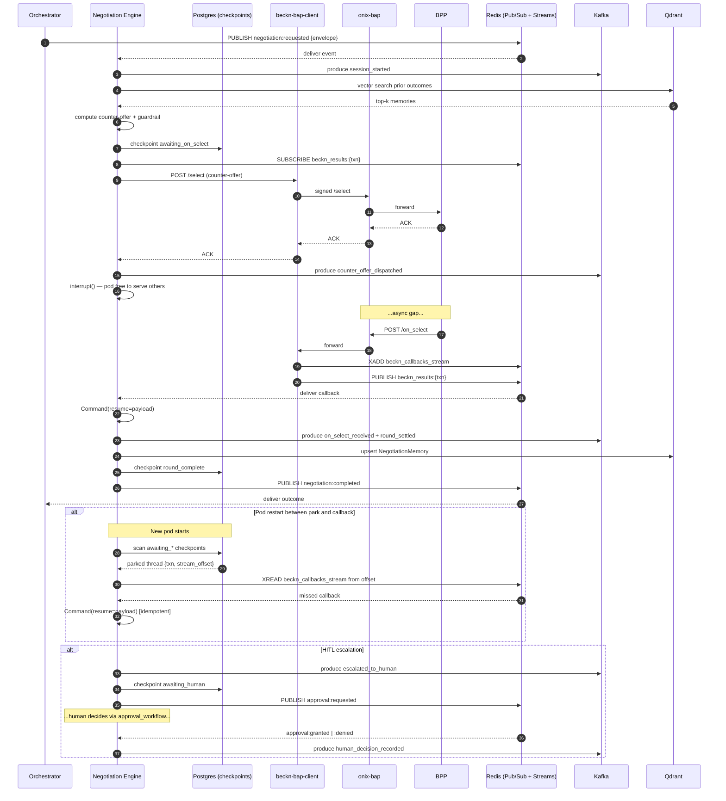
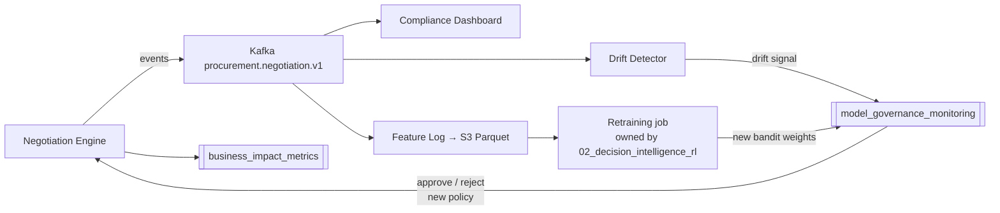

# 04 — Resilience & MLOps: The Operational Spine

> [!architecture]
> This is the **operational spine** of the [[negotiation_engine]]. While the sibling notes describe *what* the engine does — the state machine in [[01_langgraph_state_machine]], the strategy brain in [[02_decision_intelligence_rl]], the policy enforcement in [[03_hard_guardrails_policy]] — this note describes *how it survives in production*: service boundaries, async Beckn callback handling, durable Kafka audit trail, Kubernetes deployment topology, and observability. If the engine is a chess player, the other three notes are the openings, midgame, and endgame; this note is the table, the clock, the scoresheet, and the arbiter. See the cluster overview in [[_negotiation_engine_index]].

---

## 1. Bounded Context & Ownership

The negotiation engine is its own **bounded context** in the Domain-Driven Design sense. It owns the *"price and term agreement"* subdomain — a slice of the procurement lifecycle that sits between **Offer Discovery** (upstream) and **Order Fulfillment** (downstream).

**Upstream — Offer Discovery context:**
- [[nl_intent_parser]] — produces the `BecknIntent` envelope.
- [[beckn_bap_client]] — handles all wire-level Beckn traffic via `onix-bap`.
- [[catalog_normalizer]] — normalizes BPP catalogs into a canonical shape.
- [[comparison_scoring_engine]] — produces ranked offer lists, which arrive in the negotiation trigger payload.

**Downstream — Order Fulfillment context:**
- The `/init`, `/confirm`, and `/status` Beckn callbacks; the negotiation engine produces a **deal** (or escalation) that the orchestrator hands off.

**Ubiquitous language unique to this context** — *round, counter-offer, BATNA, walk-away, policy guardrail, escalation, deal* — none of these words appear in the upstream vocabulary. That linguistic boundary is a tell: the model genuinely belongs to a separate context, justifying separate persistence, separate deployment, separate ownership.

**Database ownership.** The engine owns a dedicated PostgreSQL schema `negotiation` containing:

- `negotiation_session` — one row per negotiation lifecycle.
- `negotiation_round` — one row per round per session.
- `negotiation_policy_decision` — audit of every guardrail decision (cross-link [[03_hard_guardrails_policy]]).
- `langgraph_checkpoints` — owned **exclusively** by this service. No other service reads or writes it.

**Vector memory.** The engine writes to a Qdrant collection `negotiation_outcomes` — schema documented in [[vector_db_qdrant_pinecone]] and consumed by the strategy logic in [[02_decision_intelligence_rl]].

> [!warning]
> **No cross-service SQL.** Ranked offers arrive in the trigger event payload (denormalized snapshot) — the engine never reads `comparative_scoring.*` tables directly. This is non-negotiable: it preserves the bounded-context seam and prevents the engine from breaking when [[comparison_scoring_engine]] evolves its schema.

See [[microservices_architecture]] for the cross-service ownership map.

---

## 2. Service Contract

### Input — event-triggered, idempotent

The negotiation engine is triggered by a **Redis Pub/Sub event** on channel `negotiation:requested`, not by an HTTP call. Every message wraps a canonical envelope:

```json
{
  "schema_version": "1.2.0",
  "event_type": "negotiation.requested",
  "correlation_id": "txn-...",
  "occurred_at": "2026-05-19T14:22:01Z",
  "idempotency_key": "txn-...:requested:v1",
  "trace_context": { "traceparent": "00-...", "tracestate": "..." },
  "payload": { "ranked_offers": [...], "intent": {...}, "policy_pack_id": "..." }
}
```

**Why event-trigger over HTTP?** Three reinforcing reasons:

1. **Avoid synchronous coupling.** ADR-0001 (`docs/architecture/decisions/0001-use-redis-pubsub-for-async-beckn-responses.md`) already broke synchronous deadlocks in discovery; reintroducing HTTP-trigger for negotiation would put the deadlock back.
2. **Pub/Sub is already the backbone.** The runtime already runs Redis 7 ([[databases_postgresql_redis]]); reusing the broker is operationally cheap.
3. **Why not Kafka-trigger?** Kafka is for the immutable audit log (§4). Triggering on Kafka would promote Kafka to a **hard runtime dependency** — and §6 establishes that Kafka must be allowed to fail open. The trigger path and audit path must be independent.

### Output — terminal Redis events

Three terminal channels: `negotiation:completed`, `negotiation:escalated`, `negotiation:failed`. All carry:

```json
{
  "transaction_id": "...",
  "outcome": "completed|escalated|failed",
  "final_supplier_id": "...",
  "final_price": 12450.00,
  "final_terms": { "delivery_days": 5, "payment_terms": "Net30" },
  "rounds_used": 3,
  "audit_chain_id": "kafka:procurement.negotiation.v1:partition=7:offset=10423",
  "savings_vs_first_offer_pct": 0.11
}
```

### Output — Kafka audit stream

Every state transition also produces an event on the durable Kafka audit topic, detailed in §4.

### No-go boundaries

Consolidating from [[_negotiation_engine_index]]:

- No direct BPP POST — Beckn traffic only via [[beckn_bap_client]] → `onix-bap`.
- No calls back into [[nl_intent_parser]] — intent is frozen at trigger time.
- No cross-schema SQL reads.
- No in-process state across rounds — every transition is checkpointed in PostgreSQL.

---

## 3. Async Integration — the Park-and-Resume Sequence

This is the crown jewel of the design and the load-bearing pattern of the entire engine. It descends directly from ADR-0001, which solved the same problem for *discovery*: Beckn `POST /select` returns an ACK only; the real catalog/quote arrives later via webhook.

### The 8-step dance

1. **Compute counter-offer** — strategy node in [[01_langgraph_state_machine]] consults [[02_decision_intelligence_rl]].
2. **Guardrail check** — [[03_hard_guardrails_policy]] vets the proposal; HIGH violation halts and escalates.
3. **Checkpoint** — write LangGraph state with status `awaiting_on_select` to `langgraph_checkpoints` **before** dispatch. Always.
4. **SUBSCRIBE** — listener subscribes to `beckn_results:{transaction_id}` on Redis Pub/Sub.
5. **POST /select** — via [[beckn_bap_client]] (which routes through `onix-bap`); returns ACK only.
6. **`interrupt()`** — LangGraph parks the thread; the pod can serve other negotiations.
7. **ONIX webhook arrives** — BAP client receives the asynchronous `/on_select` callback. It **dual-writes**: `PUBLISH beckn_results:{txn}` (live path, low-latency) and `XADD beckn_callbacks_stream` (durable path, MAXLEN-trimmed to 24h).
8. **Resume** — subscriber on any replica calls `Command(resume=payload)` and the LangGraph thread continues from the checkpoint.

### Restart-safe subscription recovery

> [!warning]
> Redis Pub/Sub does **not** buffer messages for absent subscribers — the achilles heel called out explicitly in ADR-0001. If the pod listening on `beckn_results:{txn}` dies between SUBSCRIBE and webhook, the message vaporizes.

Five mitigation layers in depth-of-defense order:

1. **Checkpoint first, dispatch second.** State on disk before any network call — a crashed pod always leaves an `awaiting_*` checkpoint behind.
2. **Recovery worker on pod startup.** Scans `langgraph_checkpoints WHERE status LIKE 'awaiting_%'` and re-subscribes for every parked thread.
3. **Dual-write to Redis Streams.** The BAP client `XADD`s every callback to `beckn_callbacks_stream` (durable, 24h `MAXLEN ~`). The recovery worker `XREAD`s from the offset stored in the checkpoint to replay any missed messages.
4. **Idempotency.** Every resume carries `idempotency_key = "{txn}:on_select:{stream_message_id}"`. The resume handler dedups against a `received_callbacks` Redis set (TTL 25h, slightly outliving the stream).
5. **APScheduler deadline poller.** Every checkpoint stores a `deadline` timestamp. A poller fires `negotiation.on_select_timeout` into the graph when the deadline elapses. *"The callback never arrived"* is a first-class graph state — not a hang.

### Envelope discipline

Redis Pub/Sub has no protocol header slot (unlike Kafka headers or HTTP headers). To make distributed tracing work across the broker, every message carries `trace_context: { traceparent, tracestate }` as a payload field — the canonical W3C-on-broker pattern recommended by the OpenTelemetry spec. The same envelope shape is used uniformly across all engine I/O (input trigger, output terminal events, stream records). See §7.

---

## 4. Kafka Audit Trail

Cross-link [[event_streaming_kafka]] and [[audit_trail_system]] for the platform-wide picture.

### Topic design

| Topic | Partitions | Retention | Purpose |
|---|---|---|---|
| `procurement.negotiation.v1` | 24 | 30d hot + Tiered → 7y | Primary stream, key=`transaction_id` |
| `procurement.negotiation.policy_violations.v1` | 1 | 7y WORM | Low-volume, high-importance; sourced from [[03_hard_guardrails_policy]] |
| `procurement.negotiation.dlq.v1` | 3 | 90d | Failed produce-retries from local outbox |

Partition key `transaction_id` guarantees per-session ordering and makes single-transaction audit replay (§10) a single-partition scan.

### Schema registry — Confluent + Protobuf

We adopt Confluent Schema Registry with **Protobuf** (not Avro). Justification:

- **Mixed Python/Go stack.** Protobuf has first-class codegen in both; Avro's Python tooling lags Go.
- **`oneof` semantics.** Round payloads have alternative shapes (counter-offer vs. accept vs. walk-away); Protobuf's `oneof` is idiomatic.
- **Compatibility default `BACKWARD`.** Matches our additive-only evolution policy — new fields, never breaking renames.

### Event catalogue (13 types)

| # | Event type | Producer node | Notes |
|---|---|---|---|
| 1 | `session_started` | trigger handler | Includes intent snapshot, ranked offers |
| 2 | `candidate_selected` | strategy | Which supplier we chose to negotiate with |
| 3 | `round_initiated` | round controller | Round number, prior context |
| 4 | `counter_offer_dispatched` | wire dispatcher | The actual `/select` payload hash |
| 5 | `guardrail_clamp` | policy node | Soft clamp applied, original vs. clamped |
| 6 | `on_select_received` | resume handler | Webhook payload, latency |
| 7 | `policy_violation_blocked` | policy node | HARD violation; also mirrored to `policy_violations.v1` |
| 8 | `round_settled` | round controller | Round outcome |
| 9 | `escalated_to_human` | escalation node | Routed to [[approval_workflow]] |
| 10 | `human_decision_recorded` | HITL callback | Approver, justification |
| 11 | `outcome_received` | terminal | Deal terms or walk-away |
| 12 | `timeout_fired` | deadline poller | Which deadline, fallback path |
| 13 | `checkpoint_written` | LangGraph saver hook | For drift analysis & replay |

### Retention & WORM

- **Hot tier (brokers): 30 days.** Sufficient for normal operations and short-term debugging.
- **Cold tier: Confluent Tiered Storage** (or Kafka Connect S3 sink) to MinIO with **Object Lock in compliance mode (WORM)**.
- **Total horizon: 7 years.** Aligns with SOX requirements and the longest contract-litigation tail expected in B2B procurement.
- **Replay model:** ksqlDB or `kafka-console-consumer --partition` keyed on `transaction_id`. Because partitioning is by `transaction_id`, replaying any single deal is a single-partition seek — cheap and ordered.

---

## 5. End-to-End Sequence Diagram



---

## 6. Resilience Matrix

| Failure | Detection | Mitigation | State on recovery |
|---|---|---|---|
| `onix-bap` unreachable | `aiocircuitbreaker` open after 5 consecutive 5xx/timeouts; per-method bulkhead | Circuit opens; existing parked threads keep waiting (deadline poller will eventually fire); new dispatches fail-fast and re-queue | Threads stay at `awaiting_on_select`; new traffic resumes when CB half-opens |
| `/on_select` never arrives | APScheduler deadline poller exceeds `deadline` in checkpoint | Fire `negotiation.on_select_timeout` event into graph; strategy decides retry, fallback supplier, or escalate | Thread transitions to `timeout_handled`; audit event `timeout_fired` |
| Redis Pub/Sub down | Subscriber reconnect storm; missed `PING` | Streams `XADD` continues serving as durable path; new dispatch back-pressures until Pub/Sub recovers | Recovery worker `XREAD`s missed messages on Pub/Sub return |
| Kafka unavailable | Producer ack timeout | **Fail-open** — append to local PostgreSQL outbox `negotiation.audit_outbox`; forwarder drains on recovery | Audit gap is timestamped and replayed in order; consumers see no reordering |
| Qdrant down | Health check + retrieval timeout > 500 ms | **Fall back to pure rule-based strategy** (cross-link [[02_decision_intelligence_rl]]) — drop the memory-augmented features from the bandit's context vector | Negotiation continues, slightly less personalized; metric `qdrant_retrieval_latency_seconds` spikes for alerting |
| `PostgresSaver` down | Checkpoint write fails | **Block new negotiations** — trigger handler returns 503 and re-queues the event; existing in-flight threads error out at their next save | Postgres is the one hard dependency — failing closed is correct here |
| Policy violation HIGH | [[03_hard_guardrails_policy]] returns `block` | Halt round; emit `policy_violation_blocked` to Kafka; escalate to [[approval_workflow]] | Thread parks at `awaiting_human`; deadline poller still active |
| Pod OOM mid-negotiation | Kubernetes restart; new pod starts | Recovery worker scans checkpoints; idempotency keys (`stream_message_id`) prevent double-dispatch; LangGraph replays from last checkpoint | Thread resumes within ~5s of pod boot |

> [!insight]
> **The deliberate asymmetry.** Kafka **fails open** because the business cost of pausing all procurement when the audit pipeline hiccups exceeds the cost of a short, recoverable audit gap (we have the outbox). Postgres **fails closed** because there is no point negotiating if we can't checkpoint — a negotiation we can't reconstruct is worse than no negotiation. Redis is **dual-pathed** (Pub/Sub for low latency + Streams for durability) so neither alone is a single point of failure. Qdrant **fails open** with graceful degradation to rule-based strategy. This asymmetry is encoded in the matrix above and validated by the chaos tests scheduled for [[phase4_hardening_testing_production|Phase 4]].

---

## 7. Observability

Cross-link [[observability_stack]].

### Trace propagation

OpenTelemetry context propagates through Redis Pub/Sub via the envelope `trace_context` field — Redis has no protocol header slot, so payload-level injection is the canonical pattern (W3C trace context spec). Every span's `service.name = negotiation-engine`; spans across the resume boundary are linked via `traceparent` extracted at SUBSCRIBE-deliver time.

### LangSmith

Every LangGraph node is decorated with `@traceable`. Project: `procurement-negotiation-prod`. We set `run.metadata.thread_id = transaction_id` so a regulator-friendly URL points to the *exact* graph trace for any deal. This is an **acceptance gate for [[phase3_advanced_intelligence_enterprise_features|Phase 3]]**.

### Prometheus metrics

| Metric | Type | Labels | Purpose |
|---|---|---|---|
| `negotiation_rounds_total` | counter | `outcome` | Round throughput by outcome |
| `negotiation_outcome_total` | counter | `result` (completed/escalated/failed) | Terminal distribution |
| `negotiation_savings_pct` | histogram | — | Cost reduction vs. first offer (KPI) |
| `policy_violation_blocked_total` | counter | `rule_id` | HARD blocks; cross-link [[03_hard_guardrails_policy]] |
| `on_select_latency_seconds` | histogram | `bpp_id` | Time from POST to webhook |
| `langgraph_checkpoint_write_duration_seconds` | histogram | `node` | Detect checkpoint-tier slowdowns |
| `kafka_audit_outbox_depth` | gauge | — | Outbox drain health |
| `circuit_breaker_state` | gauge | `target` (0=closed, 1=half, 2=open) | Per-dependency CB state |
| `qdrant_retrieval_latency_seconds` | histogram | — | Memory subsystem health |
| `bandit_arm_distribution` | counter | `arm` | Strategy exploration mix (Phase 2 — cross-link [[02_decision_intelligence_rl]]) |

### Alert thresholds

- `policy_violation_blocked_total > 0 over 1h` → **page**.
- `kafka_audit_outbox_depth > 1000 over 10m` → **page** (audit gap growing).
- `circuit_breaker_state{target="onix-bap"} == 2 for 5m` → **page**.
- `histogram_quantile(0.5, negotiation_savings_pct) < 0.08 over 7d` → **KPI alert** (we're slipping below the 8% floor).

---

## 8. Deployment & Scaling (Kubernetes)

- **Stateless `Deployment`, `replicas=3` baseline.** All state lives in PostgreSQL — any pod can resume any thread.
- **Co-located long-lived tasks per pod:** FastAPI server + Pub/Sub listener + Streams consumer + recovery worker + APScheduler deadline poller. One container, multiple asyncio tasks.
- **HPA on `active_negotiation_count`** — a custom Prometheus metric exposed via the Prometheus Adapter. **CPU-based HPA is wrong here** because the bottleneck is concurrent *parked waits*, not CPU. A pod can hold 500 awaiting threads with negligible CPU; CPU-based HPA would silently under-scale.
- **Graceful shutdown on SIGTERM:**
  1. Stop accepting new triggers (unsubscribe from `negotiation:requested`).
  2. `interrupt(reason="shutdown")` all in-flight threads — they checkpoint and park.
  3. Drain the audit outbox.
  4. Exit. `terminationGracePeriodSeconds: 60`.
- **Blue-green for strategy version changes.** A sibling Deployment with a feature-flag header (5% canary). Both colours share `langgraph_checkpoints`. **Threads are pinned to the strategy version stored in their checkpoint** — a thread that started under `strategy_v1.2` resumes under `v1.2` even on a `v1.3` pod, by dispatching to the versioned strategy module. This guarantees reproducibility for audit replay.

---

## 9. MLOps Loop — Cross-cluster Handoff

This note owns the **audit/observability/recovery plumbing**. The bandit retraining loop itself lives in [[02_decision_intelligence_rl]]. What's owned here is how the loop's *audit trail* is captured: every counter-offer, every guardrail decision, every outcome is on Kafka — that same stream is the feature log for retraining and the compliance dashboard's source.



The loop is closed: Kafka audit → drift signal → governance gate → controlled redeploy via blue-green (§8). See [[model_governance_monitoring]] for the gating policy.

---

## 10. Compliance & Audit Replay Procedure

For a regulator audit on `transaction_id = T`:

1. **Query Kafka** `procurement.negotiation.v1` filtered by `T`. Because the topic is partitioned by `transaction_id`, this is a single-partition scan — fast and naturally ordered.
2. **Query PostgreSQL** `negotiation_session`, `negotiation_round`, `negotiation_policy_decision` for `T` → ground-truth state at every transition.
3. **Replay the LangGraph thread** from `langgraph_checkpoints` (cross-link [[01_langgraph_state_machine]]) — every node entry/exit is on disk; the entire decision graph can be visualized.
4. **Replay BAP wire traffic** from [[beckn_bap_client]] and `onix-bap` logs — ED25519-signed payloads are already retained for cryptographic audit.
5. **Cross-reference Qdrant** `NegotiationMemory` payload — what prior outcomes did the strategy see at decision time?

**Cryptographic chain:** Kafka WORM via Object Lock + ONIX ED25519 signatures (immutable) + Postgres WAL retention 7-year. Three independent immutable substrates; tampering would require collusion across three systems with different access models. See [[security_encryption]] for the key-management envelope.

---

> [!milestone]
> **Phase 3 acceptance criteria** ([[phase3_advanced_intelligence_enterprise_features]]):
> - Configurable strategies (aggressive/balanced/conservative) selectable per-policy-pack.
> - Every negotiation action logged with full reasoning to Kafka — every node entry/exit, every guardrail decision, every counter-offer.
> - LangSmith traces every step under `procurement-negotiation-prod`.
> - Qdrant retrieval p95 < 100 ms.
> - Achieved cost reduction in the 8–15% band across pilot transactions — tracked via `negotiation_savings_pct` and [[business_impact_metrics]].
> - Chaos test suite passes the resilience matrix in §6 — verified in [[phase4_hardening_testing_production|Phase 4]].

---

## 11. References

- [Real-Time Compliance & Audit Logging With Apache Kafka — Confluent Blog](https://www.confluent.io/blog/build-real-time-compliance-audit-logging-kafka/)
- [Redis Messaging Showdown — Pub/Sub vs. Streams for Event-Driven Architectures (Leapcell, 2026)](https://leapcell.io/blog/redis-messaging-showdown-pub-sub-vs-streams-for-event-driven-architectures)
- [When to Use Redis Pub/Sub vs Redis Streams (OneUptime, March 2026)](https://oneuptime.com/blog/post/2026-03-31-redis-when-to-use-redis-pubsub-vs-redis-streams/view)
- [LangGraph Durable Execution — LangChain Docs](https://docs.langchain.com/oss/python/langgraph/durable-execution)
- [Checkpoints Are Not Durable Execution — Diagrid Blog](https://www.diagrid.io/blog/checkpoints-are-not-durable-execution-why-langgraph-crewai-google-adk-and-others-fall-short-for-production-agent-workflows)
- [OpenTelemetry Context Propagation — Official Spec](https://opentelemetry.io/docs/concepts/context-propagation/)
- [OTel Trace Context Propagation with Message Brokers — Tracetest](https://tracetest.io/blog/opentelemetry-trace-context-propagation-with-message-brokers-and-go)
- [Purgatory — A Circuit Breaker Implementation for asyncio](https://github.com/mardiros/purgatory)
- [aiocircuitbreaker — Async Python Circuit Breaker](https://pypi.org/project/aiocircuitbreaker/)
- [Kubernetes HPA with Custom Metrics — Sysdig Blog](https://www.sysdig.com/blog/kubernetes-hpa-prometheus)
- [Auditable Event Logs for Digital Assets: Kafka's Immutable Log as a Compliance Layer (Nov 2025)](https://ai-academy.training/2025/11/08/auditable-event-logs-for-digital-assets-kafkas-immutable-log-as-a-compliance-layer/)
- [SEC Rule 17a-4 Amended: WORM vs. Audit Trail Requirements (Archive360)](https://www.archive360.com/blog/sec-rule-17a-4-amended-taking-the-worm-requirement-out-of-our-misery)
