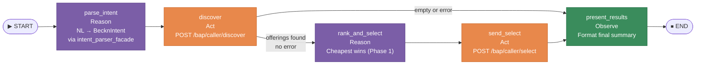

# Component: Procurement ReAct Agent — Architecture Design

> [!warning] Document Status
> This document describes the **planned architecture** to be implemented in `feature/agent-framework`. The code does not yet exist in that branch. This document is the verification specification: what gets implemented must match what is described here.

> [!architecture] Role in the System
> The Procurement ReAct Agent is the **intelligent orchestration layer** that connects the [[nl_intent_parser|NL Intent Parser]] with the [[beckn_bap_client|Beckn BAP Client]]. It receives a natural language procurement request, converts it into a `BecknIntent` using the already-built NLP infrastructure (Ollama / IntentParser), discovers offerings on the Beckn network, selects the best one, and sends `/select`. Every step is recorded in an auditable reasoning trace (`messages`). The implementation lives in `feature/agent-framework` and never modifies `src/beckn/` or `IntentParser/`.

---

## Position in the Global Architecture

```
User NL Query
      │
      ▼
┌─────────────────────────────────────────────┐
│         Procurement ReAct Agent             │  ← feature/agent-framework
│         (LangGraph StateGraph)              │     Bap-1/src/agent/
│                                             │
│  parse_intent → discover → rank_and_select  │
│              → send_select → present_results│
└──────────┬──────────────────────┬───────────┘
           │                      │
           ▼                      ▼
┌──────────────────┐   ┌──────────────────────┐
│   IntentParser   │   │   Beckn BAP Layer    │
│   (Ollama NLP)   │   │   src/beckn/         │
│   qwen3:1.7b     │   │   + src/server.py    │
│   shared/models  │   │   + beckn-onix :8081 │
└──────────────────┘   └──────────────────────┘
```

**Dependency rule:** `src/agent/` imports from `src/beckn/`, `src/nlp/`, and `shared/`, but **never modifies them**. The work done by other team members in `src/beckn/` remains untouched.

---

## File Structure

```
Bap-1/
├── src/
│   └── agent/
│       ├── __init__.py     ← public API: ProcurementAgent, ProcurementState
│       ├── state.py        ← ProcurementState TypedDict (LangGraph shared memory)
│       ├── nodes.py        ← make_nodes() factory — 5 async functions
│       └── graph.py        ← StateGraph wiring + ProcurementAgent class
├── tests/
│   └── test_agent.py       ← unit tests (zero real HTTP or Ollama calls)
└── requirements.txt        ← langgraph and langchain-core must be restored
```

---

## LangGraph Graph Topology



| Node | ReAct Role | Description |
|---|---|---|
| `parse_intent` | **Reason** | NL → `BecknIntent` via `intent_parser_facade` (Ollama) |
| `discover` | **Act** | `BecknClient.discover_async()` → `POST /bap/caller/discover` |
| `rank_and_select` | **Reason** | Evaluates offerings — cheapest wins in Phase 1 |
| `send_select` | **Act** | `BecknClient.select()` → `POST /bap/caller/select` |
| `present_results` | **Observe** | Always executes — formats final result |

---

## ProcurementState — Shared Memory

**File:** `Bap-1/src/agent/state.py`

```python
from __future__ import annotations
import operator
from typing import Annotated, Optional
from typing_extensions import TypedDict
from src.beckn.models import BecknIntent, DiscoverOffering

class ProcurementState(TypedDict):
    request:        str
    intent:         Optional[BecknIntent]
    transaction_id: Optional[str]
    offerings:      list[DiscoverOffering]
    selected:       Optional[DiscoverOffering]
    select_ack:     Optional[dict]
    messages:       Annotated[list[str], operator.add]  # append-only reducer
    error:          Optional[str]
```

### Field Lifecycle

| Field | Written by | Read by | Notes |
|---|---|---|---|
| `request` | caller (entry) | `parse_intent` | Raw NL string |
| `intent` | `parse_intent` | `discover`, `send_select` | Pre-populate to skip NLP |
| `transaction_id` | `discover` | `send_select` | Beckn txn ID from DiscoverResponse |
| `offerings` | `discover` | `rank_and_select`, `present_results` | List of `DiscoverOffering` |
| `selected` | `rank_and_select` | `send_select`, `present_results` | Winning offering |
| `select_ack` | `send_select` | `present_results` | Raw ONIX ACK dict |
| `messages` | **all nodes** | caller (post-run) | Auditable reasoning trace |
| `error` | any node | all subsequent nodes | First failure captured here; others skip |

### `messages` Reducer Contract

`Annotated[list[str], operator.add]` — LangGraph concatenates automatically. Each node returns **only its new lines**:

```python
# Correct
return {"messages": ["[discover] txn=abc-123 found 3 offerings"]}

# Wrong — would cause duplication
return {"messages": state["messages"] + ["[discover] ..."]}
```

### Error Propagation Contract

The first node that fails writes to `error`. Subsequent nodes check `state.get("error")` at the top and short-circuit with a skip message. The graph **always reaches `present_results` and `END`** — it never crashes mid-run.

---

## Node Breakdown

**File:** `Bap-1/src/agent/nodes.py`

All five nodes are created by the `make_nodes()` factory, which closes over `BecknClient` and `CallbackCollector` as Python closures. This allows I/O dependencies to be injected without polluting the state TypedDict.

---

### Node 1 — `parse_intent` (Reason)

**Purpose:** Convert `state["request"]` (NL text) into a `BecknIntent` using the existing NLP infrastructure.

```python
async def parse_intent(state: ProcurementState) -> dict:
    # Skip if intent is already pre-loaded (tests / run.py / arun_with_intent)
    if state.get("intent") is not None:
        return {"messages": ["[parse_intent] intent pre-loaded — skipping NLP"]}

    query = state["request"]
    try:
        # Delegates to the existing IntentParser via the facade
        intent = parse_nl_to_intent(query)   # → BecknIntent | None
        if intent is None:
            return {
                "error": f"Query not recognised as procurement: {query!r}",
                "messages": ["[parse_intent] ERROR: non-procurement query"],
            }
        return {
            "intent": intent,
            "messages": [
                f"[parse_intent] item={intent.item!r} qty={intent.quantity} "
                f"loc={intent.location_coordinates} "
                f"timeline={intent.delivery_timeline}h "
                f"budget_max={intent.budget_constraints.max if intent.budget_constraints else None}"
            ],
        }
    except Exception as exc:
        return {
            "error": f"Intent parsing failed: {exc}",
            "messages": [f"[parse_intent] ERROR: {exc}"],
        }
```

**Underlying model:** `qwen3:1.7b` via Ollama — inherited from `IntentParser/core.py`.

**Skip logic:** If `state["intent"]` is already populated, no Ollama call is made. This is the injection point for:
- `ProcurementAgent.arun_with_intent()` — passes a pre-built intent
- Tests — inject intent directly into the initial state
- `run.py` — uses the hardcoded `INTENT` object

---

### Node 2 — `discover` (Act)

**Purpose:** Execute the Beckn `/discover` flow by calling `BecknClient.discover_async()`.

```python
async def discover(state: ProcurementState) -> dict:
    if state.get("error"):
        return {"messages": ["[discover] skipped — prior error"]}

    intent = state.get("intent")
    resp = await client.discover_async(intent, collector, timeout=discover_timeout)
    # resp: DiscoverResponse {transaction_id, offerings: list[DiscoverOffering]}
    return {
        "offerings": resp.offerings,
        "transaction_id": resp.transaction_id,
        "messages": [f"[discover] txn={resp.transaction_id} found {len(resp.offerings)} offering(s)"],
    }
```

Internally, `discover_async()` (`src/beckn/client.py`):
1. Builds the Beckn v2 wire payload via `adapter.build_discover_wire_payload()`
2. Registers a queue in `CallbackCollector` for `(txn_id, "on_discover")`
3. `POST /bap/caller/discover` → ONIX adapter (port 8081)
4. Awaits the `on_discover` callback via `src/server.py` → `CallbackCollector`
5. Returns a `DiscoverResponse` with all offerings

**Conditional edge after this node:**
```python
def _route_after_discover(state: ProcurementState) -> str:
    if state.get("error") or not state.get("offerings"):
        return "present_results"   # no offerings or error → skip ranking
    return "rank_and_select"
```

---

### Node 3 — `rank_and_select` (Reason)

**Purpose:** Evaluate discovered offerings and pick the best one.

**Phase 1 — cheapest wins:**

```python
async def rank_and_select(state: ProcurementState) -> dict:
    offerings = state.get("offerings") or []
    best = min(offerings, key=lambda o: float(o.price_value))
    return {
        "selected": best,
        "messages": [
            f"[rank_and_select] selected {best.provider_name!r} "
            f"₹{best.price_value} (cheapest of {len(offerings)})"
        ],
    }
```

**Phase 2 extension point:** This node will be replaced by (or will call) the [[comparison_scoring_engine|Comparison & Scoring Engine]], which applies multi-criteria scoring: price + TCO + delivery time + quality + compliance. The node interface (`state` in, `{"selected": ..., "messages": [...]}` out) stays the same — only the internal logic changes.

---

### Node 4 — `send_select` (Act)

**Purpose:** Send Beckn `/select` to signal buyer intent to the chosen seller.

```python
async def send_select(state: ProcurementState) -> dict:
    if state.get("error"):
        return {"messages": ["[send_select] skipped — prior error"]}

    selected = state["selected"]
    intent   = state["intent"]
    txn_id   = state["transaction_id"]

    order = SelectOrder(
        provider=SelectProvider(id=selected.provider_id),
        items=[SelectedItem(
            id=selected.item_id,
            quantity=intent.quantity,
            name=selected.item_name,
            price_value=selected.price_value,
            price_currency=selected.price_currency,
        )],
    )
    ack = await client.select(
        order,
        transaction_id=txn_id,
        bpp_id=selected.bpp_id,
        bpp_uri=selected.bpp_uri,
    )
    ack_status = ack.get("message", {}).get("ack", {}).get("status", "UNKNOWN")
    return {
        "select_ack": ack,
        "messages": [
            f"[send_select] ACK={ack_status} "
            f"bpp={selected.bpp_id} provider={selected.provider_name}"
        ],
    }
```

**Critical invariant:** `select_url` always contains `/bap/caller/select`. The agent never calls a BPP directly. The Beckn v2 wire format `{ contract: { commitments, consideration } }` is built by `adapter.build_select_wire_payload()` — transparent to this node.

---

### Node 5 — `present_results` (Observe)

**Purpose:** Evaluate the final outcome and write the summary to the reasoning trace. **Always executes**, regardless of errors or empty results.

```python
async def present_results(state: ProcurementState) -> dict:
    if state.get("error"):
        summary = f"Procurement flow ended with error: {state['error']}"
    elif not state.get("selected"):
        summary = "No offerings found for the requested item."
    else:
        s = state["selected"]
        qty = state["intent"].quantity
        summary = (
            f"Order initiated — {s.provider_name} | "
            f"{s.item_name} × {qty} | "
            f"₹{s.price_value} {s.price_currency} | "
            f"txn={state.get('transaction_id')}"
        )
    return {"messages": [f"[present_results] {summary}"]}
```

---

## `make_nodes()` Factory — Dependency Injection

**File:** `Bap-1/src/agent/nodes.py`

```python
from src.nlp.intent_parser_facade import parse_nl_to_intent

def make_nodes(
    client: BecknClient,
    collector: CallbackCollector,
    discover_timeout: float = 15.0,
) -> tuple:
    """Return the 5 node functions as async callables.

    client and collector are injected as closures — nodes are plain
    async functions that only receive 'state', making them easy to
    mock in tests by passing a fake client to make_nodes().
    """
    async def parse_intent(state): ...
    async def discover(state): ...
    async def rank_and_select(state): ...
    async def send_select(state): ...
    async def present_results(state): ...

    return parse_intent, discover, rank_and_select, send_select, present_results
```

**Parameters:**

| Parameter | Type | Description |
|---|---|---|
| `client` | `BecknClient` | Open async HTTP client — must be inside an async context manager |
| `collector` | `CallbackCollector` | Shared with the aiohttp server for callback correlation |
| `discover_timeout` | `float` | Seconds to wait for `on_discover` callback (default 15.0) |

---

## Graph Assembly — `build_graph()`

**File:** `Bap-1/src/agent/graph.py`

```python
from langgraph.graph import StateGraph, END
from .state import ProcurementState
from .nodes import make_nodes

def _route_after_discover(state: ProcurementState) -> str:
    if state.get("error") or not state.get("offerings"):
        return "present_results"
    return "rank_and_select"

def build_graph(
    client: BecknClient,
    collector: CallbackCollector,
    discover_timeout: float = 15.0,
) -> CompiledGraph:
    parse_intent, discover, rank_and_select, send_select, present_results = \
        make_nodes(client, collector, discover_timeout)

    graph = StateGraph(ProcurementState)
    graph.add_node("parse_intent",    parse_intent)
    graph.add_node("discover",        discover)
    graph.add_node("rank_and_select", rank_and_select)
    graph.add_node("send_select",     send_select)
    graph.add_node("present_results", present_results)

    graph.set_entry_point("parse_intent")
    graph.add_edge("parse_intent", "discover")
    graph.add_conditional_edges(
        "discover",
        _route_after_discover,
        {"rank_and_select": "rank_and_select", "present_results": "present_results"},
    )
    graph.add_edge("rank_and_select", "send_select")
    graph.add_edge("send_select",     "present_results")
    graph.add_edge("present_results", END)

    return graph.compile()
```

---

## ProcurementAgent — Public API

**File:** `Bap-1/src/agent/graph.py`

```python
class ProcurementAgent:
    def __init__(
        self,
        adapter: BecknProtocolAdapter,
        collector: CallbackCollector,
        discover_timeout: float = 15.0,
    ):
        self._adapter = adapter
        self._collector = collector
        self._timeout = discover_timeout

    async def arun(self, request: str) -> ProcurementState:
        """NL entry point — parse_intent calls Ollama via IntentParser."""
        async with BecknClient(self._adapter) as client:
            graph = build_graph(client, self._collector, self._timeout)
            return await graph.ainvoke({"request": request, "offerings": [], "messages": []})

    async def arun_with_intent(self, intent: BecknIntent) -> ProcurementState:
        """Pre-built intent entry point — parse_intent skips NLP."""
        async with BecknClient(self._adapter) as client:
            graph = build_graph(client, self._collector, self._timeout)
            return await graph.ainvoke({
                "request": intent.item,
                "intent": intent,
                "offerings": [],
                "messages": [],
            })
```

| Method | NLP called | Use case |
|---|---|---|
| `arun(request)` | Yes — Ollama via `intent_parser_facade` | Full NL pipeline from CLI or UI |
| `arun_with_intent(intent)` | No — intent pre-populated | `run.py` hardcoded `INTENT`, tests |

---

## Integration with `run.py`

The agent replaces the current manual orchestration (`discover_async` → `select`):

```python
from src.agent import ProcurementAgent

agent = ProcurementAgent(
    adapter=BecknProtocolAdapter(config),
    collector=collector,
    discover_timeout=config.callback_timeout,
)

# NL mode (sys.argv[1])
result = await agent.arun("500 reams A4 paper 80GSM Bangalore 3 days max 200 INR")

# Pre-built intent mode (hardcoded fallback)
result = await agent.arun_with_intent(INTENT)

# Inspect results
for msg in result["messages"]:
    print(f"  {msg}")
```

---

## Reasoning Trace Example

For query `"500 reams A4 paper 80GSM Bangalore 3 days max 200 INR"`:

```
[parse_intent]     item='A4 paper 80GSM' qty=500 loc=12.9716,77.5946 timeline=72h budget_max=200.0
[discover]         txn=a1b2c3 found 3 offering(s): OfficeWorld@₹195, PaperDirect@₹189, StationeryHub@₹201
[rank_and_select]  selected 'PaperDirect' ₹189 (cheapest of 3)
[send_select]      ACK=ACK bpp=seller-2 provider=PaperDirect
[present_results]  Order initiated — PaperDirect | A4 Paper Ream × 500 | ₹189 INR | txn=a1b2c3
```

---

## `requirements.txt` Changes

When implementing this agent in `feature/agent-framework`, restore in `Bap-1/requirements.txt`:

```
langgraph>=0.2.0
langchain-core>=0.3.0
```

These were removed from `BAP-1` when the agent was isolated to this branch.

---

## Test Coverage

**Command:** `pytest tests/ -v`  
**Result:** 59 passed, 0 failed — no Docker, no Ollama required.

### `tests/test_agent.py`

- `test_initial_state_all_fields_present`
- `test_parse_intent_skipped_when_pre_loaded`
- `test_parse_intent_calls_facade`
- `test_discover_returns_3_plus_offerings`
- `test_rank_selects_cheapest`
- `test_discover_called_with_correct_intent`
- `test_transaction_id_propagated`
- `test_select_called_with_cheapest_provider`
- `test_select_ack_stored_in_state`
- `test_empty_discover_skips_select`
- `test_discover_exception_captured`
- `test_select_exception_captured`
- `test_messages_trace_contains_all_node_tags`
- `test_messages_are_ordered`

### `tests/test_callbacks.py`

- `test_callback_payload_parses`
- `test_handle_callback_returns_ack`
- `test_handle_callback_ignores_unregistered_transaction`
- `test_collect_on_select_response`
- `test_collect_returns_empty_for_unregistered`
- `test_collect_timeout_with_no_callback`
- `test_collect_routes_by_action`
- `test_collect_routes_by_transaction_id`
- `test_cleanup_removes_queue`
- `test_concurrent_callbacks_all_received`

### `tests/test_discover.py`

- `test_intent_quantity_must_be_positive`
- `test_intent_negative_quantity_rejected`
- `test_intent_timeline_must_be_positive`
- `test_intent_timeline_hours_not_iso`
- `test_intent_budget_range`
- `test_intent_descriptions_atomic_list`
- `test_build_discover_request_action`
- `test_build_discover_request_version`
- `test_build_discover_request_bap_identity`
- `test_build_discover_request_preserves_intent`
- `test_discover_url_points_to_onix`
- `test_discover_url_not_gateway`
- `test_discover_returns_offerings`
- `test_discover_returns_3_plus_sellers`
- `test_discover_offerings_have_prices`
- `test_discover_with_explicit_transaction_id`
- `test_discover_raises_on_onix_error`

### `tests/test_intent_parser.py`

- `test_bridge_returns_none_for_non_procurement`
- `test_bridge_converts_to_bap_beckn_intent`
- `test_bridge_preserves_delivery_timeline_in_hours`
- `test_bridge_preserves_budget_constraints`
- `test_bridge_preserves_location_coordinates`
- `test_bridge_preserves_descriptions_list`
- `test_bridge_result_accepted_by_adapter`
- `test_integration_parse_nl_to_intent[500 units A4 paper 80gsm ...]`
- `test_integration_parse_nl_to_intent[10 Dell laptops for Delhi office ...]`
- `test_integration_parse_nl_to_intent[1000 pairs nitrile gloves size L ...]`

### `tests/test_select.py`

- `test_build_select_request_action`
- `test_build_select_request_carries_bpp_context`
- `test_build_select_request_preserves_transaction_id`
- `test_select_url_points_to_onix_adapter`
- `test_select_url_not_direct_to_bpp`
- `test_caller_action_url`
- `test_select_posts_to_onix_adapter`
- `test_select_raises_on_onix_error`
- `test_discover_to_select_flow`

---

## Phase 2 Extension Points

The graph was designed so that Phase 2 changes are **additive**, not destructive:

| What changes | Where to change | Impact on existing code |
|---|---|---|
| Cheapest → multi-criteria scoring | `rank_and_select` body inside `make_nodes()` | Zero — same function signature |
| Add `negotiate` node after `rank_and_select` | `graph.py`: add_node + add_edge | Only `graph.py` changes |
| Add `approval` node with human-in-the-loop | `graph.py`: conditional edge after `negotiate` | Only `graph.py` changes |
| Historical price RAG (Qdrant) in ranking | `nodes.py`: inject `qdrant_client` via `make_nodes()` | Only `make_nodes()` signature |
| New state fields | `state.py`: add `negotiation_result`, `approval_status` | Additive — existing tests still pass |

---

## Critical Invariants

> [!guardrail] Rules that must never be violated

1. **`select_url` always contains `/bap/caller/`** — the agent never calls a BPP directly; all traffic routes through the ONIX adapter.
2. **`BecknIntent.delivery_timeline` is in hours (int)** — `"3 days"` → `72`, never ISO 8601 `"P3D"`.
3. **`BecknIntent.budget_constraints`** is `BudgetConstraints(max=N, min=0.0)` — never a raw string.
4. **`CallbackCollector.register()` before send, `cleanup()` after collect** — handled internally by `BecknClient.discover_async()`. The agent only calls `discover_async()`.
5. **The `messages` reducer is append-only** — each node returns only its new lines; never the full list.
6. **Beckn v2 `/select` wire format: `{ contract: { commitments, consideration } }`** — not `{ order: ... }`. Built by `adapter.build_select_wire_payload()`, transparent to agent nodes.
7. **`src/agent/` does not modify `src/beckn/` or `IntentParser/`** — imports only.

---

*See also → [[agent_framework_langchain_langgraph]] · [[beckn_bap_client]] · [[nl_intent_parser]] · [[comparison_scoring_engine]] · [[phase1_foundation_protocol_integration]] · [[phase2_core_intelligence_transaction_flow]]*
