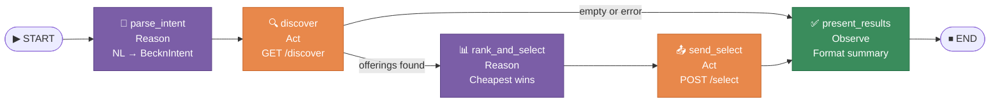

# Component: Procurement ReAct Agent — Implementation (Phase 1)

> [!architecture] Role in the System
> This document describes the **concrete implementation** of the [[agent_framework_langchain_langgraph|Agent Framework]]. The agent lives in `src/agent/` and is the cognitive backbone of the system: it receives a procurement request (natural language or structured), orchestrates the [[beckn_bap_client|Beckn BAP Client]] to discover offerings, ranks them, and sends `/select` to signal intent to the best seller. Every step is logged to a reasoning trace (`messages`), making the agent's decisions fully auditable from the first run.

---

## File Structure

```
Bap-1/
└── src/
    └── agent/
        ├── __init__.py     ← public API: ProcurementAgent, ProcurementState
        ├── state.py        ← ProcurementState TypedDict (LangGraph shared memory)
        ├── nodes.py        ← make_nodes() factory — 5 async node functions
        └── graph.py        ← StateGraph wiring + ProcurementAgent class

tests/
└── test_agent.py           ← 13 unit tests (zero real HTTP or API calls)
```

**Dependency rule:** `src/agent/` imports from `src/beckn/` and `src/nlp/city_gps`, but **never modifies them**. Your colleague's work in `src/beckn/` is untouched.

---

## LangGraph Graph Topology



### Node types in the ReAct loop

| Node              | ReAct role  | Description                                                     |
| ----------------- | ----------- | --------------------------------------------------------------- |
| `parse_intent`    | **Reason**  | Interprets the request — calls LLM to extract structured intent |
| `discover`        | **Act**     | Calls the Beckn network — sends `/discover`, collects responses |
| `rank_and_select` | **Reason**  | Evaluates results — picks best offering (cheapest in Phase 1)   |
| `send_select`     | **Act**     | Executes the action — sends `/select` to ONIX adapter           |
| `present_results` | **Observe** | Processes outcome — formats final summary for the caller        |

---

## ProcurementState — Shared Memory

**File:** [src/agent/state.py](../../../../Bap-1/src/agent/state.py)

```python
class ProcurementState(TypedDict):
    request:        str
    intent:         Optional[BecknIntent]
    transaction_id: Optional[str]
    offerings:      list[DiscoverOffering]
    selected:       Optional[DiscoverOffering]
    select_ack:     Optional[dict]
    messages:       Annotated[list[str], operator.add]
    error:          Optional[str]
```

LangGraph carries this `TypedDict` through the entire graph. Each node receives the full current state and returns a **partial dict** — only the fields it modifies. LangGraph merges the partial dicts automatically.

### Field lifecycle

| Field            | Set by            | Used by                              | Notes                                      |
| ---------------- | ----------------- | ------------------------------------ | ------------------------------------------ |
| `request`        | caller (entry)    | `parse_intent`                       | Raw NL string or `intent.item`             |
| `intent`         | `parse_intent`    | `discover`, `send_select`            | Pre-populate to skip LLM parsing           |
| `transaction_id` | `discover`        | `send_select`                        | Beckn transaction ID from DiscoverResponse |
| `offerings`      | `discover`        | `rank_and_select`, `present_results` | All BPP offerings returned                 |
| `selected`       | `rank_and_select` | `send_select`, `present_results`     | The winning offering                       |
| `select_ack`     | `send_select`     | `present_results`                    | Raw ONIX ACK dict                          |
| `messages`       | **all nodes**     | caller (after run)                   | Append-only reasoning trace                |
| `error`          | any node          | all subsequent nodes                 | First failure captures here; others skip   |

### The `messages` reducer

`messages` uses `Annotated[list[str], operator.add]` — the standard LangGraph **append-only reducer**. Each node returns only its *new* log lines; LangGraph concatenates them into the running list automatically. This means you never have to pass the full list in a return value:

```python
# Correct — return only the new lines
return {"messages": ["[discover] found 3 offerings"]}

# Wrong — would cause duplication
return {"messages": state["messages"] + ["[discover] found 3 offerings"]}
```

### Error propagation contract

The first node that fails writes to `error`. All subsequent nodes check `state.get("error")` at the top and short-circuit with a skip message. The graph always reaches `present_results` and `END` — it never crashes mid-run.

---

## Node Breakdown

**File:** [src/agent/nodes.py](../../../../Bap-1/src/agent/nodes.py)

All five nodes are created by the `make_nodes()` factory, which closes over the injected dependencies (`BecknClient`, `CallbackCollector`, `api_key`). This is how LangGraph nodes receive I/O objects without polluting the state TypedDict.

---

### Node 1 — `parse_intent` (Reason)

**Purpose:** Convert the raw NL text in `state["request"]` into a `BecknIntent` using the Anthropic API.

**Model used:** `claude-haiku-4-5-20251001` — fast and cost-effective for structured extraction with tool_use.

**Tool schema** (`build_beckn_intent`):

```python
_INTENT_TOOL = {
    "name": "build_beckn_intent",
    "input_schema": {
        "properties": {
            "item":           str,   # e.g. "A4 paper 80gsm"
            "descriptions":   list,  # ["A4", "80gsm"]
            "quantity":       int,   # 500
            "delivery_city":  str,   # "Bangalore"
            "delivery_hours": int,   # 72  (3 days × 24)
            "budget_max":     float  # 100000  (₹1 lakh)
        },
        "required": ["item", "quantity"]
    }
}
```

**Important:** `tool_choice={"type": "tool", "name": "build_beckn_intent"}` forces the model to always call this specific tool. This is **schema-constrained decoding** — the model cannot return free text, it must fill the schema. This is the same pattern already established in `src/nlp/intent_parser.py`.

**Output mapped to `BecknIntent`** (the Anti-Corruption Layer):
- `delivery_hours` → `BecknIntent.delivery_timeline` (int hours, not ISO 8601)
- `budget_max` → `BudgetConstraints(max=budget_max)`
- `delivery_city` → `resolve_gps(city)` → `"lat,lon"` string (uses `src/nlp/city_gps.py`)

**Skip logic:** If `state["intent"]` is already populated when the node runs, it logs `"skipping LLM"` and returns immediately without any API call. This is the injection point for:
- `ProcurementAgent.arun_with_intent()` — passes pre-built intent
- Tests — inject intent via `_initial_state()`
- `run.py` — uses the hardcoded `INTENT` object

---

### Node 2 — `discover` (Act)

**Purpose:** Execute the Beckn `/discover` flow by calling `BecknClient.discover_async()`.

```python
resp = await client.discover_async(intent, collector, timeout=discover_timeout)
```

The `discover_async` method (implemented by your colleague in `src/beckn/client.py`):
1. Builds the camelCase Beckn v2 wire payload via `adapter.build_discover_wire_payload()`
2. Registers a queue in `CallbackCollector` for `(txn_id, "on_discover")`
3. Posts to `/bap/caller/discover` on the ONIX adapter (port 8081)
4. Awaits the `on_discover` callback from `CallbackCollector`
5. Parses both Format A (flat `resources[]`) and Format B (`providers[].items[]`)
6. Returns a `DiscoverResponse` with all offerings and the `transaction_id`

**State updates from this node:**
- `offerings` ← `resp.offerings` (list of `DiscoverOffering`)
- `transaction_id` ← `resp.transaction_id` (reused in `/select`)

**Routing after this node** (conditional edge):
```
offerings found → rank_and_select
empty or error  → present_results   (skips ranking + select)
```

---

### Node 3 — `rank_and_select` (Reason)

**Purpose:** Evaluate the discovered offerings and pick the best one.

**Phase 1 — cheapest wins:**
```python
best = min(offerings, key=lambda o: float(o.price_value))
```

**Phase 2 extension point:** This node will be replaced by (or will call) the [[comparison_scoring_engine|Comparison & Scoring Engine]], which applies multi-criteria scoring: price + TCO + delivery time + quality + compliance. The node interface (receives `state`, returns `{"selected": offering, "messages": [...]}`) stays the same — only the internal logic changes.

---

### Node 4 — `send_select` (Act)

**Purpose:** Send the Beckn `/select` action to signal buyer intent to the chosen seller.

This node builds a `SelectOrder` from the ranked offering:

```python
order = SelectOrder(
    provider=SelectProvider(id=selected.provider_id),
    items=[SelectedItem(
        id=selected.item_id,
        quantity=intent.quantity,
        name=selected.item_name,
        price_value=selected.price_value,
        price_currency=selected.price_currency,
    )]
)
ack = await client.select(order, transaction_id=txn_id,
                          bpp_id=selected.bpp_id, bpp_uri=selected.bpp_uri)
```

The `client.select()` method posts to `/bap/caller/select` on the ONIX adapter. ONIX builds the **Beckn v2 `/select` wire format** — which uses `{ contract: { commitments, consideration } }` (not `{ order: ... }`). This is handled inside `adapter.build_select_wire_payload()` — the agent node doesn't need to know the wire format details.

**Important invariant:** `select_url` always contains `/caller/` in the path (enforced by adapter tests). The agent never calls a BPP directly.

---

### Node 5 — `present_results` (Observe)

**Purpose:** Evaluate the outcome and write the final summary to the reasoning trace.

This is the only node that always executes, regardless of errors or empty results. It reads the final state and produces a human-readable summary:

- **Success:** `"Order initiated — PaperDirect | A4 Paper Ream × 500 | ₹189.00 INR | txn=test-txn-001"`
- **Empty:** `"No offerings found for the requested item."`
- **Error:** `"Procurement flow ended with error: ONIX unreachable"`

---

## Dependency Injection — `make_nodes()` Factory

**File:** [src/agent/nodes.py](../../../../Bap-1/src/agent/nodes.py#L130)

```python
def make_nodes(
    client: BecknClient,
    collector: CallbackCollector,
    api_key: str | None,
    discover_timeout: float = 15.0,
) -> tuple:
    # All 5 nodes are defined as inner async functions
    # that close over client, collector, api_key
    async def parse_intent(state): ...
    async def discover(state): ...
    async def rank_and_select(state): ...
    async def send_select(state): ...
    async def present_results(state): ...

    return parse_intent, discover, rank_and_select, send_select, present_results
```

**Why this pattern:** LangGraph calls each node with only `state` as argument. To give nodes access to `BecknClient`, `CallbackCollector`, and `api_key` without putting them in the state TypedDict, the factory closes over them as Python closures. The resulting functions are plain async callables — easy to mock in tests by passing a fake client to `make_nodes()`.

---

## Graph Assembly — `build_graph()`

**File:** [src/agent/graph.py](../../../../Bap-1/src/agent/graph.py)

```python
def build_graph(client, collector, api_key, discover_timeout=15.0):
    nodes = make_nodes(client, collector, api_key, discover_timeout)

    graph = StateGraph(ProcurementState)

    # Register nodes
    graph.add_node("parse_intent",    nodes[0])
    graph.add_node("discover",        nodes[1])
    graph.add_node("rank_and_select", nodes[2])
    graph.add_node("send_select",     nodes[3])
    graph.add_node("present_results", nodes[4])

    # Wire edges
    graph.set_entry_point("parse_intent")
    graph.add_edge("parse_intent", "discover")
    graph.add_conditional_edges("discover", _route_after_discover, {
        "rank_and_select": "rank_and_select",
        "present_results": "present_results",
    })
    graph.add_edge("rank_and_select", "send_select")
    graph.add_edge("send_select",     "present_results")
    graph.add_edge("present_results", END)

    return graph.compile()
```

### Conditional routing function

```python
def _route_after_discover(state: ProcurementState) -> str:
    if state.get("error") or not state.get("offerings"):
        return "present_results"   # surface error/empty without crashing
    return "rank_and_select"
```

---

## ProcurementAgent — Public Entry Point

**File:** [src/agent/graph.py](../../../../Bap-1/src/agent/graph.py#L90)

The `ProcurementAgent` class manages the `BecknClient` async context lifecycle:

```python
agent = ProcurementAgent(
    adapter=BecknProtocolAdapter(config),
    collector=collector,           # shared with the aiohttp server
    api_key=os.getenv("ANTHROPIC_API_KEY"),
    discover_timeout=15.0,
)
```

### Entry point 1 — NL request

```python
result = await agent.arun(
    "500 reams A4 paper 80gsm, Bangalore, 3 days, budget 1 lakh"
)
```

Flow:
1. Opens `BecknClient` async session
2. Calls `build_graph(client, ...)` with injected deps
3. Sets `intent=None` in initial state → `parse_intent` calls Anthropic API
4. Invokes graph → full 5-node execution
5. Closes `BecknClient` session
6. Returns final `ProcurementState`

### Entry point 2 — Pre-built intent (run.py / tests)

```python
result = await agent.arun_with_intent(
    BecknIntent(item="A4 paper 80gsm", quantity=500, ...)
)
```

Flow: identical, except `intent` is pre-populated → `parse_intent` skips the Anthropic API call.

### Reading the result

```python
# Check for errors first
if result["error"]:
    print(f"Failed: {result['error']}")

# Inspect the ReAct reasoning trace
for msg in result["messages"]:
    print(msg)
# [parse_intent] Intent already provided — skipping LLM
# [discover]     txn=abc-123 found 3 offering(s): OfficeWorld@₹195.00, PaperDirect@₹189.00...
# [rank_and_select] Selected 'PaperDirect' ₹189.00 (cheapest of 3)
# [send_select]  /select ACK=ACK bpp=seller-2 provider=PaperDirect
# [present_results] Order initiated — PaperDirect | A4 Paper Ream × 500 | ₹189.00 INR | txn=abc-123

# Access structured output
selected = result["selected"]
print(f"Provider: {selected.provider_name}, Price: ₹{selected.price_value}")
```

---

## Integration with `run.py`

The existing `run.py` can be updated to use the agent instead of the manual orchestration code. The agent replaces the current manual `discover_async → select` sequence:

```python
# New run.py usage (replaces the manual flow)
from src.agent import ProcurementAgent

agent = ProcurementAgent(adapter, collector, api_key=None)
result = await agent.arun_with_intent(INTENT)

for msg in result["messages"]:
    print(f"  {msg}")

if result["selected"]:
    s = result["selected"]
    print(f"\n  Selected : {s.provider_name}")
    print(f"  Price    : Rs. {s.price_value}")
```

---

## How to Run the Tests

```bash
# Install dependencies (one time)
pip install langgraph langchain-core

# Run only agent tests
pytest tests/test_agent.py -v

# Run all tests
pytest tests/ -v
```

### Test coverage (13 tests, zero real calls)

| Test | What it verifies |
|---|---|
| `test_initial_state_all_fields_present` | TypedDict shape is correct |
| `test_parse_intent_skipped_when_pre_loaded` | LLM skip when intent injected |
| `test_discover_returns_3_plus_offerings` | **Phase 1 acceptance criterion** |
| `test_rank_selects_cheapest` | PaperDirect (₹189) wins over OfficeWorld (₹195) and StationeryHub (₹201) |
| `test_discover_called_with_correct_intent` | `discover_async` receives the exact `BecknIntent` |
| `test_transaction_id_propagated` | `txn_id` flows from discover to state |
| `test_select_called_with_cheapest_provider` | `/select` uses `p2` (PaperDirect) with qty=500 |
| `test_select_ack_stored_in_state` | ACK dict stored in `state["select_ack"]` |
| `test_empty_discover_skips_select` | Empty offerings → `select` never called, no error |
| `test_discover_exception_captured` | RuntimeError captured in `state["error"]` |
| `test_select_exception_captured` | `/select` RuntimeError captured, `selected` still set |
| `test_messages_trace_contains_all_node_tags` | All 5 node tags appear in messages |
| `test_messages_are_ordered` | Tags appear in execution order |

---

## Installing Dependencies

Two new packages added to `requirements.txt`:

```
langgraph>=0.2.0      # StateGraph, END, conditional edges
langchain-core>=0.3.0 # TypedDict reducers, base types
```

---

## Known Issue: `IntentParser` Model Mismatch

> [!guardrail] Why the agent does NOT use `src/nlp/intent_parser.py`
> The existing `src/nlp/intent_parser.py` imports `SearchIntent`, `SearchItem`, `Descriptor`, `Fulfillment`, and other types that **do not exist** in the current `src/beckn/models.py`. The file would raise an `ImportError` at load time. Since modifying a colleague's file is out of scope for task 1.4, the agent's `parse_intent` node implements its own NL→`BecknIntent` conversion directly using the Anthropic SDK — targeting `BecknIntent` from `models.py`. The `city_gps.resolve_gps` function from `src/nlp/city_gps.py` is safely reused (no broken imports). This mismatch should be resolved in Phase 2 when the NLP module is updated.

---

## Phase 2 Extension Points

This graph was designed so that Phase 2 changes are **additive**, not destructive:

| What changes | Where to change | Impact on existing code |
|---|---|---|
| Replace cheapest-wins with multi-criteria scoring | `rank_and_select` node body inside `make_nodes()` | Zero — same function signature |
| Add `negotiate` node after `rank_and_select` | `graph.py`: add node + edges | Only `graph.py` changes |
| Add `approval` node with human-in-the-loop edge | `graph.py`: conditional edge after `negotiate` | Only `graph.py` changes |
| LLM call in `rank_and_select` for quality reasoning | `nodes.py`: `rank_and_select` internals | No interface change |
| Connect Qdrant RAG for historical price context | `nodes.py`: inject `qdrant_client` via `make_nodes()` | Only `make_nodes()` signature changes |

The `ProcurementState` TypedDict will need new fields (`negotiation_result`, `approval_status`), which are additive changes — existing tests continue to pass.

---

## Key Constraints and Invariants

> [!guardrail] Critical rules that must never be violated

1. **`select_url` always contains `/caller/`** — the agent never calls a BPP directly; all traffic routes through the ONIX adapter (`/bap/caller/select`).
2. **`BecknIntent.delivery_timeline` is in hours (int)** — `"3 days"` → `72`, never ISO 8601 `"P3D"`.
3. **`BecknIntent.budget_constraints`** is a `BudgetConstraints(max=N, min=0.0)` object — never a raw string.
4. **`CallbackCollector.register()` before send, `cleanup()` after collect** — this lifecycle is handled internally by `BecknClient.discover_async()`. The agent only calls `discover_async()`.
5. **The `messages` reducer is append-only** — each node returns only its new lines; never the full list.
6. **Beckn v2 `/select` wire format uses `{ contract: { commitments, consideration } }`** — not `{ order: ... }`. This is enforced inside `adapter.build_select_wire_payload()`, transparent to the agent nodes.

---

*See also → [[agent_framework_langchain_langgraph]] · [[beckn_bap_client]] · [[nl_intent_parser]] · [[comparison_scoring_engine]] · [[phase1_foundation_protocol_integration]] · [[phase2_core_intelligence_transaction_flow]]*
