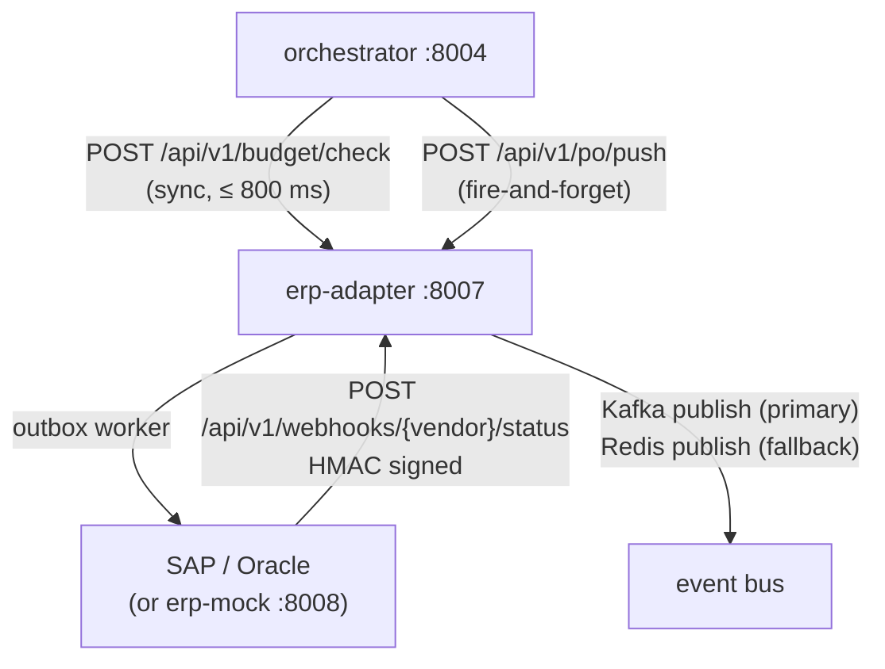

# Component: ERP Integration

> [!architecture] Role in the System
> The ERP Integration adapter (`services/erp-adapter`, port 8007) provides bidirectional synchronization between the procurement agent and enterprise ERP systems (SAP S/4HANA and Oracle ERP Cloud). It serves two critical functions: (1) **pre-confirm budget gate** — synchronous real-time budget check before `/confirm`, preventing overspend; and (2) **post-confirm PO push** — fire-and-forget outbox-based push to the ERP after confirmation. A local mock ERP (`services/erp-mock`, port 8008) enables full integration testing without vendor credentials.

## Supported ERPs

| System | API Protocol | Integration Type |
|---|---|---|
| SAP S/4HANA | OData APIs | Bidirectional |
| Oracle ERP Cloud | REST APIs | Bidirectional |
| Mock (local dev) | Internal HTTP | Full simulation with 6 configurable scenarios |

Full integration specification: [[erp_sap_oracle]].

## Vendor-Neutral Protocol

`ERPAdapter` is a `typing.Protocol` with 6 methods. Concrete implementations (`MockERPAdapter`, `SAPS4HanaAdapter`, `OracleERPCloudAdapter`) are swapped via the `ERP_VENDOR` env var. A `MultiVendorAdapter` wraps multiple vendors when `ERP_VENDORS=sap,oracle`.

| Method | Direction | Notes |
|---|---|---|
| `check_budget` | Agent → ERP | Synchronous; blocks `/confirm` if insufficient |
| `evaluate_policy` | Agent → ERP | Policy gate (cost center, category, threshold rules) |
| `push_po` | Agent → ERP | Async via outbox; fire-and-forget |
| `cancel_po` | Agent → ERP | `NotImplementedError` on real adapters — Phase 4 scope |
| `normalize_inbound_status` | ERP → Agent | Maps ERP status codes to Beckn lifecycle states |
| `healthcheck` | — | Liveness check for per-vendor circuit breaker |

## Budget Gate (Synchronous)

The orchestrator calls `POST /api/v1/budget/check` before executing `/confirm`. This call **blocks the commit** with an 800 ms total budget.

```
orchestrator → erp-adapter → ERP system
                             ← budget available / exhausted
       ← pass / fail (≤ 800 ms)
```

- `ERP_BUDGET_CHECK_REQUIRED=true` (default prod): budget denial blocks commit (fail-closed)
- `ERP_BUDGET_CHECK_REQUIRED=false` (dev): budget check is advisory only (fail-open)

## PO Push (Asynchronous Outbox)

After confirmation, the orchestrator calls `POST /api/v1/po/push`. The adapter writes the operation to the `erp_sync_records` table (outbox pattern) and returns immediately — no synchronous ERP call on the critical path.

A background worker polls the outbox and retries failed operations up to the configured attempt limit. Failed items require explicit replay via `POST /api/v1/admin/outbox/{sync_id}/replay`.

**Migration:** `database/sql/19b_erp_sync_records_outbox.sql` adds 8 operational columns to the existing `erp_sync_records` table (`idempotency_key`, `attempts`, `next_attempt_at`, `lease_until`, `worker_id`, `last_error`, `payload`, `updated_at`).

## Inbound Webhooks (ERP → Agent)

ERP systems push order/receipt status updates to `POST /api/v1/webhooks/{vendor}/status`. Authentication is HMAC-SHA256:

- Two secrets accepted simultaneously (`{VENDOR}_WEBHOOK_HMAC_SECRET` primary, `_NEXT` for rotation)
- Constant-time compare via `hmac.compare_digest`
- Rotation: set `_NEXT` → deploy vendor config → promote → clear `_NEXT`

## Circuit Breakers

One `pybreaker.CircuitBreaker` per vendor (`mock`, `sap`, `oracle`). A SAP outage does not affect Oracle calls. `VendorPermanentError` (bad payload) does not trip the breaker. State published as `erp_circuit_state{vendor}` Prometheus gauge.

## Mock ERP Scenarios

`services/erp-mock` (port 8008) simulates 6 named scenarios:

| Scenario | Behaviour |
|---|---|
| `happy` | Budget approved, PO created, webhook fires after 2 s |
| `budget_exhausted` | Budget check returns insufficient funds |
| `po_create_fails` | PO push returns 500 after budget approval |
| `webhook_delayed` | Webhook fires after 30 s instead of 2 s |
| `erp_approval_required` | ERP requires human approval before PO is created |
| `erp_preferred_supplier` | ERP injects a preferred-supplier override |

Set via `ERP_MOCK_SCENARIO` env var or `POST /mock/scenario`.

## Data Flow



## Key Environment Variables

| Var | Default | Purpose |
|---|---|---|
| `ERP_VENDOR` | `mock` | `mock` / `sap` / `oracle` / `multi` |
| `ERP_BUDGET_CHECK_ENABLED` | `false` | Enable budget gate on `/commit` |
| `ERP_BUDGET_CHECK_REQUIRED` | `true` | Fail-closed (true) vs. fail-open (false) |
| `ERP_SYNC_ENABLED` | `false` | Enable outbox PO push after confirmation |
| `ERP_INTERNAL_TOKEN` | — | Bearer token for orchestrator → adapter auth |
| `SAP_WEBHOOK_HMAC_SECRET` | — | Primary HMAC secret for SAP inbound webhooks |
| `SAP_WEBHOOK_HMAC_SECRET_NEXT` | — | Rotation secret (leave empty when not rotating) |

Full ADR: `services/erp-adapter/docs/ADR-erp-integration.md`

> [!milestone] Phase 3 Delivery Status
> - [x] Budget gate implemented and tested (synchronous, fail-closed in prod)
> - [x] PO push via outbox (async, idempotent retry)
> - [x] Dual-secret HMAC webhook auth with rotation support
> - [x] Per-vendor circuit breakers
> - [x] Mock ERP with 6 configurable scenarios
> - [ ] `cancel_po` on real adapters (Phase 4 scope)
> - [ ] mTLS to on-prem SAP tenants (Phase 4 scope)
