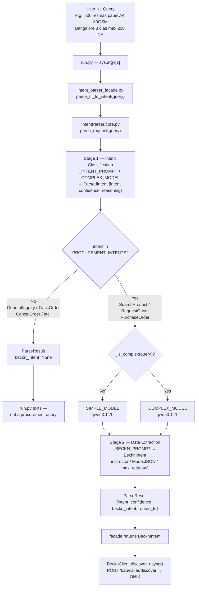

# Component: Natural Language Intent Parser

> [!architecture] Role in the System
> The NL Intent Parser is the **entry gate** of the procurement pipeline. It converts a free-form natural language request into a `BecknIntent` — the structured, machine-processable object that the [[beckn_bap_client|BAP client]] uses to query the Beckn network. The parser lives in the standalone `IntentParser/` module, connected to `Bap-1` through a thin facade (`src/nlp/intent_parser_facade.py`). Both subsystems share `shared/models.py` as the **Anti-Corruption Layer** that defines the canonical intent schema.

---

## Module Locations

| Module | Path | Responsibility |
|---|---|---|
| NLP core | `IntentParser/core.py` | Two-stage pipeline, heuristic routing, Ollama calls |
| Schemas | `IntentParser/schemas.py` | `ParsedIntent`, `ParseResult`, city→coordinates lookup |
| Public API | `IntentParser/__init__.py` | Exports `parse_request`, `parse_batch` |
| Shared ACL | `shared/models.py` | `BecknIntent`, `BudgetConstraints` — shared by both modules |
| BAP facade | `Bap-1/src/nlp/intent_parser_facade.py` | Wraps `parse_request()`, returns `BecknIntent \| None` |
| Entry point | `Bap-1/run.py` | Wires CLI arg → facade → `BecknClient.discover_async()` |

---

## End-to-End Flow



---

## Stage 1 — Intent Classification

**File:** `IntentParser/core.py` → `_chat(COMPLEX_MODEL, _INTENT_PROMPT, query, ParsedIntent)`

The first LLM call classifies the query into a PascalCase intent and produces a confidence score.

**System prompt (`_INTENT_PROMPT`):**
```
You are an intent classifier for a Beckn-based procurement system.
Classify the user query into a PascalCase intent.
Procurement intents: SearchProduct, RequestQuote, PurchaseOrder, TrackOrder, CancelOrder.
If the query is a greeting, general question, or unrelated to procurement, return GeneralInquiry.
```

**Output schema (`ParsedIntent` — `IntentParser/schemas.py`):**

```python
class ParsedIntent(BaseModel):
    intent: str          # PascalCase, e.g. "SearchProduct"
    product_name: Optional[str] = None
    quantity: Optional[int] = None
    confidence: float    # 0.0–1.0, validated
    reasoning: str
```

**Procurement filter (`_PROCUREMENT_INTENTS`):**  
Only `SearchProduct`, `RequestQuote`, and `PurchaseOrder` trigger Stage 2.  
All other intents (`TrackOrder`, `CancelOrder`, `GeneralInquiry`) return a `ParseResult` with `beckn_intent=None` — the facade returns `None` and `run.py` exits early.

---

## Complexity Routing Heuristic

Before Stage 2, `_is_complex(query)` decides which model to use:

```python
def _is_complex(query: str) -> bool:
    lower = query.lower()
    return (
        len(query) > 120
        or len(re.findall(r"\b\d+(?:\.\d+)?\b", query)) >= 2
        or any(kw in lower for kw in _COMPLEX_KEYWORDS)
    )
```

**Complex keywords trigger:** `delivery`, `timeline`, `deadline`, `days`, `weeks`, `hours`, `within`, `budget`, `price`, `cost`, `rupee`, `inr`, `usd`, `per unit`, `per sheet`, `under`, `maximum`, `max`.

| Condition | Result |
|---|---|
| Query length > 120 chars | COMPLEX_MODEL |
| ≥ 2 numeric tokens | COMPLEX_MODEL |
| Contains any complex keyword | COMPLEX_MODEL |
| None of the above | SIMPLE_MODEL |

> [!note] Phase 1 Configuration
> Both `COMPLEX_MODEL` and `SIMPLE_MODEL` default to `qwen3:1.7b` (overridable via env vars). The routing heuristic is designed to allow a heavier model for complex queries in Phase 2, when different model sizes may be deployed.

**Fallback:** If the simple model fails, it automatically retries with the complex model before raising.

---

## Stage 2 — Beckn Data Extraction

**File:** `IntentParser/core.py` → `_parse_beckn(query)`

The second LLM call extracts all structured fields needed to build a Beckn `/discover` request.

**System prompt (`_BECKN_PROMPT`):**
```
You are a procurement data extractor for the Beckn protocol. Extract structured data from the user query.
- descriptions: all technical specs (e.g. "80gsm", "A4", "Cat6", "2 inch")
- delivery_timeline: convert to hours — 1 day=24h, 1 week=168h
- budget: numeric values only, no currency symbols; if only upper bound given, set min=0
- location lookup: Bangalore/Bengaluru=12.9716,77.5946 | Mumbai=19.0760,72.8777 |
  Delhi=28.7041,77.1025 | Chennai=13.0827,80.2707 | Hyderabad=17.3850,78.4867 |
  Pune=18.5204,73.8567 | Kolkata=22.5726,88.3639 | unknown city → raw text
```

**Structured output:** `instructor` library with `Mode.JSON`, `max_retries=3`, targeting the `BecknIntent` schema directly.

---

## Shared Anti-Corruption Layer — `shared/models.py`

Both `IntentParser` and `Bap-1` import `BecknIntent` from `shared/models.py`.  
This is the **single source of truth** for canonical field formats. Neither module does its own conversion.

```python
class BudgetConstraints(BaseModel):
    max: float
    min: float = 0.0   # open lower bound — "under ₹200" means min=0, max=200

class BecknIntent(BaseModel):
    item: str
    descriptions: list[str]           # ["80gsm", "A4"] — atomic specs
    quantity: int                      # positive integer, validated
    location_coordinates: Optional[str]  # "lat,lon" decimal — never city names
    delivery_timeline: Optional[int]     # hours (int) — never ISO 8601
    budget_constraints: Optional[BudgetConstraints]
```

**Canonical form invariants:**

| Field | Raw input | Canonical form |
|---|---|---|
| Location | `"Bangalore"` | `"12.9716,77.5946"` |
| Timeline | `"3 days"` | `72` (hours as int) |
| Timeline | `"1 week"` | `168` |
| Budget | `"max 200 INR"` | `BudgetConstraints(max=200.0, min=0.0)` |
| Specs | `"A4 80gsm paper"` | `["A4", "80gsm"]` |

---

## BAP Facade — `Bap-1/src/nlp/intent_parser_facade.py`

The facade is the **seam point** between `IntentParser` and `Bap-1`. It hides all NLP implementation details.

```python
from IntentParser import parse_request
from shared.models import BecknIntent

def parse_nl_to_intent(query: str) -> BecknIntent | None:
    result = parse_request(query)
    return result.beckn_intent
```

- Returns `BecknIntent` if the query is a procurement request.
- Returns `None` for non-procurement queries — `run.py` exits with a user-facing message.
- **Replacement contract:** If `IntentParser` is replaced by an HTTP microservice in Phase 3, only this file changes. Nothing else in `Bap-1` is affected.

**Import resolution at runtime:**
- `run.py` inserts the parent directory into `sys.path` so `IntentParser` is importable.
- `pytest` uses `pythonpath = ..` in `pytest.ini` for the same effect.

---

## Example Transformation

**Input (natural language):**
> `"500 resmas papel A4 80GSM Bangalore 3 dias max 200 INR"`

**Stage 1 output (`ParsedIntent`):**
```json
{
  "intent": "SearchProduct",
  "product_name": "papel A4",
  "quantity": 500,
  "confidence": 0.97,
  "reasoning": "Query clearly describes a product search with quantity and specifications."
}
```

**Stage 2 output (`BecknIntent` — canonical ACL form):**
```json
{
  "item": "papel A4 80GSM",
  "descriptions": ["A4", "80GSM"],
  "quantity": 500,
  "location_coordinates": "12.9716,77.5946",
  "delivery_timeline": 72,
  "budget_constraints": {
    "max": 200.0,
    "min": 0.0
  }
}
```

**`ParseResult` returned by `parse_request()`:**
```json
{
  "intent": "SearchProduct",
  "confidence": 0.97,
  "beckn_intent": { "...": "as above" },
  "routed_to": "qwen3:1.7b"
}
```

---

## Configuration

| Env var | Default | Description |
|---|---|---|
| `COMPLEX_MODEL` | `qwen3:1.7b` | Model for complex queries |
| `SIMPLE_MODEL` | `qwen3:1.7b` | Model for simple queries |
| `OLLAMA_URL` | `http://localhost:11434/v1` | Ollama OpenAI-compatible base URL |

---

## Public API (`IntentParser/__init__.py`)

```python
from IntentParser import parse_request, parse_batch
from IntentParser import ParsedIntent, BecknIntent, ParseResult
```

| Function | Signature | Use case |
|---|---|---|
| `parse_request` | `(query: str) → ParseResult` | Single query, synchronous |
| `parse_batch` | `(queries: list[str], max_workers=4) → list[ParseResult]` | Bulk parsing via `ThreadPoolExecutor` |

---

## Fault Tolerance

| Failure | Behaviour |
|---|---|
| Stage 1 `ParsedIntent` validation error | `instructor` retries up to 3 times with the same model |
| Stage 2 `BecknIntent` validation error | Retries up to 3×; if simple model, escalates to complex model |
| Non-procurement intent | Returns `ParseResult(beckn_intent=None)` — facade returns `None`, no exception |
| Ollama unreachable | Exception propagates to `run.py` → unhandled, terminates with traceback |

> [!guardrail] Schema-constrained output
> `instructor` with `Mode.JSON` forces the LLM to produce valid JSON matching the Pydantic schema. All field validation (confidence range 0–1, quantity > 0, timeline > 0) is enforced by Pydantic validators before `ParseResult` is returned. A malformed LLM response triggers an automatic retry, not a crash.

> [!milestone] Phase 1 Acceptance Criteria
> From [[phase1_foundation_protocol_integration|Phase 1]]:
> - Correctly parses diverse procurement requests (item, quantity, location, timeline, budget) into valid `BecknIntent` instances.
> - Non-procurement queries (`GeneralInquiry`, `TrackOrder`, etc.) return `None` from the facade — no false positives sent to the Beckn network.
> - `parse_batch` handles concurrent queries without race conditions (`ThreadPoolExecutor`, stateless `_client`).
