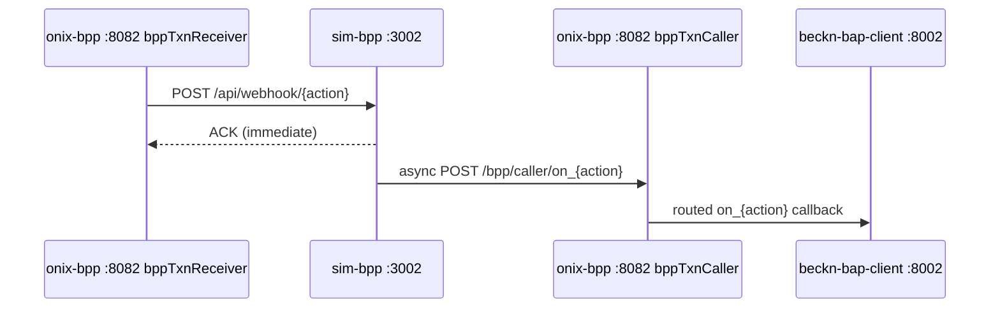

# Component: sim-bpp — Local Beckn BPP Simulator

> [!architecture] Role in the System
> `sim-bpp` (port 3002) is a high-fidelity local BPP (Beckn Provider Platform) that replaced the old `fidedocker/sandbox-2.0` image. It handles the full Beckn v2.0.0 lifecycle — discovery plus all nine transactional actions — through the real signed and schema-validated ONIX path. **Key guarantee:** if the BAP works against this simulator, it will work against a real Beckn network. The only differences are routing (`targetType: url` vs. DeDi registry lookup) and signing keys (testnet vs. production).

## Why sim-bpp Replaced sandbox-2.0

| Limitation of sandbox-2.0 | How sim-bpp addresses it |
|---|---|
| Catalog was fixed — could not be edited without rebuilding | `catalog.json` is bind-mounted at runtime — edit without restart |
| No auto-advance lifecycle | `SIM_BPP_AUTO_ADVANCE=true` progresses orders through 5 states |
| Black-box behavior hard to debug | Node.js source code is part of the repo |
| Sandbox domain mismatch caused ONIX routing failures | Routing configured to match local Docker DNS exactly |

## Discovery Logic

The `build_on_discover` function implements AND-token matching:

1. Reads `catalog.json` on every request (hot-reload).
2. Tokenizes both the query and catalog entries (lowercase, light singularization).
3. Discards query tokens that match nothing in the catalog vocabulary (filters words like "Mumbai", "days" that have no catalog entry).
4. Returns items where **all** filtered query tokens appear in the item name + keywords (AND logic, not OR).
5. Returns `message.catalogs[]` in Beckn v2 flat-resource wire format.

This means a query like "300 meters Cat6 UTP cable Mumbai 5 days" correctly matches Cat6 UTP cable entries while ignoring the location and timeline tokens.

## Catalog

`catalog.json` contains **9 providers** and **31 items** across 5 categories:

| Category | Examples |
|---|---|
| Office Supplies | A4 paper, pens, notebooks |
| IT Equipment | Laptops, desktops, servers |
| IT Peripherals | Keyboards, monitors, webcams |
| Networking | Cat6 cable, switches, patch panels |
| Furniture | Chairs, desks, cabinets |

Each item includes `fulfillment_hours`, `stock` count, and `specs[]`. The catalog file is bind-mounted at `/app/catalog.json` — edit it without rebuilding the image.

## Transactional Actions

All nine Beckn actions are handled. For transactional actions, `status.code` returned:

| Action | Status returned |
|---|---|
| `select` | `ACCEPTED` |
| `init` | `ACTIVE` |
| `confirm` | `ACTIVE` |
| `status` | Current order status |
| `cancel` | `CANCELLED` |

## Auto-Advance Lifecycle

When `SIM_BPP_AUTO_ADVANCE=true`, a confirmed order automatically progresses:


Each transition:
- PATCHes `data-normalizer` at `PATCH /normalize/po_status`
- Publishes an event to Kafka topic `po.status.changed` (triggers WebSocket fan-out and `notification-dispatcher`)

Auto-advance is **off by default** to preserve manual test workflows. Scheduling is idempotent — the same `order_id` cannot be double-scheduled.

## Message Flow



## Key Configuration

| Var | Default | Description |
|---|---|---|
| `PORT` | `3002` | Listen port |
| `ONIX_BPP_CALLER` | `http://onix-bpp:8082/bpp/caller` | Base URL for `on_{action}` callbacks |
| `BPP_ID` | `bpp.example.com` | Stamped on all responses |
| `SIM_BPP_AUTO_ADVANCE` | `false` | Enable autonomous lifecycle progression |
| `SIM_BPP_ADVANCE_INTERVAL_SECS` | `5` | Seconds between state transitions |
| `CATALOG_PATH` | `/app/catalog.json` | Path to catalog (bind-mounted) |

## Run

```bash
docker compose up -d sim-bpp

# Or standalone with a custom catalog:
docker run -p 3002:3002 -v ./catalog.json:/app/catalog.json sim-bpp
```

Tests: `services/sim-bpp/tests/test_auto_advance.py` covers lifecycle, cancel, idempotency, and flag-off.
