# Data Dictionary & Entity-Relationship Model

> [!architecture] Document Scope
> Complete data dictionary and ER diagram for the **Agentic AI Procurement Agent on Beckn Protocol** system. Covers the 16 core entities derived strictly from the `project_scaffold/` documents. Source of truth for the PostgreSQL schema design (Phase 1 — Task 1.6), the Qdrant vector schema, and the Kafka topics of the data pipeline.

---

## Entity Summary

| # | Entity | Store | Description |
|---|---|---|---|
| 1 | `User` | PostgreSQL | Person interacting with the system; defines RBAC role and approval threshold |
| 2 | `ProcurementRequest` | PostgreSQL | Free-text purchase request submitted by the user |
| 3 | `ParsedIntent` | PostgreSQL | Intent classification produced by the NL Intent Parser |
| 4 | `BecknIntent` | PostgreSQL | Structured canonical form for the Beckn protocol (anti-corruption layer) |
| 5 | `DiscoveryQuery` | PostgreSQL + Redis | `GET /discover` query sent to the Beckn protocol |
| 6 | `CatalogCache` | Redis (TTL 15 min) | Cache of catalog responses to avoid redundant network calls |
| 7 | `BPP` | PostgreSQL | Seller registered on the Beckn / ONDC network (Beckn Provider Platform) |
| 8 | `SellerOffering` | PostgreSQL | Normalized offering received from a BPP after `/discover` |
| 9 | `ScoredOffer` | PostgreSQL | Output of the Comparison & Scoring Engine with ranking and explanation |
| 10 | `NegotiationOutcome` | PostgreSQL | Result of the negotiation via Beckn `/select` |
| 11 | `ApprovalDecision` | PostgreSQL | Approval Workflow decision based on RBAC thresholds |
| 12 | `PurchaseOrder` | PostgreSQL | Confirmed purchase order via Beckn `/confirm` |
| 13 | `ERPSyncRecord` | PostgreSQL | Synchronization record with SAP S/4HANA or Oracle ERP Cloud |
| 14 | `AuditTrailEvent` | PostgreSQL + Splunk | Every agent decision event with its full reasoning payload |
| 15 | `AgentMemoryVector` | Qdrant | Vector embedding of transactions and outcomes for RAG |
| 16 | `ModelGovernanceRecord` | PostgreSQL | Version registry, evaluation metrics and status for each AI model |

---

## Entity-Relationship Diagram

```mermaid
erDiagram

    %% ──────────────────────────────────────────────
    %% CORE ENTITIES AND RELATIONSHIPS
    %% ──────────────────────────────────────────────

    User {
        uuid user_id PK
        string email
        string name
        enum role "requester | approver | admin"
        string department
        decimal approval_threshold
        string keycloak_id
        enum idp_provider "keycloak | okta | azure_ad"
        timestamp created_at
    }

    ProcurementRequest {
        uuid request_id PK
        uuid requester_id FK
        text raw_input_text
        enum channel "web | slack | teams"
        boolean urgency_flag
        string category
        enum status "draft | parsing | discovering | scoring | negotiating | pending_approval | confirmed | cancelled"
        timestamp created_at
        timestamp updated_at
    }

    ParsedIntent {
        uuid intent_id PK
        uuid request_id FK
        enum intent_class "procurement | query | support | out_of_scope"
        float confidence_score
        string model_version
        timestamp parsed_at
    }

    BecknIntent {
        uuid beckn_intent_id PK
        uuid intent_id FK
        string item
        jsonb descriptions
        integer quantity
        string unit
        string location_coordinates
        integer delivery_timeline_hours
        decimal budget_min
        decimal budget_max
        string currency
        jsonb compliance_requirements
    }

    DiscoveryQuery {
        uuid query_id PK
        uuid beckn_intent_id FK
        string network_id
        boolean cache_hit
        integer results_count
        timestamp queried_at
    }

    CatalogCache {
        string cache_key PK
        uuid query_id FK
        jsonb cached_offerings
        timestamp created_at
        timestamp expires_at
    }

    BPP {
        uuid bpp_id PK
        string name
        string network_id
        string endpoint_url
        float reliability_score
        float on_time_delivery_rate
        timestamp registered_at
        timestamp last_seen_at
    }

    SellerOffering {
        uuid offering_id PK
        uuid query_id FK
        uuid bpp_id FK
        string item_id
        decimal price
        string currency
        integer delivery_eta_hours
        float quality_rating
        jsonb certifications
        integer inventory_count
        integer format_variant
        boolean is_normalized
        timestamp received_at
    }

    ScoredOffer {
        uuid score_id PK
        uuid offering_id FK
        integer rank
        float total_score
        float price_score
        float delivery_score
        float quality_score
        float compliance_score
        decimal tco_value
        text explanation_text
        boolean user_overridden
        string model_version
        timestamp scored_at
    }

    NegotiationOutcome {
        uuid negotiation_id PK
        uuid score_id FK
        enum strategy_applied "aggressive | accept_margin | advisory | escalate | skipped"
        decimal initial_price
        decimal counter_offer_price
        decimal final_price
        float discount_percent
        enum acceptance_status "accepted | rejected | advisory | escalated | skipped"
        timestamp negotiated_at
    }

    ApprovalDecision {
        uuid approval_id PK
        uuid negotiation_id FK
        uuid requester_id FK
        uuid approver_id FK
        enum approval_level "auto | manager | cfo"
        decimal amount_total
        enum status "pending | approved | rejected | escalated | auto_approved"
        boolean is_emergency
        timestamp deadline_at
        enum notification_channel "slack | teams | email"
        timestamp decided_at
    }

    PurchaseOrder {
        uuid po_id PK
        uuid approval_id FK
        uuid bpp_id FK
        string item_id
        integer quantity
        string unit
        decimal agreed_price
        string currency
        text delivery_terms
        string beckn_confirm_ref
        string erp_po_ref
        enum status "pending | confirmed | shipped | delivered | cancelled"
        timestamp created_at
    }

    ERPSyncRecord {
        uuid sync_id PK
        uuid po_id FK
        enum erp_system "sap_s4hana | oracle_erp_cloud"
        enum sync_type "budget_check | po_creation | goods_receipt | invoice_matching"
        enum status "success | failed | pending"
        string erp_reference_id
        boolean budget_available
        timestamp synced_at
    }

    AuditTrailEvent {
        uuid event_id PK
        uuid request_id FK
        uuid po_id FK
        uuid actor_id FK
        enum event_type "discover | normalize | score | negotiate | approve | confirm | override | erp_sync | notification"
        text agent_action
        jsonb reasoning_payload
        bigint kafka_offset
        boolean splunk_indexed
        timestamp event_timestamp
        timestamp retention_until
    }

    AgentMemoryVector {
        uuid vector_id PK
        uuid source_request_id FK
        enum entity_type "transaction | negotiation | seasonal | supplier | override"
        vector embedding_vector
        jsonb metadata
        enum embedding_model "text-embedding-3-large | e5-large-v2"
        timestamp indexed_at
    }

    ModelGovernanceRecord {
        uuid record_id PK
        enum model_name "intent_parsing | comparison_scoring | negotiation_strategy | memory_retrieval"
        string model_version
        enum provider "openai | anthropic"
        float accuracy_score
        float override_rate
        date evaluation_date
        enum status "active | review_triggered | deprecated"
    }

    %% ──────────────────────────────────────────────
    %% RELATIONSHIPS
    %% ──────────────────────────────────────────────

    User ||--o{ ProcurementRequest : "submits"
    User ||--o{ ApprovalDecision : "approves (as approver)"
    User ||--o{ ApprovalDecision : "requests (as requester)"
    User ||--o{ AuditTrailEvent : "acts on"

    ProcurementRequest ||--|| ParsedIntent : "classified by"
    ProcurementRequest ||--o{ AuditTrailEvent : "generates"
    ProcurementRequest ||--o{ AgentMemoryVector : "stored as"

    ParsedIntent ||--o| BecknIntent : "extracted into"

    BecknIntent ||--o{ DiscoveryQuery : "triggers"

    DiscoveryQuery ||--o| CatalogCache : "cached in"
    DiscoveryQuery ||--o{ SellerOffering : "yields"

    BPP ||--o{ SellerOffering : "provides"

    SellerOffering ||--o| ScoredOffer : "evaluated as"

    ScoredOffer ||--o| NegotiationOutcome : "negotiated into"

    NegotiationOutcome ||--|| ApprovalDecision : "routed to"

    ApprovalDecision ||--o| PurchaseOrder : "authorized by"

    PurchaseOrder ||--o{ ERPSyncRecord : "synced via"
    PurchaseOrder ||--o{ AuditTrailEvent : "generates"
    PurchaseOrder }o--|| BPP : "placed with"
```



---

## Detailed Data Dictionary

---

### 1. `User`

> [!tech-stack] Store: PostgreSQL 16 · Keycloak SSO (SAML 2.0 / OIDC)
> Represents any person interacting with the system. The RBAC role determines which operations the user can perform and up to what amount they can approve without escalation.

| Attribute | Type | Constraints | Description |
|---|---|---|---|
| `user_id` | `UUID` | PK, NOT NULL | Unique user identifier |
| `email` | `VARCHAR(255)` | UNIQUE, NOT NULL | Corporate email; also used as identifier in Keycloak |
| `name` | `VARCHAR(255)` | NOT NULL | Full name |
| `role` | `ENUM` | NOT NULL | `requester` · `approver` · `admin` |
| `department` | `VARCHAR(100)` | NOT NULL | Department the user belongs to (e.g., Procurement, IT, Facilities) |
| `approval_threshold` | `DECIMAL(15,2)` | DEFAULT 0 | Maximum amount in local currency the user can approve without escalation |
| `keycloak_id` | `VARCHAR(255)` | UNIQUE, NOT NULL | Sub claim of the JWT issued by Keycloak |
| `idp_provider` | `ENUM` | NOT NULL | `keycloak` · `okta` · `azure_ad` |
| `created_at` | `TIMESTAMP` | NOT NULL, DEFAULT NOW() | Date the user was registered in the system |

**RBAC Roles:**

| Role | Capabilities |
|---|---|
| `requester` | Submit purchase requests; cannot execute `/confirm` directly |
| `approver` | Approve/reject orders within their threshold; access to Slack one-click approval |
| `admin` | Configure negotiation strategies per category, RBAC thresholds, and policies |

---

### 2. `ProcurementRequest`

> [!tech-stack] Store: PostgreSQL 16
> Root record of every purchase request. Captures the user's original free-text input before any processing. It is the anchor of the entire agent decision chain.

| Attribute        | Type           | Constraints                   | Description                                                                 |
| ---------------- | -------------- | ----------------------------- | --------------------------------------------------------------------------- |
| `request_id`     | `UUID`         | PK, NOT NULL                  | Unique request identifier                                                   |
| `requester_id`   | `UUID`         | FK → `User.user_id`, NOT NULL | User who originated the request                                             |
| `raw_input_text` | `TEXT`         | NOT NULL                      | Exact natural-language text submitted by the user, unmodified               |
| `channel`        | `ENUM`         | NOT NULL                      | Entry channel: `web` · `slack` · `teams`                                    |
| `urgency_flag`   | `BOOLEAN`      | DEFAULT FALSE                 | `TRUE` if the text contains the `URGENT:` prefix — activates emergency mode |
| `category`       | `VARCHAR(100)` | NULLABLE                      | Detected product category (e.g., office supplies, IT equipment)             |
| `status`         | `ENUM`         | NOT NULL                      | Full lifecycle status (see states below)                                    |
| `created_at`     | `TIMESTAMP`    | NOT NULL, DEFAULT NOW()       | Request creation timestamp                                                  |
| `updated_at`     | `TIMESTAMP`    | NOT NULL                      | Last status update timestamp                                                |

**`status` lifecycle:**

```
draft → parsing → discovering → scoring → negotiating → pending_approval → confirmed
                                                                         ↘ cancelled
```

---

### 3. `ParsedIntent`

> [!tech-stack] Store: PostgreSQL 16 · Model: GPT-4o (primary) / Claude Sonnet 4.6 (fallback)
> Output of the first stage of the NL Intent Parser: intent classification before Beckn field extraction. The two-stage architecture prevents nonsensical Beckn queries for non-procurement intents.

| Attribute | Type | Constraints | Description |
|---|---|---|---|
| `intent_id` | `UUID` | PK, NOT NULL | Unique classification identifier |
| `request_id` | `UUID` | FK → `ProcurementRequest.request_id`, UNIQUE | Request that originated this classification (1:1) |
| `intent_class` | `ENUM` | NOT NULL | `procurement` · `query` · `support` · `out_of_scope` |
| `confidence_score` | `FLOAT` | CHECK (0.0–1.0) | Classification probability (target: ≥ 0.95 for `procurement`) |
| `model_version` | `VARCHAR(50)` | NOT NULL | LLM model version used (e.g., `gpt-4o-2024-11-20`) |
| `parsed_at` | `TIMESTAMP` | NOT NULL, DEFAULT NOW() | Classification timestamp |

> [!guardrail] Routing rule
> Only records with `intent_class = 'procurement'` advance to `BecknIntent` creation. All others are answered directly without touching the Beckn network.

---

### 4. `BecknIntent`

> [!tech-stack] Store: PostgreSQL 16 · Layer: Anti-Corruption Layer between NL and Beckn protocol
> Structured canonical form that acts as the boundary between natural language and the Beckn protocol. All fields are normalized to standard units: GPS coordinates, hours, ISO 4217 currency.

| Attribute | Type | Constraints | Description |
|---|---|---|---|
| `beckn_intent_id` | `UUID` | PK, NOT NULL | Unique identifier |
| `intent_id` | `UUID` | FK → `ParsedIntent.intent_id`, UNIQUE | Parent intent (1:1) |
| `item` | `VARCHAR(255)` | NOT NULL | Canonical product name (e.g., `"A4 paper"`) |
| `descriptions` | `JSONB` | NOT NULL | List of atomic technical specifications (e.g., `["80gsm", "white", "ISO 216"]`) |
| `quantity` | `INTEGER` | NOT NULL, CHECK > 0 | Required quantity |
| `unit` | `VARCHAR(50)` | NOT NULL | Unit of measure (e.g., `reams`, `units`, `kg`) |
| `location_coordinates` | `VARCHAR(50)` | NOT NULL | GPS coordinates in `"lat,lon"` format (e.g., `"12.9716,77.5946"`) |
| `delivery_timeline_hours` | `INTEGER` | NOT NULL | Normalized deadline in hours (e.g., `72` for "3 days") |
| `budget_min` | `DECIMAL(15,2)` | NULLABLE | Minimum budget in local currency |
| `budget_max` | `DECIMAL(15,2)` | NULLABLE | Maximum budget in local currency |
| `currency` | `CHAR(3)` | NOT NULL, DEFAULT 'INR' | ISO 4217 currency code (e.g., `INR`, `USD`) |
| `compliance_requirements` | `JSONB` | DEFAULT '[]' | List of required certifications (e.g., `["ISO 27001", "BIS"]`) |

**Sample instance:**
```json
{
  "item": "A4 paper",
  "descriptions": ["80gsm", "white", "500 sheets/ream"],
  "quantity": 500,
  "unit": "reams",
  "location_coordinates": "12.9716,77.5946",
  "delivery_timeline_hours": 72,
  "budget_max": 1000.00,
  "currency": "INR",
  "compliance_requirements": []
}
```

---

### 5. `DiscoveryQuery`

> [!tech-stack] Store: PostgreSQL 16 (record) · Redis 7 (response cache)
> Record of each `GET /discover` call sent to the Discovery Service via the beckn-onix adapter. The `cache_hit` field indicates whether the response was served from Redis (TTL 15 min) or from the Beckn network.

| Attribute | Type | Constraints | Description |
|---|---|---|---|
| `query_id` | `UUID` | PK, NOT NULL | Unique query identifier |
| `beckn_intent_id` | `UUID` | FK → `BecknIntent.beckn_intent_id`, NOT NULL | Intent that originated this query |
| `network_id` | `VARCHAR(100)` | NOT NULL | Beckn network ID queried (e.g., `ondc-prod-01`) |
| `cache_hit` | `BOOLEAN` | NOT NULL, DEFAULT FALSE | `TRUE` if the response was served from Redis |
| `results_count` | `INTEGER` | DEFAULT 0 | Number of offerings received |
| `queried_at` | `TIMESTAMP` | NOT NULL, DEFAULT NOW() | Query execution timestamp |

---

### 6. `CatalogCache`

> [!tech-stack] Store: Redis 7 · TTL: 15 minutes
> Cache of Discovery Service responses. Phase 4 target: reduce redundant Beckn network calls by ≥ 50%. The cache key is a composite of normalized item type + location coordinates.

| Attribute | Type | Description |
|---|---|---|
| `cache_key` | `STRING (PK)` | Composite key: `{item_normalized}:{lat}:{lon}` |
| `query_id` | `UUID` | Reference to the `DiscoveryQuery` that originated this cache entry |
| `cached_offerings` | `JSON` | Full serialized Discovery Service response |
| `created_at` | `TIMESTAMP` | Cache write timestamp |
| `expires_at` | `TIMESTAMP` | Expiry = `created_at + 15 min` |

---

### 7. `BPP`

> [!tech-stack] Store: PostgreSQL 16
> Represents a seller (Beckn Provider Platform) registered on the Beckn / ONDC network. Its reliability metrics are consumed by the Comparison Engine and Agent Memory for historical scoring.

| Attribute | Type | Constraints | Description |
|---|---|---|---|
| `bpp_id` | `UUID` | PK, NOT NULL | Unique internal identifier |
| `name` | `VARCHAR(255)` | NOT NULL | Seller's commercial name |
| `network_id` | `VARCHAR(100)` | NOT NULL | Identifier on the Beckn network (e.g., `bpp.seller-A.ondc`) |
| `endpoint_url` | `VARCHAR(500)` | NOT NULL | URL of the `/bpp/receiver/*` endpoint |
| `reliability_score` | `FLOAT` | CHECK (0.0–1.0), DEFAULT 0.5 | Historical reliability score computed by Agent Memory |
| `on_time_delivery_rate` | `FLOAT` | CHECK (0.0–1.0), DEFAULT 0.5 | Percentage of on-time deliveries |
| `registered_at` | `TIMESTAMP` | NOT NULL | Date of first appearance in the catalog |
| `last_seen_at` | `TIMESTAMP` | NOT NULL | Last update via `POST /publish` |

---

### 8. `SellerOffering`

> [!tech-stack] Store: PostgreSQL 16
> Offering received from a BPP after `GET /discover`, already normalized to a unified schema by the Catalog Normalizer. Sellers return JSON in 5+ distinct formats; this record is always in the canonical schema.

| Attribute | Type | Constraints | Description |
|---|---|---|---|
| `offering_id` | `UUID` | PK, NOT NULL | Unique offering identifier |
| `query_id` | `UUID` | FK → `DiscoveryQuery.query_id`, NOT NULL | Discovery query that produced this offering |
| `bpp_id` | `UUID` | FK → `BPP.bpp_id`, NOT NULL | Seller providing the product |
| `item_id` | `VARCHAR(255)` | NOT NULL | Item ID in the seller's catalog |
| `price` | `DECIMAL(15,2)` | NOT NULL, CHECK > 0 | Unit list price |
| `currency` | `CHAR(3)` | NOT NULL | ISO 4217 currency code |
| `delivery_eta_hours` | `INTEGER` | NOT NULL | Estimated delivery time in hours |
| `quality_rating` | `FLOAT` | CHECK (0.0–5.0), NULLABLE | Product quality rating |
| `certifications` | `JSONB` | DEFAULT '[]' | List of certifications declared by the seller |
| `inventory_count` | `INTEGER` | NULLABLE | Reported available stock |
| `format_variant` | `INTEGER` | CHECK (1–5), DEFAULT 1 | Original format variant (pre-normalization, for traceability) |
| `is_normalized` | `BOOLEAN` | NOT NULL, DEFAULT FALSE | `TRUE` once the Normalizer has processed the record |
| `received_at` | `TIMESTAMP` | NOT NULL, DEFAULT NOW() | Offering receipt timestamp |

---

### 9. `ScoredOffer`

> [!tech-stack] Store: PostgreSQL 16 · Engine: deterministic Python + GPT-4o ReAct loop
> Output of the Comparison & Scoring Engine. Each normalized offering receives per-dimension scores and a global ranking. The `explanation_text` is generated by GPT-4o and is mandatory for the audit trail.

| Attribute | Type | Constraints | Description |
|---|---|---|---|
| `score_id` | `UUID` | PK, NOT NULL | Unique score identifier |
| `offering_id` | `UUID` | FK → `SellerOffering.offering_id`, UNIQUE | Evaluated offering (1:1) |
| `rank` | `INTEGER` | NOT NULL, CHECK > 0 | Position in the ranking (1 = best offer) |
| `total_score` | `FLOAT` | CHECK (0.0–100.0), NOT NULL | Global composite score |
| `price_score` | `FLOAT` | CHECK (0.0–100.0) | Price score (includes TCO and volume discounts) |
| `delivery_score` | `FLOAT` | CHECK (0.0–100.0) | Delivery time and historical reliability score |
| `quality_score` | `FLOAT` | CHECK (0.0–100.0) | Quality score (GPT-4o ReAct — qualitative criterion) |
| `compliance_score` | `FLOAT` | CHECK (0.0–100.0) | Required certification compliance score |
| `tco_value` | `DECIMAL(15,2)` | NOT NULL | Total Cost of Ownership over the contract period |
| `explanation_text` | `TEXT` | NOT NULL | Natural-language justification (e.g., "Seller C recommended despite 4% higher price...") |
| `user_overridden` | `BOOLEAN` | DEFAULT FALSE | `TRUE` if the user rejected this recommendation |
| `model_version` | `VARCHAR(50)` | NOT NULL | LLM model version used in the ReAct loop |
| `scored_at` | `TIMESTAMP` | NOT NULL, DEFAULT NOW() | Scoring timestamp |

> [!guardrail] Calibration threshold
> If `COUNT(user_overridden = TRUE) / COUNT(*) > 0.30` in a 30-day window → a scoring engine weight calibration review is automatically triggered.

---

### 10. `NegotiationOutcome`

> [!tech-stack] Store: PostgreSQL 16 · Protocol: Beckn `/select`
> Result of the negotiation carried out by the Negotiation Engine on top-ranked offers. The 20% discount limit is a non-bypassable hard constraint. Strategies are configurable per product category by the administrator.

| Attribute | Type | Constraints | Description |
|---|---|---|---|
| `negotiation_id` | `UUID` | PK, NOT NULL | Unique negotiation identifier |
| `score_id` | `UUID` | FK → `ScoredOffer.score_id`, UNIQUE | Offer negotiated (1:1) |
| `strategy_applied` | `ENUM` | NOT NULL | `aggressive` · `accept_margin` · `advisory` · `escalate` · `skipped` |
| `initial_price` | `DECIMAL(15,2)` | NOT NULL | List price before negotiation |
| `counter_offer_price` | `DECIMAL(15,2)` | NULLABLE | Counter-offer price sent to the seller |
| `final_price` | `DECIMAL(15,2)` | NOT NULL | Final agreed price (or list price if no negotiation occurred) |
| `discount_percent` | `FLOAT` | CHECK (0.0–20.0) | Achieved discount; **hard limit: 20%** |
| `acceptance_status` | `ENUM` | NOT NULL | `accepted` · `rejected` · `advisory` · `escalated` · `skipped` |
| `negotiated_at` | `TIMESTAMP` | NOT NULL, DEFAULT NOW() | Negotiation outcome timestamp |

**Strategy by context:**

| Strategy | When applied |
|---|---|
| `aggressive` | Commodity supplies (paper, office consumables) |
| `accept_margin` | Price within N% margin of the approved budget |
| `advisory` | High-value specialized equipment (enterprise laptops, medical devices) |
| `escalate` | Gap between list price and budget is too large |
| `skipped` | Emergency cases with `urgency_flag = TRUE` where time outweighs negotiation |

---

### 11. `ApprovalDecision`

> [!tech-stack] Store: PostgreSQL 16 · IdP: Keycloak · Notifications: Slack/Teams webhooks
> State of the approval state machine. Routing is determined by `amount_total` compared against the `User.approval_threshold` of the requester and the approver.

| Attribute | Type | Constraints | Description |
|---|---|---|---|
| `approval_id` | `UUID` | PK, NOT NULL | Unique approval decision identifier |
| `negotiation_id` | `UUID` | FK → `NegotiationOutcome.negotiation_id`, NOT NULL | Negotiated offer requiring approval |
| `requester_id` | `UUID` | FK → `User.user_id`, NOT NULL | User who originated the request |
| `approver_id` | `UUID` | FK → `User.user_id`, NULLABLE | User assigned to approve (null for auto-approvals) |
| `approval_level` | `ENUM` | NOT NULL | `auto` · `manager` · `cfo` |
| `amount_total` | `DECIMAL(15,2)` | NOT NULL | Total order amount (final_price × quantity) |
| `status` | `ENUM` | NOT NULL | `pending` · `approved` · `rejected` · `escalated` · `auto_approved` |
| `is_emergency` | `BOOLEAN` | DEFAULT FALSE | Propagated from `ProcurementRequest.urgency_flag` |
| `deadline_at` | `TIMESTAMP` | NULLABLE | 60-minute countdown for emergency mode; if expired → `auto_approved` |
| `notification_channel` | `ENUM` | NOT NULL | Notification channel for the approver: `slack` · `teams` · `email` |
| `decided_at` | `TIMESTAMP` | NULLABLE | Timestamp when the approval decision was made |

**Routing logic:**

```
amount_total ≤ requester.approval_threshold  →  approval_level = 'auto' (no human intervention)
amount_total > requester.threshold AND
amount_total ≤ approver.threshold            →  approval_level = 'manager'
amount_total > approver.threshold            →  approval_level = 'cfo'
is_emergency = TRUE                          →  approval_level = 'cfo' + deadline_at = NOW() + 60min
```

---

### 12. `PurchaseOrder`

> [!tech-stack] Store: PostgreSQL 16 · Protocol: Beckn `/confirm`
> Confirmed purchase order. Created only when `ApprovalDecision.status = 'approved'` or `'auto_approved'`, and after the ERP confirms budget availability. Fires the Kafka event that activates the downstream pipeline.

| Attribute | Type | Constraints | Description |
|---|---|---|---|
| `po_id` | `UUID` | PK, NOT NULL | Unique purchase order identifier |
| `approval_id` | `UUID` | FK → `ApprovalDecision.approval_id`, UNIQUE | Approval decision that authorized this order (1:1) |
| `bpp_id` | `UUID` | FK → `BPP.bpp_id`, NOT NULL | Seller with whom the order was placed |
| `item_id` | `VARCHAR(255)` | NOT NULL | Item ID in the seller's catalog |
| `quantity` | `INTEGER` | NOT NULL, CHECK > 0 | Ordered quantity |
| `unit` | `VARCHAR(50)` | NOT NULL | Unit of measure |
| `agreed_price` | `DECIMAL(15,2)` | NOT NULL | Final agreed price post-negotiation |
| `currency` | `CHAR(3)` | NOT NULL | ISO 4217 currency code |
| `delivery_terms` | `TEXT` | NOT NULL | Agreed delivery terms |
| `beckn_confirm_ref` | `VARCHAR(255)` | UNIQUE, NOT NULL | Beckn protocol reference for the confirmation |
| `erp_po_ref` | `VARCHAR(255)` | UNIQUE, NULLABLE | PO number in SAP/Oracle (assigned post-ERP sync) |
| `status` | `ENUM` | NOT NULL | `pending` · `confirmed` · `shipped` · `delivered` · `cancelled` |
| `created_at` | `TIMESTAMP` | NOT NULL, DEFAULT NOW() | Order creation timestamp |

---

### 13. `ERPSyncRecord`

> [!tech-stack] Store: PostgreSQL 16 · Systems: SAP S/4HANA (OData) + Oracle ERP Cloud (REST) · Trigger: Kafka consumer
> Record of each synchronization operation with ERP systems. The `budget_check` is a blocking prerequisite before executing `/confirm` — if there is no budget, the order is blocked even if it already has CFO approval.

| Attribute | Type | Constraints | Description |
|---|---|---|---|
| `sync_id` | `UUID` | PK, NOT NULL | Unique sync record identifier |
| `po_id` | `UUID` | FK → `PurchaseOrder.po_id`, NOT NULL | Related purchase order |
| `erp_system` | `ENUM` | NOT NULL | `sap_s4hana` · `oracle_erp_cloud` |
| `sync_type` | `ENUM` | NOT NULL | `budget_check` · `po_creation` · `goods_receipt` · `invoice_matching` |
| `status` | `ENUM` | NOT NULL | `success` · `failed` · `pending` |
| `erp_reference_id` | `VARCHAR(255)` | NULLABLE | Object ID in the ERP (e.g., SAP PO number) |
| `budget_available` | `BOOLEAN` | NULLABLE | Only for `sync_type = 'budget_check'`: `TRUE` if sufficient budget exists |
| `synced_at` | `TIMESTAMP` | NOT NULL, DEFAULT NOW() | Synchronization timestamp |

**Sync flow:**

```
Kafka event (/confirm)
    → ERP Consumer (Kafka consumer)
    → [PRE-CONFIRM] budget_check → SAP/Oracle  (blocks if budget_available = FALSE)
    → Beckn /confirm (execution)
    → [POST-CONFIRM] po_creation → SAP/Oracle  (creates PO in ERP)
    → goods_receipt (when seller reports shipment)
    → invoice_matching (when invoice arrives)
```

---

### 14. `AuditTrailEvent`

> [!tech-stack] Store: PostgreSQL 16 (transactional) + Splunk/ServiceNow (SIEM) + LangSmith (LLM traces)
> Every agent decision is recorded here with its full `reasoning_payload` — not just the outcome but the step-by-step reasoning. Complies with SOX 404, GDPR, and IT Act 2000. Minimum retention: **7 years**.

| Attribute | Type | Constraints | Description |
|---|---|---|---|
| `event_id` | `UUID` | PK, NOT NULL | Unique event identifier |
| `request_id` | `UUID` | FK → `ProcurementRequest.request_id`, NULLABLE | Related request (null for system events) |
| `po_id` | `UUID` | FK → `PurchaseOrder.po_id`, NULLABLE | Related order (only in post-confirm events) |
| `actor_id` | `UUID` | FK → `User.user_id`, NULLABLE | User who performed the action (null for autonomous agent decisions) |
| `event_type` | `ENUM` | NOT NULL | See event types table below |
| `agent_action` | `TEXT` | NOT NULL | Description of the action executed |
| `reasoning_payload` | `JSONB` | NOT NULL | Complete agent reasoning: inputs, outputs, scores, LLM traces |
| `kafka_offset` | `BIGINT` | NOT NULL | Kafka message offset (for correlation and replay) |
| `splunk_indexed` | `BOOLEAN` | DEFAULT FALSE | `TRUE` when the event has been ingested by Splunk/ServiceNow |
| `event_timestamp` | `TIMESTAMP` | NOT NULL | Exact timestamp of the event (agent time, not insertion time) |
| `retention_until` | `TIMESTAMP` | NOT NULL, DEFAULT NOW() + INTERVAL '7 years' | Minimum retention date per SOX 404 |

**`event_type` values:**

| Type | What it captures |
|---|---|
| `discover` | `GET /discover` parameters and result |
| `normalize` | Catalog normalization process (detected formats, applied mappings) |
| `score` | Per-seller individual scores + GPT-4o explanation |
| `negotiate` | Chosen strategy, sent counter-offer, and seller response |
| `approve` | Activated approval level, notified approver, and decision |
| `confirm` | Beckn `/confirm` reference and final agreed terms |
| `override` | Record when the user rejects the agent's recommendation + reason |
| `erp_sync` | Result of budget_check or PO creation in ERP |
| `notification` | Channel, recipient, and type of notification sent |

---

### 15. `AgentMemoryVector`

> [!tech-stack] Store: Qdrant (self-hosted, data sovereignty) · Index: HNSW · Target latency: < 100ms
> Vector embedding of historical transactions and outcomes. Feeds the RAG pattern of the Comparison Engine and the Negotiation Engine. Learning is cross-enterprise: it improves for the entire organization with every transaction processed.

| Attribute | Type | Description |
|---|---|---|
| `vector_id` | `UUID (PK)` | Unique vector identifier |
| `source_request_id` | `UUID (FK → ProcurementRequest)` | Source request of the embedding (nullable for external data) |
| `entity_type` | `ENUM` | `transaction` · `negotiation` · `seasonal` · `supplier` · `override` |
| `embedding_vector` | `VECTOR(3072)` | High-dimensional vector (text-embedding-3-large) |
| `metadata` | `JSONB` | Structured payload for retrieval (see metadata table below) |
| `embedding_model` | `ENUM` | `text-embedding-3-large` (primary) · `e5-large-v2` (fallback) |
| `indexed_at` | `TIMESTAMP` | Indexing timestamp in Qdrant |

**Metadata fields by `entity_type`:**

| Type | Fields in `metadata` |
|---|---|
| `transaction` | `{item, quantity, seller_id, price, delivery_performance, category, date}` |
| `negotiation` | `{seller_id, strategy, initial_price, final_price, acceptance_status, discount_percent}` |
| `seasonal` | `{item_category, month, avg_price, price_trend, year}` |
| `supplier` | `{bpp_id, reliability_score, on_time_rate, certification_flags}` |
| `override` | `{request_id, agent_recommendation, user_choice, override_reason}` |

---

### 16. `ModelGovernanceRecord`

> [!tech-stack] Store: PostgreSQL 16 · Evaluation: weekly (100+ ground-truth scenarios) · Traces: LangSmith
> Version registry and metrics for each AI model. The weekly evaluation pipeline updates `accuracy_score` and `override_rate`. If any falls below the threshold, `status` is automatically changed to `review_triggered`.

| Attribute | Type | Constraints | Description |
|---|---|---|---|
| `record_id` | `UUID` | PK, NOT NULL | Unique record identifier |
| `model_name` | `ENUM` | NOT NULL | `intent_parsing` · `comparison_scoring` · `negotiation_strategy` · `memory_retrieval` |
| `model_version` | `VARCHAR(50)` | NOT NULL | Model version (e.g., `gpt-4o-2024-11-20`, `claude-sonnet-4-6`) |
| `provider` | `ENUM` | NOT NULL | `openai` · `anthropic` |
| `accuracy_score` | `FLOAT` | CHECK (0.0–1.0) | Precision score on the weekly evaluation set |
| `override_rate` | `FLOAT` | CHECK (0.0–1.0) | Proportion of times the human rejected the model's recommendation |
| `evaluation_date` | `DATE` | NOT NULL | Date of the latest evaluation cycle |
| `status` | `ENUM` | NOT NULL | `active` · `review_triggered` · `deprecated` |

**Automatic `review_triggered` thresholds:**

| Model | `accuracy_score` threshold | `override_rate` threshold |
|---|---|---|
| `intent_parsing` | `< 0.95` | `> 0.10` |
| `comparison_scoring` | `< 0.85` | `> 0.30` |
| `negotiation_strategy` | `< 0.80` | `> 0.25` |
| `memory_retrieval` | P95 latency `> 100ms` | — |

---

## Kafka Topics & Event Flow

> [!insight] Event-Driven Pattern
> No service calls another downstream service directly. All communication goes through Kafka. Minimum retention: **7 years** (SOX 404). Replication factor: **≥ 3**.

| Topic | Producer | Consumers | Trigger |
|---|---|---|---|
| `procurement.requests` | API Gateway / Frontend | Agent Orchestrator | New user request |
| `procurement.decisions` | Agent Orchestrator | Audit Trail Consumer, Qdrant Indexer | Each agent decision (score, negotiate, approve) |
| `procurement.confirm` | Agent Orchestrator (post-approval) | ERP Consumer, Audit Consumer, Notification Consumer | Successful order confirmation |
| `procurement.interactions` | Frontend, Slack/Teams | Qdrant Indexer | User interaction logs (overrides, selections) |
| `erp.sync.results` | ERP Consumer | Agent Orchestrator (budget check result) | ERP operation result |
| `tracking.status` | Real-Time Tracking Service | Frontend WebSocket | Delivery status update |

---

## Recommended PostgreSQL Indexes

```sql
-- Fast access by user
CREATE INDEX idx_procurement_requests_requester ON procurement_requests(requester_id, created_at DESC);

-- Lifecycle status filter
CREATE INDEX idx_procurement_requests_status ON procurement_requests(status) WHERE status NOT IN ('confirmed', 'cancelled');

-- Audit decision traceability
CREATE INDEX idx_audit_events_request ON audit_trail_events(request_id, event_timestamp);
CREATE INDEX idx_audit_events_type ON audit_trail_events(event_type, event_timestamp);

-- Offer lookup by query
CREATE INDEX idx_seller_offerings_query ON seller_offerings(query_id, rank);

-- Active orders by BPP
CREATE INDEX idx_purchase_orders_bpp ON purchase_orders(bpp_id, status) WHERE status NOT IN ('delivered', 'cancelled');

-- Governance — latest status per model
CREATE INDEX idx_model_governance_name ON model_governance_records(model_name, evaluation_date DESC);
```

---

## Cross-Store Relationships

| PostgreSQL Entity | Qdrant Entity | Relationship |
|---|---|---|
| `ProcurementRequest` | `AgentMemoryVector (entity_type=transaction)` | A completed transaction generates one or more memory vectors |
| `NegotiationOutcome` | `AgentMemoryVector (entity_type=negotiation)` | Each outcome is indexed to calibrate future negotiation strategies |
| `ScoredOffer (user_overridden=TRUE)` | `AgentMemoryVector (entity_type=override)` | Overrides feed the scoring engine re-calibration |
| `BPP` | `AgentMemoryVector (entity_type=supplier)` | Supplier reliability history embedded for RAG |

| PostgreSQL Entity | Redis Entity | Relationship |
|---|---|---|
| `DiscoveryQuery` | `CatalogCache` | Each query checks Redis first before hitting the Beckn network |
| `SellerOffering` | `CatalogCache.cached_offerings` | Cached offerings avoid redundant calls (TTL 15 min) |

---

*See also → [[system_architecture_diagram]] · [[databases_postgresql_redis]] · [[event_streaming_kafka]] · [[vector_db_qdrant_pinecone]] · [[agent_memory_learning]] · [[audit_trail_system]] · [[beckn_bap_client]] · [[erp_integration]]*
