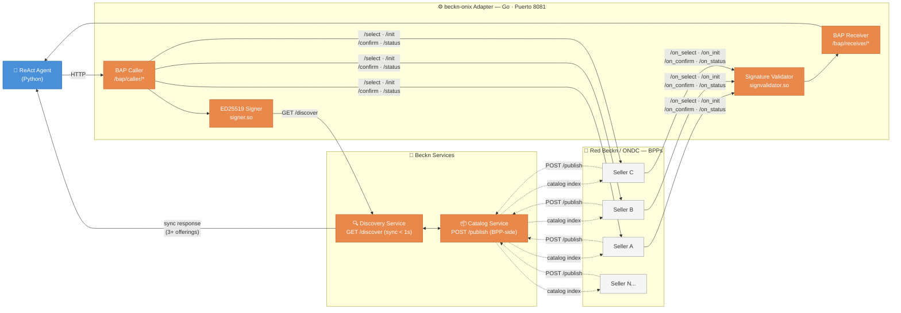
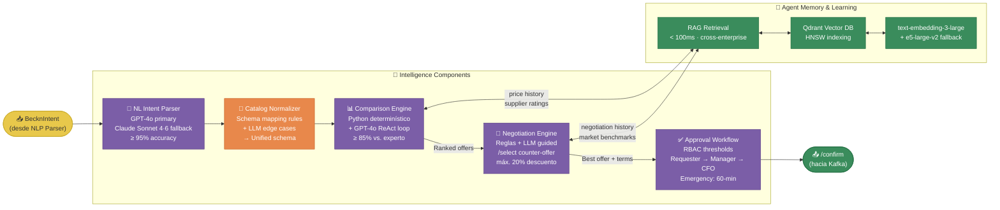
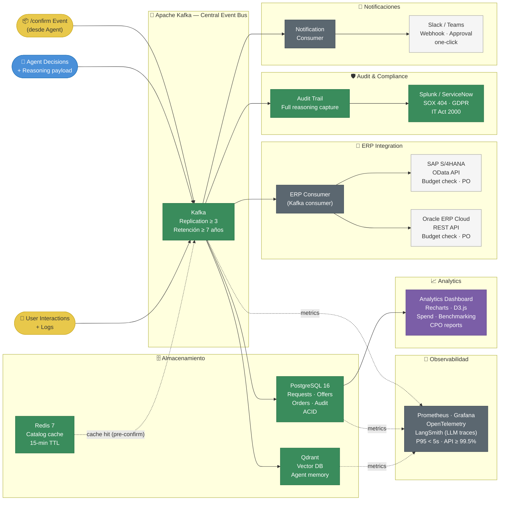

# System Architecture — General Diagram

> [!architecture] Overview
> Diagrama general del sistema completo: desde la entrada del usuario hasta la red Beckn/ONDC, pipeline de datos y todas las integraciones enterprise.

---

## Full System Diagram![[Captura de pantalla 2026-04-14 a la(s) 4.16.56 p.m..png]]

**Code:**

```mermaid
flowchart TD

    %% ─────────────────────────────────────────────
    %% ENTRADA DE USUARIO
    %% ─────────────────────────────────────────────
    USER(["👤 Usuario\nPriya · Rajesh · Anita · Vikram"])
    SLACK_IN["💬 Slack / Teams\nConversational interface"]
    UI["🖥️ Frontend\nReact 18 · Next.js 14\nTypeScript · Tailwind · ShadCN"]

    USER --> SLACK_IN & UI

    %% ─────────────────────────────────────────────
    %% API GATEWAY + AUTH
    %% ─────────────────────────────────────────────
    SLACK_IN --> GW
    UI --> GW

    GW["🔐 API Gateway — Kong\nRBAC · Rate Limiting · TLS 1.3"]
    KC["🔑 Keycloak SSO\nSAML 2.0 · OIDC\nOkta · Azure AD"]

    GW <-->|auth & token| KC

    %% ─────────────────────────────────────────────
    %% AGENT LAYER
    %% ─────────────────────────────────────────────
    GW --> AGENT

    subgraph AGENT_LAYER["⚙️  Agent Layer — LangChain + LangGraph  (Python)"]
        AGENT["🤖 ReAct Orchestrator\nReason → Act → Observe\nLangGraph stateful directed graph"]
    end

    %% ─────────────────────────────────────────────
    %% COMPONENTES DE INTELIGENCIA
    %% ─────────────────────────────────────────────
    AGENT --> NLP

    subgraph AI_COMPONENTS["🧠  Componentes de Inteligencia Artificial"]
        NLP["📝 NL Intent Parser\nGPT-4o → BecknIntent JSON\nFallback: Claude Sonnet 4·6\n≥ 95% accuracy"]
        SCORE["📊 Comparison & Scoring Engine\nPython determinístico + GPT-4o ReAct\n≥ 85% acuerdo vs. experto humano"]
        NEG["🤝 Negotiation Engine\nReglas + LLM guiado\nBeckn /select flow · máx. 20% descuento"]
        MEM["🧠 Agent Memory & Learning\nQdrant Vector DB · HNSW\ntext-embedding-3-large\n< 100ms RAG retrieval"]
        APPR["✅ Approval Workflow\nRBAC thresholds\nRequester → Manager → CFO\nEmergency: 60-min auto-approve"]
    end

    NLP -->|BecknIntent| BAP
    BAP -->|Normalized offers| SCORE
    SCORE -->|Ranked recommendation| NEG
    NEG -->|Best offer + terms| APPR
    SCORE <-->|Historical prices & supplier data| MEM
    NEG <-->|Negotiation history| MEM

    %% ─────────────────────────────────────────────
    %% BECKN PROTOCOL LAYER
    %% ─────────────────────────────────────────────
    subgraph BECKN_LAYER["🔗  Beckn Protocol Layer  (Beckn v2)"]
        BAP["🌐 Beckn BAP Client\nPython HTTP client → ONIX adapter"]
        ONIX["⚙️ beckn-onix Adapter  (Go)\nPuerto 8081\nED25519 signing · Schema validation\n/bap/caller/* endpoints"]
        DS["🔍 Discovery Service\nGET /discover → respuesta sincrónica\n< 1s · sin callbacks async"]
        CS["📦 Catalog Service\nIndexa ofertas de BPPs\nActualizado via POST /publish"]
    end

    BAP --> ONIX
    ONIX <-->|GET /discover| DS
    DS <--> CS

    %% ─────────────────────────────────────────────
    %% RED BECKN / ONDC — VENDEDORES (BPPs)
    %% ─────────────────────────────────────────────
    subgraph SELLERS["🏪  Red Beckn / ONDC — BPPs  (Vendedores)"]
        BPP1["Seller A\n/bpp/receiver"]
        BPP2["Seller B\n/bpp/receiver"]
        BPP3["Seller C\n/bpp/receiver"]
        BPPN["Seller N ...\n/bpp/receiver"]
    end

    CS -->|catalog query| BPP1 & BPP2 & BPP3 & BPPN
    BPP1 & BPP2 & BPP3 & BPPN -->|POST /publish| CS

    ONIX -->|/select · /init · /confirm · /status| BPP1 & BPP2 & BPP3
    BPP1 & BPP2 & BPP3 -->|/on_select · /on_init · /on_confirm · /on_status| ONIX

    %% ─────────────────────────────────────────────
    %% CATALOG NORMALIZATION
    %% ─────────────────────────────────────────────
    DS -->|"Respuestas diversas (JSON)"| NORM

    subgraph NORM_LAYER["🔄  Catalog Normalization Layer"]
        NORM["Normalizer\nSchema mapping rules  (determinístico)\n+ LLM para formatos desconocidos\n→ Unified schema  (5+ formatos)"]
    end

    NORM --> SCORE

    %% ─────────────────────────────────────────────
    %% KAFKA — EVENT BUS CENTRAL
    %% ─────────────────────────────────────────────
    APPR -->|"/confirm event"| KAFKA

    subgraph DATA_PIPELINE["📡  Data Pipeline — Apache Kafka  (Central Event Bus)"]
        KAFKA["Apache Kafka\nReplication factor ≥ 3 · Retención ≥ 7 años\nDesacopla todos los consumers downstream"]
    end

    AGENT -->|"Agent decisions + reasoning"| KAFKA
    UI -->|"User interaction logs"| KAFKA

    %% ─────────────────────────────────────────────
    %% ALMACENAMIENTO
    %% ─────────────────────────────────────────────
    subgraph STORAGE["🗄️  Almacenamiento"]
        PG["PostgreSQL 16\nRequests · Offers · Orders\nAudit trail · ACID"]
        REDIS["Redis 7\nCache catálogos Beckn\n15-min TTL"]
        QDRANT["Qdrant\nVector DB · self-hosted\nMemoria agente\nHistorial procurement"]
    end

    KAFKA --> PG
    KAFKA --> QDRANT
    DS -->|catalog responses| REDIS
    REDIS -->|cache hit  < 1s| SCORE

    %% ─────────────────────────────────────────────
    %% AUDIT TRAIL & COMPLIANCE
    %% ─────────────────────────────────────────────
    subgraph COMPLIANCE["🛡️  Audit Trail & Compliance"]
        AUDIT["Audit Trail System\nEvery decision + full reasoning\nKafka → PostgreSQL + SIEM"]
        SPLUNK["Splunk / ServiceNow\nSIEM sink\nSOX 404 · GDPR · IT Act 2000"]
    end

    KAFKA --> AUDIT
    AUDIT --> SPLUNK

    %% ─────────────────────────────────────────────
    %% ERP INTEGRATION
    %% ─────────────────────────────────────────────
    subgraph ERP_LAYER["🏢  ERP Integration"]
        ERP_SYNC["ERP Sync Consumer\nKafka consumer\nReal-time budget check pre-confirm\nPO creation post-confirm"]
        SAP["SAP S/4HANA\nOData API"]
        ORACLE["Oracle ERP Cloud\nREST API"]
    end

    KAFKA --> ERP_SYNC
    ERP_SYNC <--> SAP & ORACLE

    %% ─────────────────────────────────────────────
    %% NOTIFICACIONES
    %% ─────────────────────────────────────────────
    subgraph NOTIF_LAYER["📣  Notificaciones"]
        NOTIF["Notification Service\nKafka consumer"]
        SLACK_OUT["Slack / Teams\nWebhook · Approval one-click\nOrder confirmation"]
    end

    KAFKA --> NOTIF
    NOTIF --> SLACK_OUT

    %% ─────────────────────────────────────────────
    %% REAL-TIME TRACKING
    %% ─────────────────────────────────────────────
    subgraph TRACKING_LAYER["📍  Real-Time Tracking"]
        TRACK["Real-Time Tracking\n/status polling  (30s SLA)\nWebSocket push → UI"]
    end

    ONIX -->|/on_status callbacks| TRACK
    TRACK -->|WebSocket| UI

    %% ─────────────────────────────────────────────
    %% ANALYTICS DASHBOARD
    %% ─────────────────────────────────────────────
    subgraph ANALYTICS_LAYER["📈  Analytics Dashboard"]
        DASH["Analytics Dashboard\nRecharts · D3.js\nSpend analysis · Benchmarking\nCPO reports"]
    end

    PG --> DASH
    DASH --> UI

    %% ─────────────────────────────────────────────
    %% OBSERVABILIDAD
    %% ─────────────────────────────────────────────
    subgraph OBS_LAYER["🔭  Observabilidad"]
        OBS["Prometheus · Grafana\nOpenTelemetry · LangSmith\nBeckn API ≥ 99.5%\nP95 latency < 5s"]
    end

    AGENT_LAYER -.->|metrics & traces| OBS
    BECKN_LAYER -.->|beckn_api_success_rate| OBS
    DATA_PIPELINE -.->|pipeline health| OBS

    %% ─────────────────────────────────────────────
    %% ESTILOS
    %% ─────────────────────────────────────────────
    classDef userStyle   fill:#E8C84B,stroke:#C8A820,color:#333,font-weight:bold
    classDef agentStyle  fill:#4A90D9,stroke:#2171B5,color:#fff,font-weight:bold
    classDef aiStyle     fill:#7B5EA7,stroke:#5A3F86,color:#fff
    classDef becknStyle  fill:#E8884B,stroke:#C86427,color:#fff
    classDef dataStyle   fill:#3A8C5C,stroke:#1E6B3F,color:#fff
    classDef infraStyle  fill:#5B6770,stroke:#3A4550,color:#fff

    class USER,SLACK_IN,UI userStyle
    class AGENT agentStyle
    class NLP,SCORE,NEG,MEM,APPR aiStyle
    class BAP,ONIX,DS,CS,NORM becknStyle
    class KAFKA,PG,REDIS,QDRANT,AUDIT,SPLUNK dataStyle
    class GW,KC,OBS infraStyle
```



---

## Diagrama 1 — Visión General End-to-End

> Flujo principal de alto nivel: desde el usuario hasta la confirmación de la orden.

```mermaid
flowchart LR
    U(["👤 Usuario"])
    FE["🖥️ Frontend\nReact · Next.js"]
    SL["💬 Slack/Teams"]
    GW["🔐 Kong Gateway\n+ Keycloak SSO"]
    AG["🤖 ReAct Agent\nLangChain · LangGraph"]
    NLP["📝 NL Parser\nGPT-4o"]
    BAP["🌐 BAP Client\n+ ONIX Adapter"]
    DS["🔍 Discovery\nService"]
    NRM["🔄 Normalizer"]
    SCR["📊 Scoring\nEngine"]
    NEG["🤝 Negotiation\nEngine"]
    APR["✅ Approval\nWorkflow"]
    CNF["📦 /confirm\nOrder"]
    KFK["📡 Kafka\nEvent Bus"]

    U --> FE & SL
    FE & SL --> GW
    GW --> AG
    AG --> NLP
    NLP -->|BecknIntent| BAP
    BAP -->|GET /discover| DS
    DS --> NRM
    NRM --> SCR
    SCR --> NEG
    NEG --> APR
    APR --> CNF
    CNF --> KFK

    style U    fill:#E8C84B,stroke:#C8A820,color:#333
    style FE   fill:#E8C84B,stroke:#C8A820,color:#333
    style SL   fill:#E8C84B,stroke:#C8A820,color:#333
    style GW   fill:#5B6770,stroke:#3A4550,color:#fff
    style AG   fill:#4A90D9,stroke:#2171B5,color:#fff
    style NLP  fill:#7B5EA7,stroke:#5A3F86,color:#fff
    style BAP  fill:#E8884B,stroke:#C86427,color:#fff
    style DS   fill:#E8884B,stroke:#C86427,color:#fff
    style NRM  fill:#E8884B,stroke:#C86427,color:#fff
    style SCR  fill:#7B5EA7,stroke:#5A3F86,color:#fff
    style NEG  fill:#7B5EA7,stroke:#5A3F86,color:#fff
    style APR  fill:#7B5EA7,stroke:#5A3F86,color:#fff
    style CNF  fill:#3A8C5C,stroke:#1E6B3F,color:#fff
    style KFK  fill:#3A8C5C,stroke:#1E6B3F,color:#fff
```



---

## Diagrama 2 — Beckn Protocol Layer

> Detalle del protocolo Beckn v2: cómo el agente se comunica con los vendedores via beckn-onix.



---

## Diagrama 3 — AI & Agent Intelligence Layer

> Componentes de inteligencia: cómo el agente razona, compara, negocia y aprende.



---

## Diagrama 4 — Data Pipeline & Enterprise Integrations

> Qué sucede después del `/confirm`: event bus, storage, ERP, compliance y notificaciones.



---

## Explicación Detallada por Módulo

---

### Full System Diagram — Las 19 Capas

El sistema completo tiene 19 capas. Aquí está el propósito exacto de cada una, en el orden en que participan durante una solicitud de compra.

---

#### 1. Usuario

El punto de partida. Puede ser Priya (compras rutinarias), Rajesh (equipos IT), Anita (emergencias) o Vikram (análisis estratégico). No necesita saber nada del protocolo Beckn — solo escribe lo que necesita en lenguaje natural.

---

#### 2. Frontend / Slack-Teams

Dos canales de entrada al sistema:

- **Frontend** (React + Next.js): panel web donde el usuario llena un formulario o escribe texto libre.
- **Slack / Teams**: interfaz conversacional. El usuario escribe directamente en su canal de trabajo sin abrir ningún portal.

Ambos canales entregan la solicitud al mismo destino: el API Gateway.

---

#### 3. Kong Gateway + Keycloak SSO

Primera línea de defensa. Dos responsabilidades separadas:

- **Kong**: valida que la petición tenga token válido, aplica rate limiting y termina TLS 1.3. Ninguna petición llega al agente sin pasar por aquí.
- **Keycloak**: gestiona identidad (quién eres) y autorización (qué puedes hacer). Si eres un `Requester`, no puedes ejecutar `/confirm` directamente — Kong lo bloquea en el borde de red.

---

#### 4. ReAct Agent (LangChain + LangGraph)

El cerebro del sistema. Ejecuta un loop continuo de tres pasos para cada solicitud:

- **Reason** — analiza el estado actual y decide qué hacer a continuación
- **Act** — ejecuta una acción concreta (llamar al NLP, al BAP client, al scoring engine)
- **Observe** — procesa el resultado y decide el siguiente paso

LangGraph mantiene el estado del workflow como un grafo dirigido, lo que permite condicionales complejos: ¿requiere aprobación humana? ¿hay presupuesto disponible en ERP? ¿el seller aceptó la contra-oferta?

---

#### 5. NL Intent Parser

Convierte el texto libre del usuario en un JSON estructurado (`BecknIntent`) que el protocolo Beckn puede procesar. Sin este módulo, el agente no puede hablar con los vendedores.

Ejemplo de transformación:
```
"Necesito 500 resmas de papel A4 para Bangalore en 3 días"
→ { item: "A4 paper", qty: 500, location: "12.9716,77.5946", deadline_days: 3 }
```

Usa GPT-4o con schema-constrained decoding (el modelo está forzado a producir JSON válido). Si GPT-4o falla 3 veces seguidas, cae automáticamente a Claude Sonnet 4.6.

---

#### 6. BAP Client — GET /discover

El agente envía la consulta al protocolo Beckn para buscar proveedores disponibles. La respuesta llega de forma **sincrónica** en menos de 1 segundo con los catálogos de todos los sellers registrados. No hay callbacks ni websockets para este paso.

---

#### 7. Catalog Normalizer

Los sellers devuelven JSON en formatos completamente distintos. El Normalizer tiene dos capas:

1. **Reglas determinísticas**: mapeos predefinidos para formatos de sellers conocidos
2. **LLM para edge cases**: cuando aparece un formato desconocido, el LLM infiere el mapeo

El resultado siempre es un esquema unificado que el Scoring Engine puede procesar de forma consistente.

---

#### 8. Comparison & Scoring Engine

Evalúa todas las ofertas en paralelo usando un enfoque híbrido:

1. **Python determinístico**: precio (con descuentos por volumen y TCO), tiempo de entrega y métricas cuantificables
2. **GPT-4o en loop ReAct**: criterios cualitativos como cumplimiento de certificaciones y genera la explicación en lenguaje natural para cada posición del ranking

Cada recomendación incluye texto como:
> *"Seller C recomendado pese a 4% más caro. Garantía de 5 años vs. 3 años + descuento por volumen produce 8% menor TCO total."*

---

#### 9. Negotiation Engine

No acepta el mejor precio disponible sin intentar mejorarlo. Envía contra-ofertas a los top sellers via Beckn `/select`. Las estrategias son configurables por categoría:

| Situación | Acción |
|---|---|
| Suministros básicos | Negociación agresiva automática |
| Precio dentro del margen N% | Acepta sin contraoferta |
| Equipos especializados | Modo advisory — el humano decide |
| Brecha demasiado grande | Escala a procurement manager |

El límite máximo de descuento está fijado en **20%** por política — el agente no puede ir más allá.

---

#### 10. Approval Workflow

Verifica si el monto total supera el umbral de autorización del solicitante antes de confirmar la orden:

| Monto | Acción |
|---|---|
| ≤ umbral del solicitante | Procede directo a `/confirm` |
| > umbral, ≤ autoridad del manager | Notifica manager con botón approve/reject en Slack |
| > autoridad del manager | Escala a CFO |
| Modo emergencia (`URGENT:`) | CFO recibe cuenta regresiva de 60 minutos; si no responde se auto-aprueba con auditoría completa |

---

#### 11. /confirm Order

Una vez aprobado (o si no requería aprobación), el agente ejecuta la confirmación de la orden en el protocolo Beckn. Este evento es el que dispara todo el pipeline downstream.

---

#### 12. Apache Kafka (Event Bus)

El `/confirm` publica un evento en Kafka que activa en paralelo: sincronización con ERP, registro en audit trail y notificación al usuario — todo al mismo tiempo y sin bloquear al agente ni añadir latencia al usuario.

---

#### 13. PostgreSQL 16

Base de datos transaccional principal. Almacena el estado de cada solicitud, oferta, orden y evento de auditoría. Es la fuente de verdad del sistema y la fuente del Analytics Dashboard.

---

#### 14. Redis 7

Cache de catálogos Beckn con TTL de 15 minutos. Cuando el agente hace un `/discover`, primero consulta Redis. Si hay una respuesta reciente del mismo tipo de ítem, la usa directamente y evita una llamada a la red Beckn. Objetivo Fase 4: reducir llamadas redundantes ≥ 50%.

---

#### 15. Qdrant (Vector DB — Memoria del Agente)

Recibe las interacciones del usuario y las decisiones del agente via Kafka para actualizar la memoria de aprendizaje. Cada override del usuario (cuando rechaza la recomendación del agente) retroalimenta el calibrado del Scoring Engine con el tiempo.

---

#### 16. ERP Sync Consumer (SAP S/4HANA + Oracle ERP Cloud)

Kafka consumer que escucha eventos `/confirm` y realiza dos operaciones críticas:

1. **Pre-confirm**: consulta SAP/Oracle para verificar disponibilidad de presupuesto en tiempo real — si no hay presupuesto, la orden se bloquea aunque ya tenga aprobación del CFO
2. **Post-confirm**: crea automáticamente el Purchase Order en el ERP, eliminando la doble digitación manual

---

#### 17. Audit Trail → Splunk / ServiceNow

Kafka consumer que captura **cada decisión del agente con su razonamiento completo** — no solo el resultado, sino por qué se tomó esa decisión. Cubre tres marcos regulatorios:

| Framework | Cobertura |
|---|---|
| SOX 404 | Rastro completo en tiempo real, sin reconstrucción post-hoc |
| GDPR | Registros de procesamiento de datos con retención configurable |
| IT Act 2000 (India) | Datos permanecen en nubes de región India |

Impacto práctico: elimina ~2 semanas de preparación manual de documentación por ciclo de auditoría.

---

#### 18. Notification Consumer → Slack / Teams

Kafka consumer que envía al usuario el resultado de cada evento relevante: orden confirmada, aprobación requerida, actualización de entrega y alertas de excepción. Los mensajes de aprobación incluyen botones one-click directamente en Slack para que el manager apruebe sin abrir ningún panel.

---

#### 19. Observabilidad (Prometheus + Grafana + LangSmith)

Monitoreo transversal a todo el sistema:

- **Prometheus / Grafana**: métricas de infraestructura — `beckn_api_success_rate` ≥ 99.5%, P95 latency < 5s
- **OpenTelemetry**: trazas distribuidas a través de todos los microservicios
- **LangSmith**: trazas específicas de llamadas LLM — costo, latencia, tasa de fallback a Claude Sonnet 4.6, calidad del parsing

---

---

## Diagrama 1 — Visión General End-to-End

> Flujo completo de alto nivel: desde que el usuario escribe hasta que la orden queda confirmada en Kafka.

### Paso a paso

**Paso 1 — Usuario escribe**
El usuario escribe su solicitud en lenguaje natural, ya sea en el **Frontend** (panel web React/Next.js) o directamente en **Slack/Teams** sin abrir ningún portal externo.

**Paso 2 — Kong Gateway intercepta**
Toda solicitud pasa primero por Kong, que valida el token de sesión contra **Keycloak SSO** (SAML 2.0 / OIDC). Si el token es válido y el rol tiene permiso para la operación solicitada, la petición avanza. Si no, se rechaza en el borde.

**Paso 3 — ReAct Agent toma control**
LangGraph recibe la solicitud y arranca el loop ReAct. El grafo de estados determina qué componente invocar primero (siempre el NL Parser) y qué hacer con cada resultado.

**Paso 4 — NL Parser produce el BecknIntent**
GPT-4o transforma el texto libre en un JSON con todos los campos necesarios para construir la consulta Beckn: ítem, cantidad, coordenadas GPS, plazo y presupuesto.

**Paso 5 — BAP Client lanza GET /discover**
El agente envía la consulta al Discovery Service via el adapter ONIX. En menos de 1 segundo recibe de forma sincrónica las ofertas de todos los sellers que tienen ese producto en su catálogo.

**Paso 6 — Normalizer unifica formatos**
Las respuestas de los sellers llegan en formatos JSON heterogéneos. El Normalizer las convierte todas al mismo esquema antes de pasarlas al Scoring Engine.

**Paso 7 — Scoring Engine rankea**
Evalúa precio, entrega, calidad y cumplimiento de forma híbrida (Python + GPT-4o ReAct) y produce un ranking explicado de todos los sellers.

**Paso 8 — Negotiation Engine negocia**
Envía contra-ofertas a los top sellers via `/select`. Si alguno acepta, el precio final es mejor que el de lista.

**Paso 9 — Approval Workflow decide**
Compara el monto total con los umbrales de autorización RBAC. Procede solo si está dentro del umbral; si no, notifica al aprobador correspondiente.

**Paso 10 — /confirm y Kafka**
La orden se confirma en el protocolo Beckn y un evento se publica en Kafka, disparando en paralelo ERP sync, audit trail y notificación al usuario.

---

## Diagrama 2 — Beckn Protocol Layer

> Detalle de cómo el agente Python se comunica con la red de vendedores usando el protocolo Beckn v2 y el adapter beckn-onix.

### Módulos

**beckn-onix Adapter (Go, Puerto 8081)**
Es el puente entre el agente Python y el protocolo Beckn. El agente nunca habla directamente con los sellers — siempre pasa por aquí. Tiene cuatro sub-partes:

- **BAP Caller** (`/bap/caller/*`): recibe instrucciones del agente Python y las envía hacia la red Beckn
- **BAP Receiver** (`/bap/receiver/*`): recibe las respuestas asíncronas de los sellers y las devuelve al agente
- **ED25519 Signer** (`signer.so`): firma criptográficamente cada mensaje saliente — requisito del protocolo Beckn para garantizar que nadie puede suplantar al BAP
- **Signature Validator** (`signvalidator.so`): verifica la firma de cada mensaje entrante — rechaza respuestas de fuentes no autorizadas

**Discovery Service — GET /discover**
Punto de entrada para buscar proveedores. Característica clave: es **completamente sincrónico**. El agente hace `GET /discover` y recibe la respuesta en la misma llamada HTTP en menos de 1 segundo. No hay callbacks, no hay websockets para este paso.

**Catalog Service — POST /publish**
Los vendedores registran su catálogo aquí de forma proactiva cada vez que cambian precios o inventario. El agente no inicia esto — lo hacen los BPPs de forma independiente. El Discovery Service consulta este catálogo indexado para responder a cada `/discover`.

**BPPs (Sellers A, B, C, N...)**
Los proveedores registrados en la red Beckn/ONDC. Cada uno expone endpoints `/bpp/receiver/*`. El flujo de interacción con cada seller es:

| Acción | Dirección | Propósito |
|---|---|---|
| `POST /publish` | BPP → Catalog Service | Seller registra/actualiza su catálogo |
| `GET /discover` | Agent → Discovery Service | Agent busca sellers disponibles |
| `POST /select` | Agent → BPP | Señalar interés + enviar contra-oferta |
| `POST /on_select` | BPP → Agent | Seller acepta/rechaza la contra-oferta |
| `POST /init` | Agent → BPP | Inicializar la orden |
| `POST /confirm` | Agent → BPP | Confirmar la compra |
| `POST /status` | Agent → BPP | Consultar estado de entrega |

---

## Diagrama 3 — AI & Agent Intelligence Layer

> Cómo el agente interpreta la solicitud, compara ofertas, negocia y aprende de cada transacción.

### Módulos

**NL Intent Parser**
Primer componente que ejecuta el agente para cada solicitud nueva. Usa **schema-constrained decoding** — el LLM está forzado a producir JSON válido que cumpla exactamente el esquema `BecknIntent`. Esto elimina el riesgo de JSON malformado que rompería el BAP Client downstream.

Campos que extrae de cada solicitud:

| Campo | Ejemplo |
|---|---|
| Ítem y especificaciones | `"A4 paper, 80gsm"` |
| Cantidad y unidad | `500 reams` |
| Coordenadas GPS | `"12.9716,77.5946"` (Bangalore) |
| Plazo de entrega | `3 days` |
| Presupuesto | `₹2/sheet` |
| Flag de urgencia | `URGENT:` → activa modo emergencia |
| Requisitos de cumplimiento | `ISO 27001 required` |

**Catalog Normalizer**
Los sellers devuelven JSON en formatos completamente distintos entre sí. El Normalizer tiene dos capas que actúan en orden:

1. **Reglas determinísticas**: mapeos predefinidos para los formatos de sellers conocidos y registrados
2. **LLM para edge cases**: cuando aparece un formato desconocido (nuevo seller, formato propietario), el LLM infiere el mapeo sin necesitar actualización de código

**Comparison & Scoring Engine**
Evalúa todas las ofertas en paralelo usando dos motores complementarios:

1. **Python determinístico**: calcula precio con descuentos por volumen, TCO (Total Cost of Ownership) sobre el período del contrato, tiempo de entrega y métricas de fiabilidad histórica
2. **GPT-4o en loop ReAct**: evalúa si una certificación ISO realmente cumple la política interna, genera el texto de explicación en lenguaje natural para cada recomendación y razona sobre criterios que no son cuantificables directamente

Si la tasa de override del usuario supera el 30% (el humano rechaza la recomendación del agente más de 1 de cada 3 veces), se dispara automáticamente una revisión de calibrado de los pesos de scoring.

**Negotiation Engine**
Después del ranking, el agente no acepta el mejor precio de lista sin intentar mejorarlo. Las estrategias son configurables por categoría de producto por el administrador de la empresa:

- **Commodity items** (papel, suministros de oficina): negociación agresiva automática con contra-oferta de 5%
- **Precio dentro del margen N%** del presupuesto: acepta sin contraoferta para no arriesgar el trato
- **Equipos especializados** (laptops enterprise, equipos médicos): modo advisory — el agente recomienda pero el humano decide
- **Brecha demasiado grande**: escala a procurement manager con contexto completo

Límite hard-coded: el agente **nunca puede solicitar más del 20% de descuento** por política de empresa.

**Approval Workflow**
Después de la negociación, el agente verifica si puede proceder solo o necesita autorización humana consultando los umbrales RBAC configurados en Keycloak. El control es no-bypassable: el API Gateway bloquea en el borde de red cualquier intento de un `Requester` de ejecutar `/confirm` directamente sin que exista un evento de aprobación registrado en el audit trail.

**Agent Memory & Learning (Qdrant + RAG)**
La memoria del agente está organizada en tres capas tecnológicas:

- **Qdrant Vector DB**: almacena embeddings de todas las transacciones pasadas, indexados con HNSW (Hierarchical Navigable Small World) para búsqueda de similitud en < 100ms incluso con millones de registros
- **text-embedding-3-large**: convierte cada transacción en un vector de alta dimensión para búsqueda semántica (no por palabras clave, sino por significado)
- **RAG Retrieval**: cuando llega una nueva solicitud, el agente recupera las transacciones más similares del pasado y las inyecta como contexto adicional al Scoring Engine

Lo que se almacena en la memoria:

| Tipo de dato | Uso |
|---|---|
| Transacciones pasadas (ítem, precio, seller, entrega) | Contexto histórico para scoring |
| Resultados de negociaciones (tasas de aceptación) | Calibrar agresividad de contra-ofertas |
| Tendencias estacionales de precios | Detectar si el precio actual es bueno o caro para la época |
| Fiabilidad de proveedores (entregas a tiempo) | Penalizar sellers con historial pobre |
| Overrides del usuario (cuándo el humano rechazó la recomendación) | Detectar desalineamiento del scoring |

El aprendizaje es **cross-enterprise**: mejora no solo para un usuario individual sino para toda la organización a medida que el sistema procesa más transacciones.

---

## Diagrama 4 — Data Pipeline & Enterprise Integrations

> Qué sucede después del `/confirm`: todos los sistemas que reaccionan al evento de forma asíncrona y en paralelo.

### Módulos

**Apache Kafka (Central Event Bus)**
El eje de todo el pipeline downstream. En lugar de que el agente llame directamente a ERP, audit y notificaciones en secuencia (lo que añadiría latencia lineal), publica un único evento en Kafka y cada consumer lo procesa de forma independiente y a su propio ritmo.

Tres tipos de eventos que entran a Kafka:
- **`/confirm` event**: dispara ERP sync, audit trail y notificación al usuario
- **Agent decisions + reasoning**: captura cada decisión intermedia con su razonamiento para el audit trail
- **User interaction logs**: captura las selecciones y overrides del usuario para el aprendizaje del agente

**PostgreSQL 16**
Base de datos transaccional principal. Almacena el estado completo de cada solicitud, oferta, orden y evento de auditoría en tablas ACID. Es la fuente de verdad operacional y la fuente de datos del Analytics Dashboard.

**Redis 7**
Cache de catálogos Beckn con TTL de 15 minutos. Cuando el agente hace un `/discover`, primero consulta Redis. Si hay una respuesta reciente del mismo tipo de ítem y ubicación, la usa directamente y evita una llamada a la red Beckn. Objetivo Fase 4: reducir llamadas redundantes en ≥ 50%.

**Qdrant (Agent Memory)**
Recibe los logs de interacciones del usuario y las decisiones del agente via Kafka para actualizar la memoria de aprendizaje de forma continua. Cada override retroalimenta el calibrado del Scoring Engine a lo largo del tiempo.

**ERP Sync Consumer**
Kafka consumer dedicado que escucha eventos `/confirm` y realiza dos operaciones en el ERP:

1. **Pre-confirm (budget check)**: antes de que el agente ejecute `/confirm`, consulta SAP S/4HANA u Oracle ERP Cloud para verificar disponibilidad de presupuesto en tiempo real. Si no hay presupuesto suficiente, la orden se bloquea aunque ya tenga aprobación del CFO — el control financiero es la última barrera.
2. **Post-confirm (PO creation)**: tras el `/confirm`, crea automáticamente el Purchase Order en el ERP, sincroniza el consumo de presupuesto y recibe de vuelta las confirmaciones de recepción de mercancía e invoice matching.

**Audit Trail → Splunk / ServiceNow**
Kafka consumer que captura **cada decisión del agente con su payload de razonamiento completo** — no solo el resultado final, sino el proceso de decisión paso a paso. El flujo es:

```
Decisión del agente
    → Kafka topic (structured event)
    → PostgreSQL (audit log transaccional)
    → Splunk / ServiceNow (SIEM para compliance)
    → LangSmith (traza LLM específica)
```

La diferencia arquitectónica clave respecto a los sistemas tradicionales: el razonamiento se captura **en tiempo real durante la decisión**, no se reconstruye después bajo presión de auditoría.

**Notification Consumer → Slack / Teams**
Kafka consumer que envía notificaciones al usuario para cada evento relevante. Los mensajes de aprobación incluyen botones one-click directamente en Slack para que el manager apruebe sin necesidad de abrir ningún panel externo.

**Real-Time Tracking (WebSocket)**
Monitorea el estado de entrega de cada orden confirmada combinando dos fuentes de datos:

- **`/status` polling**: el agente consulta periódicamente al seller via Beckn `/status`
- **Seller webhooks**: el seller empuja actualizaciones de estado directamente al sistema sin necesidad de polling

El resultado se entrega al frontend via WebSocket dentro de los 30 segundos siguientes a cualquier cambio de estado, sin que el usuario tenga que refrescar la página.

**Analytics Dashboard (Recharts + D3.js)**
Lee de PostgreSQL para mostrar métricas operativas y estratégicas:

| Métrica | Audiencia |
|---|---|
| Ahorro acumulado por negociación | CPO, equipo de procurement |
| Tiempo promedio de ciclo por categoría | Procurement manager |
| Benchmarking de precios vs. mercado | CPO, dirección |
| Tasa de override de recomendaciones del agente | Equipo técnico, modelo governance |
| Gasto por proveedor y categoría | CFO, dirección financiera |

Si la tasa de override supera el 30%, el dashboard marca automáticamente una alerta de calibrado del Scoring Engine.

**Prometheus + Grafana + OpenTelemetry + LangSmith**
Observabilidad transversal a todo el sistema con tres focos distintos:

- **Prometheus / Grafana**: métricas de infraestructura en tiempo real — `beckn_api_success_rate` ≥ 99.5%, P95 latency < 5s, disponibilidad de Kafka y bases de datos
- **OpenTelemetry**: trazas distribuidas que conectan una solicitud del usuario a través de todos los microservicios que participan en su procesamiento
- **LangSmith**: trazas específicas de las llamadas LLM — costo por token por llamada, latencia de GPT-4o vs. Claude Sonnet 4.6, frecuencia de fallback, calidad del parsing por categoría de producto

---

## Leyenda de Colores

| Color       | Capa                                                               |
| ----------- | ------------------------------------------------------------------ |
| 🟡 Amarillo | Entrada de usuario (Frontend · Slack)                              |
| 🔵 Azul     | Agent Orchestrator (LangGraph)                                     |
| 🟣 Morado   | Componentes de IA (NLP · Scoring · Negotiation · Approval)         |
| 🟠 Naranja  | Capa Beckn (BAP Client · ONIX · Discovery · Normalization)         |
| 🟢 Verde    | Datos (Kafka · PostgreSQL · Redis · Qdrant · Audit · Splunk)       |
| ⬛ Gris      | Infraestructura (Kong · Keycloak · ERP consumers · Observabilidad) |
| ⬜ Blanco    | Sistemas externos (SAP · Oracle · Slack · BPPs)                    |

---

## Capas del Sistema

| # | Capa | Tecnología | Rol |
|---|---|---|---|
| 1 | **Entrada** | React 18 · Next.js 14 · Slack/Teams | Interfaz del usuario: dashboard y conversacional |
| 2 | **API Gateway** | Kong · Keycloak · TLS 1.3 | Auth RBAC, rate limiting, terminación TLS |
| 3 | **Agent Orchestrator** | LangChain · LangGraph · Python | Loop ReAct — coordina todos los componentes |
| 4 | **NL Intent Parser** | GPT-4o · Claude Sonnet 4.6 fallback | Texto libre → `BecknIntent` JSON (≥ 95% accuracy) |
| 5 | **Beckn Protocol** | beckn-onix (Go) · Puerto 8081 | Puente al protocolo Beckn v2 con firma ED25519 |
| 6 | **Discovery** | Discovery Service · Catalog Service | `GET /discover` sincrónico → catálogos de sellers |
| 7 | **Normalization** | Python · LLM edge cases | Unifica formatos diversos de BPPs |
| 8 | **Comparison Engine** | Python + GPT-4o ReAct | Scoring multi-criterio + explicabilidad (≥ 85%) |
| 9 | **Negotiation Engine** | Reglas + LLM + `/select` | Negocia precio/términos (máx. 20% descuento) |
| 10 | **Approval Workflow** | Keycloak RBAC | Routing por umbral de gasto hasta CFO |
| 11 | **Agent Memory** | Qdrant · HNSW · text-embedding-3-large | RAG < 100ms — historial y aprendizaje cross-enterprise |
| 12 | **Event Bus** | Apache Kafka | Desacopla todos los consumers downstream |
| 13 | **Almacenamiento** | PostgreSQL 16 · Redis 7 · Qdrant | ACID transaccional · caché 15-min · vector DB |
| 14 | **ERP Integration** | SAP OData · Oracle REST | Budget check pre-confirm · PO creation post-confirm |
| 15 | **Audit & Compliance** | Kafka → Splunk · ServiceNow | SOX 404 · GDPR · IT Act 2000 — full reasoning trail |
| 16 | **Notificaciones** | Slack/Teams webhooks | Confirmaciones · approval one-click |
| 17 | **Real-Time Tracking** | WebSocket · `/status` polling 30s | Estado de órdenes en vivo en el dashboard |
| 18 | **Analytics** | Recharts · D3.js | Spend analysis · benchmarking · reportes CPO |
| 19 | **Observabilidad** | Prometheus · Grafana · OpenTelemetry · LangSmith | SLAs · trazas LLM · alerting |

---

## Flujo Principal (Story 1 — Suministros Rutinarios)

```
Usuario escribe → [NL Intent Parser] → BecknIntent JSON
                                              ↓
                              [BAP Client] GET /discover
                                              ↓
                         Discovery Service → Catalog Service
                                              ↓
                              BPPs registran via POST /publish
                         3+ respuestas sincrónicas < 1s
                                              ↓
                         [Catalog Normalizer] → Unified schema
                                              ↓
                         [Comparison Engine] → Ranked offers + reasoning
                                              ↓
                         [Negotiation Engine] → /select con counter-offer
                                              ↓
                         [Approval Workflow] → auto-approve si < umbral
                                              ↓
                         [BAP Client] POST /confirm
                                              ↓
                         Kafka → ERP sync + Audit trail + Slack notification
                                              ↓
                         Usuario recibe: "Orden colocada. Ahorro: ₹450"
                         TIEMPO TOTAL: 45 segundos
```

---

*Ver componentes individuales en → [[beckn_bap_client]] · [[nl_intent_parser]] · [[comparison_scoring_engine]] · [[negotiation_engine]] · [[agent_memory_learning]] · [[approval_workflow]] · [[audit_trail_system]] · [[erp_integration]] · [[real_time_tracking]] · [[analytics_dashboard]]*

---

## División del Trabajo — 3 Personas por Fase

### Roles

| Persona          | Rol                                | Stack principal                                                      |
| ---------------- | ---------------------------------- | -------------------------------------------------------------------- |
| **Emi and Lalo** | Protocol & Backend Engineer        | Go (beckn-onix), Python (agent backend), PostgreSQL, Kafka, Redis    |
| **Cris**         | AI & Agent Engineer                | Python (LangChain/LangGraph), GPT-4o, Qdrant, embeddings, evaluación |
| **Cris**         | Frontend & Infrastructure Engineer | React/Next.js, TypeScript, Docker, Kubernetes, seguridad, testing    |

---

### Phase 1 — Foundation & Protocol Integration

> ✅ Ya completadas: **1.1 Beckn Sandbox Setup** y **1.3 NL Intent Parser**

| Tarea                                                                     | Responsable | Justificación                                                                                                                  |
| ------------------------------------------------------------------------- | ----------- | ------------------------------------------------------------------------------------------------------------------------------ |
| **1.2 Core API Flows** (`/discover`, `/select`, `/init`)                  | **Lalo**    | Es protocolo puro — Go adapter, firma ED25519, enrutamiento ONIX. El mismo perfil que hizo el sandbox.                         |
| **1.4 Agent Framework** (LangChain/LangGraph, ReAct loop)                 | **Cris**    | Define la columna vertebral del agente: el grafo de estados, el loop ReAct y cómo el agente llama a los distintos componentes. |
| **1.5 Frontend Scaffold** (React, SSO stub, formulario)                   | **Cris**    | UI independiente del backend. Puede avanzar en paralelo completo con P1 y P2 usando datos mock.                                |
| **1.6 Data Models** (PostgreSQL schema — requests, offers, orders, audit) | **Emi**     | El schema define las entidades del sistema. P1 ya conoce los flujos Beckn y qué campos produce cada endpoint.                  |

**Dependencias Fase 1:**
- Cris (1.4) depende de que el `BecknIntent` JSON ya exista (1.3 de Emi ✅) para conectar el parser al grafo del agente.
- Lalo (1.2) y Cris (1.5) son completamente paralelos entre sí.
- Emi (1.6) puede hacerse en paralelo con (1.2 Lalo) usando los objetos que definen los flows.

---

### Phase 2 — Core Intelligence & Transaction Flow

| Tarea | Responsable | Justificación |
|---|---|---|
| **2.1 Full Transaction Flow** (`/init`, `/confirm`, `/status` end-to-end) | **P1** | Extensión directa de 1.2. Completa el ciclo de vida Beckn: iniciar, confirmar y trackear una orden contra el sandbox. |
| **2.2 Catalog Normalizer** | **P1** (schema mapping rules) + **P2** (LLM para edge cases) | P1 implementa las reglas determinísticas para los formatos conocidos. P2 integra el fallback LLM para formatos desconocidos. |
| **2.3 Comparison Engine** (Python + GPT-4o ReAct, scoring, explicabilidad) | **P2** | Es el componente de mayor carga de LLM del sistema: loop ReAct, criterios cualitativos, output de explicación. Core del perfil AI. |

**Dependencias Fase 2:**
- 2.1 requiere que 1.2 esté completo.
- 2.3 requiere que 1.4 (Agent Framework) esté completo — el Comparison Engine se invoca desde el grafo del agente.
- 2.3 requiere el output unificado de 2.2 para poder comparar.
- P3 en esta fase: conecta el Frontend (1.5) al backend real e implementa la UI de comparación de ofertas en paralelo mientras P2 construye el engine.

---

### Phase 3 — Advanced Intelligence & Enterprise Features

| Tarea | Responsable | Justificación |
|---|---|---|
| **3.1 Negotiation Engine** — flujo Beckn `/select` | **P1** | La mecánica de envío de contra-ofertas via ONIX adapter es protocolo, terreno de P1. |
| **3.1 Negotiation Engine** — estrategias + LLM guidance | **P2** | La lógica de qué estrategia aplicar por categoría y cuándo invocar al LLM para casos ambiguos es AI, terreno de P2. |
| **3.2 Multi-network search** (queries concurrentes, degradación graceful) | **P1** | Extensión de la capa de protocolo: conectar a 2+ redes Beckn, manejar timeouts y fallbacks a nivel de red. |
| **3.3 Agent Memory** (Qdrant, HNSW, RAG < 100ms) | **P2** | Embeddings, indexado vectorial y el patrón RAG son core del perfil AI. |
| **3.4 Audit Trail** — Kafka events + decision logging | **P2** | Captura el razonamiento del agente en cada decisión — P2 conoce exactamente qué produce el agente en cada paso. |
| **3.4 Audit Trail** — sink a Splunk/ServiceNow + PostgreSQL | **P1** | Configuración de Kafka consumers, conectores a Splunk y schema de tablas de auditoría. |
| **3.5 Analytics Dashboard** (6+ métricas, drill-down) | **P3** | UI/Frontend puro — Recharts, D3.js, queries a PostgreSQL. Completamente paralelo al resto de la fase. |
| **3.6 ERP Integration** (SAP OData, Oracle REST, budget check, PO creation) | **P1** | Integración de APIs externas y Kafka consumer. Backend puro, sin componente de AI. |

**Dependencias Fase 3:**
- 3.1 requiere que 2.3 (Comparison Engine) esté completo — la negociación ocurre después del ranking.
- 3.3 requiere que 1.6 (Data Models) y 2.1 (Full Transaction Flow) estén completos para tener historial que almacenar.
- 3.5 puede avanzar en paralelo completo desde que PostgreSQL (1.6) tiene datos de las fases anteriores.
- 3.6 es independiente de 3.1 y 3.3 — P1 puede trabajarlo en paralelo.

---

### Phase 4 — Hardening, Testing & Production Readiness

| Tarea | Responsable | Justificación |
|---|---|---|
| **4.1 Performance Optimization** — Redis caching, reducción de llamadas Beckn | **P1** | Optimizar el cache de catálogos en Redis y la lógica de retry en el protocolo Beckn. |
| **4.1 Performance Optimization** — optimización de llamadas LLM, latencia del agente | **P2** | Reducir tokens, optimizar prompts, identificar qué llamadas pueden usar GPT-4o-mini en lugar de GPT-4o. |
| **4.2 Security Hardening** (OWASP Top 10, cifrado at-rest y in-transit) | **P3** | Revisión de superficie de ataque, validación de inputs, configuración de TLS, KMS para cifrado. |
| **4.3 Integration Testing** (80%+ cobertura, critical paths) | **P3** (lidera) + todos contribuyen | P3 escribe el framework de tests. P1 y P2 escriben los tests de sus propios componentes. |
| **4.4 Evaluation Suite** (85%+ accuracy del agente en 100+ escenarios) | **P2** | Diseñar los escenarios de evaluación, correr el agente contra ground truth, analizar y corregir desviaciones. |
| **4.5 Containerization** (docker-compose local, Helm + K8s) | **P3** | DevOps puro: Dockerfiles, compose files, Helm charts, CI/CD pipeline con GitHub Actions. |
| **4.6 Documentation & Demo** | **Todos** (P3 coordina) | Cada persona documenta sus propios componentes. P3 integra, prepara el demo end-to-end y el handoff. |

---

### Resumen visual por fase

```
                    P1 — Protocol & Backend      P2 — AI & Agent          P3 — Frontend & Infra
                   ┌──────────────────────────┬──────────────────────┬───────────────────────────┐
Phase 1            │ 1.2 Core API Flows        │ 1.4 Agent Framework  │ 1.5 Frontend Scaffold     │
(✅ 1.1, 1.3 done) │ 1.6 Data Models           │                      │                           │
                   ├──────────────────────────┼──────────────────────┼───────────────────────────┤
Phase 2            │ 2.1 Full Transaction Flow │ 2.2 Normalizer (LLM) │ UI de comparación         │
                   │ 2.2 Normalizer (rules)    │ 2.3 Comparison Engine│ (conecta frontend al API) │
                   ├──────────────────────────┼──────────────────────┼───────────────────────────┤
Phase 3            │ 3.1 Negot. (Beckn/select) │ 3.1 Negot. (strategy)│ 3.5 Analytics Dashboard   │
                   │ 3.2 Multi-network search  │ 3.3 Agent Memory     │                           │
                   │ 3.4 Audit Trail (Kafka)   │ 3.4 Audit Trail (log)│                           │
                   │ 3.6 ERP Integration       │                      │                           │
                   ├──────────────────────────┼──────────────────────┼───────────────────────────┤
Phase 4            │ 4.1 Perf. (Redis/Beckn)  │ 4.1 Perf. (LLM)      │ 4.2 Security Hardening    │
                   │ 4.3 Tests (componentes)  │ 4.4 Evaluation Suite │ 4.3 Integration Testing   │
                   │                          │ 4.3 Tests (AI)        │ 4.5 Containerization      │
                   │                          │                      │ 4.6 Docs & Demo           │
                   └──────────────────────────┴──────────────────────┴───────────────────────────┘
```

---

### Puntos de coordinación críticos

| Momento | Qué se necesita sincronizar |
|---|---|
| **Fin de Phase 1** | P1 expone el endpoint `/discover` funcional → P2 lo conecta al grafo del agente → P3 lo conecta al formulario del frontend |
| **2.2 Catalog Normalizer** | P1 entrega el schema unificado → P2 lo consume en 2.3 para el scoring |
| **3.1 Negotiation Engine** | P1 y P2 deben acordar el contrato de interfaz: qué recibe la capa de estrategia (P2) y qué envía la capa de protocolo (P1) |
| **3.4 Audit Trail** | P1 define los Kafka topics y el schema de eventos → P2 publica eventos con ese schema desde el agente |
| **Phase 4** | Los tres convergen: P2 necesita que P3 tenga los contenedores levantados para correr la Evaluation Suite (4.4) en condiciones de producción |
