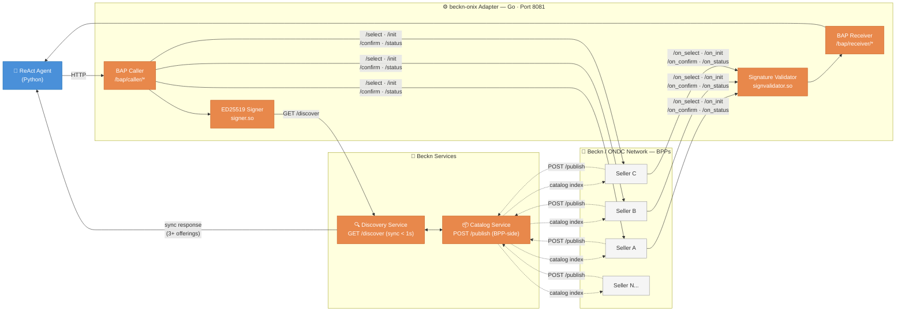
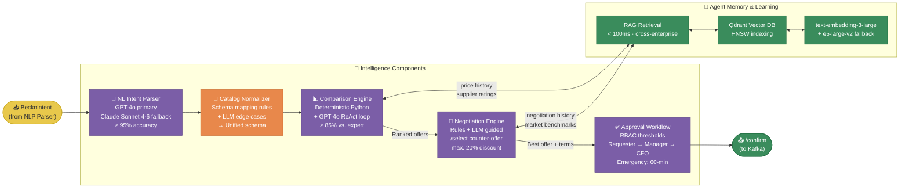
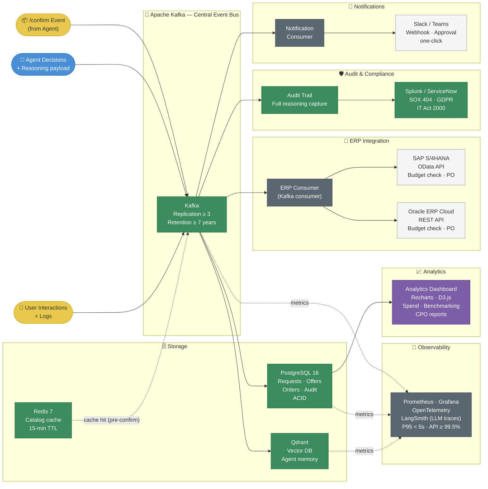

# System Architecture — General Diagram

> [!architecture] Overview
> General diagram of the complete system: from user input to the Beckn/ONDC network, data pipeline, and all enterprise integrations.

---

## Full System Diagram![[Captura de pantalla 2026-04-14 a la(s) 4.16.56 p.m..png]]

**Code:**

```mermaid
flowchart TD

    %% ─────────────────────────────────────────────
    %% USER INPUT
    %% ─────────────────────────────────────────────
    USER(["👤 User\nPriya · Rajesh · Anita · Vikram"])
    SLACK_IN["💬 Slack / Teams\nConversational interface"]
    UI["🖥️ Frontend\nReact 18 · Next.js 14\nTypeScript · Tailwind · ShadCN"]

    USER --> SLACK_IN & UI

    %% ─────────────────────────────────────────────
    %% API GATEWAY + AUTH
    %% ─────────────────────────────────────────────
    SLACK_IN --> GW
    UI --> GW

    GW["🔐 API Gateway — Kong\nRBAC · Rate Limiting · TLS 1.3"]
    KC["🔑 Keycloak SSO\nSAML 2.0 · OIDC\nOkta · Azure AD"]

    GW <-->|auth & token| KC

    %% ─────────────────────────────────────────────
    %% AGENT LAYER
    %% ─────────────────────────────────────────────
    GW --> AGENT

    subgraph AGENT_LAYER["⚙️  Agent Layer — LangChain + LangGraph  (Python)"]
        AGENT["🤖 ReAct Orchestrator\nReason → Act → Observe\nLangGraph stateful directed graph"]
    end

    %% ─────────────────────────────────────────────
    %% INTELLIGENCE COMPONENTS
    %% ─────────────────────────────────────────────
    AGENT --> NLP

    subgraph AI_COMPONENTS["🧠  Artificial Intelligence Components"]
        NLP["📝 NL Intent Parser\nGPT-4o → BecknIntent JSON\nFallback: Claude Sonnet 4·6\n≥ 95% accuracy"]
        SCORE["📊 Comparison & Scoring Engine\nDeterministic Python + GPT-4o ReAct\n≥ 85% agreement vs. human expert"]
        NEG["🤝 Negotiation Engine\nRules + LLM guided\nBeckn /select flow · max. 20% discount"]
        MEM["🧠 Agent Memory & Learning\nQdrant Vector DB · HNSW\ntext-embedding-3-large\n< 100ms RAG retrieval"]
        APPR["✅ Approval Workflow\nRBAC thresholds\nRequester → Manager → CFO\nEmergency: 60-min auto-approve"]
    end

    NLP -->|BecknIntent| BAP
    BAP -->|Normalized offers| SCORE
    SCORE -->|Ranked recommendation| NEG
    NEG -->|Best offer + terms| APPR
    SCORE <-->|Historical prices & supplier data| MEM
    NEG <-->|Negotiation history| MEM

    %% ─────────────────────────────────────────────
    %% BECKN PROTOCOL LAYER
    %% ─────────────────────────────────────────────
    subgraph BECKN_LAYER["🔗  Beckn Protocol Layer  (Beckn v2)"]
        BAP["🌐 Beckn BAP Client\nPython HTTP client → ONIX adapter"]
        ONIX["⚙️ beckn-onix Adapter  (Go)\nPort 8081\nED25519 signing · Schema validation\n/bap/caller/* endpoints"]
        DS["🔍 Discovery Service\nGET /discover → synchronous response\n< 1s · no async callbacks"]
        CS["📦 Catalog Service\nIndexes BPP offerings\nUpdated via POST /publish"]
    end

    BAP --> ONIX
    ONIX <-->|GET /discover| DS
    DS <--> CS

    %% ─────────────────────────────────────────────
    %% BECKN / ONDC NETWORK — SELLERS (BPPs)
    %% ─────────────────────────────────────────────
    subgraph SELLERS["🏪  Beckn / ONDC Network — BPPs  (Sellers)"]
        BPP1["Seller A\n/bpp/receiver"]
        BPP2["Seller B\n/bpp/receiver"]
        BPP3["Seller C\n/bpp/receiver"]
        BPPN["Seller N ...\n/bpp/receiver"]
    end

    CS -->|catalog query| BPP1 & BPP2 & BPP3 & BPPN
    BPP1 & BPP2 & BPP3 & BPPN -->|POST /publish| CS

    ONIX -->|/select · /init · /confirm · /status| BPP1 & BPP2 & BPP3
    BPP1 & BPP2 & BPP3 -->|/on_select · /on_init · /on_confirm · /on_status| ONIX

    %% ─────────────────────────────────────────────
    %% CATALOG NORMALIZATION
    %% ─────────────────────────────────────────────
    DS -->|"Diverse responses (JSON)"| NORM

    subgraph NORM_LAYER["🔄  Catalog Normalization Layer"]
        NORM["Normalizer\nSchema mapping rules  (deterministic)\n+ LLM for unknown formats\n→ Unified schema  (5+ formats)"]
    end

    NORM --> SCORE

    %% ─────────────────────────────────────────────
    %% KAFKA — CENTRAL EVENT BUS
    %% ─────────────────────────────────────────────
    APPR -->|"/confirm event"| KAFKA

    subgraph DATA_PIPELINE["📡  Data Pipeline — Apache Kafka  (Central Event Bus)"]
        KAFKA["Apache Kafka\nReplication factor ≥ 3 · Retention ≥ 7 years\nDecouples all downstream consumers"]
    end

    AGENT -->|"Agent decisions + reasoning"| KAFKA
    UI -->|"User interaction logs"| KAFKA

    %% ─────────────────────────────────────────────
    %% STORAGE
    %% ─────────────────────────────────────────────
    subgraph STORAGE["🗄️  Storage"]
        PG["PostgreSQL 16\nRequests · Offers · Orders\nAudit trail · ACID"]
        REDIS["Redis 7\nBeckn catalog cache\n15-min TTL"]
        QDRANT["Qdrant\nVector DB · self-hosted\nAgent memory\nProcurement history"]
    end

    KAFKA --> PG
    KAFKA --> QDRANT
    DS -->|catalog responses| REDIS
    REDIS -->|cache hit  < 1s| SCORE

    %% ─────────────────────────────────────────────
    %% AUDIT TRAIL & COMPLIANCE
    %% ─────────────────────────────────────────────
    subgraph COMPLIANCE["🛡️  Audit Trail & Compliance"]
        AUDIT["Audit Trail System\nEvery decision + full reasoning\nKafka → PostgreSQL + SIEM"]
        SPLUNK["Splunk / ServiceNow\nSIEM sink\nSOX 404 · GDPR · IT Act 2000"]
    end

    KAFKA --> AUDIT
    AUDIT --> SPLUNK

    %% ─────────────────────────────────────────────
    %% ERP INTEGRATION
    %% ─────────────────────────────────────────────
    subgraph ERP_LAYER["🏢  ERP Integration"]
        ERP_SYNC["ERP Sync Consumer\nKafka consumer\nReal-time budget check pre-confirm\nPO creation post-confirm"]
        SAP["SAP S/4HANA\nOData API"]
        ORACLE["Oracle ERP Cloud\nREST API"]
    end

    KAFKA --> ERP_SYNC
    ERP_SYNC <--> SAP & ORACLE

    %% ─────────────────────────────────────────────
    %% NOTIFICATIONS
    %% ─────────────────────────────────────────────
    subgraph NOTIF_LAYER["📣  Notifications"]
        NOTIF["Notification Service\nKafka consumer"]
        SLACK_OUT["Slack / Teams\nWebhook · Approval one-click\nOrder confirmation"]
    end

    KAFKA --> NOTIF
    NOTIF --> SLACK_OUT

    %% ─────────────────────────────────────────────
    %% REAL-TIME TRACKING
    %% ─────────────────────────────────────────────
    subgraph TRACKING_LAYER["📍  Real-Time Tracking"]
        TRACK["Real-Time Tracking\n/status polling  (30s SLA)\nWebSocket push → UI"]
    end

    ONIX -->|/on_status callbacks| TRACK
    TRACK -->|WebSocket| UI

    %% ─────────────────────────────────────────────
    %% ANALYTICS DASHBOARD
    %% ─────────────────────────────────────────────
    subgraph ANALYTICS_LAYER["📈  Analytics Dashboard"]
        DASH["Analytics Dashboard\nRecharts · D3.js\nSpend analysis · Benchmarking\nCPO reports"]
    end

    PG --> DASH
    DASH --> UI

    %% ─────────────────────────────────────────────
    %% OBSERVABILITY
    %% ─────────────────────────────────────────────
    subgraph OBS_LAYER["🔭  Observability"]
        OBS["Prometheus · Grafana\nOpenTelemetry · LangSmith\nBeckn API ≥ 99.5%\nP95 latency < 5s"]
    end

    AGENT_LAYER -.->|metrics & traces| OBS
    BECKN_LAYER -.->|beckn_api_success_rate| OBS
    DATA_PIPELINE -.->|pipeline health| OBS

    %% ─────────────────────────────────────────────
    %% STYLES
    %% ─────────────────────────────────────────────
    classDef userStyle   fill:#E8C84B,stroke:#C8A820,color:#333,font-weight:bold
    classDef agentStyle  fill:#4A90D9,stroke:#2171B5,color:#fff,font-weight:bold
    classDef aiStyle     fill:#7B5EA7,stroke:#5A3F86,color:#fff
    classDef becknStyle  fill:#E8884B,stroke:#C86427,color:#fff
    classDef dataStyle   fill:#3A8C5C,stroke:#1E6B3F,color:#fff
    classDef infraStyle  fill:#5B6770,stroke:#3A4550,color:#fff

    class USER,SLACK_IN,UI userStyle
    class AGENT agentStyle
    class NLP,SCORE,NEG,MEM,APPR aiStyle
    class BAP,ONIX,DS,CS,NORM becknStyle
    class KAFKA,PG,REDIS,QDRANT,AUDIT,SPLUNK dataStyle
    class GW,KC,OBS infraStyle
```



---

## Diagram 1 — End-to-End Overview

> High-level main flow: from the user to order confirmation.

```mermaid
flowchart LR
    U(["👤 User"])
    FE["🖥️ Frontend\nReact · Next.js"]
    SL["💬 Slack/Teams"]
    GW["🔐 Kong Gateway\n+ Keycloak SSO"]
    AG["🤖 ReAct Agent\nLangChain · LangGraph"]
    NLP["📝 NL Parser\nGPT-4o"]
    BAP["🌐 BAP Client\n+ ONIX Adapter"]
    DS["🔍 Discovery\nService"]
    NRM["🔄 Normalizer"]
    SCR["📊 Scoring\nEngine"]
    NEG["🤝 Negotiation\nEngine"]
    APR["✅ Approval\nWorkflow"]
    CNF["📦 /confirm\nOrder"]
    KFK["📡 Kafka\nEvent Bus"]

    U --> FE & SL
    FE & SL --> GW
    GW --> AG
    AG --> NLP
    NLP -->|BecknIntent| BAP
    BAP -->|GET /discover| DS
    DS --> NRM
    NRM --> SCR
    SCR --> NEG
    NEG --> APR
    APR --> CNF
    CNF --> KFK

    style U    fill:#E8C84B,stroke:#C8A820,color:#333
    style FE   fill:#E8C84B,stroke:#C8A820,color:#333
    style SL   fill:#E8C84B,stroke:#C8A820,color:#333
    style GW   fill:#5B6770,stroke:#3A4550,color:#fff
    style AG   fill:#4A90D9,stroke:#2171B5,color:#fff
    style NLP  fill:#7B5EA7,stroke:#5A3F86,color:#fff
    style BAP  fill:#E8884B,stroke:#C86427,color:#fff
    style DS   fill:#E8884B,stroke:#C86427,color:#fff
    style NRM  fill:#E8884B,stroke:#C86427,color:#fff
    style SCR  fill:#7B5EA7,stroke:#5A3F86,color:#fff
    style NEG  fill:#7B5EA7,stroke:#5A3F86,color:#fff
    style APR  fill:#7B5EA7,stroke:#5A3F86,color:#fff
    style CNF  fill:#3A8C5C,stroke:#1E6B3F,color:#fff
    style KFK  fill:#3A8C5C,stroke:#1E6B3F,color:#fff
```



---

## Diagram 2 — Beckn Protocol Layer

> Detail of the Beckn v2 protocol: how the agent communicates with sellers via beckn-onix.



---

## Diagram 3 — AI & Agent Intelligence Layer

> Intelligence components: how the agent reasons, compares, negotiates, and learns.



---

## Diagram 4 — Data Pipeline & Enterprise Integrations

> What happens after `/confirm`: event bus, storage, ERP, compliance, and notifications.



---

## Detailed Module Explanation

---

### Full System Diagram — The 19 Layers

The complete system has 19 layers. Here is the exact purpose of each one, in the order they participate during a procurement request.

---

#### 1. User

The starting point. Can be Priya (routine purchases), Rajesh (IT equipment), Anita (emergencies), or Vikram (strategic analysis). They don't need to know anything about the Beckn protocol — they just type what they need in natural language.

---

#### 2. Frontend / Slack-Teams

Two entry channels into the system:

- **Frontend** (React + Next.js): web panel where the user fills out a form or types free text.
- **Slack / Teams**: conversational interface. The user types directly in their work channel without opening any portal.

Both channels deliver the request to the same destination: the API Gateway.

---

#### 3. Kong Gateway + Keycloak SSO

First line of defense. Two separate responsibilities:

- **Kong**: validates that the request has a valid token, applies rate limiting, and terminates TLS 1.3. No request reaches the agent without passing through here.
- **Keycloak**: manages identity (who you are) and authorization (what you can do). If you are a `Requester`, you cannot execute `/confirm` directly — Kong blocks it at the network edge.

---

#### 4. ReAct Agent (LangChain + LangGraph)

The brain of the system. Runs a continuous three-step loop for each request:

- **Reason** — analyzes the current state and decides what to do next
- **Act** — executes a concrete action (call the NLP, the BAP client, the scoring engine)
- **Observe** — processes the result and decides the next step

LangGraph maintains the workflow state as a directed graph, enabling complex conditionals: does it require human approval? Is there budget available in the ERP? Did the seller accept the counter-offer?

---

#### 5. NL Intent Parser

Converts the user's free text into a structured JSON (`BecknIntent`) that the Beckn protocol can process. Without this module, the agent cannot communicate with sellers.

Example transformation:
```
"I need 500 reams of A4 paper for Bangalore in 3 days"
→ { item: "A4 paper", qty: 500, location: "12.9716,77.5946", deadline_days: 3 }
```

Uses GPT-4o with schema-constrained decoding (the model is forced to produce valid JSON). If GPT-4o fails 3 consecutive times, it automatically falls back to Claude Sonnet 4.6.

---

#### 6. BAP Client — GET /discover

The agent sends the query to the Beckn protocol to search for available providers. The response arrives **synchronously** in less than 1 second with the catalogs of all registered sellers. There are no callbacks or websockets for this step.

---

#### 7. Catalog Normalizer

Sellers return JSON in completely different formats. The Normalizer has two layers:

1. **Deterministic rules**: predefined mappings for known seller formats
2. **LLM for edge cases**: when an unknown format appears, the LLM infers the mapping

The result is always a unified schema that the Scoring Engine can process consistently.

---

#### 8. Comparison & Scoring Engine

Evaluates all offers in parallel using a hybrid approach:

1. **Deterministic Python**: price (with volume discounts and TCO), delivery time, and quantifiable metrics
2. **GPT-4o in ReAct loop**: qualitative criteria such as certification compliance, and generates a natural language explanation for each ranking position

Each recommendation includes text such as:
> *"Seller C recommended despite being 4% more expensive. 5-year vs. 3-year warranty + volume discount produces 8% lower total TCO."*

---

#### 9. Negotiation Engine

Does not accept the best available price without attempting to improve it. Sends counter-offers to the top sellers via Beckn `/select`. Strategies are configurable by category:

| Situation | Action |
|---|---|
| Basic supplies | Automatic aggressive negotiation |
| Price within N% margin | Accepts without counter-offer |
| Specialized equipment | Advisory mode — human decides |
| Gap too large | Escalates to procurement manager |

The maximum discount limit is set at **20%** by policy — the agent cannot go beyond that.

---

#### 10. Approval Workflow

Verifies whether the total amount exceeds the requester's authorization threshold before confirming the order:

| Amount | Action |
|---|---|
| ≤ requester's threshold | Proceeds directly to `/confirm` |
| > threshold, ≤ manager's authority | Notifies manager with approve/reject button in Slack |
| > manager's authority | Escalates to CFO |
| Emergency mode (`URGENT:`) | CFO receives 60-minute countdown; if no response, auto-approved with full audit |

---

#### 11. /confirm Order

Once approved (or if no approval was required), the agent executes the order confirmation in the Beckn protocol. This event triggers the entire downstream pipeline.

---

#### 12. Apache Kafka (Event Bus)

The `/confirm` publishes an event in Kafka that activates in parallel: ERP synchronization, audit trail recording, and user notification — all at the same time without blocking the agent or adding latency for the user.

---

#### 13. PostgreSQL 16

Main transactional database. Stores the state of each request, offer, order, and audit event. It is the system's source of truth and the data source for the Analytics Dashboard.

---

#### 14. Redis 7

Beckn catalog cache with a 15-minute TTL. When the agent makes a `/discover`, it first queries Redis. If there is a recent response for the same type of item, it uses it directly and avoids a call to the Beckn network. Phase 4 target: reduce redundant calls by ≥ 50%.

---

#### 15. Qdrant (Vector DB — Agent Memory)

Receives user interactions and agent decisions via Kafka to update the learning memory. Each user override (when the user rejects the agent's recommendation) feeds back into the Scoring Engine's calibration over time.

---

#### 16. ERP Sync Consumer (SAP S/4HANA + Oracle ERP Cloud)

Kafka consumer that listens to `/confirm` events and performs two critical operations:

1. **Pre-confirm**: queries SAP/Oracle to verify real-time budget availability — if there is no budget, the order is blocked even if it already has CFO approval
2. **Post-confirm**: automatically creates the Purchase Order in the ERP, eliminating manual double-entry

---

#### 17. Audit Trail → Splunk / ServiceNow

Kafka consumer that captures **every agent decision with its complete reasoning** — not just the outcome, but why that decision was made. Covers three regulatory frameworks:

| Framework | Coverage |
|---|---|
| SOX 404 | Complete real-time trail, no post-hoc reconstruction |
| GDPR | Data processing records with configurable retention |
| IT Act 2000 (India) | Data remains in India-region clouds |

Practical impact: eliminates ~2 weeks of manual documentation preparation per audit cycle.

---

#### 18. Notification Consumer → Slack / Teams

Kafka consumer that sends the user the result of each relevant event: order confirmed, approval required, delivery update, and exception alerts. Approval messages include one-click buttons directly in Slack so the manager can approve without opening any panel.

---

#### 19. Observability (Prometheus + Grafana + LangSmith)

Cross-cutting monitoring across the entire system:

- **Prometheus / Grafana**: infrastructure metrics — `beckn_api_success_rate` ≥ 99.5%, P95 latency < 5s
- **OpenTelemetry**: distributed traces across all microservices
- **LangSmith**: specific traces of LLM calls — cost, latency, fallback rate to Claude Sonnet 4.6, parsing quality

---

---

## Diagram 1 — End-to-End Overview

> Complete high-level flow: from when the user types to when the order is confirmed in Kafka.

### Step by step

**Step 1 — User types**
The user writes their request in natural language, either in the **Frontend** (React/Next.js web panel) or directly in **Slack/Teams** without opening any external portal.

**Step 2 — Kong Gateway intercepts**
Every request first passes through Kong, which validates the session token against **Keycloak SSO** (SAML 2.0 / OIDC). If the token is valid and the role has permission for the requested operation, the request proceeds. If not, it is rejected at the edge.

**Step 3 — ReAct Agent takes control**
LangGraph receives the request and starts the ReAct loop. The state graph determines which component to invoke first (always the NL Parser) and what to do with each result.

**Step 4 — NL Parser produces the BecknIntent**
GPT-4o transforms the free text into a JSON with all the fields needed to build the Beckn query: item, quantity, GPS coordinates, deadline, and budget.

**Step 5 — BAP Client launches GET /discover**
The agent sends the query to the Discovery Service via the ONIX adapter. In less than 1 second it synchronously receives the offers from all sellers that have that product in their catalog.

**Step 6 — Normalizer unifies formats**
Seller responses arrive in heterogeneous JSON formats. The Normalizer converts them all to the same schema before passing them to the Scoring Engine.

**Step 7 — Scoring Engine ranks**
Evaluates price, delivery, quality, and compliance in a hybrid manner (Python + GPT-4o ReAct) and produces an explained ranking of all sellers.

**Step 8 — Negotiation Engine negotiates**
Sends counter-offers to the top sellers via `/select`. If any accept, the final price is better than list.

**Step 9 — Approval Workflow decides**
Compares the total amount against the RBAC authorization thresholds. Proceeds only if within the threshold; otherwise notifies the corresponding approver.

**Step 10 — /confirm and Kafka**
The order is confirmed in the Beckn protocol and an event is published in Kafka, triggering in parallel ERP sync, audit trail, and user notification.

---

## Diagram 2 — Beckn Protocol Layer

> Detail of how the Python agent communicates with the seller network using the Beckn v2 protocol and the beckn-onix adapter.

### Modules

**beckn-onix Adapter (Go, Port 8081)**
The bridge between the Python agent and the Beckn protocol. The agent never talks directly to sellers — it always goes through here. It has four sub-parts:

- **BAP Caller** (`/bap/caller/*`): receives instructions from the Python agent and sends them to the Beckn network
- **BAP Receiver** (`/bap/receiver/*`): receives asynchronous responses from sellers and returns them to the agent
- **ED25519 Signer** (`signer.so`): cryptographically signs each outgoing message — required by the Beckn protocol to guarantee no one can impersonate the BAP
- **Signature Validator** (`signvalidator.so`): verifies the signature of each incoming message — rejects responses from unauthorized sources

**Discovery Service — GET /discover**
Entry point for finding providers. Key feature: it is **completely synchronous**. The agent makes `GET /discover` and receives the response in the same HTTP call in less than 1 second. No callbacks, no websockets for this step.

**Catalog Service — POST /publish**
Sellers proactively register their catalog here whenever they change prices or inventory. The agent does not initiate this — BPPs do it independently. The Discovery Service queries this indexed catalog to respond to each `/discover`.

**BPPs (Sellers A, B, C, N...)**
Providers registered in the Beckn/ONDC network. Each exposes `/bpp/receiver/*` endpoints. The interaction flow with each seller is:

| Action | Direction | Purpose |
|---|---|---|
| `POST /publish` | BPP → Catalog Service | Seller registers/updates their catalog |
| `GET /discover` | Agent → Discovery Service | Agent searches available sellers |
| `POST /select` | Agent → BPP | Signal interest + send counter-offer |
| `POST /on_select` | BPP → Agent | Seller accepts/rejects the counter-offer |
| `POST /init` | Agent → BPP | Initialize the order |
| `POST /confirm` | Agent → BPP | Confirm the purchase |
| `POST /status` | Agent → BPP | Query delivery status |

---

## Diagram 3 — AI & Agent Intelligence Layer

> How the agent interprets the request, compares offers, negotiates, and learns from each transaction.

### Modules

**NL Intent Parser**
First component the agent executes for each new request. Uses **schema-constrained decoding** — the LLM is forced to produce valid JSON that exactly matches the `BecknIntent` schema. This eliminates the risk of malformed JSON that would break the BAP Client downstream.

Fields extracted from each request:

| Field | Example |
|---|---|
| Item and specifications | `"A4 paper, 80gsm"` |
| Quantity and unit | `500 reams` |
| GPS coordinates | `"12.9716,77.5946"` (Bangalore) |
| Delivery deadline | `3 days` |
| Budget | `₹2/sheet` |
| Urgency flag | `URGENT:` → activates emergency mode |
| Compliance requirements | `ISO 27001 required` |

**Catalog Normalizer**
Sellers return JSON in completely different formats. The Normalizer has two layers that act in order:

1. **Deterministic rules**: predefined mappings for known and registered seller formats
2. **LLM for edge cases**: when an unknown format appears (new seller, proprietary format), the LLM infers the mapping without needing a code update

**Comparison & Scoring Engine**
Evaluates all offers in parallel using two complementary engines:

1. **Deterministic Python**: calculates price with volume discounts, TCO (Total Cost of Ownership) over the contract period, delivery time, and historical reliability metrics
2. **GPT-4o in ReAct loop**: evaluates whether an ISO certification truly meets internal policy, generates natural language explanation text for each recommendation, and reasons about criteria that are not directly quantifiable

If the user override rate exceeds 30% (the human rejects the agent's recommendation more than 1 in 3 times), a scoring weight calibration review is automatically triggered.

**Negotiation Engine**
After ranking, the agent does not accept the best list price without attempting to improve it. Strategies are configurable per product category by the company administrator:

- **Commodity items** (paper, office supplies): automatic aggressive negotiation with 5% counter-offer
- **Price within N% margin** of the budget: accepts without counter-offer to avoid risking the deal
- **Specialized equipment** (enterprise laptops, medical equipment): advisory mode — the agent recommends but the human decides
- **Gap too large**: escalates to procurement manager with full context

Hard-coded limit: the agent **can never request more than 20% discount** per company policy.

**Approval Workflow**
After negotiation, the agent checks whether it can proceed alone or needs human authorization by consulting the RBAC thresholds configured in Keycloak. The control is non-bypassable: the API Gateway blocks at the network edge any attempt by a `Requester` to execute `/confirm` directly without an approval event recorded in the audit trail.

**Agent Memory & Learning (Qdrant + RAG)**
The agent's memory is organized in three technological layers:

- **Qdrant Vector DB**: stores embeddings of all past transactions, indexed with HNSW (Hierarchical Navigable Small World) for similarity search in < 100ms even with millions of records
- **text-embedding-3-large**: converts each transaction into a high-dimensional vector for semantic search (not by keywords, but by meaning)
- **RAG Retrieval**: when a new request arrives, the agent retrieves the most similar past transactions and injects them as additional context into the Scoring Engine

What is stored in memory:

| Data type | Use |
|---|---|
| Past transactions (item, price, seller, delivery) | Historical context for scoring |
| Negotiation outcomes (acceptance rates) | Calibrate counter-offer aggressiveness |
| Seasonal price trends | Detect if current price is good or expensive for the season |
| Supplier reliability (on-time deliveries) | Penalize sellers with poor history |
| User overrides (when human rejected recommendation) | Detect scoring misalignment |

Learning is **cross-enterprise**: it improves not just for an individual user but for the entire organization as the system processes more transactions.

---

## Diagram 4 — Data Pipeline & Enterprise Integrations

> What happens after `/confirm`: all systems that react to the event asynchronously and in parallel.

### Modules

**Apache Kafka (Central Event Bus)**
The hub of the entire downstream pipeline. Instead of the agent calling ERP, audit, and notifications sequentially (which would add linear latency), it publishes a single event to Kafka and each consumer processes it independently at its own pace.

Three types of events entering Kafka:
- **`/confirm` event**: triggers ERP sync, audit trail, and user notification
- **Agent decisions + reasoning**: captures each intermediate decision with its reasoning for the audit trail
- **User interaction logs**: captures user selections and overrides for agent learning

**PostgreSQL 16**
Main transactional database. Stores the complete state of each request, offer, order, and audit event in ACID tables. It is the operational source of truth and the data source for the Analytics Dashboard.

**Redis 7**
Beckn catalog cache with a 15-minute TTL. When the agent makes a `/discover`, it first queries Redis. If there is a recent response for the same item type and location, it uses it directly and avoids a call to the Beckn network. Phase 4 target: reduce redundant calls by ≥ 50%.

**Qdrant (Agent Memory)**
Receives user interaction logs and agent decisions via Kafka to continuously update the learning memory. Each override feeds back into the Scoring Engine's calibration over time.

**ERP Sync Consumer**
Dedicated Kafka consumer that listens to `/confirm` events and performs two operations in the ERP:

1. **Pre-confirm (budget check)**: before the agent executes `/confirm`, it queries SAP S/4HANA or Oracle ERP Cloud to verify real-time budget availability. If there is insufficient budget, the order is blocked even if it already has CFO approval — financial control is the final barrier.
2. **Post-confirm (PO creation)**: after `/confirm`, it automatically creates the Purchase Order in the ERP, synchronizes budget consumption, and receives back goods receipt confirmations and invoice matching.

**Audit Trail → Splunk / ServiceNow**
Kafka consumer that captures **every agent decision with its complete reasoning payload** — not just the final result, but the step-by-step decision process. The flow is:

```
Agent decision
    → Kafka topic (structured event)
    → PostgreSQL (transactional audit log)
    → Splunk / ServiceNow (SIEM for compliance)
    → LangSmith (specific LLM trace)
```

The key architectural difference from traditional systems: reasoning is captured **in real time during the decision**, not reconstructed later under audit pressure.

**Notification Consumer → Slack / Teams**
Kafka consumer that sends notifications to the user for each relevant event. Approval messages include one-click buttons directly in Slack so the manager can approve without needing to open any external panel.

**Real-Time Tracking (WebSocket)**
Monitors the delivery status of each confirmed order combining two data sources:

- **`/status` polling**: the agent periodically queries the seller via Beckn `/status`
- **Seller webhooks**: the seller pushes status updates directly to the system without requiring polling

The result is delivered to the frontend via WebSocket within 30 seconds of any status change, without the user needing to refresh the page.

**Analytics Dashboard (Recharts + D3.js)**
Reads from PostgreSQL to display operational and strategic metrics:

| Metric | Audience |
|---|---|
| Cumulative savings from negotiation | CPO, procurement team |
| Average cycle time per category | Procurement manager |
| Price benchmarking vs. market | CPO, management |
| Agent recommendation override rate | Technical team, model governance |
| Spend by supplier and category | CFO, financial management |

If the override rate exceeds 30%, the dashboard automatically flags a Scoring Engine calibration alert.

**Prometheus + Grafana + OpenTelemetry + LangSmith**
Cross-cutting observability across the entire system with three distinct focuses:

- **Prometheus / Grafana**: real-time infrastructure metrics — `beckn_api_success_rate` ≥ 99.5%, P95 latency < 5s, Kafka and database availability
- **OpenTelemetry**: distributed traces that connect a user request across all microservices participating in its processing
- **LangSmith**: specific traces of LLM calls — cost per token per call, GPT-4o vs. Claude Sonnet 4.6 latency, fallback frequency, parsing quality per product category

---

## Color Legend

| Color       | Layer                                                                 |
| ----------- | --------------------------------------------------------------------- |
| 🟡 Yellow   | User input (Frontend · Slack)                                         |
| 🔵 Blue     | Agent Orchestrator (LangGraph)                                        |
| 🟣 Purple   | AI Components (NLP · Scoring · Negotiation · Approval)                |
| 🟠 Orange   | Beckn Layer (BAP Client · ONIX · Discovery · Normalization)           |
| 🟢 Green    | Data (Kafka · PostgreSQL · Redis · Qdrant · Audit · Splunk)           |
| ⬛ Gray      | Infrastructure (Kong · Keycloak · ERP consumers · Observability)      |
| ⬜ White     | External systems (SAP · Oracle · Slack · BPPs)                        |

---

## System Layers

| # | Layer | Technology | Role |
|---|---|---|---|
| 1 | **Input** | React 18 · Next.js 14 · Slack/Teams | User interface: dashboard and conversational |
| 2 | **API Gateway** | Kong · Keycloak · TLS 1.3 | RBAC auth, rate limiting, TLS termination |
| 3 | **Agent Orchestrator** | LangChain · LangGraph · Python | ReAct loop — coordinates all components |
| 4 | **NL Intent Parser** | GPT-4o · Claude Sonnet 4.6 fallback | Free text → `BecknIntent` JSON (≥ 95% accuracy) |
| 5 | **Beckn Protocol** | beckn-onix (Go) · Port 8081 | Bridge to Beckn v2 protocol with ED25519 signing |
| 6 | **Discovery** | Discovery Service · Catalog Service | Synchronous `GET /discover` → seller catalogs |
| 7 | **Normalization** | Python · LLM edge cases | Unifies diverse BPP formats |
| 8 | **Comparison Engine** | Python + GPT-4o ReAct | Multi-criteria scoring + explainability (≥ 85%) |
| 9 | **Negotiation Engine** | Rules + LLM + `/select` | Negotiates price/terms (max. 20% discount) |
| 10 | **Approval Workflow** | Keycloak RBAC | Spend threshold routing up to CFO |
| 11 | **Agent Memory** | Qdrant · HNSW · text-embedding-3-large | RAG < 100ms — history and cross-enterprise learning |
| 12 | **Event Bus** | Apache Kafka | Decouples all downstream consumers |
| 13 | **Storage** | PostgreSQL 16 · Redis 7 · Qdrant | ACID transactional · 15-min cache · vector DB |
| 14 | **ERP Integration** | SAP OData · Oracle REST | Budget check pre-confirm · PO creation post-confirm |
| 15 | **Audit & Compliance** | Kafka → Splunk · ServiceNow | SOX 404 · GDPR · IT Act 2000 — full reasoning trail |
| 16 | **Notifications** | Slack/Teams webhooks | Confirmations · one-click approval |
| 17 | **Real-Time Tracking** | WebSocket · `/status` polling 30s | Live order status in the dashboard |
| 18 | **Analytics** | Recharts · D3.js | Spend analysis · benchmarking · CPO reports |
| 19 | **Observability** | Prometheus · Grafana · OpenTelemetry · LangSmith | SLAs · LLM traces · alerting |

---

## Main Flow (Story 1 — Routine Supplies)

```
User types → [NL Intent Parser] → BecknIntent JSON
                                          ↓
                          [BAP Client] GET /discover
                                          ↓
                     Discovery Service → Catalog Service
                                          ↓
                          BPPs register via POST /publish
                     3+ synchronous responses < 1s
                                          ↓
                     [Catalog Normalizer] → Unified schema
                                          ↓
                     [Comparison Engine] → Ranked offers + reasoning
                                          ↓
                     [Negotiation Engine] → /select with counter-offer
                                          ↓
                     [Approval Workflow] → auto-approve if < threshold
                                          ↓
                     [BAP Client] POST /confirm
                                          ↓
                     Kafka → ERP sync + Audit trail + Slack notification
                                          ↓
                     User receives: "Order placed. Savings: ₹450"
                     TOTAL TIME: 45 seconds
```

---

*See individual components in → [[beckn_bap_client]] · [[nl_intent_parser]] · [[comparison_scoring_engine]] · [[negotiation_engine]] · [[agent_memory_learning]] · [[approval_workflow]] · [[audit_trail_system]] · [[erp_integration]] · [[real_time_tracking]] · [[analytics_dashboard]]*

---

## Work Division — 3 People per Phase

### Roles

| Person | Role | Main Stack |
|---|---|---|
| **P1** | Protocol & Backend Engineer | Go (beckn-onix), Python (agent backend), PostgreSQL, Kafka, Redis |
| **P2** | AI & Agent Engineer | Python (LangChain/LangGraph), GPT-4o, Qdrant, embeddings, evaluation |
| **P3** | Frontend & Infrastructure Engineer | React/Next.js, TypeScript, Docker, Kubernetes, security, testing |

---

### Phase 1 — Foundation & Protocol Integration

> ✅ Already completed: **1.1 Beckn Sandbox Setup** and **1.3 NL Intent Parser**

| Task                                                                      | Owner       | Justification                                                                                                                        |
| ------------------------------------------------------------------------- | ----------- | ------------------------------------------------------------------------------------------------------------------------------------ |
| **1.2 Core API Flows** (`/discover`, `/select`, `/init`)                  | **Lalo**    | Pure protocol — Go adapter, ED25519 signing, ONIX routing. Same profile as who built the sandbox.                                    |
| **1.4 Agent Framework** (LangChain/LangGraph, ReAct loop)                 | **Cris**    | Defines the agent's backbone: the state graph, the ReAct loop, and how the agent calls the various components.                       |
| **1.5 Frontend Scaffold** (React, SSO stub, form)                         | **Cris**    | UI independent of the backend. Can advance in complete parallel with P1 and P2 using mock data.                                      |
| **1.6 Data Models** (PostgreSQL schema — requests, offers, orders, audit) | **Emi**     | The schema defines the system entities. P1 already knows the Beckn flows and what fields each endpoint produces.                     |

**Phase 1 Dependencies:**
- Cris (1.4) depends on the `BecknIntent` JSON already existing (Emi's 1.3 ✅) to connect the parser to the agent graph.
- Lalo (1.2) and Cris (1.5) are completely parallel to each other.
- Emi (1.6) can be done in parallel with (1.2 Lalo) using the objects that define the flows.

---

### Phase 2 — Core Intelligence & Transaction Flow

| Task | Owner | Justification |
|---|---|---|
| **2.1 Full Transaction Flow** (`/init`, `/confirm`, `/status` end-to-end) | **P1** | Direct extension of 1.2. Completes the Beckn lifecycle: initialize, confirm, and track an order against the sandbox. |
| **2.2 Catalog Normalizer** | **P1** (schema mapping rules) + **P2** (LLM for edge cases) | P1 implements deterministic rules for known formats. P2 integrates the LLM fallback for unknown formats. |
| **2.3 Comparison Engine** (Python + GPT-4o ReAct, scoring, explainability) | **P2** | The highest LLM-load component in the system: ReAct loop, qualitative criteria, explanation output. Core AI profile. |

**Phase 2 Dependencies:**
- 2.1 requires 1.2 to be complete.
- 2.3 requires 1.4 (Agent Framework) to be complete — the Comparison Engine is invoked from the agent graph.
- 2.3 requires the unified output of 2.2 to be able to compare.
- P3 in this phase: connects the Frontend (1.5) to the real backend and implements the offer comparison UI in parallel while P2 builds the engine.

---

### Phase 3 — Advanced Intelligence & Enterprise Features

| Task | Owner | Justification |
|---|---|---|
| **3.1 Negotiation Engine** — Beckn `/select` flow | **P1** | The counter-offer sending mechanics via the ONIX adapter is protocol — P1's territory. |
| **3.1 Negotiation Engine** — strategies + LLM guidance | **P2** | The logic of which strategy to apply per category and when to invoke the LLM for ambiguous cases is AI — P2's territory. |
| **3.2 Multi-network search** (concurrent queries, graceful degradation) | **P1** | Extension of the protocol layer: connect to 2+ Beckn networks, handle timeouts and fallbacks at the network level. |
| **3.3 Agent Memory** (Qdrant, HNSW, RAG < 100ms) | **P2** | Embeddings, vector indexing, and the RAG pattern are core to the AI profile. |
| **3.4 Audit Trail** — Kafka events + decision logging | **P2** | Captures the agent's reasoning at each decision — P2 knows exactly what the agent produces at each step. |
| **3.4 Audit Trail** — sink to Splunk/ServiceNow + PostgreSQL | **P1** | Kafka consumer configuration, Splunk connectors, and audit table schema. |
| **3.5 Analytics Dashboard** (6+ metrics, drill-down) | **P3** | Pure UI/Frontend — Recharts, D3.js, PostgreSQL queries. Completely parallel to the rest of the phase. |
| **3.6 ERP Integration** (SAP OData, Oracle REST, budget check, PO creation) | **P1** | External API integration and Kafka consumer. Pure backend, no AI component. |

**Phase 3 Dependencies:**
- 3.1 requires 2.3 (Comparison Engine) to be complete — negotiation happens after ranking.
- 3.3 requires 1.6 (Data Models) and 2.1 (Full Transaction Flow) to be complete to have history to store.
- 3.5 can advance in complete parallel from when PostgreSQL (1.6) has data from previous phases.
- 3.6 is independent of 3.1 and 3.3 — P1 can work on it in parallel.

---

### Phase 4 — Hardening, Testing & Production Readiness

| Task | Owner | Justification |
|---|---|---|
| **4.1 Performance Optimization** — Redis caching, reducing Beckn calls | **P1** | Optimize catalog cache in Redis and retry logic in the Beckn protocol. |
| **4.1 Performance Optimization** — LLM call optimization, agent latency | **P2** | Reduce tokens, optimize prompts, identify which calls can use GPT-4o-mini instead of GPT-4o. |
| **4.2 Security Hardening** (OWASP Top 10, at-rest and in-transit encryption) | **P3** | Attack surface review, input validation, TLS configuration, KMS for encryption. |
| **4.3 Integration Testing** (80%+ coverage, critical paths) | **P3** (leads) + all contribute | P3 writes the test framework. P1 and P2 write tests for their own components. |
| **4.4 Evaluation Suite** (85%+ agent accuracy on 100+ scenarios) | **P2** | Design evaluation scenarios, run the agent against ground truth, analyze and correct deviations. |
| **4.5 Containerization** (docker-compose local, Helm + K8s) | **P3** | Pure DevOps: Dockerfiles, compose files, Helm charts, CI/CD pipeline with GitHub Actions. |
| **4.6 Documentation & Demo** | **Everyone** (P3 coordinates) | Each person documents their own components. P3 integrates, prepares the end-to-end demo and handoff. |

---

### Visual summary by phase

```
                    P1 — Protocol & Backend      P2 — AI & Agent          P3 — Frontend & Infra
                   ┌──────────────────────────┬──────────────────────┬───────────────────────────┐
Phase 1            │ 1.2 Core API Flows        │ 1.4 Agent Framework  │ 1.5 Frontend Scaffold     │
(✅ 1.1, 1.3 done) │ 1.6 Data Models           │                      │                           │
                   ├──────────────────────────┼──────────────────────┼───────────────────────────┤
Phase 2            │ 2.1 Full Transaction Flow │ 2.2 Normalizer (LLM) │ Comparison UI             │
                   │ 2.2 Normalizer (rules)    │ 2.3 Comparison Engine│ (connects frontend to API)│
                   ├──────────────────────────┼──────────────────────┼───────────────────────────┤
Phase 3            │ 3.1 Negot. (Beckn/select) │ 3.1 Negot. (strategy)│ 3.5 Analytics Dashboard   │
                   │ 3.2 Multi-network search  │ 3.3 Agent Memory     │                           │
                   │ 3.4 Audit Trail (Kafka)   │ 3.4 Audit Trail (log)│                           │
                   │ 3.6 ERP Integration       │                      │                           │
                   ├──────────────────────────┼──────────────────────┼───────────────────────────┤
Phase 4            │ 4.1 Perf. (Redis/Beckn)  │ 4.1 Perf. (LLM)      │ 4.2 Security Hardening    │
                   │ 4.3 Tests (components)   │ 4.4 Evaluation Suite │ 4.3 Integration Testing   │
                   │                          │ 4.3 Tests (AI)        │ 4.5 Containerization      │
                   │                          │                      │ 4.6 Docs & Demo           │
                   └──────────────────────────┴──────────────────────┴───────────────────────────┘
```

---

### Critical Coordination Points

| Moment | What needs to be synchronized |
|---|---|
| **End of Phase 1** | P1 exposes the functional `/discover` endpoint → P2 connects it to the agent graph → P3 connects it to the frontend form |
| **2.2 Catalog Normalizer** | P1 delivers the unified schema → P2 consumes it in 2.3 for scoring |
| **3.1 Negotiation Engine** | P1 and P2 must agree on the interface contract: what the strategy layer (P2) receives and what the protocol layer (P1) sends |
| **3.4 Audit Trail** | P1 defines Kafka topics and the event schema → P2 publishes events with that schema from the agent |
| **Phase 4** | All three converge: P2 needs P3 to have containers running to execute the Evaluation Suite (4.4) under production conditions |
