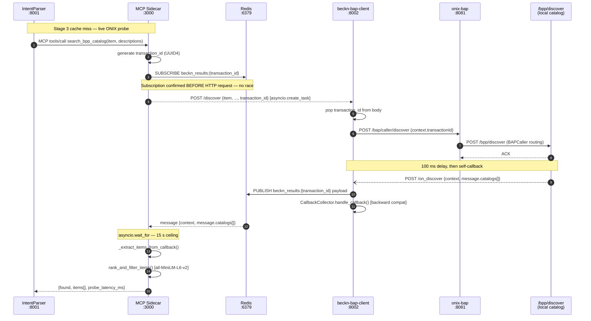

# Beckn Procurement Agent

An event-driven procurement assistant that translates natural-language purchase requests into validated Beckn Protocol v2.0.0 transactions. The system classifies buyer intent, extracts structured procurement parameters, validates them against live BPP catalogs, and drives the full Beckn transaction lifecycle (discover → select → init → confirm → status).

---

## Table of Contents

- [Prerequisites](#prerequisites)
- [Quick Start](#quick-start)
- [Service Map](#service-map)
- [Architecture — Async Discovery Flow](#architecture--async-discovery-flow)
- [End-to-End Transaction Flow](#end-to-end-transaction-flow)
- [Configuration](#configuration)
- [Architecture Decision Records](#architecture-decision-records)

---

## Prerequisites

| Dependency | Version | Purpose |
|---|---|---|
| Docker + Docker Compose | 24+ | Runs all containerised services |
| Python | 3.11+ | Local services (IntentParser, MCP Sidecar) |
| conda env `infosys_project` | — | Package management for local services |
| Ollama | latest | Local LLM inference (qwen3:8b, qwen3:1.7b) |
| **Redis** | 7+ (alpine) | **Async message broker** between BAP Client and MCP Sidecar. Managed by Docker Compose; exposed on `localhost:6379`. |
| PostgreSQL + pgvector | 16+ | Semantic cache for BPP catalog validation (IntentParser Stage 3) |

> **Redis is a hard runtime dependency** introduced in the async Beckn discovery refactor (see [ADR-0001](docs/architecture/decisions/0001-use-redis-pubsub-for-async-beckn-responses.md)). The `docker-compose.yml` includes a `healthcheck` on the `redis` service; `beckn-bap-client` and `onix-bap` depend on it.

---

## Quick Start

```bash
# 1. Start all containerised infrastructure
docker compose up -d

# 2. Activate the conda environment
conda activate infosys_project

# 3. Start the MCP Sidecar (requires BAP_API_KEY)
cd services/mcp-sidecar
BAP_API_KEY=dev-secret-key uvicorn server:app --host 0.0.0.0 --port 3000

# 4. Start the IntentParser
cd IntentParser
uvicorn api:app --host 0.0.0.0 --port 8001

# 5. Run an end-to-end parse
curl -X POST http://localhost:8001/parse/full \
  -H "Content-Type: application/json" \
  -d '{"query": "I need 300 meters of Cat6 UTP network cable delivered to Mumbai in 5 days."}'
```

---

## Service Map

```
localhost:3000   MCP Sidecar          (local Python — SSE/MCP, Beckn live probe)
localhost:8001   IntentParser         (local Python — NL → BecknIntent pipeline)
localhost:8002   beckn-bap-client     (Docker     — Beckn BAP, ONIX bridge)
localhost:8003   comparative-scoring  (Docker     — offer ranking)
localhost:8004   orchestrator         (Docker     — workflow coordinator)
localhost:8005   catalog-normalizer   (Docker     — ONIX catalog parsing)
localhost:6379   redis                (Docker     — Pub/Sub message broker)
localhost:8081   onix-bap             (Docker     — Beckn BAP ONIX adapter, Go)
localhost:8082   onix-bpp             (Docker     — Beckn BPP ONIX adapter, Go)
localhost:3002   sandbox-bpp          (Docker     — mock BPP for select/init/confirm)
```

All Docker services share the `beckn_network` bridge. Local services reach Docker services via the exposed host ports listed above.

---

## Architecture — Async Discovery Flow

Beckn Protocol v2.0.0 is **inherently asynchronous**: `POST /discover` to the ONIX adapter returns only an ACK. The actual catalog arrives later as a webhook callback to `/on_discover`. Blocking on the HTTP response caused deadlocks and timeouts.

We solved this with **Redis Pub/Sub** as a one-shot message broker. See [ADR-0001](docs/architecture/decisions/0001-use-redis-pubsub-for-async-beckn-responses.md) for the full decision record.

### Sequence diagram



### Key properties of the Redis Pub/Sub design

| Property | Detail |
|---|---|
| **Race-free** | `SUBSCRIBE` completes before `POST /discover` is sent. Redis buffers the `PUBLISH` even if the sidecar is briefly blocked. |
| **Timeout-safe** | `asyncio.wait_for(pubsub.listen(), timeout=15s)`. On expiry the sidecar returns `found=false`; the HTTP task is cancelled. |
| **Non-blocking** | The HTTP `POST /discover` runs as `asyncio.create_task` concurrently with the Redis wait. |
| **Backward compatible** | `/on_discover` also calls `CallbackCollector.handle_callback()`, so the orchestrator's synchronous discover flow continues to work. |
| **Observable** | Channel name `beckn_results:{transaction_id}` is directly correlatable with ONIX log field `transactionId`. |

---

## End-to-End Transaction Flow

```
Buyer NL Query
      │
      ▼
IntentParser :8001
  Stage 1 — LLM intent classification  (qwen3:8b, mode=JSON)
      │ "SearchProduct" | "RequestQuote" | "PurchaseOrder"
      ▼
  Stage 2 — BecknIntent extraction     (qwen3:8b or qwen3:1.7b, routed by complexity)
      │ {item, descriptions, quantity, location_coordinates, delivery_timeline, budget}
      ▼
  Stage 3 — Hybrid BPP validation
      ├─ pgvector ANN (cosine ≥ 0.85)  →  VALIDATED — BPP match from cache
      ├─ pgvector ANN (0.45–0.85)      →  AMBIGUOUS — human review
      └─ pgvector ANN (< 0.45)         →  CACHE MISS → MCP Sidecar probe
             │
             ▼
      MCP Sidecar :3000
        subscribe Redis → POST /discover → wait on Redis
             │
             ▼
      beckn-bap-client :8002
        discover_async() → onix-bap:8081 → /bpp/discover → /on_discover → Redis publish
             │
             ▼
      Semantic ranking (all-MiniLM-L6-v2)  →  found / not found
             │
      ┌──────┴──────────────────────────────────────────────┐
      │ found = true                        found = false   │
      │                                                      │
      ▼                                                      ▼
 VALIDATED (BPP match)                   Recovery flow
 write to pgvector cache                 (broaden query → RFQ)
      │
      ▼
Orchestrator :8004  (driven by frontend)
  POST /select  → beckn-bap-client → onix-bap → onix-bpp → sandbox-bpp
  POST /init    → (billing + fulfillment)
  POST /confirm → (payment)
  GET  /status  → (poll)
```

---

## Configuration

### Docker Compose services

| Env Var | Service | Default | Description |
|---|---|---|---|
| `REDIS_URL` | `beckn-bap-client` | `redis://redis:6379` | Redis connection for `/on_discover` publisher. Must use Docker service name inside the container. |
| `REDIS_ADDR` | `onix-bap`, `onix-bpp` | `redis:6379` | Redis connection for ONIX Go adapter cache. |
| `ONIX_URL` | `beckn-bap-client` | `http://onix-bap:8081` | ONIX BAP adapter endpoint. |
| `BAP_URI` | `beckn-bap-client` | `http://beckn-bap-client:8002` | BAP callback URI embedded in every Beckn context. |
| `CALLBACK_TIMEOUT` | `beckn-bap-client` | `10.0` | Seconds to wait for `on_*` callbacks via `CallbackCollector`. |
| `CATALOG_NORMALIZER_URL` | `beckn-bap-client` | `http://catalog-normalizer:8005` | Catalog normalizer for `on_discover` callback processing. |

### Local services (MCP Sidecar)

| Env Var | Default | Description |
|---|---|---|
| `BAP_API_KEY` | **required** | Bearer token for `POST /discover`. Any value works in development. |
| `BAP_CLIENT_URL` | `http://localhost:8002` | BAP Client endpoint. Port 8002 is exposed by Docker Compose. |
| `REDIS_URL` | `redis://localhost:6379` | Redis connection. Port 6379 is exposed by Docker Compose. |
| `REDIS_RESULT_TIMEOUT` | `15` | Seconds to wait for an `on_discover` message on the Redis channel. |
| `MCP_BAP_TIMEOUT` | `3.0` | Timeout for the `POST /discover` HTTP task (fire-and-forget). |
| `MCP_SSE_URL` | `http://localhost:3000/sse` | MCP SSE endpoint (read by IntentParser). |

---

## Architecture Decision Records

| ADR | Title | Status |
|---|---|---|
| [ADR-0001](docs/architecture/decisions/0001-use-redis-pubsub-for-async-beckn-responses.md) | Use Redis Pub/Sub to decouple Beckn v2.0.0 async discovery responses | Accepted |
