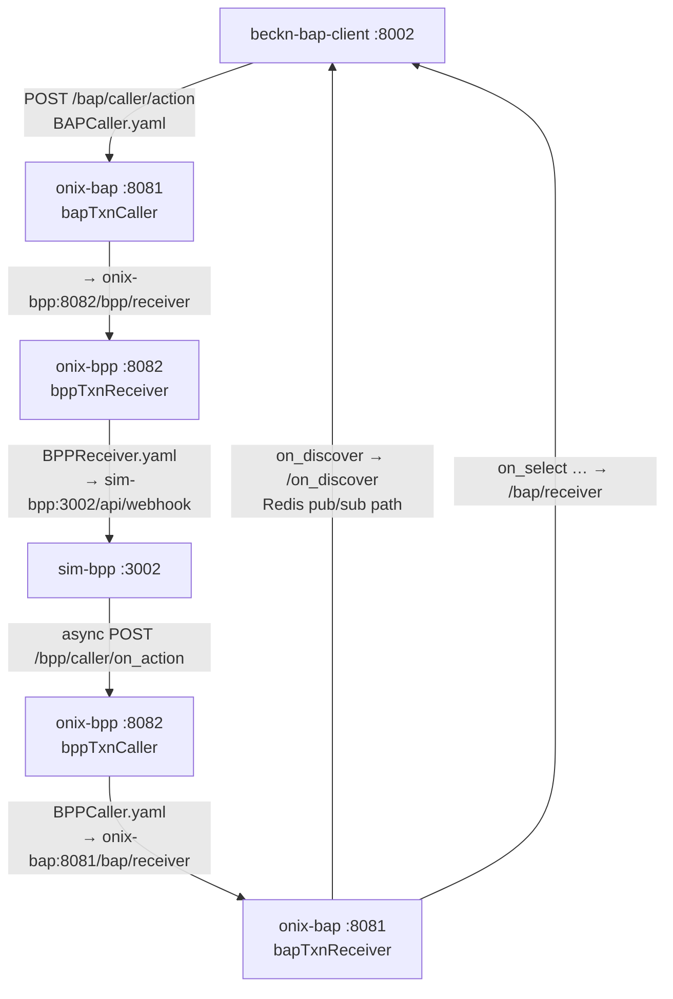

# config — ONIX Protocol Adapter Configuration

ONIX routing and adapter configuration files for the two Beckn network adapters (`onix-bap` and `onix-bpp`). These are **not application configs** — they govern how the ONIX protocol middleware signs, validates, and routes Beckn messages between services.

## File map

| File | Loaded by | Module path served |
|------|-----------|--------------------|
| `generic-bap.yaml` | `onix-bap` (port 8081) | `/bap/caller/` and `/bap/receiver/` |
| `generic-bpp.yaml` | `onix-bpp` (port 8082) | `/bpp/caller/` and `/bpp/receiver/` |
| `generic-routing-BAPCaller.yaml` | `onix-bap / bapTxnCaller` | Outbound action → BPP |
| `generic-routing-BAPReceiver.yaml` | `onix-bap / bapTxnReceiver` | Inbound `on_*` → Python services |
| `generic-routing-BPPCaller.yaml` | `onix-bpp / bppTxnCaller` | Outbound `on_*` → BAP |
| `generic-routing-BPPReceiver.yaml` | `onix-bpp / bppTxnReceiver` | Inbound action → sim-bpp |

## Two-adapter model

Each ONIX adapter instance (`onix-bap`, `onix-bpp`) exposes two modules:

- **Receiver** — inbound path. Steps: `validateSign → addRoute → validateSchema`. Validates the Ed25519 signature on incoming messages before forwarding.
- **Caller** — outbound path. Steps: `addRoute → sign → validateSchema`. Signs outgoing messages with the local private key before sending.

The split exists because message signing is asymmetric: you sign what you send, you verify what you receive.

## Routing topology

## DeDi registry bypass

All routing files use `targetType: url` instead of `targetType: bap` / `targetType: bpp`. This bypasses the DeDi registry lookup and uses direct Docker service-name URLs, allowing the full Beckn protocol flow to work inside the local Docker network without ngrok or external registration.

**To connect to a real Beckn network**, change `targetType` to `bap`/`bpp` and set the gateway URL in each routing file. The rest of the pipeline is unchanged.

## `on_discover` split routing

`generic-routing-BAPReceiver.yaml` routes `on_discover` to a dedicated endpoint (`/on_discover`) while all other `on_*` callbacks go to `/bap/receiver`. This is intentional: `on_discover` must publish catalog results to Redis Pub/Sub so the MCP sidecar's `probe_bap_network` tool can receive them asynchronously without blocking. See [ADR-0001](../docs/architecture/decisions/0001-use-redis-pubsub-for-async-beckn-responses.md).

## Schema validator pin

Both adapter configs pin the Beckn v2.0.0 schema validator to commit `d43ec30d`. Later commits introduced a `$ref` resolution bug in the `SignatureHeader` / `AckSignatureHeader` schemas that causes valid messages to fail validation. Do not upgrade this pin without testing the signing flow end-to-end.

## Key material

The signing keys in `generic-bap.yaml` and `generic-bpp.yaml` are **testnet sandbox keys**. Before production deployment:
1. Generate new Ed25519 key pairs for BAP and BPP.
2. Register the public keys with the Beckn registry.
3. Replace the `privateKey`, `publicKey`, and `keyId` fields in both YAML files.

## `networkId` vs `domain` inconsistency

`generic-routing-BPPReceiver.yaml` uses `networkId` as the routing key while all other routing files use `domain`. This is the only file with this difference. Confirm whether it is intentional before modifying.

## Redis dependency

All four main adapter modules depend on `redis:6379` for caching and transaction correlation. Redis must be running before either ONIX adapter starts.
