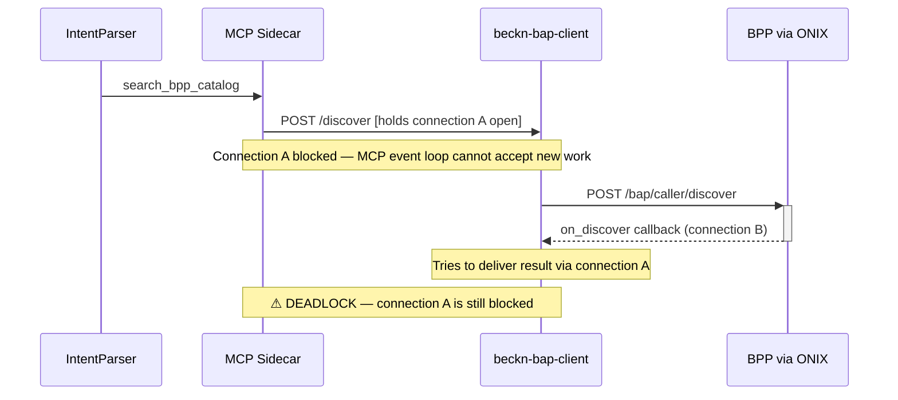
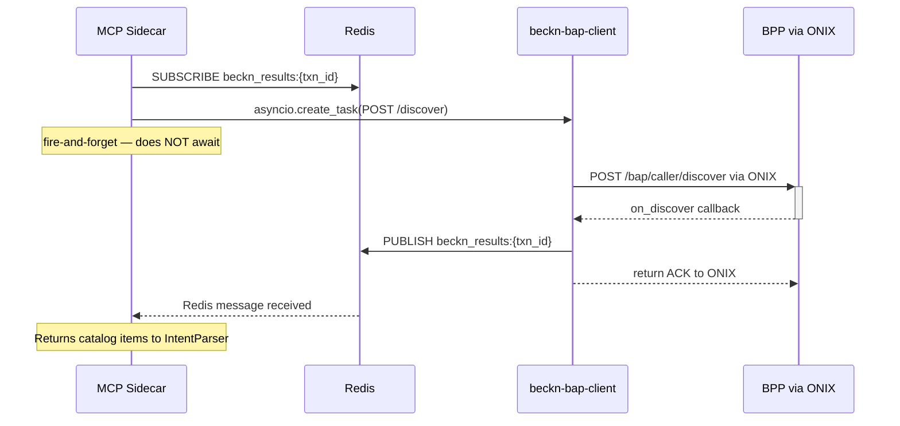

# ADR-0001: Use Redis Pub/Sub for Async Beckn Discovery Responses

**Status:** Accepted  
**Date:** 2025-05  
**Deciders:** Procurement Agent team

---

## Context

Beckn Protocol v2.0.0 uses a fully async communication model for discovery. When a BAP sends `POST /bap/caller/discover` to the ONIX adapter, ONIX returns only an HTTP ACK (`{"status": "ACK"}`) immediately. The actual catalog results arrive later via a separate HTTP callback — `POST /bap/receiver/on_discover` — sent by the BPP through the ONIX network.

The MCP sidecar (`services/mcp-sidecar`) exposes a `search_bpp_catalog` tool that the IntentParser calls during Stage 3 validation. The sidecar needs to:

1. Fire a Beckn discover request.
2. Wait for the catalog results to come back.
3. Return those results to the IntentParser as a synchronous MCP tool response.

### The deadlock problem

The naive approach — fire the discover request and then block waiting for the `on_discover` HTTP callback — deadlocks:

The root cause: the MCP sidecar was holding an HTTP connection open to `beckn-bap-client` while `beckn-bap-client` needed to send data back to the sidecar. Because both run on single-threaded asyncio event loops, the inbound callback could never be processed while the outbound connection was blocked.

---

## Decision

**Use Redis Pub/Sub as an out-of-band channel for delivering `on_discover` results to the MCP sidecar.**

The protocol is:

1. The MCP sidecar generates a `transaction_id` (UUID) for each probe.
2. **Before** firing the discover request, the sidecar subscribes to `beckn_results:{transaction_id}` on Redis.
3. The sidecar fires `POST /discover` as a **fire-and-forget** `asyncio.create_task` — it does not `await` the HTTP response for catalog data.
4. When the `on_discover` callback arrives at `beckn-bap-client`, the `/on_discover` handler **publishes** the catalog payload to `beckn_results:{transaction_id}` on Redis.
5. The MCP sidecar's Redis subscriber receives the message and returns the catalog items to the IntentParser as the MCP tool result.

---

## Consequences

### Positive

- **Breaks the deadlock.** The sidecar no longer holds an HTTP connection open while waiting for a callback; it waits on a Redis channel instead.
- **Decouples producers and consumers.** Any future consumer (orchestrator, analytics, etc.) can subscribe to `beckn_results:*` without modifying `beckn-bap-client`.
- **Observable.** A single `redis-cli subscribe 'beckn_results:*'` command shows all live discovery transactions in real time.
- **No new infrastructure.** Redis is already required for the ONIX adapter cache.

### Negative / trade-offs

- **Redis becomes a hard dependency for Stage 3 validation.** If Redis is unavailable, `search_bpp_catalog` falls back to `found=false` (graceful degradation, but the MCP probe path is disabled).
- **Two code paths for the same event.** `/on_discover` both publishes to Redis (for MCP sidecar) and calls `CallbackCollector.handle_callback()` (for the orchestrator's synchronous discover flow). Both paths must remain in sync.
- **Transaction ID must be pre-generated.** The MCP sidecar must generate the UUID and pass it in the discover request body so the Redis channel name matches the Beckn `context.transactionId` embedded in the callback.
- **`asyncio.create_task` not `await`.** The sidecar must not `await` the discover POST. Adding `await` reintroduces the deadlock. This is enforced in the CLAUDE.md "What NOT to do" section.

### Neutral

- `REDIS_RESULT_TIMEOUT` (default 15 s) is the primary latency ceiling for discovery probes. The `MCP_BAP_TIMEOUT` (default 8 s) only governs the HTTP fire-and-forget task and does not need to cover the Beckn round-trip.

---

## Alternatives considered

### A: Synchronous HTTP polling

The MCP sidecar polls `GET /discover/result/{txn_id}` until a result is available. Rejected because polling introduces unnecessary latency and requires persistent server-side state in `beckn-bap-client` that complicates horizontal scaling.

### B: Callback to MCP sidecar directly

`beckn-bap-client` calls the MCP sidecar directly when `on_discover` arrives. Rejected because it inverts the dependency (the BAP client would need to know the sidecar's address) and creates a circular service dependency.

### C: Shared asyncio Queue via in-process communication

Works only when both components run in the same Python process. Rejected because the sidecar and BAP client are separate Docker containers and this approach breaks the microservices boundary.
