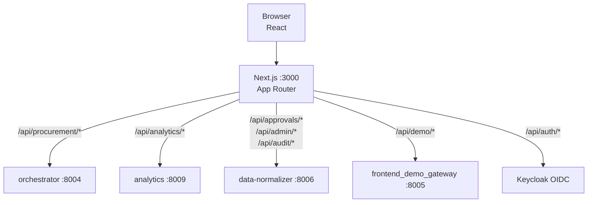

# Procurement Agent — Frontend

Next.js 13 App Router + NextAuth + Tailwind + shadcn-style components. The buyer-facing interface of the Beckn Procurement Agent — covers the full procurement lifecycle from NL query to order tracking, plus analytics, approvals, admin, and AI negotiation.

## What you can do here

1. **Log in** (`/login`) — Keycloak OIDC with 3 demo users (requester / approver / admin).
2. **Create a request** (`/request/new`) — Enter a natural-language procurement query. The Intent Parser converts it to a structured `BecknIntent`.
3. **Compare offers** (`/request/[txn_id]/compare`) — Side-by-side comparison of offerings returned by the Beckn network, sortable by price / rating / delivery time. Agent scoring + reasoning trace. Keyboard navigation.
4. **Track an order** (`/request/[txn_id]/order`) — Order summary, lifecycle timeline (CREATED → ACCEPTED → PACKED → SHIPPED → DELIVERED), status polling.
5. **AI-driven run** (`/request/[txn_id]/run`) — Agentic execution mode (advisory / HITL / autonomous). Execution mode selector, human-in-the-loop decision UI.
6. **Negotiate** (`/request/[txn_id]/negotiate`) — Interactive negotiation stepper backed by the LangGraph negotiation engine.
7. **View audit trail** (`/request/[txn_id]/audit`) — Full audit trail for a procurement request, event by event.
8. **Analytics dashboard** (`/dashboard`) — Live KPIs, spend charts, cycle time, supplier metrics — pulled from the analytics microservice.
9. **Approvals** (`/approvals`) — Approver inbox; approve or reject pending procurement requests.
10. **Admin** (`/admin`) — User management, approval threshold and department configuration.
11. **Negotiation demo** (`/negotiation`) — Standalone demo of the AI negotiation flow.

## Architecture



## Pages

| Route | Description |
|-------|-------------|
| `/` | Root (redirects to dashboard or login) |
| `/login` | Keycloak OIDC login |
| `/dashboard` | Analytics dashboard — live KPIs and charts |
| `/request/new` | New procurement request form |
| `/request/[txn_id]/compare` | Offer comparison table |
| `/request/[txn_id]/order` | Order summary and lifecycle timeline |
| `/request/[txn_id]/run` | Agentic execution mode |
| `/request/[txn_id]/negotiate` | AI negotiation stepper |
| `/request/[txn_id]/audit` | Audit trail viewer |
| `/approvals` | Approver inbox |
| `/admin` | User management |
| `/negotiation` | Standalone negotiation demo |

## API Routes (24 total)

| Path | Backend |
|------|---------|
| `/api/procurement/parse` | orchestrator /parse |
| `/api/procurement/compare` | orchestrator /compare |
| `/api/procurement/commit` | orchestrator /commit |
| `/api/procurement/cancel` | orchestrator /cancel |
| `/api/procurement/status/[txn_id]/[order_id]` | orchestrator /status |
| `/api/procurement/order/[id]` | data-normalizer /order |
| `/api/procurement/run` | orchestrator /run |
| `/api/procurement/run/[run_id]` | orchestrator /run/{id} |
| `/api/procurement/run/[run_id]/decide` | orchestrator /run/{id}/decide |
| `/api/analytics` | analytics /analytics |
| `/api/analytics/benchmark` | analytics /benchmark |
| `/api/analytics/business-impact` | analytics /business-impact |
| `/api/approvals` | data-normalizer /approvals |
| `/api/approvals/[id]/decide` | data-normalizer /approvals/{id}/decide |
| `/api/admin/users` | data-normalizer /admin/users |
| `/api/admin/users/[id]` | data-normalizer /admin/users/{id} |
| `/api/audit` | data-normalizer /normalize/audit |
| `/api/demo/score` | frontend_demo_gateway /api/demo/score |
| `/api/demo/negotiate` | frontend_demo_gateway /api/demo/negotiate |
| `/api/demo/negotiate/[thread_id]` | frontend_demo_gateway /api/demo/negotiate/{id} |
| `/api/demo/negotiate/[thread_id]/supplier-respond` | frontend_demo_gateway /api/demo/negotiate/{id}/supplier-respond |
| `/api/auth/[...nextauth]` | NextAuth 4 |
| `/api/auth/federated-logout` | Keycloak federated logout |

## Wizard session state

Between routes (`/request/new` → `/compare` → `/order`), state lives in a single `sessionStorage` blob keyed by `transaction_id`:

```ts
interface WizardSession {
  intent: BecknIntent
  comparison: ComparisonResult
  chosenItemId: string | null
  commit: CommitResult | null
}
```

Use `loadSession(txnId)`, `saveSession(txnId, s)`, `patchSession(txnId, patch)` from `src/lib/session-store.ts`. Clears on tab close — no PII persists.

## Stack

| Layer | Choice |
|-------|--------|
| Framework | Next.js 13.5 (App Router) |
| Language | TypeScript strict |
| Auth | NextAuth 4 (Keycloak OIDC + stub credentials for dev) |
| HTTP | axios — wrappers in `src/lib/api.ts` |
| Styling | Tailwind CSS 3.4 + `tailwindcss-animate` |
| Components | shadcn-style (Radix primitives + CVA + Lucide icons) |
| Charts | recharts (dynamically imported, `ssr: false`) |

## Run

```bash
npm install
npm run dev    # :3000
npm run build
npm run lint
```

## Environment

```dotenv
# .env.local
ORCHESTRATOR_URL=http://localhost:8004
ANALYTICS_URL=http://localhost:8009
DATA_NORMALIZER_URL=http://localhost:8006
DEMO_GATEWAY_URL=http://localhost:8005
NEXTAUTH_URL=http://localhost:3000
NEXTAUTH_SECRET=procurement-agent-secret-dev
KEYCLOAK_URL=http://localhost:8080
KEYCLOAK_REALM=procurement
KEYCLOAK_CLIENT_ID=procurement-frontend
KEYCLOAK_CLIENT_SECRET=<from Keycloak>
```

## Known issues

- `AuthGuard.tsx` is dead code — not imported anywhere.
- Geist fonts exist in `src/app/fonts/` but are not registered — body uses Arial.
- recharts charts have no ARIA support — zero `role="img"` wrapping.
- No `loading.tsx`, `error.tsx`, or `not-found.tsx` App Router boundaries.
- No `.env.example` file.
- No frontend tests (zero Jest/Vitest/Playwright coverage).

## Related docs

- `frontend/CLAUDE.md` — stack conventions, accessibility rules, design patterns (read before any UI change).
- `frontend/docs/sequence-diagrams.md` — end-to-end sequence diagrams per flow.
