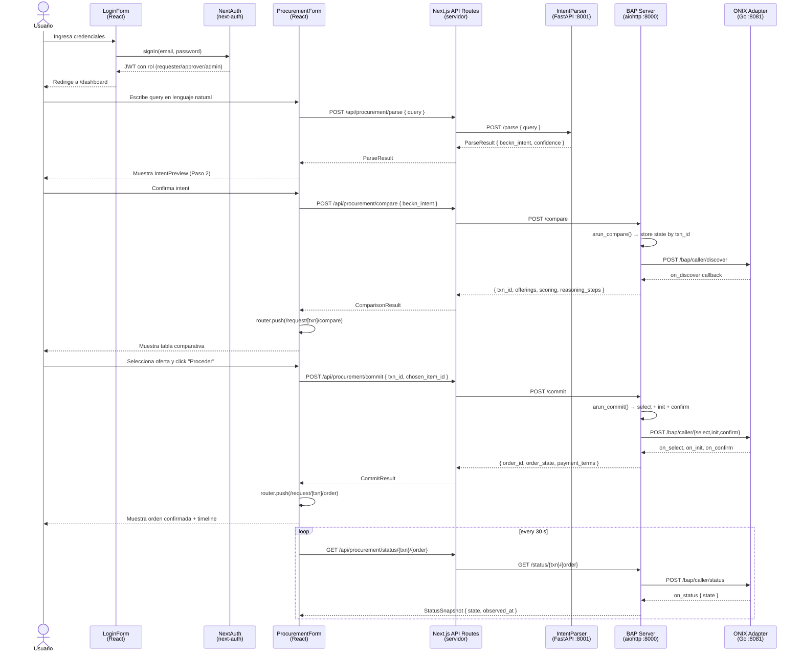
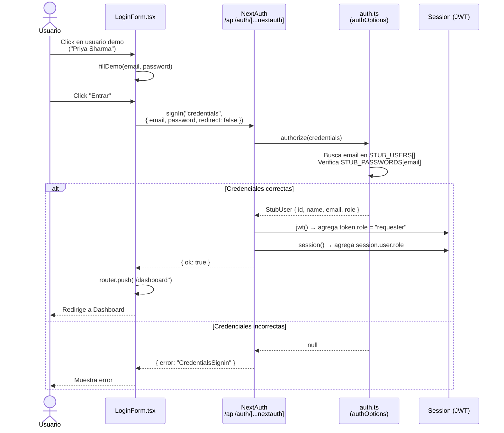
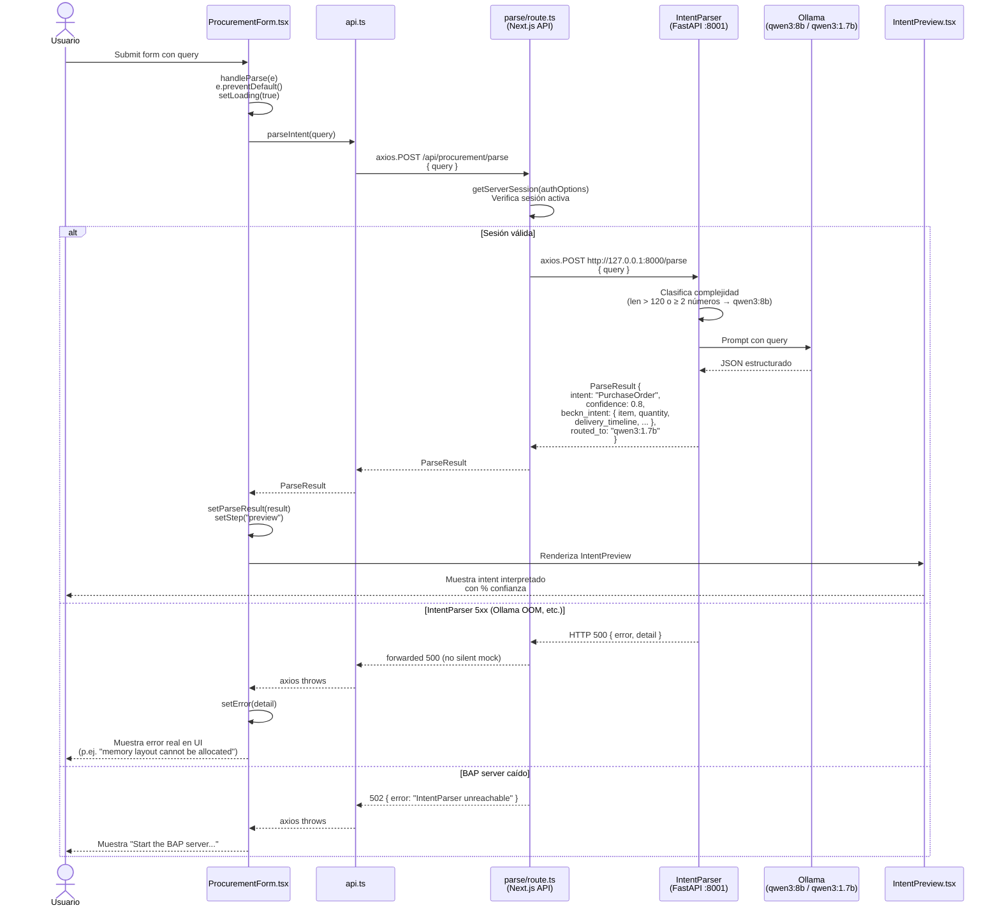
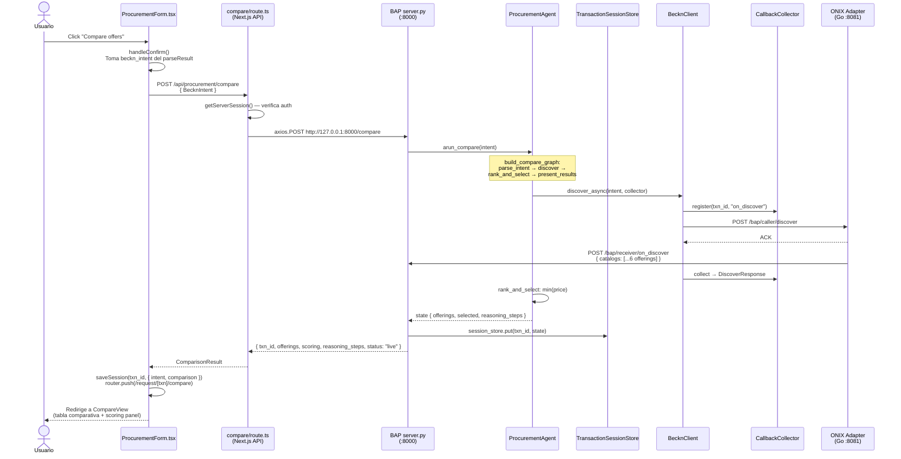
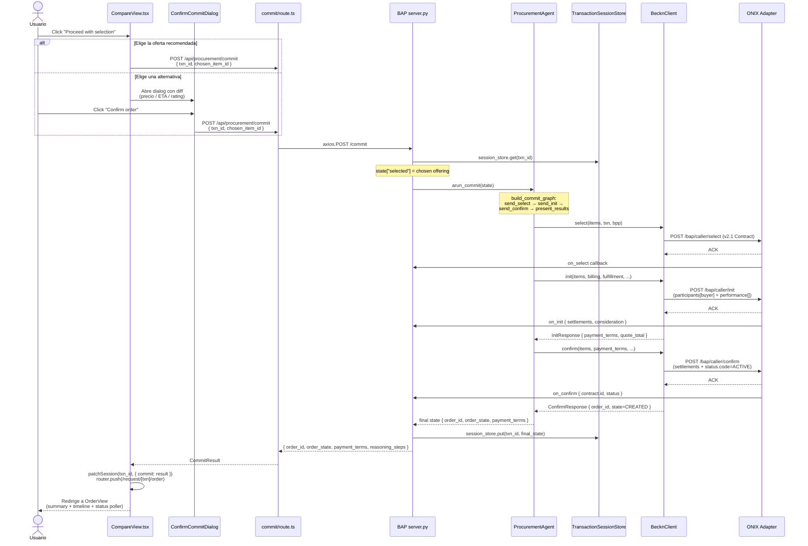
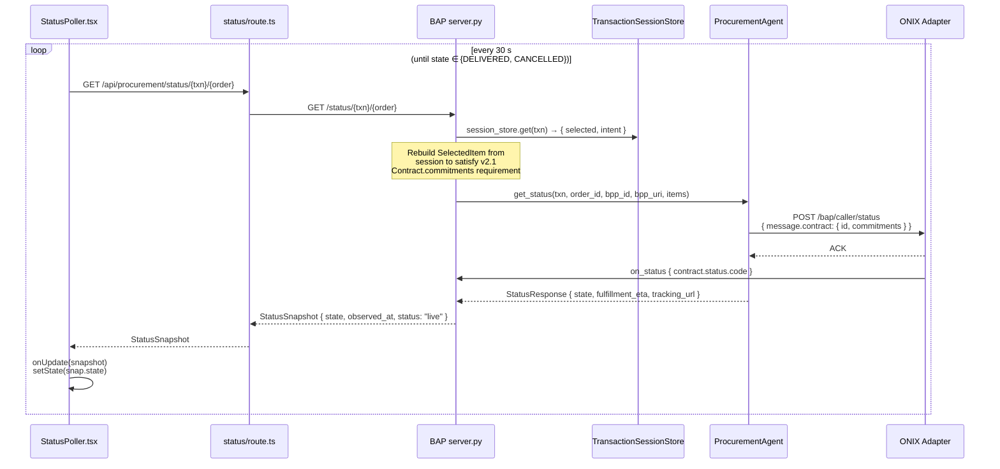
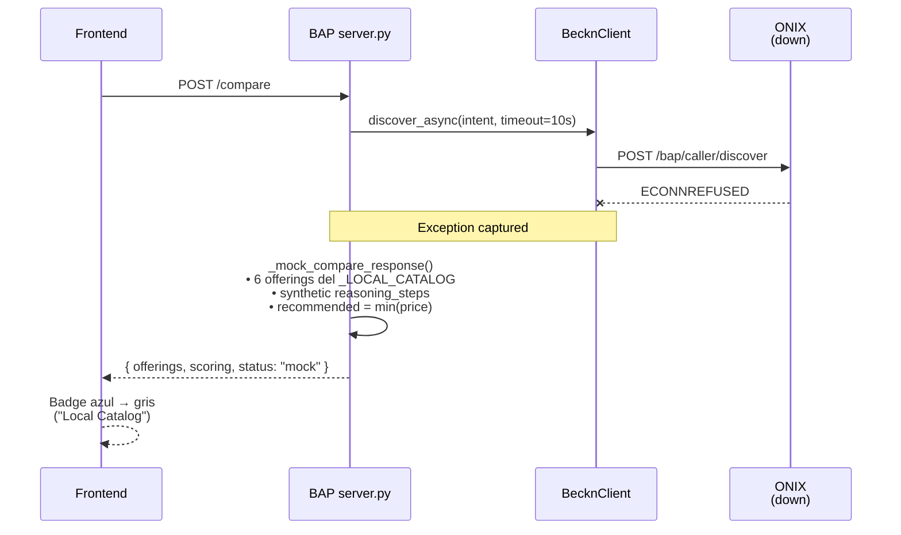
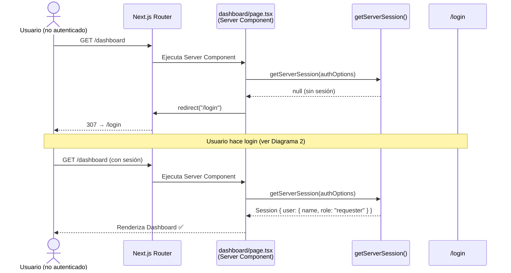

# Diagramas de Secuencia — Procurement Agent Frontend

---

## 1. Flujo General (Overview)

Muestra todos los componentes del sistema y cómo se encadenan en el flujo completo de una solicitud de compra.

---

## 2. Autenticación (SSO Stub)

Detalle del flujo de login con NextAuth usando el proveedor Credentials (stub de Keycloak).

---

## 3. Parseo de Intent (NL → BecknIntent)

Detalle de cómo la query en lenguaje natural se convierte en un `BecknIntent` estructurado.

---

## 4. Compare — Con ONIX (Red Beckn Real)

Flujo de comparación cuando el Docker stack está corriendo. El endpoint `/compare` ejecuta `arun_compare()` (parse_intent + discover + rank_and_select), guarda el estado en `TransactionSessionStore`, y devuelve las offerings con scoring + reasoning trace.

---

## 5. Commit — Usuario confirma y se ejecuta la transacción

Después de la comparación, el usuario elige una oferta y hace `/commit`. El BAP ejecuta `arun_commit()` (send_select + send_init + send_confirm) y devuelve el `order_id` real del BPP.

---

## 6. Status polling — Después de la orden confirmada

El `StatusPoller.tsx` hace un GET cada 30s. El servidor reconstruye `items` desde la sesión (la v2.1 Contract schema requiere `commitments` en todos los mensajes, también `/status`).

---

## 7. Fallback — ONIX / Docker offline

Todos los endpoints `/compare`, `/commit`, `/status` caen a mock fallback si ONIX falla — así la UI funciona standalone para demos. Badge en la UI: "Local Catalog" en vez de "Live Beckn Network".

El mismo patrón aplica a `/commit` (`_mock_commit_response` → genera `mock-order-<hex>`) y `/status` (echo del último estado almacenado).

---

## 6. Protección de Rutas (AuthGuard)

Cómo Next.js protege las páginas y API routes para usuarios no autenticados.

---

## Referencia de Componentes

| Componente | Tipo | Archivo | Responsabilidad |
|---|---|---|---|
| `LoginForm` | Client | `components/auth/LoginForm.tsx` | Form de login, botones demo |
| `AuthGuard` | Client | `components/auth/AuthGuard.tsx` | Protege rutas client-side |
| `Navbar` | Client | `components/layout/Navbar.tsx` | Nav con usuario y rol |
| `ProcurementForm` | Client | `components/procurement/ProcurementForm.tsx` | Flujo en 3 pasos |
| `IntentPreview` | Server-compatible | `components/procurement/IntentPreview.tsx` | Muestra BecknIntent parseado |
| `Providers` | Client | `components/Providers.tsx` | Wraps SessionProvider |
| `parse/route.ts` | API Route | `app/api/procurement/parse/route.ts` | Proxy → IntentParser |
| `discover/route.ts` | API Route | `app/api/procurement/discover/route.ts` | Proxy → BAP |
| `auth.ts` | Config | `lib/auth.ts` | SSO stub (Credentials provider) |
| `types.ts` | Types | `lib/types.ts` | BecknIntent, ParseResult, UserRole |
| `api.ts` | Client | `lib/api.ts` | Funciones HTTP del browser |
