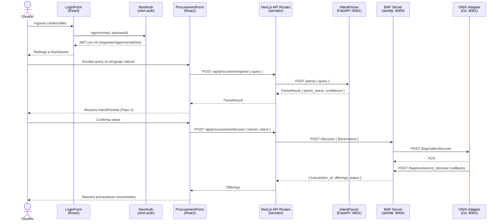
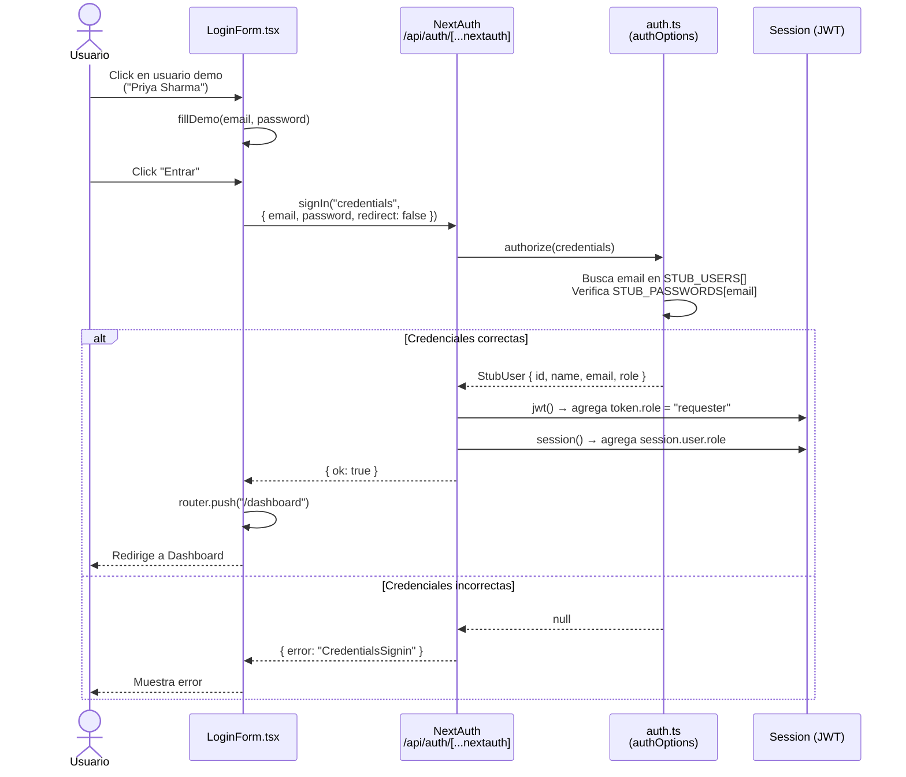
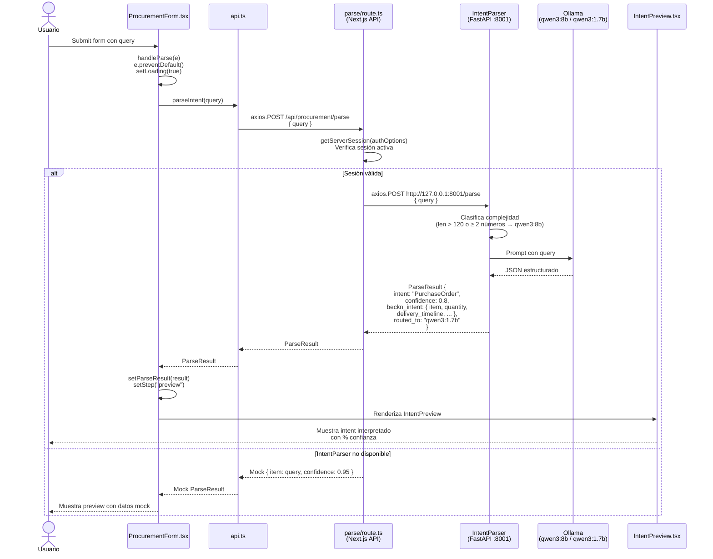
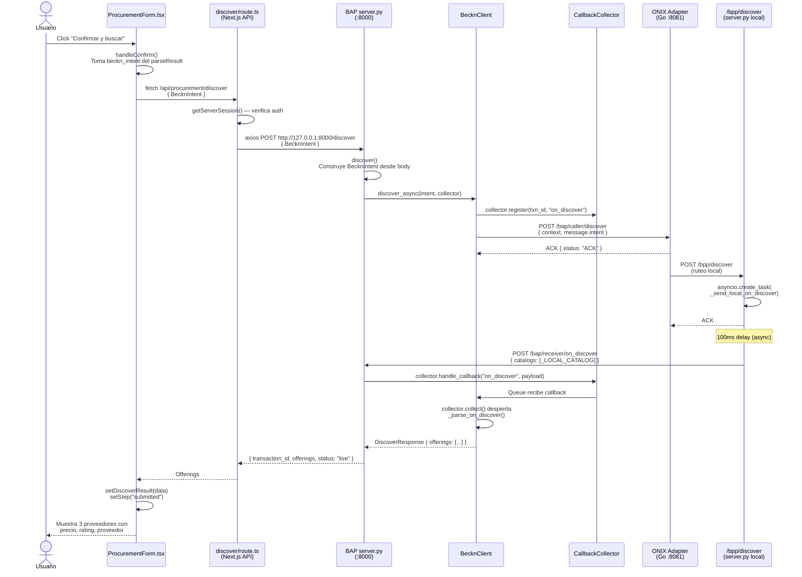
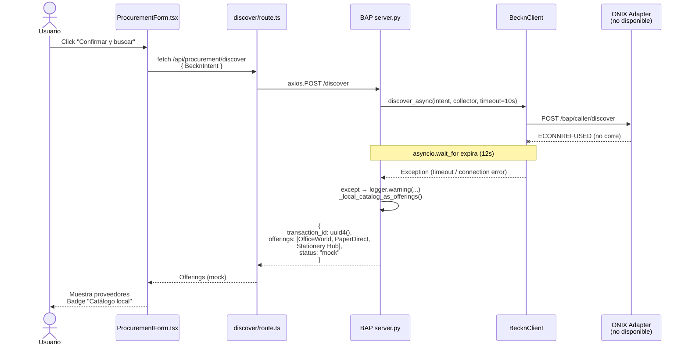
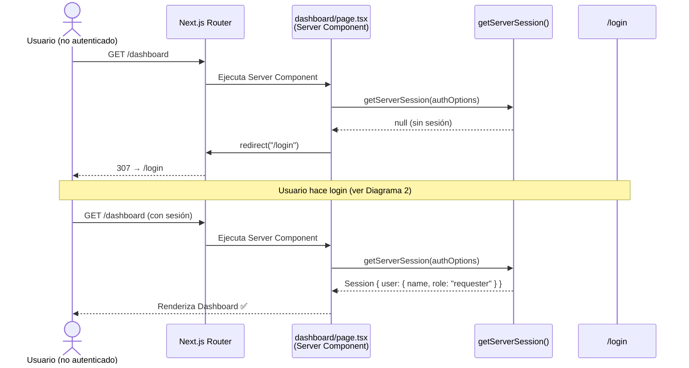

# Diagramas de Secuencia — Procurement Agent Frontend

---

## 1. Flujo General (Overview)

Muestra todos los componentes del sistema y cómo se encadenan en el flujo completo de una solicitud de compra.

---

## 2. Autenticación (SSO Stub)

Detalle del flujo de login con NextAuth usando el proveedor Credentials (stub de Keycloak).

---

## 3. Parseo de Intent (NL → BecknIntent)

Detalle de cómo la query en lenguaje natural se convierte en un `BecknIntent` estructurado.

---

## 4. Discovery — Con ONIX (Red Beckn Real)

Flujo completo cuando el Docker stack está corriendo. Usa callbacks async de Beckn v2.

---

## 5. Discovery — Sin ONIX (Fallback a Catálogo Local)

Cuando ONIX no está corriendo. El BAP captura el timeout y responde con el catálogo hardcodeado.

---

## 6. Protección de Rutas (AuthGuard)

Cómo Next.js protege las páginas y API routes para usuarios no autenticados.

---

## Referencia de Componentes

| Componente | Tipo | Archivo | Responsabilidad |
|---|---|---|---|
| `LoginForm` | Client | `components/auth/LoginForm.tsx` | Form de login, botones demo |
| `AuthGuard` | Client | `components/auth/AuthGuard.tsx` | Protege rutas client-side |
| `Navbar` | Client | `components/layout/Navbar.tsx` | Nav con usuario y rol |
| `ProcurementForm` | Client | `components/procurement/ProcurementForm.tsx` | Flujo en 3 pasos |
| `IntentPreview` | Server-compatible | `components/procurement/IntentPreview.tsx` | Muestra BecknIntent parseado |
| `Providers` | Client | `components/Providers.tsx` | Wraps SessionProvider |
| `parse/route.ts` | API Route | `app/api/procurement/parse/route.ts` | Proxy → IntentParser |
| `discover/route.ts` | API Route | `app/api/procurement/discover/route.ts` | Proxy → BAP |
| `auth.ts` | Config | `lib/auth.ts` | SSO stub (Credentials provider) |
| `types.ts` | Types | `lib/types.ts` | BecknIntent, ParseResult, UserRole |
| `api.ts` | Client | `lib/api.ts` | Funciones HTTP del browser |
