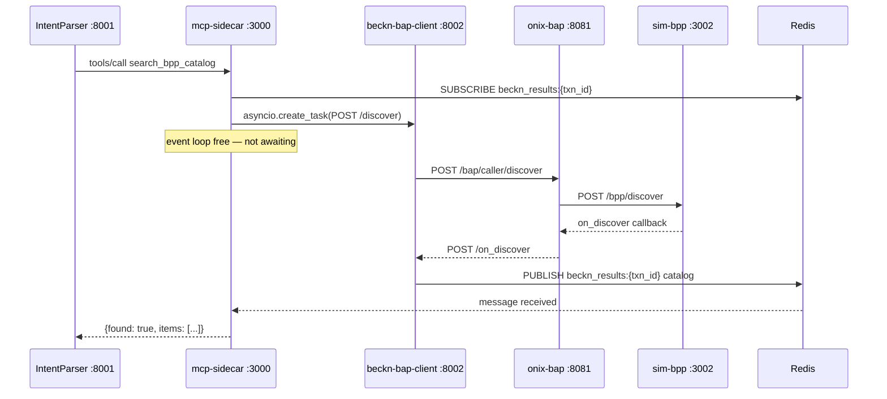

# Project Overview — Agentic AI Procurement Agent on Beckn Protocol

## 1. What This System Does

The Procurement Agent is an event-driven agentic AI system that accepts natural-language purchase requests from corporate buyers and translates them into fully validated Beckn Protocol v2.0.0 transactions. Given a query such as `"300 meters Cat6 UTP cable Mumbai 5 days"`, the system classifies intent, extracts structured procurement parameters, discovers matching suppliers on a Beckn network, scores and ranks their offers using an ML model, optionally negotiates price, obtains ERP budget approval, and drives the full Beckn lifecycle — `discover → select → init → confirm → status` — persisting every decision to an auditable PostgreSQL database.

The system replaces closed procurement platforms (SAP Ariba, Coupa) with an open-protocol stack where any Beckn-compatible supplier can participate without bilateral integration agreements.

(Source: CLAUDE.md -- Confidence: High)

---

## 2. Users and Use Cases

### Primary User

**Corporate buyer** — a procurement professional or knowledge worker who needs to source goods or services on behalf of their organisation. The buyer interacts through a Next.js web dashboard; they do not write code or issue Beckn API calls directly.

### Use Cases with Cycle-Time Examples

| Use Case | Without System | With System | Notes |
|---|---|---|---|
| Routine office supply reorder (paper, pens) | 5–7 business days | ~45 seconds | Autonomous mode; auto-approved under threshold |
| IT equipment procurement (laptop, server) | 3–4 weeks | ~2 business days | Advisory mode; human approves recommendation |
| Emergency PPE purchase | 4–6 hours | ~3 minutes | CFO fast-track; 60-minute approval deadline |
| CPO competitive benchmarking | 2 weeks manual | ~4 hours | Compare contracted price vs live Beckn market |
| Government/regulated procurement | 15–30 days | 2–3 days | Full audit trail; 7-year retention; SOX 404 compliant |

(Source: KnowledgeBase/project_scaffold/milestones -- Confidence: High)

### Execution Modes

The system supports three operating modes controlled by the `PROCUREMENT_EXECUTION_MODE` environment variable:

- **advisory** — agent surfaces ranked options; buyer selects manually.
- **hitl** (human-in-the-loop) — agent recommends; human approves before any Beckn commit is issued.
- **autonomous** — agent commits automatically when the order value is within the requester's approval threshold and ERP budget is available.

(Source: services/orchestrator/README.md -- Confidence: High)

---

## 3. Project Scope

### Programme Context

This system was built during a 16-week Infosys InStep internship by a team of four engineers (Eduardo, Emi, Cris, Lalo). It is the reference implementation of a Beckn Application Platform (BAP) that Infosys intends to productise for enterprise procurement clients.

Target market: $9.5 B global enterprise procurement software market (IDC 2025), with a $30–100 M Infosys pipeline target from 15–20 enterprise deployments at $2–5 M each.
(Source: KnowledgeBase/project_scaffold/milestones/phase4_hardening_production.md -- Confidence: Medium)

### Phase Breakdown

| Phase | Weeks | Theme | Key Deliverables | Status |
|---|---|---|---|---|
| 1 | 1–4 | Foundation & Protocol Integration | ONIX Go adapter, core API flows (discover + select), NL Intent Parser (Stage 1+2), LangGraph agent framework, Beckn sandbox | Complete |
| 2 | 5–8 | Core Intelligence & Transaction Flow | Six microservices extracted, catalog normaliser, data normaliser (persistence bridge), comparative scoring, orchestrator pipeline state machine, full Beckn lifecycle (init + confirm + status) | Complete |
| 3 | 9–12 | Advanced Intelligence & Enterprise Features | Agent memory (pgvector RAG), audit trail (SOX 404), ERP integration (budget gate + PO push), negotiation engine (LangGraph), analytics dashboard | Complete (current branch: `phase3`) |
| 4 | 13–16 | Hardening & Production Readiness | K8s Helm chart, OWASP pen test, ≥80 % integration coverage, ≥85 % eval accuracy, CI/CD pipeline, observability stack | Not started |

(Source: KnowledgeBase/project_scaffold/milestones -- Confidence: High)

### Current Status (as of 2026-07-07)

The `phase3` branch contains all Phase 1–3 feature code. The system runs locally as an 18-container Docker Compose stack plus two unbundled local processes (IntentParser at :8001, mcp-sidecar at :3000). Phase 4 hardening work has not begun. The current deployment model is a single developer workstation; no cloud or Kubernetes infrastructure is deployed.

---

## 4. Key Architectural Choices

The table below covers the eight most impactful implementation decisions. All deviate from the original spec document in some respect; those deviations are formally recorded in `KnowledgeBase/project_scaffold/implementation_deviations.md`.

| Decision | What Was Chosen | Why (one line) |
|---|---|---|
| Async Beckn discovery decoupling | Redis Pub/Sub on `beckn_results:{txn_id}` channels (ADR-0001) | Beckn v2.0.0 `POST /discover` returns only an ACK; catalog arrives via webhook; a synchronous wait deadlocks the asyncio event loop |
| Primary LLM | qwen3:8b / qwen3:1.7b via local Ollama (complexity-routed) | Zero cost, offline operation, data sovereignty, quality sufficient for structured JSON extraction; GPT-4o was the spec but is cloud-only |
| Fallback LLM for broadening | Claude Sonnet 4.6 (opt-in, Stage 3 only) | Used solely when pgvector ANN and MCP sidecar both fail to validate an item; requires `ANTHROPIC_API_KEY`; not on the hot path |
| Vector store | pgvector in PostgreSQL 16 (two tables: BPP semantic cache + agent memory) | Pilot corpus < 100 K records; pgvector HNSW cosine is sufficient; eliminates a separate Qdrant dependency; spec called for Qdrant |
| ERP event bus | PostgreSQL outbox pattern (`erp_sync_records` table with `FOR UPDATE SKIP LOCKED` worker) | Kafka broker not yet deployed; outbox is operationally equivalent and simpler; `kafka_offset` column reserved as a migration path |
| Audit event bus | Direct PostgreSQL insert to `audit_trail_events` | Same Kafka deferral rationale; `kafka_offset` and `splunk_indexed` columns are placeholder hooks for Phase 4 |
| BPP network | sim-bpp (local Node.js, port 3002) replacing `fidedocker/sandbox-2.0` | sandbox-2.0 had a fixed catalog; sim-bpp hot-reloads `catalog.json`, supports AND-token catalog matching, and drives an auto-advance fulfillment lifecycle |
| Beckn network routing (DeDi bypass) | `targetType: url` in all ONIX routing YAMLs | Bypasses the DeDi registry so the full Beckn flow runs inside the local Docker bridge network without real network registration; a one-line config change re-enables registry lookup for production |
| ONIX schema validator pin | Commit `d43ec30d` | Later ONIX commits introduced a `$ref` resolution bug in `SignatureHeader`; pinning preserves correct ED25519 signing validation |
| Container orchestration | Docker Compose (18 services, `beckn_network` bridge) | Kubernetes EKS/AKS is the Phase 4 target; Compose is the development-grade equivalent with zero cloud spend |

(Source: CLAUDE.md, KnowledgeBase/project_scaffold/implementation_deviations.md, docs/architecture/decisions/0001-use-redis-pubsub-for-async-beckn-responses.md -- Confidence: High)

### Discovery Flow (Redis Pub/Sub)

The following diagram shows how the Redis Pub/Sub decoupling solves the async deadlock. Without it, the MCP sidecar would block its asyncio event loop waiting for a Beckn callback that can never arrive.



(Source: docs/architecture/decisions/0001-use-redis-pubsub-for-async-beckn-responses.md -- Confidence: High)

---

## 5. What Is and Is Not in Production

### Service Deployment Status

| Service | Port | Deployed How | Status |
|---|---|---|---|
| intention-parser | 8001 | Docker container (or local uvicorn) | Running (Phase 1) |
| beckn-bap-client | 8002 | Docker container | Running (Phase 1) |
| comparative-scoring | 8003 | Docker container | Running (Phase 2); ML backend optional |
| orchestrator | 8004 (also 8000) | Docker container | Running (Phase 2) |
| catalog-normalizer | 8005 | Docker container | Running (Phase 2) |
| data-normalizer | 8006 | Docker container | Running (Phase 2) |
| erp-adapter | 8007 | Docker container | Running (Phase 3) |
| erp-mock | 8008 | Docker container | Running (Phase 3) |
| analytics | 8009 | Docker container | Running (Phase 3) |
| notification-dispatcher | 8010 | Docker container (no host port) | Running (Phase 3) |
| onix-bap | 8081 | Docker container (`fidedocker/onix-adapter`) | Running (Phase 1) |
| onix-bpp | 8082 | Docker container (`fidedocker/onix-adapter`) | Running (Phase 1) |
| sim-bpp | 3002 | Docker container | Running (Phase 1) |
| negotiation-engine | 18004 (container: 8004) | Docker container | Running (Phase 3) |
| demo-gateway (frontend_demo_gateway) | 8015 | Docker container | Running (Phase 3) |
| redis | 6379 | Docker container | Running (Phase 1) |
| kafka | 9092 | Docker container (KRaft mode) | Running (Phase 3) |
| postgres (negotiation DB only) | 55432 | Docker container | Running (Phase 3) |
| **mcp-sidecar** | **3000** | **Local uvicorn only (not Dockerised)** | Running (Phase 1 Stage 3) |
| **IntentParser** | **8001** | **Local uvicorn or Docker** | Running (Phase 1) |
| **frontend** | **3000** | **npm run dev (not Dockerised)** | Running (Phase 2+) |
| **claude_openai_proxy** | **8012** | **Local uvicorn only, loopback-bound** | Required for negotiation demo flows |
| **main PostgreSQL** (procurement_agent DB) | **5432** | **Native host install** | Required; not a Docker container |
| prediction-api (MLOps) | 8004 | Separate `docker-compose.mlops.yaml` | Optional; Phase 2 ML scoring |

(Source: docker-compose.yml, CLAUDE.md, services/*/README.md -- Confidence: High)

> **Important:** The `postgres` service defined in `docker-compose.yml` (host port 55432) is **exclusively** the negotiation-engine's LangGraph checkpoint database (`negotiation` DB). The main `procurement_agent` PostgreSQL database runs natively on the host and is reached by all other Docker services via `host.docker.internal:5432`.
>
> (Source: docker-compose.yml lines 453-464 -- Confidence: High)

### What Is Complete (Phases 1–3)

- Full Beckn lifecycle: `discover → select → init → confirm → status`.
- NL Intent Parser: three-stage pipeline (LLM classify → LLM extract → hybrid pgvector ANN + MCP sidecar validate).
- Six-service microservices pipeline on the Step Functions pattern.
- Catalog normalisation: five format variants, LLM fallback via Ollama.
- Comparative scoring: Phase 1 cheapest-wins heuristic live; Phase 2 RankNet ML backend available via optional MLOps sub-stack.
- Agent memory: pgvector RAG with BAAI/bge-small-en-v1.5 embeddings; time-decayed loyalty bonuses in scoring.
- Audit trail: 9 event types, 7-year retention, SOX 404-ready, frontend timeline view.
- ERP integration: budget gate (synchronous ≤800 ms), PO push outbox, dual-HMAC webhook rotation, per-vendor circuit breakers, SAP + Oracle + mock surfaces.
- Autonomous price negotiation: LangGraph state machine with three-layer guardrails (20 % hard cap).
- Approval workflow: RBAC threshold routing (auto / manager / CFO / emergency).
- Real-time order tracking: WebSocket + sim-bpp auto-advance lifecycle.
- Analytics dashboard: spend, cycle time, supplier metrics, CPO benchmarking.
- Notification fan-out: Kafka → Slack Block Kit, Teams Adaptive Card, email SMTP.
- Frontend: Next.js 13 dashboard with wizard flow, audit trail panel, reasoning steps panel.

### What Is Deferred to Phase 4 (Not Yet Built)

| Item | Current State | Phase 4 Plan |
|---|---|---|
| Kubernetes / Helm | Docker Compose 18-container single host | EKS/AKS/GKE + Helm chart + ArgoCD GitOps |
| CI/CD pipeline | Manual `docker compose up` | GitHub Actions lint → test → build → Helm |
| Kafka event bus (ERP + audit) | `kafka_offset` placeholder columns | Full Kafka producer/consumer with 7-year retention, replication ≥ 3 |
| LangSmith LLM tracing | `reasoning_payload` JSONB captures data locally | LangSmith per-call trace export |
| Splunk / ServiceNow SIEM sink | `splunk_indexed` flag column; no exporter | Kafka consumer → Splunk/ServiceNow |
| Retention enforcement job | `retention_until` timestamp exists | Nightly DELETE/archival cron job |
| OWASP pen test | Not run | Gate for production readiness |
| Integration test coverage ≥ 80 % | Partial; several services have zero tests | Full test suite expansion |
| Model governance weekly eval | Schema (`model_governance_records`) created | Weekly 100-scenario eval via GitHub Actions |
| mTLS to SAP/Oracle | SSL context hook wired, not activated | Activated with production certificates |

(Source: KnowledgeBase/project_scaffold/implementation_deviations.md, CLAUDE.md -- Confidence: High)

### What Runs Only Locally (Never Dockerised)

The following processes must be started manually on the developer workstation; they are not in `docker-compose.yml` and are not reachable from within Docker containers except via `host.docker.internal`:

```bash
# MCP sidecar — required for IntentParser Stage 3 validation
cd services/mcp-sidecar
BAP_API_KEY="any-value" REDIS_URL=redis://localhost:6379 REDIS_RESULT_TIMEOUT=15 \
  uvicorn server:app --port 3000

# IntentParser (alternative to the Docker wrapper)
cd IntentParser
uvicorn api:app --port 8001 --reload

# Claude OpenAI proxy — required for demo-gateway + negotiation-engine LLM calls
export CLAUDE_PROXY_KEY=your-key
uvicorn services.claude_openai_proxy.main:app --host 0.0.0.0 --port 8012

# Frontend
cd frontend && npm run dev   # http://localhost:3000
```

(Source: CLAUDE.md, services/claude_openai_proxy/README.md, services/claude_openai_proxy/claude-proxy.service -- Confidence: High)

> **Note on the claude_openai_proxy service:** This service is absent from `docker-compose.yml` by design — it must invoke the host-installed `claude` CLI binary using credentials stored in `~/.claude/.credentials.json`, which are inaccessible from within Docker containers. It must be running on the host for the autonomous negotiation demo flow (demo-gateway → negotiation-engine → SupplierAgent) to function. It is documented in `services/claude_openai_proxy/README.md` but is not mentioned in `CLAUDE.md` or any other top-level document.
>
> (Source: services/claude_openai_proxy/README.md, services/claude_openai_proxy/claude-proxy.service -- Confidence: High)

---

## 6. Known Limitations and Deviations from Spec

The following table summarises the most consequential gaps between the original KnowledgeBase spec and the as-built implementation. The full list is in `KnowledgeBase/project_scaffold/implementation_deviations.md`.

| Spec | As-Built | Impact |
|---|---|---|
| GPT-4o primary LLM | qwen3:8b via local Ollama | Quality difference on ambiguous queries; no cloud billing |
| text-embedding-3-large (3072 dims) | all-MiniLM-L6-v2 + BAAI/bge-small-en-v1.5 (384 dims each) | Reduced semantic recall; no external API dependency |
| Qdrant vector store | pgvector only | Simpler ops; adequate for < 100 K records |
| Kafka audit + ERP event bus | PostgreSQL outbox + placeholder columns | No real-time streaming; retention not enforced yet |
| Kubernetes orchestration | Docker Compose single host | Not production-scale; no auto-healing or rolling deploys |
| Keycloak full OIDC | Phase Two (phasetwo.io) hosted Keycloak at `euc1.auth.ac` | Requires a live Phase Two tenant; no offline dev auth |
| `embedding_model_type` ENUM in DB | Contains only `text-embedding-3-large` and `e5-large-v2` | Migration 22 adds `all-MiniLM-L6-v2`; `BAAI/bge-small-en-v1.5` is missing; inserts using the actual model name fail unless the ENUM is further extended (Inferred risk from code reading) |
| COMPLEX_MODEL=qwen3:8b (code default) | docker-compose.yml overrides to qwen3:1.7b | Complexity routing silently disabled in the Docker deployment; qwen3:8b is never invoked in the containerised service |

(Source: KnowledgeBase/project_scaffold/implementation_deviations.md, docker-compose.yml, database/sql/00_extensions_and_types.sql -- Confidence: High)
