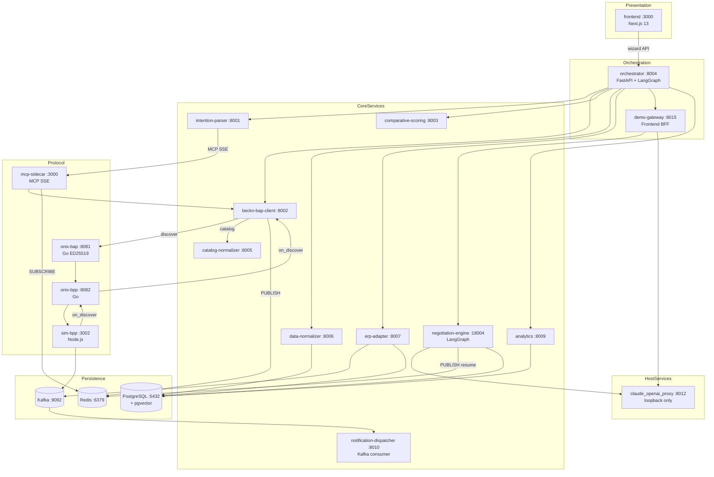
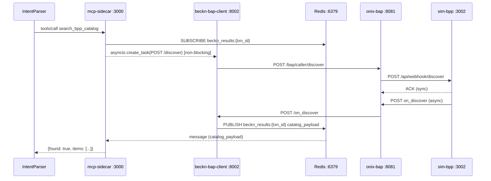
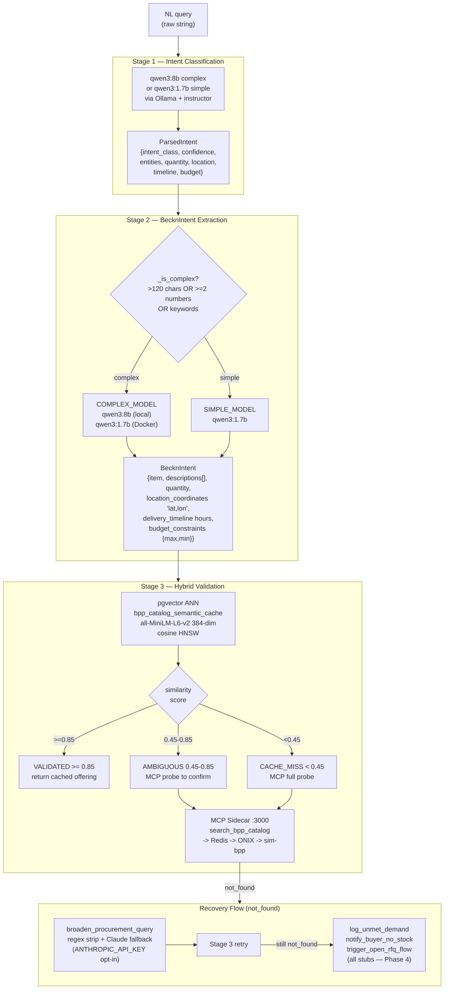
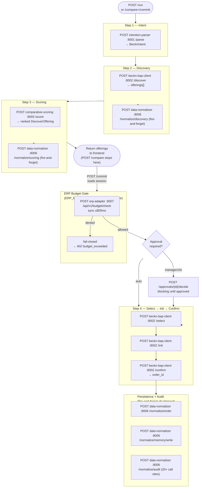
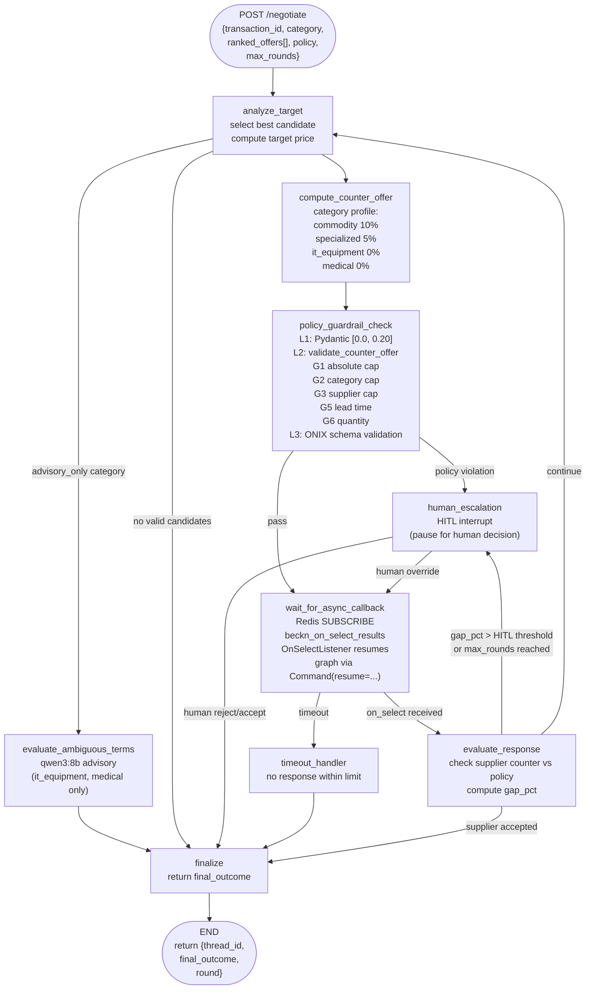
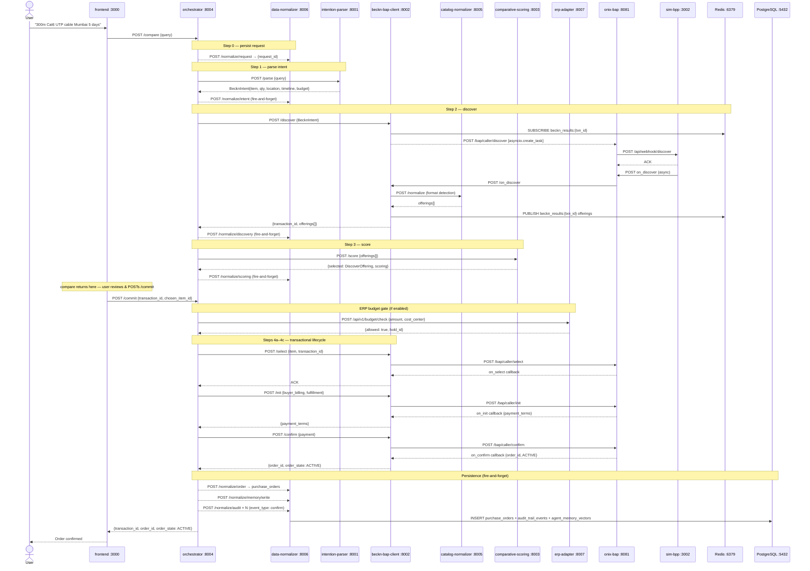

# Architecture

## 1. Overall Pattern

The system is an event-driven microservices monorepo that translates natural-language purchase requests into validated Beckn Protocol v2.0.0 transactions. Two local Python services run outside Docker (IntentParser on :8001, mcp-sidecar on :3000); sixteen containers run on a bridged Docker network called `beckn_network`. (Source: CLAUDE.md -- Confidence: High)

Redis Pub/Sub is the critical async decoupling layer. Beckn discovery is inherently asynchronous — `POST /discover` returns only an ACK and the catalog arrives later via an `on_discover` webhook. Rather than hold an HTTP connection open (which blocks the asyncio event loop), the system subscribes to a per-transaction Redis channel before firing the request and resolves the channel when the callback arrives. This is the central architectural decision in the codebase. (Source: docs/architecture/decisions/0001-use-redis-pubsub-for-async-beckn-responses.md -- Confidence: High)

The single formal ADR in the repository (ADR-0001) covers this Redis Pub/Sub pattern. Major technology substitutions from the original spec — pgvector over Qdrant, qwen3 over GPT-4o, sim-bpp over sandbox-2.0, PostgreSQL outbox over Kafka — are recorded informally in `KnowledgeBase/project_scaffold/implementation_deviations.md` rather than as additional ADRs. (Source: KnowledgeBase/project_scaffold/implementation_deviations.md -- Confidence: High)

---

## 2. Logical Layers

The architecture has five logical layers from presentation to storage.

| Layer | Services | Technology |
|---|---|---|
| **Presentation** | frontend :3000 | Next.js 13.5.6, Tailwind, shadcn/ui, Radix UI |
| **Orchestration** | orchestrator :8004, demo-gateway :8015 | FastAPI, LangGraph |
| **Core Services** | intention-parser :8001, beckn-bap-client :8002, catalog-normalizer :8005, comparative-scoring :8003, erp-adapter :8007, erp-mock :8008, analytics :8009, notification-dispatcher :8010, negotiation-engine :18004 | FastAPI, aiohttp, Python 3.11+ |
| **Protocol Adapters** | onix-bap :8081, onix-bpp :8082, sim-bpp :3002, mcp-sidecar :3000 | Go (ONIX), Node.js (sim-bpp), Python FastMCP (mcp-sidecar) |
| **Persistence** | PostgreSQL :5432 (native host), Redis :6379, pgvector extension | PostgreSQL 16 + pgvector 0.7.0, Redis 7, asyncpg |

(Source: CLAUDE.md, docker-compose.yml -- Confidence: High)

The `claude_openai_proxy` service (:8012) runs as a loopback-only host process (not Dockerized) wrapping the Claude Code CLI as an OpenAI-compatible endpoint. Two services depend on it at runtime: `negotiation-engine` (via `NEGOTIATION_OPENAI_BASE_URL=http://host.docker.internal:8012/v1`) and `demo-gateway` (via `OLLAMA_BASE_URL=http://host.docker.internal:8012/v1`). It is absent from `docker-compose.yml` and requires manual startup. (Source: services/claude_openai_proxy/README.md, docker-compose.yml -- Confidence: High)

**Port collision notes.** The `orchestrator` container maps both `:8000` and `:8004` on the host (`:8000` matches the default `BAP_URL` used by the Next.js frontend; `:8004` is used for direct testing). The `negotiation-engine` container uses `:18004` on the host to avoid colliding with orchestrator's `:8004`. The `discovery_engine` service at `services/discovery_engine/` is fully implemented but has no entry in `docker-compose.yml` and is not called by any other service — it is an orphaned implementation of multi-network fan-out discovery. (Source: docker-compose.yml, services/discovery_engine/README.md -- Confidence: High)

---

## 3. Beckn Protocol Integration

### 3.1 ONIX Adapter Pair

All Beckn traffic passes through two Go adapters from the `fidedocker/onix-adapter` image. Direct BPP connections are forbidden. (Source: CLAUDE.md -- Confidence: High)

| Adapter | Port | Role | Middleware chain |
|---|---|---|---|
| `onix-bap` | 8081 | BAP-side | `validateSign` → `addRoute` → `validateSchema` (receiver); `addRoute` → `sign` → `validateSchema` (caller) |
| `onix-bpp` | 8082 | BPP-side | Same pattern, inverted direction |

Six YAML files in `config/` wire the routing. Key rules:

- Target URLs in routing YAMLs must **not** include the action name — ONIX appends it automatically. `http://sim-bpp:3002/api/webhook` + action `discover` → `http://sim-bpp:3002/api/webhook/discover`. Including the action causes a 404. (Source: CLAUDE.md, config/README.md -- Confidence: High)
- All routing uses `targetType: url` to bypass the DeDi registry, enabling full Beckn flow inside the Docker network. (Source: config/README.md -- Confidence: High)
- The ONIX schema validator is pinned to commit `d43ec30d`. Later commits introduced a `$ref` resolution bug in `SignatureHeader`. Do not upgrade without an end-to-end signing test. (Source: config/README.md -- Confidence: High)
- `on_discover` uses a split routing rule: it routes to `http://beckn-bap-client:8002` directly (ONIX appends `/on_discover`), while all other `on_*` callbacks go to `http://beckn-bap-client:8002/bap/receiver`. This is required for the Redis Pub/Sub path. (Source: config/README.md -- Confidence: High)

### 3.2 Async Discovery — ADR-0001

The deadlock problem: the MCP sidecar must fire `/discover` and return a catalog synchronously to IntentParser, but Beckn v2.0.0 returns only an ACK — the catalog arrives later via webhook. Holding the HTTP connection open blocks the asyncio event loop; the `on_discover` callback can never be received.

**Resolution:** Redis Pub/Sub on `beckn_results:{transaction_id}`. The five-step protocol:

1. Generate a UUID `transaction_id`.
2. **Subscribe** to `beckn_results:{transaction_id}` before sending anything.
3. Fire `POST /discover` as `asyncio.create_task(...)` — never `await`. (Source: CLAUDE.md, ADR-0001 -- Confidence: High)
4. The `on_discover` handler in `beckn-bap-client` publishes the catalog payload to `beckn_results:{transaction_id}`.
5. The sidecar's Redis subscriber receives the message and returns the catalog to IntentParser.

The `/on_discover` handler also calls `CallbackCollector.handle_callback("on_discover", payload)` in parallel, so the orchestrator path (which uses `CallbackCollector` directly) is also unblocked by the same webhook. (Source: services/beckn-bap-client/README.md -- Confidence: High)

**Failure mode:** if Redis is unavailable, `/on_discover` logs a warning and falls through to `CallbackCollector` only. The mcp-sidecar times out after `REDIS_RESULT_TIMEOUT` seconds (default 15 s) and returns `{"found": false, "items": []}`. (Source: services/beckn-bap-client/README.md -- Confidence: High)

---

## 4. IntentParser 3-Stage Pipeline

Natural language is processed in three sequential stages. Stages 1 and 2 are always executed; Stage 3 runs only on the `/parse/full` endpoint and when the mcp-sidecar is reachable. (Source: IntentParser/README.md -- Confidence: High)

**Canonical field encodings enforced by BecknIntent** (Source: shared/README.md -- Confidence: High):

| Field | Encoding | Example |
|---|---|---|
| `delivery_timeline` | `int` hours | `72` (not `"P3D"`) |
| `location_coordinates` | `"lat,lon"` decimal string | `"12.9716,77.5946"` |
| `budget_constraints` | `BudgetConstraints(max, min)` typed | `{"max": 200.0, "min": 0.0}` |

**Docker vs local LLM routing.** In Docker (`intention-parser` container), both `COMPLEX_MODEL` and `SIMPLE_MODEL` are set to `qwen3:1.7b` in `docker-compose.yml`, collapsing the two-tier routing. The `qwen3:8b` model is only used when IntentParser is run locally. (Source: docker-compose.yml lines 14–15, IntentParser/config.py -- Confidence: High)

---

## 5. LangGraph State Machines

### 5.1 Orchestrator Pipeline

The orchestrator drives procurement through a 4-step pipeline. Two execution modes are exposed: `/run` (full pipeline) and `/compare` + `/commit` (two-phase). (Source: services/orchestrator/README.md -- Confidence: High)

**Approval routing logic** (Source: KnowledgeBase/project_scaffold -- Confidence: High):

- `amount <= requester.approval_threshold` → auto-approved
- `amount > requester.threshold AND <= approver.threshold` → manager approval
- `amount > approver.threshold` → CFO approval
- `is_emergency = TRUE` → CFO + deadline in 60 minutes

**Autonomous negotiation path.** When `decision.requires_negotiation` is true on `/run`, the orchestrator calls `DEMO_GATEWAY_URL/api/demo/negotiate` (default `http://localhost:8015`) and polls `GET /api/demo/negotiate/{thread_id}`. The demo-gateway relays to `negotiation-engine:8004`. This path is only active on `/run`, not on the `/compare` + `/commit` two-phase flow. (Source: services/orchestrator/src/workflow.py code finding -- Confidence: High)

### 5.2 Negotiation Engine LangGraph

The negotiation engine is a LangGraph `StateGraph` with per-category discount profiles and three-layer guardrails. The absolute discount cap is 20% enforced at the Pydantic schema level. (Source: services/negotiation_engine/README.md -- Confidence: High)

**Checkpointing.** When `NEGOTIATION_POSTGRES_DSN` is set, `AsyncPostgresSaver` provides durable checkpointing; otherwise `MemorySaver` is used (state lost on restart). The negotiation Postgres database (container `postgres` on port 55432) is separate from the main `procurement_agent` database. (Source: services/negotiation_engine/README.md, docker-compose.yml -- Confidence: High)

**Async resume.** `OnSelectListener` subscribes to `Redis` channel `beckn_on_select_results` and calls `graph.ainvoke(Command(resume=payload))` to unpark the buyer graph. The supplier respond step is driven by `SupplierAgent` (Claude via `claude_openai_proxy :8012`) through `demo-gateway`. (Source: services/negotiation_engine/README.md -- Confidence: High)

---

## 6. Main Happy-Path Sequence

Full end-to-end flow for a natural-language procurement request terminating in a confirmed purchase order.

**Key invariants in this flow** (Source: CLAUDE.md -- Confidence: High):

- `transaction_id` is generated once and propagated through every layer. It must never be reused — Beckn channels are derived from it and reuse delivers one transaction's catalog to a stale subscriber.
- Beckn traffic always passes through `onix-bap:8081`. No service POSTs directly to `sim-bpp` or any external BPP.
- `data-normalizer` is the sole write path into PostgreSQL. All `_persist_*` calls in the orchestrator use fire-and-forget `asyncio.create_task` with a 5-second timeout and never raise on failure.
- `Contract.status.code` on `/confirm` must be `ACTIVE`, not `"CONFIRMED"`. Valid enum values are `DRAFT | ACTIVE | CANCELLED | COMPLETE`. ONIX rejects all others. (Source: Bap-1/CLAUDE.md -- Confidence: High)

---

## 7. Known Architectural Gaps

The following issues are documented in the codebase and affect system understanding:

| Issue | Location | Impact |
|---|---|---|
| `docs/ARCHITECTURE.md` (repo root) does not exist; 14 production blockers live in `Bap-1/docs/ARCHITECTURE.md §7` only | Bap-1/docs/ARCHITECTURE.md | Engineers searching repo root find nothing |
| `discovery_engine` service is fully implemented but has no `docker-compose.yml` entry and no callers | services/discovery_engine/ | Service is orphaned; port 8006 conflicts with data-normalizer |
| `claude_openai_proxy` (:8012) is absent from `docker-compose.yml` and CLAUDE.md; negotiation-engine and demo-gateway depend on it at runtime | services/claude_openai_proxy/ | Demo/negotiation flows fail silently if proxy not started manually |
| `embedding_model_type` ENUM in `00_extensions_and_types.sql` contains only `text-embedding-3-large` and `e5-large-v2`; actual models (`all-MiniLM-L6-v2`, `BAAI/bge-small-en-v1.5`) are absent; migration `22_agent_memory_vector_dim.sql` adds `all-MiniLM-L6-v2` but does not update the column DEFAULT | database/sql/00_extensions_and_types.sql, 15_agent_memory_vectors.sql | INSERT with actual model name fails without migration 22 applied |
| `COMPLEX_MODEL` default is `qwen3:8b` in `IntentParser/config.py` but `docker-compose.yml` overrides to `qwen3:1.7b`, silently disabling complexity routing in Docker | docker-compose.yml line 14 | Dockerized service always uses qwen3:1.7b regardless of query complexity |
| Orchestrator's autonomous negotiation defaults `DEMO_GATEWAY_URL` to `http://localhost:8015` but `frontend_demo_gateway` README states port 8005 | services/orchestrator/src/workflow.py line 55 | Autonomous negotiation fails unless env var is set correctly |
| Recovery flow stubs (`log_unmet_demand`, `notify_buyer_no_stock`, `trigger_open_rfq_flow`) are no-op logger calls with no owner or completion plan | IntentParser/recovery.py | `not_found` path silently drops procurement requests |

(Source: code_findings section -- Confidence: High)
