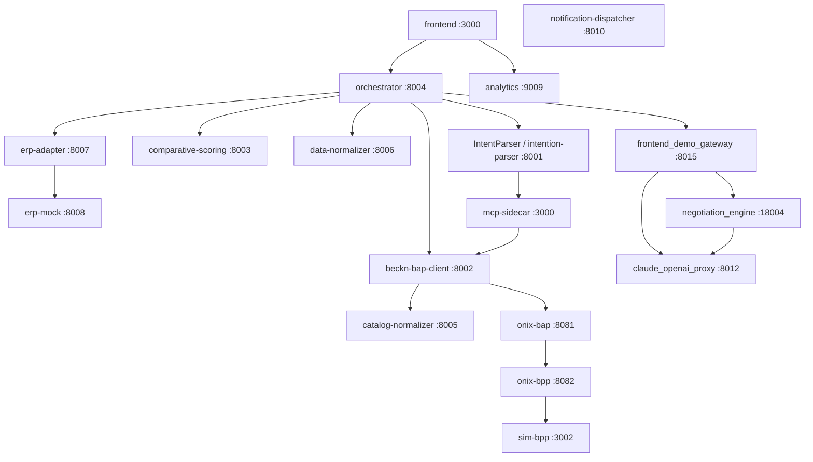

# Module Reference

Complete reference for every module in the Procurement Agent monorepo. Each section covers responsibility, port, run mode, inputs/outputs, internal structure, dependencies, and implementation notes.

---

## Architecture at a Glance

(Source: services/*/README.md, docker-compose.yml -- Confidence: High)

---

## IntentParser

**Responsibility.** Three-stage natural-language-to-BecknIntent pipeline. Stage 1 classifies buyer intent (procurement vs. out-of-scope) using an LLM. Stage 2 extracts a structured `BecknIntent` from confirmed procurement queries. Stage 3 validates the extracted intent against live BPP catalogs via a hybrid pgvector ANN cache and MCP sidecar probe, with a broadening/RFQ recovery flow for cache misses.

**Port and run mode.** Runs locally (not Dockerized at this path) on port 8001 via `uvicorn api:app --port 8001 --reload` inside the `infosys_project` conda environment. A separate Docker wrapper (`intention-parser`) exposes the same port inside the stack with Stage 3 disabled. (Source: IntentParser/README.md -- Confidence: High)

**Inputs / Outputs.**
- `POST /parse` — `{"query": str}` → `{"intent": str, "confidence": float, "beckn_intent": BecknIntent | null}`
- `POST /parse/batch` — `{"queries": [str]}` → list of above
- `POST /parse/full` — async; also runs Stage 3 validation and recovery; returns `{"status": "VALIDATED" | "AMBIGUOUS" | "NOT_FOUND", "beckn_intent": BecknIntent | null, "recovery_triggered": bool}`

**Key internal components.**

| File | Role |
|---|---|
| `api.py` | FastAPI entry point; routes to orchestrator.py |
| `orchestrator.py` | Three-stage pipeline runner; complexity routing (qwen3:8b vs qwen3:1.7b) |
| `llm_classifier.py` | Stage 1: LLM intent classification → ParsedIntent |
| `llm_extractor.py` | Stage 2: LLM BecknIntent extraction via instructor + Ollama |
| `stage3_validator.py` | Stage 3: pgvector ANN cache + MCP sidecar probe |
| `recovery.py` | Stub recovery flow (log, notify, RFQ); all three functions are stubs only |
| `config.py` | Env-driven config; COMPLEX_MODEL default qwen3:8b, SIMPLE_MODEL default qwen3:1.7b |

**Upstream dependencies.** Ollama (qwen3:8b and qwen3:1.7b), PostgreSQL 16 + pgvector (bpp_catalog_semantic_cache table), MCP sidecar :3000 (Stage 3 P2 path only), Claude Sonnet 4.6 via ANTHROPIC_API_KEY (opt-in Stage 3 broadening fallback only).

**Notable implementation details.**
- Complexity routing: queries >120 chars OR containing ≥2 numeric tokens OR procurement keywords → COMPLEX_MODEL (qwen3:8b locally; overridden to qwen3:1.7b in docker-compose.yml for both models). (Source: IntentParser/config.py, docker-compose.yml -- Confidence: High)
- Stage 3 thresholds are hardcoded: VALIDATED ≥ 0.85, AMBIGUOUS 0.45–0.85, CACHE_MISS < 0.45. They appear in config but are not env-configurable. (Source: IntentParser/README.md -- Confidence: High)
- `recovery.py` stubs log intent only; no real DB write, notification, or RFQ microservice call is made. No owner or completion timeline exists. (Source: code_findings -- Confidence: High)

---

## orchestrator

**Responsibility.** Central pipeline state machine and the only service that calls all other lambdas. Drives the full procurement lifecycle from NL query to confirmed Beckn order, supports three execution modes (advisory/hitl/autonomous), manages agent memory enrichment, audit trail persistence, ERP budget gating, and the two-phase compare/commit session flow.

**Port and run mode.** Dockerized; maps host ports 8000 and 8004 → container port 8004 (dual mapping supports both old frontend defaults at :8000 and direct testing at :8004). (Source: docker-compose.yml lines 124-125 -- Confidence: High)

**Inputs / Outputs.**
- `POST /run` — full 4-step pipeline from NL query; returns `{transaction_id, status, selected, messages}`
- `POST /compare` — steps 2-3 (discover + score); stores 30-min session; returns offerings + scoring
- `POST /commit` — loads session; runs select → init → confirm with ERP budget gate; returns `{order_id, order_state}`
- `GET /status/{txn_id}/{order_id}` — polls Beckn order lifecycle
- `GET /approvals`, `POST /approvals/{id}/decide` — approval workflow endpoints
- `GET /order/{request_id}` — order detail proxy to data-normalizer

**Key internal components.**

| File | Role |
|---|---|
| `src/workflow.py` | All pipeline logic; in-memory sessions (_sessions, _session_times TTL 1800s); 13 `_persist_audit` call sites |
| `src/server.py` | FastAPI app; route definitions |
| `src/config.py` | INTENTION_PARSER_URL, BECKN_BAP_URL, COMPARATIVE_SCORING_URL, DATA_NORMALIZER_URL, ERP_ADAPTER_URL, DEMO_GATEWAY_URL env vars |

**Upstream dependencies.** intention-parser :8001, beckn-bap-client :8002, comparative-scoring :8003, data-normalizer :8006, erp-adapter :8007, analytics :8009, frontend_demo_gateway :8015 (for autonomous negotiation).

**Notable implementation details.**
- Autonomous negotiation routes through demo-gateway (`POST /api/demo/negotiate`), NOT directly to negotiation_engine. The `/compare`+`/commit` path does not invoke autonomous negotiation. (Source: services/orchestrator/README.md, code_findings -- Confidence: High)
- All in-memory state (`_sessions`, `_order_enrichments`, `_pending_approvals`, `_erp_state_cache`, `_run_id_index`) is lost on container restart. No PostgresBackend exists. (Source: code_findings -- Confidence: High)
- The `negotiate` audit_event_type is defined in the schema but never written by the orchestrator; the 'erp_sync' and 'notification' types are written by their respective services. (Source: code_findings -- Confidence: High)
- `kafka_offset` hardcoded to 0 with a TODO marker at workflow.py line 1054. (Source: code_findings -- Confidence: High)

---

## beckn-bap-client

**Responsibility.** Beckn Protocol v2.0.0 BAP client microservice. Translates orchestrator/MCP sidecar requests into signed Beckn messages, fires them at onix-bap, and collects async callbacks via a dual-path mechanism: Redis Pub/Sub for MCP sidecar subscribers and CallbackCollector queues for orchestrator callers.

**Port and run mode.** Dockerized; host port 8002 → container port 8002. (Source: docker-compose.yml -- Confidence: High)

**Inputs / Outputs.**
- `POST /discover` → `{transaction_id, offerings[]}` (triggers async on_discover webhook)
- `POST /select`, `POST /init`, `POST /confirm`, `POST /status` → `{ack}` or order object
- `POST /on_discover` — inbound ONIX callback; publishes to `beckn_results:{txn_id}` Redis channel AND calls CallbackCollector
- `POST /bap/receiver/{action}` — generic callback receiver for on_select, on_init, on_confirm, on_status

**Key internal components.**

| File | Role |
|---|---|
| `src/main.py` | FastAPI app and route definitions |
| `src/beckn_client.py` | HTTP fire-and-forget to onix-bap; ONIX_URL, BAP_URI, BAP_ID config |
| `src/callbacks.py` | CallbackCollector: one asyncio.Queue per (transaction_id, action); CALLBACK_TIMEOUT default 10s |
| `src/catalog_normalizer_client.py` | Delegates normalization to catalog-normalizer :8005 |

**Upstream dependencies.** onix-bap :8081 (all outbound Beckn traffic), catalog-normalizer :8005, Redis :6379.

**Notable implementation details.**
- The `/on_discover` handler publishes to Redis before calling CallbackCollector to implement ADR-0001 async decoupling. If Redis is unavailable, it logs a warning and falls through to CallbackCollector only — MCP sidecar will time out after REDIS_RESULT_TIMEOUT. (Source: services/beckn-bap-client/README.md -- Confidence: High)
- MCP sidecar pre-generates a transaction_id and includes it in the `POST /discover` body; the handler extracts it to ensure the Redis channel name matches across the full flow. (Source: services/beckn-bap-client/README.md -- Confidence: High)
- All Beckn traffic goes through onix-bap:8081. Direct BPP POST is explicitly prohibited. (Source: CLAUDE.md -- Confidence: High)

---

## data-normalizer

**Responsibility.** The sole write path into PostgreSQL for the entire stack. Receives persistence payloads from all other services via HTTP, runs field normalizations and FK chain construction, and exposes read endpoints for order detail, audit trail, agent memory, and admin operations.

**Port and run mode.** Dockerized; host port 8006 → container port 8006. (Source: docker-compose.yml -- Confidence: High)

**Inputs / Outputs (key routes).**

| Route | Direction | Purpose |
|---|---|---|
| `POST /normalize/request` | write | Create procurement_request |
| `POST /normalize/intent` | write | Persist parsed_intent + beckn_intent |
| `POST /normalize/discovery` | write | Persist discovery_query + seller_offerings |
| `POST /normalize/scoring` | write | Persist scored_offers |
| `POST /normalize/order` | write | Full FK chain: negotiation_outcomes → approval_decisions → purchase_orders |
| `PATCH /normalize/status` | write | Update procurement_request.status |
| `PATCH /normalize/po_status` | write | Update purchase_order.status by beckn_confirm_ref |
| `POST /normalize/audit` | write | Persist audit_trail_event; returns `{event_id}` 201 |
| `GET /normalize/audit` | read | List events by request_id or po_id (max 500) |
| `GET /normalize/audit/{event_id}` | read | Single event with reasoning_payload |
| `POST /normalize/memory/write` | write | Embed + store in agent_memory_vectors via all-MiniLM-L6-v2 |
| `POST /normalize/memory/search` | read | ANN cosine search in agent_memory_vectors; threshold 0.75 |

**Key internal components.**

| Path | Role |
|---|---|
| `DataNormalizer/repositories/` | One repo class per DB table; asyncpg connection pool |
| `DataNormalizer/normalizer.py` | Facade; delegates to repos; `write_memory()`, `search_memory()`, `normalize_audit()` |
| `services/data-normalizer/src/handler.py` | FastAPI app; db_error_middleware (UniqueViolation→409, FK→409, Check→422) |

**Upstream dependencies.** PostgreSQL 16 + pgvector (all writes), sentence-transformers all-MiniLM-L6-v2 (memory embedding).

**Notable implementation details.**
- Key normalizations: `price_value` str → DECIMAL via `float()`; `fulfillment_hours` None defaults to 24; `composite_score` 0–1 → 0–100 ×100 clamped; channel coercion to 'web' if unrecognized. (Source: KnowledgeBase doc_surveys, services/data-normalizer/README.md -- Confidence: High)
- `SYSTEM_USER_ID` env var (default `00000000-0000-0000-0000-000000000001`) is the fallback requester UUID; auto-upserted as `system@procurement-agent.internal` with `approval_threshold=999999.99`. Absent from docker-compose.yml — default always used in Docker. (Source: code_findings -- Confidence: High)
- Memory embedding failures are silently skipped (never returns error on embedding failure). (Source: services/data-normalizer/README.md -- Confidence: High)

---

## erp-adapter

**Responsibility.** Vendor-neutral ERP integration microservice. Provides a synchronous budget gate (≤800ms), an asynchronous PO push outbox worker, inbound HMAC-authenticated vendor webhooks, and a policy evaluation endpoint. Supports SAP S/4HANA, Oracle ERP Cloud, and a mock surface via swappable adapter implementations.

**Port and run mode.** Dockerized; host port 8007 → container port 8007. (Source: docker-compose.yml -- Confidence: High)

**Inputs / Outputs.**
- `POST /api/v1/budget/check` — sync; ≤800ms hard timeout; fail-closed by default
- `POST /api/v1/po/sync` — enqueue PO push; idempotent on transaction_id; returns 202
- `GET /api/v1/po/sync/{sync_id}` — poll outbox row state
- `POST /api/v1/webhooks/{vendor}/po-status` — inbound HMAC-verified vendor callback
- `POST /api/v1/policy/evaluate` — ERP policy gate; returns preferred_supplier_ids, approval_required, constraints

**Key internal components.**
- `adapters/sap.py`, `adapters/oracle.py`, `adapters/mock.py` — implement ERPAdapter Protocol
- `factory.py` — selects adapter by ERP_VENDORS env var
- Outbox worker: asyncpg FOR UPDATE SKIP LOCKED, per-vendor pybreaker circuit breakers (5 failures, 60s reset), exponential backoff CSV 5,30,120,600,3600s
- Dual HMAC secret rotation: `{VENDOR}_WEBHOOK_HMAC_SECRET` primary + `_NEXT` for zero-downtime rotation

**Upstream dependencies.** PostgreSQL (outbox), Redis :6379, erp-mock :8008 (dev), Kafka :9092 (optional; po.status.changed topic), SAP/Oracle ERP (prod only).

**Notable implementation details.**
- `ERP_BUDGET_CHECK_REQUIRED=true` (fail-closed) by default. Set to `false` for dev fail-open. The orchestrator env in docker-compose.yml sets `ERP_BUDGET_CHECK_REQUIRED=false` to avoid blocking the pipeline in dev. (Source: docker-compose.yml, services/erp-adapter/README.md -- Confidence: High)
- Falls back to InMemoryOutboxRepo if DB schema is absent — POs are not durable in that mode. (Source: services/erp-adapter/README.md -- Confidence: High)
- The erp-adapter contract test (`tests/test_contracts.py`) is a standalone Python script, not pytest-discoverable. (Source: code_findings -- Confidence: High)

---

## erp-mock

**Responsibility.** Local in-memory ERP stub server that simulates SAP S/4HANA and Oracle ERP Cloud surfaces for development and integration testing. Exposes vendor-shaped OAuth2, budget check, and PO creation endpoints, emitting signed HMAC webhooks back to erp-adapter after configurable delays.

**Port and run mode.** Dockerized; host port 8008 → container port 8008. All state is in-memory and non-durable. (Source: services/erp-mock/README.md -- Confidence: High)

**Inputs / Outputs.**
- `POST /mock/budget/check`, `POST /sap/budget/check`, `POST /oracle/budget/check` — budget gate responses per scenario
- `POST /mock/po/create`, `POST /sap/opu/odata/.../A_PurchaseOrder`, `POST /fscmRestApi/.../purchaseOrders` — PO creation; triggers webhook after `WEBHOOK_DELAY_SECONDS`
- `POST /sap/oauth2/token`, `POST /oauth2/v1/token` — OAuth2 client credentials token stubs
- Scenario override: `X-Mock-Scenario` header or `MOCK_SCENARIO` env var

**Key internal components.** Single-file FastAPI app; six named scenarios (happy, budget_exhausted, po_create_fails, webhook_delayed, erp_approval_required, erp_preferred_supplier). Idempotency-Key header honored on all PO create endpoints.

**Upstream dependencies.** erp-adapter :8007 (target for outbound webhooks via WEBHOOK_TARGET_URL).

**Notable implementation details.**
- The `po_create_fails` scenario triggers 10 sequential PO creation failures before succeeding, exercising erp-adapter's outbox retry and DLQ logic. (Source: services/erp-mock/README.md -- Confidence: High)
- Webhooks are HMAC-signed with `SAP_WEBHOOK_HMAC_SECRET`; the Oracle secret env var exists but is not used by the webhook emitter in the current mock. (Source: services/erp-mock/README.md -- Confidence: High)

---

## negotiation_engine

**Responsibility.** Automated price negotiation engine implemented as a LangGraph state machine. Computes policy-bounded counter-offers, enforces three guardrail layers (Pydantic field constraints, validate_counter_offer policy shield, ONIX schema validation), and supports human-in-the-loop interrupts. Communicates with beckn-bap-client asynchronously via Redis.

**Port and run mode.** Dockerized; host port 18004 → container port 8004 (18004 avoids collision with orchestrator's 8004). (Source: docker-compose.yml line 455 -- Confidence: High)

**Inputs / Outputs.**
- `POST /negotiate` — `NegotiateRequest` → 202 `{thread_id, paused_at: "wait_for_async_callback", round, final_outcome: null}`
- `GET /negotiate/{transaction_id}` — current LangGraph snapshot
- `GET /healthz`, `GET /readyz` — liveness and readiness probes

**Key internal components.**
- LangGraph `StateGraph` nodes: analyze_target → compute_counter_offer → policy_guardrail_check → wait_for_async_callback ↔ evaluate_response → finalize
- `OnSelectListener` — subscribes to Redis channel `beckn_on_select_results`; calls `graph.ainvoke(Command(resume=payload))` to resume parked graph
- `AsyncPostgresSaver` — durable graph checkpointing when NEGOTIATION_POSTGRES_DSN is set; MemorySaver fallback
- Five category profiles: commodity (10% base discount), specialized (5%), it_equipment (0%, advisory_only), medical (0%, advisory_only), unknown (5%)

**Upstream dependencies.** Redis :6379 (`beckn_on_select_results` channel), PostgreSQL (NEGOTIATION_POSTGRES_DSN, separate negotiation DB on port 55432 in Docker), Ollama qwen3:8b (advisory LLM calls), Kafka :9092 (audit topic, fail-open).

**Notable implementation details.**
- Hard cap: maximum discount 20%. Enforced at three independent layers. (Source: services/negotiation_engine/README.md -- Confidence: High)
- The negotiation_engine is reached by the orchestrator only through frontend_demo_gateway, not directly. The `/compare`+`/commit` path does not invoke it. (Source: code_findings -- Confidence: High)
- The Docker `postgres` service (port 55432) is for the negotiation DB only (`db: negotiation`), not the main `procurement_agent` DB. (Source: docker-compose.yml -- Confidence: High)

---

## comparative-scoring

**Responsibility.** Thin scoring adapter that forwards offering lists to the prediction-api (Phase 2 ML RankNet) and falls back to a cheapest-wins heuristic when the ML backend is unavailable. Decouples the orchestrator from the MLOps stack.

**Port and run mode.** Dockerized; host port 8003 → container port 8003. (Source: docker-compose.yml -- Confidence: High)

**Inputs / Outputs.**
- `POST /score` — `{offerings: [DiscoverOffering]}` → `{selected: DiscoverOffering | null, scoring: {engine: "ml" | "heuristic_min_price", ...}}`
- ML path response includes `model_version`, `pipeline: "phase2_ranknet"`, `ranking: [{bpp_id, item_id, score, rank}]`

**Key internal components.**
- `src/scorer.py` — tries `POST {PREDICTION_API_URL}/score` (timeout 8s); falls back to `min(offerings, key=lambda o: float(o["price_value"]))` when ML backend unavailable or SCORING_FALLBACK_ENABLED=true
- Field mapping: `item_id→id`, `price_value→price`, `fulfillment_hours→delivery_time_hours`, `rating→risk_score`

**Upstream dependencies.** prediction-api :8004 (ComparativeAndScoreing MLOps stack, optional — started separately via `docker compose -f services/ComparativeAndScoreing/docker-compose.mlops.yaml up`).

**Notable implementation details.**
- Returns `{selected: null}` for an empty offerings list without error. (Source: services/comparative-scoring/README.md -- Confidence: High)
- SCORING_FALLBACK_ENABLED defaults to `true`, so the service is always functional even without the MLOps stack. (Source: services/comparative-scoring/README.md -- Confidence: High)

---

## ComparativeAndScoreing

**Responsibility.** Phase 2 MLOps stack providing a RankNet/LambdaRank learning-to-rank model for procurement offer scoring. Three independently deployable sub-services: inference API, batch training pipeline, and weekly validation/drift checker. Managed via a separate `docker-compose.mlops.yaml`.

**Port and run mode.** prediction-api host port 8004 (note: conflicts with negotiation_engine's container port; they run in separate Compose stacks). MLflow UI on port 5000. Not included in the main `docker-compose.yml`. (Source: services/ComparativeAndScoreing/README.md -- Confidence: High)

**Inputs / Outputs.**
- `POST /score` — `{items: [CatalogItem]}` → `{recommended, ranked_list, model_version, pipeline: "phase2_ranknet"}`
- `POST /reload` — hot-reload model from MLflow without restart
- Training pipeline: CLI; auto-promotes to Staging if NDCG@5 ≥ 0.85; NEVER auto-promotes to Production
- Validation: CLI; exits 1 and writes `/tmp/model_drift_detected.flag` if drift > 0.05

**Key internal components.**

| Sub-service | Entry point | Key behavior |
|---|---|---|
| `prediction-api` | `prediction_api/main.py` | FastAPI; zero-downtime model reload; falls back to static weights [0.4, 0.3, 0.3] when no Production model |
| `training-pipeline` | `training_pipeline/train.py` | 200 epochs SGD/AdamW; RankNet pairwise loss; NDCG@5 metric |
| `validation-service` | `validation_service/validate.py` | Loads Production model; computes NDCG@5 on 50-session holdout |

Feature vector (n,3): x_price (inverted price), x_speed (inverted delivery hours), x_risk (rating). All min-max scaled within session; zero-variance column → 1.0.

**Upstream dependencies.** MLflow :5000 (model registry and artifact store), PostgreSQL (MLflow backend).

**Notable implementation details.**
- Production promotion is always manual: `mlflow models transition-stage ... --to-stage Production`. Training pipeline auto-promotes to Staging only. (Source: services/ComparativeAndScoreing/README.md -- Confidence: High)
- Phase 3 transition gate triggers when ANY of: NDCG@5 plateaus, >50K closed records, split-orders needed, or >15% regret gap vs oracle. (Source: services/ComparativeAndScoreing/README.md -- Confidence: High)

---

## discovery_engine

**Responsibility.** Multi-network Beckn discovery fan-out service. Concurrently queries N configured Beckn network gateways, applies per-network circuit breakers, deduplicates results by `provider_id:item_id:currency`, and merges geographically proximate items (within 0.5 km).

**Port and run mode.** ORPHANED — code is complete at `services/discovery_engine/` but the service has no entry in `docker-compose.yml` and is not called by any other service. Configured for port 8006 (conflicts with data-normalizer's published port). (Source: code_findings -- Confidence: High)

**Inputs / Outputs.**
- `POST /search/multi-network` — `IntentPayload {item, descriptions[], quantity, location_coordinates, delivery_timeline}` → `MultiSearchResult {items[], total, degraded, failed_networks[], sources[]}`
- Always returns HTTP 200; check `degraded` and `len(items)` for partial failures
- `GET /readyz` — returns 503 if no networks configured

**Key internal components.**
- `src/coordinator.py` — `MultiNetworkCoordinator`; asyncio.gather fan-out; all per-network errors coerced to `NetworkResult(status=UNKNOWN_ERROR)` (never crashes a search)
- `src/aggregator.py` — deduplication and geo-proximity merge at 0.5 km (DISCOVERY_GEO_PROXIMITY_KM)
- `src/resilience.py` — per-network circuit breaker; 3 failures → OPEN; auto-probes after 30s

**Upstream dependencies.** External Beckn network gateways (configured via DISCOVERY_NETWORKS_JSON env var).

**Notable implementation details.**
- Has no callers in the current codebase. The multi-network discovery capability is architecturally equivalent to beckn-bap-client's built-in single-gateway discovery but was never plumbed into the orchestrator or any other service. (Source: code_findings -- Confidence: High)
- Port 8006 clashes with data-normalizer in the Docker network; to run both simultaneously would require a DISCOVERY_API_PORT override. (Inferred from code_findings)

---

## catalog-normalizer

**Responsibility.** Beckn catalog normalization bridge. Detects the format variant of a raw `on_discover` payload and maps it deterministically to a list of `DiscoverOffering` objects. Falls back to an Ollama-backed LLM for unknown formats.

**Port and run mode.** Dockerized; host port 8005 → container port 8005. (Source: docker-compose.yml -- Confidence: High)

**Inputs / Outputs.**
- `POST /normalize` — `{payload: raw Beckn on_discover, bpp_id, bpp_uri}` → `{offerings: [DiscoverOffering], format_variant: int}`

**Key internal components.**

| Component | Role |
|---|---|
| `FormatDetector.detect()` | Returns format variant 1–5; ONDC checked before LEGACY because ONDC catalogs also have providers[] |
| `SchemaMapper.map()` | Deterministic rule-based mapping for variants 1–4 |
| `LLMFallbackNormalizer` | Variant 5 only; instructor + OpenAI SDK pointing at Ollama (`api_key="ollama"`) |
| `CatalogNormalizer/` (repo root) | Source package; bind-mounted into container at `/app/CatalogNormalizer` |

Format variants: 1=BECKN_V2_FLAT_RESOURCES (resources[] non-empty), 2=LEGACY_PROVIDERS_ITEMS (providers[].items[]), 3=BPP_CATALOG_V1 (items[0].provider is string), 4=ONDC_CATALOG (fulfillments[] + tags[] both present), 5=UNKNOWN.

**Upstream dependencies.** Ollama (variant 5 only, via OLLAMA_URL default http://localhost:11434/v1). beckn-bap-client :8002 (caller).

**Notable implementation details.**
- The service README incorrectly states OPENAI_API_KEY is required for the LLM fallback. The actual implementation uses `OLLAMA_URL` and `NORMALIZER_MODEL` (default qwen3:1.7b). OPENAI_API_KEY is never read. (Source: code_findings -- Confidence: High)
- docker-compose.yml sets NORMALIZER_MODEL=qwen3:1.7b explicitly. (Source: docker-compose.yml -- Confidence: High)

---

## mcp-sidecar

**Responsibility.** MCP SSE bridge that exposes a single `search_bpp_catalog` tool to IntentParser Stage 3. Subscribes to Redis before firing a non-blocking discover probe, waits for the BPP catalog to arrive asynchronously via Redis Pub/Sub (ADR-0001), ranks results by cosine similarity, and returns a never-throw JSON response.

**Port and run mode.** Runs locally (not Dockerized) on port 3000 inside the `infosys_project` conda environment. `BAP_API_KEY` env var is mandatory — service refuses to start without it. (Source: services/mcp-sidecar/README.md -- Confidence: High)

**Inputs / Outputs.**
- `GET /sse` — opens SSE stream; server sends `endpoint` event with POST URL
- `POST /messages/` — JSON-RPC 2.0 `tools/call` dispatcher
- Tool `search_bpp_catalog(item_name, descriptions[], domain, version, location?)` → `{"found": bool, "items": [...], "probe_latency_ms": int}`
- All failure paths return `{"found": false, "items": [], "probe_latency_ms": elapsed}` — never a JSON-RPC error

**Key internal components.**

| File | Role |
|---|---|
| `server.py` | FastMCP server, tool registration, ASGI app |
| `bap_client.py` | Redis Pub/Sub subscriber + `asyncio.create_task` BAP probe |
| `ranking.py` | all-MiniLM-L6-v2 cosine ranking in ThreadPoolExecutor; items below RANKING_MIN_SIMILARITY (0.30) filtered |
| `config.py` | pydantic-settings; BAP_CLIENT_URL, PORT, MCP_BAP_TIMEOUT, RANKING_MIN_SIMILARITY |

**Upstream dependencies.** beckn-bap-client :8002, Redis :6379 (REDIS_URL and REDIS_RESULT_TIMEOUT must be real env vars, not just in .env).

**Notable implementation details.**
- The discover POST MUST use `asyncio.create_task(...)`, never `await`. Awaiting reintroduces the deadlock ADR-0001 was written to fix. (Source: CLAUDE.md -- Confidence: High)
- REDIS_RESULT_TIMEOUT (default 15s) is the primary latency ceiling. MCP_BAP_TIMEOUT (default 3s) governs only the HTTP fire-and-forget safety valve. (Source: services/mcp-sidecar/README.md -- Confidence: High)
- all-MiniLM-L6-v2 (~90 MB) downloads from Hugging Face Hub on first startup. (Source: services/mcp-sidecar/README.md -- Confidence: High)

---

## sim-bpp

**Responsibility.** Local Beckn BPP simulator that replaced fidedocker/sandbox-2.0. Accepts all 10 Beckn actions from onix-bpp, returns immediate ACKs, and fires asynchronous `on_{action}` callbacks. Supports hot-reloading of catalog.json and an optional auto-advance lifecycle (ACCEPTED → PACKED → SHIPPED → OUT_FOR_DELIVERY → DELIVERED).

**Port and run mode.** Dockerized (Node.js); host port 3002 → container port 3002. `SIM_BPP_AUTO_ADVANCE=true` is set by default in docker-compose.yml. (Source: docker-compose.yml -- Confidence: High)

**Inputs / Outputs.**
- `GET /api/health` — `{status, service, bpp_id}`
- `POST /api/webhook/{action}` — inbound from onix-bpp; returns ACK; fires async `on_{action}` callback to onix-bpp

**Key internal components.**
- Discovery: tokenizes query and catalog entries; AND-token matching (all filtered tokens must appear in item name + keywords); discards filler tokens with no catalog vocabulary match
- Catalog: `catalog.json` bind-mounted; 9 providers, 31 items, 5 categories; edit without rebuild
- Auto-advance: each lifecycle transition PATCHes `data-normalizer /normalize/po_status` and publishes to Kafka `po.status.changed`

**Upstream dependencies.** onix-bpp :8082 (inbound webhook + outbound callback target), data-normalizer :8006 (status updates), Kafka :9092 (optional lifecycle events).

**Notable implementation details.**
- AND-token matching prevents false positives for multi-word catalog entries; filler tokens are discarded before matching to avoid filtering out valid queries with stop words. (Source: services/sim-bpp/README.md -- Confidence: High)
- The same order_id cannot be double-scheduled for auto-advance; lifecycle is idempotent. (Source: services/sim-bpp/README.md -- Confidence: High)

---

## intention-parser (Docker wrapper)

**Responsibility.** Thin Docker container that wraps the IntentParser Python package as a REST service, exposing Stages 1 and 2 only (Stage 3 pgvector+MCP validation is disabled). Provides the intent-parsing capability to the Docker-deployed orchestrator without requiring a local Ollama setup outside the container.

**Port and run mode.** Dockerized; host port 8001 → container port 8001. Volume-mounts `./IntentParser` and `./shared` into `/app/`. (Source: docker-compose.yml -- Confidence: High)

**Inputs / Outputs.** Same as IntentParser `POST /parse` endpoint (Stage 1+2 only).

**Key internal components.** `services/intention-parser/` contains only a `Dockerfile` and a `src/` shim that imports from the mounted `IntentParser/` package.

**Upstream dependencies.** Ollama at `http://host.docker.internal:11434/v1` (OLLAMA_URL env var; must be running on the Docker host).

**Notable implementation details.**
- docker-compose.yml sets both COMPLEX_MODEL and SIMPLE_MODEL to `qwen3:1.7b`, collapsing the complexity-routing logic. The 8b model is never invoked from Docker. (Source: docker-compose.yml lines 14-15, code_findings -- Confidence: High)
- No test directory exists for this Docker wrapper; the IntentParser package's own tests cover the pipeline logic. (Source: code_findings -- Confidence: High)

---

## frontend_demo_gateway

**Responsibility.** Demo Backend-for-Frontend (BFF) that bridges Next.js to the real Phase 2 LTR PyTorch scoring model and the LangGraph negotiation engine. Drives the supplier-respond loop for browser-visible negotiation demos using a SupplierAgent backed by the claude_openai_proxy.

**Port and run mode.** Dockerized as `demo-gateway`; host port 8015 → container port 8015 (the service README incorrectly states port 8005; the docker-compose.yml and orchestrator env var `DEMO_GATEWAY_URL` both use 8015). (Source: docker-compose.yml, code_findings -- Confidence: High)

**Inputs / Outputs.**
- `POST /api/demo/score` → ranked supplier list with per-item feature vectors
- `POST /api/demo/negotiate` → 202 `{thread_id}`
- `GET /api/demo/negotiate/{thread_id}` → current negotiation state
- `POST /api/demo/negotiate/{thread_id}/supplier-respond` → calls SupplierAgent (Claude proxy :8012); publishes to Redis `beckn_on_select_results`

**Key internal components.**
- `Phase2Scorer` — real `nn.Linear(3,1)` PyTorch forward pass; fallback to static weights [0.50, 0.30, 0.20] if no trained model
- `SupplierAgent` — calls claude_openai_proxy :8012 as OpenAI-compatible LLM; deterministic step-down fallback if LLM unusable
- `live_negotiate.py` — current negotiation wiring; `mock_negotiate.py` is legacy, do not add code to it

**Upstream dependencies.** negotiation_engine :8004, Redis :6379, claude_openai_proxy :8012, Next.js :3000 (caller).

**Notable implementation details.**
- This is the only path through which the orchestrator's autonomous negotiation reaches negotiation_engine. The main procurement pipeline (POST /run) calls demo-gateway, which calls negotiation_engine. (Source: code_findings -- Confidence: High)
- SUPPLIER_ACCEPTABLE_DISCOUNT_FLOOR=0.10 (10%) in docker-compose.yml; README example shows 0.08 (8%). (Source: docker-compose.yml -- Confidence: High)

---

## analytics

**Responsibility.** Procurement reporting service. Queries PostgreSQL for aggregated KPIs, spend trends, cycle times, supplier metrics, and CPO benchmarks, and exposes them to the Next.js frontend via three endpoints. Returns HTTP 503 (not mock data) when the DB pool is unavailable.

**Port and run mode.** Dockerized; host port 8009 → container port 8009. (Source: docker-compose.yml -- Confidence: High)

**Inputs / Outputs.**
- `GET /analytics?period=30d|90d|180d` — full dashboard payload: kpis, spend_over_time, request_volume, acceptance_rate, spend_by_category, cycle_time_by_category, negotiation_savings, supplier_metrics, recent_requests
- `GET /business-impact?period=...` — compact KPI set: monthly_savings, requests_this_month, avg_cycle_time_hours
- `GET /benchmark?period=...` — CPO benchmarking: contracted price vs best available market price, gap %, projected annual savings

**Key internal components.** Single FastAPI app with direct asyncpg queries. `mock.py` exists for local development use only — not auto-served.

**Upstream dependencies.** PostgreSQL :5432. Baseline cycle times hardcoded: Office Supplies 72h, IT Equipment 168h, Lab Supplies 96h, Furniture 120h, Marketing 48h.

**Notable implementation details.**
- No test directory exists for this service. (Source: code_findings -- Confidence: High)
- Frontend calls via Next.js API proxy routes at `/api/analytics/*`. (Source: services/analytics/README.md -- Confidence: High)

---

## notification-dispatcher

**Responsibility.** Kafka consumer that fans order status change events out to Slack (Block Kit), Microsoft Teams (Adaptive Card v1.4), and email (Jinja2 + SMTP STARTTLS). Routing rules are status-driven; each channel is independently optional and silently disabled when its env var is empty.

**Port and run mode.** Dockerized; no host port published (container-only service). KAFKA_BOOTSTRAP=kafka:9092 must be set for the consumer to start. (Source: docker-compose.yml, services/notification-dispatcher/README.md -- Confidence: High)

**Inputs / Outputs.**
- Consumes `po.status.changed` Kafka topic
- Routing: confirmed/delivered → Slack + Teams + Email; shipped/cancelled → Slack + Teams only
- Email recipient resolved from DB via purchase_orders FK chain → users.email; DB-unavailability silently skips email without affecting other channels

**Key internal components.**
- `AIOKafkaConsumer` with `auto_offset_reset="latest"`, `enable_auto_commit=True`; malformed messages logged as WARNING and skipped (no DLQ)
- Jinja2 templates: `email_confirmed.html`, `email_delivered.html`, `email_generic.html`
- `asyncio.gather(return_exceptions=True)` per event — one channel failure never blocks others

**Upstream dependencies.** Kafka :9092 (required), erp-adapter :8007 (publishes events), Slack/Teams webhooks (optional), SMTP server (optional), PostgreSQL (optional, email lookup only).

**Notable implementation details.**
- Key tried first is `po_status`; `state` is fallback — both fields from the Kafka payload. (Source: services/notification-dispatcher/README.md -- Confidence: High)
- docker-compose.yml pre-populates SLACK_WEBHOOK_URL with a hardcoded dev webhook URL. (Source: docker-compose.yml -- Confidence: High)

---

## onix-bap

**Responsibility.** Go ONIX adapter for the BAP side. Validates inbound Beckn message schemas, adds routing, signs outbound messages with ED25519, and validates signatures on inbound callbacks. Acts as the traffic chokepoint ensuring all BAP→BPP and BPP→BAP messages are signed and schema-valid.

**Port and run mode.** Dockerized (`fidedocker/onix-adapter`, platform linux/amd64); host port 8081 → container port 8081. Requires Redis for ONIX routing cache. (Source: docker-compose.yml -- Confidence: High)

**Inputs / Outputs.**
- Receives Beckn action requests from beckn-bap-client → routes to onix-bpp via config
- Receives `on_discover` callback → routes to beckn-bap-client `/on_discover` (split routing per ADR-0001)
- Receives other `on_*` callbacks → routes to beckn-bap-client `/bap/receiver/{action}`

**Key internal components.**
- Loaded config files: `config/generic-bap.yaml` (BAP identity), `config/generic-routing-BAPCaller.yaml` (outbound sign), `config/generic-routing-BAPReceiver.yaml` (inbound validate + split `on_discover` route)
- Schema validator plugin: pinned to commit `d43ec30d` — later commits introduced a `$ref` resolution bug in `SignatureHeader`. Do not upgrade without end-to-end signing test. (Source: config/README.md -- Confidence: High)

**Upstream dependencies.** Redis :6379 (ONIX routing cache), onix-bpp :8082 (traffic target).

**Notable implementation details.**
- DeDi registry bypass: all routing YAMLs use `targetType: url` instead of `bap/bpp`, enabling full Beckn flow inside the Docker network without a live registry. (Source: config/README.md -- Confidence: High)
- ONIX appends the action name to target URLs. Including the action in a routing target URL causes a 404. (Source: CLAUDE.md -- Confidence: High)

---

## onix-bpp

**Responsibility.** Go ONIX adapter for the BPP side. Mirrors onix-bap's functionality for the inbound direction: receives action requests from onix-bap, routes to sim-bpp, receives `on_{action}` callbacks from sim-bpp, and routes them back to onix-bap.

**Port and run mode.** Dockerized (`fidedocker/onix-adapter`, platform linux/amd64); host port 8082 → container port 8082. (Source: docker-compose.yml -- Confidence: High)

**Inputs / Outputs.** Same pipeline as onix-bap but for the BPP side: onix-bap → onix-bpp → sim-bpp → onix-bpp → onix-bap.

**Key internal components.** Loaded config files: `config/generic-bpp.yaml`, `config/generic-routing-BPPCaller.yaml`, `config/generic-routing-BPPReceiver.yaml`.

**Upstream dependencies.** Redis :6379, sim-bpp :3002.

**Notable implementation details.**
- Shares the same pinned schema validator as onix-bap (commit `d43ec30d`). (Source: config/README.md -- Confidence: High)
- A `networkId` vs `domain` inconsistency in `generic-routing-BPPReceiver.yaml` is flagged in config/README.md as unresolved. (Source: config/README.md -- Confidence: Medium)

---

## frontend (Next.js)

**Responsibility.** Buyer-facing Next.js 13.5 (App Router) web application. Provides the procurement wizard flow (query → compare → commit), order tracking, approval management, analytics dashboard, agent reasoning panel with memory context, and audit trail viewer.

**Port and run mode.** Local dev: `npm run dev` on port 3000. Not Dockerized in the current stack. (Source: frontend/README.md -- Confidence: High)

**Inputs / Outputs (API proxy routes).**

| Proxy route | Backend |
|---|---|
| `/api/orchestrator/*` | orchestrator :8004 |
| `/api/analytics/*` | analytics :8009 |
| `/api/audit/*` | data-normalizer :8006 |
| `/api/users/*`, `/api/approvals/*` | data-normalizer :8006 |
| `/api/demo/*` | frontend_demo_gateway :8015 |

**Key internal components.**
- `src/app/` — App Router pages: `/request/[id]`, `/request/[id]/audit`, `/orders`, `/analytics`, `/approvals`, `/demo`
- `src/components/procurement/` — AuditTrailPanel, AuditTrailView, wizard components
- `src/lib/auth.ts` — NextAuth 4 with KeycloakProvider ONLY; no stub credentials; requires live Phase Two (phasetwo.io) OIDC instance
- `src/lib/api.ts` — axios wrappers for all backend calls
- `src/components/ui/` — shadcn/ui primitives (Radix + CVA + Tailwind)

**Upstream dependencies.** Phase Two / Keycloak OIDC (KEYCLOAK_CLIENT_ID, KEYCLOAK_CLIENT_SECRET, KEYCLOAK_ISSUER — all mandatory). orchestrator, analytics, data-normalizer, frontend_demo_gateway.

**Notable implementation details.**
- Authentication requires a live Keycloak/Phase Two tenant with realm `procurement-agent`, client `procurement-frontend`, and users with realm_access.roles claim. No local stub mode exists. The `frontend/CLAUDE.md` description "stub credentials dev" is incorrect. (Source: code_findings -- Confidence: High)
- Zero frontend tests (Jest/Vitest/Playwright). Zero App Router error boundaries. recharts SVGs have no ARIA support. AuthGuard.tsx is dead code. Geist fonts not registered (body uses Arial). (Source: frontend/README.md, frontend/CLAUDE.md -- Confidence: High)
- All recharts charts must be wrapped in `dynamic(..., { ssr: false })` — never imported at top level of a page. (Source: frontend/CLAUDE.md -- Confidence: High)

---

## Bap-1

**Responsibility.** Standalone BAP monolith and reference implementation demonstrating the full Beckn lifecycle (discover → compare → commit → track) in a single aiohttp process. Serves as Phase 1 reference code and test substrate; service code for production use lives under `services/`. Contains 129 unit tests.

**Port and run mode.** Local only; `python -m src.server` → port 8000. Not Dockerized. (Source: Bap-1/README.md -- Confidence: High)

**Inputs / Outputs.**
- `POST /parse` — NL → BecknIntent via IntentParser facade
- `POST /compare` — discover + rank; stores session; returns offerings + scoring + reasoning_steps
- `POST /commit` — loads session; runs select → init → confirm; returns order_id + order_state
- `GET /status/{txn_id}/{order_id}` — poll order lifecycle
- Falls back to mock response (`status: "mock"`) when ONIX Docker stack is offline

**Key internal components.**

| Module | Role |
|---|---|
| `src/beckn/adapter.py` | Protocol message construction; all URL construction |
| `src/beckn/client.py` | Async HTTP (aiohttp); discover_async + transactional actions |
| `src/beckn/callbacks.py` | CallbackCollector; asyncio.Queue per (txn_id, action) |
| `src/agent/session.py` | TransactionSessionStore; InMemoryBackend TTL 1800s; StateBackend Protocol (PostgresBackend stub, TODO(persistence)) |
| `src/agent/graph.py` | LangGraph graphs: build_graph, build_compare_graph, build_commit_graph |
| `src/nlp/intent_parser_facade.py` | Facade over IntentParser package |

**Upstream dependencies.** onix-bap :8081, IntentParser (local package), Ollama (qwen3:8b intent parsing, opt-in).

**Notable implementation details.**
- 8 hard-won Beckn v2.1 wire-shape gotchas documented in `Bap-1/CLAUDE.md`: Contract additionalProperties:false, commitments required everywhere, status enum DRAFT|ACTIVE|CANCELLED|COMPLETE (not CONFIRMED), performance envelope strict, /status payload shape, schema in .so binary, participants/settlements permissive, items replay. (Source: Bap-1/CLAUDE.md -- Confidence: High)
- Full 14-item production blockers list is in `Bap-1/docs/ARCHITECTURE.md §7` (file exists; contrary to one documentation gap claim). (Source: code_findings -- Confidence: High)
- select_url must always contain 'caller' in the path. (Source: CLAUDE.md -- Confidence: High)

---

## shared/

**Responsibility.** Anti-corruption layer package providing canonical Pydantic v2 models shared across all Python services. Prevents field-name drift across async message boundaries and enforces canonical encoding conventions for cross-service contracts.

**Port and run mode.** Python package; imported directly, not a service. Volume-mounted into Docker containers at `/app/shared`. (Source: shared/README.md -- Confidence: High)

**Key models.**

| Model | Key fields | Canonical encoding |
|---|---|---|
| `BudgetConstraints` | `max: float` (required), `min: float` (default 0.0) | Typed object, not raw string |
| `BecknIntent` | item, descriptions (list[str]), quantity, location_coordinates, delivery_timeline, budget_constraints | delivery_timeline = int hours; location_coordinates = "lat,lon" decimal |
| `DiscoverOffering` | item_id, item_name, bpp_id, bpp_uri, provider_id, provider_name, price_value, price_currency, available_quantity, rating, specifications[], fulfillment_hours, category | price_value = str (coerced to float in data-normalizer) |

**Canonical encoding conventions.**

| Field | Correct | Wrong |
|---|---|---|
| delivery_timeline | `72` (int hours) | `"P3D"` (ISO 8601) |
| location_coordinates | `"12.9716,77.5946"` | `"Bangalore"` |
| budget_constraints | `BudgetConstraints(max=200.0, min=0.0)` | `"max 200 INR"` |

Validation rules: `quantity > 0`, `delivery_timeline > 0` if provided. (Source: shared/README.md -- Confidence: High)

**Notable implementation details.**
- `shared/__init__.py` is intentionally empty; import directly from `shared.models`. (Source: shared/README.md -- Confidence: High)
- `BecknIntent` is re-exported from `Bap-1/src/beckn/models.py` for the monolith layer. (Source: Bap-1/CLAUDE.md -- Confidence: High)

---

## claude_openai_proxy

**Responsibility.** Loopback FastAPI service that exposes the local Claude Code CLI as an OpenAI-compatible `/v1/chat/completions` endpoint. Enables demo-gateway (SupplierAgent) and negotiation-engine to make OpenAI SDK-style LLM calls without a cloud API key by routing through the host-installed `claude` binary.

**Port and run mode.** NOT Dockerized. Runs on the host at `127.0.0.1:8012` (or `0.0.0.0:8012` per the systemd unit for Docker bridge access). Must be started manually or via `systemctl --user start claude-proxy`. (Source: services/claude_openai_proxy/README.md, services/claude_openai_proxy/claude-proxy.service -- Confidence: High)

**Inputs / Outputs.**
- `POST /v1/chat/completions` — OpenAI-shaped request → OpenAI-shaped response or SSE stream
- `GET /v1/models` — model list
- `GET /healthz` — liveness (no auth)
- Auth: `Authorization: Bearer <CLAUDE_PROXY_KEY>` on all `/v1/*` paths; auth disabled if CLAUDE_PROXY_KEY is empty

**Key internal components.**

| File | Role |
|---|---|
| `main.py` | FastAPI app; BearerAuthMiddleware; route definitions; CLI 502 error handling |
| `adapter.py` | One-shot `claude -p --no-session-persistence --output-format stream-json` subprocess; system+message serialization; SSE chunk parsing |
| `config.py` | CLAUDE_PROXY_* pydantic-settings; model name mapping (gpt-4o→sonnet, gpt-4o-mini→haiku, etc.); disable_tools list |

**Upstream dependencies.** `claude` CLI binary on host (CLAUDE_PROXY_BINARY_PATH). Host Claude account credentials (`~/.claude/.credentials.json`).

**Notable implementation details.**
- temperature, top_p, max_tokens are accepted but silently ignored — Claude CLI has no sampling knobs. (Source: services/claude_openai_proxy/README.md -- Confidence: High)
- All acting/IO tools (Bash, Edit, Write, Read, Glob, Grep, etc.) are disabled by default (CLAUDE_PROXY_DISABLE_TOOLS=true) to prevent interactive permission hangs in `-p` mode. (Source: services/claude_openai_proxy/config.py -- Confidence: High)
- Not in docker-compose.yml; the negotiation-engine and demo-gateway containers reach it via `host.docker.internal:8012`. The systemd unit file binds to `0.0.0.0` with UFW restricting port 8012 to loopback + Docker bridge subnet `172.16.0.0/12`. (Source: services/claude_openai_proxy/claude-proxy.service -- Confidence: High)
- This service is entirely absent from CLAUDE.md and was not surveyed by any prior documentation pass. (Source: code_findings -- Confidence: High)
