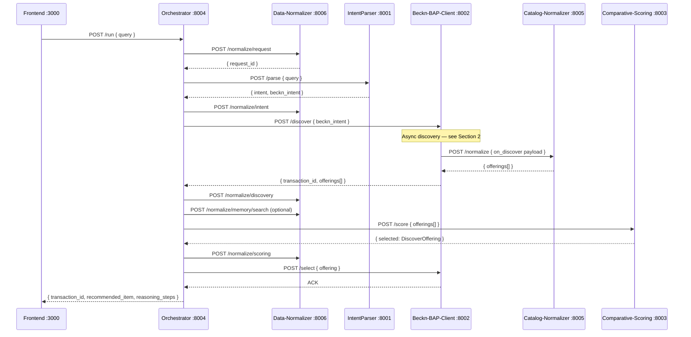
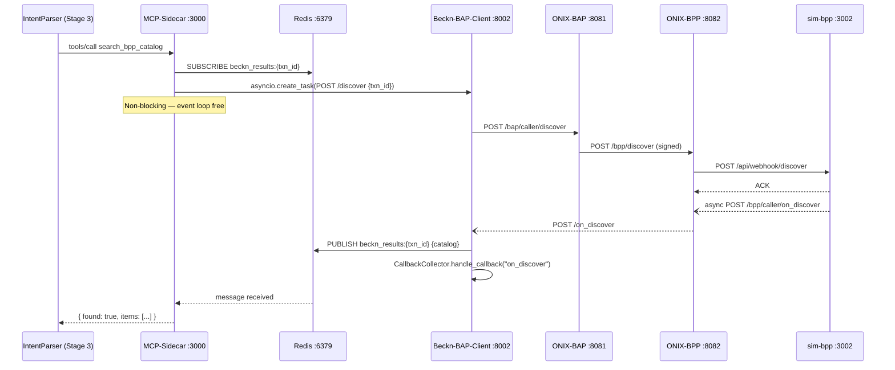
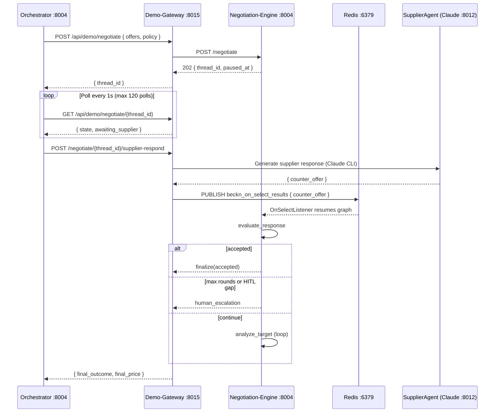
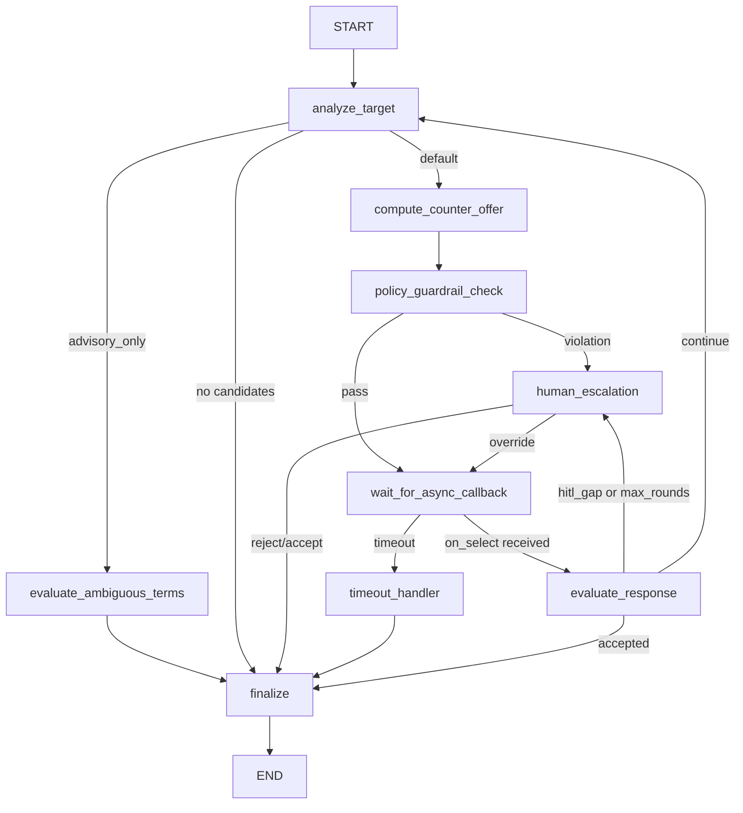
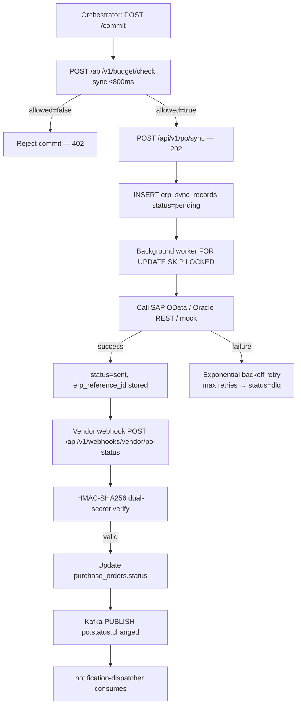
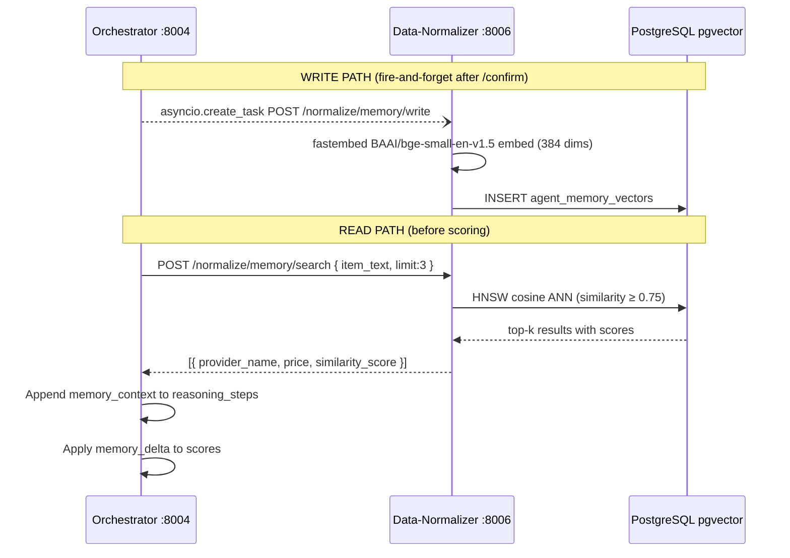
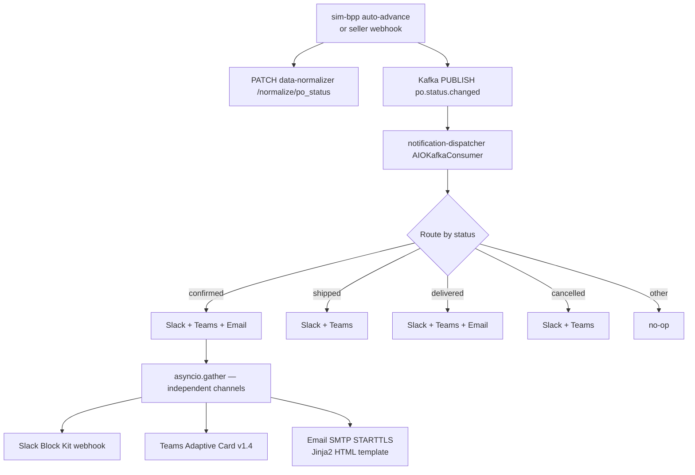

# System Data Flows

This document describes every major data flow in the Procurement Agent system, with numbered steps, service boundaries, and Mermaid diagrams. All flows are as-built unless marked (Inferred).

---

## 1. Main Procurement Happy Path

The full end-to-end flow from a buyer's natural-language query to a confirmed purchase order. This is the `/run` path in the orchestrator.

(Source: services/orchestrator/README.md, KnowledgeBase/project_scaffold/ -- Confidence: High)

**Steps:**

1. Frontend POSTs `{ query: "300 meters Cat6 UTP cable Mumbai 5 days" }` to `orchestrator :8004 POST /run`.
2. Orchestrator calls `data-normalizer :8006 POST /normalize/request` to create a `procurement_requests` row and obtain `request_id`. This is a fire-and-forget call; the pipeline continues immediately.
3. Orchestrator calls `intention-parser :8001 POST /parse` with the raw query.
   - **Stage 1** (LLM intent classification): `qwen3:8b` (or `qwen3:1.7b` in Docker — see Configuration note in Section 11) classifies intent as `procurement` / `unknown` / `emergency`. Non-procurement queries return `intent=unknown` and the pipeline halts.
   - **Stage 2** (BecknIntent extraction): `qwen3:8b` (complex) or `qwen3:1.7b` (simple) extracts `item`, `quantity`, `location_coordinates` (`"lat,lon"` decimal), `delivery_timeline` (int hours), `budget_constraints` (`{max, min}`).
   - **Stage 3** (hybrid ANN + MCP sidecar validation, only on `/parse/full`): pgvector ANN cosine search against `bpp_catalog_semantic_cache`; on `CACHE_MISS` the MCP sidecar fires a live Beckn discovery probe. See Section 2 for the async detail.
4. Orchestrator calls `data-normalizer :8006 POST /normalize/intent` to persist `parsed_intents` + `beckn_intents`.
5. Orchestrator calls `beckn-bap-client :8002 POST /discover` with the `BecknIntent`. Discovery is async — see Section 2 for the full sub-flow. The call blocks until `CallbackCollector` receives the `on_discover` payload (up to `CALLBACK_TIMEOUT=10s`).
6. `beckn-bap-client` calls `catalog-normalizer :8005 POST /normalize` to translate the raw `on_discover` catalog payload into a list of `DiscoverOffering` objects.
7. Orchestrator calls `data-normalizer :8006 POST /normalize/discovery` to persist `discovery_queries` + `seller_offerings`.
8. Orchestrator optionally calls `data-normalizer :8006 POST /normalize/memory/search` to fetch up to 3 similar past transactions from `agent_memory_vectors` (cosine ANN, threshold ≥ 0.75). Results inject `memory_context` into `reasoning_steps`.
9. Orchestrator calls `comparative-scoring :8003 POST /score` with the list of `DiscoverOffering`. The service forwards to `prediction-api :8004` (Phase 2 RankNet ML); on failure it falls back to cheapest-wins heuristic. Returns a single recommended `DiscoverOffering`.
10. Orchestrator calls `data-normalizer :8006 POST /normalize/scoring` to persist `scored_offers`.
11. Orchestrator calls `beckn-bap-client :8002 POST /select` with the chosen offering. ONIX routes `/select` to `sim-bpp` which returns `ACCEPTED`.
12. Orchestrator returns the full result to the frontend including `transaction_id`, `recommended_item`, and `reasoning_steps`.
13. On buyer approval (or in `autonomous` mode automatically), orchestrator executes the commit phase — see Section 3.



> **Configuration note:** In Docker, `intention-parser` has `COMPLEX_MODEL=qwen3:1.7b` overriding the local default of `qwen3:8b`. Both simple and complex queries use `qwen3:1.7b` inside the Docker-deployed service. (Source: docker-compose.yml lines 14–15, IntentParser/config.py -- Confidence: High)

---

## 2. Beckn Async Discovery (ADR-0001)

Beckn Protocol v2.0.0 makes discovery inherently asynchronous: `POST /discover` to ONIX returns only an ACK; the catalog arrives later via an `on_discover` webhook callback. The MCP sidecar must return a synchronous result to IntentParser Stage 3 without blocking the asyncio event loop.

(Source: docs/architecture/decisions/0001-use-redis-pubsub-for-async-beckn-responses.md, services/beckn-bap-client/README.md -- Confidence: High)

**The deadlock problem:** If the sidecar `await`s the POST `/discover` while also waiting for the `on_discover` callback, the event loop blocks and the callback can never be processed.

**The solution (ADR-0001):** Redis Pub/Sub on per-transaction channels (`beckn_results:{transaction_id}`). The subscriber is opened _before_ the discovery request is fired.

**Steps (MCP sidecar path):**

1. MCP sidecar generates a UUID `transaction_id`.
2. Sidecar subscribes to Redis channel `beckn_results:{transaction_id}` _before_ firing the request.
3. Sidecar fires `asyncio.create_task(POST beckn-bap-client:8002 /discover { transaction_id, ... })` — **not** `await`. The task is non-blocking.
4. ONIX BAP (:8081) receives `/discover`, signs it (ED25519), and forwards to ONIX BPP (:8082).
5. ONIX BPP forwards to `sim-bpp :3002 POST /api/webhook/discover`.
6. `sim-bpp` processes the query immediately (AND-token matching against `catalog.json`), then calls `asyncio.create_task` to POST `on_discover` back to ONIX BPP (:8082).
7. ONIX BPP routes `on_discover` to `beckn-bap-client :8002 POST /on_discover`.
8. `beckn-bap-client /on_discover` handler **publishes** the catalog payload to `Redis PUBLISH beckn_results:{transaction_id}`.
9. MCP sidecar's Redis SUBSCRIBE receives the message and returns the catalog to IntentParser Stage 3.
10. `beckn-bap-client` also calls `CallbackCollector.handle_callback("on_discover", payload)` so that the orchestrator's blocking `collect()` call is unblocked for the `/run` flow.



**Timeout behaviour:** If no Redis message arrives within `REDIS_RESULT_TIMEOUT` (default 15 s), the sidecar returns `{ found: false, items: [], probe_latency_ms: 15000 }`. `MCP_BAP_TIMEOUT` (default 8 s, formerly 3 s) is a safety valve for the HTTP fire-and-forget task only and is not the primary latency ceiling. (Source: services/mcp-sidecar/README.md -- Confidence: High)

---

## 3. Compare / Commit Two-Phase Flow

The frontend uses a two-phase flow to separate discovery/scoring from the binding confirm action, enabling human review before committing spend.

(Source: services/orchestrator/README.md, Bap-1/CLAUDE.md -- Confidence: High)

### Phase 1 — Compare

1. Frontend POSTs `{ beckn_intent }` (or raw query) to `orchestrator :8004 POST /compare`.
2. Orchestrator runs Steps 5–10 from the main happy path (discover → score). Steps 1–4 (request/intent persistence) are also executed.
3. Orchestrator stores the session under `transaction_id` with 30-minute TTL (in-memory `dict`).
4. Returns `{ transaction_id, offerings[], recommended_item_id, scoring, reasoning_steps }` to the frontend.

### Phase 2 — Commit

1. Buyer reviews the ranked offerings. They may override `recommended_item_id` with `chosen_item_id`.
2. Frontend POSTs `{ transaction_id, chosen_item_id }` to `orchestrator :8004 POST /commit`.
3. **ERP Budget Gate (synchronous, ≤800 ms, fail-closed):** Orchestrator calls `erp-adapter :8007 POST /api/v1/budget/check`. If `ERP_BUDGET_CHECK_REQUIRED=true` (default) and the gate returns `allowed: false` or times out, the commit is rejected. (Source: services/erp-adapter/README.md -- Confidence: High)
4. Orchestrator loads the session, resolves the chosen offering.
5. Orchestrator calls `beckn-bap-client :8002 POST /select` → ONIX → sim-bpp (returns `ACCEPTED`).
6. Orchestrator calls `beckn-bap-client :8002 POST /init` with buyer billing/fulfillment details → ONIX → sim-bpp (returns `ACTIVE`).
7. Orchestrator calls `beckn-bap-client :8002 POST /confirm` with payment terms → ONIX → sim-bpp (returns `ACTIVE`, `order_id`).
8. Orchestrator calls `data-normalizer :8006 POST /normalize/order` to persist the full FK chain: `negotiation_outcomes (strategy=skipped)` → `approval_decisions (auto_approved)` → `purchase_orders`.
9. Fire-and-forget: `asyncio.create_task(_persist_memory(...))` — writes confirmed transaction to `agent_memory_vectors`. (Source: services/orchestrator/src/workflow.py -- Confidence: High)
10. Fire-and-forget: Multiple `_persist_audit(...)` calls write events to `audit_trail_events`. (Source: code_findings -- Confidence: High)
11. Returns `{ transaction_id, order_id, order_state: "ACTIVE", status: "live" }`.

```mermaid
flowchart TD
    A[Frontend: POST /compare] --> B[Discover + Score]
    B --> C[Store session TTL=30min]
    C --> D[Return offerings + scoring to FE]
    D --> E{Buyer reviews}
    E -->|Override or accept| F[Frontend: POST /commit]
    F --> G{ERP Budget Gate\nerp-adapter /budget/check\n≤800ms, fail-closed}
    G -->|allowed=false or timeout| H[Return 402 — budget rejected]
    G -->|allowed=true| I[/select → /init → /confirm\nvia ONIX]
    I --> J[data-normalizer /normalize/order\nFK chain: neg→approval→PO]
    J --> K[fire-and-forget: memory write\nfire-and-forget: audit writes]
    K --> L[Return order_id to FE]
```

**Approval routing (when `approval_workflow` is enabled):** If `amount_total > requester.approval_threshold`, the commit is parked in `pending_approval` status and routed to the manager or CFO tier. The orchestrator exposes `GET /approvals` and `POST /approvals/{request_id}/decide` for this path. (Source: KnowledgeBase data_dictionary_er_model.md -- Confidence: Medium)

---

## 4. Automated Negotiation Flow (LangGraph)

Autonomous negotiation runs through the `demo-gateway :8015` which bridges the orchestrator to the `negotiation_engine :8004`. This path is only triggered from `POST /run` when `decision.requires_negotiation=True`.

(Source: services/orchestrator/src/workflow.py lines 602–749, services/negotiation_engine/README.md, code_findings topic 6 -- Confidence: High)

**Routing clarification:** The orchestrator does NOT call `negotiation_engine` directly. The call chain is:

```
orchestrator → demo-gateway :8015 /api/demo/negotiate
demo-gateway → negotiation_engine :8004 POST /negotiate
negotiation_engine → Redis beckn_on_select_results (async resume channel)
```

(Source: code_findings "negotiation routing confirmed" -- Confidence: High)

**Steps:**

1. Orchestrator calls `DEMO_GATEWAY_URL /api/demo/negotiate` with `{ ranked_offers, policy: { max_discount_pct: 0.20 }, max_rounds: 3 }`. Default `DEMO_GATEWAY_URL` is `http://localhost:8015`.
2. Demo-gateway forwards to `negotiation_engine :8004 POST /negotiate`. Engine returns `202 { thread_id, paused_at: "wait_for_async_callback" }` immediately.
3. LangGraph state machine runs inside negotiation_engine:
   - `analyze_target`: determines category (commodity / it_equipment / specialized / medical / unknown) and base discount.
   - `compute_counter_offer`: calculates counter-offer price subject to three guardrail layers:
     - L1 Pydantic: `discount_pct` field constraint `[0.0, 0.20]`.
     - L2 `validate_counter_offer()`: G1 (20% absolute cap), G2 (category cap), G3 (supplier cap), G5 (lead time), G6 (quantity).
     - L3 ONIX schema validation.
   - `policy_guardrail_check`: if any guardrail is violated, routes to `human_escalation` (HITL interrupt); otherwise parks at `wait_for_async_callback`.
4. Orchestrator polls `GET {DEMO_GATEWAY_URL}/api/demo/negotiate/{thread_id}` every 1 s (up to 120 polls).
5. When `state.paused_at == "wait_for_async_callback"` and `state.awaiting_supplier == True`, orchestrator calls `POST {DEMO_GATEWAY_URL}/api/demo/negotiate/{thread_id}/supplier-respond`.
6. Demo-gateway invokes `SupplierAgent` (Claude via proxy at `:8012`) to generate a supplier counteroffer response.
7. Demo-gateway publishes the supplier response to Redis channel `beckn_on_select_results`.
8. `OnSelectListener` in negotiation_engine receives the Redis message and calls `graph.ainvoke(Command(resume=payload))`, resuming the parked LangGraph.
9. `evaluate_response` node: if gap ≤ threshold → `finalize (accepted)`; if gap > HITL threshold or max rounds → `human_escalation`; otherwise → loop back to `analyze_target`.
10. On `finalize`, orchestrator receives the negotiated price and proceeds to the commit step.



**LangGraph state machine (complete node graph):**



**Audit gap:** No `_persist_audit` call exists inside `_run_autonomous_negotiation`. The `negotiate` audit_event_type is never written. Negotiation outcomes are recorded only in `result['messages']` and in `negotiation_outcomes` table via the order persistence chain. (Source: code_findings topic 4 -- Confidence: High)

---

## 5. ERP Integration Flow

The ERP integration has two sub-flows: a synchronous budget gate before commit, and an asynchronous PO push via the outbox pattern.

(Source: services/erp-adapter/README.md, services/erp-mock/README.md -- Confidence: High)

### 5a. Budget Gate (synchronous)

1. Orchestrator (commit path) calls `erp-adapter :8007 POST /api/v1/budget/check` with `{ amount_total, cost_center, currency }`.
2. erp-adapter routes to the configured ERP vendor (mock / SAP / Oracle) via the `ERPAdapter` Protocol.
3. In production (SAP): OAuth2 `client_credentials` token fetch → OData `API_PURCHASEORDER_PROCESS_SRV` budget check endpoint.
4. Per-vendor `pybreaker` circuit breaker: trips to OPEN after 5 consecutive failures; auto-probes after 60 s.
5. Total timeout budget: `BUDGET_CHECK_TOTAL_TIMEOUT_MS=800` (hard wall). If ERP is unreachable and `ERP_BUDGET_CHECK_REQUIRED=true`, returns `allowed: false` (fail-closed).
6. Returns `{ allowed: bool, available_balance, hold_id }`.

### 5b. PO Push (asynchronous outbox)

1. Orchestrator calls `erp-adapter :8007 POST /api/v1/po/sync` with `{ transaction_id, po_details }`. Returns `202` immediately.
2. erp-adapter inserts a row into `erp_sync_records` (outbox table) with `status=pending`.
3. Background worker polls `erp_sync_records` using `FOR UPDATE SKIP LOCKED` (concurrency-safe), picks up `pending` rows.
4. Worker calls the ERP vendor REST/OData API to create the PO.
5. On success: updates `erp_sync_records.status=sent`, stores `erp_reference_id`.
6. On failure: increments `retry_count`, applies exponential backoff (`WORKER_BACKOFF_CSV=5,30,120,600,3600`). After max retries: status → `dlq` (dead-letter queue).
7. Vendor webhook arrives at `erp-adapter POST /api/v1/webhooks/{vendor}/po-status`.
8. HMAC-SHA256 dual-secret verification: tries `{VENDOR}_WEBHOOK_HMAC_SECRET` first, then `{VENDOR}_WEBHOOK_HMAC_SECRET_NEXT` for rotation support.
9. On valid webhook: updates `purchase_orders.status`, publishes to Kafka topic `po.status.changed` (primary) or Redis key `po.status_changed:{txn_id}` (fallback when Kafka unavailable).
10. Downstream: `notification-dispatcher :8010` consumes the Kafka event (see Section 7). `sim-bpp` auto-advance also feeds this topic.



---

## 6. Agent Memory Learning Flywheel

The agent memory system enables time-decayed supplier loyalty bonuses. It is a write-on-confirm, read-on-compare pattern using pgvector ANN search.

(Source: KnowledgeBase phase3_agent_memory_learning.md, services/data-normalizer/README.md -- Confidence: High)

### Write Path (on confirm)

1. After a successful `POST /confirm`, orchestrator calls `asyncio.create_task(_persist_memory(...))` — fire-and-forget, never awaited, never raises.
2. `_persist_memory` POSTs to `data-normalizer :8006 POST /normalize/memory/write` with `{ item, provider_name, price, currency, delivery_hours, request_id }`.
3. data-normalizer embeds the text summary `"{item} ordered from {provider} at {price} {currency} delivery in {hours}h"` using `BAAI/bge-small-en-v1.5` (fastembed ONNX, 384 dims). First call downloads ~65 MB model from HuggingFace (10–30 s cold start).
4. Inserts `vector(384)` into `agent_memory_vectors` with `entity_type='transaction'`, `indexed_at=NOW()`, `source_request_id`.
5. Returns `{ stored: true }`. Embedding failures are silently swallowed — the endpoint never returns an error due to embedding failure.

### Read Path (on compare/run)

1. After discovery, before scoring, orchestrator calls `_fetch_memory_context(raw_query, limit=3)` with a 5 s timeout.
2. POSTs to `data-normalizer :8006 POST /normalize/memory/search` with `{ item_text, limit: 3 }`.
3. data-normalizer performs pgvector HNSW cosine ANN search against `agent_memory_vectors`. Items with similarity < 0.75 are filtered out.
4. Returns up to 3 past transactions with `similarity_score`, `provider_name`, `price`.
5. Orchestrator appends `reasoning_steps += [{ node: "memory_context", role: "observe", content: [...hits] }]`.
6. If the top recommendation changes after applying memory adjustments, an additional `{ node: "memory_adjustment", role: "reason" }` step is appended.

### Scoring Delta Formula

For each provider found in memory results:

```
memory_delta(provider) = Σ [ 0.03 × exp(−days_old × ln(2) / 90) ]
                         over past POs for this provider (max 5)
                         capped at ±0.10
```

New providers receive `delta=0`. Half-life is 90 days. Volume cap at 5 past orders prevents runaway loyalty bias.
(Source: KnowledgeBase phase3_agent_memory_learning.md -- Confidence: High)



---

## 7. Order Status and Notification Flow

After a PO is confirmed, status updates flow through auto-advance simulation, Kafka, and the notification dispatcher.

(Source: services/sim-bpp/README.md, services/notification-dispatcher/README.md -- Confidence: High)

### 7a. sim-bpp Auto-Advance Lifecycle

When `SIM_BPP_AUTO_ADVANCE=true` (the default in `docker-compose.yml`), sim-bpp automatically advances the order through its lifecycle every `SIM_BPP_ADVANCE_INTERVAL_SECS` (default 5 s):

```
ACCEPTED → PACKED → SHIPPED → OUT_FOR_DELIVERY → DELIVERED
```

For each transition:
1. sim-bpp PATCHes `data-normalizer :8006 PATCH /normalize/po_status` with the new status.
2. sim-bpp publishes to Kafka topic `po.status.changed`.
3. `notification-dispatcher :8010` consumes the Kafka event.

### 7b. Notification Routing Rules

| Order status | Slack | Teams | Email |
|---|---|---|---|
| confirmed | yes | yes | yes |
| shipped | yes | yes | no |
| delivered | yes | yes | yes |
| cancelled | yes | yes | no |
| anything else | no | no | no |

(Source: services/notification-dispatcher/README.md -- Confidence: High)

### 7c. Notification Fan-Out Steps

1. `notification-dispatcher` AIOKafka consumer receives event from `po.status.changed`.
2. Normalises `po_status` field (tries `po_status` key first, `state` as fallback).
3. Determines channel set from routing table above.
4. Calls `asyncio.gather([slack_task, teams_task, email_task], return_exceptions=True)` — channels are independent; one failure does not block others.
5. **Slack**: Block Kit message with header (emoji by status) + section (order_id, transaction_id, source, observed_at) POSTed to `SLACK_WEBHOOK_URL`.
6. **Teams**: Adaptive Card v1.4 POSTed to `TEAMS_WEBHOOK_URL`. Color: `good` (confirmed/delivered), `accent` (shipped), `attention` (cancelled).
7. **Email**: Jinja2 HTML template (`email_confirmed.html`, `email_delivered.html`, or `email_generic.html`) sent via SMTP STARTTLS to recipient resolved from DB. Recipient lookup: `purchase_orders.beckn_confirm_ref = order_id` → FK chain → `users.email`. If DB unavailable or no match, email is silently skipped.



---

## 8. Audit Trail Write Points

Every significant agent decision writes to `audit_trail_events` via `data-normalizer :8006 POST /normalize/audit`. Records carry `retention_until = NOW() + 7 years` (SOX 404 / GDPR / IT Act 2000).

(Source: KnowledgeBase phase3_audit_trail_system.md, code_findings topic 4 -- Confidence: High)

The complete set of confirmed write points in `services/orchestrator/src/workflow.py` (verified by code inspection):

| Call site | event_type | agent_action | Workflow location |
|---|---|---|---|
| `run_pipeline_from_intent` | normalize | request_created | line ~1100 |
| `run_pipeline` | normalize | request_created | line ~1310 |
| `_compare_phase` | normalize | request_created | line ~1637 |
| `run_pipeline_from_intent` | normalize | intent_persisted | line ~1119 |
| `run_pipeline` | normalize | intent_persisted | line ~1356 |
| `_compare_phase` | normalize | intent_persisted | line ~1651 |
| `_compare_phase` | discover | no_offerings_found | line ~1663 |
| `run_pipeline` | discover | discovery_completed: N offerings | line ~1396 |
| `_compare_phase` | discover | discovery_completed: N offerings | line ~1688 |
| `run_pipeline_from_intent` | score | scored N offerings | line ~1207 |
| `run_pipeline` | score | scored N offerings | line ~1462 |
| `_compare_phase` | score | scored N offerings | line ~1827 |
| commit handler | confirm | order_confirmed: {order_id} | line ~2338 |
| order_status poll loop | confirm | order state X → Y | line ~2596 |
| `seller_status_webhook` | confirm | seller webhook → {state} | line ~3021 |
| `decide_approval` | approve | approver_approved | line ~3169 |
| cancel handler | override | user_cancelled | line ~3270 |
| autonomous path | confirm | auto_commit order_confirmed | line ~3507 |
| `decide_run` (rejection) | override | user_rejected_run | line ~3695 |
| `decide_run` (confirmation) | confirm | decide_run order_confirmed | line ~3807 |

**Unused event types in orchestrator:** `negotiate`, `erp_sync`, `notification`. These are presumably written by `negotiation_engine`, `erp-adapter`, and `notification-dispatcher` respectively. The `negotiate` type is confirmed unused in the orchestrator despite being in the `audit_event_type` ENUM. (Source: code_findings -- Confidence: High)

Audit events are queryable via:

- `GET /normalize/audit?request_id=X` — full decision chain for a request (max 500)
- `GET /normalize/audit?po_id=X` — events for a confirmed PO
- `GET /normalize/audit/{event_id}` — single event with full `reasoning_payload` JSONB

---

## 9. catalog-normalizer Detection Pipeline

Every raw `on_discover` payload is normalised through a deterministic format detector before optional LLM fallback.

(Source: services/catalog-normalizer/README.md, CatalogNormalizer/llm_fallback.py -- Confidence: High)

```mermaid
flowchart TD
    A[Raw on_discover payload] --> B{FormatDetector.detect}
    B -->|resources[] non-empty| C[BECKN_V2_FLAT_RESOURCES variant 1]
    B -->|fulfillments[] AND tags[] both present| D[ONDC_CATALOG variant 4]
    B -->|providers with items sub-key| E[LEGACY_PROVIDERS_ITEMS variant 2]
    B -->|items 0 .provider is string| F[BPP_CATALOG_V1 variant 3]
    B -->|no match| G[UNKNOWN variant 5]
    C --> H[SchemaMapper — deterministic rule-based]
    D --> H
    E --> H
    F --> H
    H --> I[DiscoverOffering list]
    G --> J[LLMFallbackNormalizer\nOllama qwen3:1.7b via instructor]
    J --> I
```

**Detection order is significant:** ONDC_CATALOG is checked before LEGACY_PROVIDERS_ITEMS because ONDC catalogs also have `providers[]`; the more-specific fingerprint must win.

**LLM fallback backend:** The catalog-normalizer README incorrectly states `OPENAI_API_KEY` is required. The actual backend is `Ollama` at `OLLAMA_URL` (default `http://localhost:11434/v1`) using `NORMALIZER_MODEL` (default `qwen3:1.7b`). `OPENAI_API_KEY` is never read. (Source: CatalogNormalizer/llm_fallback.py lines 19–25 -- Confidence: High)

---

## 10. IntentParser Three-Stage Validation Pipeline

The IntentParser `/parse/full` endpoint runs three stages. The `/parse` endpoint runs only Stages 1 and 2.

(Source: IntentParser/README.md -- Confidence: High)

```mermaid
flowchart TD
    A[POST /parse/full { query }] --> B[Stage 1: LLM Intent Classification\nqwen3:8b or qwen3:1.7b\noutput: ParsedIntent + confidence]
    B -->|intent=unknown| C[Return early — not procurement]
    B -->|intent=procurement| D[Stage 2: BecknIntent Extraction\nqwen3:8b complex / qwen3:1.7b simple\ninstructor Mode.JSON max_retries=3]
    D --> E{Stage 3 Validation\nhybrid ANN + MCP sidecar}
    E -->|similarity ≥ 0.85 VALIDATED| F[Return BecknIntent status=validated]
    E -->|0.45–0.85 AMBIGUOUS| G[Return BecknIntent status=ambiguous\nwith best-match offering]
    E -->|similarity < 0.45 CACHE_MISS| H{MCP sidecar probe\nstatus=mcp_validated?}
    H -->|found=true| I[Return status=mcp_validated]
    H -->|found=false| J[Recovery flow\nbroadening + Claude fallback]
    J --> K[log_unmet_demand STUB\nnotify_buyer_no_stock STUB\ntrigger_open_rfq_flow STUB]
```

**Complexity routing (Stage 2):** A query is classified as complex if it is >120 characters OR contains ≥2 numeric tokens OR contains procurement keywords (e.g. "urgent", "approval", "RFQ"). Complex queries use `COMPLEX_MODEL` (local default `qwen3:8b`; Docker override `qwen3:1.7b`). Simple queries always use `SIMPLE_MODEL` (`qwen3:1.7b`).

**Recovery stubs:** `log_unmet_demand`, `notify_buyer_no_stock`, and `trigger_open_rfq_flow` in `IntentParser/recovery.py` are confirmed stub implementations — they only call `logger.info`. No real DB write, notification service call, or RFQ microservice integration exists. (Source: code_findings topic 20 -- Confidence: High)

---

## 11. Known Data Flow Anomalies

The following discrepancies between documentation and as-built behaviour are confirmed by code inspection.

| Anomaly | Impact | Source |
|---|---|---|
| `COMPLEX_MODEL=qwen3:1.7b` in Docker overrides local default of `qwen3:8b` | Complexity routing is silently disabled in Docker; all queries use the smaller model | docker-compose.yml lines 14–15 |
| `negotiate` audit_event_type never written by orchestrator | Negotiation decisions are not in the audit trail; SOX reconstruction is incomplete for negotiated orders | code_findings topic 4 |
| `catalog-normalizer` LLM fallback uses Ollama, not OpenAI | `OPENAI_API_KEY` is irrelevant; operators who set it expecting LLM fallback will be confused | CatalogNormalizer/llm_fallback.py |
| `claude_openai_proxy :8012` is a host-local process, not a Docker service | `demo-gateway` and `negotiation-engine` fail silently if the proxy is not running on the host | services/claude_openai_proxy/README.md |
| `embedding_model_type` ENUM missing `all-MiniLM-L6-v2` and `BAAI/bge-small-en-v1.5` at table-creation time | INSERT into `agent_memory_vectors.embedding_model` fails until migration `22_agent_memory_vector_dim.sql` is applied | database/sql/00_extensions_and_types.sql, 15_agent_memory_vectors.sql |
| Default column value for `embedding_model` remains `text-embedding-3-large` after migration 22 | Rows inserted without explicit model name will store the wrong model name in the DB | database/sql/22_agent_memory_vector_dim.sql |
| `discovery_engine :8006` service is fully implemented but absent from docker-compose.yml and has no callers | Service is orphaned; multi-network fan-out is not active in any deployed configuration | services/discovery_engine/README.md, docker-compose.yml |
| `demo-gateway` orchestrator default URL is `http://localhost:8015`; service README states port 8005 | Autonomous negotiation fails if `DEMO_GATEWAY_URL` is not explicitly set to the correct port | services/orchestrator/src/workflow.py line 55 |
