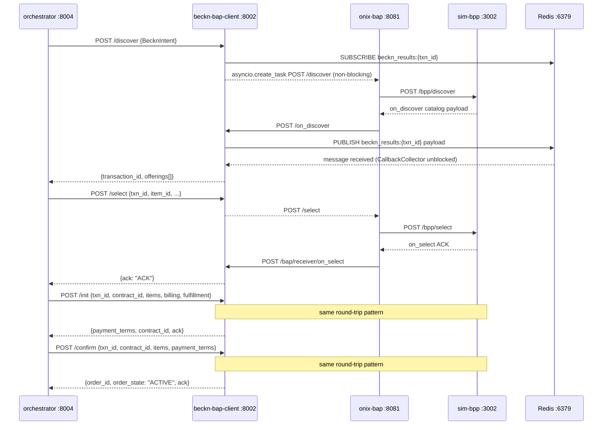

# API Reference — Core Pipeline Services

Three services form the primary procurement pipeline. The orchestrator is the
sole external entry point for the frontend. IntentParser runs the NL-to-intent
stages. beckn-bap-client executes every Beckn protocol action.

```
Frontend / API consumer
      │
      ▼
orchestrator :8004  (Steps 1–4 coordinator)
      │
      ├── POST → intention-parser :8001  (Step 1 — NL parse)
      ├── POST → beckn-bap-client :8002  (Step 2 — discover)
      ├── POST → comparative-scoring :8003 (Step 3 — score)
      └── POST → beckn-bap-client :8002  (Step 4 — select / init / confirm / status)
```

## Host port note

The orchestrator container publishes **two** host ports.

| Host port | Purpose |
|-----------|---------|
| 8004 | Direct testing, microservices-mode frontend (BAP_URL=localhost:8004) |
| 8000 | Legacy Bap-1 compatible mode (BAP_URL=localhost:8000) |

Both map to container port 8004. (Source: docker-compose.yml lines 124–125 — Confidence: High)

---

## Shared data models

These types appear in the bodies of multiple endpoints across all three services.

### BecknIntent

(Source: shared/models.py — Confidence: High)

| Field | Type | Required | Notes |
|-------|------|----------|-------|
| `item` | `str` | Yes | Canonical item name, e.g. `"A4 paper"` |
| `descriptions` | `list[str]` | No | Atomic technical specs, e.g. `["80gsm", "A4"]` |
| `quantity` | `int` | Yes | Must be > 0 |
| `unit` | `str` | No | Default `"units"`. E.g. `"reams"`, `"meters"` |
| `location_coordinates` | `str \| null` | No | `"lat,lon"` decimal string — NOT a city name |
| `delivery_timeline` | `int \| null` | No | Positive integer in **hours**. 1 day = 24, 1 week = 168 — NOT ISO 8601 |
| `budget_constraints` | `BudgetConstraints \| null` | No | See below |

**BudgetConstraints**

```json
{ "max": 200.0, "min": 0.0 }
```

`min` defaults to `0.0`. Never pass as a raw string.

### DiscoverOffering

Returned by `/discover` and stored in all session state.
(Source: shared/models.py — Confidence: High)

| Field | Type | Notes |
|-------|------|-------|
| `bpp_id` | `str` | Beckn Provider Platform identifier |
| `bpp_uri` | `str` | ONIX BPP caller URL (always contains `caller` in path) |
| `provider_id` | `str` | |
| `provider_name` | `str` | |
| `item_id` | `str` | |
| `item_name` | `str` | |
| `price_value` | `str` | Numeric string, e.g. `"168.00"` |
| `price_currency` | `str` | Default `"INR"` |
| `available_quantity` | `int \| null` | |
| `rating` | `str \| null` | |
| `specifications` | `list[str]` | |
| `fulfillment_hours` | `int \| null` | Delivery lead time in hours |
| `category` | `str \| null` | |

---

## orchestrator (:8004)

All endpoints return `application/json`. The service runs on port 8004 (container)
and is the **only** service the Next.js frontend calls directly.

(Source: services/orchestrator/src/workflow.py — Confidence: High)

### Pipeline entry points

| Method | Path | Description |
|--------|------|-------------|
| POST | `/run` | Unified single-call orchestration: NL query → score → (negotiate) → optional auto-commit |
| POST | `/parse` | Proxy to intention-parser `/parse` (Steps 1+2 only, sync) |
| POST | `/discover` | Steps 2–4 with a pre-parsed BecknIntent body |
| POST | `/compare` | Steps 2–3 only. Stores session. Returns offerings + scoring |
| POST | `/commit` | Loads compare session. Runs select → init → confirm |
| PATCH | `/cancel` | Mark a procurement request as cancelled |

### Session and order tracking

| Method | Path | Description |
|--------|------|-------------|
| GET | `/run/{run_id}` | Current stage + state for a `/run` session |
| POST | `/run/{run_id}/decide` | Advance a run after a human decision (advisory / HITL) |
| GET | `/status/{txn_id}/{order_id}` | Poll Beckn order lifecycle. Always returns 200 |
| GET | `/order/{request_id}` | Full order detail from data-normalizer, overlaid with in-memory enrichment |

### WebSocket

| Method | Path | Description |
|--------|------|-------------|
| GET (WS) | `/ws/status/{txn_id}` | Real-time order status push. Read-only; sends initial snapshot then Kafka-driven events |

### Admin, approvals, analytics

| Method | Path | Description |
|--------|------|-------------|
| GET | `/health` | Liveness. Returns upstream service URL map |
| GET | `/analytics` | Proxy to analytics service. Query param `period=30d\|90d\|180d` |
| GET | `/admin/users` | Proxy to data-normalizer `/admin/users` |
| PATCH | `/admin/users/{user_id}` | Proxy to data-normalizer. Updates `approval_threshold` / `department` |
| GET | `/approvals` | List pending approval requests (in-memory store) |
| POST | `/approvals/{request_id}/decide` | Approve or reject a pending order |

### Inbound webhook

| Method | Path | Auth | Description |
|--------|------|------|-------------|
| POST | `/webhooks/seller/status` | HMAC-SHA256 `X-Signature` header | BPP pushes state change. Persists, audits, publishes to Kafka |

---

### POST /run

Unified orchestration. Accepts a BecknIntent body plus mode fields. Internally
runs Steps 1–4 and, for the autonomous mode, optionally drives automated
negotiation via the demo-gateway.

(Source: services/orchestrator/src/workflow.py lines 3282–3606 — Confidence: High)

**Request body**

```json
{
  "item": "A4 paper",
  "descriptions": ["80gsm"],
  "quantity": 500,
  "unit": "reams",
  "location_coordinates": "12.9716,77.5946",
  "delivery_timeline": 72,
  "budget_constraints": { "max": 200.0 },
  "raw_query": "500 reams A4 paper Bangalore 3 days",
  "execution_mode": "advisory",
  "actor": { "user_id": "...", "role": "requester" }
}
```

`raw_query`, `actor`, and `execution_mode` are optional extras not part of
BecknIntent. `execution_mode` values:

| Value | Behaviour |
|-------|-----------|
| `advisory` (default) | Returns ranked offerings. Human selects via `/run/{run_id}/decide` |
| `hitl` | Agent recommends one item. Human approves or rejects |
| `autonomous` | Agent commits automatically when within RBAC threshold |

**Response (200) — advisory stage `awaiting_selection`**

```json
{
  "run_id": "abc123",
  "transaction_id": "uuid",
  "request_id": "uuid",
  "stage": "awaiting_selection",
  "execution_mode": "advisory",
  "offerings": [ /* DiscoverOffering[] */ ],
  "recommended_item_id": "item_id_string",
  "scoring": {
    "recommended_item_id": "...",
    "criteria": [ { "key": "price", "label": "Price", "weight": 1.0, "direction": "min", "scores": [...] } ],
    "ranking": [ { "item_id": "...", "composite_score": 0.9, "rank": 1 } ]
  },
  "reasoning_steps": [],
  "messages": ["Step 1 ...", "Step 2 ..."],
  "decision": {},
  "status": "live"
}
```

**Response (202) — RBAC approval required (`stage = awaiting_rbac_approval`)**

```json
{
  "run_id": "abc123",
  "stage": "awaiting_rbac_approval",
  "request_id": "uuid",
  "amount_total": 95000.0,
  "explanation": "Amount exceeds requester threshold ...",
  "decision": {}
}
```

**Response (200) — autonomous path, order confirmed (`stage = confirmed`)**

```json
{
  "run_id": "abc123",
  "stage": "confirmed",
  "order_id": "order_uuid",
  "order_state": "ACTIVE",
  "transaction_id": "uuid",
  "contract_id": "uuid",
  "bpp_id": "bpp.example.com",
  "bpp_uri": "http://onix-bpp:8082/bpp/receiver",
  "reasoning_steps": [...],
  "messages": [...],
  "status": "live",
  "offerings": [...],
  "negotiation_settled_price": null
}
```

---

### POST /compare

Steps 2–3 (discover + score). Stores session keyed by `transaction_id` with a
30-minute TTL. Does **not** run Step 4 (select).

(Source: services/orchestrator/src/workflow.py lines 1872–1869 — Confidence: High)

**Request body** — BecknIntent fields plus optional `raw_query: str`.

**Response (200)**

```json
{
  "transaction_id": "uuid",
  "request_id": "uuid",
  "offerings": [ /* DiscoverOffering[] */ ],
  "recommended_item_id": "item_id_string",
  "scoring": { "recommended_item_id": "...", "criteria": [...], "ranking": [...] },
  "reasoning_steps": [ { "node": "memory_context", "role": "observe", "content": "..." } ],
  "messages": ["Step 2: Discovered 5 offerings", "Step 3: Scored offerings"],
  "status": "live"
}
```

`status` is `"mock"` when the ONIX Docker stack is offline.

---

### POST /commit

Loads the compare session by `transaction_id`, overrides the selected item with
`chosen_item_id`, then runs `/select` → `/init` → `/confirm` through
beckn-bap-client.

(Source: services/orchestrator/src/workflow.py lines 2125–2539 — Confidence: High)

**Request body**

```json
{ "transaction_id": "uuid", "chosen_item_id": "item_id_string" }
```

If `order_total > user.approval_threshold`, the commit is queued into
`_pending_approvals` and a `202 Accepted` is returned instead of `200`.

**Response (200)**

```json
{
  "transaction_id": "uuid",
  "request_id": "uuid",
  "order_id": "order_uuid",
  "order_state": "ACTIVE",
  "payment_terms": { "type": "ON_FULFILLMENT", "collected_by": "BPP", "currency": "INR", "status": "COMMITTED" },
  "fulfillment_eta": null,
  "bpp_id": "bpp.example.com",
  "bpp_uri": "...",
  "contract_id": "uuid",
  "reasoning_steps": [...],
  "messages": [...],
  "status": "live"
}
```

**Response (202) — approval gate**

```json
{
  "status": "awaiting_approval",
  "message": "Order requires manager approval ...",
  "request_id": "uuid",
  "transaction_id": "uuid",
  "amount_total": 120000.0
}
```

---

### GET /run/{run_id}

Returns the current stage and state snapshot for a `/run` session.
Returns `404` for unknown `run_id`, `410 Gone` if session expired.

(Source: services/orchestrator/src/workflow.py lines 3609–3636 — Confidence: High)

**Response (200)**

```json
{
  "run_id": "abc123",
  "transaction_id": "uuid",
  "request_id": "uuid",
  "stage": "awaiting_selection",
  "execution_mode": "advisory",
  "decision": {},
  "offerings": [...],
  "recommended_item_id": "...",
  "order_id": null,
  "order_state": null
}
```

---

### POST /run/{run_id}/decide

Advances a run after a human decision.

(Source: services/orchestrator/src/workflow.py lines 3639–3725 — Confidence: High)

**Request body**

```json
{
  "decision": "proceed",
  "chosen_item_id": "item_id_string",
  "approver_id": "user_uuid"
}
```

| Stage | `decision` values | Notes |
|-------|------------------|-------|
| `awaiting_selection` | `proceed` | `chosen_item_id` required |
| `awaiting_approval` (HITL) | `proceed` | Uses `decision.final_item_id` from session; `chosen_item_id` optional override |
| Any | `reject` | Cancels run. For HITL, transitions to `awaiting_selection` instead |

**Response (200)** — same shape as `/run` confirmed response.
**Response (202)** — if approved commit triggers RBAC escalation.

---

### GET /status/{txn_id}/{order_id}

Polls order lifecycle via beckn-bap-client `/status`. Always returns `200`.
Session data provides `bpp_id`/`bpp_uri`; query params `?bpp_id=&bpp_uri=` are
the fallback when the session has expired.

(Source: services/orchestrator/src/workflow.py lines 2542–2651 — Confidence: High)

**Response (200)**

```json
{
  "state": "SHIPPED",
  "observed_at": "2026-07-07T10:00:00.000Z",
  "fulfillment_eta": null,
  "tracking_url": null,
  "erp_state": {
    "state": "SHIPPED",
    "vendor": "sap",
    "erp_reference_id": "4500123456",
    "event_ts": "2026-07-07T09:45:00Z",
    "vendor_event_id": "sap-evt-001"
  },
  "status": "live"
}
```

`erp_state` is `null` when no ERP inbound event has been cached for the transaction.

---

### POST /approvals/{request_id}/decide

(Source: services/orchestrator/src/workflow.py lines 3096–3235 — Confidence: High)

**Request body**

```json
{ "decision": "approved" }
```

`decision` must be `"approved"` or `"rejected"`. Returns `404` for unknown
`request_id`.

- `rejected` → persists `cancelled` status, removes from pending queue.
- `approved` → resumes Beckn select → init → confirm from saved session. Falls
  back to mock if session has expired.

---

### POST /webhooks/seller/status

(Source: services/orchestrator/src/workflow.py lines 2969–3050 — Confidence: High)

**Authentication** — `X-Signature` header: `base64(HMAC-SHA256(body, SELLER_WEBHOOK_HMAC_SECRET))`.
Returns `401` on mismatch.

**Request body**

```json
{
  "transaction_id": "uuid",
  "order_id": "order_uuid",
  "beckn_state": "SHIPPED"
}
```

On success: persists via data-normalizer `/normalize/po_status`, writes audit
event `confirm / seller webhook → SHIPPED`, publishes to Kafka topic
`po.status.changed`.

---

## IntentParser (:8001)

FastAPI service. Runs locally (not Dockerised by default; the
`intention-parser` Docker container wraps Stages 1+2 only, not Stage 3).

(Source: IntentParser/api.py, IntentParser/orchestrator.py — Confidence: High)

### Endpoints

| Method | Path | Stages | Ollama required | Sync/Async |
|--------|------|--------|-----------------|------------|
| POST | `/parse` | 1+2 | Yes | Sync |
| POST | `/parse/batch` | 1+2 | Yes | Sync |
| POST | `/parse/full` | 1+2+3+recovery | Yes (+ pgvector + MCP sidecar for Stage 3) | Async |

There is no `GET /health` defined in `api.py`. Health probing must use a
`POST /parse` with a minimal body. (Source: IntentParser/api.py — Confidence: High)

---

### POST /parse

Runs Stage 1 (intent classification) then Stage 2 (BecknIntent extraction).
Stage 3 (ANN cache + MCP validation) is disabled. Synchronous; blocks on
Ollama inference.

(Source: IntentParser/api.py lines 48–50 — Confidence: High)

**Request body**

```json
{ "query": "500 reams A4 paper Bangalore 3 days" }
```

**Response — ParseResult**

```json
{
  "intent": "SearchProduct",
  "confidence": 0.95,
  "beckn_intent": {
    "item": "A4 paper",
    "descriptions": ["80gsm", "A4"],
    "quantity": 500,
    "unit": "reams",
    "location_coordinates": "12.9716,77.5946",
    "delivery_timeline": 72,
    "budget_constraints": null
  },
  "routed_to": "qwen3:1.7b"
}
```

`routed_to` shows which model handled Stage 2. Complexity routing rule:
query longer than 120 chars, or at least 2 numeric tokens, or contains a
procurement keyword (delivery, budget, timeline, etc.) → `COMPLEX_MODEL`
(defaults to `qwen3:8b` locally, forced to `qwen3:1.7b` in Docker).
Otherwise → `SIMPLE_MODEL` (`qwen3:1.7b`).
(Source: IntentParser/orchestrator.py lines 51–64 — Confidence: High)

Non-procurement query:

```json
{ "intent": "GeneralInquiry", "confidence": 0.98, "beckn_intent": null, "routed_to": "qwen3:1.7b" }
```

---

### POST /parse/batch

Runs Stage 1+2 on multiple queries in parallel. Uses `ThreadPoolExecutor`
with `max_workers` workers (default 4).

(Source: IntentParser/api.py lines 53–55 — Confidence: High)

**Request body**

```json
{ "queries": ["query one", "query two"], "max_workers": 4 }
```

**Response** — `list[ParseResult]` in the same order as input.

---

### POST /parse/full

Full async pipeline: Stage 1 → Stage 2 → Stage 3 (pgvector ANN cache +
MCP sidecar ONIX probe) → recovery flow if not found.

Requires: local Ollama, PostgreSQL with pgvector extension, and MCP sidecar
running on port 3000.

(Source: IntentParser/api.py lines 61–63, IntentParser/orchestrator.py — Confidence: High)

**Request body** — same as `/parse`:

```json
{ "query": "300 meters Cat6 UTP cable Mumbai 5 days" }
```

**Response — ParseResponse**

```json
{
  "intent": "SearchProduct",
  "confidence": 0.91,
  "beckn_intent": {
    "item": "Cat6 UTP cable",
    "descriptions": ["Cat6", "UTP", "ethernet"],
    "quantity": 300,
    "unit": "meters",
    "location_coordinates": "19.0760,72.8777",
    "delivery_timeline": 120,
    "budget_constraints": null
  },
  "validation": {
    "zone": "VALIDATED",
    "top_match": { "item_name": "Cat6 Cable UTP", "bpp_id": "bpp.example.com", "similarity": 0.91 },
    "mcp_validated": false
  },
  "recovery_log": [],
  "routed_to": "qwen3:1.7b"
}
```

**`validation.zone` values**

| Zone | Condition |
|------|-----------|
| `VALIDATED` | ANN similarity >= 0.85 (hardcoded, not env-configurable) |
| `AMBIGUOUS` | Similarity 0.45–0.85 → MCP sidecar probe attempted |
| `CACHE_MISS` | Similarity < 0.45 → MCP probe; if not found, recovery flow |

(Source: IntentParser/models.py, IntentParser/README.md — Confidence: High)

**Recovery flow** (`zone = CACHE_MISS`, MCP returns not found):

1. `broaden_procurement_query()` — strips specifics, optionally calls Claude Sonnet 4.6 if `ANTHROPIC_API_KEY` is set.
2. Stage 3 retry with broadened query.
3. `log_unmet_demand()` — stub (logs only; no DB write).
4. `notify_buyer_no_stock()` — stub.
5. `trigger_open_rfq_flow()` — stub.

`recovery_log` contains messages from each step.

---

## beckn-bap-client (:8002)

aiohttp service. All Beckn traffic goes through this service → onix-bap :8081.
Never POST directly to a BPP. The service exposes two route groups:
orchestrator-facing (trigger Beckn actions) and ONIX callback receivers.

(Source: services/beckn-bap-client/src/handler.py — Confidence: High)

### Orchestrator-facing routes

| Method | Path | Description |
|--------|------|-------------|
| GET | `/health` | Returns `{"status":"ok","service":"beckn-bap-client","bap_id":"..."}` |
| POST | `/discover` | Runs discovery via ONIX, waits for `on_discover` callback |
| POST | `/select` | Sends `/select` through ONIX |
| POST | `/init` | Sends `/init` through ONIX, awaits `on_init` callback |
| POST | `/confirm` | Sends `/confirm` through ONIX, awaits `on_confirm` callback |
| POST | `/status` | Sends `/status` through ONIX, awaits `on_status` callback. Never returns 5xx |

### ONIX callback receivers

| Method | Path | Description |
|--------|------|-------------|
| POST | `/on_discover` | Primary async on_discover webhook (dedicated route for Redis Pub/Sub) |
| POST | `/bap/receiver/{action}` | Generic callback receiver: on_select, on_init, on_confirm, on_status |
| POST | `/{action}` | Wildcard for direct real Beckn network callbacks |

---

### POST /discover

Accepts a BecknIntent JSON body plus an optional `transaction_id` string.
Fires a Beckn `/discover` to onix-bap via `asyncio.create_task` (non-blocking),
then awaits the `on_discover` callback via `CallbackCollector`.

`CALLBACK_TIMEOUT` (default 10 s) is the wait ceiling.

(Source: services/beckn-bap-client/src/handler.py lines 68–109 — Confidence: High)

**Request body** — BecknIntent fields plus optional:

```json
{
  "item": "Cat6 UTP cable",
  "descriptions": ["Cat6", "UTP"],
  "quantity": 300,
  "unit": "meters",
  "location_coordinates": "19.0760,72.8777",
  "delivery_timeline": 120,
  "transaction_id": "pre-generated-uuid"
}
```

`transaction_id` is injected by the MCP sidecar so the Redis channel name
(`beckn_results:{transaction_id}`) matches the channel it has already
subscribed to. The orchestrator omits it and lets the service generate one.

**Response (200)**

```json
{
  "transaction_id": "uuid",
  "offerings": [ /* DiscoverOffering[] */ ]
}
```

---

### POST /select

Sends a Beckn `/select` action through onix-bap.

(Source: services/beckn-bap-client/src/handler.py lines 112–156 — Confidence: High)

**Required fields**: `transaction_id`, `bpp_id`, `bpp_uri`.

**Request body**

```json
{
  "transaction_id": "uuid",
  "bpp_id": "bpp.example.com",
  "bpp_uri": "http://onix-bpp:8082/bpp/receiver",
  "provider_id": "provider_001",
  "item_id": "item_001",
  "item_name": "Cat6 UTP cable",
  "quantity": 300,
  "price_value": "45.00",
  "price_currency": "INR"
}
```

**Response (200)**

```json
{ "ack": "ACK" }
```

---

### POST /init

Sends a Beckn `/init` action through onix-bap and awaits the `on_init` callback.

**Required fields**: `transaction_id`, `contract_id`, `bpp_id`, `bpp_uri`.

(Source: services/beckn-bap-client/src/handler.py lines 225–287 — Confidence: High)

**Request body**

```json
{
  "transaction_id": "uuid",
  "contract_id": "uuid",
  "bpp_id": "bpp.example.com",
  "bpp_uri": "http://onix-bpp:8082/bpp/receiver",
  "items": [
    { "id": "item_001", "quantity": 300, "name": "Cat6 UTP cable",
      "price_value": "45.00", "price_currency": "INR" }
  ],
  "billing": {
    "name": "Infosys Limited",
    "email": "procurement@infosys.com",
    "phone": "+91-80-28520261",
    "address": { "city": "Bangalore", "area_code": "560100", "country": "IND" }
  },
  "fulfillment": {
    "end_location": "12.9716,77.5946",
    "end_address": { "city": "Bangalore", "area_code": "560100", "country": "IND" },
    "contact_name": "Infosys Limited",
    "contact_phone": "+91-80-28520261",
    "delivery_timeline": 72
  }
}
```

Both `billing` and `fulfillment` are optional; the orchestrator always
supplies them via `_build_billing_info()` / `_build_fulfillment_info()` from
`BUYER_*` env vars.

**Response (200)**

```json
{
  "payment_terms": {
    "type": "ON_FULFILLMENT",
    "collected_by": "BPP",
    "currency": "INR",
    "status": "COMMITTED"
  },
  "contract_id": "uuid",
  "ack": "ACK"
}
```

`payment_terms.status` values: `DRAFT | COMMITTED | COMPLETE`
(Source: services/beckn-bap-client/src/handler.py line 316 — Confidence: High)

---

### POST /confirm

Sends a Beckn `/confirm` action through onix-bap and awaits the `on_confirm`
callback. On timeout returns `ack: "NACK"` with `order_id: null` so the
orchestrator can build a mock response instead of propagating a 5xx.

(Source: services/beckn-bap-client/src/handler.py lines 290–351 — Confidence: High)

**Required fields**: `transaction_id`, `contract_id`, `bpp_id`, `bpp_uri`.

**Request body**

```json
{
  "transaction_id": "uuid",
  "contract_id": "uuid",
  "bpp_id": "bpp.example.com",
  "bpp_uri": "http://onix-bpp:8082/bpp/receiver",
  "items": [
    { "id": "item_001", "quantity": 300, "name": "Cat6 UTP cable",
      "price_value": "45.00", "price_currency": "INR" }
  ],
  "payment_terms": {
    "type": "ON_FULFILLMENT",
    "collected_by": "BPP",
    "currency": "INR",
    "status": "COMMITTED"
  }
}
```

**Response (200) — success**

```json
{ "order_id": "order_uuid", "order_state": "ACTIVE", "ack": "ACK" }
```

**Response (200) — callback timeout**

```json
{ "order_id": null, "order_state": "CREATED", "ack": "NACK" }
```

`Contract.status.code` valid enum: `DRAFT | ACTIVE | CANCELLED | COMPLETE`.
`CONFIRMED` is invalid and rejected by the ONIX schema validator.
(Source: Bap-1/CLAUDE.md, services/beckn-bap-client/src/handler.py line 316 — Confidence: High)

---

### POST /status

Sends a Beckn `/status` action through onix-bap and awaits the `on_status`
callback. Never returns 5xx — any failure returns a stub response so the
orchestrator's polling loop is never interrupted.

(Source: services/beckn-bap-client/src/handler.py lines 354–403 — Confidence: High)

**Required fields**: `transaction_id`, `order_id`, `bpp_id`, `bpp_uri`.

**Request body**

```json
{
  "transaction_id": "uuid",
  "order_id": "order_uuid",
  "bpp_id": "bpp.example.com",
  "bpp_uri": "http://onix-bpp:8082/bpp/receiver",
  "items": [ { "id": "item_001", "quantity": 300 } ]
}
```

**Response (200)**

```json
{ "state": "SHIPPED", "fulfillment_eta": null, "tracking_url": null }
```

On failure (timeout or service error), returns `{"state": "CREATED", "fulfillment_eta": null, "tracking_url": null}`.

Beckn order state values reported by sim-bpp:
`ACCEPTED | PACKED | SHIPPED | OUT_FOR_DELIVERY | DELIVERED | CANCELLED`
(Source: services/sim-bpp/README.md — Confidence: High)

---

### POST /on_discover

Dedicated webhook for the Beckn `on_discover` async callback from onix-bap.
Has dual responsibility.

(Source: services/beckn-bap-client/src/handler.py lines 162–197 — Confidence: High)

**Path**: The ONIX BAPReceiver routing YAML routes `on_discover` to the base URL
`http://beckn-bap-client:8002`; ONIX appends `/on_discover` to form the final
URL. Never include the action name in the routing target URL.

**Dual publish behaviour**:

1. Publishes the full payload to Redis channel `beckn_results:{transactionId}`.
   This unblocks the MCP sidecar's `SUBSCRIBE` (ADR-0001).
2. Feeds the `CallbackCollector` so the orchestrator's `discover_async → collect`
   flow also unblocks.

If Redis is unavailable, logs a warning and continues via the `CallbackCollector`
path only. The MCP sidecar will time out and return `found: false` in that case.

**Response**: immediate `{"message": {"ack": {"status": "ACK"}}}` — returned
before any downstream processing to satisfy the Beckn protocol contract.

---

### POST /bap/receiver/{action}

Generic callback receiver for `on_select`, `on_init`, `on_confirm`, `on_status`.
Routes the payload through `CallbackCollector.handle_callback(action, payload)`.

Supported actions: `on_discover`, `on_select`, `on_init`, `on_confirm`,
`on_status`. Returns `404` for any other action string.
(Source: services/beckn-bap-client/src/handler.py lines 203–219 — Confidence: High)

The `on_discover` path also matches this route (it is in `SUPPORTED_CALLBACKS`),
but the ONIX BAPReceiver config routes `on_discover` to the dedicated `/on_discover`
route to ensure the Redis Pub/Sub path is always exercised.
(Source: config/README.md — Confidence: High)

---

## Beckn lifecycle sequence



(Source: ADR-0001, services/beckn-bap-client/src/handler.py — Confidence: High)

---

## Environment variables for all three services

### orchestrator

| Variable | Default | Notes |
|----------|---------|-------|
| `INTENTION_PARSER_URL` | `http://localhost:8001` | |
| `BECKN_BAP_URL` | `http://localhost:8002` | |
| `COMPARATIVE_SCORING_URL` | `http://localhost:8003` | |
| `DATA_NORMALIZER_URL` | `http://localhost:8006` | |
| `ANALYTICS_URL` | `http://localhost:8009` | |
| `ERP_ADAPTER_URL` | `http://localhost:8007` | |
| `DEMO_GATEWAY_URL` | `http://localhost:8015` | Required for autonomous negotiation. Note: demo-gateway README says port 8005 — must override this var |
| `ERP_BUDGET_CHECK_ENABLED` | `"true"` | |
| `ERP_BUDGET_CHECK_REQUIRED` | `"false"` | `"true"` = fail-closed; blocks commit if ERP unreachable |
| `ERP_BUDGET_CHECK_TIMEOUT_MS` | `800` | Hard ceiling for synchronous budget gate |
| `ERP_SYNC_ENABLED` | `"true"` | |
| `KAFKA_BOOTSTRAP` | `""` | Empty disables Kafka producer/consumer |
| `KAFKA_TOPIC` | `po.status.changed` | |
| `SELLER_WEBHOOK_HMAC_SECRET` | `dev-seller-hmac-CHANGE_ME` | Change before production |
| `BUYER_NAME` | `Procurement Agent` | Used in billing and fulfillment blocks |
| `BUYER_EMAIL` | `procurement@example.com` | |
| `PROCUREMENT_EXECUTION_MODE` | `advisory` | Not used by orchestrator directly; passed as `execution_mode` in `/run` body |

(Source: services/orchestrator/src/workflow.py lines 51–93 — Confidence: High)

### IntentParser

| Variable | Default | Notes |
|----------|---------|-------|
| `OLLAMA_BASE_URL` | `http://localhost:11434/v1` | |
| `COMPLEX_MODEL` | `qwen3:8b` (local) / `qwen3:1.7b` (Docker) | Docker override in docker-compose.yml collapses both tiers to qwen3:1.7b |
| `SIMPLE_MODEL` | `qwen3:1.7b` | |
| `ANTHROPIC_API_KEY` | `""` | Optional. Required only for Stage 3 broadening fallback |
| `DB_HOST`, `DB_PORT`, `DB_NAME`, `DB_USER`, `DB_PASSWORD` | `localhost / 5432 / procurement_agent / postgres / ""` | Required for Stage 3 pgvector cache |

(Source: IntentParser/config.py, docker-compose.yml — Confidence: High)

### beckn-bap-client

| Variable | Default | Notes |
|----------|---------|-------|
| `ONIX_URL` | `http://localhost:8081` | Docker: `http://onix-bap:8081` |
| `BAP_URI` | `http://localhost:8002` | Must be reachable by onix-bap for callbacks |
| `BAP_ID` | `bap.example.com` | |
| `DOMAIN` | `nic2004:52110` | Docker: `beckn.one/testnet` |
| `CALLBACK_TIMEOUT` | `10.0` | Seconds. Ceiling for `on_discover` / `on_select` / `on_init` / `on_confirm` wait |
| `CATALOG_NORMALIZER_URL` | `http://localhost:8005` | Docker: `http://catalog-normalizer:8005` |
| `REDIS_URL` | `redis://localhost:6379` | Docker: `redis://redis:6379` |

(Source: services/beckn-bap-client/src/config.py, services/beckn-bap-client/README.md — Confidence: High)
