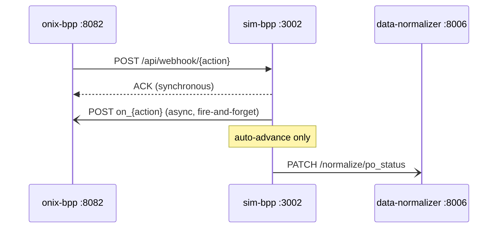
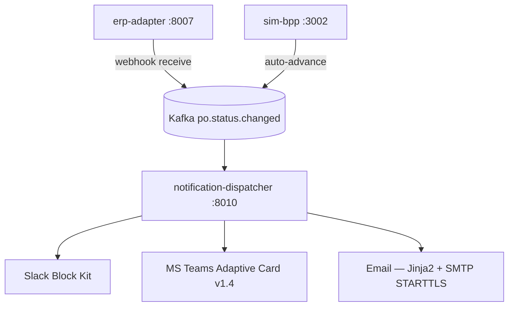

# API Reference — Data and Support Services

The five data and support services covered here sit behind the main transaction pipeline. They are consumed by the orchestrator, beckn-bap-client, IntentParser, and the Next.js frontend. None of these services talk directly to a BPP; all Beckn traffic is owned by beckn-bap-client.

Port map (as-built):

| Service | Host port | Container port | Protocol |
|---|---|---|---|
| data-normalizer | 8006 | 8006 | HTTP/JSON |
| catalog-normalizer | 8005 | 8005 | HTTP/JSON |
| mcp-sidecar | 3000 | 3000 | HTTP/SSE + JSON-RPC 2.0 |
| sim-bpp | 3002 | 3002 | HTTP/JSON |
| analytics | 8009 | 8009 | HTTP/JSON |
| notification-dispatcher | (none published) | — | Kafka consumer only |

(Source: docker-compose.yml -- Confidence: High)

---

## data-normalizer (:8006)

The sole write path into PostgreSQL for the procurement pipeline. Every persistence action in the orchestrator, beckn-bap-client, sim-bpp, and the frontend goes through this service. It never calls any other service; it only writes to and reads from the database.

(Source: services/data-normalizer/README.md -- Confidence: High)

### Architecture position

```mermaid
flowchart TD
    orch[orchestrator :8004] -->|normalize/request, intent, order, audit, memory| dn[data-normalizer :8006]
    bap[beckn-bap-client :8002] -->|normalize/discovery| dn
    scoring[comparative-scoring :8003] -->|normalize/scoring| dn
    simbpp[sim-bpp :3002] -->|PATCH normalize/po_status| dn
    fe[frontend :3000] -->|admin/users, approvals, order/{id}| dn
    dn -->|asyncpg pool| pg[(PostgreSQL 16 + pgvector)]
```

### Endpoints

#### Pipeline write path

| Method | Path | Purpose | Success |
|---|---|---|---|
| POST | `/normalize/request` | Create `procurement_request` from raw text | 201 `{request_id: uuid}` |
| POST | `/normalize/intent` | Persist `parsed_intent` + `beckn_intent` after Stage 1+2 | 201 `{intent_id, beckn_intent_id}` |
| POST | `/normalize/discovery` | Persist `discovery_query` + `seller_offerings` | 201 `{query_id, offering_ids[]}` |
| POST | `/normalize/scoring` | Persist `scored_offers` | 201 |
| POST | `/normalize/order` | Persist full FK chain → `purchase_order` | 201 `{po_id}` |
| PATCH | `/normalize/status` | Update `procurement_request.status` | 200 |
| PATCH | `/normalize/po_status` | Update `purchase_order.status` by `beckn_confirm_ref` | 200 |

#### Order retrieval

| Method | Path | Purpose | Error |
|---|---|---|---|
| GET | `/order/{request_id}` | Full order detail DTO | 404 if not found |

#### Audit trail (Phase 3)

| Method | Path | Purpose |
|---|---|---|
| POST | `/normalize/audit` | Persist `audit_trail_event`; returns `{event_id: uuid}` with status 201 |
| GET | `/normalize/audit?request_id=X` | List all events for a request (max 500, chronological) |
| GET | `/normalize/audit?po_id=X` | List all events for a confirmed PO |
| GET | `/normalize/audit/{event_id}` | Single event with full `reasoning_payload` JSONB |

`retention_until` is set to `event_timestamp + 7 years` on every insert. (Source: KnowledgeBase/project_scaffold/tests/phase3/phase3_audit_trail_system.md -- Confidence: High)

#### Agent memory (Phase 3)

| Method | Path | Purpose |
|---|---|---|
| POST | `/normalize/memory/write` | Embed + store confirmed transaction in `agent_memory_vectors` (vector(384), HNSW cosine) |
| POST | `/normalize/memory/search` | ANN cosine search; returns top-k (default 3) past transactions with similarity >= 0.75 |

Embedding is performed by sentence-transformers `all-MiniLM-L6-v2` (384 dims). Embedding failures are silently skipped — the endpoint never returns an error due to embedding failure alone. (Source: services/data-normalizer/README.md -- Confidence: High)

#### Admin and approvals

| Method | Path | Purpose | Notes |
|---|---|---|---|
| GET | `/admin/users` | List all users | — |
| PATCH | `/admin/users/{user_id}` | Update `approval_threshold` or `department` | Role is NOT updatable here; Keycloak is source of truth |
| GET | `/approvals` | List requests in `pending_approval` status | — |
| POST | `/approvals/{request_id}/decide` | Approve or reject a pending request | — |

#### Liveness

```
GET /health  →  {"status": "ok", "service": "data-normalizer"}
```

### Key normalizations applied on write

| Field | Input | Stored as | Rule |
|---|---|---|---|
| `price_value` | `str` | `DECIMAL(15,2)` | `float(price_value)` |
| `fulfillment_hours` | `Optional[int]` | `INTEGER NOT NULL` | `None` → `24` |
| `composite_score` | `float` in `[0, 1]` | `FLOAT` in `[0, 100]` | `× 100`, clamped |
| `channel` | any string | text | unrecognized channels coerced to `"web"` |
| `confidence` | float | float | clamped to `[0.0, 1.0]` |

(Source: services/data-normalizer/README.md; KnowledgeBase/project_scaffold/tests/phase2/phase2_data_normalizer.md -- Confidence: High)

### FK chain for purchase_order creation

`POST /normalize/order` creates four rows in one transaction:

```
negotiation_outcomes (strategy="skipped")
    └─ approval_decisions (status="auto_approved")
        └─ purchase_orders
```

If the request amount exceeds the requester's `approval_threshold`, the chain pauses at `approval_decisions` with `status="pending"` and the orchestrator routes to the approvals queue. (Source: KnowledgeBase/project_scaffold/components/data_normalizer.md -- Confidence: High)

### Error handling middleware

`db_error_middleware` maps asyncpg exceptions before they reach the caller:

| asyncpg exception | HTTP status | Body |
|---|---|---|
| `UniqueViolationError` | 409 | `{"error": "duplicate"}` |
| `ForeignKeyViolationError` | 409 | `{"error": "fk_violation"}` |
| `CheckViolationError` | 422 | structured |
| `NotNullViolationError` | 422 | structured |
| Any other `PostgresError` | 500 | generic |

(Source: services/data-normalizer/README.md -- Confidence: High)

### SYSTEM_USER_ID

When no `requester_id` is supplied, the service falls back to `SYSTEM_USER_ID` (env var, default `00000000-0000-0000-0000-000000000001`). The corresponding row is upserted into `users` with email `system@procurement-agent.internal`, role `requester`, department `Procurement`, and `approval_threshold=999999.99`. This var is not in docker-compose.yml; the hardcoded default applies in all deployments. (Source: DataNormalizer/repositories/request_repo.py -- Confidence: High)

### Configuration

| Variable | Default | Notes |
|---|---|---|
| `DB_HOST` | `host.docker.internal` | In Docker; override to container name if using containerized Postgres |
| `DB_PORT` | `5432` | — |
| `DB_NAME` | `procurement_agent` | — |
| `DB_USER` | `postgres` | — |
| `DB_PASSWORD` | `postgres123` | — |
| `SYSTEM_USER_ID` | `00000000-0000-0000-0000-000000000001` | UUID for automated/system-initiated requests |

---

## catalog-normalizer (:8005)

Converts raw `on_discover` payloads from any BPP catalog format into a uniform list of `DiscoverOffering` objects. It does not call any other service and has no database dependency.

The source class `CatalogNormalizer` lives in the repo-root `CatalogNormalizer/` package. The service in `services/catalog-normalizer/` is a thin HTTP adapter only. (Source: services/catalog-normalizer/README.md -- Confidence: High)

### Normalization pipeline

```mermaid
flowchart TD
    raw[Raw on_discover payload] --> fd[FormatDetector.detect]
    fd -->|resources[] non-empty| v1[BECKN_V2_FLAT_RESOURCES]
    fd -->|fulfillments[] + tags[]| ondc[ONDC_CATALOG]
    fd -->|providers[].items[]| legacy[LEGACY_PROVIDERS_ITEMS]
    fd -->|items[0].provider is string| bppc[BPP_CATALOG_V1]
    fd -->|no known fingerprint| unk[UNKNOWN]
    v1 & ondc & legacy & bppc --> mapper[SchemaMapper — deterministic]
    unk --> llm[LLMFallbackNormalizer — Ollama qwen3:1.7b]
    mapper & llm --> out[DiscoverOffering list]
```

Detection order: ONDC is checked before LEGACY because ONDC catalogs also have `providers[]`; ONDC's fingerprint (`fulfillments[] + tags[]`) is more specific. (Source: services/catalog-normalizer/README.md -- Confidence: High)

**Important correction:** The catalog-normalizer uses Ollama for the LLM fallback path, not OpenAI. `CatalogNormalizer/llm_fallback.py` calls `instructor.from_openai(OpenAI(base_url=OLLAMA_URL, api_key="ollama"))` — the OpenAI SDK is a compatibility shim. The `OPENAI_API_KEY` environment variable is never read by this service. The README claim about `OPENAI_API_KEY` is incorrect. (Source: CatalogNormalizer/llm_fallback.py -- Confidence: High)

### Endpoints

#### `GET /health`

```json
{"status": "ok", "service": "catalog-normalizer"}
```

#### `POST /normalize`

**Request body:**

```json
{
  "payload": "<raw Beckn on_discover message object>",
  "bpp_id": "bpp.example.com",
  "bpp_uri": "http://onix-bpp:8082/bpp/receiver"
}
```

**Response body:**

```json
{
  "offerings": [
    {
      "bpp_id": "bpp.example.com",
      "bpp_uri": "http://onix-bpp:8082/bpp/receiver",
      "provider_id": "p1",
      "provider_name": "TechSupplies Ltd",
      "item_id": "i001",
      "item_name": "Cat6 UTP Cable 305m",
      "price_value": "2800.00",
      "price_currency": "INR",
      "available_quantity": 50,
      "rating": 4.5,
      "specifications": ["305m", "Cat6", "UTP"],
      "fulfillment_hours": 48,
      "category": "Networking"
    }
  ],
  "format_variant": 1
}
```

On UNKNOWN payloads with no Ollama reachable, `offerings` is `[]` — no error is raised.

### Configuration

| Variable | Default | Notes |
|---|---|---|
| `PORT` | `8005` | — |
| `OLLAMA_URL` | `http://localhost:11434/v1` | Required for LLM fallback on UNKNOWN payloads |
| `NORMALIZER_MODEL` | `qwen3:1.7b` | Model used for LLM fallback; set to `qwen3:1.7b` in docker-compose.yml |

---

## mcp-sidecar (:3000, SSE transport)

An MCP (Model Context Protocol) server that lets IntentParser's Stage 3 validation probe the live Beckn network for catalog items without blocking the event loop. It is stateless; every tool call is an independent probe. The service never throws a JSON-RPC error — all failure paths return a structured `found: false` result. (Source: services/mcp-sidecar/README.md -- Confidence: High)

### Transport

The MCP SSE transport uses two HTTP endpoints:

| Method | Path | Purpose |
|---|---|---|
| GET | `/sse` | Opens an SSE stream; server sends `"endpoint"` event with the POST URL |
| POST | `/messages/` | JSON-RPC 2.0 `tools/call` dispatcher; response arrives as `"message"` SSE event |

IntentParser connects once per pipeline run via `MCPClient` (`IntentParser/mcp_client.py`) and reuses the session for the duration of Stage 3.

### Tool: `search_bpp_catalog`

The only registered MCP tool. It fires a non-blocking Beckn discover probe via beckn-bap-client, waits for the `on_discover` callback via Redis Pub/Sub, and returns semantically ranked items.

**Input arguments:**

| Argument | Type | Required | Description |
|---|---|---|---|
| `item_name` | string | Yes | Canonical item name. Blank value returns `found: false` immediately without a network call. |
| `descriptions` | array[string] | Yes | Specification tokens. Empty array `[]` is valid. |
| `domain` | string | Yes | Beckn domain identifier, e.g. `"procurement"` |
| `version` | string | Yes | Beckn protocol version, e.g. `"1.1.0"` |
| `location` | string | No | Buyer location as `"lat,lon"` decimal string |

**Success response:**

```json
{
  "found": true,
  "items": [
    {
      "item_name": "Cat6 UTP Cable 305m",
      "bpp_id": "bpp.example.com",
      "bpp_uri": "http://onix-bpp:8082/bpp/receiver"
    }
  ],
  "probe_latency_ms": 1420
}
```

Items are sorted descending by cosine similarity to `item_name` (model: `all-MiniLM-L6-v2`, 384 dims). Items below `RANKING_MIN_SIMILARITY` (default `0.30`) are filtered out.

**All failure paths (identical response shape):**

```json
{"found": false, "items": [], "probe_latency_ms": 3000}
```

Returned for: BAP Client timeout, BAP Client unreachable, zero ONIX matches, malformed ONIX response, blank `item_name`, or any unhandled internal exception.

### Async flow and timing

```
t=0      Subscribe Redis channel + POST /discover fired (asyncio.create_task, never awaited)
t≈0.3    ONIX receives discover request
t≈0.5    /on_discover callback publishes to Redis → sidecar unblocked
t=15s    REDIS_RESULT_TIMEOUT fires if no Redis message → found: false
```

`MCP_BAP_TIMEOUT` (default `8.0s`) is a safety valve for the HTTP fire-and-forget task only. The meaningful latency ceiling is `REDIS_RESULT_TIMEOUT`. (Source: services/mcp-sidecar/README.md; ADR-0001 -- Confidence: High)

The discover POST **must not** be awaited. Awaiting it re-introduces the deadlock that ADR-0001 was written to fix. (Source: CLAUDE.md conventions -- Confidence: High)

### `_extract_items_from_callback` formats handled

- Beckn v2 `on_discover`: `message.catalogs[].resources[]` — primary path via Redis Pub/Sub.
- Legacy sync response: `catalog.items[]` — backward compatibility for non-standard BPPs.

### Configuration

| Variable | Source | Default | Notes |
|---|---|---|---|
| `BAP_API_KEY` | env (mandatory) | none | Service refuses to start without it. Never in Dockerfiles or source control. |
| `BAP_CLIENT_URL` | pydantic-settings | `http://localhost:8002` | — |
| `PORT` | pydantic-settings | `3000` | — |
| `REDIS_URL` | `os.getenv()` | `redis://localhost:6379` | Must be a real env var, not just `.env` |
| `REDIS_RESULT_TIMEOUT` | `os.getenv()` | `15` | Must be a real env var, not just `.env` |
| `MCP_BAP_TIMEOUT` | pydantic-settings | `3.0` | HTTP-layer safety valve only |
| `RANKING_MIN_SIMILARITY` | pydantic-settings | `0.30` | Items below this cosine similarity score are filtered |

Note: `REDIS_URL` and `REDIS_RESULT_TIMEOUT` are read via `os.getenv()` in `bap_client.py`, not as pydantic-settings fields. Loading them only through `.env` without exporting them to the shell will cause the defaults to be used silently. (Source: services/mcp-sidecar/README.md -- Confidence: High)

---

## sim-bpp (:3002)

A local Node.js Beckn Provider Platform simulator that replaced `fidedocker/sandbox-2.0`. It supports all ten Beckn lifecycle actions, hot-reloads `catalog.json` without a container rebuild, and optionally auto-advances order status through the full delivery lifecycle. (Source: services/sim-bpp/README.md -- Confidence: High)

### Message flow



### Endpoints

#### `GET /api/health`

```json
{"status": "ok", "service": "sim-bpp", "bpp_id": "bpp.example.com"}
```

#### `POST /api/webhook/{action}`

Inbound Beckn action from `onix-bpp`. Returns an ACK synchronously and fires the corresponding `on_{action}` callback asynchronously to `onix-bpp:8082/bpp/caller`.

Supported actions: `discover`, `select`, `init`, `confirm`, `status`, `track`, `update`, `cancel`, `rate`, `support`.

Unknown actions return HTTP 404 NACK.

**Status codes assigned per action:**

| Action | Status returned |
|---|---|
| `select` | `ACCEPTED` |
| `init` | `ACTIVE` |
| `confirm` | `ACTIVE` |
| `status` | Current order status |
| `cancel` | `CANCELLED` |

### Discovery behavior (AND-token matching)

1. Reads `catalog.json` on every request (hot-reload — no restart needed to change catalog).
2. Tokenizes the query and all catalog entries (lowercase, light singularization).
3. Discards filler tokens that match nothing in the catalog vocabulary.
4. Applies AND logic: all remaining tokens must appear in the item name + keywords.
5. Returns matched items in `message.catalogs[]` in Beckn v2 flat-resource wire format.

This prevents false positives that occurred with OR-logic matching in the original sandbox. (Source: services/sim-bpp/README.md -- Confidence: High)

**Catalog contents:** 9 providers, 31 items, 5 categories (Office Supplies, IT Equipment, IT Peripherals, Networking, Furniture). Each item includes `fulfillment_hours`, `stock` count, and `specs[]`.

### Auto-advance lifecycle

When `SIM_BPP_AUTO_ADVANCE=true`, confirmed orders progress automatically:

```
ACCEPTED → PACKED → SHIPPED → OUT_FOR_DELIVERY → DELIVERED
```

Each transition:
- PATCHes `data-normalizer` at `PATCH /normalize/po_status`
- Publishes to Kafka topic `po.status.changed`

The default in `docker-compose.yml` is `SIM_BPP_AUTO_ADVANCE=true`. Interval is controlled by `SIM_BPP_ADVANCE_INTERVAL_SECS` (default `5`). The same `order_id` cannot be double-scheduled. (Source: docker-compose.yml -- Confidence: High)

### Configuration

| Variable | Default | Notes |
|---|---|---|
| `PORT` | `3002` | — |
| `ONIX_BPP_CALLER` | `http://onix-bpp:8082/bpp/caller` | Where to send `on_{action}` callbacks |
| `BPP_ID` | `bpp.example.com` | Beckn BPP identifier |
| `BPP_URI` | `http://onix-bpp:8082/bpp/receiver` | Beckn BPP URI |
| `CATALOG_PATH` | `/app/catalog.json` | Bind-mounted; edit without rebuild |
| `SIM_BPP_AUTO_ADVANCE` | `true` (docker-compose) | Set `false` to stop lifecycle progression |
| `SIM_BPP_ADVANCE_INTERVAL_SECS` | `5` | Seconds between state transitions |
| `KAFKA_BOOTSTRAP` | `kafka:9092` | Empty string disables Kafka publishing |
| `KAFKA_TOPIC` | `po.status.changed` | — |
| `DATA_NORMALIZER_URL` | `http://data-normalizer:8006` | — |

---

## analytics (:8009)

Procurement reporting service. All dashboard data in the Next.js frontend is proxied through Next.js API routes at `/api/analytics/*`, which in turn call this service. Returns HTTP 503 (not mock data) when the database pool is unavailable. (Source: services/analytics/README.md -- Confidence: High)

### Endpoints

#### `GET /health`

```json
{"status": "ok", "service": "analytics", "db_connected": true}
```

#### `GET /analytics`

**Query parameter:** `period` — `30d`, `90d` (default), or `180d`.

Full dashboard payload. Fields returned:

| Field | Type | Description |
|---|---|---|
| `kpis.total_spend` | decimal string | Total confirmed spend in period |
| `kpis.total_savings` | decimal string | Negotiated savings |
| `kpis.savings_percent` | float | `total_savings / total_spend × 100` |
| `kpis.active_requests` | int | Requests in non-terminal status |
| `kpis.pending_approval` | int | Requests awaiting approval decision |
| `kpis.completed_this_month` | int | Confirmed orders in calendar month |
| `kpis.avg_cycle_time_hours` | float | Mean time from request creation to confirmation |
| `kpis.active_suppliers` | int | Distinct BPPs with at least one confirmed PO |
| `spend_over_time` | array | Weekly `{week, spend}` objects |
| `request_volume` | array | Weekly `{week, count}` objects |
| `acceptance_rate` | array | Weekly `{week, rate}` objects |
| `spend_by_category` | array | `{category, spend}` objects |
| `cycle_time_by_category` | array | `{category, avg_hours, baseline_hours}` |
| `negotiation_savings` | array | Per-provider savings data |
| `supplier_metrics` | array | Per-BPP performance metrics |
| `recent_requests` | array | Last 10 procurement requests |

#### `GET /business-impact`

**Query parameter:** `period` — same as `/analytics`.

Compact KPI set: `{monthly_savings, requests_this_month, avg_cycle_time_hours}`. Used by the frontend summary card.

#### `GET /benchmark`

**Query parameter:** `period` — same as `/analytics`.

CPO benchmarking data. Per category: contracted price vs. best available market price, gap percentage, and projected annual savings.

**Baseline cycle times** used in `cycle_time_by_category` comparisons:

| Category | Baseline (hours) |
|---|---|
| Office Supplies | 72 |
| IT Equipment | 168 |
| Lab Supplies | 96 |
| Furniture | 120 |
| Marketing | 48 |

(Source: services/analytics/README.md -- Confidence: High)

### Fallback behavior

When the PostgreSQL connection pool is unavailable, all three endpoints return HTTP 503. `mock.py` exists in the service directory for local development use but is NOT auto-served. (Source: services/analytics/README.md -- Confidence: High)

### Configuration

| Variable | Default | Notes |
|---|---|---|
| `PORT` | `8009` | — |
| `DB_HOST` | `host.docker.internal` | — |
| `DB_PORT` | `5432` | — |
| `DB_NAME` | `procurement_agent` | — |
| `DB_USER` | `postgres` | — |
| `DB_PASSWORD` | `postgres123` | — |

---

## notification-dispatcher (:8010)

A Kafka consumer that fans procurement order status changes out to Slack, Microsoft Teams, and Email. It exposes only a liveness endpoint — there is no API surface for injecting events. (Source: services/notification-dispatcher/README.md -- Confidence: High)

### Message flow



### Endpoints

```
GET /health  →  {"status": "ok", "service": "notification-dispatcher"}
```

No other HTTP endpoints are exposed.

### Kafka consumer

- Topic: `po.status.changed`
- Consumer group: `notification-dispatcher`
- `auto_offset_reset`: `"latest"`
- `enable_auto_commit`: `True`
- No dead-letter queue; malformed messages are logged at WARNING level and skipped.
- Consumer only starts when `KAFKA_BOOTSTRAP` is non-empty.

### Routing rules

The status field checked is `po_status` first; `state` is the fallback. Matching is case-insensitive.

| Order status | Slack | Teams | Email |
|---|---|---|---|
| `confirmed` | yes | yes | yes |
| `shipped` | yes | yes | no |
| `delivered` | yes | yes | yes |
| `cancelled` | yes | yes | no |
| any other | no | no | no |

Each channel is independent. `asyncio.gather(return_exceptions=True)` is used so a Slack failure does not suppress a Teams notification. A channel is silently disabled when its config URL/host is empty.

### Channel payload formats

**Slack (Block Kit):**
- Header block with emoji per status: confirmed = checkmark, shipped = truck, delivered = package, cancelled = X.
- Section block with `order_id`, `transaction_id`, `source`, `observed_at`.

**Microsoft Teams (Adaptive Card v1.4):**
- Color coding: confirmed/delivered = `good`, shipped = `accent`, cancelled = `attention`.

**Email (Jinja2 HTML templates):**
- Templates: `email_confirmed.html`, `email_delivered.html`, `email_generic.html`.
- Subject: `"Order {STATE} — {order_id}"`.
- Transport: STARTTLS on `SMTP_HOST:SMTP_PORT`.

### Email recipient resolution

The recipient email is resolved at runtime by joining from `purchase_orders.beckn_confirm_ref = order_id` through the FK chain to `users.email`. If the database is unavailable or the lookup returns no match, the email channel is skipped for that event without affecting Slack or Teams delivery. (Source: services/notification-dispatcher/README.md -- Confidence: High)

### Configuration

| Variable | Default | Notes |
|---|---|---|
| `KAFKA_BOOTSTRAP` | `kafka:9092` | Consumer does not start if empty |
| `KAFKA_TOPIC` | `po.status.changed` | — |
| `KAFKA_GROUP_ID` | `notification-dispatcher` | — |
| `SLACK_WEBHOOK_URL` | set in docker-compose.yml | Slack channel disabled if empty |
| `TEAMS_WEBHOOK_URL` | `""` | Teams channel disabled if empty |
| `SMTP_HOST` | `""` | Email disabled if empty |
| `SMTP_PORT` | `587` | — |
| `SMTP_USER` | `""` | — |
| `SMTP_PASSWORD` | `""` | — |
| `SMTP_FROM` | `noreply@procurement-agent.local` | — |
| `DB_HOST` | `host.docker.internal` | For email recipient lookup only |
| `DB_NAME` | `procurement_agent` | — |
| `DB_USER` | `""` | Email recipient lookup disabled if empty |
| `PORT` | `8010` | No host port published in docker-compose.yml; container-only |

---

## Known issues across these services

| Service | Issue | Severity |
|---|---|---|
| catalog-normalizer | README claims `OPENAI_API_KEY` controls LLM fallback; in reality the LLM fallback uses Ollama; `OPENAI_API_KEY` is never read | Documentation (misleads setup) |
| data-normalizer | `embedding_model_type` ENUM in `00_extensions_and_types.sql` only contains `text-embedding-3-large` and `e5-large-v2`; the actual model `all-MiniLM-L6-v2` is added by migration 22 but the DEFAULT on the column is not updated — inserts using the default write the wrong model name | Schema inconsistency |
| mcp-sidecar | `REDIS_URL` and `REDIS_RESULT_TIMEOUT` are read via `os.getenv()`, not pydantic-settings; they must be exported shell env vars, not just present in `.env` | Operational footgun |
| sim-bpp | `SIM_BPP_AUTO_ADVANCE=true` in docker-compose.yml means every confirmed order auto-advances to DELIVERED in ~25 seconds in the default stack; disable for demos that require manual status control | Behavior note |
| analytics | Returns HTTP 503 (not empty data) when DB is down; frontend must handle this explicitly | Integration requirement |
| notification-dispatcher | No dead-letter queue; malformed Kafka messages are dropped permanently | Data loss risk |

(Source: code_findings from gap analysis -- Confidence: High)
