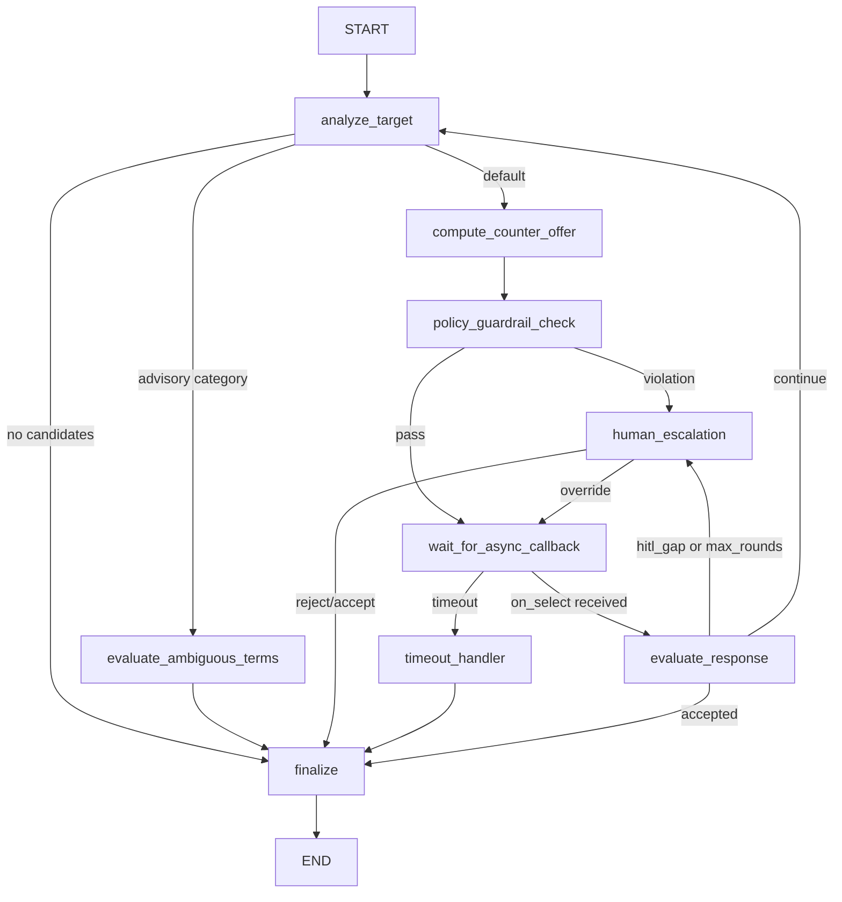
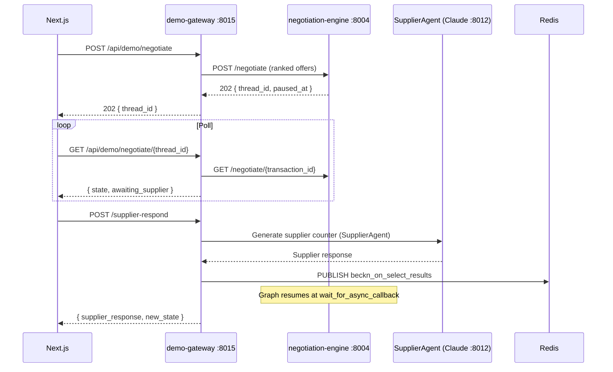
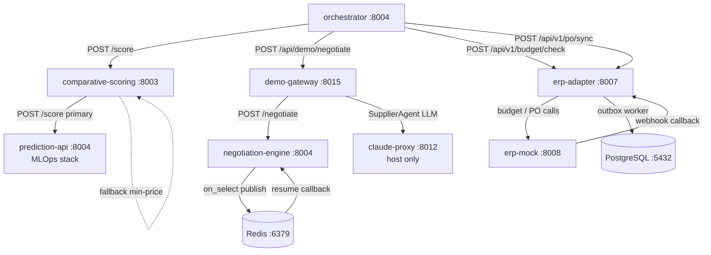

# API Reference -- ERP, ML and Demo Services

This document covers the six services that sit downstream of the core procurement pipeline: the ERP integration layer (`erp-adapter`, `erp-mock`), the ML and negotiation engine layer (`comparative-scoring`, `negotiation_engine`), the multi-network discovery service (`discovery_engine`), and the demo gateway (`frontend_demo_gateway`). Each section documents all endpoints, request/response shapes, authentication, environment variables, and known operational constraints.

---

## 1. erp-adapter (:8007)

### Role

Vendor-neutral ERP integration microservice. Provides two synchronous interfaces consumed by the orchestrator (budget gate, policy evaluation) and one async outbox worker that pushes purchase orders to SAP S/4HANA or Oracle ERP Cloud. Receives inbound lifecycle events from ERP vendors via HMAC-authenticated webhooks.

(Source: services/erp-adapter/README.md -- Confidence: High)

### Deployment

- **Container port:** 8007
- **Host port:** 8007
- **Depends on:** Redis :6379, erp-mock :8008 (dev), Kafka (optional)

### API Endpoints

| Method | Path | Auth | Purpose |
|--------|------|------|---------|
| GET | /healthz | none | Process liveness; always 200 while alive |
| GET | /readyz | none | DB + Redis + per-vendor health + outbox lag check |
| GET | /metrics | none | Prometheus exposition (9 metric series) |
| POST | /api/v1/budget/check | bearer | Synchronous budget gate; hard timeout 800 ms |
| POST | /api/v1/po/sync | bearer | Enqueue PO push; idempotent on transaction_id; returns 202 |
| GET | /api/v1/po/sync/{sync_id} | bearer | Poll outbox row state |
| POST | /api/v1/admin/outbox/{sync_id}/replay | bearer | Reset dead-letter-queue row to pending |
| POST | /api/v1/policy/evaluate | bearer | ERP policy gate; returns preferred suppliers, approval flags, constraints |
| POST | /api/v1/webhooks/sap/po-status | HMAC | Inbound from SAP S/4HANA |
| POST | /api/v1/webhooks/oracle/po-status | HMAC | Inbound from Oracle ERP Cloud |
| POST | /api/v1/webhooks/mock/po-status | HMAC | Inbound from erp-mock (dev only; uses SAP_WEBHOOK_HMAC_SECRET) |

(Source: services/erp-adapter/README.md -- Confidence: High)

### Authentication

**Bearer tokens** — orchestrator calls must include `Authorization: Bearer ${ERP_INTERNAL_TOKEN}`. All `/api/v1/*` routes (except webhooks) enforce this header.

**HMAC webhook verification** — inbound vendor webhooks carry `X-{Vendor}-Signature: sha256=<hex>`. The service verifies the signature against `{VENDOR}_WEBHOOK_HMAC_SECRET` (primary) and, if that fails, against `{VENDOR}_WEBHOOK_HMAC_SECRET_NEXT` (rotation secret). This dual-secret pattern allows zero-downtime key rotation.

(Source: services/erp-adapter/README.md -- Confidence: High)

### Request / Response Shapes

**POST /api/v1/budget/check**

```json
// Request
{
  "transaction_id": "uuid",
  "amount_total": 45000.00,
  "currency": "INR",
  "cost_center": "CC-IND-PROC-01",
  "requester_id": "uuid"
}

// Response (allowed)
{
  "allowed": true,
  "available_balance": "250000.00",
  "hold_id": "hold-<uuid12>"
}

// Response (denied)
{
  "allowed": false,
  "available_balance": "0.00",
  "reasons": ["INSUFFICIENT_FUNDS"]
}
```

**POST /api/v1/po/sync**

```json
// Request
{
  "transaction_id": "uuid",
  "po_id": "uuid",
  "vendor_id": "bpp.example.com",
  "line_items": [{ "item_id": "...", "quantity": 10, "unit_price": 450.0 }],
  "total_amount": 4500.0,
  "currency": "INR"
}

// Response (202 Accepted)
{
  "sync_id": "uuid",
  "status": "pending"
}
```

**POST /api/v1/policy/evaluate** — fail-open on transient error

```json
// Response
{
  "preferred_supplier_ids": ["preferred-bpp-001"],
  "approval_required": false,
  "auto_commit_allowed": true,
  "constraints": {}
}
```

(Source: services/erp-adapter/README.md -- Confidence: High)

### Circuit Breakers

Per-vendor `pybreaker` circuit breakers. Trips to OPEN after `BREAKER_FAIL_MAX` (default 5) consecutive failures. Auto-probes after `BREAKER_RESET_TIMEOUT_SECS` (default 60 s). The budget check endpoint enforces a hard outer timeout of `BUDGET_CHECK_TOTAL_TIMEOUT_MS` (default 800 ms) regardless of the circuit breaker state.

(Source: services/erp-adapter/README.md -- Confidence: High)

### Outbox Pattern

PO push is async using `FOR UPDATE SKIP LOCKED` on `erp_sync_records`. The outbox worker polls at `WORKER_POLL_INTERVAL_SECONDS` (default 2.0 s) with up to `WORKER_CONCURRENCY` (default 10) concurrent goroutines. Retry backoff follows the CSV schedule in `WORKER_BACKOFF_CSV` (default `5,30,120,600,3600` seconds). Rows that exhaust all retries enter the dead-letter queue (status `failed`); operators can replay via `POST /api/v1/admin/outbox/{sync_id}/replay`.

(Source: services/erp-adapter/README.md -- Confidence: High)

### Audit Log Events

The service logs the following structured event types (separate from the orchestrator audit trail):

`BUDGET_CHECK`, `PO_SYNC_ENQUEUED`, `PO_SYNC_ATTEMPT`, `PO_SYNC_SENT`, `PO_SYNC_RETRY`, `PO_DLQ`, `PO_REPLAY`, `WEBHOOK_RECEIVED`, `WEBHOOK_REJECTED`, `STATE_DISCREPANCY`, `POLICY_EVAL`

(Source: services/erp-adapter/README.md -- Confidence: High)

### Required Environment Variables

| Variable | Default | Notes |
|----------|---------|-------|
| DB_HOST | host.docker.internal | Main procurement_agent PostgreSQL |
| DB_PORT | 5432 | |
| DB_NAME | procurement_agent | |
| DB_USER | postgres | |
| DB_PASSWORD | postgres123 | |
| REDIS_URL | redis://redis:6379 | |
| ERP_INTERNAL_TOKEN | dev-internal-token-CHANGE_ME | Bearer token for all API calls |
| ERP_VENDORS | mock | Options: mock, sap, oracle, sap,oracle |
| ERP_BUDGET_CHECK_REQUIRED | true | fail-closed; set false for dev fail-open |
| BUDGET_CHECK_TOTAL_TIMEOUT_MS | 800 | Hard cap for /api/v1/budget/check |
| SAP_WEBHOOK_HMAC_SECRET | dev-sap-hmac-CHANGE_ME | Primary signing key |
| SAP_WEBHOOK_HMAC_SECRET_NEXT | (empty) | Rotation key |
| ORACLE_WEBHOOK_HMAC_SECRET | dev-oracle-hmac-CHANGE_ME | |
| KAFKA_BOOTSTRAP | kafka:9092 | Empty string = Kafka disabled |
| KAFKA_TOPIC | po.status.changed | |

(Source: services/erp-adapter/README.md, docker-compose.yml -- Confidence: High)

### Extending to a New ERP Vendor

Implement `adapters/<vendor>.py` against the `ERPAdapter` Protocol (6 methods: `check_budget`, `push_po`, `cancel_po`, `get_po_status`, `evaluate_policy`, `health`), register in `factory.py`, add env vars to `config.py` and `docker-compose.yml`, add a mock surface in erp-mock.

(Source: services/erp-adapter/README.md -- Confidence: High)

---

## 2. erp-mock (:8008)

### Role

Local ERP stub server simulating SAP S/4HANA and Oracle ERP Cloud surfaces. All state is in-memory and non-durable. Provides controllable failure scenarios for integration testing.

(Source: services/erp-mock/README.md -- Confidence: High)

### Deployment

- **Container port:** 8008
- **Host port:** 8008
- **Depends on:** erp-adapter :8007 (target for webhook callbacks)

### API Endpoints

| Method | Path | Purpose |
|--------|------|---------|
| GET | /health | Liveness |
| POST | /mock/budget/check | Vendor-neutral budget gate |
| POST | /sap/budget/check | SAP-shaped budget gate |
| POST | /oracle/budget/check | Oracle-shaped budget gate |
| POST | /mock/policy/evaluate | ERP policy evaluation → PolicyEnvelope |
| POST | /mock/po/create | Vendor-neutral PO creation |
| POST | /sap/oauth2/token | SAP OAuth2 client_credentials token |
| GET | /sap/opu/odata/sap/API_PURCHASEORDER_PROCESS_SRV/A_PurchaseOrder | SAP CSRF token fetch |
| POST | /sap/opu/odata/sap/API_PURCHASEORDER_PROCESS_SRV/A_PurchaseOrder | SAP PO creation |
| POST | /oauth2/v1/token | Oracle OAuth2 token |
| POST | /fscmRestApi/resources/11.13.18.05/purchaseOrders | Oracle PO creation |
| POST | /mock/scenario | Switch active scenario at runtime |

(Source: services/erp-mock/README.md -- Confidence: High)

### Configurable Scenarios

The active scenario is set via the `MOCK_SCENARIO` environment variable or the `X-Mock-Scenario` header (per-request override). Requests without the header use the active scenario.

| Scenario | Budget result | PO failures | Webhook delay | Policy |
|----------|---------------|-------------|---------------|--------|
| `happy` (default) | allowed, balance 250,000 | 0 | 2 s | standard |
| `budget_exhausted` | denied, balance 0 | — | — | — |
| `po_create_fails` | allowed | 10 failures before success | standard | standard |
| `webhook_delayed` | allowed | 0 | 30 s | standard |
| `erp_approval_required` | allowed | 0 | 2 s | approval_required=True |
| `erp_preferred_supplier` | allowed | 0 | 2 s | preferred_supplier_ids=["preferred-bpp-001"] |

(Source: services/erp-mock/README.md -- Confidence: High)

### Response Shapes

```json
// Budget (success)
{ "allowed": true, "available_balance": "250000.00", "hold_id": "hold-<uuid12>" }

// Budget (denied)
{ "allowed": false, "available_balance": "0.00", "reasons": ["INSUFFICIENT_FUNDS"] }

// SAP PO
{ "d": { "PurchaseOrder": "4500NNNNNNN" } }

// Oracle PO
{ "OrderNumber": "PO-OR-NNNNNN", "Status": "Open" }

// Mock PO
{ "erp_reference_id": "MOCK-PO-XXXXXXXXXX", "vendor": "mock" }

// Policy
{
  "preferred_supplier_ids": [],
  "approval_required": false,
  "auto_commit_allowed": true,
  "constraints": {}
}
```

(Source: services/erp-mock/README.md -- Confidence: High)

### Automatic Webhook Emission

After a successful `POST /mock/po/create`, the service schedules a signed `po-status` webhook to `WEBHOOK_TARGET_URL/api/v1/webhooks/mock/po-status` after `WEBHOOK_DELAY_SECONDS`. The webhook is HMAC-SHA256 signed with `SAP_WEBHOOK_HMAC_SECRET`.

All PO create endpoints honor the `Idempotency-Key` request header.

(Source: services/erp-mock/README.md -- Confidence: High)

### Environment Variables

| Variable | Default | Notes |
|----------|---------|-------|
| PORT | 8008 | |
| MOCK_SCENARIO | happy | Active scenario |
| WEBHOOK_TARGET_URL | http://erp-adapter:8007 | |
| WEBHOOK_DELAY_SECONDS | 2.0 | Seconds before callback fires |
| SAP_WEBHOOK_HMAC_SECRET | dev-sap-hmac-CHANGE_ME | Used for all mock webhook signing |
| ORACLE_WEBHOOK_HMAC_SECRET | dev-oracle-hmac-CHANGE_ME | Currently unused by mock emitter |

(Source: services/erp-mock/README.md, docker-compose.yml -- Confidence: High)

---

## 3. comparative-scoring (:8003)

### Role

Thin ML scoring adapter. Forwards `DiscoverOffering` lists to the `prediction-api` (RankNet/LambdaRank Phase 2 MLOps service) as the primary path. Falls back to a min-price heuristic when the ML backend is unreachable.

(Source: services/comparative-scoring/README.md -- Confidence: High)

### Deployment

- **Container port:** 8003
- **Host port:** 8003
- **Depends on:** prediction-api :8004 (ComparativeAndScoreing MLOps stack, optional)

### API Endpoints

| Method | Path | Purpose |
|--------|------|---------|
| GET | /health | `{"status": "ok", "service": "comparative-scoring"}` |
| POST | /score | Rank a list of DiscoverOfferings; return top recommendation |

(Source: services/comparative-scoring/README.md -- Confidence: High)

### POST /score

**Request**

```json
{
  "offerings": [
    {
      "item_id": "item-001",
      "item_name": "A4 Paper 80gsm",
      "provider_name": "PaperDirect",
      "price_value": "168.00",
      "price_currency": "INR",
      "fulfillment_hours": 48,
      "rating": 4.2,
      "bpp_id": "bpp.example.com"
    }
  ]
}
```

**Response — ML path (prediction-api available)**

```json
{
  "selected": { /* DiscoverOffering */ },
  "scoring": {
    "engine": "ml",
    "model_version": "ProcurementRanker:v7 (Production)",
    "pipeline": "phase2_ranknet",
    "ranking": [
      { "bpp_id": "bpp.example.com", "item_id": "item-001", "score": 0.87, "rank": 1 }
    ]
  }
}
```

**Response — fallback path (prediction-api unreachable)**

```json
{
  "selected": { /* cheapest DiscoverOffering */ },
  "scoring": { "engine": "heuristic_min_price" }
}
```

**Empty list input:** `{ "selected": null }` — never raises.

(Source: services/comparative-scoring/README.md -- Confidence: High)

### DiscoverOffering → CatalogItem Field Mapping

The adapter translates `DiscoverOffering` fields to the `CatalogItem` schema expected by `prediction-api` before forwarding:

| DiscoverOffering field | CatalogItem field | Notes |
|------------------------|-------------------|-------|
| `item_id` | `id` | |
| `price_value` | `price` | str or float accepted |
| `fulfillment_hours` | `delivery_time_hours` | int |
| `provider_name` | `supplier_name` | optional |
| `rating` | `risk_score` | optional; defaults to 0.5 if absent |

(Source: services/comparative-scoring/README.md -- Confidence: High)

### ML Backend (ComparativeAndScoreing)

The prediction-api lives in `services/ComparativeAndScoreing/`. It runs as a separate Docker Compose stack:

```bash
docker compose -f services/ComparativeAndScoreing/docker-compose.mlops.yaml up prediction-api
```

On first start with no registered Production model, prediction-api falls back to static weights `[0.4, 0.3, 0.3]` for price/speed/risk features. Set `ALLOW_FALLBACK_WEIGHTS=false` to disable this fallback for canary deployments.

Feature vector (n,3) used by the RankNet model:
- `x_price` — inverted price, cheaper = higher score
- `x_speed` — inverted delivery hours, faster = higher score
- `x_risk` — rating, higher rating = higher score

All three features are min-max scaled within each scoring session. Zero-variance columns are set to 1.0 (neutral).

(Source: services/ComparativeAndScoreing/README.md -- Confidence: High)

### Environment Variables

| Variable | Default | Notes |
|----------|---------|-------|
| PREDICTION_API_URL | http://prediction-api:8004 | ML backend |
| PREDICTION_TIMEOUT_S | 8.0 | Timeout for ML call; triggers fallback on expiry |
| SCORING_FALLBACK_ENABLED | true | Set false to hard-fail when ML backend unavailable |

(Source: services/comparative-scoring/README.md -- Confidence: High)

---

## 4. negotiation_engine (:8004 container / :18004 host)

### Role

Automated price negotiation service using a LangGraph state machine. Accepts a ranked list of `DiscoverOffering` objects, computes a guardrail-bounded counter-offer, exchanges rounds with the BPP via Beckn `/select` callbacks over Redis Pub/Sub, and returns a final `NegotiationOutcome`.

(Source: services/negotiation_engine/README.md -- Confidence: High)

### Deployment Note — Port Conflict

Both `orchestrator` and `negotiation_engine` bind container port 8004. `docker-compose.yml` resolves this by mapping `negotiation-engine` to **host port 18004** (`18004:8004`). The service is reached internally from `demo-gateway` via the Docker DNS name `negotiation-engine:8004`. Direct host-side debugging uses `localhost:18004`.

(Source: docker-compose.yml lines 453-455, services/negotiation_engine/README.md -- Confidence: High)

### API Endpoints

| Method | Path | Purpose |
|--------|------|---------|
| GET | /healthz | Kubernetes liveness; always 200 while process alive |
| GET | /readyz | Readiness: graph compiled, Kafka/Postgres config checked |
| POST | /negotiate | Start negotiation; returns 202 with thread_id |
| GET | /negotiate/{transaction_id} | Inspect current LangGraph snapshot (HITL UI) |

(Source: services/negotiation_engine/README.md -- Confidence: High)

### POST /negotiate

**Request (NegotiateRequest)**

```json
{
  "transaction_id": "uuid",
  "category": "office_supplies",
  "ranked_offers": [ /* [DiscoverOffering, ...] */ ],
  "policy": {
    "max_discount_pct": 0.20,
    "approval_threshold_pct": 0.15
  },
  "max_rounds": 3
}
```

**Response (202 Accepted)**

```json
{
  "thread_id": "uuid",
  "paused_at": "wait_for_async_callback",
  "round": 0,
  "final_outcome": null
}
```

The graph parks at `wait_for_async_callback` after issuing the counter-offer. Resumption is driven by the `OnSelectListener` subscribing to Redis channel `beckn_on_select_results`.

(Source: services/negotiation_engine/README.md -- Confidence: High)

### LangGraph State Machine



(Source: services/negotiation_engine/README.md -- Confidence: High)

### Category Profiles

| Category | Base discount | Alpha | Advisory only | Applies to |
|----------|--------------|-------|---------------|------------|
| commodity | 10 % | 1.00 | No | office_supplies, stationery, cabling |
| specialized | 5 % | 0.70 | No | machinery, industrial |
| it_equipment | 0 % | 0.50 | Yes | laptops, servers, enterprise_it |
| medical | 0 % | 0.40 | Yes | medical_devices, pharma |
| unknown | 5 % | 0.60 | No | any unrecognised category |

(Source: services/negotiation_engine/README.md -- Confidence: High)

### Guardrail Layers

Three independent layers enforce the 20 % maximum discount hard cap and category/supplier caps:

- **L1 — Pydantic field constraint:** `discount_pct` field bounded `[0.0, 0.20]`; raises `ValidationError` before any business logic runs.
- **L2 — `validate_counter_offer()`:** Enforces G1 (absolute 20 % cap), G2 (category cap), G3 (supplier cap), G5 (lead-time minimum), G6 (quantity bounds). Violations route to `human_escalation` interrupt.
- **L3 — ONIX schema validation:** Verifies the Beckn `/select` wire format before transmission.

(Source: services/negotiation_engine/README.md -- Confidence: High)

### Async Resume

`OnSelectListener` subscribes to Redis channel `beckn_on_select_results` (configurable via `BECKN_ON_SELECT_CHANNEL`). On receiving a message it calls `graph.ainvoke(Command(resume=payload))` to resume the parked graph at `wait_for_async_callback`.

(Source: services/negotiation_engine/README.md -- Confidence: High)

### Checkpointing

- **Durable (production):** `AsyncPostgresSaver` when `NEGOTIATION_POSTGRES_DSN` is set. Uses the separate `negotiation` database (not `procurement_agent`). The `postgres` service in `docker-compose.yml` (host port 55432) is provisioned exclusively for this purpose.
- **Ephemeral (dev default):** `MemorySaver`; state lost on container restart.

(Source: services/negotiation_engine/README.md, docker-compose.yml -- Confidence: High)

### Environment Variables

| Variable | Default | Notes |
|----------|---------|-------|
| OLLAMA_BASE_URL | http://localhost:11434/v1 | LLM endpoint for advisory mode |
| OLLAMA_MODEL | qwen3:8b | docker-compose.yml overrides to Claude via proxy at :8012 |
| NEGOTIATION_POSTGRES_DSN | (empty) | Empty = MemorySaver fallback |
| KAFKA_BOOTSTRAP | (empty) | Empty = Kafka disabled |
| REDIS_URL | redis://localhost:6379 | |
| BECKN_ON_SELECT_CHANNEL | beckn_on_select_results | |
| PORT | 8004 | Container port |

In `docker-compose.yml`, `NEGOTIATION_OPENAI_BASE_URL` is set to `http://host.docker.internal:8012/v1` (the `claude_openai_proxy` service) and `NEGOTIATION_OPENAI_MODEL` to `claude-3-5-sonnet`. This replaces the Ollama path for LLM calls in the negotiation advisory mode when running in Docker.

(Source: services/negotiation_engine/README.md, docker-compose.yml -- Confidence: High)

---

## 5. discovery_engine (:8006) — Orphaned Service

### Status Warning

`discovery_engine` is a fully implemented multi-network Beckn discovery fan-out service but is **absent from `docker-compose.yml`** and is **not called by any other service**. Its documented port (8006) conflicts with `data-normalizer` (also 8006). The service is orphaned — complete code exists at `services/discovery_engine/` but has no deployment entry and no callers in the current stack. It represents a planned future integration point for multi-network Beckn discovery.

(Source: services/discovery_engine/README.md, docker-compose.yml, code_findings gap 2 -- Confidence: High)

### Role (when deployed)

Fan-out concurrent discovery across N configured Beckn networks, deduplicate results by `provider_id:item_id:currency`, and return a merged `MultiSearchResult`. Always returns HTTP 200 regardless of individual network failures; degraded state is surfaced in the response body.

(Source: services/discovery_engine/README.md -- Confidence: High)

### API Endpoints

| Method | Path | Purpose |
|--------|------|---------|
| GET | /healthz | Always 200 while process alive |
| GET | /readyz | Returns 503 if no networks are configured |
| POST | /search/multi-network | Concurrent fan-out discovery |

### POST /search/multi-network

**Request (IntentPayload)**

```json
{
  "item": "A4 Paper 80gsm",
  "descriptions": ["500 reams", "ream"],
  "quantity": 500,
  "location_coordinates": "12.9716,77.5946",
  "delivery_timeline": 72
}
```

**Response (MultiSearchResult) — always HTTP 200**

```json
{
  "items": [ /* AggregatedItem list */ ],
  "total": 12,
  "degraded": false,
  "failed_networks": [],
  "sources": ["network_a", "network_b"]
}
```

Check `degraded` and `len(items)` — a 200 with `degraded: true` means one or more networks failed.

(Source: services/discovery_engine/README.md -- Confidence: High)

### Deduplication and Geo-Merge

Items are deduplicated by `provider_id:item_id:currency`. Items with the same name and currency from different networks within `DISCOVERY_GEO_PROXIMITY_KM` (default 0.5 km) have their `sources[]` arrays merged rather than being duplicated.

(Source: services/discovery_engine/README.md -- Confidence: High)

### Per-Network Circuit Breaker

Each configured network has an independent `asyncio.Lock`-protected circuit breaker. Trips to OPEN after `DISCOVERY_CB_FAILURE_THRESHOLD` (default 3) consecutive failures. Probes automatically after `DISCOVERY_CB_RECOVERY_TIMEOUT_S` (default 30 s). Handles all failure types: timeout, 5xx, 4xx, connection refused, invalid JSON.

(Source: services/discovery_engine/README.md -- Confidence: High)

### Environment Variables

| Variable | Default | Notes |
|----------|---------|-------|
| DISCOVERY_NETWORKS_JSON | `[{"name":"network_a","base_url":"http://localhost:8080","timeout_s":5.0}]` | JSON array; each entry: name, base_url, timeout_s, headers (optional) |
| DISCOVERY_DEFAULT_TIMEOUT_S | 5.0 | Per-network request timeout |
| DISCOVERY_CB_FAILURE_THRESHOLD | 3 | Failures before OPEN |
| DISCOVERY_CB_RECOVERY_TIMEOUT_S | 30 | Seconds before probe attempt |
| DISCOVERY_GEO_PROXIMITY_KM | 0.5 | Merge threshold for geo-duplicate items |
| DISCOVERY_HTTP_CONNECTOR_LIMIT | 100 | aiohttp connector pool size |
| DISCOVERY_HTTP_OUTER_TIMEOUT_S | 15.0 | Hard outer timeout across all networks |
| DISCOVERY_API_HOST | 0.0.0.0 | Bind host |
| DISCOVERY_API_PORT | 8006 | Container port (conflicts with data-normalizer) |
| DISCOVERY_LOG_LEVEL | INFO | |

(Source: services/discovery_engine/README.md -- Confidence: High)

---

## 6. frontend_demo_gateway (:8015)

### Port Note

`CLAUDE.md` lists this service at `:8005` but this is incorrect. `docker-compose.yml` maps host port 8015 to container port 8015, and `services/frontend_demo_gateway/README.md` documents port 8005 as the default in its own README. The orchestrator's `DEMO_GATEWAY_URL` defaults to `http://localhost:8015`. Use **8015** for all demo-gateway interactions.

(Source: docker-compose.yml line 504, services/orchestrator/src/workflow.py line 55, code_findings gap 6 -- Confidence: High)

### Role

Demo Backend-for-Frontend (BFF). Bridges the Next.js frontend to the real Phase 2 LTR PyTorch scoring model and the LangGraph negotiation engine. Uses real components (PyTorch, LangGraph) while mocking infrastructure (no MLflow registry, no live Beckn network). Also hosts the SupplierAgent, an LLM persona that simulates a seller responding to counter-offers during negotiation demos.

(Source: services/frontend_demo_gateway/README.md -- Confidence: High)

### Deployment

- **Container port:** 8015
- **Host port:** 8015
- **Depends on:** negotiation-engine :8004, Redis :6379, `claude_openai_proxy` :8012 (must be running on host)

### API Endpoints

| Method | Path | Auth | Purpose |
|--------|------|------|---------|
| GET | /healthz | none | Kubernetes liveness |
| GET | /readyz | none | Confirms Phase2Scorer + SupplierAgent loaded, Ollama reachable |
| POST | /api/demo/score | none | Run Phase 2 LTR PyTorch model on submitted suppliers |
| POST | /api/demo/negotiate | none | Start LangGraph negotiation; returns 202 with thread_id |
| GET | /api/demo/negotiate/{thread_id} | none | Poll current negotiation state |
| POST | /api/demo/negotiate/{thread_id}/supplier-respond | none | Trigger LLM supplier response and resume buyer graph |

(Source: services/frontend_demo_gateway/README.md -- Confidence: High)

### POST /api/demo/score — Phase 2 LTR Scoring

Runs a real `nn.Linear(3,1)` PyTorch forward pass (the `Phase2Scorer`) on submitted supplier data.

**Pipeline:**

1. Coerce frontend payload through `CatalogItem` schema
2. Extract (n,3) feature tensor: price/speed/risk, min-max normalised to `[0,1]`
3. Run `Phase2Scorer.forward()`; fall back to weights `[0.50, 0.30, 0.20]` if no trained model is available
4. Return ranked list with per-item feature vectors

```json
// Request
{
  "suppliers": [
    { "id": "s1", "price": 168.00, "delivery_time_hours": 48, "risk_score": 0.8 }
  ]
}

// Response
{
  "recommended": { "id": "s1", "price": 168.00, ... },
  "ranked_list": [
    { "item": { ... }, "score": 0.87, "rank": 1, "features": [0.9, 0.7, 0.8] }
  ],
  "model_version": "Phase2Scorer (demo)",
  "pipeline": "phase2_ranknet"
}
```

(Source: services/frontend_demo_gateway/README.md -- Confidence: High)

### POST /api/demo/negotiate — Negotiation Demo Flow



(Source: services/frontend_demo_gateway/README.md -- Confidence: High)

**Negotiation parameters (orchestrator autonomous path):**
- Poll loop: up to 120 iterations at 1 s intervals
- Maximum rounds: 3
- Target discount: 18 % below list price
- Concession on `max_rounds` exhaustion: buyer accepts supplier's final price

(Source: services/orchestrator/src/workflow.py -- Confidence: High)

### SupplierAgent

The SupplierAgent is an LLM persona simulating a realistic seller. It receives the buyer's counter-offer and generates a supplier response with a new price.

- **LLM backend:** `OLLAMA_BASE_URL` (default `http://host.docker.internal:8012/v1`) — this is the `claude_openai_proxy` service, not actual Ollama
- **Model:** `SUPPLIER_MODEL` (default `claude-3-5-sonnet`) — mapped through the proxy to the local Claude CLI
- **Acceptable discount floor:** `SUPPLIER_ACCEPTABLE_DISCOUNT_FLOOR` (default 0.10 = 10 %)
- **Fallback:** If LLM output is unusable, a deterministic step-down formula is applied (no hard failure)

(Source: services/frontend_demo_gateway/README.md, docker-compose.yml -- Confidence: High)

### Environment Variables

| Variable | Default | Notes |
|----------|---------|-------|
| NEGOTIATION_ENGINE_URL | http://localhost:8004 | docker-compose: http://negotiation-engine:8004 |
| REDIS_URL | redis://localhost:6379/0 | |
| REDIS_ON_SELECT_CHANNEL | beckn_on_select_results | Must match negotiation_engine channel |
| OLLAMA_BASE_URL | http://host.docker.internal:8012/v1 | Points to claude_openai_proxy, not Ollama |
| OLLAMA_API_KEY | (empty) | Proxy key (CLAUDE_PROXY_KEY value) |
| SUPPLIER_MODEL | claude-3-5-sonnet | Mapped by proxy to sonnet |
| BUYER_HUMANIZE_MODEL | gpt-4o-mini | Mapped by proxy to haiku |
| SUPPLIER_ACCEPTABLE_DISCOUNT_FLOOR | 0.10 | Minimum discount SupplierAgent will accept |
| SUPPLIER_MAX_ROUNDS | 3 | |
| SUPPLIER_TEMPERATURE | 0.4 | Passed to API but ignored by proxy (see §7) |
| SUPPLIER_TIMEOUT_S | 60.0 | |
| ENGINE_TIMEOUT_S | 15.0 | Timeout for negotiation_engine calls |

(Source: services/frontend_demo_gateway/README.md, docker-compose.yml -- Confidence: High)

### Legacy Code

`services/frontend_demo_gateway/mock_negotiate.py` is superseded by `live_negotiate.py`. Do not add new code to `mock_negotiate.py`.

(Source: services/frontend_demo_gateway/README.md -- Confidence: High)

---

## 7. claude_openai_proxy (:8012) — Undocumented Dependency

### Status Warning

This service is **entirely absent from `CLAUDE.md`, `docker-compose.yml`, and all service READMEs** despite being a hard runtime dependency for `negotiation-engine` and `demo-gateway`. It is not Dockerized and must be started manually on the host.

(Source: code_findings gap 5, gap 9, gap 17 -- Confidence: High)

### Role

A loopback FastAPI service that wraps the local `claude` CLI binary as an OpenAI-compatible `/v1/chat/completions` endpoint. Every request maps to a one-shot `claude -p --no-session-persistence --output-format stream-json` invocation. Allows services that use the OpenAI SDK to call Claude without code changes.

(Source: services/claude_openai_proxy/README.md, services/claude_openai_proxy/main.py -- Confidence: High)

### Startup

```bash
# From repo root, with claude CLI installed and authenticated
export CLAUDE_PROXY_KEY=your-local-proxy-key
uvicorn services.claude_openai_proxy.main:app --host 127.0.0.1 --port 8012
```

For persistence across sessions, install the provided systemd unit:

```bash
cp services/claude_openai_proxy/claude-proxy.service ~/.config/systemd/user/
systemctl --user daemon-reload && systemctl --user enable --now claude-proxy
sudo loginctl enable-linger $USER  # one-time; requires sudo
journalctl --user -u claude-proxy -f
```

The systemd unit binds `0.0.0.0` (not loopback) so Docker-bridged containers can reach it via `host.docker.internal:8012`.

(Source: services/claude_openai_proxy/README.md, services/claude_openai_proxy/claude-proxy.service -- Confidence: High)

### API Endpoints

| Method | Path | Auth | Purpose |
|--------|------|------|---------|
| GET | /healthz | none | Always 200 |
| GET | /v1/models | bearer | Returns mapped model list |
| POST | /v1/chat/completions | bearer | Sync or SSE streaming completion |

Bearer auth uses `Authorization: Bearer ${CLAUDE_PROXY_KEY}`. If `CLAUDE_PROXY_KEY` is empty, auth is disabled with a startup warning.

(Source: services/claude_openai_proxy/main.py -- Confidence: High)

### Model Mapping

OpenAI model names are translated to Claude aliases before invoking the CLI:

| OpenAI name | Claude alias |
|-------------|-------------|
| gpt-4o | sonnet |
| gpt-4o-mini | haiku |
| gpt-4-turbo | sonnet |
| gpt-4 | opus |
| gpt-3.5-turbo | haiku |
| claude-3-5-sonnet | sonnet |
| claude-3-5-haiku | haiku |
| Any `claude-*` | passed through |

Unknown names fall back to `CLAUDE_PROXY_DEFAULT_MODEL` (default `sonnet`).

(Source: services/claude_openai_proxy/config.py -- Confidence: High)

### Known Limitations

- `temperature`, `top_p`, and `max_tokens` are accepted in the request body but **silently ignored** — the Claude CLI has no sampling knobs.
- Each request bills the host Claude account and incurs approximately 1–3 s CLI cold-start latency per request.
- Concurrency is capped at `CLAUDE_PROXY_MAX_CONCURRENCY` (default 2); excess requests queue (not rejected).
- All acting and IO tools are disabled by default (`CLAUDE_PROXY_DISABLE_TOOLS=true`) to prevent interactive permission hangs in `-p` mode. Disallowed tools: Bash, Edit, Write, Read, Glob, Grep, MultiEdit, NotebookEdit, WebFetch, WebSearch, Task, TodoWrite.

(Source: services/claude_openai_proxy/README.md, services/claude_openai_proxy/config.py -- Confidence: High)

### Environment Variables

| Variable | Default | Notes |
|----------|---------|-------|
| CLAUDE_PROXY_KEY | (empty) | Empty = auth disabled |
| CLAUDE_PROXY_HOST | 127.0.0.1 | Systemd unit overrides to 0.0.0.0 |
| CLAUDE_PROXY_PORT | 8012 | |
| CLAUDE_PROXY_BINARY_PATH | /home/carbaje/.local/bin/claude | Must point to your local `claude` binary |
| CLAUDE_PROXY_DEFAULT_MODEL | sonnet | Fallback when model name not in map |
| CLAUDE_PROXY_MAX_CONCURRENCY | 2 | |
| CLAUDE_PROXY_TIMEOUT_S | 120.0 | Hard timeout; subprocess killed on expiry |
| CLAUDE_PROXY_DISABLE_TOOLS | true | Disables all Bash/IO tools |

(Source: services/claude_openai_proxy/config.py -- Confidence: High)

---

## 8. ERP + ML Service Interaction Map



(Inferred from service READMEs and docker-compose.yml)

---

## 9. Known Issues and Discrepancies

| Issue | Affected service | Impact | Source |
|-------|-----------------|--------|--------|
| `CLAUDE.md` lists `frontend_demo_gateway` at `:8005`; actual port is `:8015` | demo-gateway | Misleading documentation; orchestrator `DEMO_GATEWAY_URL` default may point to wrong port | docker-compose.yml, code_findings |
| `discovery_engine` port 8006 conflicts with `data-normalizer` port 8006 | discovery_engine | No runtime collision (service not in docker-compose) but confusing if/when wired | services/discovery_engine/README.md |
| `discovery_engine` has no docker-compose entry and no callers | discovery_engine | Service is orphaned; multi-network fan-out is not active | docker-compose.yml, code_findings |
| `claude_openai_proxy` is not in `docker-compose.yml` or `CLAUDE.md` | demo-gateway, negotiation-engine | Developers may not know they need to start the proxy | services/claude_openai_proxy/README.md |
| `negotiation` audit events (`event_type='negotiate'`) are never written by the orchestrator | orchestrator | Negotiation outcomes missing from audit trail; 'negotiate' enum value is unused | code_findings gap 6 |
| `COMPLEX_MODEL` collapsed to `qwen3:1.7b` in Docker; complexity routing effectively disabled | intention-parser | Docker-deployed service never uses `qwen3:8b` despite CLAUDE.md documenting two-tier routing | docker-compose.yml, IntentParser/config.py |

(Source: code_findings sections 2, 5, 6, 11, 22 -- Confidence: High)
