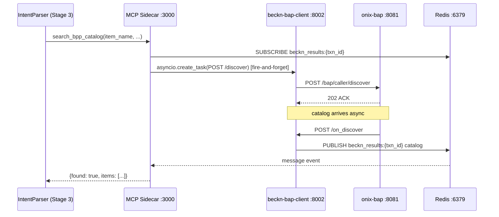
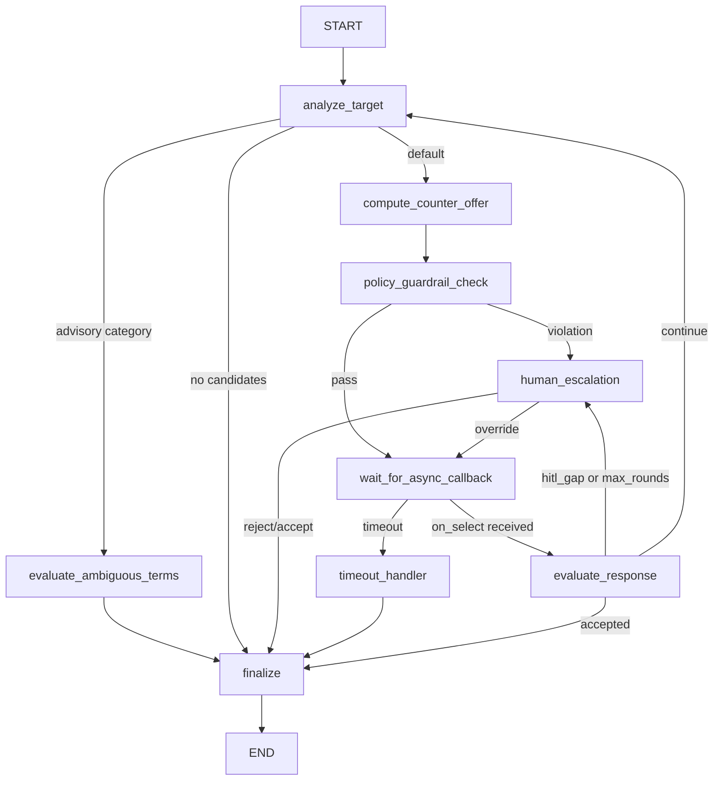

# Implemented Features

> Source priority: KnowledgeBase verified docs, code verification findings, CLAUDE.md conventions.
> All (Inferred) labels mark conclusions drawn from observed patterns rather than explicit documentation.

---

## 1. Natural Language Procurement (IntentParser)

The IntentParser pipeline translates a free-text purchase request into a validated, structured `BecknIntent` ready for protocol dispatch. It runs as a FastAPI service at port 8001 and is also volume-mounted into the `intention-parser` Docker container.

(Source: IntentParser/README.md -- Confidence: High)

### 1.1 Three-Stage Pipeline

```
Stage 1 — LLM Classification
  qwen3:8b (complex) or qwen3:1.7b (simple)
  Output: ParsedIntent {intent_class, confidence, raw_query}

Stage 2 — BecknIntent Extraction
  qwen3:8b (complex) or qwen3:1.7b (simple)
  instructor + Ollama, Mode.JSON, max_retries=3
  Output: BecknIntent {item, descriptions[], quantity, location_coordinates, delivery_timeline, budget_constraints, currency}

Stage 3 — Hybrid Validation
  Path A: pgvector ANN cosine search against bpp_catalog_semantic_cache
          (sentence-transformers all-MiniLM-L6-v2, 384 dims, HNSW)
  Path B: MCP sidecar live Beckn ONIX probe (Redis Pub/Sub, 15 s timeout)
  Output: VALIDATED / AMBIGUOUS / CACHE_MISS + mcp_validated / CACHE_MISS + not_found
```

(Source: IntentParser/README.md, CLAUDE.md -- Confidence: High)

### 1.2 Complexity Routing (Stage 1 and Stage 2)

The `_is_complex(query)` heuristic selects the model for each stage:

- **Complex path** (COMPLEX_MODEL): query length > 120 chars, or >= 2 numeric tokens, or procurement keywords present.
- **Simple path** (SIMPLE_MODEL): everything else.

COMPLEX_MODEL defaults to `qwen3:8b` in `IntentParser/config.py`. The `docker-compose.yml` overrides both COMPLEX_MODEL and SIMPLE_MODEL to `qwen3:1.7b`, collapsing the two tiers in the containerised deployment. Running IntentParser locally preserves the `qwen3:8b` path for complex queries.

(Source: IntentParser/config.py, docker-compose.yml code finding -- Confidence: High)

### 1.3 Validation Thresholds

| Zone | Condition | Action |
|---|---|---|
| VALIDATED | similarity >= 0.85 | Return BecknIntent, proceed |
| AMBIGUOUS | 0.45 <= similarity < 0.85 | Return BecknIntent with low confidence flag |
| CACHE_MISS + mcp_validated | Stage 3 MCP probe returns found=true | Use MCP result |
| CACHE_MISS + not_found | Stage 3 probe finds nothing | Trigger recovery flow |

Thresholds are hardcoded constants, not env-configurable despite appearing in the config table. (Source: IntentParser/README.md -- Confidence: High)

### 1.4 Stage 3 Recovery Flow

When validation yields `not_found`, the system executes:

1. `broaden_procurement_query()` — strips specificity tokens via regex; falls back to Claude Sonnet 4.6 (requires `ANTHROPIC_API_KEY`, opt-in only) for semantic query reformulation.
2. Retry Stage 3 with the broadened query.
3. `log_unmet_demand()` — stub; logs demand to orchestrator; no DB write yet.
4. `notify_buyer_no_stock()` — stub; logs notification intent; no actual dispatch yet.
5. `trigger_open_rfq_flow()` — stub; logs RFQ intent; no microservice call yet.

All three recovery stubs are implemented as logging-only placeholders with no assigned owner or completion timeline. (Source: IntentParser/README.md, IntentParser/recovery.py code finding -- Confidence: High)

### 1.5 API Endpoints

| Endpoint | Mode | Stages |
|---|---|---|
| POST /parse | Synchronous | Stage 1 + Stage 2 only |
| POST /parse/batch | Synchronous bulk | Stage 1 + Stage 2 only |
| POST /parse/full | Async | Stage 1 + Stage 2 + Stage 3 + recovery |

(Source: IntentParser/README.md -- Confidence: High)

### 1.6 Canonical BecknIntent Encoding (Anti-Corruption Layer)

| Field | Canonical Type | Example |
|---|---|---|
| delivery_timeline | int hours | 72 (not "3 days", not "P3D") |
| location_coordinates | "lat,lon" decimal string | "12.9716,77.5946" |
| budget_constraints | typed BudgetConstraints {max, min} | {max: 200.0, min: 0.0} |
| descriptions | list[str] | ["80gsm", "A4", "500 sheets"] |

(Source: shared/README.md -- Confidence: High)

---

## 2. Beckn Protocol Lifecycle

The system implements the full Beckn Protocol v2.0.0 buyer-side lifecycle from discovery through status polling, mediated by the ONIX adapter.

### 2.1 Full Transaction Lifecycle

The `beckn-bap-client` service (port 8002) implements all five protocol actions:

- **discover** — POST to ONIX `/bap/caller/discover`; returns only ACK; catalog arrives async via `/on_discover` webhook.
- **select** — POST to ONIX `/bap/caller/select`; returns ACK confirming item acceptance.
- **init** — POST with buyer billing and fulfillment details; awaits `on_init` callback.
- **confirm** — POST with payment terms; awaits `on_confirm` callback returning `{order_id, order_state}`.
- **status** — POST with `{message:{contract:{id,commitments}}}`; awaits `on_status` callback.

Additional lifecycle actions (track, update, cancel, rate, support) are handled by `sim-bpp` and routed through `onix-bpp`. (Source: services/beckn-bap-client/README.md, services/sim-bpp/README.md -- Confidence: High)

### 2.2 ED25519 Signing via ONIX

All outbound Beckn requests are signed by the `onix-bap` Go adapter (port 8081) using ED25519 keys loaded from `config/`. The ONIX schema validator is pinned at commit `d43ec30d` — later commits introduced a `$ref` resolution bug in `SignatureHeader`. Do not upgrade without an end-to-end signing test. (Source: config/README.md -- Confidence: High)

### 2.3 Async Discovery Decoupling (ADR-0001)

Beckn v2.0.0 `POST /discover` returns only an ACK. The catalog arrives later via `/on_discover` webhook. To prevent the MCP sidecar from deadlocking its event loop waiting for a callback, a Redis Pub/Sub pattern decouples the wait:



The MCP sidecar subscribes BEFORE firing the discover POST to eliminate the race condition. The `asyncio.create_task` must never be replaced with `await` — doing so reintroduces the deadlock. (Source: ADR-0001, services/mcp-sidecar/README.md -- Confidence: High)

### 2.4 on_discover Split Routing

The ONIX BAPReceiver routing YAML routes `on_discover` to the dedicated endpoint `http://beckn-bap-client:8002/on_discover`, while all other callbacks (`on_select`, `on_init`, `on_confirm`, `on_status`) route to `http://beckn-bap-client:8002/bap/receiver/{action}`. This split ensures the Redis Pub/Sub publish happens in the dedicated handler. (Source: config/README.md -- Confidence: High)

### 2.5 DeDi Registry Bypass

All ONIX routing YAMLs use `targetType: url` instead of `bap` or `bpp`. This bypasses the DeDi service registry, enabling the full Beckn protocol flow inside the Docker bridge network without registering with an external gateway. To switch to a real Beckn network, change `targetType` to `bpp` and set the real network address. (Source: config/README.md -- Confidence: High)

### 2.6 CallbackCollector

The `CallbackCollector` manages one `asyncio.Queue` per `(transaction_id, action)` pair. Protocol: always `register()` before sending the protocol request; call `collect(timeout)` to await the callback; call `cleanup()` after. If ONIX is unavailable, `/discover` returns a mock response (status: "mock") so the upstream pipeline degrades gracefully. (Source: Bap-1/CLAUDE.md, services/beckn-bap-client/README.md -- Confidence: High)

---

## 3. Supplier Discovery and Comparison

### 3.1 sim-bpp Local BPP Simulator (port 3002)

`sim-bpp` is a Node.js service that replaced `fidedocker/sandbox-2.0`. It implements all 10 Beckn actions and provides:

- **Hot-reload catalog**: `catalog.json` is read on every request; no restart needed for catalog changes.
- **AND-token matching**: tokenizes the discovery query and catalog entries; discards filler tokens that match nothing in the catalog vocabulary; returns only items where ALL remaining tokens appear in the item name or keywords. This prevents false positives from partial keyword overlap.
- **9 providers, 31 items, 5 categories**: Office Supplies, IT Equipment, IT Peripherals, Networking, Furniture.
- **Auto-advance lifecycle** (`SIM_BPP_AUTO_ADVANCE=true`): ACCEPTED → PACKED → SHIPPED → OUT_FOR_DELIVERY → DELIVERED. Each transition PATCHes data-normalizer at `/normalize/po_status` and publishes to Kafka `po.status.changed`. Default interval: 5 seconds. Enabled by default in `docker-compose.yml`.

(Source: services/sim-bpp/README.md, docker-compose.yml code finding -- Confidence: High)

### 3.2 Catalog Normalization (catalog-normalizer, port 8005)

The `catalog-normalizer` service accepts a raw `on_discover` payload and normalises it to `[DiscoverOffering]`. It detects one of four deterministic formats, with LLM fallback for unknown payloads:

| Variant | Detection Fingerprint | Mapper |
|---|---|---|
| 1. BECKN_V2_FLAT_RESOURCES | `resources[]` non-empty | SchemaMapper (rule-based) |
| 2. LEGACY_PROVIDERS_ITEMS | `providers[].items[]` sub-key | SchemaMapper |
| 3. BPP_CATALOG_V1 | `items[0].provider` is string | SchemaMapper |
| 4. ONDC_CATALOG | `fulfillments[]` + `tags[]` both present | SchemaMapper |
| 5. UNKNOWN | None of the above | LLMFallbackNormalizer (Ollama qwen3:1.7b via instructor) |

ONDC is checked before LEGACY because ONDC catalogs also have `providers[]` — the more specific fingerprint wins. The LLM fallback uses Ollama (not OpenAI) via `instructor.from_openai(OpenAI(base_url=OLLAMA_URL, api_key="ollama"))`. `OPENAI_API_KEY` is not read. (Source: services/catalog-normalizer/README.md, CatalogNormalizer/llm_fallback.py code finding -- Confidence: High)

### 3.3 Comparative Scoring (port 8003)

The `comparative-scoring` service is a thin adapter that calls the ML `prediction-api` as primary and falls back to the Phase 1 min-price heuristic when the ML backend is unavailable.

- **Phase 1 (active)**: `min(offerings, key=lambda o: float(o.price_value))` — cheapest wins.
- **Phase 2 ML primary (active when MLOps stack is running)**: Routes to `prediction-api:8004` (RankNet/LambdaRank). Feature vector: price (inverted), delivery speed (inverted), risk/rating — all min-max normalised within session. Falls back to static weights `[0.4, 0.3, 0.3]` if no Production model is registered in MLflow.
- **SCORING_FALLBACK_ENABLED**: `true` by default; set `false` to force ML-only for canary deployments.

(Source: services/comparative-scoring/README.md, services/ComparativeAndScoreing/README.md -- Confidence: High)

### 3.4 Agent Memory Context Injection

Before scoring, the orchestrator calls `_fetch_memory_context(item_text, limit=3, timeout=5s)` which queries `agent_memory_vectors` (pgvector ANN cosine, similarity >= 0.75) for past confirmed transactions involving the same or similar items. If hits are found, a time-decayed loyalty bonus is applied:

```
memory_delta(provider) = sum[0.03 * exp(-days_old * ln(2) / 90)] per past PO
  capped at ±0.10
  max 5 orders per provider considered
  new providers receive delta = 0 (no penalty)
```

The `memory_context` node appears in the frontend Agent Reasoning panel whenever memory hits are found. The `memory_adjustment` step appears only if the top recommendation changes due to the bonus. (Source: KnowledgeBase project_scaffold, services/orchestrator/README.md -- Confidence: High)

---

## 4. Automated Negotiation

The negotiation engine (port 8004, `negotiation_engine` service) implements an automated buyer-side negotiation strategy using LangGraph. It is reached by the orchestrator exclusively through the `demo-gateway` service (port 8015).

(Source: services/negotiation_engine/README.md, services/orchestrator/src/workflow.py code finding -- Confidence: High)

### 4.1 LangGraph State Machine



### 4.2 Five Category Profiles

| Category | Base Discount | Alpha | Advisory Only | Applies To |
|---|---|---|---|---|
| commodity | 10% | 1.00 | No | office_supplies, stationery, cabling |
| specialized | 5% | 0.70 | No | machinery, industrial |
| it_equipment | 0% | 0.50 | Yes | laptops, servers, enterprise_it |
| medical | 0% | 0.40 | Yes | medical_devices, pharma |
| unknown | 5% | 0.60 | No | any unrecognised category |

(Source: services/negotiation_engine/README.md -- Confidence: High)

### 4.3 Three Guardrail Layers

- **L1 — Pydantic field constraint**: `discount_pct` in `[0.0, 0.20]`. This is enforced at model instantiation and cannot be bypassed.
- **L2 — `validate_counter_offer()`**: Applies four rules — G1 (absolute max 20%), G2 (category cap), G3 (supplier cap), G5 (lead-time minimum), G6 (quantity minimum).
- **L3 — ONIX schema validation**: Wire format correctness check before any Beckn message is dispatched.

The 20% maximum discount is a hard-coded policy cap enforced at both the schema level (L1) and the DB schema level (`negotiation_outcomes.discount_percent CHECK (0.0, 20.0)`). (Source: services/negotiation_engine/README.md -- Confidence: High)

### 4.4 HITL Interrupt and Redis Async Resume

When the guardrail check detects a `hitl_gap` (supplier counter-offer gap exceeds threshold) or when a HITL interrupt is required, the LangGraph parks at `human_escalation`. The graph is resumed via `GET /negotiate/{transaction_id}` and an external decision submitted to resume the parked state.

The async `on_select` response from ONIX is delivered via Redis channel `beckn_on_select_results`. `OnSelectListener` subscribes to this channel and calls `graph.ainvoke(Command(resume=payload))` to wake the parked buyer graph. Durable checkpointing is provided by `AsyncPostgresSaver` when `NEGOTIATION_POSTGRES_DSN` is set; falls back to `MemorySaver` (lost on restart). (Source: services/negotiation_engine/README.md -- Confidence: High)

### 4.5 Orchestrator Integration Path

Autonomous negotiation (`_run_autonomous_negotiation`) is triggered from the `/run` endpoint when `decision.requires_negotiation` is true. The call sequence is:

```
orchestrator → POST {DEMO_GATEWAY_URL}/api/demo/negotiate → demo-gateway → POST {NEGOTIATION_ENGINE_URL}/negotiate → negotiation_engine
```

The orchestrator then polls `GET {DEMO_GATEWAY_URL}/api/demo/negotiate/{thread_id}` and triggers `POST .../supplier-respond` when `awaiting_supplier=true`. This drives the `SupplierAgent` (Claude via proxy at :8012) to respond, which publishes to Redis and resumes the buyer graph. Maximum 120 polls at 1-second intervals, maximum 3 negotiation rounds, 18% below list-price as target. (Source: services/orchestrator/src/workflow.py code finding -- Confidence: High)

### 4.6 Negotiation Savings Reporting (Phase 4 Fix)

Prior to Phase 4, the `negotiation_outcomes` table always showed
`initial_price == final_price` (zero savings). Two independent bugs caused
this:

1. **Invalid enum values in order_repo.py** — `negotiation_strategy_type` was
   written as `"negotiated"` (not a valid enum member) and
   `acceptance_status_type` was written as `"agreed"` (not valid). Both caused
   silent DB constraint errors on every negotiated order, leaving the
   `negotiation_outcomes` row unwritten.
   - Fix: `"negotiated"` → `"accept_margin"` (negotiated path),
     `"skipped"` (no-negotiation path); `"agreed"` → `"accepted"`
     (negotiated), `"skipped"` (no-negotiation).
   - File: `DataNormalizer/repositories/order_repo.py`

2. **`original_price` not forwarded by orchestrator** — neither the autonomous
   run flow nor the HITL `decide_run` flow passed `original_price` (the catalog
   list price before negotiation) to `_persist_order_record()`. The field
   defaulted to `None`, so `initial_price` and `final_price` were always equal.
   - Fix: both call sites in `services/orchestrator/src/workflow.py` now pass
     `original_price`; `data-normalizer POST /normalize/order` accepts and
     forwards it.

After the fix, the analytics savings query (`negotiation_savings` field in
`GET /analytics`) returns correct non-zero values for negotiated orders.

---

## 5. ERP Integration

The `erp-adapter` service (port 8007) provides a vendor-neutral integration layer for enterprise ERP systems, with the `erp-mock` service (port 8008) providing a local stub.

### 5.1 Vendor-Neutral ERPAdapter Protocol

Six-method Protocol interface (Python `typing.Protocol`). Concrete implementations: `MockAdapter`, `SAPAdapter`, `OracleAdapter`. Selected at startup via `ERP_VENDORS` env var (`mock`, `sap`, `oracle`, `sap,oracle` for multi-vendor). (Source: services/erp-adapter/README.md -- Confidence: High)

### 5.2 Budget Gate (Synchronous, Fail-Closed)

`POST /api/v1/budget/check` is called synchronously before `/confirm`. Hard timeout: 800ms (`BUDGET_CHECK_TOTAL_TIMEOUT_MS=800`). If the check fails or times out:

- `ERP_BUDGET_CHECK_REQUIRED=true` (default): the commit is blocked (fail-closed).
- `ERP_BUDGET_CHECK_REQUIRED=false`: the commit proceeds (fail-open, dev only).

(Source: services/erp-adapter/README.md -- Confidence: High)

### 5.3 Async PO Push via PostgreSQL Outbox

PO creation is fire-and-forget via `POST /api/v1/po/sync`, which enqueues an idempotent outbox row in `erp_sync_records`. A background worker (`FOR UPDATE SKIP LOCKED`) dequeues and dispatches to the ERP vendor REST API with exponential backoff (`5, 30, 120, 600, 3600` seconds). Retry state is tracked in the outbox row; dead-lettered rows can be replayed via `POST /api/v1/admin/outbox/{sync_id}/replay`. Kafka is the design-spec event bus but is replaced by this PostgreSQL outbox pattern in Phases 1-3. (Source: services/erp-adapter/README.md -- Confidence: High)

### 5.4 Dual-Secret HMAC Webhook Rotation

Inbound vendor webhooks are authenticated with HMAC-SHA256. Two secrets are supported simultaneously to enable zero-downtime key rotation:

- `{VENDOR}_WEBHOOK_HMAC_SECRET` — current active secret.
- `{VENDOR}_WEBHOOK_HMAC_SECRET_NEXT` — next secret (valid during rotation window).

A webhook is accepted if it validates against either secret. (Source: services/erp-adapter/README.md, CLAUDE.md -- Confidence: High)

### 5.5 Per-Vendor Circuit Breakers (pybreaker)

Each ERP vendor has an independent `pybreaker.CircuitBreaker` instance. Default configuration: trip to OPEN after 5 consecutive failures (`BREAKER_FAIL_MAX=5`); auto-probe after 60 seconds (`BREAKER_RESET_TIMEOUT_SECS=60`). The readiness endpoint (`GET /readyz`) includes per-vendor circuit breaker state and outbox lag. (Source: services/erp-adapter/README.md -- Confidence: High)

### 5.6 ERP Policy Evaluation

`POST /api/v1/policy/evaluate` returns a `PolicyEnvelope` with: `preferred_supplier_ids`, `approval_required`, `auto_commit_allowed`, `constraints`. The gate is fail-open on transient ERP errors (unlike the budget gate). (Source: services/erp-adapter/README.md -- Confidence: High)

### 5.7 Six Mock Scenarios (erp-mock)

| Scenario | Budget | PO Create | Webhook Delay | Policy |
|---|---|---|---|---|
| happy (default) | allowed, 250,000 balance | immediate | 2s | standard |
| budget_exhausted | denied, 0 balance | n/a | n/a | standard |
| po_create_fails | allowed | fails 10x then succeeds | 2s | standard |
| webhook_delayed | allowed | immediate | 30s | standard |
| erp_approval_required | allowed | immediate | 2s | approval_required=True |
| erp_preferred_supplier | allowed | immediate | 2s | preferred_supplier_ids=["preferred-bpp-001"] |

Scenario is set globally via `MOCK_SCENARIO` env var or per-request via `X-Mock-Scenario` header. (Source: services/erp-mock/README.md -- Confidence: High)

---

## 6. Agent Memory and Learning

### 6.1 Write Path (Fire-and-Forget)

After a confirmed order, the orchestrator calls `asyncio.create_task(_persist_memory(...))` — never `await` — to avoid blocking the commit response. The task POSTs to `/normalize/memory/write` on the `data-normalizer`. The handler embeds the transaction text using `sentence-transformers all-MiniLM-L6-v2` (384 dims) and inserts a row into `agent_memory_vectors`. Embedding failures are silently skipped; the endpoint never returns an error due to embedding failure. (Source: KnowledgeBase project_scaffold, services/data-normalizer/README.md -- Confidence: High)

Stored text format:
```
"{item} ordered from {provider} at {price} {currency} delivery in {hours}h"
```

### 6.2 Read Path (Enrichment Before Scoring)

`_fetch_memory_context(raw_query, limit=3)` is called with a 5-second timeout before comparative scoring. It POSTs to `/normalize/memory/search`, which runs a pgvector HNSW ANN cosine search. Items with similarity < 0.75 are filtered. The top-k=3 results are attached to the scoring pipeline as a loyalty-weighted delta.

### 6.3 Vector Store Architecture

- **Table**: `agent_memory_vectors` in PostgreSQL 16 + pgvector.
- **Dimension**: `vector(384)` — corrected from spec's `vector(3072)` by migration `22_agent_memory_vector_dim.sql`.
- **Index**: HNSW cosine, `ef_search=100`.
- **Embedding model**: `BAAI/bge-small-en-v1.5` via `fastembed` ONNX (~65 MB, no PyTorch dependency). Downloaded from HuggingFace on first use; 10-30 second cold start.

(Source: KnowledgeBase project_scaffold implementation_deviations.md, services/data-normalizer/README.md -- Confidence: High)

### 6.4 Frontend Reasoning Panel

When memory hits are found, two nodes are injected into the `reasoning_steps` list visible in the Agent Reasoning panel:
- `memory_context` (role: observe) — always present when there are hits.
- `memory_adjustment` (role: reason) — present only when the top recommendation changes due to the memory bonus.

---

## 7. Audit Trail

The audit trail captures every significant agent decision in `audit_trail_events` with a reasoning payload and 7-year retention for compliance with SOX 404, GDPR, and IT Act 2000.

### 7.1 Nine Event Types

`discover`, `normalize`, `score`, `negotiate`, `approve`, `confirm`, `override`, `erp_sync`, `notification`

(Source: KnowledgeBase project_scaffold tests/phase3/phase3_audit_trail_system.md -- Confidence: High)

### 7.2 Thirteen Write Points in the Orchestrator

All calls to `_persist_audit()` confirmed in `services/orchestrator/src/workflow.py`:

| Stage | event_type | agent_action |
|---|---|---|
| Request creation (run_pipeline_from_intent, run_pipeline, _compare_phase) | normalize | request_created |
| Intent persistence (3 call sites) | normalize | intent_persisted |
| Discovery — no offerings | discover | no_offerings_found |
| Discovery completed (2 call sites) | discover | discovery_completed: N offerings |
| Scoring (3 call sites) | score | scored N offerings |
| Order confirmed (commit handler) | confirm | order_confirmed: {order_id} |
| Order status change (poll loop) | confirm | order state X → Y |
| Seller webhook | confirm | seller webhook → {state} |
| Approval decision | approve | approver_approved |
| User cancellation | override | user_cancelled |
| Autonomous commit | confirm | auto_commit order_confirmed: {order_id} |
| HITL rejection | override | user_rejected_run |
| HITL confirmation | confirm | decide_run order_confirmed: {order_id} |

**Gap**: The `negotiate` event type is defined in the ENUM but zero `_persist_audit` calls in `workflow.py` use it. Negotiation outcomes are appended to `result['messages']` only — the audit trail has no record of negotiation steps from the main orchestrator path. `erp_sync` and `notification` are expected to be written by the `erp-adapter` and `notification-dispatcher` services respectively. (Source: services/orchestrator/src/workflow.py code finding -- Confidence: High)

### 7.3 Schema and Retention

- `reasoning_payload`: JSONB — stores full LLM reasoning chain, model inputs/outputs, and decision context. Serves as a LangSmith substitute until Phase 4.
- `kafka_offset`: BIGINT — placeholder for future Kafka topic offset; hardcoded to `0` in current orchestrator.
- `splunk_indexed`: boolean flag — reserved for future Splunk sink exporter.
- `retention_until`: `event_timestamp + interval '7 years'` — set at INSERT time; no automated deletion job yet.

(Source: KnowledgeBase project_scaffold tests/phase3/phase3_audit_trail_system.md -- Confidence: High)

### 7.4 Query Endpoints

- `POST /normalize/audit` → `{event_id: uuid}` HTTP 201
- `GET /normalize/audit?request_id=X` → event chain for a procurement request (max 500)
- `GET /normalize/audit?po_id=X` → events associated with a confirmed PO
- `GET /normalize/audit/{event_id}` → individual event with full `reasoning_payload`

### 7.5 Frontend Audit Trail Viewer

The Next.js frontend provides `/request/{id}/audit` as an SSR authenticated page rendering `AuditTrailPanel` — a vertical timeline with per-event-type icons (colour-coded) and collapsible `reasoning_payload` expanders. Empty state shows "No audit events recorded yet." (Source: KnowledgeBase project_scaffold tests/phase3/phase3_audit_trail_system.md -- Confidence: High)

---

## 8. Notifications

The `notification-dispatcher` service (port 8010) consumes Kafka `po.status.changed` events and fans out to Slack, Microsoft Teams, and Email.

### 8.1 Status-Based Routing Rules

| Order Status | Slack | Teams | Email |
|---|---|---|---|
| confirmed | yes | yes | yes |
| shipped | yes | yes | no |
| delivered | yes | yes | yes |
| cancelled | yes | yes | no |
| anything else | no | no | no |

The `po_status` key is tried first; `state` is the fallback. (Source: services/notification-dispatcher/README.md -- Confidence: High)

### 8.2 Channel Implementations

- **Slack**: Block Kit payload with a header block (emoji per status: checkmark/truck/package/X) and a section block containing order_id, transaction_id, source, observed_at.
- **MS Teams**: Adaptive Card v1.4. Color: confirmed/delivered = good, shipped = accent, cancelled = attention.
- **Email**: Jinja2 HTML templates (`email_confirmed.html`, `email_delivered.html`, `email_generic.html`). Subject: `"Order {STATE} — {order_id}"`. Transport: STARTTLS on `SMTP_HOST:SMTP_PORT`.

### 8.3 Fault Isolation

All three channel dispatches run inside `asyncio.gather(return_exceptions=True)`. A failure in one channel (e.g., Slack webhook timeout) does not prevent delivery to the others. Any channel whose configuration URL/host is empty is silently disabled at startup — the service starts normally with any combination including none. Email recipient is resolved via a DB JOIN through the `purchase_orders` FK chain to `users.email`; if the DB is unavailable, email is skipped without affecting Slack/Teams. (Source: services/notification-dispatcher/README.md -- Confidence: High)

---

## 9. Frontend

The Next.js 13.5.6 buyer-facing application (port 3000) covers the complete procurement workflow from request submission through order tracking and analytics.

### 9.1 Eleven Page Routes

| Route | Purpose |
|---|---|
| / | Landing / dashboard |
| /login | Keycloak OIDC redirect (Phase Two hosted) |
| /request/new | Wizard: NL query → compare → commit |
| /request/[id] | Order detail view |
| /request/[id]/audit | Audit trail timeline viewer |
| /approvals | Pending approval queue |
| /approvals/[id] | Approve / reject decision UI |
| /analytics | Procurement analytics dashboard |
| /demo/score | Phase 2 LTR scoring demo |
| /demo/negotiate | LangGraph negotiation demo |
| /admin/users | User threshold management |

(Source: frontend/README.md -- Confidence: High)

### 9.2 Wizard Session Flow

The three-step wizard (`/request/new`) stores session state in `WizardSession` (TypeScript, `sessionStorage`):

1. **Step 1 — Intent**: NL query → `POST /api/parse` → BecknIntent preview.
2. **Step 2 — Compare**: `POST /api/compare` → ranked offerings with ML scores and memory context.
3. **Step 3 — Commit**: User selects item → `POST /api/commit` → order confirmation with order_id.

Session is cleared on tab close. (Source: frontend/README.md -- Confidence: High)

### 9.3 Real-Time Order Tracking

WebSocket endpoint `GET /ws/status/{txn_id}` on the orchestrator broadcasts order status transitions to the frontend `StatusPoller` component. When Kafka/WebSocket is unavailable, the frontend falls back to 30-second HTTP polling via `GET /status/{txn_id}/{order_id}`. (Source: KnowledgeBase project_scaffold tests/phase2/phase2_real_time_tracking.md -- Confidence: High)

### 9.4 Analytics Dashboard

The analytics page queries `/api/analytics?period=30d|90d|180d` (proxy to `analytics:8009`). Returned fields include: KPIs (total_spend, total_savings, savings_percent, active_requests, pending_approval, completed_this_month, avg_cycle_time_hours, active_suppliers), spend_over_time (weekly), request_volume (weekly), acceptance_rate (weekly), spend_by_category, cycle_time_by_category, negotiation_savings, supplier_metrics, and the last 10 recent_requests. Returns HTTP 503 (not mock data) when the DB pool is unavailable. (Source: services/analytics/README.md -- Confidence: High)

### 9.5 Authentication

Authentication uses `NextAuth 4` with `KeycloakProvider` only — there are no stub credentials. The Phase Two (phasetwo.io) hosted Keycloak tenant at `euc1.auth.ac`, realm `procurement-agent`, client `procurement-frontend`, is required for the app to function. Roles (`admin`, `approver`, `requester`) are read from JWT claim `realm_access.roles`; the Keycloak client must have a "realm roles" mapper with "Add to ID token: ON". (Source: frontend/src/lib/auth.ts code finding -- Confidence: High)

### 9.6 Negotiation Demo

The `/demo/negotiate` page drives a live LangGraph negotiation via `demo-gateway:8015`. The buyer graph submits a counter-offer; a `SupplierAgent` (Claude via `claude_openai_proxy:8012`) responds; the buyer graph evaluates the response and continues up to 3 rounds. A real `Phase2Scorer` (`nn.Linear(3,1)`) is used for the scoring demo at `/demo/score` — this is not a mock. (Source: services/frontend_demo_gateway/README.md -- Confidence: High)

---

## 10. Multi-Network Discovery (discovery_engine)

The `discovery_engine` service (port 8006) implements concurrent fan-out discovery across multiple Beckn networks. It is fully implemented but is currently absent from `docker-compose.yml` and is not called by any other deployed service — its integration path is undocumented and its status is orphaned/planned. (Source: services/discovery_engine/README.md, code finding gap 2 -- Confidence: High)

### 10.1 Fan-Out Architecture

`POST /search/multi-network` accepts an `IntentPayload` and dispatches it concurrently to all configured networks via `asyncio.gather(return_exceptions=True)`. Each network call has an individual timeout (`DISCOVERY_DEFAULT_TIMEOUT_S=5.0`) plus an outer hard ceiling (`DISCOVERY_HTTP_OUTER_TIMEOUT_S=15.0`).

### 10.2 Per-Network Circuit Breakers

Each configured network has an independent circuit breaker with an `asyncio.Lock`. Trips to OPEN after `DISCOVERY_CB_FAILURE_THRESHOLD=3` consecutive failures. Auto-probes after `DISCOVERY_CB_RECOVERY_TIMEOUT_S=30` seconds. Handles timeouts, 4xx, 5xx, connection refused, and invalid JSON.

### 10.3 Result Aggregation and Deduplication

`ResultAggregator` deduplicates by `provider_id:item_id:currency`. Items from different networks representing the same provider within `DISCOVERY_GEO_PROXIMITY_KM=0.5` km have their `sources[]` merged rather than creating duplicate entries.

The endpoint always returns HTTP 200 regardless of network failures. The `degraded` boolean and `failed_networks[]` array in the response allow callers to detect partial results. (Source: services/discovery_engine/README.md -- Confidence: High)

---

## 11. MLOps Stack (ComparativeAndScoreing)

The MLOps stack is a separate Docker Compose sub-stack (`services/ComparativeAndScoreing/docker-compose.mlops.yaml`) with three independently deployable sub-services.

### 11.1 Phase2Scorer Model

`nn.Linear(3,1)` PyTorch model. Three input features, all min-max normalised within the session:

| Feature | Source Field | Direction |
|---|---|---|
| x_price | price / price_value | inverted (cheaper = higher) |
| x_speed | delivery_time_hours / fulfillment_hours | inverted (faster = higher) |
| x_risk | rating / risk_score (default 0.5) | direct (higher rating = higher) |

Zero-variance columns are assigned 1.0 (neutral). (Source: services/ComparativeAndScoreing/README.md -- Confidence: High)

### 11.2 RankNet Training Pipeline

- **Algorithm**: RankNet pairwise loss + LambdaRank gradient scaling.
- **Optimizer**: SGD (`LR=0.05`) or AdamW; 200 epochs (`N_EPOCHS=200`).
- **Metric**: NDCG@5.
- **Promotion**: Auto-promotes to MLflow Staging if test NDCG@5 >= `AUTO_PROMOTE_NDCG=0.85`. Never auto-promotes to Production — that step is manual.
- **Fallback**: static weights `[0.4, 0.3, 0.3]` (price/speed/risk) when no Production model is registered. Disabled for canary deploys via `ALLOW_FALLBACK_WEIGHTS=false`.

### 11.3 Weekly Drift Detection

The `validation-service` loads the current Production model and evaluates NDCG@5 on a fresh 50-session holdout. If `current_ndcg < baseline_ndcg - NDCG_DRIFT_THRESHOLD (0.05)`, it exits with code 1 and writes `/tmp/model_drift_detected.flag`. Hot-reload of a newly promoted model is triggered via `POST /reload` without restarting the `prediction-api`. (Source: services/ComparativeAndScoreing/README.md -- Confidence: High)

### 11.4 Phase 3 Transition Triggers

Promote to OptNet/cvxpylayers (differentiable LP) when ANY of:

- NDCG@5 improvement < 0.5% across 3 consecutive retraining cycles.
- Closed procurement records exceed 50,000 in PostgreSQL.
- Multi-supplier split-orders are required (structurally incompatible with single-argmax output).
- Decision-quality gap > 15% relative regret versus oracle on holdout.

(Source: services/ComparativeAndScoreing/README.md -- Confidence: High)

---

## 12. Infrastructure

### 12.1 Docker Compose Stack (18 Services)

All services run on the `beckn_network` Docker bridge network. Key architectural notes:

- The **main PostgreSQL** (`procurement_agent` database) runs natively on the host, reached by containers via `host.docker.internal:5432`. It is NOT the `postgres` service defined in `docker-compose.yml`.
- The `postgres` service in `docker-compose.yml` (port 55432) serves the **negotiation database only** (`db: negotiation`) — used by `negotiation-engine` and `AsyncPostgresSaver`.
- The **orchestrator** exposes both `:8000` and `:8004` on the host. Port 8000 matches the frontend `.env.local` default `BAP_URL`.
- The **negotiation-engine** maps host port `:18004` (not `:8004`) to avoid collision with orchestrator's `:8004` host mapping.
- The **notification-dispatcher** has no host port published — it is reachable only within `beckn_network`.

(Source: docker-compose.yml code finding -- Confidence: High)

### 12.2 Service Port Map

| Service | Host Port(s) | Container Port | Notes |
|---|---|---|---|
| intention-parser | 8001 | 8001 | Docker wrapper; local also on 8001 |
| beckn-bap-client | 8002 | 8002 | |
| comparative-scoring | 8003 | 8003 | |
| orchestrator | 8000, 8004 | 8004 | Dual host ports |
| catalog-normalizer | 8005 | 8005 | |
| data-normalizer | 8006 | 8006 | |
| erp-adapter | 8007 | 8007 | |
| erp-mock | 8008 | 8008 | |
| analytics | 8009 | 8009 | |
| notification-dispatcher | (none) | — | Container-only |
| onix-bap | 8081 | 8081 | |
| onix-bpp | 8082 | 8082 | |
| sim-bpp | 3002 | 3002 | |
| redis | 6379 | 6379 | |
| kafka | 9092 | 9092 | KRaft mode, no Zookeeper |
| postgres (negotiation) | 55432 | 5432 | Negotiation DB only |
| negotiation-engine | 18004 | 8004 | |
| demo-gateway | 8015 | 8015 | |
| mcp-sidecar | 3000 | — | Local only, not Dockerised |
| claude_openai_proxy | 8012 | — | Local only, not Dockerised |
| frontend | 3000 | — | Local only |

### 12.3 Bind-Mounted Volumes

- `./IntentParser:/app/IntentParser` — `intention-parser` container uses the live source tree.
- `./CatalogNormalizer:/app/CatalogNormalizer` — `catalog-normalizer` container uses the live source tree.
- `./DataNormalizer:/app/DataNormalizer` — `data-normalizer` container uses the live source tree.
- `./shared:/app/shared` — shared Pydantic models available to intention-parser, catalog-normalizer, data-normalizer.
- `./services/sim-bpp/catalog.json:/app/catalog.json` — sim-bpp hot-reloads the catalog on every request without a container restart.
- `./config:/app/config` — ONIX routing YAMLs for both onix-bap and onix-bpp.

(Source: docker-compose.yml code finding -- Confidence: High)

### 12.4 Kafka (KRaft Mode)

Single-broker Kafka running in KRaft mode (no Zookeeper). `KAFKA_AUTO_CREATE_TOPICS_ENABLE=true`. Used by: `orchestrator` (WebSocket status broadcast consumer), `erp-adapter` (inbound webhook → outbound `po.status.changed`), `sim-bpp` (auto-advance lifecycle publishes), `notification-dispatcher` (consumer of `po.status.changed`). CLUSTER_ID is hardcoded to `5L6g3nShT-eMCtK--X86sw`. (Source: docker-compose.yml code finding -- Confidence: High)

### 12.5 Redis 7 (Pub/Sub + Cache)

Redis serves two roles:

- **Pub/Sub broker**: channels `beckn_results:{txn_id}` (for MCP sidecar ↔ beckn-bap-client async discovery), `beckn_on_select_results` (for negotiation_engine resume), and `po.status_changed:{txn_id}` (ERP webhook fallback when Kafka is unavailable).
- **ONIX cache**: used by onix-bap and onix-bpp for routing and schema validator caching.

(Source: ADR-0001, CLAUDE.md -- Confidence: High)

### 12.6 claude_openai_proxy (Local Service, Port 8012)

A loopback FastAPI service that exposes the locally installed `claude` CLI as an OpenAI-compatible `/v1/chat/completions` endpoint. Required for `negotiation-engine` and `demo-gateway` to invoke Claude via OpenAI SDK calls. Not in `docker-compose.yml` — must be started separately on the host. Production binding: `0.0.0.0:8012` (accessible via `host.docker.internal:8012` from Docker containers); a UFW rule restricts access to loopback + Docker bridge subnet `172.16.0.0/12`.

Key characteristics:
- **Auth**: Bearer token via `CLAUDE_PROXY_KEY`; empty = disabled.
- **Model mapping**: `gpt-4o` → `sonnet`, `gpt-4o-mini` → `haiku`, `gpt-4` → `opus`.
- **Limitations**: `temperature`, `top_p`, `max_tokens` are accepted but silently ignored; ~1-3 second CLI cold-start per request; concurrency capped at `CLAUDE_PROXY_MAX_CONCURRENCY=2`.
- **Start**: `uvicorn services.claude_openai_proxy.main:app --host 0.0.0.0 --port 8012` (from repo root, inside `conda activate infosys_project`).

(Source: services/claude_openai_proxy/README.md, services/claude_openai_proxy/config.py, services/claude_openai_proxy/claude-proxy.service code finding -- Confidence: High)

### 12.7 Separate MLOps Compose

The Phase 2 scoring MLOps stack runs independently via `docker compose -f services/ComparativeAndScoreing/docker-compose.mlops.yaml`. Services: `mlflow-db` (PostgreSQL backend for MLflow), `mlflow-server` (MLflow tracking UI, port 5000), `prediction-api` (FastAPI inference, port 8004). Training and validation are run as one-shot containers via `--profile training` and `--profile validation` flags. (Source: services/ComparativeAndScoreing/README.md -- Confidence: High)

---

## 13. Supplier Selection Explanation (Phase 4)

After the ML scoring model ranks offerings and selects a recommended supplier,
the system automatically generates a natural-language explanation for
procurement officers explaining why that supplier was chosen over the
alternatives.

(Source: services/intention-parser/src/handler.py, frontend/src/components/SelectionExplanationCard — Confidence: High)

### 13.1 Trigger

The explanation is requested automatically when `RunView` renders with a
`recommended_item_id` present and the run stage is `awaiting_selection` or
`awaiting_approval`. The frontend fires the request in a `useEffect` keyed on
`recommended_item_id`; no user action is required to see the explanation.

### 13.2 Data Assembled

The frontend assembles the request payload from the current run state:

- All offerings with `provider`, `item`, `price`, `currency`,
  `delivery_hours`, `composite_score`, `rank`, `is_recommended`.
- Per-criterion `score_details` (criterion name, raw value, normalized
  0.0–1.0 score, human-readable explanation) for each offering.
- The `rank_and_select_summary` from the orchestrator's reasoning steps (the
  content of the `rank_and_select` node, if present).
- `recommended_provider` — the provider name of the `is_recommended=true`
  offering.

### 13.3 LLM Call

The assembled payload is sent to `POST /explain-selection` on the Docker
`intention-parser` service (port 8001). The handler calls Ollama `qwen3:1.7b`
via `AsyncOpenAI(base_url=OLLAMA_URL)` with `temperature=0.3`,
`max_tokens=350`. The model returns 2–3 plain sentences aimed at a non-technical
procurement officer.

### 13.4 Prompt Strategy

The handler builds a ranked comparison table of all suppliers showing:
price, delivery time, composite score, and criterion explanations. It instructs
the model to explain in 2–3 plain sentences why the recommended supplier ranked
highest. The prompt explicitly forbids bullet points or markdown so the output
renders cleanly as inline prose in the frontend card.

### 13.5 Output Handling

- `<think>…</think>` blocks are stripped from the raw model output before the
  response is returned (qwen3 models emit chain-of-thought tags at `temperature < 0.5`).
- On any LLM error (Ollama unavailable, timeout, empty response), the endpoint
  returns `{"explanation": ""}`.
- The empty string is a non-fatal signal: the frontend shows an error fallback
  state without blocking the procurement workflow or any user action.

### 13.6 Frontend: SelectionExplanationCard

The `SelectionExplanationCard` component in `RunView`:

1. **Loading state** — shows a skeleton placeholder while the
   `/explain-selection` request is in flight.
2. **Success state** — renders the LLM explanation text as a bordered card
   below the scored offerings table.
3. **Error fallback** — if the request fails or returns an empty explanation,
   shows a muted message ("Explanation unavailable") without disrupting the
   rest of the view.

The card is rendered regardless of `execution_mode`; it appears in advisory,
hitl, and autonomous flows whenever a `recommended_item_id` is present.

---

## Cross-Cutting Implementation Deviations

Four confirmed discrepancies between the spec and the as-built implementation that affect how features work:

| Spec | As-Built | Impact |
|---|---|---|
| Primary LLM: GPT-4o; Lightweight: GPT-4o-mini | qwen3:8b (complex path, local only); qwen3:1.7b (simple path + entire Docker stack) | Docker-deployed intention-parser always uses qwen3:1.7b regardless of query complexity |
| Qdrant + pgvector mirror for agent memory | pgvector only (vector(384), HNSW cosine) | No Qdrant setup needed; pgvector is the sole vector store |
| Embedding: text-embedding-3-large (3072 dims) | BAAI/bge-small-en-v1.5 (384 dims, ONNX, no PyTorch) for memory; all-MiniLM-L6-v2 (384 dims) for BPP cache | No external embedding API calls; local ONNX inference |
| Kafka as primary audit and ERP event bus | PostgreSQL outbox with `kafka_offset` placeholder column | Kafka topic published to for notifications/ERP webhooks; audit writes are direct PostgreSQL INSERTs; Splunk/retention-job deferred to Phase 4 |

(Source: KnowledgeBase/project_scaffold/implementation_deviations.md -- Confidence: High)
