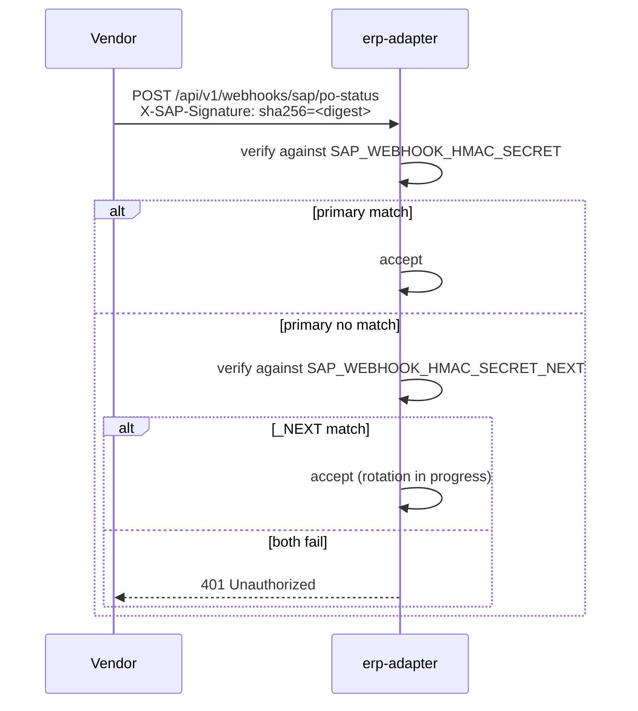
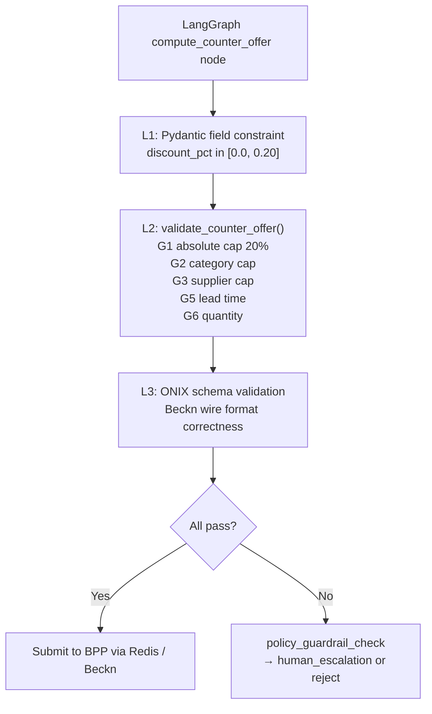
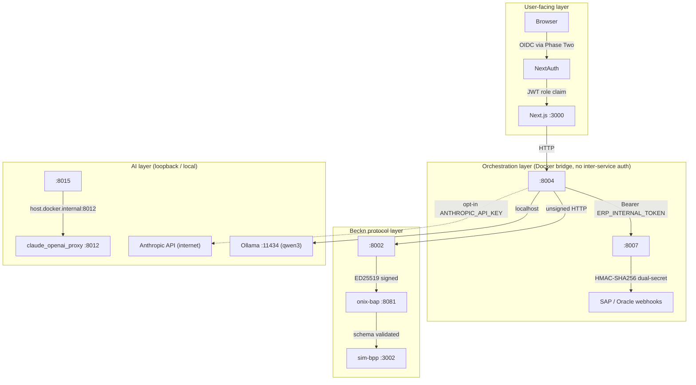

# Security

This document covers the security posture of the Procurement Agent as actually implemented across Phases 1-3. It distinguishes what is running today from what is planned for Phase 4 hardening. The five security domains are: identity and access management, ERP webhook authentication, Beckn protocol signing, data sovereignty, and input validation. A known-gaps section closes the document.

---

## 1. Identity and Access Management

### 1.1 Frontend Authentication

The Next.js frontend (port 3000) enforces authentication via **NextAuth v4** using an exclusive **KeycloakProvider**. There is no stub credentials provider, no local fallback login, and no dev-mode bypass in the codebase.

(Source: frontend/src/lib/auth.ts -- Confidence: High)

```typescript
// frontend/src/lib/auth.ts -- only provider configured
KeycloakProvider({
  clientId:     process.env.KEYCLOAK_CLIENT_ID!,
  clientSecret: process.env.KEYCLOAK_CLIENT_SECRET!,
  issuer:       process.env.KEYCLOAK_ISSUER!,
})
```

All three environment variables are accessed with the non-null assertion operator (`!`), meaning the application throws at startup if any is absent.

The production Keycloak instance in use is **Phase Two** (phasetwo.io), a hosted Keycloak service. The deployed realm is `procurement-agent` at `https://euc1.auth.ac/auth/realms/procurement-agent`.

(Source: frontend/.env.local, frontend/.env.example -- Confidence: High)

**Session parameters:**

| Parameter | Value |
|---|---|
| Strategy | JWT |
| Max age | 28,800 s (8 hours) |
| Sign-in page | `/login` |
| Realm roles mapper | `realm_access.roles` in ID token (must enable "Add to ID token: ON" in Keycloak client) |

**Role model:**

| Role | Permissions |
|---|---|
| `admin` | Full access; configure thresholds and policies |
| `approver` | One-click approve / reject on requests above requester threshold |
| `requester` | Default role; cannot call `/commit` directly above their own threshold |

Role values are read from the ID token's `realm_access.roles` claim. If no recognized role is found in the token the session falls back to `requester`. Roles are also extracted from a manual base64url decode of `access_token` as a fallback when the ID token claim is absent.

(Source: frontend/src/lib/auth.ts lines 5-39 -- Confidence: High)

> **Warning:** `frontend/.env.local` contains a live Keycloak client secret (`WX1ZdR8IU1X7HUD3Q40CmZBrzINZH7RU`). This file is git-ignored but was found in the working tree. A secret rotation is required if this file has ever been committed or shared. (Source: frontend/.env.local -- Confidence: High)

### 1.2 Keycloak Client Configuration Requirements

No Keycloak setup guide or realm export exists in the repository. A developer cloning the repo cannot authenticate to the frontend without access to the Phase Two tenant.

(Source: code verification gap 13 -- Confidence: High)

Minimum Keycloak client settings required for the application to work:

| Setting | Required value |
|---|---|
| Client authentication | ON (confidential client) |
| Standard flow | Enabled |
| Valid Redirect URIs | `${NEXTAUTH_URL}/api/auth/callback/keycloak` |
| Web origins | `${NEXTAUTH_URL}` |
| Realm roles mapper | Token claim name `realm_access.roles`, Add to ID token: ON |

The `KnowledgeBase/project_scaffold/integrations/identity_access_keycloak.md` spec document describes Phase 4 targets including API Gateway-level RBAC enforcement and Okta / Azure AD federation, but these are not yet implemented.

(Source: KnowledgeBase/project_scaffold/integrations/identity_access_keycloak.md -- Confidence: High)

### 1.3 Internal Service Authentication

Only the `erp-adapter` service enforces inbound authentication. All other inter-service communication relies on Docker bridge network isolation.

| Boundary | Mechanism |
|---|---|
| `orchestrator` → `erp-adapter` | Bearer: `Authorization: Bearer ${ERP_INTERNAL_TOKEN}` |
| `erp-adapter` ← vendor webhooks | HMAC-SHA256 (see §2) |
| All other service-to-service calls | None (Docker `beckn_network` bridge only) |

The `ERP_INTERNAL_TOKEN` default in `docker-compose.yml` is `dev-internal-token-CHANGE_ME`. This must be replaced before any environment exposed to untrusted networks.

(Source: services/erp-adapter/README.md, docker-compose.yml -- Confidence: High)

### 1.4 Claude OpenAI Proxy Authentication

The `claude_openai_proxy` service (port 8012, loopback only) implements `BearerAuthMiddleware` on all `/v1/*` paths. The auth key is `CLAUDE_PROXY_KEY`; if this variable is empty, authentication is **disabled** with a startup warning.

(Source: services/claude_openai_proxy/main.py lines 27-43 -- Confidence: High)

| Path | Auth required |
|---|---|
| `GET /healthz` | No |
| `GET /v1/models` | Yes — Bearer `CLAUDE_PROXY_KEY` |
| `POST /v1/chat/completions` | Yes — Bearer `CLAUDE_PROXY_KEY` |

In development the proxy binds `127.0.0.1`. For Docker-container access (negotiation-engine, demo-gateway), the production binding is `0.0.0.0` with a UFW rule restricting port 8012 to loopback and the Docker bridge subnet `172.16.0.0/12`.

(Source: services/claude_openai_proxy/claude-proxy.service lines 26-33 -- Confidence: High)

---

## 2. ERP Webhook Authentication

Inbound vendor webhooks to `erp-adapter` are authenticated with **HMAC-SHA256 dual-secret rotation**. This prevents replay attacks and enables zero-downtime key rotation.

(Source: services/erp-adapter/README.md -- Confidence: High)

### 2.1 Signature Format

Every inbound webhook carries the header:

```
X-{Vendor}-Signature: sha256=<hex_digest>
```

For example: `X-SAP-Signature: sha256=abcdef01...`

The erp-adapter verifies this against the request body using `hmac.compare_digest` (constant-time comparison to prevent timing attacks).

### 2.2 Dual-Secret Rotation Pattern

Two secrets are active simultaneously during key rotation:

| Environment variable | Purpose |
|---|---|
| `SAP_WEBHOOK_HMAC_SECRET` | Current primary secret |
| `SAP_WEBHOOK_HMAC_SECRET_NEXT` | New secret being rolled in |
| `ORACLE_WEBHOOK_HMAC_SECRET` | Current primary secret (Oracle) |
| `ORACLE_WEBHOOK_HMAC_SECRET_NEXT` | New secret (Oracle) |

The adapter accepts a webhook if the signature validates against **either** the primary or the `_NEXT` secret. Once all vendor-side senders have been updated to emit signatures using the new secret, the `_NEXT` value is promoted to primary and a fresh `_NEXT` is set. This enables rotation without a maintenance window.

(Source: services/erp-adapter/README.md -- Confidence: High)



### 2.3 Dev Defaults

Default secrets in `docker-compose.yml` are placeholder values:

```
SAP_WEBHOOK_HMAC_SECRET=dev-sap-hmac-CHANGE_ME
ORACLE_WEBHOOK_HMAC_SECRET=dev-oracle-hmac-CHANGE_ME
SELLER_WEBHOOK_HMAC_SECRET=dev-seller-hmac-CHANGE_ME   # orchestrator inbound
```

All three must be replaced before deployment to any environment reachable from the public network.

(Source: docker-compose.yml -- Confidence: High)

---

## 3. Beckn Protocol Signing and Schema Validation

### 3.1 ED25519 Request Signing

All outbound Beckn traffic from the BAP goes through the **ONIX adapter** (`onix-bap`, port 8081, Go). The ONIX adapter signs every outbound request with **ED25519**. The BAP client (`beckn-bap-client`) never calls a BPP URL directly; all traffic passes through ONIX.

(Source: CLAUDE.md, config/README.md -- Confidence: High)

```mermaid
sequenceDiagram
    participant beckn-bap-client :8002
    participant onix-bap :8081
    participant onix-bpp :8082
    participant sim-bpp :3002

    beckn-bap-client->>onix-bap: POST /bap/caller/discover (unsigned)
    onix-bap->>onix-bap: ED25519 sign payload
    onix-bap->>onix-bpp: POST /bpp/receiver/discover (signed)
    onix-bpp->>onix-bpp: validate signature
    onix-bpp->>sim-bpp: POST /api/webhook/discover (stripped)
```

The two-adapter model (caller + receiver) is documented in `config/README.md`. The signing pipeline for the caller is: `addRoute → sign → validateSchema`. The receiver pipeline is: `validateSign → addRoute → validateSchema`.

(Source: config/README.md -- Confidence: High)

### 3.2 Schema Validator Pin

The ONIX schema validator binary (`schemav2validator.so`) is **pinned to commit `d43ec30d`** in the `fidedocker/onix-adapter` image configuration. Later commits introduced a `$ref` resolution bug in `SignatureHeader` and `AckSignatureHeader` that causes all signed requests to fail validation.

> **Do not upgrade the ONIX schema validator without running a full end-to-end signing test first.**

(Source: config/README.md -- Confidence: High)

### 3.3 Key Material

The current configuration uses **testnet sandbox ED25519 key pairs** from the Beckn Developer Program. These are checked into the repository in `config/generic-routing-*.yaml`.

Production key rotation procedure (from `config/README.md`):

1. Generate a new ED25519 key pair using the Beckn key generation utility.
2. Register the new public key in the target Beckn network's registry.
3. Update `config/generic-routing-BAPCaller.yaml` with the new private key and key ID.
4. Restart `onix-bap`. The new key takes effect immediately; no rolling restart is needed.

(Source: config/README.md -- Confidence: High)

### 3.4 DeDi Registry Bypass

All ONIX routing YAML files use `targetType: url` instead of `targetType: bpp` or `targetType: bap`. This bypasses the DeDi registry lookup and routes directly to configured URLs, enabling the full Beckn protocol flow inside the Docker network without a public registry subscription.

This bypass must be reverted (`targetType: bpp` / `targetType: bap` with real registry entries) when connecting to a live Beckn network.

(Source: config/README.md, CLAUDE.md -- Confidence: High)

---

## 4. Data Sovereignty

The default deployment keeps all data, model inference, and vector search on the local host. No data leaves the machine without explicit opt-in.

| Component | Default provider | Data leaves host? |
|---|---|---|
| Intent classification (Stage 1) | qwen3:8b via local Ollama | No |
| BecknIntent extraction (Stage 2) | qwen3:8b / qwen3:1.7b via local Ollama | No |
| Stage 3 query broadening fallback | claude-sonnet-4-6 (opt-in) | **Yes** (requires `ANTHROPIC_API_KEY`) |
| BPP catalog semantic cache | all-MiniLM-L6-v2 (sentence-transformers, local) | No |
| Agent memory embeddings | BAAI/bge-small-en-v1.5 (fastembed ONNX, local) | No |
| Vector search | pgvector (PostgreSQL on host) | No |
| SupplierAgent in demo flows | claude-sonnet-4-6 via claude_openai_proxy:8012 | **Yes** (via local Claude CLI, bills host account) |

(Source: CLAUDE.md, KnowledgeBase/project_scaffold/implementation_deviations.md -- Confidence: High)

### 4.1 Claude Stage-3 Broadening Fallback

The `ANTHROPIC_API_KEY` environment variable is **unset by default**. If unset, `IntentParser` skips the Claude broadening step and the recovery flow falls through to the stub functions (`log_unmet_demand`, `notify_buyer_no_stock`, `trigger_open_rfq_flow`).

When `ANTHROPIC_API_KEY` is set, only the broadening prompt is sent to the Anthropic API. The prompt contains the original procurement query text but no buyer identity, pricing, or supplier data.

(Source: IntentParser/README.md, IntentParser/config.py -- Confidence: High)

### 4.2 claude_openai_proxy Loopback Binding

The `claude_openai_proxy` service (port 8012) binds `127.0.0.1` by default. In the production systemd unit (`claude-proxy.service`) it binds `0.0.0.0` with UFW restricting port 8012 to loopback and the Docker bridge subnet (`172.16.0.0/12`). Inference requests sent through this proxy invoke the host-installed `claude` CLI using the developer's local credentials (`~/.claude/.credentials.json`). Every request bills the host's Claude account.

(Source: services/claude_openai_proxy/README.md, services/claude_openai_proxy/claude-proxy.service -- Confidence: High)

---

## 5. Input Validation

### 5.1 BecknIntent Field Validation

All NL-derived intent data passes through the `shared.models.BecknIntent` Pydantic v2 model before entering the pipeline. Validators use `@field_validator` decorators (not deprecated `@validator`).

Canonical encoding rules enforced at this layer:

| Field | Enforcement |
|---|---|
| `quantity` | Must be `> 0`; raises `ValidationError` otherwise |
| `delivery_timeline` | Must be `> 0` if provided; value is **int hours** (not ISO 8601) |
| `location_coordinates` | String `"lat,lon"` decimal (not city names) |
| `budget_constraints` | Typed `BudgetConstraints(max, min)` (not raw string) |

(Source: shared/README.md -- Confidence: High)

### 5.2 ONIX Schema Validation

Every Beckn message (outbound and inbound) is validated against the Beckn v2.0.0 JSON schema by the ONIX adapter before forwarding. The schema is compiled into the `schemav2validator.so` binary (pinned at commit `d43ec30d`). Invalid messages are rejected with a 400 NACK before reaching any application service.

Contract-level schema constraints enforced by ONIX:

| Constraint | Detail |
|---|---|
| `Contract.status.code` valid values | `DRAFT`, `ACTIVE`, `CANCELLED`, `COMPLETE` only — `CONFIRMED` is rejected |
| `Contract` additional properties | `additionalProperties: false`; only 9 keys allowed: `id`, `commitments`, `consideration`, `participants`, `performance`, `settlements`, `status`, `descriptor`, `contractAttributes` |
| Billing and fulfillment placement | Buyer info → `participants[role=buyer]`; fulfillment → `performance[]`; payment → `settlements[]` |

(Source: Bap-1/CLAUDE.md, CLAUDE.md -- Confidence: High)

### 5.3 MCP Sidecar Never-Throw Contract

The MCP sidecar's `search_bpp_catalog` tool never raises a JSON-RPC error. All failure paths return a structured `{"found": false, "items": [], "probe_latency_ms": N}` response. This prevents unhandled exceptions from propagating to the LLM-side caller and enables safe graceful degradation.

(Source: CLAUDE.md, services/mcp-sidecar/README.md -- Confidence: High)

### 5.4 Data Normalizer Database Error Middleware

`data-normalizer` wraps all PostgreSQL errors in `db_error_middleware` and maps them to structured HTTP responses, preventing raw database error messages from leaking to callers:

| PostgreSQL error | HTTP response |
|---|---|
| `UniqueViolationError` | 409 `{"error": "duplicate"}` |
| `ForeignKeyViolationError` | 409 `{"error": "fk_violation"}` |
| `CheckViolationError` | 422 |
| `NotNullViolationError` | 422 |
| Other `PostgresError` | 500 |

(Source: services/data-normalizer/README.md -- Confidence: High)

### 5.5 ERP Budget Gate Fail-Closed

The ERP budget check (`POST /api/v1/budget/check`) is configured **fail-closed** by default (`ERP_BUDGET_CHECK_REQUIRED=true` in `erp-adapter`). If the ERP adapter is unreachable or times out within 800 ms, the orchestrator's `/commit` path rejects the purchase order rather than allowing it to proceed. This prevents orders from bypassing the budget gate due to infrastructure failures.

(Source: services/erp-adapter/README.md, services/orchestrator/README.md -- Confidence: High)

---

## 6. Negotiation Engine Guardrails

The negotiation engine enforces a three-layer guardrail stack to prevent the LLM from agreeing to out-of-policy terms:



The hard cap is 20% maximum discount regardless of category profile or LLM output. This constraint is enforced at both the Pydantic model level (L1) and the imperative validation function (L2).

(Source: services/negotiation_engine/README.md, services/negotiation_engine/tests/test_guardrails.py -- Confidence: High)

---

## 7. Known Security Gaps

The following are confirmed gaps in the current (Phases 1-3) implementation. Each is either deferred to Phase 4 or carries a documented workaround.

| Gap | Severity | Status | Workaround / Plan |
|---|---|---|---|
| No auth on internal HTTP APIs (intention-parser, beckn-bap-client, data-normalizer, catalog-normalizer, comparative-scoring, analytics) | Medium | Phase 4 | Docker `beckn_network` bridge provides network-level isolation; services are not exposed to the public internet |
| Testnet ED25519 keys committed to `config/*.yaml` | High | Must rotate before production | Follow the 3-step key rotation procedure in `config/README.md` |
| `dev-*-CHANGE_ME` HMAC secrets in `docker-compose.yml` | High | Must rotate before production | Set real secrets via environment variables before any external deployment |
| `ERP_INTERNAL_TOKEN=dev-internal-token-CHANGE_ME` | High | Must rotate before production | Override via env var |
| Live Keycloak client secret in `frontend/.env.local` | High | Must rotate | Rotate `KEYCLOAK_CLIENT_SECRET` in Phase Two admin console |
| No Keycloak / Phase Two setup guide in repository | Medium | Ongoing | No current workaround; developers must have Phase Two tenant access |
| mTLS to SAP/Oracle not activated in `erp-adapter` | Low | Phase 4 | SSL context hook exists but is not wired; mutual TLS deferred until production ERP connectivity |
| No image scanning (Trivy) | Low | Phase 4 | No containers pushed to a public registry in Phases 1-3 |
| No container orchestration (K8s Secrets, KMS) | Low | Phase 4 | Local Docker Compose; secrets passed as env vars |
| Bap-1 in-memory session store | Low | Phase 4 | Bap-1 is not in the production service path; the orchestrator drives the Beckn flow |
| Bap-1 hardcoded test users with cleartext passwords | Low | Phase 4 | Bap-1 test frontend is for Phase 1 integration testing only; not exposed to users |
| `COMPLEX_MODEL` override in `docker-compose.yml` collapses to qwen3:1.7b for both tiers | Informational | Known | No security impact; affects quality not access control |
| `database/sql/00_extensions_and_types.sql` `embedding_model_type` ENUM missing actual model names (`all-MiniLM-L6-v2`, `BAAI/bge-small-en-v1.5`) | Low | Schema bug | Migration `22_agent_memory_vector_dim.sql` adds `all-MiniLM-L6-v2`; `BAAI/bge-small-en-v1.5` and `ollama` for `ai_provider_type` are still absent — inserts using these values will fail |

(Source: code verification findings gaps 10, 13, 15, 22; CLAUDE.md; Bap-1/docs/ARCHITECTURE.md §7.3 -- Confidence: High)

---

## 8. Phase 4 Security Hardening Targets

The KnowledgeBase specifies six criteria that must all be satisfied simultaneously before Phase 4 is complete. The security-relevant criteria are:

| Criterion | Target |
|---|---|
| OWASP Top 10 pen test | Signed off by security reviewer |
| Integration test coverage | ≥ 80% (includes auth and validation paths) |
| TLS 1.3 | All inter-service APIs |
| AES-256 at rest | KMS-managed; PostgreSQL tablespace encryption |
| PII scrubbing | Before any LLM call; personal data must not appear in prompts |
| Keycloak / Okta / Azure AD RBAC | API Gateway (Kong) enforces role on every request |
| Trivy image scanning | In CI pipeline; blocks build on HIGH/CRITICAL CVEs |
| Kubernetes Secrets | Replaces plain env vars in `docker-compose.yml` |
| LangSmith tracing | Connected to `reasoning_payload` JSONB (data is already captured; wire-up deferred) |

(Source: KnowledgeBase/project_scaffold/milestones/phase4_hardening.md, KnowledgeBase/project_scaffold/technologies/security_encryption.md -- Confidence: Medium)

---

## 9. Summary



The implemented security model is appropriate for a pilot on a private Docker network. Before any production or internet-facing deployment, the critical actions are: rotate all `CHANGE_ME` secrets, replace testnet ED25519 keys, configure a proper Keycloak realm with documented setup steps, and activate mTLS for ERP vendor connectivity.
