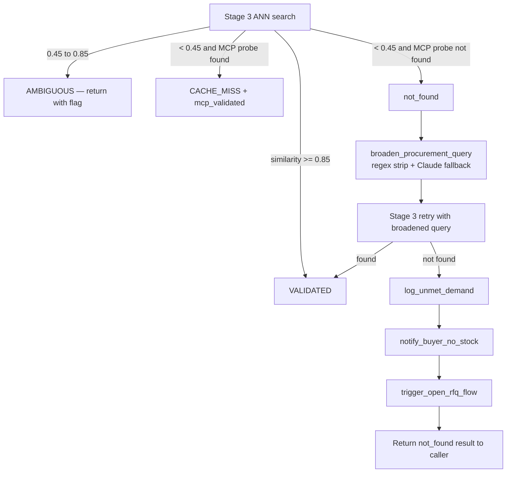
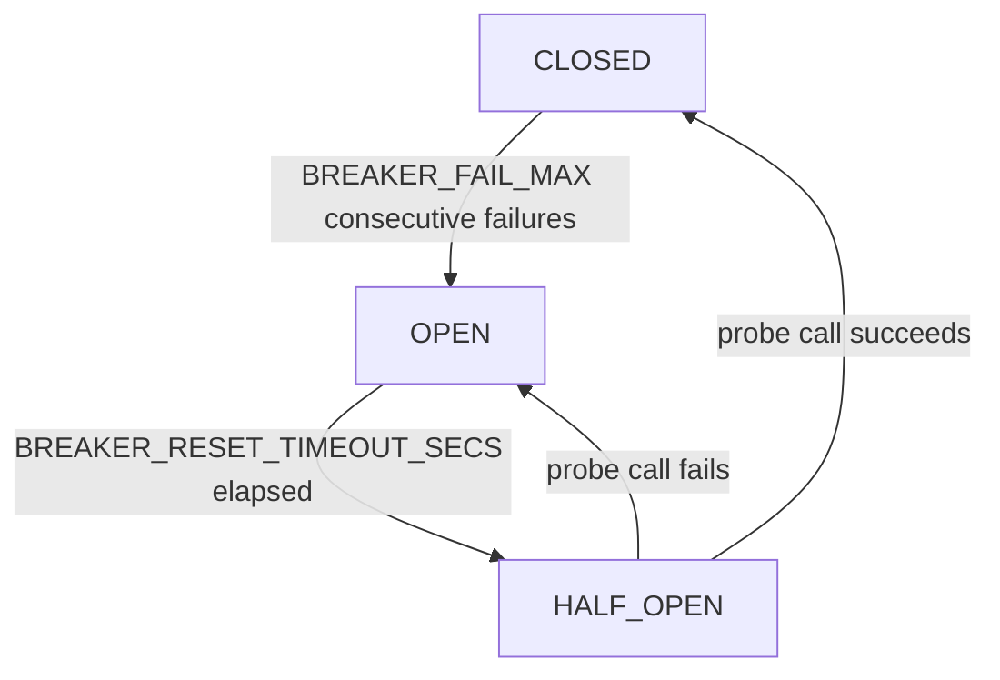
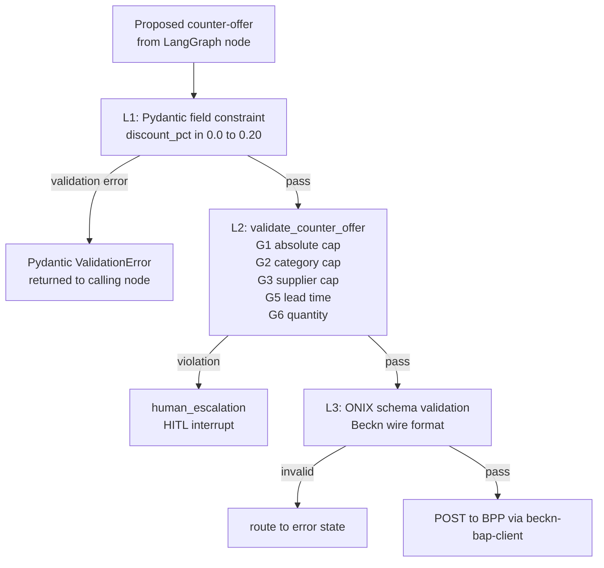
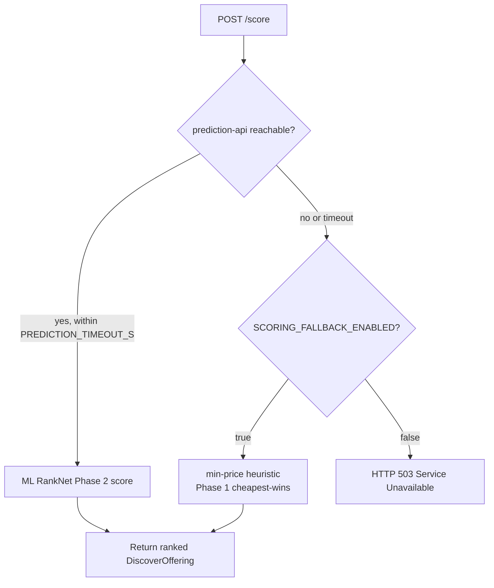

# Error Handling

This document catalogues every error-handling contract, recovery strategy, and failure-mode boundary in the Procurement Agent system. Entries are organised by the layer at which the contract is enforced — from the MCP/IntentParser pipeline through the Beckn protocol adapter, persistence layer, ERP integration, and notification fan-out.

---

## 1. Never-Throw Contract — MCP Sidecar

The MCP sidecar enforces the strongest error-containment contract in the system: **tool calls never raise a JSON-RPC error**. Every failure path returns a valid JSON object.

(Source: services/mcp-sidecar/README.md -- Confidence: High)
(Source: CLAUDE.md section "Conventions" -- Confidence: High)

### Contract definition

| Outcome | HTTP status | Response body |
|---|---|---|
| Successful probe, items found | 200 | `{"found": true, "items": [...], "probe_latency_ms": N}` |
| Timeout, zero ONIX matches, malformed response | 200 | `{"found": false, "items": [], "probe_latency_ms": N}` |
| BAP Client unreachable | 200 | `{"found": false, "items": [], "probe_latency_ms": N}` |
| Blank required argument (`item_name=""`) | 200 | `{"found": false, "items": [], "probe_latency_ms": 0}` |
| Any unhandled internal exception | 200 | `{"found": false, "items": [], "probe_latency_ms": elapsed}` |

The contract is enforced by a top-level `try/except Exception` in `server.py::search_bpp_catalog`. The returned object shape is identical for every failure branch so callers can branch on `result["found"]` without inspecting exception types.

(Source: services/mcp-sidecar/README.md -- Confidence: High)

### Downstream consequence

IntentParser Stage 3 reads `result["found"]`. A `False` value triggers the not-found recovery flow (query broadening → re-probe → RFQ trigger). The sidecar is therefore responsible for absorbing all transport, timeout, and parsing errors and presenting them as a uniform "no results" signal.

(Source: IntentParser/README.md -- Confidence: High)

---

## 2. IntentParser Stage 3 Recovery Flow

When a procurement item cannot be validated against the BPP catalog, IntentParser executes a four-step degradation chain before giving up.

(Source: IntentParser/README.md -- Confidence: High)
(Source: services/mcp-sidecar/README.md -- Confidence: High)

### Recovery chain



### Threshold values

| Zone | Similarity range | Action |
|---|---|---|
| VALIDATED | >= 0.85 | Accept item as confirmed |
| AMBIGUOUS | 0.45 to 0.85 | Return result with `validation_status: ambiguous` |
| CACHE_MISS + mcp_validated | < 0.45, MCP probe `found=true` | Accept via sidecar |
| not_found | < 0.45, MCP probe `found=false` | Trigger recovery chain |

Note: VALIDATED_THRESHOLD (0.85) and AMBIGUOUS_THRESHOLD (0.45) are hardcoded constants in the IntentParser pipeline, not configurable via environment variables despite appearing in the configuration table in the README.

(Source: IntentParser/README.md -- Confidence: High)

### Recovery stubs

`log_unmet_demand`, `notify_buyer_no_stock`, and `trigger_open_rfq_flow` in `IntentParser/recovery.py` are logger-only stubs. The module docstring explicitly states: "All functions are async stubs that log intent; replace stubs with real integrations (DB logging, notification service, RFQ microservice) as infrastructure is provisioned." No owner is assigned.

(Source: code_findings topic "Risks and limitations" -- Confidence: High)

### Claude Sonnet 4.6 broadening fallback

`broaden_procurement_query` uses a regex pass first (strips units, brand names, qualifiers) and falls back to Claude Sonnet 4.6 via `ANTHROPIC_API_KEY` for semantic rewriting if the regex pass produces no viable broadening. This is the only point in the system where Claude is invoked in the main pipeline — all other LLM calls use local Ollama.

(Source: CLAUDE.md stack section -- Confidence: High)
(Source: KnowledgeBase implementation_deviations.md -- Confidence: High)

---

## 3. data-normalizer Database Error Middleware

The data-normalizer service maps asyncpg PostgreSQL exceptions to structured HTTP error responses via `db_error_middleware`.

(Source: services/data-normalizer/README.md -- Confidence: High)

### Mapping table

| asyncpg exception | HTTP status | Response body |
|---|---|---|
| `UniqueViolationError` | 409 | `{"error": "duplicate"}` |
| `ForeignKeyViolationError` | 409 | `{"error": "fk_violation"}` |
| `CheckViolationError` | 422 | `{"error": "check_violation"}` |
| `NotNullViolationError` | 422 | `{"error": "not_null_violation"}` |
| Any other `PostgresError` | 500 | `{"error": "db_error"}` |

All callers (orchestrator, beckn-bap-client, erp-adapter, sim-bpp) must handle 409 as an idempotency signal — a duplicate write is not a fatal error.

### Memory write failure policy

`POST /normalize/memory/write` silently skips embedding failures. If the fastembed ONNX model call fails for any reason, the endpoint returns `{"stored": false}` without raising an error. This means an agent memory record can be permanently lost without the caller knowing.

(Source: services/data-normalizer/README.md -- Confidence: High)

---

## 4. Fail-Closed vs Fail-Open — ERP Budget Gate

The ERP adapter enforces a synchronous budget check before every `/confirm` action. The failure mode is configurable.

(Source: services/erp-adapter/README.md -- Confidence: High)
(Source: docker-compose.yml lines 141-144 -- Confidence: High)

### Configuration

| Environment variable | Default in docker-compose.yml | Behaviour |
|---|---|---|
| `ERP_BUDGET_CHECK_ENABLED` | `true` | Whether the budget check is called at all |
| `ERP_BUDGET_CHECK_REQUIRED` | `false` | `true` = fail-closed (deny on error), `false` = fail-open (allow on error) |
| `BUDGET_CHECK_TOTAL_TIMEOUT_MS` | `800` | Hard timeout for the synchronous call |

Note: docker-compose.yml sets `ERP_BUDGET_CHECK_REQUIRED=false` (fail-open) in the default stack. The CLAUDE.md conventions section documents the default as `true` (fail-closed). Engineers must explicitly set `ERP_BUDGET_CHECK_REQUIRED=true` for production deployments where a budget error must block a purchase order.

(Source: services/erp-adapter/README.md -- Confidence: High)
(Source: services/orchestrator/README.md -- Confidence: High)

### Timeout behaviour

If the ERP vendor does not respond within 800 ms:
- `fail-closed` (`REQUIRED=true`): budget check fails, `/confirm` is blocked
- `fail-open` (`REQUIRED=false`): budget check is skipped, `/confirm` proceeds

The 800 ms timeout is a hard ceiling enforced by `asyncio.wait_for` inside the adapter, not by an HTTP client timeout. Circuit breaker state does not override the fail-closed policy.

(Source: services/erp-adapter/README.md -- Confidence: High)

---

## 5. Per-Vendor Circuit Breakers — ERP Adapter

The ERP adapter uses `pybreaker` to prevent cascading failures when a vendor endpoint is degraded.

(Source: services/erp-adapter/README.md -- Confidence: High)
(Source: doc_surveys area "services/README files" key_facts -- Confidence: High)

### Circuit breaker configuration

| Variable | Default | Description |
|---|---|---|
| `BREAKER_FAIL_MAX` | 5 | Consecutive failures before tripping to OPEN |
| `BREAKER_RESET_TIMEOUT_SECS` | 60 | Seconds in OPEN before auto-probe to HALF_OPEN |

One breaker instance exists per configured vendor (`ERP_VENDORS`). When in OPEN state, calls fail immediately without reaching the vendor endpoint. The budget check is subject to the same breaker as the PO sync worker.

### State machine



`VendorPermanentError` (returned when the vendor API confirms a business rejection, e.g. `INSUFFICIENT_FUNDS`) is excluded from the failure counter — permanent business errors should not trip the circuit.

(Source: services/erp-adapter/README.md -- Confidence: High)

### Observability

Prometheus gauge `erp_circuit_state{vendor}` reflects the current state: 0 = CLOSED, 1 = OPEN, 2 = HALF_OPEN. The `GET /readyz` endpoint reports breaker state per vendor alongside DB and Redis connectivity.

(Source: services/erp-adapter/README.md -- Confidence: High)

---

## 6. ERP Outbox Retry and Dead-Letter Queue

PO push operations are not synchronous. They are persisted to `erp_sync_records` and processed by a background outbox worker.

(Source: services/erp-adapter/README.md -- Confidence: High)
(Source: doc_surveys key_facts "erp-adapter" -- Confidence: High)

### Outbox worker behaviour

- Polls `erp_sync_records` with `SELECT … FOR UPDATE SKIP LOCKED` to prevent double-processing across multiple worker replicas.
- Exponential backoff schedule configurable via `WORKER_BACKOFF_CSV` (default: `5,30,120,600,3600` seconds).
- After exhausting all retry attempts, the row transitions to `DLQ` (dead-letter queue) state.
- `POST /api/v1/admin/outbox/{sync_id}/replay` resets a DLQ row to `pending` for manual replay.
- `WORKER_CONCURRENCY` (default 10) controls parallel worker coroutines.

### Audit log events emitted by the worker

`PO_SYNC_ENQUEUED`, `PO_SYNC_ATTEMPT`, `PO_SYNC_SENT`, `PO_SYNC_RETRY`, `PO_DLQ`, `PO_REPLAY` — written to a service-internal audit log (not to the shared `audit_trail_events` table in PostgreSQL).

(Source: services/erp-adapter/README.md -- Confidence: High)

### Fallback when DB schema absent

If the `erp_sync_records` table does not exist at startup, the adapter falls back to `InMemoryOutboxRepo`. In this mode POs are not durable — a service restart loses all pending sync records. This is a known gap for dev environments where the database schema has not been applied.

(Source: services/erp-adapter/README.md -- Confidence: High)

---

## 7. Dual-Secret HMAC Rotation — ERP Webhooks

Inbound vendor webhooks (SAP, Oracle, mock) are authenticated with HMAC-SHA256.

(Source: services/erp-adapter/README.md -- Confidence: High)
(Source: CLAUDE.md "Features implemented beyond original spec" -- Confidence: High)

### Rotation protocol

Two environment variables per vendor: `{VENDOR}_WEBHOOK_HMAC_SECRET` (active key) and `{VENDOR}_WEBHOOK_HMAC_SECRET_NEXT` (incoming key). On each inbound webhook request, the adapter verifies the `X-{Vendor}-Signature` header against both secrets. If either matches, the request is accepted. This allows zero-downtime key rotation by:

1. Setting `_NEXT` to the new key on both sides simultaneously
2. Waiting for in-flight webhooks to drain
3. Promoting `_NEXT` to the primary `_SECRET`

If both verification attempts fail, the webhook returns HTTP 401 and the event is logged as `WEBHOOK_REJECTED`.

(Source: services/erp-adapter/README.md -- Confidence: High)

---

## 8. Notification Channel Isolation — asyncio.gather

The notification-dispatcher fans out to Slack, Microsoft Teams, and Email concurrently. A failure in one channel does not block or cancel the others.

(Source: services/notification-dispatcher/README.md -- Confidence: High)

### Implementation

```python
await asyncio.gather(
    send_slack(...),
    send_teams(...),
    send_email(...),
    return_exceptions=True  # failures captured as values, not raised
)
```

`return_exceptions=True` ensures that a `SlackApiError` does not prevent the Teams notification from being dispatched. Each result is inspected individually after the gather completes; exceptions are logged at WARNING level.

### Channel disable mechanism

An empty string for any channel configuration variable (`SLACK_WEBHOOK_URL=""`, `TEAMS_WEBHOOK_URL=""`, `SMTP_HOST=""`) silently disables that channel. The service starts normally with any combination of channels active, including none. This is the primary mechanism for development environments where only some channels are configured.

(Source: services/notification-dispatcher/README.md -- Confidence: High)

### Kafka consumer error handling

No dead-letter queue exists for the Kafka consumer. Malformed or unrecognised messages are logged at WARNING level and skipped (`enable_auto_commit=True` advances the offset regardless). A message that cannot be JSON-parsed will never be reprocessed. This is a documented limitation.

(Source: services/notification-dispatcher/README.md -- Confidence: High)

---

## 9. Always-200 Discovery Engine

The `discovery_engine` service returns HTTP 200 for all requests, including partial and total failures.

(Source: services/discovery_engine/README.md -- Confidence: High)

### Response contract

```json
{
  "items": [...],
  "total": 3,
  "degraded": true,
  "failed_networks": ["network_b"],
  "sources": ["network_a", "network_c"]
}
```

Callers must check `degraded: true` and `len(items)` — a non-empty `failed_networks` list means results are incomplete. The service never returns a 4xx or 5xx response for network-level failures.

### Per-network circuit breaker

| Variable | Default | Description |
|---|---|---|
| `DISCOVERY_CB_FAILURE_THRESHOLD` | 3 | Consecutive failures before OPEN |
| `DISCOVERY_CB_RECOVERY_TIMEOUT_S` | 30 | Auto-probe interval |

All exception types trip the circuit: timeouts, HTTP 5xx, HTTP 4xx, connection refused, and invalid JSON. This is intentional — a misbehaving network that returns HTTP 4xx should be temporarily excluded from fan-out.

(Source: services/discovery_engine/README.md -- Confidence: High)

Note: As of the current codebase, `discovery_engine` is not wired into `docker-compose.yml` and is not called by any other service. It is a complete but orphaned implementation. This note is for completeness; the contracts described here are from the service's own README.

(Source: code_findings topic "Architecture" -- Confidence: High)

---

## 10. Beckn Callback Timeout — beckn-bap-client

Beckn v2.0.0 returns only an ACK to `POST /discover`; the actual catalog arrives via the `/on_discover` webhook. The client must handle the case where the webhook never arrives.

(Source: services/beckn-bap-client/README.md -- Confidence: High)
(Source: docs/architecture/decisions/0001-use-redis-pubsub-for-async-beckn-responses.md -- Confidence: High)

### Timeout configuration

| Variable | Default | Role |
|---|---|---|
| `REDIS_RESULT_TIMEOUT` | 15 seconds | Primary latency ceiling — how long the sidecar waits for a Redis Pub/Sub message on `beckn_results:{txn_id}` |
| `CALLBACK_TIMEOUT` | 10 seconds | How long the `CallbackCollector` queue waits for `/on_discover` to arrive for the orchestrator path |
| `MCP_BAP_TIMEOUT` | 3 seconds | Safety valve for the HTTP fire-and-forget POST only — not the meaningful ceiling |

When `REDIS_RESULT_TIMEOUT` expires, the MCP sidecar returns `{"found": false, "items": [], "probe_latency_ms": 15000}`. The orchestrator path returns an empty offerings list.

### Redis unavailability

If Redis is not reachable at the time `/on_discover` fires, the handler logs a warning and falls through to the `CallbackCollector` path only. The MCP sidecar will then time out after `REDIS_RESULT_TIMEOUT` seconds and return `found=false`. No retry or alternate transport exists.

(Source: services/beckn-bap-client/README.md -- Confidence: High)

---

## 11. Fire-and-Forget Persistence — Orchestrator

The orchestrator writes agent memory and audit trail records as fire-and-forget `asyncio.create_task` calls. These writes are not retried on failure.

(Source: services/orchestrator/README.md -- Confidence: High)
(Source: code_findings topic "Data flows" -- Confidence: High)

### Write calls

| Call | Target | Failure behaviour |
|---|---|---|
| `_persist_memory(...)` | `POST /normalize/memory/write` | Logged, not raised |
| `_persist_audit(...)` | `POST /normalize/audit` | Logged, not raised |
| `_persist(...)` (pipeline data) | Various `/normalize/*` endpoints | 5 s timeout, never raises |

### Kafka offset placeholder

All `_persist_audit` calls in `workflow.py` set `kafka_offset=0` with an inline comment `# TODO(kafka): real offset when topic is wired`. When Kafka is deployed in Phase 4, these calls will need to be updated to use the actual offset returned by the Kafka producer.

(Source: code_findings topic "Data flows" -- Confidence: High)

### Unretried audit writes

If a `_persist_audit` call fails (e.g. data-normalizer is down), the audit event is permanently lost. The system does not buffer, queue, or retry these writes. Given the 7-year SOX 404 retention requirement on `audit_trail_events`, this is a known gap that Kafka integration (Phase 4) is intended to address.

(Source: code_findings topic "Data flows" -- Confidence: High)

---

## 12. Negotiation Engine Guardrail Layers

The negotiation engine applies three independent layers of validation to every counter-offer before it is sent to a BPP.

(Source: services/negotiation_engine/README.md -- Confidence: High)

### Layer overview



### Guardrail rules

| ID | Scope | Rule |
|---|---|---|
| G1 | All categories | Absolute maximum discount: 20% |
| G2 | Category-specific | Per-category discount cap (e.g. `it_equipment` = 0%, `commodity` = 10%) |
| G3 | Supplier-specific | Per-supplier historical cap |
| G5 | Lead time | Negotiated lead time must not exceed policy maximum |
| G6 | Quantity | Negotiated quantity must not fall below minimum order quantity |

A G2 or G3 violation routes the LangGraph state machine to the `human_escalation` interrupt node. An operator (HITL) can override the violation or reject the transaction.

(Source: services/negotiation_engine/README.md -- Confidence: High)

### LangGraph error state

On an unrecoverable internal error (uncaught exception in a node), the graph transitions to an `ERROR` terminal state and returns a `NegotiationResult` with `status=ERROR`. Because `AsyncPostgresSaver` checkpoints every state transition, a restarted service can resume the graph from the last successful checkpoint when `NEGOTIATION_POSTGRES_DSN` is configured. With `MemorySaver` (in-memory fallback), state is lost on restart.

(Source: services/negotiation_engine/README.md -- Confidence: High)

---

## 13. Catalog Normalizer — LLM Fallback Error Handling

When the catalog format is `UNKNOWN` (no known fingerprint), the catalog normalizer falls back to an LLM call via `CatalogNormalizer/llm_fallback.py`.

(Source: services/catalog-normalizer/README.md -- Confidence: High)
(Source: code_findings topic "catalog-normalizer README incorrectly documents LLM fallback backend" -- Confidence: High)

### Failure behaviour

A top-level `try/except Exception` in `llm_fallback.py` catches all errors from the Ollama call and returns `[]` (empty offerings list). This means:

- An Ollama service that is down causes `UNKNOWN` catalogs to silently return zero offerings.
- The HTTP response is still `HTTP 200` with `{"offerings": [], "format_variant": "UNKNOWN"}`.
- No error is surfaced to the caller.

### Backend correction

The service README incorrectly states that `OPENAI_API_KEY` is required for the LLM fallback. The actual backend is Ollama. The relevant environment variables are `OLLAMA_URL` (default `http://localhost:11434/v1`) and `NORMALIZER_MODEL` (default `qwen3:1.7b`). `OPENAI_API_KEY` is never read.

(Source: code_findings topic "catalog-normalizer README incorrectly documents LLM fallback backend" -- Confidence: High)

---

## 14. Comparative Scoring — ML Backend Fallback

The comparative-scoring service is a thin adapter that calls the `prediction-api` ML backend as its primary path and falls back to a heuristic when the ML backend is unavailable.

(Source: services/comparative-scoring/README.md -- Confidence: High)

### Fallback chain



| Variable | Default | Description |
|---|---|---|
| `PREDICTION_TIMEOUT_S` | 8.0 | Seconds before falling back |
| `SCORING_FALLBACK_ENABLED` | `true` | Whether heuristic fallback is permitted |

When no Production model is registered in the MLflow registry, `prediction-api` itself falls back to static weights `[0.4, 0.3, 0.3]` (price, speed, risk). `ALLOW_FALLBACK_WEIGHTS=false` disables this for canary deployments.

(Source: services/ComparativeAndScoreing/README.md -- Confidence: High)

---

## 15. In-Memory State Loss — Orchestrator and Bap-1

Multiple services rely on in-memory dictionaries with no persistence backend. A process restart loses all in-flight session data.

### Orchestrator in-memory state

The orchestrator (`services/orchestrator/src/workflow.py`) maintains the following module-level dictionaries:

| Variable | Purpose | TTL |
|---|---|---|
| `_sessions: dict[str, dict]` | Compare/commit session state | 1800 s |
| `_session_times: dict[str, float]` | Session expiry tracking | — |
| `_pending_approvals: dict[str, dict]` | Approval workflow state | None |
| `_erp_state_cache: dict[str, dict]` | ERP budget check cache | None |
| `_order_enrichments: dict[str, dict]` | Order detail enrichment | None |
| `_run_id_index: dict[str, str]` | `/run` run_id mapping | None |

(Source: code_findings topic "Risks and limitations" -- Confidence: High)

### Bap-1 session store

`Bap-1/src/agent/session.py` defines a `StateBackend` Protocol with `put`, `get`, `delete`, and `sweep` methods. Only `InMemoryBackend` is implemented. The module docstring states: "TODO(persistence): a teammate will implement `PostgresBackend` against the same Protocol." TTL is 1800 seconds with a background sweep every 300 seconds.

(Source: code_findings topic "Risks and limitations" -- Confidence: High)

---

## 16. ONIX Schema Validation Failures

The ONIX Go adapter validates all outbound Beckn messages against a compiled schema validator (`schemav2validator.so`). Schema violations cause the adapter to reject the message before it reaches the BPP network.

(Source: Bap-1/CLAUDE.md Beckn v2.1 wire-shape gotchas -- Confidence: High)
(Source: config/README.md -- Confidence: High)

### Common schema rejection causes

| Mistake | Rejection reason |
|---|---|
| `Contract.status.code = "CONFIRMED"` | Invalid ENUM value; valid values: `DRAFT`, `ACTIVE`, `CANCELLED`, `COMPLETE` |
| Billing address inside `Contract` directly | `Contract` is `additionalProperties: false`; billing belongs in `participants[role=buyer]` |
| Fulfillment inside `Contract` | Must be in `performance[]` envelope |
| Payment inline in `Contract` | Must be in `settlements[]` |
| Action name appended to ONIX routing URL | ONIX appends action automatically; double-appending causes 404 routing failure |

### Schema validator pin

The ONIX schema validator is pinned to commit `d43ec30d`. Later commits introduced a `$ref` resolution bug in `SignatureHeader` / `AckSignatureHeader`. Do not upgrade the `fidedocker/onix-adapter` image without first running an end-to-end signing test against the new version.

(Source: config/README.md -- Confidence: High)
(Source: CLAUDE.md "What NOT to do" -- Confidence: High)

---

## 17. Database ENUM Constraint Failures

Three ENUM types in `database/sql/00_extensions_and_types.sql` contain spec-era values that do not match the actual models and providers used in production. Inserts using correct values will fail at the database constraint.

(Source: code_findings topic "Database schema ENUM types" -- Confidence: High)

### Affected ENUMs

| ENUM name | Spec values in schema | Actual as-built values | Status |
|---|---|---|---|
| `embedding_model_type` | `text-embedding-3-large`, `e5-large-v2` | `all-MiniLM-L6-v2`, `BAAI/bge-small-en-v1.5` | Migration `22_agent_memory_vector_dim.sql` adds `all-MiniLM-L6-v2` only |
| `ai_provider_type` | `openai`, `anthropic` | `ollama` (primary) | No migration adds `ollama` |

### Migration gap for `BAAI/bge-small-en-v1.5`

`BAAI/bge-small-en-v1.5` (used for agent memory embeddings per CLAUDE.md) is absent from both the base ENUM definition and the migration file `22_agent_memory_vector_dim.sql`. Any insert that stores this model name in the `embedding_model` column will fail unless `embedding_model` is typed as `TEXT` (not constrained by the ENUM).

(Source: code_findings topic "Database schema ENUM types" -- Confidence: High)

### DEFAULT mismatch

`database/sql/15_agent_memory_vectors.sql` defines `embedding_model embedding_model_type NOT NULL DEFAULT 'text-embedding-3-large'`. After migration `22_agent_memory_vector_dim.sql` is applied, the column dimension changes to 384 but the DEFAULT is not updated. Rows inserted using the default will store the wrong model name.

(Source: code_findings topic "Database schema ENUM types" -- Confidence: High)

---

## 18. Audit Trail — Missing Event Types

The `audit_event_type` ENUM defines nine values: `discover`, `normalize`, `score`, `negotiate`, `approve`, `confirm`, `override`, `erp_sync`, `notification`. However, not all are written by the orchestrator.

(Source: code_findings topic "Data flows" -- Confidence: High)

### Orchestrator audit write coverage

| `event_type` | Written by orchestrator? | Notes |
|---|---|---|
| `normalize` | Yes (8 call sites) | request_created, intent_persisted, po_status_updated |
| `discover` | Yes (2 call sites) | discovery_completed, no_offerings_found |
| `score` | Yes (3 call sites) | scored N offerings |
| `confirm` | Yes (5 call sites) | order_confirmed, state transitions, webhook, auto_commit |
| `approve` | Yes (1 call site) | approver_approved |
| `override` | Yes (2 call sites) | user_cancelled, user_rejected_run |
| `negotiate` | **No** | `_run_autonomous_negotiation` has zero `_persist_audit` calls |
| `erp_sync` | **No** | Expected to be written by erp-adapter service |
| `notification` | **No** | Expected to be written by notification-dispatcher service |

The `negotiate` event type is never written anywhere in the current codebase. The full negotiation outcome (settled price, rounds taken, strategy used) is appended to `result["messages"]` in memory only.

(Source: code_findings topic "Data flows" -- Confidence: High)

---

## Summary of Error-Handling Contracts by Service

| Service | Primary contract | Failure mode on dependency outage |
|---|---|---|
| mcp-sidecar | Never-throw: always returns `{"found": false, ...}` | Returns `found=false` immediately |
| IntentParser Stage 3 | Recovery chain → stubs → not_found result | Returns not_found, stubs log only |
| data-normalizer | `db_error_middleware` → structured 409/422/500 | Memory write silently skips on embed failure |
| erp-adapter | Fail-closed/open configurable; outbox retry | DLQ after exhausted retries; fallback to in-memory outbox if DB missing |
| notification-dispatcher | `asyncio.gather(return_exceptions=True)` | Channel failures logged, others proceed |
| discovery_engine | Always HTTP 200; `degraded=true` flag | Failed networks excluded from results |
| beckn-bap-client | REDIS_RESULT_TIMEOUT; CallbackCollector timeout | Returns empty offerings |
| orchestrator | Fire-and-forget memory/audit writes | Permanent write loss on service outage |
| negotiation_engine | Three-layer guardrails + HITL escalation | ERROR terminal state; resume via checkpoint |
| catalog-normalizer | LLM fallback returns `[]` on all errors | Silent empty offerings for UNKNOWN format |
| comparative-scoring | ML fallback to min-price heuristic | 503 if `SCORING_FALLBACK_ENABLED=false` |
| Bap-1 session store | In-memory only (InMemoryBackend) | State lost on restart; no PostgresBackend |
