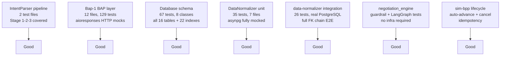

# Testing

## 1. Test Configuration

### pytest Settings

The project uses `pytest-asyncio` with `asyncio_mode = auto`. This setting is declared in every `pytest.ini`, `pyproject.toml`, or `setup.cfg` in `IntentParser/`, `Bap-1/`, and `services/data-normalizer/`.

(Source: CLAUDE.md conventions section -- Confidence: High)

**Critical rule:** never decorate `async def test_*` with `@pytest.mark.asyncio`. The `asyncio_mode = auto` setting handles coroutine collection globally. Adding the decorator is redundant and breaks pytest-asyncio 0.21+ mode detection.

### Custom Markers

| Marker | Meaning | Infrastructure required |
|---|---|---|
| `integration` | Requires live PostgreSQL + pgvector | Yes — procurement_agent DB with schema applied |
| `integration` (Bap-1) | Requires live Ollama qwen3:8b | Yes — Ollama at localhost:11434 |
| (no marker) | Pure unit / in-process | No |

(Source: IntentParser/README.md, Bap-1/README.md, services/data-normalizer/README.md -- Confidence: High)

### HTTP Mocking

All Bap-1 tests mock outbound HTTP with `aioresponses`. Fixtures in `Bap-1/tests/conftest.py` point to `http://mock-onix.test` (a non-routable sentinel hostname that only works under `aioresponses`). Do not attempt to run Bap-1 tests against a real ONIX stack — use the integration smoke path (`python run.py`) for that.

(Source: Bap-1/README.md -- Confidence: High)

### asyncpg Mocking

`DataNormalizer/tests/` mocks `asyncpg` entirely with `AsyncMock`. No database connection is made by the unit layer. Only `services/data-normalizer/tests/` (integration tests) hits a real PostgreSQL instance.

(Source: code_findings Phase 2 Data Normalizer section -- Confidence: High)

---

## 2. Test Files Inventory

### 2.1 IntentParser (runs locally, `conda activate infosys_project`)

| Test file | What it covers | Requires infra |
|---|---|---|
| `IntentParser/tests/test_async_pipeline.py` | Full Stage 1 + 2 + 3 pipeline in mock mode and live mode. Mock mode: no infrastructure, < 1 s. Live mode (`INTENT_PARSER_TEST_MODE=live`): requires PostgreSQL + pgvector + Ollama + MCP sidecar. 4 test cases covering VALIDATED, AMBIGUOUS, CACHE_MISS+MCP_VALIDATED, CACHE_MISS+not_found + recovery. | No (mock) / Yes (live) |
| `IntentParser/tests/test_milestone.py` | Section A: 18 integration tests (Ollama required). Section B: 6 orchestrator unit tests. Section C: 5 Stage 3 validation unit tests. | Partial |

(Source: IntentParser/README.md -- Confidence: High)

### 2.2 Bap-1 (runs locally, no Docker required)

| Test file | Tests | What it covers |
|---|---|---|
| `Bap-1/tests/test_agent.py` | 14 | LangGraph ReAct state transitions: `parse_intent`, `discover`, `rank_and_select`, `send_select`, `present_results` |
| `Bap-1/tests/test_callbacks.py` | 10 | `CallbackCollector`: payload parsing, ACK response, ignores unregistered transactions, `collect` timeout, concurrent callbacks |
| `Bap-1/tests/test_discover.py` | 17 | `BecknIntent` validation (qty > 0, timeline > 0, hours not ISO 8601, budget range, atomic descriptions list), discover URL must contain `localhost:8081/bap/caller/discover`, offerings have numeric `price_value` |
| `Bap-1/tests/test_select.py` | 9 | `/select` wire format, select URL must contain `/bap/caller/select`, `caller_action_url("init")` generates correct path, HTTP 500 raises exception |
| `Bap-1/tests/test_intent_parser.py` | 10 | NL facade unit tests (7) + integration tests (3 — require Ollama qwen3:8b). Integration assertions: "3 days" → `delivery_timeline=72`, "Bangalore" → `"12.9716,77.5946"`, descriptions as `list[str]` |
| Other 7 files | 69 | Adapter URL construction, session store TTL, graph build helpers, mock ONIX responses |

Total Bap-1: **129 tests** across 12 files. All HTTP mocked with `aioresponses`. Ollama integration tests are opt-in.

(Source: Bap-1/README.md, code_findings Bap-1/CLAUDE.md section -- Confidence: High)

### 2.3 Database (runs against local or Docker PostgreSQL)

| Test file | Tests | What it covers |
|---|---|---|
| `database/test_database.py` | 67 | `TestConnection`, `TestExtensions` (uuid-ossp, pgcrypto, vector), `TestEnumTypes` (20 custom enums), `TestTables` (16 tables present), `TestIndexes` (22 indexes), `TestWorkflowRows` (16 entities), `TestEndToEndQuery` (12-table JOIN), `TestConstraints` (CHECK, UNIQUE, FK violations) |

(Source: database/README.md -- Confidence: High)

### 2.4 DataNormalizer — unit layer (`DataNormalizer/tests/`, asyncpg mocked)

| Test file | Tests | What it covers |
|---|---|---|
| `test_request_repo.py` | 4 | INSERT, `channel` coercion to `'web'`, `SYSTEM_USER_ID` fallback, UPDATE status |
| `test_intent_repo.py` | 6 | INSERT, confidence clamping `[0,1]`, invalid `intent_class` → `'out_of_scope'`, `BecknIntent` defaults |
| `test_discovery_repo.py` | 5 | BPP upsert (find existing vs create new), negative `fulfillment_hours` clamped to 1, non-numeric price → 0.0 |
| `test_scoring_repo.py` | 4 | `composite_score × 100` scaling, clamping `> 1` to 100, entries without `offering_id` skipped |
| `test_order_repo.py` | 6 | Full FK chain `negotiation_outcomes → approval_decisions → purchase_orders`, quantity 0 → max(1,0)=1 |
| `test_audit_repo.py` | 5 | INSERT with JSON `reasoning_payload`, invalid `event_type` → `ValueError` before DB, empty `agent_action` → `ValueError` |
| `test_normalizer_facade.py` | 5 | Delegation for `normalize_request`, `normalize_intent`, `normalize_audit`, `normalize_po_status`, `update_status` |

Total unit layer: **35 tests**. No infrastructure required.

(Source: code_findings Phase 2 Data Normalizer section -- Confidence: High)

### 2.5 data-normalizer — integration layer (`services/data-normalizer/tests/`, real PostgreSQL)

| Test file | Tests | What it covers |
|---|---|---|
| `test_endpoints.py` | 23 | Happy path for all 8 HTTP endpoints, validation 400 responses (9 parametrized), DB errors → 409, defaults verified in DB |
| `test_full_pipeline.py` | 1 | 9-step E2E pipeline from request creation through confirmed order to delivered PO with 3 audit events |
| `test_memory_performance.py` | 2 | `@pytest.mark.integration`. P99 search latency < 100 ms (seeds 20 records, 20 iterations after warm-up). Ground-truth similarity for 4 known provider queries. |

Total integration layer: **26 tests**. Requires `procurement_agent_test` DB. Auto-detects testcontainers (Docker) or falls back to local Postgres via `TEST_DB_HOST`/`USE_LOCAL_PG=1`.

(Source: code_findings Phase 2 and Phase 3 Memory sections -- Confidence: High)

### 2.6 sim-bpp

| Test file | What it covers | Requires infra |
|---|---|---|
| `services/sim-bpp/tests/test_auto_advance.py` | Lifecycle (ACCEPTED → PACKED → SHIPPED → OUT_FOR_DELIVERY → DELIVERED), cancel mid-advance, idempotency (same `order_id` not double-scheduled), `SIM_BPP_AUTO_ADVANCE=false` disables auto-advance | Yes — data-normalizer running |

(Source: services/sim-bpp/README.md -- Confidence: High)

### 2.7 negotiation_engine

| Test file | Tests | What it covers | Requires infra |
|---|---|---|---|
| `services/negotiation_engine/tests/test_guardrails.py` | 16 | Layer 2 policy shield (`validate_counter_offer`): G1 (absolute 20% cap), G2 (category cap), G3 (supplier cap), G5 (lead time), G6 (quantity). Two builders: `_make_offer()` through full Pydantic L1 chain; `_make_unsafe_offer()` via `model_construct()` for L2 isolation. All synchronous. | No |
| `services/negotiation_engine/tests/test_async_flow.py` | 7 | LangGraph interrupt/resume mechanics. Pauses at `wait_for_async_callback`. `Command(resume={status:accepted})` drives to finalize. Gap 25% → `human_escalation`. HITL reject terminates graph. `resume_graph` broker helper. `transaction_id` extraction from 6 Redis channel patterns. | No (MemorySaver) |
| Other files | — | Additional guardrail and graph tests | No |

(Source: code_findings negotiation_engine section -- Confidence: High)

### 2.8 erp-adapter

| Test file | What it covers | Requires infra |
|---|---|---|
| `services/erp-adapter/tests/smoke_m31.py` | Budget gate smoke | erp-mock running |
| `services/erp-adapter/tests/smoke_m32.py` | Outbox + DLQ | PostgreSQL + erp-mock |
| `services/erp-adapter/tests/smoke_m33.py` | Bidirectional webhooks | erp-mock + HMAC secrets |
| `services/erp-adapter/tests/smoke_m34.py` | SAP/Oracle real + circuit breaker | erp-mock |
| `services/erp-adapter/tests/smoke_m35.py` | `readyz` + DLQ replay | PostgreSQL |
| `services/erp-adapter/tests/test_contracts.py` | **Standalone script, not pytest-discoverable.** Run as `python services/erp-adapter/tests/test_contracts.py`. Validates `NormalizedPO` Pydantic model and compares byte-equal JSON against pinned SAP/Oracle request snapshots. Exits 1 on diff. | No |

(Source: services/erp-adapter/README.md, code_findings erp-adapter section -- Confidence: High)

### 2.9 ComparativeAndScoreing (MLOps stack)

| Test file | What it covers | Requires infra |
|---|---|---|
| Training pipeline tests | RankNet pair building, SGD epoch, NDCG@5 computation | MLflow (docker-compose.mlops.yaml) |
| Validation service tests | Drift check, flag file creation | MLflow + Production model registered |
| Prediction API tests | `/score` endpoint, feature normalization, fallback weights | None (in-process) |

(Source: services/ComparativeAndScoreing/README.md -- Confidence: High)

### 2.10 Other Services

| Test file | Service | What it covers | Requires infra |
|---|---|---|---|
| `services/orchestrator/tests/` | orchestrator | Real-time tracking WebSocket flow only | Redis + Kafka |
| `services/notification-dispatcher/tests/` | notification-dispatcher | Kafka consumer routing, channel fan-out | Kafka mock |
| `services/frontend_demo_gateway/tests/` | demo-gateway | Scoring pipeline, negotiation mock | No (mocked) |
| `services/discovery_engine/tests/` | discovery_engine | Multi-network fan-out, circuit breaker, deduplication | No (aiohttp mock) |

(Source: services/*/README.md files, code_findings gap 15 section -- Confidence: Medium)

### 2.11 Services with Zero Tests

The following services have no `tests/` directory and no `test_*.py` file:

- `services/catalog-normalizer/` — zero tests
- `services/analytics/` — zero tests
- `services/beckn-bap-client/` — zero tests (production HTTP client with no unit layer)
- `services/mcp-sidecar/` — zero tests
- `services/intention-parser/` (Docker wrapper only) — zero tests; the underlying `IntentParser/` package has tests
- `services/erp-mock/` — zero tests; behavior is verified indirectly through erp-adapter smoke tests
- `frontend/` — zero tests of any kind (no Jest, no Vitest, no Playwright)

(Source: code_findings gap 15 section -- Confidence: High)

---

## 3. Test Patterns

### 3.1 asyncio_mode = auto

Every `pytest.ini` or equivalent that governs async tests sets:

```ini
[pytest]
asyncio_mode = auto
```

This means:

- `async def test_*` functions are collected and run without any decorator.
- `async def` fixtures are recognised automatically.
- Adding `@pytest.mark.asyncio` is incorrect and will produce a deprecation warning or failure under pytest-asyncio 0.21+.

(Source: CLAUDE.md -- Confidence: High)

### 3.2 Integration Marker Pattern

Tests that require live infrastructure are decorated `@pytest.mark.integration`. This allows skipping them in CI or on developer machines without the full stack:

```bash
# skip integration tests
pytest IntentParser/ -m "not integration" -v

# run only integration tests (requires Ollama + PostgreSQL + MCP sidecar)
pytest IntentParser/ -m integration -v
```

(Source: IntentParser/README.md -- Confidence: High)

### 3.3 HTTP Mocking with aioresponses (Bap-1)

```python
from aioresponses import aioresponses

async def test_discover_posts_to_onix(adapter):
    with aioresponses() as m:
        m.post("http://mock-onix.test/bap/caller/discover", payload={"context": {}, "message": {"ack": {"status": "ACK"}}})
        result = await client.discover_async(intent)
    assert result["message"]["ack"]["status"] == "ACK"
```

All Bap-1 fixtures in `conftest.py` construct `BecknConfig` with `onix_url="http://mock-onix.test"`. The test host is non-routable and only works inside an `aioresponses` context manager.

(Source: Bap-1/CLAUDE.md -- Confidence: High)

### 3.4 asyncpg Mocking (DataNormalizer unit tests)

```python
from unittest.mock import AsyncMock, MagicMock

@pytest.fixture
def mock_pool():
    conn = AsyncMock()
    conn.fetchrow = AsyncMock(return_value={"request_id": "uuid-..."})
    pool = MagicMock()
    pool.acquire = AsyncMock(return_value=conn)
    return pool
```

Unit tests inject `mock_pool` directly into repository constructors. No real PostgreSQL is involved.

(Source: code_findings DataNormalizer unit tests section -- Confidence: High)

### 3.5 Integration Database Fixtures (services/data-normalizer/tests/)

```python
@pytest_asyncio.fixture(scope="session")
async def schema_applied():
    # Tries testcontainers.postgres.PostgresContainer (Docker)
    # Falls back to local Postgres via TEST_DB_HOST / USE_LOCAL_PG=1
    ...

@pytest_asyncio.fixture
async def db_pool(schema_applied):
    pool = await asyncpg.create_pool(...)
    yield pool
    await pool.close()

@pytest_asyncio.fixture(autouse=True)
async def clean_db(db_pool):
    # TRUNCATE 11 tables in FK-safe reverse order before each test
    ...
```

Force local Postgres: set `USE_LOCAL_PG=1` in the environment. Override host with `TEST_DB_HOST`, `TEST_DB_PORT`, `TEST_DB_USER`.

(Source: code_findings phase2 Data Normalizer section -- Confidence: High)

### 3.6 LangGraph In-Memory Checkpointing (negotiation_engine tests)

```python
from langgraph.checkpoint.memory import MemorySaver

@pytest.fixture
def graph():
    return build_negotiation_graph(checkpointer=MemorySaver())
```

`MemorySaver` replaces `AsyncPostgresSaver` in tests. No Redis or Postgres is required. The `NEGOTIATION_POSTGRES_DSN` env var is left unset; the production service falls back to `MemorySaver` automatically when the DSN is empty.

(Source: services/negotiation_engine/README.md -- Confidence: High)

### 3.7 Never-Throw Contract Verification (mcp-sidecar)

The MCP sidecar has no automated test suite. The "never-throw" contract (all failures return `{"found": false, "items": [], "probe_latency_ms": elapsed}` instead of a JSON-RPC error) is enforced by code convention only. Any change to `services/mcp-sidecar/server.py::search_bpp_catalog` must manually verify the contract by simulating: BAP Client timeout, BAP Client unreachable, zero ONIX matches, malformed ONIX response, blank required argument, and unhandled internal exception.

(Source: services/mcp-sidecar/README.md -- Confidence: High)

---

## 4. Running Tests

### 4.1 Standard Commands (from CLAUDE.md)

```bash
# IntentParser — unit only (no Ollama, no PostgreSQL, no MCP sidecar)
pytest IntentParser/ -m "not integration" -v

# IntentParser — full (requires Ollama at localhost:11434)
pytest IntentParser/ -v

# IntentParser Stage 3 async pipeline — live mode
INTENT_PARSER_TEST_MODE=live pytest IntentParser/tests/test_async_pipeline.py -v -s

# Bap-1 — unit only (no Ollama)
pytest Bap-1/tests/ -v -k "not integration"

# Database schema — idempotent, requires procurement_agent DB
pytest database/test_database.py -v --tb=short -q
```

### 4.2 DataNormalizer Commands

```bash
# Unit tests (no infrastructure)
python -m pytest DataNormalizer/tests/ -v

# Integration tests (requires procurement_agent_test DB or Docker)
python -m pytest services/data-normalizer/tests/ -v

# Both layers together
python -m pytest DataNormalizer/tests/ services/data-normalizer/tests/ -v

# Phase 3 memory performance only (integration marker)
pytest services/data-normalizer/tests/test_memory_performance.py -v -m integration

# Phase 3 audit trail only (filtered by name)
PYTHONPATH=<repo_root> .venv-test/bin/python -m pytest \
  services/data-normalizer/tests/test_endpoints.py -k "audit" -v
```

### 4.3 Bap-1 Ollama Integration

```bash
# Run integration tests that require qwen3:8b
pytest Bap-1/tests/test_intent_parser.py -v -m integration
```

Prerequisite: `ollama serve` is running and `qwen3:8b` has been pulled (`ollama pull qwen3:8b`).

### 4.4 erp-adapter Contract Test (standalone script)

The contract test is not a pytest file. Run it as a script from the repo root:

```bash
python services/erp-adapter/tests/test_contracts.py
# Exit code 0 = all snapshots match
# Exit code 1 = wire shape drift detected (diff printed to stdout)
```

(Source: code_findings erp-adapter section -- Confidence: High)

### 4.5 negotiation_engine Tests

```bash
# No infrastructure required (MemorySaver)
pytest services/negotiation_engine/tests/ -v
```

### 4.6 ComparativeAndScoreing MLOps Tests

```bash
# Start MLOps stack first
docker compose -f services/ComparativeAndScoreing/docker-compose.mlops.yaml up -d mlflow-db mlflow-server prediction-api

# Train a model (auto-promotes to Staging if NDCG@5 >= 0.85)
docker compose -f services/ComparativeAndScoreing/docker-compose.mlops.yaml \
  --profile training up training-pipeline

# Weekly drift validation
docker compose -f services/ComparativeAndScoreing/docker-compose.mlops.yaml \
  --profile validation up validation-service
# Exit code 1 = drift detected; writes /tmp/model_drift_detected.flag
```

(Source: services/ComparativeAndScoreing/README.md -- Confidence: High)

### 4.7 Bap-1 Smoke Test (end-to-end with ONIX Docker stack)

```bash
# Prerequisites: Docker stack running, Ollama running
cd Bap-1
python run.py "500 reams A4 paper 80gsm Bangalore 3 days max 200 INR"
```

Expected console output shows five labelled steps: `[parse_intent]` → `[discover]` → `[rank_and_select]` → `[send_select]` → `[present_results]`.

(Source: KnowledgeBase phase1 test guide -- Confidence: High)

---

## 5. Phase 3 Acceptance Tests

### 5.1 Agent Memory and Learning

These are acceptance-level checks documented in `KnowledgeBase/project_scaffold/tests/phase3/phase3_agent_memory_learning.md`. They combine automated pytest assertions with manual observation.

**Test 1 — Write path**

```sql
SELECT COUNT(*) FROM agent_memory_vectors;
```

Complete a full order via the frontend (`/compare` → `/commit`). Row count must increase by 1. The new row must have:
- `text_summary` matching the format `"{item} ordered from {provider} at {price} {currency} delivery in {hours}h"`
- `entity_type = 'transaction'`
- `embedding_model` value consistent with the deployed model

**Test 2 — Read path**

Submit a second request for a similar item. The orchestrator's Agent Reasoning panel must display a `memory_context` node. Direct API verification:

```bash
curl -X POST http://localhost:8006/normalize/memory/search \
  -H "Content-Type: application/json" \
  -d '{"item_text": "A4 paper reams", "limit": 3}'
# Expect: {"results": [...], "count": N} with similarity scores >= 0.75
```

**Test 3 — Isolation**

```bash
curl -X POST http://localhost:8006/normalize/memory/search \
  -H "Content-Type: application/json" \
  -d '{"item_text": "Dell laptops 16GB RAM", "limit": 3}'
# Expect: {"results": [], "count": 0}
```

Unrelated items must not surface due to the 0.75 cosine similarity threshold.

**Test 4 — DB integrity**

All rows in `agent_memory_vectors` must have `entity_type = 'transaction'`.

**Phase 3 Acceptance Checklist (Memory)**

- `agent_memory_vectors` has `vector(384)` column with HNSW cosine index
- `POST /normalize/memory/write` returns `{"stored": true}` in < 2 s (after fastembed ONNX model downloads on first call, ~10–30 s cold start)
- `POST /normalize/memory/search` returns results with similarity scores
- After confirming order: orchestrator logs `[memory] stored transaction for <item>`
- Next similar request: reasoning panel shows `memory_context` node
- Unrelated items: no `memory_context` node (0.75 threshold filters correctly)
- Memory enrichment latency < 5 s total

(Source: KnowledgeBase/tests/phase3/phase3_agent_memory_learning.md -- Confidence: High)

### 5.2 Audit Trail System

Ten automated pytest tests in `services/data-normalizer/tests/test_endpoints.py`, run with:

```bash
PYTHONPATH=<repo_root> .venv-test/bin/python -m pytest \
  services/data-normalizer/tests/test_endpoints.py -k "audit" -v
```

The 10 tests are:

| Test name | What it asserts |
|---|---|
| `test_post_audit_appends_event` | `POST /normalize/audit` returns `{"event_id": "..."}` with status 201 |
| `test_validation_errors_return_400` (×2) | Invalid `event_type` → 400; missing `agent_action` → 400 |
| `test_audit_get_by_request_id_returns_events` | `GET /normalize/audit?request_id=X` returns events chronologically |
| `test_audit_get_by_request_id_empty_when_no_events` | Empty list for unknown request_id (not 404) |
| `test_audit_get_by_po_id_returns_events` | `GET /normalize/audit?po_id=X` returns events for that PO |
| `test_audit_get_missing_param_returns_400` | `GET /normalize/audit` without params → 400 |
| `test_audit_get_event_by_id` | `GET /normalize/audit/{event_id}` returns full event with `reasoning_payload` |
| `test_audit_get_event_by_id_not_found_404` | Non-existent `event_id` → 404 |
| `test_audit_get_limit_respected` | `GET /normalize/audit?request_id=X` respects max 500 limit |

**Manual tests (4)**

After completing a full procurement flow, verify:
1. At least 4 events exist for the request (`request_created`, `intent_persisted`, `discovery_executed`, `order_confirmed` minimum)
2. `retention_until = event_timestamp + interval '7 years'` on all events
3. The frontend `/request/{id}/audit` page renders a vertical timeline with per-type icons and collapsible `reasoning_payload`
4. Decision chain is reconstructable solely from events (SOX 404 compliance check: no business context is required beyond the audit trail itself)

(Source: KnowledgeBase/tests/phase3/phase3_audit_trail_system.md -- Confidence: High)

---

## 6. Coverage Assessment

### 6.1 Well-Tested Areas



(Source: surveys across all areas -- Confidence: High)

### 6.2 Known Coverage Gaps

| Area | Gap | Severity |
|---|---|---|
| `frontend/` | Zero tests of any kind — no Jest, no Vitest, no Playwright | High |
| `services/catalog-normalizer/` | No tests; normalization logic lives in `CatalogNormalizer/` with no unit coverage | High |
| `services/beckn-bap-client/` | No tests; the Beckn protocol HTTP client handling `on_discover` → Redis publish has no automated verification | High |
| `services/analytics/` | No tests; SQL queries returning dashboard KPIs are untested | Medium |
| `services/mcp-sidecar/` | No tests; never-throw contract enforced by convention only | Medium |
| `services/erp-mock/` | No tests; the mock server responses are not contract-pinned except through erp-adapter smoke tests | Medium |
| `services/erp-adapter/` test runner | `test_contracts.py` is a standalone script, not pytest-discoverable; smoke tests require live Docker stack | Medium |
| Orchestrator state machine | Only real-time tracking is tested; the main `/run`, `/compare`, `/commit` pipeline has no automated test | High |
| E2E pipeline | No automated end-to-end test driving the full NL → Beckn → PostgreSQL → audit trail path; all E2E verification is manual curl | High |
| CI/CD | No CI pipeline runs tests automatically; all test execution is manual | High |
| Memory enrichment latency | `test_memory_performance.py` is `@pytest.mark.integration` and skipped in most CI contexts | Low |

(Source: code_findings gap 15 section, KnowledgeBase Known Issues -- Confidence: High)

### 6.3 Infrastructure Requirements Summary

| Test suite | PostgreSQL | Ollama | Redis | Docker stack | MLflow |
|---|---|---|---|---|---|
| IntentParser (unit) | No | No | No | No | No |
| IntentParser (live) | Yes | Yes | Yes | No | No |
| Bap-1 (unit) | No | No | No | No | No |
| Bap-1 (integration) | No | Yes | No | No | No |
| Database tests | Yes | No | No | No | No |
| DataNormalizer (unit) | No | No | No | No | No |
| data-normalizer (integration) | Yes | No | No | No | No |
| negotiation_engine | No | No | No | No | No |
| erp-adapter smokes | Yes | No | Yes | Yes | No |
| ComparativeAndScoreing | No | No | No | Yes (mlops) | Yes |

(Source: combined from all service READMEs -- Confidence: High)

### 6.4 Phase 4 Testing Targets

The Phase 4 hardening milestone sets the following targets before production readiness:

- Integration test coverage >= 80%
- Evaluation suite accuracy >= 85% (100 scenarios)
- OWASP Top 10 pen test signed off
- P95 agent response latency < 5 s under representative load

None of these targets are currently met. The evaluation suite and the OWASP test are not yet implemented. Reaching 80% integration coverage would require, at minimum, adding test suites for `beckn-bap-client`, `catalog-normalizer`, `orchestrator` pipeline, and the frontend.

(Source: KnowledgeBase/project_scaffold milestones Phase 4 section -- Confidence: High)
