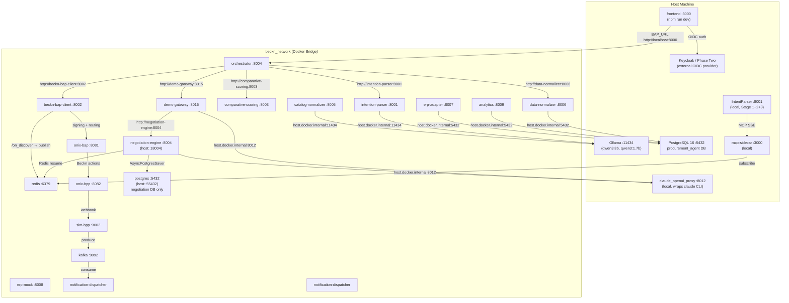

# Deployment

This document covers the Procurement Agent deployment topology for all phases: the current Docker Compose stack used in Phases 1-3, the services that run outside Docker on the host, the MLOps sub-stack, database setup, environment requirements, and the Phase 4 Kubernetes plan.

---

## 1. Current Deployment: Docker Compose (Phases 1-3)

All 18 services run on a single `beckn_network` Docker bridge network. Docker DNS service discovery is used throughout — containers reference each other by service name (e.g., `http://data-normalizer:8006`).

(Source: docker-compose.yml -- Confidence: High)

### 1.1 Container Map

| Service | Host Port(s) | Container Port | Build / Image | Key Dependencies |
|---|---|---|---|---|
| `intention-parser` | 8001 | 8001 | `./services/intention-parser` | Ollama on host |
| `beckn-bap-client` | 8002 | 8002 | `./services/beckn-bap-client` (context: repo root) | `redis`, `catalog-normalizer` |
| `catalog-normalizer` | 8005 | 8005 | `./services/catalog-normalizer` (context: repo root) | Ollama on host |
| `comparative-scoring` | 8003 | 8003 | `./services/comparative-scoring` | — |
| `data-normalizer` | 8006 | 8006 | `./services/data-normalizer` (context: repo root) | Host PostgreSQL |
| `analytics` | 8009 | 8009 | `./services/analytics` | `postgres` (healthy) |
| `orchestrator` | **8000, 8004** | 8004 | `./services/orchestrator` | `intention-parser`, `beckn-bap-client`, `comparative-scoring`, `data-normalizer`, `analytics`, `erp-adapter`, `demo-gateway`, `kafka` |
| `erp-adapter` | 8007 | 8007 | `./services/erp-adapter` (context: repo root) | `redis`, `erp-mock`, `kafka` |
| `erp-mock` | 8008 | 8008 | `./services/erp-mock` (context: repo root) | — |
| `redis` | 6379 | 6379 | `redis:alpine` | — |
| `kafka` | 9092 | 9092 | `apache/kafka:latest` | — |
| `notification-dispatcher` | **(none)** | — | `./services/notification-dispatcher` (context: repo root) | `kafka` (healthy) |
| `onix-bap` | 8081 | 8081 | `fidedocker/onix-adapter` (linux/amd64) | `redis` (healthy) |
| `onix-bpp` | 8082 | 8082 | `fidedocker/onix-adapter` (linux/amd64) | `redis` (healthy) |
| `sim-bpp` | 3002 | 3002 | `./services/sim-bpp` | `kafka` (healthy) |
| `postgres` | **55432** | 5432 | `pgvector/pgvector:pg16` | — |
| `negotiation-engine` | **18004** | 8004 | `./services/negotiation_engine` | `postgres` (healthy), `redis` (healthy) |
| `demo-gateway` | 8015 | 8015 | `./services/frontend_demo_gateway` (context: repo root) | `negotiation-engine` (healthy), `redis` (healthy) |

### 1.2 Architectural Notes on Port Assignments

**orchestrator dual port mapping (8000 and 8004):** The host ports 8000 and 8004 both forward to container port 8004. Port 8000 exists because `frontend/.env.local` uses `http://localhost:8000` as the default `BAP_URL`; port 8004 is exposed for direct service-to-service testing. (Source: docker-compose.yml lines 124-125 -- Confidence: High)

**negotiation-engine on host port 18004:** Container port 8004 conflicts with the orchestrator (also 8004). Docker Compose resolves this by mapping the host port to 18004. Internally, the demo-gateway container reaches the negotiation engine via Docker DNS at `http://negotiation-engine:8004`, so the host port is only used for direct debugging. (Source: docker-compose.yml lines 453-455 -- Confidence: High)

**notification-dispatcher has no published host port:** The container is reachable only within `beckn_network` at `notification-dispatcher:<internal port>`. It consumes from Kafka and fans out to external webhooks, so no inbound host access is needed. (Source: docker-compose.yml -- Confidence: High)

**postgres service (55432) is the negotiation database only:** Its `POSTGRES_DB` is `negotiation`. The main `procurement_agent` database runs natively on the host and is reached by Docker containers via `host.docker.internal:5432`. Connecting docker containers to the native host Postgres via `host.docker.internal` is the standard pattern used by `data-normalizer`, `analytics`, and `erp-adapter`. (Source: docker-compose.yml, .env.example -- Confidence: High)

### 1.3 Key Environment Variable Overrides

The following overrides in `docker-compose.yml` differ from the code-level defaults and affect system behavior.

| Service | Variable | docker-compose value | Code default | Effect |
|---|---|---|---|---|
| `intention-parser` | `COMPLEX_MODEL` | `qwen3:1.7b` | `qwen3:8b` | Disables two-tier routing in Docker; all queries use qwen3:1.7b |
| `intention-parser` | `SIMPLE_MODEL` | `qwen3:1.7b` | `qwen3:1.7b` | No change from default |
| `sim-bpp` | `SIM_BPP_AUTO_ADVANCE` | `true` | `false` | Lifecycle auto-advance is ON by default in Docker |
| `orchestrator` | `ERP_BUDGET_CHECK_REQUIRED` | `false` | `true` | Budget gate is fail-open in the Docker stack |
| `orchestrator` | `ERP_BUDGET_CHECK_ENABLED` | `true` | `false` | Budget checks are attempted |

**COMPLEX_MODEL override:** `IntentParser/config.py` defaults `COMPLEX_MODEL` to `qwen3:8b` so that complex queries route to the larger model locally. `docker-compose.yml` explicitly sets `COMPLEX_MODEL=qwen3:1.7b`, collapsing both routing branches to qwen3:1.7b inside the containerised `intention-parser`. The two-tier complexity routing only operates when running IntentParser directly on the host outside Docker. (Source: docker-compose.yml, IntentParser/config.py -- Confidence: High)

### 1.4 Key Volumes and Bind Mounts

| Container | Host path | Container path | Purpose |
|---|---|---|---|
| `intention-parser` | `./IntentParser` | `/app/IntentParser` | Live-mount IntentParser package |
| `intention-parser` | `./shared` | `/app/shared` | Shared Pydantic models |
| `beckn-bap-client` | *(context: repo root)* | `/app/...` | Full repo context for beckn-bap-client build |
| `catalog-normalizer` | `./CatalogNormalizer` | `/app/CatalogNormalizer` | Live-mount CatalogNormalizer package |
| `catalog-normalizer` | `./shared` | `/app/shared` | Shared Pydantic models |
| `data-normalizer` | `./DataNormalizer` | `/app/DataNormalizer` | Live-mount DataNormalizer library |
| `data-normalizer` | `./shared` | `/app/shared` | Shared Pydantic models |
| `sim-bpp` | `./services/sim-bpp/catalog.json` | `/app/catalog.json` | Hot-reload BPP catalog without rebuild |
| `onix-bap` | `./config` | `/app/config` | ONIX routing YAMLs |
| `onix-bpp` | `./config` | `/app/config` | ONIX routing YAMLs |
| `postgres` | `postgres_data` (named volume) | `/var/lib/postgresql/data` | Negotiation DB persistence |
| `postgres` | `./database/sql/20_negotiation_schema.sql` | `/docker-entrypoint-initdb.d/01_...` | Auto-init negotiation schema |

### 1.5 Kafka Configuration

Kafka runs in KRaft mode (no Zookeeper). Cluster ID is `5L6g3nShT-eMCtK--X86sw`. Single broker with `KAFKA_AUTO_CREATE_TOPICS_ENABLE=true`. Topics used: `po.status.changed` (sim-bpp, erp-adapter, orchestrator, notification-dispatcher). Healthcheck: `kafka-broker-api-versions.sh`, interval 10 s, start_period 30 s. (Source: docker-compose.yml -- Confidence: High)

### 1.6 Startup Order

```bash
# Full stack
docker compose up -d

# Discovery infrastructure only (common for development)
docker compose up -d redis onix-bap onix-bpp sim-bpp

# Tail a single service log
docker compose logs -f beckn-bap-client
```

(Source: CLAUDE.md -- Confidence: High)

---

## 2. Services That Run Outside Docker

Three services are intentionally not containerised. They run on the host and are reachable from Docker containers via `host.docker.internal`.

(Source: CLAUDE.md, services/claude_openai_proxy/README.md -- Confidence: High)

### 2.1 IntentParser API (`:8001` local)

The IntentParser package is bind-mounted into the `intention-parser` Docker container, but the full three-stage pipeline (Stage 3 with pgvector ANN + MCP sidecar) only operates when run locally.

```bash
conda activate infosys_project
cd IntentParser
uvicorn api:app --port 8001 --reload
```

Required environment variables:
- `OLLAMA_BASE_URL` (default `http://localhost:11434/v1`)
- `COMPLEX_MODEL` (default `qwen3:8b`)
- `SIMPLE_MODEL` (default `qwen3:1.7b`)
- `DATABASE_URL` (PostgreSQL connection string, for Stage 3 pgvector)
- `ANTHROPIC_API_KEY` (optional; enables Claude Stage 3 broadening fallback)

The `intention-parser` Docker container runs the Stage 1+2 wrapper only and always uses `qwen3:1.7b` for both models due to the docker-compose override. Stage 3 requires the local process. (Source: IntentParser/README.md, docker-compose.yml -- Confidence: High)

### 2.2 MCP Sidecar (`:3000` local)

```bash
conda activate infosys_project
cd services/mcp-sidecar
export BAP_API_KEY="any-value-in-dev"
uvicorn server:app --port 3000
```

Required environment variables (must be real env vars, not only in `.env`):
- `BAP_API_KEY` — mandatory; service refuses to start without it
- `REDIS_URL` — default `redis://localhost:6379`; must be a real env var, not only `.env`
- `REDIS_RESULT_TIMEOUT` — default `15`; must be a real env var, not only `.env`
- `BAP_CLIENT_URL` — default `http://localhost:8002`
- `RANKING_MIN_SIMILARITY` — default `0.30`

The MCP sidecar implements the Redis Pub/Sub subscriber side of ADR-0001. It subscribes to `beckn_results:{txn_id}` before firing the `/discover` POST so it never misses the callback. It never throws — all failures return `{"found": false, "items": [], "probe_latency_ms": elapsed}`. (Source: services/mcp-sidecar/README.md -- Confidence: High)

### 2.3 Claude OpenAI Proxy (`:8012` host)

A FastAPI service that wraps the local `claude` CLI as an OpenAI-compatible `/v1/chat/completions` endpoint. Required by `negotiation-engine` and `demo-gateway` (both configured with `NEGOTIATION_OPENAI_BASE_URL=http://host.docker.internal:8012/v1` and `OLLAMA_BASE_URL=http://host.docker.internal:8012/v1` respectively). Not in `docker-compose.yml` because it must invoke the host-installed native `claude` binary using host-side credentials (`~/.claude/.credentials.json`). (Source: services/claude_openai_proxy/README.md, services/claude_openai_proxy/claude-proxy.service -- Confidence: High)

**Startup (development — loopback only):**
```bash
export CLAUDE_PROXY_KEY="any-string"
uvicorn services.claude_openai_proxy.main:app --host 127.0.0.1 --port 8012
```

**Startup (persistent — systemd user service):**
```bash
cp services/claude_openai_proxy/claude-proxy.service ~/.config/systemd/user/
systemctl --user daemon-reload
systemctl --user enable --now claude-proxy
# For persistence across logout/reboot (needs sudo, one-time):
sudo loginctl enable-linger $USER
# Logs:
journalctl --user -u claude-proxy -f
```

The `claude-proxy.service` systemd unit binds to `0.0.0.0:8012` (not 127.0.0.1) so Docker bridge containers can reach it via `host.docker.internal:8012`. A UFW rule is documented in the unit to restrict access to loopback + docker subnet `172.16.0.0/12`. (Source: services/claude_openai_proxy/claude-proxy.service -- Confidence: High)

**Environment variables:**

| Variable | Default | Description |
|---|---|---|
| `CLAUDE_PROXY_KEY` | `""` (empty = auth disabled, warning logged) | Bearer token for `/v1/*` endpoints |
| `CLAUDE_PROXY_HOST` | `127.0.0.1` | Bind address (use `0.0.0.0` for Docker access) |
| `CLAUDE_PROXY_PORT` | `8012` | Listen port |
| `CLAUDE_PROXY_BINARY_PATH` | `/home/carbaje/.local/bin/claude` | Path to `claude` CLI binary on the host |
| `CLAUDE_PROXY_DEFAULT_MODEL` | `sonnet` | Fallback model alias when OpenAI name is unrecognised |
| `CLAUDE_PROXY_MAX_CONCURRENCY` | `2` | Maximum concurrent CLI subprocesses; excess requests queue |
| `CLAUDE_PROXY_TIMEOUT_S` | `120.0` | Hard timeout per request; subprocess killed if exceeded |
| `CLAUDE_PROXY_DISABLE_TOOLS` | `true` | Disallows interactive tools (Bash, Edit, Write, etc.) to prevent permission prompts in `-p` mode |

**Model name mapping:**

| OpenAI name received | Claude alias used |
|---|---|
| `gpt-4o` | `sonnet` |
| `gpt-4o-mini` | `haiku` |
| `gpt-4-turbo`, `gpt-4` | `sonnet`, `opus` |
| `gpt-3.5-turbo` | `haiku` |
| `claude-3-5-sonnet` | `sonnet` |
| Any `claude-*` prefix | passed through unchanged |

**Known limitations:** `temperature`, `top_p`, and `max_tokens` are accepted in request bodies but silently ignored — the Claude CLI exposes no sampling knobs. Each request incurs a ~1-3 s CLI cold start and bills the host's Claude account. (Source: services/claude_openai_proxy/README.md -- Confidence: High)

---

## 3. MLOps Sub-Stack (ComparativeAndScoreing)

Separate Docker Compose file: `services/ComparativeAndScoreing/docker-compose.mlops.yaml`. Runs independently of the main stack. Three sub-services: `mlflow-server` (:5000), `prediction-api` (:8004), and profile-gated batch CLIs.

```bash
# Start the inference API and MLflow tracking server
docker compose -f services/ComparativeAndScoreing/docker-compose.mlops.yaml \
  up -d mlflow-db mlflow-server prediction-api

# Run a training cycle (builds pairs, trains RankNet, auto-promotes to Staging if NDCG@5 >= 0.85)
docker compose -f services/ComparativeAndScoreing/docker-compose.mlops.yaml \
  --profile training up training-pipeline

# Run weekly drift check (exits 1 if degradation > NDCG_DRIFT_THRESHOLD = 0.05)
docker compose -f services/ComparativeAndScoreing/docker-compose.mlops.yaml \
  --profile validation up validation-service
```

On first start there is no Production model in MLflow; `prediction-api` falls back to static weights `[0.4, 0.3, 0.3]` (price/speed/risk). To activate the ML path: run the training pipeline, wait for auto-promotion to `Staging` (requires `NDCG@5 >= 0.85`), then manually promote to `Production` and hot-reload:

```bash
mlflow models transition-stage \
  --name ProcurementRanker --version 1 \
  --to-stage Production --archive-existing-versions

curl -X POST http://localhost:8004/reload   # zero-downtime reload; no restart needed
```

Set `ALLOW_FALLBACK_WEIGHTS=false` to disable the heuristic fallback for canary deployments. (Source: services/ComparativeAndScoreing/README.md -- Confidence: High)

**MLflow environment variables:**

| Variable | Default | Service |
|---|---|---|
| `MLFLOW_TRACKING_URI` | `http://mlflow-server:5000` | all three |
| `MODEL_NAME` | `ProcurementRanker` | all three |
| `MODEL_STAGE` | `Production` | prediction-api |
| `AUTO_PROMOTE_NDCG` | `0.85` | training-pipeline |
| `NDCG_DRIFT_THRESHOLD` | `0.05` | validation-service |
| `PORT` | `8004` | prediction-api |
| `ALLOW_FALLBACK_WEIGHTS` | `true` | prediction-api |

---

## 4. Database Setup

### 4.1 Main Procurement Database (procurement_agent)

The main database runs natively on the host (not as a Docker service) and is reached by Docker containers via `host.docker.internal:5432`.

**First-time setup:**
```bash
# Windows (Docker Desktop — recommended)
docker run -d \
  --name procurement-postgres \
  -e POSTGRES_USER=postgres \
  -e POSTGRES_PASSWORD=postgres123 \
  -e POSTGRES_DB=procurement_agent \
  -p 5432:5432 \
  pgvector/pgvector:pg16

# Apply all 24 SQL migrations
cd database
export $(grep -v '^#' .env | xargs)
python setup_database.py --create-db
```

**Idempotent re-run (after new migrations):**
```bash
cd database
python setup_database.py --continue-on-exists
```

**Full rebuild (destructive):**
```bash
python setup_database.py --drop-all
python setup_database.py --create-db
```

**Verify schema:**
```bash
pytest test_database.py -v --tb=short -q
# 67 tests across 8 classes: Connection, Extensions, EnumTypes, Tables, Indexes,
# WorkflowRows, EndToEndQuery, Constraints
```

### 4.2 setup_database.py Flags

| Flag | Effect |
|---|---|
| *(none)* | Run all 24 SQL scripts against existing DB |
| `--create-db` | Create `DB_NAME` if it does not exist (requires CREATEDB privilege) |
| `--drop-all` | DROP all tables and ENUM types CASCADE, then recreate |
| `--continue-on-exists` | Treat "already exists" PostgreSQL errors as SKIP rather than FAIL |

### 4.3 Migration File Execution Order

Migrations run in lexicographic order. The 24 files follow FK dependency order via numeric prefix. Two files share the `22_` prefix — `22_agent_memory_vector_dim.sql` and `22_pending_approval_columns.sql` — which may sort ambiguously on some filesystems. Both files are mutually independent. (Source: database/README.md -- Confidence: High)

Key migrations affecting live system behavior:

| File | Effect |
|---|---|
| `00_extensions_and_types.sql` | `uuid-ossp`, `pgcrypto`, `vector` extensions; 20 ENUM types |
| `15_agent_memory_vectors.sql` | Creates `agent_memory_vectors` with `vector(3072)` (overridden by migration 22) |
| `18_bpp_catalog_semantic_cache.sql` | Standalone vector store for Stage 3 BPP semantic cache (`vector(384)`) |
| `19b_erp_sync_records_outbox.sql` | Adds outbox columns to `erp_sync_records` for async PO push |
| `20_negotiation_schema.sql` | Negotiation-engine-specific tables (also used by the `postgres` Docker service) |
| `22_agent_memory_vector_dim.sql` | Alters `agent_memory_vectors` column from `vector(3072)` to `vector(384)`; adds `all-MiniLM-L6-v2` to `embedding_model_type` ENUM |

**Known ENUM gap:** The base `embedding_model_type` ENUM in `00_extensions_and_types.sql` only defines `text-embedding-3-large` and `e5-large-v2`. Migration `22_agent_memory_vector_dim.sql` adds `all-MiniLM-L6-v2`. The value `BAAI/bge-small-en-v1.5` (used by the data-normalizer memory service) is absent from all migrations — any INSERT that explicitly stores this model name in a column typed `embedding_model_type` will fail. (Source: database/sql/00_extensions_and_types.sql, database/sql/22_agent_memory_vector_dim.sql -- Confidence: High)

### 4.4 Root .env Template

```bash
# Copy and adjust for your machine
cp .env.example .env

# DB_HOST options:
#   PostgreSQL in a named Docker container visible on host:
#     DB_HOST=localhost
#   PostgreSQL on host reached by Docker containers:
#     DB_HOST=host.docker.internal
DB_HOST=host.docker.internal
DB_PORT=5432
DB_NAME=procurement_agent
DB_USER=postgres
DB_PASSWORD=postgres123

# Claude OpenAI Proxy (for demo-gateway / negotiation-engine)
CLAUDE_PROXY_BINARY_PATH=/opt/homebrew/bin/claude   # macOS Homebrew example
CLAUDE_PROXY_KEY=                                    # any non-empty string enables auth
```

(Source: .env.example -- Confidence: High)

---

## 5. Common Dev Commands

```bash
# Full Docker stack
docker compose up -d

# Discovery infrastructure only (fastest for IntentParser dev)
docker compose up -d redis onix-bap onix-bpp sim-bpp

# Tail a service log
docker compose logs -f beckn-bap-client

# Rebuild a single container
docker compose up -d --build catalog-normalizer

# Run IntentParser locally (Stage 1+2+3)
conda activate infosys_project
cd IntentParser && uvicorn api:app --port 8001 --reload

# Run MCP sidecar locally
conda activate infosys_project
cd services/mcp-sidecar
export BAP_API_KEY="dev-key"
uvicorn server:app --port 3000

# Start claude_openai_proxy (required for negotiation demo)
export CLAUDE_PROXY_KEY="dev-key"
uvicorn services.claude_openai_proxy.main:app --host 0.0.0.0 --port 8012

# End-to-end smoke test
curl -X POST http://localhost:8001/parse/full \
  -H "Content-Type: application/json" \
  -d '{"query": "300 meters Cat6 UTP cable Mumbai 5 days"}'

# Database — first time
cd database
export $(grep -v '^#' .env | xargs)
python setup_database.py --create-db
pytest test_database.py -v --tb=short -q

# Run IntentParser unit tests (no infra needed)
pytest IntentParser/ -m "not integration" -v

# Run Bap-1 tests (all HTTP mocked; no Docker needed)
pytest Bap-1/tests/ -v -k "not integration"

# MLOps stack
docker compose -f services/ComparativeAndScoreing/docker-compose.mlops.yaml \
  up -d mlflow-db mlflow-server prediction-api
```

(Source: CLAUDE.md -- Confidence: High)

---

## 6. Environment Requirements

### 6.1 Required for All Development

| Requirement | Version | Purpose |
|---|---|---|
| Docker Engine + Compose v2 | Latest stable | Container runtime for all 18 services |
| Conda environment `infosys_project` | Python 3.11+ | Local services (IntentParser, mcp-sidecar) |
| Ollama | Latest | qwen3:8b and qwen3:1.7b for LLM inference |
| PostgreSQL 16 + pgvector 0.7.0 | As above | Main `procurement_agent` database |
| Redis 7 | Provided by Docker | Pub/Sub broker, ONIX cache |
| Node.js 18+ | 18+ | Frontend (`npm run dev`) |
| `claude` CLI | Latest | Required only for `claude_openai_proxy` (negotiation demo) |

```bash
# Pull required Ollama models
ollama pull qwen3:8b
ollama pull qwen3:1.7b
```

### 6.2 Optional Variables

| Variable | Service | Effect |
|---|---|---|
| `ANTHROPIC_API_KEY` | IntentParser | Enables Claude Stage 3 broadening fallback; without it, Stage 3 uses regex-only broadening |
| `SLACK_WEBHOOK_URL` | notification-dispatcher | Enables Slack order status notifications |
| `TEAMS_WEBHOOK_URL` | notification-dispatcher | Enables Teams order status notifications |
| `SMTP_HOST` | notification-dispatcher | Enables email notifications |
| `ERP_VENDORS=sap` or `=oracle` | erp-adapter | Activates real SAP/Oracle adapter instead of mock |

### 6.3 Frontend Auth (Keycloak / Phase Two)

The Next.js frontend (`frontend/`) uses only Keycloak OIDC authentication — there are no stub or password-based credentials. A live Keycloak-compatible instance (including Phase Two cloud at `euc1.auth.ac`) must be running with:

- A realm named `procurement-agent`
- A confidential client `procurement-frontend` with Standard Flow enabled
- Valid Redirect URI set to `${NEXTAUTH_URL}/api/auth/callback/keycloak`
- A "realm roles" mapper with "Add to ID token: ON"
- User accounts assigned role `admin`, `approver`, or `requester`

Required `frontend/.env.local` variables:
```
KEYCLOAK_CLIENT_ID=procurement-frontend
KEYCLOAK_CLIENT_SECRET=<client secret>
KEYCLOAK_ISSUER=https://<realm-host>/auth/realms/procurement-agent
NEXTAUTH_URL=http://localhost:3000
NEXTAUTH_SECRET=<any random string>
```

No Keycloak realm export or user provisioning guide is present in the repository. No local Keycloak container is defined in `docker-compose.yml`. The working tenant used during development is Phase Two (phasetwo.io) at `euc1.auth.ac`. (Source: frontend/src/lib/auth.ts, frontend/.env.example -- Confidence: High)

---

## 7. Deployment Topology Diagram



---

## 8. Phase 4 Kubernetes Plan

Phase 4 targets production readiness on a managed Kubernetes cluster (EKS / AKS / GKE). All items below are deferred from Phases 1-3 and not yet implemented. (Source: KnowledgeBase/project_scaffold/implementation_deviations.md -- Confidence: High)

### 8.1 Container Orchestration

- **Helm chart** with parameterised `values.yaml` for dev / staging / production.
- **ArgoCD** GitOps: chart changes in git trigger sync to cluster.
- Every service that currently uses Docker Compose `depends_on` is replaced by Kubernetes readiness probes and init containers.

### 8.2 CI/CD Pipeline

- **GitHub Actions** pipeline: `lint → unit-test → build → push image → Helm deploy`
- **Trivy** image scanning in CI gating on HIGH/CRITICAL CVEs
- Separate workflows for `main` (deploy to staging) and tagged releases (deploy to production)

### 8.3 Infrastructure Components (Kubernetes)

| Component | Technology | Notes |
|---|---|---|
| API Gateway | Kong | Replaces direct HTTP in Docker DNS; enforces Keycloak JWT on every route; blocks `/confirm` for Requester role |
| Event streaming | Kafka StatefulSet (KRaft mode, replication ≥ 3, acks=all) | Replaces PostgreSQL outbox pattern for ERP sync and audit events |
| Vector store | Qdrant StatefulSet | Spec (not yet implemented); current deployment uses pgvector only |
| LLM inference | Managed Ollama or remote API | Local Ollama replaced by cloud-managed or cluster-hosted model serving |
| Secret management | Kubernetes Secrets + KMS | All `_CHANGE_ME` dev values in docker-compose.yml replaced |
| Observability | Prometheus + Grafana + OpenTelemetry | LangSmith wiring enabled for per-call LLM tracing |
| SIEM | Splunk exporter from `splunk_indexed` flag | `splunk_indexed` column placeholder already in `audit_trail_events` |
| Retention enforcement | Nightly deletion/archival CronJob | `retention_until` timestamp already in `audit_trail_events` |
| mTLS | SSL context hook in erp-adapter | Hook is wired but not activated in dev |

### 8.4 Phase 4 Acceptance Criteria

All six must hold simultaneously before Phase 4 is complete:

1. P95 agent response latency < 5 seconds under representative load
2. OWASP Top 10 pen test signed off
3. Integration test coverage >= 80 %
4. Evaluation suite accuracy >= 85 % (intent parsing + comparison quality)
5. Helm chart deploys cleanly to the target Kubernetes cluster
6. Documentation package complete

(Source: KnowledgeBase/project_scaffold/milestones/phase4_hardening_testing_production_readiness.md -- Confidence: High)

---

## 9. Discovery Engine (Orphaned Service)

`services/discovery_engine/` contains a complete, standalone implementation of multi-network Beckn discovery fan-out. It is **absent from `docker-compose.yml`** and is **not called by any other service**. Its README states port 8006, which conflicts with `data-normalizer`'s deployed port. (Source: services/discovery_engine/README.md, docker-compose.yml -- Confidence: High)

The service provides:
- Concurrent fan-out to N Beckn network gateways via `asyncio.gather`
- Per-network circuit breakers (3 failures, 30 s recovery)
- Result deduplication by `provider_id:item_id:currency` with geo-proximity merge at 0.5 km
- Always HTTP 200 even on partial failures; callers inspect `degraded` and `failed_networks[]`

Its architectural status is undocumented — it may be a planned replacement for `beckn-bap-client`'s built-in single-gateway discovery, a dead branch, or a future integration point. It can be run standalone for evaluation:

```bash
# Configure networks via env
export DISCOVERY_NETWORKS_JSON='[{"name":"main","base_url":"http://localhost:8002","timeout_s":5.0}]'
cd services/discovery_engine
uvicorn src.main:app --host 0.0.0.0 --port 8011   # use 8011 to avoid conflict with data-normalizer
```

(Inferred — no documentation assigns an owner or timeline for integrating this service into the main pipeline.)
