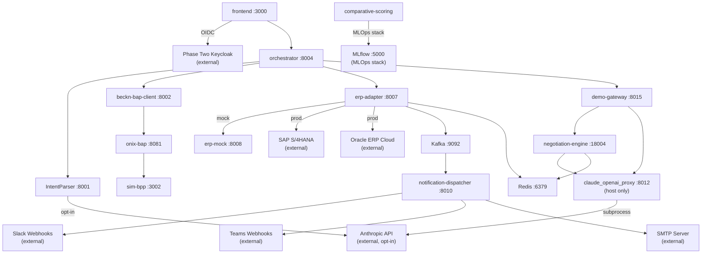

# External Integrations

For each integration: Purpose | Protocol | Auth | Status | Key config vars | Notes

---

## 1. Beckn Protocol v2.0.0 (via ONIX Adapter Pair)

**Purpose:** Core commerce protocol. Translates all procurement actions (discover, select, init, confirm, status) into signed Beckn v2 wire messages routed to BPP networks.

**Protocol:** HTTP/REST with ED25519 message signing. Two ONIX adapter containers (`onix-bap :8081`, `onix-bpp :8082`) mediate all traffic. Receiver path: `validateSign → addRoute → validateSchema`. Caller path: `addRoute → sign → validateSchema`.

**Auth:** ED25519 key pairs. Current keys are testnet sandbox keys baked into `config/generic-bap.yaml` and `config/generic-bpp.yaml`. Not for production without key rotation and Beckn registry registration.

**Status:** Fully operational in local Docker stack. DeDi registry bypass active (`targetType: url` in all four routing YAMLs) — direct Docker DNS instead of public registry lookup.

**Key config vars:**

| Var | Service | Default | Notes |
|---|---|---|---|
| `ONIX_URL` | beckn-bap-client | `http://onix-bap:8081` | All outbound Beckn traffic must target this |
| `BAP_URI` | beckn-bap-client | `http://beckn-bap-client:8002` | Callback address sent inside Beckn context |
| `BAP_ID` | beckn-bap-client | `bap.example.com` | Registry identity |
| `DOMAIN` | beckn-bap-client | `beckn.one/testnet` | Beckn domain header |
| `CALLBACK_TIMEOUT` | beckn-bap-client | `10.0` | Seconds to wait for on_select/on_init/on_confirm |
| `REDIS_URL` | beckn-bap-client, mcp-sidecar | `redis://redis:6379` | Required for async on_discover flow (ADR-0001) |

**Notes:**
- Beckn v2.0.0 discover is inherently async: `POST /discover` returns only an ACK; the catalog arrives later via `on_discover` webhook. The system breaks this deadlock via Redis Pub/Sub on per-transaction channels `beckn_results:{transaction_id}` (ADR-0001). The MCP sidecar subscribes to Redis before firing the discover task; `on_discover` handler publishes to the same channel. (Source: `docs/architecture/decisions/0001-use-redis-pubsub-for-async-beckn-responses.md` -- Confidence: High)
- Schema validator pinned to ONIX commit `d43ec30d`. Later commits have a `$ref` resolution bug in `SignatureHeader` / `AckSignatureHeader`. Do not upgrade without end-to-end signing test. (Source: `config/README.md` -- Confidence: High)
- `on_discover` routing in `generic-routing-BAPReceiver.yaml` is split from other `on_*` callbacks: `on_discover` goes to a dedicated `/on_discover` endpoint (Redis Pub/Sub path); all other `on_*` go to `/bap/receiver` (CallbackCollector path). (Source: `config/README.md` -- Confidence: High)
- `Contract.status.code` valid enum: `DRAFT | ACTIVE | CANCELLED | COMPLETE`. `CONFIRMED` is invalid and rejected by ONIX. (Source: `Bap-1/CLAUDE.md` -- Confidence: High)
- ONIX routing target URLs must NOT include the action name — ONIX appends it automatically. (Source: `CLAUDE.md` -- Confidence: High)
- `generic-routing-BPPReceiver.yaml` uses `networkId` as routing key; all other routing files use `domain`. Inconsistency noted in `config/README.md` as unresolved. (Source: `config/README.md` -- Confidence: High)

---

## 2. SAP S/4HANA (via erp-adapter)

**Purpose:** Bidirectional ERP integration. Outbound: synchronous budget check before `/confirm`; asynchronous PO creation via PostgreSQL outbox worker. Inbound: vendor webhook for PO state changes (goods receipt, invoice matching).

**Protocol:** OAuth2 client_credentials for token acquisition; then OData v4 for PO operations. Budget check uses a vendor-specific JSON endpoint. CSRF token dance required before each PO POST (GET with `X-CSRF-Token: Fetch` → server returns token + session cookies → replayed on POST).

**Auth:**
- Outbound calls: OAuth2 bearer token (cached via `OAuthTokenCache`, auto-refreshed on 401).
- Inbound webhooks: HMAC-SHA256 dual-secret rotation. Header `X-{Vendor}-Signature: sha256=...` verified against `SAP_WEBHOOK_HMAC_SECRET` (primary) and `SAP_WEBHOOK_HMAC_SECRET_NEXT` (rotation in-progress). (Source: `services/erp-adapter/src/adapters/sap.py` -- Confidence: High)

**Status:** Adapter fully implemented (`SAPS4HanaAdapter`). Uses `erp-mock :8008` in dev (`ERP_VENDORS=mock` default in docker-compose.yml). Real SAP credentials required for live integration.

**Limitations:** `cancel_po()` raises `NotImplementedError` — PO cancellation is deferred. (Source: `services/erp-adapter/src/adapters/sap.py:113` -- Confidence: High)

**Key config vars:**

| Var | Notes |
|---|---|
| `SAP_OAUTH_TOKEN_URL` | IDP token endpoint |
| `SAP_BASE_URL` | OData v4 base, e.g. `.../API_PURCHASEORDER_PROCESS_SRV` |
| `SAP_CLIENT_ID` / `SAP_CLIENT_SECRET` | OAuth2 client_credentials |
| `SAP_BUDGET_CHECK_URL` | Vendor-shaped budget endpoint |
| `SAP_WEBHOOK_HMAC_SECRET` | Primary HMAC secret |
| `SAP_WEBHOOK_HMAC_SECRET_NEXT` | Rotation secret (active during key rotation) |
| `ERP_BUDGET_CHECK_REQUIRED` | Default `true` (fail-closed). Set `false` in dev to fail-open |
| `BUDGET_CHECK_TOTAL_TIMEOUT_MS` | Default `800` ms hard wall on `/commit` critical path |
| `BREAKER_FAIL_MAX` | Default `5` failures before circuit opens (pybreaker) |
| `BREAKER_RESET_TIMEOUT_SECS` | Default `60` s before circuit half-opens |

**NormalizedPO → SAP OData mapping (as-built):**
PO type `NB`, purchasing org `1000`, purchasing group `001`. Line items use `PurchaseOrderItem` in `00010` / `00020` format, `Material` = `li.item_id`, `OrderQuantity`, `NetPriceAmount`, `DocumentCurrency`. Production tenants override `PurchasingOrganization` / `PurchasingGroup` / `sap-language` / `sap-client` via config. (Source: `services/erp-adapter/src/adapters/sap.py:42-69` -- Confidence: High)

**Retry policy (outbox worker):** Exponential backoff schedule configurable via `WORKER_BACKOFF_CSV` (default `5,30,120,600,3600` seconds). Dead-letter rows visible via `GET /api/v1/po/sync/{sync_id}`. Manual replay via `POST /api/v1/admin/outbox/{sync_id}/replay`. (Source: `services/erp-adapter/README.md` -- Confidence: High)

---

## 3. Oracle ERP Cloud (via erp-adapter)

**Purpose:** Same dual function as SAP: synchronous budget gate and asynchronous PO push. Inbound webhook for Oracle-issued PO status events.

**Protocol:** OAuth2 client_credentials (IDCS or Fusion Cloud IdP); PO creation via `POST {base}/purchaseOrders` REST endpoint. JWT-bearer assertion grant is supported by some IDCS configs but not yet implemented (noted as a one-method addition in the adapter source).

**Auth:** OAuth2 bearer token (auto-refreshed). Inbound webhooks: HMAC-SHA256 against `ORACLE_WEBHOOK_HMAC_SECRET` / `_NEXT`.

**Status:** Adapter fully implemented (`OracleERPCloudAdapter`). Uses `erp-mock :8008` in dev. Real Oracle credentials required for live integration.

**Limitations:** `cancel_po()` raises `NotImplementedError`, same as SAP adapter. JWT-bearer assertion grant for IDCS out of scope for M3.4. (Source: `services/erp-adapter/src/adapters/oracle.py:1-10` -- Confidence: High)

**Key config vars:**

| Var | Notes |
|---|---|
| `ORACLE_OAUTH_TOKEN_URL` | IDCS token endpoint |
| `ORACLE_BASE_URL` | Fusion REST base, e.g. `.../fscmRestApi/resources/11.13.18.05` |
| `ORACLE_CLIENT_ID` / `ORACLE_CLIENT_SECRET` | OAuth2 client_credentials |
| `ORACLE_BUDGET_CHECK_URL` | Vendor-shaped budget endpoint |
| `ORACLE_WEBHOOK_HMAC_SECRET` / `_NEXT` | HMAC rotation pair |

**NormalizedPO → Oracle REST mapping (as-built):**
Fields: `BusinessUnit` = "Vision Operations", `Buyer`, `Supplier`, `SupplierSite` = `bpp_id`, `Currency`, `TotalAmount`, `lines[]` with `LineNumber`, `ItemNumber`, `Description`, `Quantity`, `UOMCode`, `Price`, `Currency`. Production tenants override `BusinessUnit` / `Buyer` from a config profile. (Source: `services/erp-adapter/src/adapters/oracle.py:38-65` -- Confidence: High)

**Multi-vendor fan-out:** `ERP_VENDORS=sap,oracle` activates `MultiVendorAdapter`. Budget check uses `asyncio.gather` across all vendors and AND-combines `allowed` fields; `available_balance` reports the minimum. PO push writes one outbox row per vendor; the fan-out adapter routes each row to its specific vendor child via `for_vendor(vendor)`. (Source: `services/erp-adapter/src/adapters/fanout.py` -- Confidence: High)

---

## 4. Keycloak / Phase Two (Identity Provider)

**Purpose:** OIDC SSO for the Next.js frontend. Issues JWTs carrying Beckn procurement roles (`requester`, `approver`, `admin`) that gate access to approval and commit flows.

**Protocol:** OIDC via NextAuth v4 (`KeycloakProvider`). Standard Authorization Code Flow. Session tokens are NextAuth JWTs (not passed to backend services directly in the current implementation).

**Auth:**
- Frontend reads `KEYCLOAK_CLIENT_ID`, `KEYCLOAK_CLIENT_SECRET`, `KEYCLOAK_ISSUER` with non-null assertion (`!`) — app throws at runtime if any is absent.
- Roles extracted from `realm_access.roles` in the ID token (primary) or decoded from `access_token` (fallback). Keycloak client scope must have a "realm roles" mapper with "Add to ID token: ON".
- Three recognised roles: `admin`, `approver`, `requester`. Default if no match: `requester`.

(Source: `frontend/src/lib/auth.ts` -- Confidence: High)

**Status:** Operational against Phase Two (phasetwo.io) hosted Keycloak, realm `procurement-agent`, client `procurement-frontend`, issuer `https://euc1.auth.ac/auth/realms/procurement-agent`. No stub/test credentials exist in auth.ts — even local development requires a live Keycloak instance with configured realm, client, and user accounts.

**Key config vars (frontend `.env.local`):**

| Var | Notes |
|---|---|
| `KEYCLOAK_CLIENT_ID` | e.g. `procurement-frontend` |
| `KEYCLOAK_CLIENT_SECRET` | Confidential client secret (never commit) |
| `KEYCLOAK_ISSUER` | Full realm URL including `/auth/realms/{realm-name}` |
| `NEXTAUTH_URL` | Canonical URL for redirect URIs |
| `NEXTAUTH_SECRET` | NextAuth JWT signing secret |

**Notes:**
- The frontend/CLAUDE.md description "stub credentials dev" is incorrect. There is no `CredentialsProvider` in auth.ts. (Source: `frontend/src/lib/auth.ts` -- Confidence: High)
- No Keycloak realm export, client setup guide, or user provisioning instructions exist in this repository. A new developer cannot authenticate to the frontend without access to the Phase Two tenant. (Inferred from absence)
- Internal microservice APIs (orchestrator, data-normalizer, etc.) do not validate frontend JWTs. Auth enforcement is frontend-only in the current implementation; API Gateway RBAC enforcement is Phase 4 scope. (Source: `KnowledgeBase/project_scaffold/integrations/identity_access_keycloak.md` -- Confidence: Medium)
- Session `maxAge` is 8 hours (28800 seconds). Sign-in page is `/login`. (Source: `frontend/src/lib/auth.ts:55-59` -- Confidence: High)

---

## 5. Apache Kafka

**Purpose (spec):** Central event bus for three event streams: `po.status.changed` (order lifecycle), `procurement.negotiation.v1` (negotiation audit trail), and `procurement.negotiation.policy_violations.v1` (policy violations). 7-year retention, replication factor 3, `acks=all` for durability.

**Protocol:** Kafka 3.x KRaft mode (no Zookeeper). Docker image `apache/kafka:latest`, single broker in dev.

**Auth:** None in dev (plaintext `PLAINTEXT://kafka:9092`). mTLS for production (not configured).

**Status:** Kafka broker IS deployed in docker-compose.yml and is healthy. However, the following features are deferred or incomplete:

| Component | Status |
|---|---|
| `notification-dispatcher` Kafka consumer | Operational — `AIOKafkaConsumer` on `po.status.changed` |
| `sim-bpp` Kafka producer on order lifecycle advances | Operational — publishes to `po.status.changed` |
| `erp-adapter` Kafka publisher on inbound webhooks | Operational — primary path; Redis is fallback |
| Audit trail Kafka sink | Deferred — `kafka_offset BIGINT` column placeholder exists in `audit_trail_events`; no real Kafka produce call in orchestrator (hardcoded to `0`) |
| Negotiation engine Kafka audit | Fail-open — `negotiation_engine` publishes to `procurement.negotiation.v1` if `KAFKA_BOOTSTRAP` is set, skips silently if not |
| 7-year retention / replication ≥ 3 | Not configured — dev uses single broker, default retention |

(Source: `docker-compose.yml`, `services/notification-dispatcher/README.md`, `services/orchestrator/src/workflow.py:1054` -- Confidence: High)

**Key config vars (shared across services):**

| Var | Default | Notes |
|---|---|---|
| `KAFKA_BOOTSTRAP` | `kafka:9092` (in docker-compose.yml) | Empty string disables consumer/producer in each service |
| `KAFKA_TOPIC` | `po.status.changed` | Primary order status topic |
| `KAFKA_GROUP_ID` | Varies per service | `notification-dispatcher`, `orchestrator-ws-broker` |

---

## 6. Slack

**Purpose:** Order status notifications pushed to procurement users. Supports all four terminal order states. Optionally supports conversational procurement request submission (not yet wired in the current implementation).

**Protocol:** Slack Incoming Webhooks (HTTP POST with JSON Block Kit payload). No Slack API OAuth flow in the current notification path.

**Auth:** Webhook URL contains the signing token. Configured via `SLACK_WEBHOOK_URL` environment variable. Empty value silently disables the Slack channel.

**Status:** Live when `SLACK_WEBHOOK_URL` is set. `docker-compose.yml` has a real Slack webhook URL hardcoded in the notification-dispatcher service definition (`https://hooks.slack.com/services/T0BEATQ7VNZ/B0BE80MQYE7/...`). (Source: `docker-compose.yml` -- Confidence: High)

**Payload format:** Block Kit. Header block with emoji per state (confirmed = checkmark, shipped = truck, delivered = package, cancelled = X) and section block with `order_id`, `transaction_id`, `source`, `observed_at`.

**Routing rules:**

| Order state | Slack |
|---|---|
| `confirmed` | Yes |
| `shipped` | Yes |
| `delivered` | Yes |
| `cancelled` | Yes |
| Anything else | No |

(Source: `services/notification-dispatcher/README.md` -- Confidence: High)

**Key config vars:**

| Var | Default | Notes |
|---|---|---|
| `SLACK_WEBHOOK_URL` | `""` | Empty = disabled |
| `KAFKA_BOOTSTRAP` | Required for consumer to start | Consumer subscribes to `po.status.changed` |

---

## 7. Microsoft Teams

**Purpose:** Same order status notification fan-out as Slack. Independent channel — Slack failure does not block Teams and vice versa.

**Protocol:** Microsoft Teams Incoming Webhooks (HTTP POST with Adaptive Card v1.4 JSON payload). Power Automate workflow webhook (no Graph API OAuth in the current notification path).

**Auth:** Webhook URL contains the token. Configured via `TEAMS_WEBHOOK_URL`. Empty value silently disables Teams.

**Status:** Live when `TEAMS_WEBHOOK_URL` is set. Not configured by default in docker-compose.yml (empty string placeholder).

**Payload format:** Adaptive Card v1.4. Four fields in a FactSet: `order_id`, `transaction_id`, `source`, `observed_at`. Color coding: `good` for confirmed/delivered, `accent` for shipped, `attention` for cancelled.

**Routing rules:**

| Order state | Teams |
|---|---|
| `confirmed` | Yes |
| `shipped` | Yes |
| `delivered` | Yes |
| `cancelled` | Yes |

(Source: `services/notification-dispatcher/README.md` -- Confidence: High)

---

## 8. Email (SMTP)

**Purpose:** Order confirmations and delivery notifications sent to the requester's email address. Email recipient resolved dynamically by joining `purchase_orders.beckn_confirm_ref` through the FK chain to `users.email`.

**Protocol:** Standard SMTP with STARTTLS on port 587. Jinja2 HTML templates: `email_confirmed.html`, `email_delivered.html`, `email_generic.html`.

**Auth:** SMTP username and password via `SMTP_USER` / `SMTP_PASSWORD`. For dev/test, Mailtrap sandbox (`sandbox.smtp.mailtrap.io:2525`) is documented in the Phase 2 test guide.

**Status:** Live when `SMTP_HOST` is set. Not configured by default in docker-compose.yml.

**Routing rules:**

| Order state | Email |
|---|---|
| `confirmed` | Yes |
| `shipped` | No |
| `delivered` | Yes |
| `cancelled` | No |

(Source: `services/notification-dispatcher/README.md` -- Confidence: High)

**Key config vars:**

| Var | Default | Notes |
|---|---|---|
| `SMTP_HOST` | `""` | Empty = email disabled |
| `SMTP_PORT` | `587` | STARTTLS port |
| `SMTP_USER` / `SMTP_PASSWORD` | `""` | Credentials |
| `SMTP_FROM` | `noreply@procurement-agent.local` | Envelope sender |
| `DB_USER` | `""` | Empty = DB lookup disabled (email skipped) |

**Notes:** If the DB is unavailable or no matching user is found for `order_id`, the email channel is skipped for that event without affecting Slack/Teams. (Source: `services/notification-dispatcher/README.md` -- Confidence: High)

---

## 9. Anthropic Claude API (claude-sonnet-4-6)

**Purpose:** Two distinct uses:

1. **Stage 3 query broadening fallback (IntentParser):** When the primary BPP catalog search returns `not_found`, `IntentParser/recovery.py` attempts to broaden the query using regex stripping followed by a Claude API call. This is a last-resort path — Ollama (qwen3:8b/1.7b) handles all normal parsing.
2. **SupplierAgent (demo/negotiation flows via claude_openai_proxy :8012):** The LangGraph `negotiation_engine` and `frontend_demo_gateway` use a local OpenAI-compatible proxy (`services/claude_openai_proxy/`) that wraps the `claude` CLI. This is not a direct API call — it goes through the proxy subprocess.

**Protocol:**
- Use 1: Direct Anthropic API via `anthropic` Python SDK. Requires `ANTHROPIC_API_KEY`.
- Use 2: OpenAI-compatible HTTP to `http://host.docker.internal:8012/v1/chat/completions` (claude_openai_proxy). The proxy invokes `claude -p --no-session-persistence --output-format stream-json` as a subprocess. No direct Anthropic API key required for this path — it uses the locally authenticated `claude` CLI.

**Auth:**
- Use 1: `ANTHROPIC_API_KEY` environment variable. Feature is entirely disabled when this variable is empty (`CLAUDE_FALLBACK_ENABLED = bool(ANTHROPIC_API_KEY)` in `IntentParser/config.py`). (Source: `IntentParser/config.py:24-26` -- Confidence: High)
- Use 2: Bearer token auth on the proxy (`CLAUDE_PROXY_KEY`). Empty = auth disabled (dev mode). Proxy uses host machine's `claude` credentials (`~/.claude/.credentials.json`).

**Status:**
- Use 1: Opt-in only. Disabled by default. Only activates when `ANTHROPIC_API_KEY` is set.
- Use 2: Requires the `claude_openai_proxy` service running on the host at port 8012 (not Dockerized). `negotiation-engine` and `demo-gateway` containers depend on `http://host.docker.internal:8012/v1`. Services gracefully degrade when proxy is unavailable.

**Key config vars (Use 1):**

| Var | Service | Default | Notes |
|---|---|---|---|
| `ANTHROPIC_API_KEY` | IntentParser | `""` | Empty = Claude fallback disabled |
| `CLAUDE_MODEL` | IntentParser | `claude-sonnet-4-6` | Stage 3 broadening model |

**Key config vars (Use 2 — claude_openai_proxy):**

| Var | Default | Notes |
|---|---|---|
| `CLAUDE_PROXY_KEY` | `""` | Empty = auth disabled. Must be set before production use |
| `CLAUDE_PROXY_HOST` | `127.0.0.1` | Loopback only; use `0.0.0.0` for Docker bridge access (see `claude-proxy.service`) |
| `CLAUDE_PROXY_PORT` | `8012` | |
| `CLAUDE_PROXY_BINARY_PATH` | `/home/carbaje/.local/bin/claude` | Platform-specific; adjust for your OS |
| `CLAUDE_PROXY_DEFAULT_MODEL` | `sonnet` | Maps to `claude-sonnet-4-6` |
| `CLAUDE_PROXY_MAX_CONCURRENCY` | `2` | Excess requests queue |
| `CLAUDE_PROXY_TIMEOUT_S` | `120` | Subprocess killed after this if no new output |

**Model mapping (claude_openai_proxy):** `gpt-4o` → `sonnet`, `gpt-4o-mini` → `haiku`, `gpt-4-turbo` → `sonnet`, `gpt-4` → `opus`, `gpt-3.5-turbo` → `haiku`. Explicit `claude-*` IDs pass through unchanged. (Source: `services/claude_openai_proxy/config.py:55-68` -- Confidence: High)

**Startup command (claude_openai_proxy):**
```bash
# Run from repo root
export CLAUDE_PROXY_KEY="your-local-proxy-key"
uvicorn services.claude_openai_proxy.main:app --host 127.0.0.1 --port 8012
```

For persistence across reboots use the provided systemd unit:
```bash
cp services/claude_openai_proxy/claude-proxy.service ~/.config/systemd/user/
systemctl --user daemon-reload
systemctl --user enable --now claude-proxy
sudo loginctl enable-linger $USER   # one-time, keeps proxy alive after logout
```

The systemd unit binds `0.0.0.0:8012` (not loopback) so Docker-bridged containers can reach it via `host.docker.internal:8012`. UFW restricts port 8012 to loopback and docker bridge subnet `172.16.0.0/12`. (Source: `services/claude_openai_proxy/claude-proxy.service` -- Confidence: High)

**Limitations:** `temperature`, `top_p`, and `max_tokens` are accepted in requests but silently ignored — the Claude CLI has no sampling knobs. Each request bills the host's Claude account and incurs ~1–3 s CLI cold-start per request. (Source: `services/claude_openai_proxy/README.md:54-56` -- Confidence: High)

---

## 10. MLflow Model Registry

**Purpose:** Versioned model lifecycle for the Phase 2 RankNet comparative scoring model. Tracks training experiments, auto-promotes models to `Staging` at NDCG@5 ≥ 0.85, and serves the `Production` model to `prediction-api :8004`.

**Protocol:** HTTP to MLflow Tracking Server (`http://mlflow-server:5000`). Python `mlflow` client library. Separate docker-compose stack (`services/ComparativeAndScoreing/docker-compose.mlops.yaml`).

**Auth:** None in dev. MLflow Tracking Server backed by a dedicated PostgreSQL database (`mlflow-db`).

**Status:** Fully implemented in the MLOps sub-stack. Not part of the main `docker-compose.yml`. Must be started separately:
```bash
docker compose -f services/ComparativeAndScoreing/docker-compose.mlops.yaml up -d mlflow-db mlflow-server prediction-api
```

**Key config vars:**

| Var | Service | Default | Notes |
|---|---|---|---|
| `MLFLOW_TRACKING_URI` | All MLOps services | `http://mlflow-server:5000` | |
| `MODEL_NAME` | All MLOps services | `ProcurementRanker` | |
| `MODEL_STAGE` | prediction-api | `Production` | |
| `AUTO_PROMOTE_NDCG` | training-pipeline | `0.85` | Auto-promotes to Staging only, never Production |
| `NDCG_DRIFT_THRESHOLD` | validation-service | `0.05` | Weekly drift check trigger |
| `ALLOW_FALLBACK_WEIGHTS` | prediction-api | `true` | Falls back to static `[0.4, 0.3, 0.3]` when no Production model is registered |

**Model promotion:** Training pipeline auto-promotes to `Staging` if NDCG@5 ≥ 0.85. Promotion to `Production` is always manual:
```bash
mlflow models transition-stage --name ProcurementRanker --version 1 --to-stage Production --archive-existing-versions
curl -X POST http://localhost:8004/reload   # hot reload, no restart
```

**Phase 3 transition triggers (to OptNet/cvxpylayers):** NDCG@5 plateaus over 3 cycles, or >50,000 closed procurement records, or multi-supplier split-orders required, or >15% relative regret gap versus oracle. (Source: `services/ComparativeAndScoreing/README.md` -- Confidence: High)

---

## 11. Prometheus (Metrics)

**Purpose:** Operational observability for the ERP adapter. Exposes a Prometheus exposition endpoint with metrics on budget gate performance, circuit breaker state, outbox lag, and webhook processing.

**Protocol:** HTTP GET `/metrics` on erp-adapter :8007. Standard Prometheus text exposition format. No authentication.

**Status:** Live — erp-adapter exposes `/metrics` with 9 series. Prometheus scraper and Grafana dashboard are not deployed in any docker-compose file. Metrics are available for scraping but no collector is running in the local dev stack.

**Metrics exposed (9 series):**
- Circuit breaker state gauge per vendor
- Budget check latency histogram
- Budget check outcome counter (allowed / denied / error)
- Outbox queue depth gauge
- Outbox worker attempt counter (per vendor, per outcome)
- Webhook receive counter (per vendor)
- Webhook reject counter (per vendor, per reason)

(Source: `services/erp-adapter/README.md` -- Confidence: High)

**Key config:** No Prometheus-specific env vars. Endpoint is always active when erp-adapter is running. Scrape config (if deploying Prometheus): `targets: ["erp-adapter:8007"]`, `metrics_path: /metrics`.

---

## Integration Dependency Map



---

## Implementation Deviations from Spec

| Spec | As-Built | Impact |
|---|---|---|
| Kafka as audit event bus (7-year retention, replication 3) | Direct PostgreSQL INSERT; `kafka_offset` column placeholder | Audit events persist in DB but are not replicated or retained via Kafka |
| Kafka as ERP PO event bus | PostgreSQL outbox pattern (`erp_sync_records`); outbox worker polls with `FOR UPDATE SKIP LOCKED` | Equivalent durability for dev; no multi-consumer fan-out until Kafka is wired |
| Splunk / ServiceNow SIEM sink | `splunk_indexed BOOLEAN` column placeholder in `audit_trail_events`; no exporter process | Compliance data is captured but not exported to enterprise SIEM |
| API Gateway (Kong) enforcing Keycloak RBAC on all internal APIs | RBAC enforced only at frontend (NextAuth session check) | Internal microservice APIs have no token validation — accepted risk for Phase 1-3 |
| LangSmith per-call LLM tracing | `reasoning_payload JSONB` in `audit_trail_events` | Trace data captured locally; LangSmith wiring deferred to Phase 4 |
| Kubernetes + Helm + ArgoCD for deployment | Docker Compose single-host 18 containers | Phase 4 target |

(Source: `KnowledgeBase/project_scaffold/implementation_deviations.md` -- Confidence: High)
