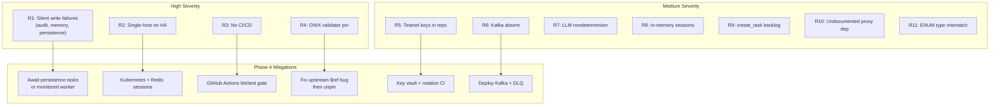

# Risks and Limitations

This document classifies every confirmed technical risk and current limitation of the
Procurement Agent on Beckn Protocol system as it stands at the end of Phase 3. Risks are
things that could cause failures or security incidents in the current code. Limitations are
deliberate scope deferrals or structural constraints that restrict how the system can be
deployed or used. Only claims backed by code inspection or first-hand documentation are
included; inferred conclusions are marked.

---

## Part A: Technical Risks

### Summary Table

| # | Risk | Severity | Area |
|---|------|----------|------|
| R1 | Fire-and-forget persistence with no observability | **High** | Reliability |
| R2 | Single-host Docker Compose — no HA, no auto-recovery | **High** | Reliability |
| R3 | No CI/CD pipeline — regressions not automatically caught | **High** | Process |
| R4 | ONIX schema validator pinned to stale commit | **High** | Protocol integrity |
| R5 | Ed25519 testnet keys committed to config YAMLs | **Medium** | Security |
| R6 | Kafka absent — notification and ERP events silently degrade | **Medium** | Reliability |
| R7 | LLM nondeterminism in BecknIntent extraction | **Medium** | Correctness |
| R8 | In-memory orchestrator sessions lost on container restart | **Medium** | Reliability |
| R9 | asyncio.create_task accumulation — no backpressure | **Medium** | Performance |
| R10 | claude_openai_proxy is an undocumented host-side hard dependency | **Medium** | Ops |
| R11 | ENUM types in schema use spec-era model names — inserts will fail | **Medium** | Data integrity |
| R12 | sim-bpp AND-token over-filtering on multi-noun queries | **Low** | Correctness |
| R13 | No container image vulnerability scanning | **Low** | Security |

---

### R1 — Fire-and-forget persistence with no observability

**Severity: High**

Every write to PostgreSQL that originates inside the orchestrator pipeline runs as
`asyncio.create_task(...)` and is never awaited. The tasks call `_persist_memory`,
`_persist_audit`, and `_persist()` (the data-normalizer persistence bridge). If any of
these tasks raises an unhandled exception the failure is logged at DEBUG level and swallowed;
the HTTP response to the caller already has `status: "live"` and carries no indication that
persistence failed.

This applies to:
- All 13 audit trail write sites in `workflow.py`
  (Source: services/orchestrator/src/workflow.py -- Confidence: High)
- All agent memory writes after a confirmed order
  (Source: services/orchestrator/src/workflow.py lines 602-749 -- Confidence: High)
- The ERP outbox worker — `_persist_order_to_erp()` is fire-and-forget
  (Source: services/orchestrator/README.md -- Confidence: High)

The `kafka_offset` column on `audit_trail_events` is hardcoded to `0` with the comment
`TODO(kafka): real offset when topic is wired`.
(Source: services/orchestrator/src/workflow.py -- Confidence: High)

**Residual exposure**: Audit trail gaps are a SOX 404 compliance risk. Memory gaps cause
silent loyalty-score regression for previously seen suppliers. Neither gap is surfaced to the
buyer or to any monitoring channel.

**Mitigation needed**: Await persistence tasks (or promote them to a
monitored background worker with a dead-letter queue) before returning the HTTP response.

---

### R2 — Single-host Docker Compose

**Severity: High**

All 18 services run on a single host via `docker-compose.yml`. There is no container
orchestrator, no liveness-driven restart policy beyond Docker's own `restart: unless-stopped`
default, and no redundant instances of any service.
(Source: docker-compose.yml -- Confidence: High)

A single host failure or OOM kill brings down the entire stack. Redis has no replica; its loss
destroys all in-flight Beckn discovery callbacks. PostgreSQL runs natively on the host outside
Docker (`DB_HOST=host.docker.internal`); its loss halts all persistence, analytics, ERP sync,
and memory operations simultaneously.
(Source: .env.example, docker-compose.yml -- Confidence: High)

**Residual exposure**: Zero availability during host maintenance, crash recovery, or planned
deployments. Kubernetes (EKS/AKS) is explicitly scoped to Phase 4.
(Source: KnowledgeBase/project_scaffold/implementation_deviations.md -- Confidence: High)

---

### R3 — No CI/CD pipeline

**Severity: High**

There is no automated test run on push, no lint gate, no Docker image build check, and no
integration test harness in CI. All deployments are manual `docker compose up --build`.
(Source: KnowledgeBase/project_scaffold/implementation_deviations.md -- Confidence: High)

The following services have zero pytest-discoverable tests: `catalog-normalizer`,
`analytics`, `beckn-bap-client`, `mcp-sidecar`, `intention-parser` (Docker wrapper),
`erp-mock`. The `erp-adapter` contract test (`test_contracts.py`) is a standalone Python
script that exits with code 1 on regression but cannot be discovered by `pytest`.
(Source: code_findings gap 15 -- Confidence: High)

**Residual exposure**: Any refactor or dependency upgrade can break a service silently. The
system's 67 database tests and 129 Bap-1 unit tests are the only automated regression gates,
and neither is wired to a check that blocks merges.

---

### R4 — ONIX schema validator pinned to stale commit

**Severity: High**

`config/README.md` explicitly documents that the ONIX schema validator binary inside the
`fidedocker/onix-adapter` image is pinned to commit `d43ec30d` because later commits
introduced a `$ref` resolution bug in `SignatureHeader` / `AckSignatureHeader`. This means
the stack cannot be upgraded to receive upstream security patches or bug fixes without first
resolving that `$ref` bug.
(Source: config/README.md -- Confidence: High)

The pin also means that any future Beckn schema evolution will not be picked up automatically,
potentially allowing invalid wire payloads to pass validation.

**Mitigation needed**: Reproduce the `$ref` resolution bug in isolation, open a bug report or
fix upstream, then upgrade and re-run the full Beckn lifecycle smoke test before removing the
pin.

---

### R5 — Ed25519 testnet keys committed to config YAMLs

**Severity: Medium**

`config/generic-routing-BAPCaller.yaml` and `config/generic-routing-BPPCaller.yaml` contain
the testnet sandbox ED25519 private key material. `config/README.md` lists three-step
production rotation instructions but notes that no automation or CI check enforces key
freshness.
(Source: config/README.md -- Confidence: High)

**Residual exposure**: Any developer with repo read access — including any future GitHub
Actions runner with access to the repo — can read the signing keys. On a real Beckn network
these keys would be used to impersonate the BAP. In the current local/dev context the
exposure is low because the keys are sandbox-only.

---

### R6 — Kafka absent — notification and ERP events silently degrade

**Severity: Medium**

`docker-compose.yml` includes a Kafka broker service (`apache/kafka:latest`, KRaft mode,
port 9092) with a healthy check. However, three services that depend on it show degraded
behavior when Kafka is unavailable:

- `notification-dispatcher` will not start its consumer loop if `KAFKA_BOOTSTRAP` is empty or
  unreachable; no notifications are sent and no error is surfaced to the buyer.
  (Source: services/notification-dispatcher/README.md -- Confidence: High)
- `sim-bpp` auto-advance lifecycle (`SIM_BPP_AUTO_ADVANCE=true` is the docker-compose default)
  publishes each state transition to Kafka topic `po.status.changed`; if Kafka is unavailable
  these transitions are silently dropped.
  (Source: docker-compose.yml, services/sim-bpp/README.md -- Confidence: High)
- `erp-adapter` webhook fan-out attempts to publish to `po.status.changed` after each ERP
  webhook; failure is logged but the event is discarded, breaking the notification chain.
  (Source: services/erp-adapter/README.md -- Confidence: High)

**Residual exposure**: In a dev environment where Kafka has not started or its readiness probe
has not cleared, the three services that depend on it will behave as if the downstream
integrations do not exist — without any visible error.

---

### R7 — LLM nondeterminism in BecknIntent extraction

**Severity: Medium**

Stage 1 (intent classification) and Stage 2 (BecknIntent extraction) both call Ollama with
`qwen3:8b` or `qwen3:1.7b`. Both use `instructor` with `mode=Mode.JSON` and
`max_retries=3`. Despite structured output constraints, LLM responses are statistically
non-deterministic: the same query can produce different `delivery_timeline` values (hours
vs days unit confusion), different `location_coordinates` (geocoding error), or a different
`quantity` on repeat runs.
(Source: IntentParser/README.md -- Confidence: High)

The system has no replay-based deduplication or result hashing; each `/parse` call creates a
new `parsed_intents` row even if the extraction result is identical.

**Residual exposure**: Silent procurement misrouting (wrong timeline → wrong fulfillment
window; wrong quantity → wrong budget gate). These failures will not raise HTTP errors.

---

### R8 — In-memory orchestrator sessions lost on container restart

**Severity: Medium**

The orchestrator stores the compare/commit two-phase session in a plain Python `dict`
(`_sessions`, line 98 of `workflow.py`) with a 30-minute TTL and lazy eviction. A container
restart drops all in-flight sessions, causing all pending `/commit` calls to return
`404 session_not_found`.
(Source: services/orchestrator/src/workflow.py -- Confidence: High)

Bap-1 has the same problem: `TransactionSessionStore` uses `InMemoryBackend` only; the
`StateBackend` Protocol swap point for `PostgresBackend` is explicitly marked
`TODO(persistence)`.
(Source: Bap-1/src/agent/session.py -- Confidence: High)

**Residual exposure**: Any rolling deploy, OOM kill, or scheduled container restart during
active procurement sessions causes those sessions to be abandoned silently (the buyer sees
a 404 with no retry guidance).

---

### R9 — asyncio.create_task accumulation under high load

**Severity: Medium**

Every confirmed order fires `asyncio.create_task(_persist_memory(...))` and up to 13
`asyncio.create_task(_persist_audit(...))` calls without storing task references. In Python's
asyncio event loop, un-referenced tasks that raise exceptions emit a
`Task exception was never retrieved` warning and are garbage-collected without failing the
request. Under load, hundreds of tasks can queue inside the event loop, delaying other
awaitable operations.
(Source: services/orchestrator/src/workflow.py -- Confidence: High)
(Inferred: performance degradation pattern under sustained load)

**Mitigation needed**: Store task references in a bounded set with a completion callback that
removes them; add a semaphore to cap in-flight persistence tasks.

---

### R10 — claude_openai_proxy is an undocumented host-side hard dependency

**Severity: Medium**

`negotiation-engine` and `demo-gateway` both depend on a running process at
`host.docker.internal:8012` (`NEGOTIATION_OPENAI_BASE_URL`, `OLLAMA_BASE_URL`). This
process is `services/claude_openai_proxy/` — a FastAPI service that wraps the local
`claude` CLI binary as an OpenAI-compatible endpoint. It is not a Docker container (it is
explicitly loopback-only in dev mode), not defined in `docker-compose.yml`, and is entirely
absent from `CLAUDE.md`.
(Source: services/claude_openai_proxy/config.py, docker-compose.yml lines 462-464, 517 -- Confidence: High)

If this process is not running, both `POST /negotiate` (autonomous negotiation) and
`POST /api/demo/negotiate/{thread_id}/supplier-respond` (SupplierAgent) fail with a
connection refused error. Because the `negotiation-engine` container's readiness probe
(`GET /readyz`) does not verify connectivity to the proxy, the container reports healthy even
when this dependency is missing.
(Source: services/negotiation_engine/README.md, services/claude_openai_proxy/README.md -- Confidence: High)

---

### R11 — ENUM types in the database schema use spec-era model names

**Severity: Medium**

`database/sql/00_extensions_and_types.sql` defines `embedding_model_type` as:

```sql
CREATE TYPE embedding_model_type AS ENUM (
    'text-embedding-3-large',
    'e5-large-v2'
);
```

Neither `all-MiniLM-L6-v2` (used by data-normalizer for BPP cache) nor
`BAAI/bge-small-en-v1.5` (used by data-normalizer for agent memory) appears in this ENUM.
`database/sql/15_agent_memory_vectors.sql` declares the column as
`embedding_model embedding_model_type NOT NULL DEFAULT 'text-embedding-3-large'`.

Migration `22_agent_memory_vector_dim.sql` adds `'all-MiniLM-L6-v2'` via `ALTER TYPE ... ADD
VALUE` but does NOT update the column default. `BAAI/bge-small-en-v1.5` is not added by any
migration file.
(Source: database/sql/00_extensions_and_types.sql, database/sql/15_agent_memory_vectors.sql, database/sql/22_agent_memory_vector_dim.sql -- Confidence: High)

Similarly, `ai_provider_type` ENUM contains only `'openai'` and `'anthropic'`; `'ollama'` is
absent. Any model governance record insert for an Ollama-hosted model will fail at the DB
constraint.

**Residual exposure**: On a fresh schema deployment, data-normalizer's memory write endpoint
will fail with PostgreSQL error `invalid input value for enum embedding_model_type` until
migration 22 is applied and the code uses only the value added there. The `BAAI/bge-small-en-v1.5`
insert path has no migration to rely on.

---

### R12 — sim-bpp AND-token over-filtering on multi-noun queries

**Severity: Low**

sim-bpp tokenizes the discovery query and applies AND-logic: every non-filler token must
match at least one catalog item's name or keywords. For broad queries like
`"office supplies and networking cable"` the AND condition causes zero results because no
single item matches all tokens from both categories simultaneously.
(Source: services/sim-bpp/README.md -- Confidence: High)

In a dev environment where sim-bpp is the only BPP, this results in a valid but empty
`on_discover` response, which triggers the `not_found` recovery path in IntentParser Stage 3.

---

### R13 — No container image vulnerability scanning

**Severity: Low**

No Trivy or equivalent scanner is configured in the repository. The `fidedocker/onix-adapter`
image (used for both `onix-bap` and `onix-bpp`) is pinned to the `latest` tag at pull time,
meaning the Go adapter's base image dependency tree is never scanned.
(Source: KnowledgeBase/project_scaffold/implementation_deviations.md -- Confidence: High)

---

## Part B: Current Limitations

### Summary Table

| # | Limitation | Impact | Evidence | Phase target |
|---|-----------|--------|----------|-------------|
| L1 | No horizontal scaling — sessions are in-process | Active sessions lost on restart or redeploy | services/orchestrator/src/workflow.py | Phase 4 |
| L2 | No persistent WebSocket — status polling only | 30s polling interval on Kafka failure | services/orchestrator/README.md | Phase 4 |
| L3 | No auth on internal service-to-service calls | Any process on beckn_network can call any service | docker-compose.yml | Phase 4 |
| L4 | ERP adapter cancel_po is NotImplementedError | PO cancellation silently drops on SAP/Oracle | services/erp-adapter/ | Phase 4 |
| L5 | mTLS to SAP/Oracle wired but not activated | Traffic to ERP is plaintext HTTP in dev | services/erp-adapter/README.md | Phase 4 |
| L6 | No data retention enforcement | retention_until column populated but never acted on | database/sql/14_audit_trail_events.sql | Phase 4 |
| L7 | No Splunk/SIEM export | splunk_indexed column populated but no exporter | services/data-normalizer/README.md | Phase 4 |
| L8 | No model governance pipeline | schema exists but no evaluation or drift CI | services/ComparativeAndScoreing/README.md | Phase 4 |
| L9 | Frontend missing App Router boundaries | No error/loading/not-found pages; unhandled rejections show blank page | frontend/README.md | None scheduled |
| L10 | Zero frontend tests | Regressions in UI are invisible | frontend/CLAUDE.md | Phase 4 |
| L11 | analytics returns HTTP 503 on DB unavailable | Dashboard goes dark instead of serving stale data | services/analytics/README.md | None scheduled |
| L12 | Bap-1 role confusion | Engineers may treat it as production code | Bap-1/README.md, memory notes | Documented gap |
| L13 | Recovery flow stubs never implemented | No demand logging, no buyer notification, no RFQ on not_found | IntentParser/recovery.py | Unowned |
| L14 | COMPLEX_MODEL collapsed to qwen3:1.7b in Docker | Dockerized intent parser never uses 8b model | docker-compose.yml | None scheduled |
| L15 | No Keycloak/Phase Two setup guide | Frontend unusable without external IdP | frontend/src/lib/auth.ts | Documented gap |
| L16 | Negotiation audit trail gap | negotiate event_type never written by orchestrator | services/orchestrator/src/workflow.py | None scheduled |
| L17 | 14 Bap-1 production blockers unaddressed | Reference implementation diverges from production services | Bap-1/docs/ARCHITECTURE.md §7 | Phase 2-4 |

---

### L1 — No horizontal scaling

The orchestrator stores the compare/commit session, pending approvals, ERP state cache, order
enrichments, and run-id index in five separate Python `dict` objects at module scope
(`_sessions`, `_pending_approvals`, `_erp_state_cache`, `_order_enrichments`,
`_run_id_index`, `workflow.py` lines 98–123). These are process-local; no Redis-backed or
database-backed session store is wired.
(Source: services/orchestrator/src/workflow.py -- Confidence: High)

Consequence: running two orchestrator replicas behind a load balancer would result in half of
all `/commit` calls hitting the wrong replica and returning `404 session_not_found`. The
`SESSION_TTL = 1800` (line 100) is the only eviction mechanism.

---

### L2 — No persistent WebSocket — status polling only

The orchestrator exposes `GET /ws/status/{txn_id}` as a WebSocket endpoint, but the
`Bap-1/docs/ARCHITECTURE.md §7.4` blocker #11 (`TODO(realtime-ws)`) documents that this is
unimplemented in the production orchestrator; `StatusPoller.tsx` in the frontend polls via
HTTP every 30 seconds on Kafka failure.
(Source: Bap-1/docs/ARCHITECTURE.md §7 -- Confidence: High)

On a Kafka outage the Kafka consumer loop in the orchestrator stops broadcasting status
updates; the frontend falls back to manual polling, and the "Live" indicator on the order
tracking page changes to "Polling every 30s".

---

### L3 — No auth on internal service-to-service calls

All inter-service HTTP calls on the `beckn_network` Docker bridge are unauthenticated. Any
container that joins the network can call any service endpoint without a bearer token, API
key, or mTLS certificate. The only exceptions are:

- `erp-adapter` enforces `Authorization: Bearer ${ERP_INTERNAL_TOKEN}` on its `/api/v1/*`
  routes. The default token value is `dev-internal-token-CHANGE_ME`.
  (Source: services/erp-adapter/README.md -- Confidence: High)
- `mcp-sidecar` requires `BAP_API_KEY` at startup (refuses to start without it) but only uses
  it for the outbound call to beckn-bap-client, not as inbound auth.
  (Source: services/mcp-sidecar/README.md -- Confidence: High)

This is a deliberate Phase 1-3 scope deferral; full mTLS between services is documented as a
Phase 4 hardening item.
(Source: KnowledgeBase/project_scaffold/implementation_deviations.md -- Confidence: High)

---

### L4 — ERP adapter cancel_po raises NotImplementedError

`ERPAdapter` is a Protocol with six required methods. The SAP and Oracle adapter
implementations raise `NotImplementedError` for `cancel_po` and `update_po`.
(Source: services/erp-adapter/README.md -- Confidence: High)

Because the orchestrator's cancel handler (`PATCH /cancel`) calls `_cancel_erp_record()` via
fire-and-forget, this `NotImplementedError` is silently swallowed. The PO status is patched
to `cancelled` in the local PostgreSQL but the SAP or Oracle system never receives a
cancellation instruction.

---

### L5 — mTLS to SAP/Oracle wired but not activated

`erp-adapter` has an SSL context hook in its HTTP client layer specifically for mTLS client
certificate auth to SAP S/4HANA and Oracle ERP Cloud REST endpoints. The hook is wired but
the actual certificate material is not configured; all ERP adapter traffic in dev is plain
HTTP.
(Source: KnowledgeBase/project_scaffold/implementation_deviations.md -- Confidence: High)

---

### L6 — No data retention enforcement

Every row in `audit_trail_events` has a `retention_until` column computed as
`event_timestamp + INTERVAL '7 years'` (SOX 404 / GDPR / IT Act 2000). No nightly
DELETE or archival job reads this column. Data accumulates indefinitely in PostgreSQL;
events past their retention window are never purged and never moved to cold storage.
(Source: database/sql/14_audit_trail_events.sql, KnowledgeBase/project_scaffold/components/audit_trail_system.md -- Confidence: High)

---

### L7 — No Splunk or SIEM export

`audit_trail_events` has a `splunk_indexed BOOLEAN NOT NULL DEFAULT FALSE` column. There
is no Kafka Splunk sink, no Splunk HEC forwarder, and no ServiceNow batch consumer. The
column is written by the data-normalizer but never read by any export process.
(Source: services/data-normalizer/README.md, KnowledgeBase/project_scaffold/implementation_deviations.md -- Confidence: High)

---

### L8 — No model governance pipeline

`model_governance_records` table exists in PostgreSQL (migration `16_model_governance_records.sql`)
with columns for `model_name`, `model_version`, `evaluation_date`, `accuracy_score`,
`status`, and `drift_flag`. No weekly evaluation suite, no LangSmith trace wiring, and no
GitHub Actions job populates this table. The schema is a forward-looking placeholder.
(Source: services/ComparativeAndScoreing/README.md -- Confidence: High)

The `validation-service` sub-container in the `ComparativeAndScoreing` MLOps stack writes
NDCG@5 drift results to `/tmp/model_drift_detected.flag` but does not write to
`model_governance_records`. The `model_governance_records` table and the MLOps validation
service are not connected.

---

### L9 — Frontend missing App Router boundaries

The Next.js 13 App Router requires `loading.tsx`, `error.tsx`, and `not-found.tsx` files in
each route segment to handle loading states, runtime errors, and 404s. None of these files
exist anywhere in `frontend/src/app/`.
(Source: frontend/README.md, frontend/CLAUDE.md -- Confidence: High)

An uncaught error in any React Server Component renders a blank page with a stack trace
exposed to the user.

---

### L10 — Zero frontend tests

There are no Jest, Vitest, or Playwright tests of any kind in the `frontend/` directory. UI
regressions introduced by dependency upgrades or component changes are invisible until a
human reviewer notices them.
(Source: frontend/CLAUDE.md -- Confidence: High)

---

### L11 — analytics returns HTTP 503 on DB unavailable

When the `analytics` service cannot acquire a PostgreSQL connection pool it returns
`HTTP 503` with body `{"error": "database unavailable"}` for all three endpoints
(`/analytics`, `/business-impact`, `/benchmark`). There is no stale-data cache, no
degraded-mode response, and no fallback mock. The frontend dashboard goes dark.
(Source: services/analytics/README.md -- Confidence: High)

---

### L12 — Bap-1 role confusion

`Bap-1/` is a standalone BAP monolith that predates the microservices split. It is not in
`docker-compose.yml`, not called by any service, and is not part of the production stack.
However, it has its own `CLAUDE.md`, a detailed `README.md` that describes it as a live
service, and 129 passing unit tests. Engineers encountering the repo for the first time
frequently mistake it for the production BAP layer.
(Source: Bap-1/README.md, memory/project_structure.md -- Confidence: High)

The production BAP functions are distributed across `beckn-bap-client` (Beckn protocol
calls), `orchestrator` (pipeline orchestration), and `data-normalizer` (persistence). Bap-1
is reference documentation only.

---

### L13 — IntentParser recovery flow stubs never implemented

When Stage 3 returns `not_found` the recovery path in `IntentParser/recovery.py` calls three
stub functions:

- `log_unmet_demand` — logs to stdout with prefix `UNMET_DEMAND`, no DB write
- `notify_buyer_no_stock` — logs to stdout with prefix `BUYER_NOTIFY`, no notification service call
- `trigger_open_rfq_flow` — logs to stdout with prefix `OPEN_RFQ`, no RFQ microservice call

The module docstring (lines 1–6) explicitly says "replace stubs with real integrations as
infrastructure is provisioned." No owner is assigned in any KnowledgeBase file.
(Source: IntentParser/recovery.py -- Confidence: High)

---

### L14 — COMPLEX_MODEL collapsed to qwen3:1.7b in the Docker deployment

`IntentParser/config.py` defaults `COMPLEX_MODEL` to `qwen3:8b`. The complexity-routing
logic in `IntentParser/orchestrator.py` selects the 8b model for queries longer than 120
characters or with two or more numeric tokens. However, `docker-compose.yml` injects
`COMPLEX_MODEL=qwen3:1.7b` for the `intention-parser` service, collapsing both routing
branches to the lightweight model.
(Source: IntentParser/config.py, docker-compose.yml lines 14-15 -- Confidence: High)

This means the dockerized service never uses the larger, higher-accuracy model regardless of
query complexity. The local development path (running IntentParser outside Docker) behaves
differently from the containerized deployment. No comment in `docker-compose.yml` documents
the rationale.

---

### L15 — No Keycloak or Phase Two setup guide

The frontend's `auth.ts` imports only `KeycloakProvider` with no credentials-based fallback.
All three required env vars (`KEYCLOAK_CLIENT_ID`, `KEYCLOAK_CLIENT_SECRET`,
`KEYCLOAK_ISSUER`) use the non-null assertion operator; the app will throw at startup if any
is absent.
(Source: frontend/src/lib/auth.ts -- Confidence: High)

The actual provider is Phase Two (`phasetwo.io`) hosted Keycloak at
`euc1.auth.ac/auth/realms/procurement-agent`. A developer cloning the repository cannot
authenticate to the Next.js frontend without:

1. A Phase Two account and the `procurement-agent` realm configured
2. A `procurement-frontend` client (confidential, standard flow)
3. A realm roles mapper with "Add to ID token: ON" for roles `admin`, `approver`, `requester`
4. At least one user account with a role assignment

None of these steps are documented anywhere in the repository. The
`KnowledgeBase/integrations/identity_access_keycloak.md` file describes Keycloak at an
architecture level but contains no setup instructions for the specific Phase Two configuration
in use.
(Source: frontend/src/lib/auth.ts, frontend/.env.example -- Confidence: High)

---

### L16 — Negotiation audit trail gap

The `audit_event_type` ENUM contains the value `negotiate`. The orchestrator's
`_run_autonomous_negotiation` function (workflow.py lines 602–749) does not call
`_persist_audit` at any point. Negotiation outcomes (agreed price, rounds taken, final
discount) are appended to `result['messages']` only, not to `audit_trail_events`.
(Source: services/orchestrator/src/workflow.py -- Confidence: High)

This means a fully auditable decision chain reconstructable from `audit_trail_events` alone
(required for SOX 404 compliance per the Phase 3 acceptance checklist) is broken whenever
autonomous negotiation runs: the scoring stage is audited, the confirm stage is audited, but
the negotiation step between them is invisible in the audit trail.

---

### L17 — 14 Bap-1 production blockers

`Bap-1/docs/ARCHITECTURE.md §7` lists 14 named production blockers grouped into four
categories. Five have grep-able `TODO(...)` markers in Bap-1 source code; nine exist only in
the architecture document.

```
§7.1 Protocol & network (4 items)
  #1  TODO(beckn-v2.1-context) — delivery detail omitted in /init            → Phase 3-4
  #2  DeDi registry subscriber not registered                                 → Phase 4
  #3  Ed25519 dev keys / no KMS                                               → Phase 4
  #4  Local discovery service shortcut                                        → Phase 3

§7.2 Data & business logic (4 items)
  #5  Hardcoded catalog in Bap-1 (A4 paper only)                             → Phase 2 (teammate)
  #6  TODO(persistence) — InMemoryBackend only in session.py                 → Phase 2 (teammate)
  #7  TODO(comparison-engine) — cheapest-wins only in nodes.py               → Phase 2 (teammate)
  #8  COD-only payment (no EFT/NEFT/other)                                   → Phase 3

§7.3 Security & access (2 items)
  #9  Stub users with cleartext passwords / no Keycloak                      → Phase 4
  #10 TODO(approval-workflow) — no approval gate in server.py::commit        → Phase 2 (teammate)

§7.4 Observability & ops (4 items)
  #11 TODO(realtime-ws) — 30s HTTP polling / no WebSocket push               → Phase 2 (teammate)
  #12 No structured audit trail / Kafka→Splunk                               → Phase 3
  #13 No CI/CD                                                                → Phase 4
  #14 Local Ollama / no managed LLM service                                  → Phase 3-4
```

(Source: Bap-1/docs/ARCHITECTURE.md §7 -- Confidence: High)

Items #1, #6, #7, #9, #11 map to analogous open issues in the production microservices stack.
The others are Bap-1-specific.

---

## Risk / Mitigation Priority Map



---

## Cross-Reference: Limitations Requiring Immediate Attention Before Production

The following limitations are **not** scoped to Phase 4 and have no owner assigned. They
should be addressed before the system handles real procurement data:

| Limitation | Risk if unaddressed | Suggested fix |
|-----------|-------------------|---------------|
| L6 — No retention enforcement | GDPR and IT Act 2000 violation if PII data is retained past 7 years | Add nightly PostgreSQL job or pg_cron entry |
| L7 — No SIEM export | SOX 404 audit trail requirement incomplete | Wire Kafka→Splunk consumer or batch exporter |
| L13 — Recovery stubs | Buyers receive no feedback on unmet demand | Implement at minimum `notify_buyer_no_stock` via notification-dispatcher |
| L16 — Negotiation audit gap | SOX 404 decision chain is broken for any order with autonomous negotiation | Add `_persist_audit` calls inside `_run_autonomous_negotiation` |
| R11 — ENUM type mismatch | `BAAI/bge-small-en-v1.5` memory inserts will fail on schema builds missing migration 22 | Add migration that adds missing ENUM values and updates column default |
| L15 — No IdP setup guide | New developers cannot run the frontend | Document Phase Two realm creation and client configuration |
